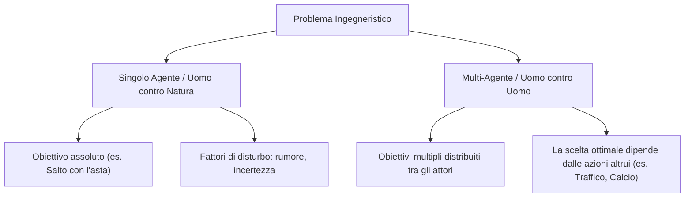
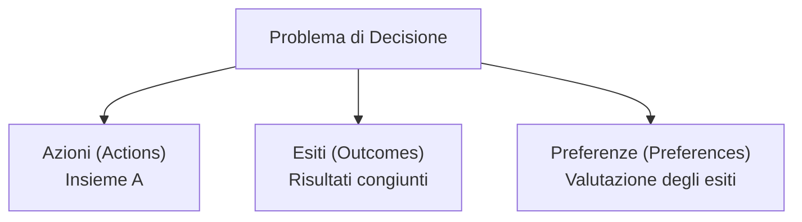
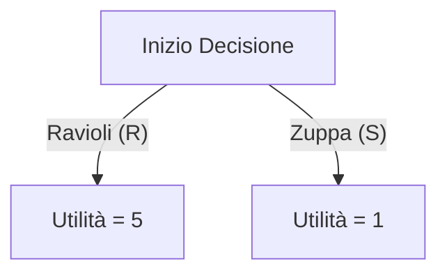
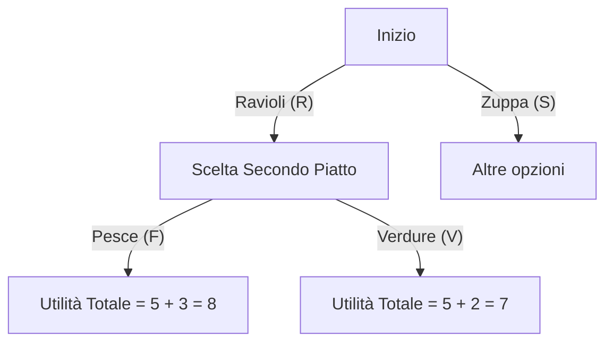

# Introduzione al Corso e Logistica (Game Theory)

## Overview Didattica
La lezione iniziale del corso di Teoria dei Giochi (*Game Theory*) si concentra principalmente sugli aspetti amministrativi, organizzativi e logistici. Vengono censiti i corsi di provenienza degli studenti (Ingegneria Informatica, ICT per Internet e Multimedia, Cybersecurity, e altri) e viene chiarita la distinzione burocratica fondamentale rispetto ad altri corsi omonimi tenuti da altri docenti (Prof.ri Marchioro e Borra), indirizzati a Corsi di Studio differenti come Ingegneria dei Sistemi di Controllo, Data Science o Ingegneria Matematica. Il docente, il Prof. Leonardo Badia, presenta il proprio background di ricerca incentrato sulla modellizzazione matematica applicata alle reti wireless, epidemiologia e social networking, fornendo inoltre le linee guida per le comunicazioni via email e le modalità di erogazione delle lezioni future (tramite registrazioni anticipate e sessioni interattive).

---

### Introduzione Logistica e Struttura del Corso

Benvenuti al corso di **Teoria dei Giochi** (*Game Theory*). Questa sezione iniziale è dedicata esclusivamente agli aspetti logistici, organizzativi e alla struttura della didattica.

#### Presentazione del Docente e Contatti

Il docente responsabile di questo corso è il Professor **Leonardo Badia**. 
* **Email di contatto**: `leonardo.badia@gmail.com` oppure l'indirizzo istituzionale `@unipd.it`. 
* *Nota sulla comunicazione*: Entrambi gli indirizzi convergono nella stessa casella di posta. Se non ricevete una risposta immediata, non preoccupatevi: spesso si tratta di un sovraccarico di email. Il docente incoraggia a essere pazienti ma anche persistenti, non esitando a mandare un secondo o terzo sollecito in caso di mancata risposta.

Gli interessi di ricerca del docente riguardano principalmente la modellizzazione matematica applicata alle reti wireless (*wireless networks*), ambito in cui la Teoria dei Giochi trova larghissimo impiego. Altri interessi includono l'epidemiologia digitale, le reti sociali (*social networking*) e l'elaborazione numerica dei segnali (*digital signal processing*).

---

#### La Gestione Burocratica dei Corsi (Attenzione agli Smistamenti)

Un **Concetto Chiave** fondamentale riguarda la distinzione tra i corsi di Teoria dei Giochi attivati presso il Dipartimento di Ingegneria dell'Informazione. Esistono infatti due insegnamenti paralleli:

1. **Game Theory** (tenuto dal Prof. Leonardo Badia) — Rivolto agli studenti di Ingegneria Informatica (*Computer Engineering*), ICT per Internet e Multimedia, e Cybersecurity.
2. **Game Theory and Strategic Behavior** (tenuto dai Professori Marchioro e Borra) — Rivolto agli studenti di Ingegneria dei Sistemi di Controllo (*Control Systems Engineering*), Data Science, Ingegneria Matematica (*Mathematical Engineering*), Informatica (*Computer Science*) e ICT for Life and Health.

> **Importante / Avviso per l'Esame**: Dal punto di vista dei contenuti, i due corsi sono praticamente identici, seguono lo stesso programma e si tengono nelle stesse date. Tuttavia, **la separazione è tassativa per motivi burocratici**. Gli studenti devono assolutamente frequentare, iscriversi alla pagina Moodle corretta e registrare l'esame con i docenti ufficialmente assegnati al proprio piano di studi. Seguire il corso sbagliato causerà inevitabilmente problemi amministrativi e di registrazione del voto.

---

#### Modalità di Erogazione delle Lezioni

Il corso prevede una modalità mista che alterna lezioni in presenza in aula e lezioni online. 

* Le lezioni vengono registrate per consentire agli studenti di rivederle in un secondo momento. 
* Trattandosi di registrazioni video che includono interazioni, chat e collegamenti in streaming, la partecipazione implica l'accettazione del trattamento della propria presenza all'interno del materiale registrato.

---

### Modalità di Svolgimento del Corso e Materiali di Studio

La frequenza alle lezioni non è obbligatoria, come da tradizione nel sistema universitario italiano. Tuttavia, la partecipazione è **fortemente raccomandata** per mantenere il passo con il programma del corso, specialmente per le attività pratiche e le discussioni sui progetti (per le quali la presenza è caldamente consigliata). L'andamento delle lezioni può essere paragonato a una serie TV: seguire gli episodi a cadenza regolare evita di accumulare lavoro e rende la comprensione molto più agevole.

#### Strumenti di Supporto e Comunicazione
* **Piattaforma Moodle**: È il punto di riferimento principale per il corso. Contiene il materiale didattico, le registrazioni video delle lezioni online e una selezione di registrazioni video degli anni passati (utili per il recupero, pur con la consapevolezza di possibili variazioni minori nei contenuti).
* **Orario di Ricevimento (Office Hours)**: Si svolge generalmente **su appuntamento**. Poiché il corso è in modalità mista, è fondamentale concordare un incontro via email prima di recarsi al dipartimento, per evitare di non trovare il docente (spesso impegnato in lezioni online da remoto). Si incoraggiano incontri di gruppo o online.
* **Forum di Discussione**: Sulla piattaforma Moodle è attivo un forum aperto. È lo strumento ideale per porre dubbi e domande, poiché consente l'interazione tra studenti, i quali possono aiutarsi a vicenda, confrontare idee e persino formare i gruppi per il progetto. Si sconsigliano domande troppo frequenti tramite canali privati, a vantaggio di uno spazio condiviso e tracciabile.

#### Calendario delle Lezioni
* **Lunedì (Online, ore 16:20)**: Lezione teorica o analisi di video preregistrati resi disponibili in anticipo. Si consiglia di seguire la scaletta temporale per non perdere il filo logico.
* **Mercoledì (In presenza, ore 14:30)**: Lezione in aula, ideale per l'interazione diretta e fisica.
* **Durata**: Circa 80 minuti continuativi, senza pause, per consentire una conclusione anticipata e agevolare gli spostamenti degli studenti.
* **Sospensioni**: Il calendario regolare proseguirà fino a dicembre, mese in cui sono previste variazioni a causa di impegni congressuali e festività, con l'obiettivo comunque di ultimare le lezioni prima di Natale.

---

### Testi di Riferimento e Materiale Didattico

Non è necessario acquistare libri specifici, sebbene esistano ottime risorse sulla Teoria dei Giochi (*Game Theory*).

1. **Testo di Tadelis**: Un manuale di riferimento eccellente, edito da Princeton, scritto con un tono accessibile e orientato agli economisti. Il docente lo integra periodicamente con passaggi matematici più rigorosi ad uso degli ingegneri. La struttura segue lo standard del corso:
   * Giochi statici (*Static Games*)
   * Giochi dinamici (*Dynamic Games*)
   * Giochi bayesiani (*Bayesian Games*)
2. **Testo del Docente (con il Prof. Marchioro)**: Raccolta di esami passati utile come mappa di riferimento per capire la tipologia degli esercizi d'esame.
   * *Concetto Chiave*: **Attenzione al reverse engineering dei testi d'esame**. Usare il libro per capire come impostare gli esercizi è corretto, ma copiare soluzioni senza notare sottili differenze nei testi d'esame porta inevitabilmente a una valutazione negativa.
3. **Slide del Corso**: Disponibili su Moodle, coprono interamente il programma, inclusi contenuti extra inseriti nel tempo dal docente.

---

### Il Progetto Obbligatorio

A partire da quest'anno, **il progetto di ricerca è obbligatorio** per poter accedere alle sessioni d'esame regolari. Consegnare un progetto vuoto o non farlo si traduce in una valutazione pari a zero punti, impedendo di fatto l'accesso agli appelli regolari.

* **Caratteristiche**: Deve essere un saggio originale di 5-8 pagine, da svolgere individualmente o in gruppi di due persone (eccezionalmente tre, in caso di complessità giustificate).
* **Tematiche**: La lista dei 12-15 argomenti ufficiali viene pubblicata entro la **prima settimana di novembre**. È possibile proporre un argomento personalizzato, ma deve essere preventivamente approvato dai docenti per garantirne la coerenza con i temi del corso. Più gruppi possono scegliere lo stesso argomento, purché sviluppato in modo differenziato.
* **Uso dell'Intelligenza Artificiale (AI)**: L'uso di strumenti come ChatGPT, Gemini o Claude per supporto (es. verifica di teoremi, stesura di simulazioni Monte Carlo o correzione linguistica) **è consentito e incoraggiato**. Tuttavia, **deve essere rigorosamente dichiarato** in un'apposita sezione del progetto. 
   * *Concetto Chiave*: **La frode e l'uso non dichiarato dell'AI**. Spacciare per proprio un lavoro interamente generato dall'AI costituisce una violazione grave, con sanzioni che vanno dalla sospensione temporanea (con conseguente perdita di borse di studio) a provvedimenti disciplinari severi gestiti dal comitato etico.

---

### Regole d'Esame e Sistema di Valutazione

Il voto finale si compone di due elementi: una **prova scritta** e la **valutazione del progetto**.

#### Struttura del Punteggio
* **Prova Scritta**: Fornisce fino a un massimo di $27$ punti. È necessario ottenere almeno **$15$ punti** per superare la parte scritta.
* **Progetto**: Fornisce un punteggio da $0$ a $9$ punti.
* **Voto Finale**: Dato dalla somma delle due componenti, deve essere **$\ge 18$** per considerare superato l'esame. Eventuali punteggi superiori a $30$ danno diritto alla lode.

#### Calendario e Scadenze delle Prove
* **Test Preliminare di Dicembre**: Fissato indicativamente per il **23 dicembre** (previa conferma dell'aula capiente). Permette di sostenere una prova scritta prima delle feste.
* **Scadenza Consegna Progetto**: Fissata tassativamente al **25 gennaio**.
* **Appelli Regolari**: 3 febbraio, 18 febbraio, 15 giugno, 27 agosto.

#### Regole di Accesso agli Appelli
1. **Regola fondamentale**: È consentito sostenersi agli appelli regolari scritti **solo dopo aver consegnato il progetto**.
2. **Eccezione per il test di dicembre**: Il test preliminare di dicembre rappresenta l'unica eccezione, permettendo di svolgere lo scritto prima di Natale.
3. **Gestione dei voti e ripetibilità**: 
   * La prova scritta può essere ripetuta tutte le volte che lo studente desidera per migliorare il voto.
   * **Il progetto può essere consegnato una sola volta**: il voto del progetto acquisito rimane quello definitivo.
   * Se si supera il test preliminare a dicembre con un voto sufficiente (es. $20/30$), lo studente può decidere di accettare tale voto consegnando un progetto vuoto ($0$ punti), oppure arricchire la valutazione finale consegnando il progetto entro la scadenza di gennaio per sommare i punti.

---

### Regolamento dei Voti, Validità del Progetto e Gestione degli Appelli

Prima di entrare nel vivo dei contenuti scientifici, vengono definiti alcuni aspetti logistici e organizzativi fondamentali per il superamento del corso:

*   **Consegna del progetto e sessioni d'esame:** Il progetto deve essere obbligatoriamente consegnato *prima* di potersi iscrivere e presentare alla prova scritta (che si tratti degli appelli di giugno o di agosto). Non è possibile sostenere lo scritto se la parte progettuale non è stata preventivamente depositata.
*   **Validità temporale del progetto:** Un progetto consegnato rimane valido per **un anno solare**. Tuttavia, le regole interne dell'Università di Padova (UNIPD) stabiliscono che la validità accademica è legata all'anno accademico (che termina ufficialmente il $1\text{°}$ ottobre). Questo significa che se si consegna il progetto ad agosto ma si fallisce l'esame scritto nello stesso mese, tecnicamente il progetto potrebbe scadere con l'inizio del nuovo anno accademico (1° ottobre), soprattutto se l'insegnamento dovesse cambiare docente o regolamento l'anno successivo.
*   **Discussione e originalità:** Non è prevista una vera e propria prova orale obbligatoria per il progetto, ma lo studente è tenuto a saperlo **giustificare e spiegare**. In caso di sospetto plagio o lavoro non originale, si procede direttamente con la segnalazione al comitato etico. Il docente si riserva inoltre la facoltà di convocare lo studente anche solo per pura curiosità o interesse verso un lavoro particolarmente valido.
*   **Date degli appelli:** Le date degli esami sono tassative e non negoziabili. Non è prevista alcuna contrattazione sui calendari d'esame.
*   **Registrazione delle lezioni:** Il docente sceglie di non registrare le lezioni in streaming o in presenza. Questa scelta è motivata dal fatto che la discussione interattiva in aula rende le registrazioni superflue e potenzialmente fuorvianti se contengono errori estemporanei. Verranno comunque forniti materiali di studio completi per la ricostruzione autonoma degli argomenti.

---

### Introduzione alla Teoria dei Giochi e Differenze con il Problem Solving Tradizionale

Si apre la parte scientifica del corso di **Teoria dei Giochi** (*Game Theory*). Spesso si cade nell'errata convinzione che, trattandosi di "giochi", il corso riguarderà i videogiochi, gli sport o il gioco d'azzardo. In realtà, la definizione matematica di un gioco prescinde da questi contesti ludici.

Un **gioco** è definito formalmente come un **problema multi-persona e multi-obiettivo** (*multi-person multi-objective problem*). L'obiettivo del corso non è studiare lo svago, ma analizzare i modelli matematici sottostanti. Trattandosi di modelli, gli ingegneri preferiscono che siano semplici e trattabili (*tractable*), evitando la complessità eccessiva di attività reali come il calcio professionistico o i videogiochi moderni.

#### Il cambio di mentalità: Uomo contro Natura vs. Uomo contro Uomo

Per capire la differenza tra l'ingegneria tradizionale e la Teoria dei Giochi, si possono confrontare due situazioni distinte:

1.  **Problema a singolo agente (Uomo contro Natura):**
    *   *Esempio:* Il salto con l'asta (*pole vault*) alle Olimpiadi.
    *   *Caratteristiche:* L'atleta ha un obiettivo chiaro (saltare oltre l'asta). Il successo dipende unicamente dalle proprie capacità e da variabili ambientali avverse (rumore, dati scarsi, incertezza). L'ingegnere o l'atleta cercano di dominare e superare la "natura". C'è una chiara dicotomia binaria: o si supera l'asta (successo) o la si fa cadere (fallimento).
2.  **Problema multi-agente (Uomo contro Uomo):**
    *   *Esempio:* Una partita di calcio tra bambini o il traffico automobilistico nell'ora di punta a Roma.
    *   *Caratteristiche:* Non esiste una soluzione univoca o una chiara divisione tra "bene e male". Se un giocatore deve tirare un rigore, la mossa ottimale dipende da cosa fa il portiere. Nel traffico urbano, la scelta di un guidatore dipende strettamente dalle traiettorie e dalle decisioni di tutti gli altri agenti (pedoni, ciclisti, altre auto). 

Questo spiega perché i piloti automatici degli aerei sono una realtà consolidata (affrontano un problema "contro la natura", seguendo una rotta isolata), mentre i sistemi di guida autonoma per le automobili incontrano enormi difficoltà nel traffico caotico: devono gestire l'interazione strategica con molteplici agenti intelligenti imprevedibili.

---

### Assunzioni Fondamentali e Criteri di un Gioco

A differenza dell'ottimizzazione multi-obiettivo tradizionale — che viene spesso risolta aggregando gli obiettivi in una combinazione lineare del tipo:

$$\text{Obiettivo Globale} = \alpha O_1 + \beta O_2 + \gamma O_3$$

nella Teoria dei Giochi ogni agente possiede un proprio obiettivo indipendente e persegue il proprio interesse. Affinché un gioco sia analizzabile matematicamente, si introducono due ipotesi fondamentali:

1.  **Regole note:** Le regole del gioco sono note a priori a tutti i partecipanti.
2.  **Razionalità dei giocatori (*Rationality*):** I giocatori sono considerati razionali, ovvero capaci di anticipare lucidamente le conseguenze delle proprie azioni.

Inoltre, un gioco matematicamente interessante richiede che **l'esito finale dipenda dalle scelte congiunte di tutti i partecipanti**. Se le azioni dei singoli non avessero alcun impatto sul risultato complessivo, il gioco sarebbe degenere e privo di interesse analitico.

---

### Applicazioni Ingegneristiche della Teoria dei Giochi

Sebbene nata nell'ambito della microeconomia e successivamente estesa alla scienza politica e alla biologia, la Teoria dei Giochi trova oggi larghissimo impiego nell'ingegneria e nelle scienze dell'informazione:

*   **Controllo di Accesso al Mezzo (*Medium Access Control - MAC*):** Nelle reti di telecomunicazione, decidere se trasmettere o meno su un canale condiviso è un classico problema di teoria dei giochi. Se troppi nodi tentano di accedere contemporaneamente, si genera una collisione (analoga a un ingranamento o a un incidente stradale in un incrocio).
*   **Protocolli di Routing e Reti di Dati:** Nell'analisi dei protocolli di instradamento si assume solitamente che i nodi intermedi (es. i nodi $C$ e $D$ lungo la rotta tra $A$ e $B$) cooperino inoltrando i pacchetti. Con un approccio di teoria dei giochi, è possibile verificare se tali nodi abbiano effettivamente l'incentivo economico o energetico a cooperare.
*   **Internet delle Cose (*IoT*) e Sistemi Multi-Agente:** Con la diffusione di dispositivi intelligenti e intelligenze artificiali agentiche (*agentic AI*), i comportamenti tendono a essere perfettamente prevedibili in termini matematici, rendendo l'applicazione della teoria dei giochi ideale per modellare interazioni complesse tra dispositivi autonomi in ambienti distribuiti.

---

### Panoramica Applicativa della Teoria dei Giochi

La teoria dei giochi (Game Theory) non si applica unicamente a contesti competitivi puri (come il classico esempio del calcio di rigore tra rigorista e portiere), ma modella anche situazioni cooperative, scenari di sicurezza informatica (information security) e protocolli di comunicazione. 

Ad esempio, nei sistemi IoT (Internet of Things) o nei protocolli di accesso al mezzo (Medium Access Control, MAC), i dispositivi reagiscono alle collisioni e al comportamento degli altri nodi. Altri ambiti di grande rilevanza includono:
- **Sicurezza e veridicità dell'informazione:** Monitorare l'impatto di agenti malevoli che violano la sicurezza o iniettano dati falsi.
- **Piattaforme online e mercati digitali:** Gestione di reputazione online, collusione, aste, social network e sistemi di voto elettronico.

---

### Concetti Economici preliminari

Prima di formalizzare i modelli, è utile introdurre alcuni concetti di base ripresi dall'economia e dai sistemi distribuiti:

* **Monopolio e Oligopolio:** 
  - Il *monopolio* si ha quando un singolo attore controlla l'intero mercato di un bene. 
  - L'*oligopolio* vede un numero limitato di attori al controllo del mercato (situazione comune nel mondo digitale odierno, dominato da pochi giganti delle telecomunicazioni, dei sistemi operativi o dell'intelligenza artificiale). La società tende a punire i monopoli tramite sanzioni per tutelare il benessere collettivo, garantendo che le decisioni di mercato seguano la "mano invisibile" di Adam Smith, a eccezione di monopoli di Stato (es. tabacco o gioco d'azzardo) finalizzati al controllo di beni potenzialmente pericolosi.
* **Beni Sostituti (Substitute Goods):** Beni la cui domanda aumenta all'aumentare del prezzo di un altro bene equivalente (es. tè e caffè, oppure camminare a piedi rispetto all'uso della benzina).
* **Fattore di Sconto (Discount Factor):** Rappresenta la svalutazione di un bene o di un guadagno nel tempo. Viene indicato con il simbolo $\delta$ (con $0 < \delta < 1$). 
  Il valore di un bene a tempo $T$ rispetto al tempo iniziale è dato da:
  $$V(T) = \delta^T$$
  Le motivazioni economiche e ingegneristiche includono l'inflazione, il logoramento del bene, la preferenza temporale immediata degli utenti (*"voglio tutto subito"*), oppure, nei contesti di networking, la probabilità che un servizio rimanga attivo e disponibile nel tempo.

---

### Elementi Fondamentali dei Problemi di Decisione

Un generico problema di decisione (*decision problem*), che si tratti di ottimizzazione a singolo agente o multi-agente, si compone sempre di tre elementi fondamentali:

1. **Azioni (Actions):** L'insieme delle scelte a disposizione degli agenti (es. scegliere se svoltare a sinistra o a destra a un bivio).
2. **Esiti (Outcomes):** Il risultato derivante dalla combinazione delle azioni scelte dai partecipanti.
3. **Preferenze (Preferences):** Il modo in cui i singoli giocatori valutano e ordinano i diversi esiti possibili.

Nei problemi multi-agente (**giochi**), l'esito non dipende unicamente dalla scelta del singolo, ma è determinato congiuntamente dalle azioni di tutti i partecipanti.

---

### Preferenze e Razionalità

#### Relazione di Preferenza
Formalmente, data una serie di alternative nell'insieme $A$, la preferenza viene indicata con il simbolo $\succcurlyeq$ (una relazione binaria simile al maggiore o uguale). Dire che un'alternativa $A$ è preferita a $B$ si scrive $A \succcurlyeq B$.

Affinché una relazione di preferenza sia definita **razionale** (equivalente a una *relazione d'ordine totale* in matematica), deve soddisfare le seguenti proprietà:
* **Riflessiva:** Ogni alternativa è preferita o indifferente a se stessa ($A \succcurlyeq A$).
* **Antisimmetrica:** Se $A \succcurlyeq B$ e $B \succcurlyeq A$, allora $A$ e $B$ sono la stessa alternativa.
* **Completa:** Per qualsiasi coppia di alternative $A$ e $B$, vale sempre o $A \succcurlyeq B$ oppure $B \succcurlyeq A$ (non è ammessa l'indecisione).
* **Transitiva:** Se $A \succcurlyeq B$ e $B \succcurlyeq C$, allora necessariamente $A \succcurlyeq C$.

#### Funzioni di Utilità (Payoffs)
Per evitare la complessità di gestire direttamente le relazioni d'ordine simboliche, in teoria dei giochi si utilizzano le **funzioni di utilità** (o *payoffs*), ovvero quantificazioni numeriche delle preferenze. 

Dato un insieme di esiti, la funzione di utilità assegna un numero reale a ciascun esito:
$$U: A \to \mathbb{R}$$

- Se un bene è quantificabile (es. quantità di un bene $Q$), la funzione di utilità $U(Q)$ è generalmente crescente, ma spesso presenta **utilità marginale decrescente** (la derivata prima è positiva, ma la derivata seconda è non-positiva, $U''(Q) \le 0$), il che significa che il valore tende a saturare (possedere 100 auto non è 100 volte meglio che possederne una).
- I valori numerici contano solo in termini di ordinamento: se $U(A) > U(B)$, l'esito $A$ è strettamente preferito a $B$. I valori assoluti non hanno un significato fisico intrinseco, a meno che non vengano legati a grandezze reali (come il *throughput* in una rete di telecomunicazioni).

> **Concetto Chiave: Razionalità e Utilità**
> Un giocatore **razionale** è un agente che possiede una propria funzione di utilità e agisce con l'obiettivo di **massimizzarla**, essendo consapevole delle conseguenze delle proprie azioni. 
> *Nota etica/comportamentale:* In questo contesto, "massimizzare la propria utilità" viene spesso definito come un comportamento *egoistico* (selfish), ma ciò non implica necessariamente un egoismo materiale: l'utilità di un individuo può comprendere il benessere altrui (es. la felicità dei propri figli). 
> Nel caso di algoritmi, IA e computer, la razionalità è totale e priva di esitazioni emotive; la vera criticità risiede nell'accuratezza del modello matematico nel predire la realtà.

Esiste un importante teorema di rappresentazione che sancisce come **una funzione di utilità rappresenta una preferenza se e solo se la preferenza è razionale**. Grazie a questo, l'analisi dei giochi si affida quasi interamente all'uso delle utilità numeriche, tralasciando le relazioni di preferenza astratte.

---

### Dalla Scelta Singola agli Alberi di Decisione

Nello studio dell'ottimizzazione e delle scelte, un concetto fondamentale è rappresentato dalla definizione delle preferenze e delle utilità associate a percorsi sequenziali. Immaginiamo una situazione comune e apparentemente banale: trovarsi alla mensa e dover scegliere cosa mangiare. 

Se ci troviamo di fronte a un bivio decisionale in cui dobbiamo scegliere tra due opzioni, ad esempio i ravioli ($R$) o la zuppa ($S$), possiamo attribuire a ciascuna opzione un valore di utilità numerico. 

In questo semplice **albero di decisione** (*decision tree*):
- Il giocatore si trova su un nodo decisionale.
- I rami rappresentano le opzioni disponibili.
- Le foglie (i nodi terminali) rappresentano le utilità finali.

Ovviamente, la scelta razionale per un singolo agente consiste nel massimizzare la propria utilità, optando per il percorso che garantisce il valore numerico maggiore (nel nostro esempio, scegliere i ravioli con utilità $5$).

#### Scelte Sequenziali e Utilità Additive

Le decisioni possono tuttavia svilupparsi su più livelli (scelte successive). Riprendendo l'esempio della mensa, dopo aver scelto il primo piatto, potremmo trovarci di fronte a una seconda scelta per il secondo piatto: pesce ($F$) o verdure ($V$). L'albero decisionale si estende aggiungendo nuovi livelli.

In questo modello, possiamo ipotizzare che le utilità siano **additive**, ovvero che l'utilità complessiva sia data dalla somma delle utilità parziali dei singoli stadi:
$$\text{Utilità Totale} = U(\text{Primo Piatto}) + U(\text{Secondo Piatto})$$

Tuttavia, **attenzione**: l'additività non è un obbligo logico o matematico. Spesso le preferenze umane non sono lineari: potremmo apprezzare i ravioli e apprezzare il pesce, ma detestare la loro combinazione. In tal caso, il valore finale non sarà la somma algebrica, ma un valore differente (potrebbe persino essere zero o un valore negativo in termini di gradimento).

### Ottimizzazione per Singolo Agente vs Giochi Multi-giocatore

Quando affrontiamo problemi di decisione a **singolo giocatore** (*single-player optimization*), dal punto di vista tecnico ci troviamo di fronte a un problema di massimizzazione. 

- **Complessità Computazionale:** Anche se un problema può essere computazionalmente complesso (ad esempio, problemi classificati come NP-completi), concettualmente la soluzione richiede "solamente" una maggiore potenza di calcolo o una ricerca esaustiva (*exhaustive search*) tra tutte le alternative possibili per individuare quella che massimizza l'utilità.
- **Collasso dell'albero:** Un albero di decisione composto da più livelli può teoricamente essere collassato in un unico livello, riducendo la scelta a un'opzione complessiva ottimale. Un singolo agente sufficientemente "intelligente" o dotato di risorse di calcolo adeguate può risolvere autonomamente questi problemi.

Le cose cambiano radicalmente quando passiamo da un contesto monopersonale a un contesto con **più giocatori** (*multiple players*), dove le scelte di un agente influenzano direttamente i payoff e le strategie degli altri.

---

> [!NOTE]
> ### Note per l'Esame e Avvisi del Docente
> - **Struttura della prova scritta:** L'esame scritto è solitamente composto da 3 esercizi con 3 domande ciascuno (3 punti per ogni risposta corretta), per un totale massimo di 27 punti. Tipicamente gli esercizi comprendono: un gioco statico, un gioco dinamico e un gioco bayesiano.
> - **Requisiti per sostenere l'esame:** È consentito sostenere l'esame scritto regolare (nelle date di febbraio, giugno o agosto) SOLAMENTE dopo aver consegnato il progetto (che è obbligatorio, sebbene possa anche essere consegnato vuoto per ottenere 0 punti). 
> - **Appello preliminare di dicembre:** È prevista una prova scritta preliminare (non ufficiale) il 23 dicembre, la quale permette di finalizzare/superare l'esame prima di Natale (con voto massimo di 27 punti dalla parte scritta).
> - **Punteggi e Superamento:** La parte scritta dà fino a 27 punti (servono almeno 15 punti per superarla). Il progetto dà da 0 a 9 punti. La somma dei due deve essere superiore o uguale a 18 per passare l'esame (con lode per punteggi superiori a 30). In alternativa, ci si può fermare al voto del test preliminare di dicembre senza fare il progetto.
> - **Validità del progetto:** Il progetto consegnato rimane valido per un anno accademico (fino al 1° ottobre successivo). In caso di fallimento dell'esame scritto ad agosto, se il corso cambia o se cambiano i professori, il progetto potrebbe non essere più ritenuto valido.
> - **Materiale di riferimento e divieti:** È fortemente sconsigliato fare "reverse engineering" copiando e incollando passatemente gli esercizi dal libro di testo agli esami, poiché vi sono differenze e si rischia la bocciatura. Non è assolutamente consentito utilizzare l'IA (es. ChatGPT) per farsi scrivere l'intero progetto; l'uso dell'IA è tollerato solo per supporto (es. correzione bozze, scrittura di simulazioni) e va obbligatoriamente dichiarato, pena il deferimento al comitato etico.