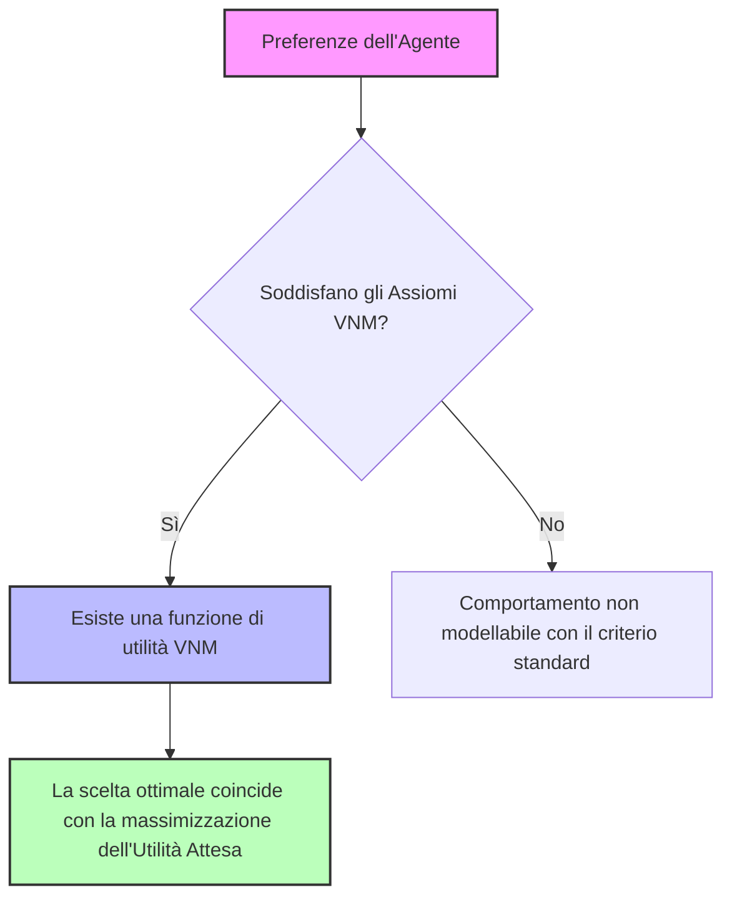
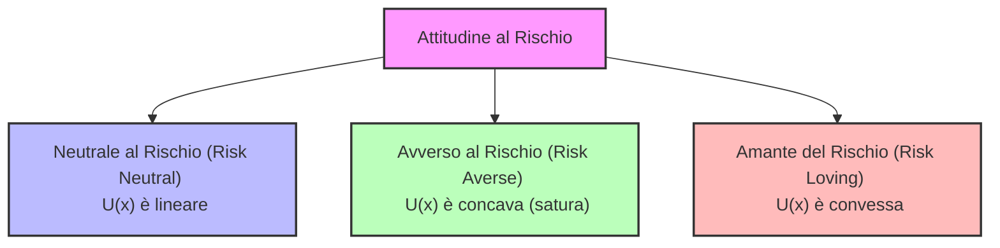
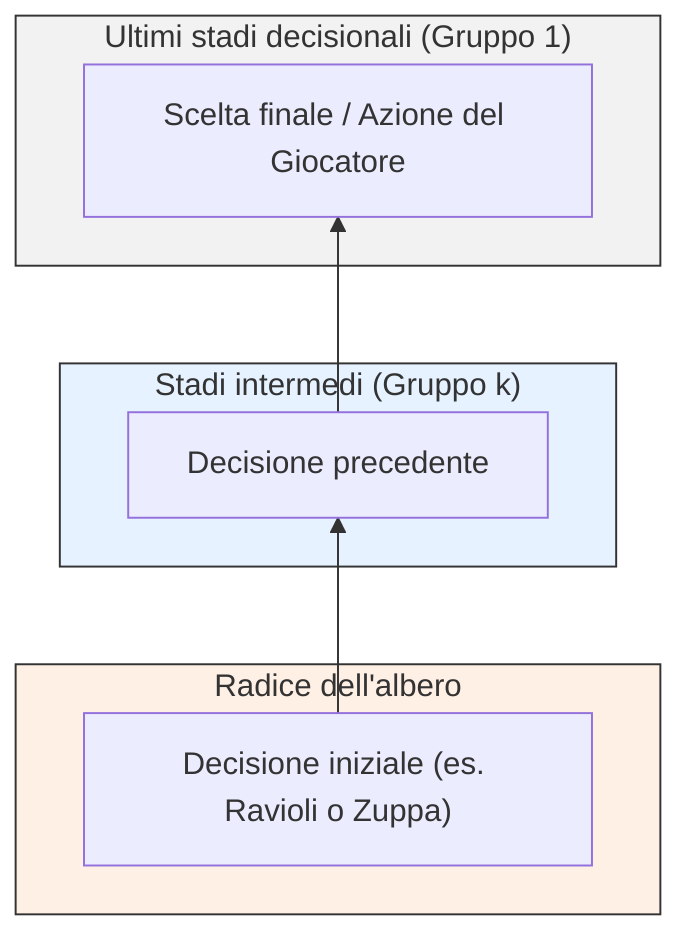
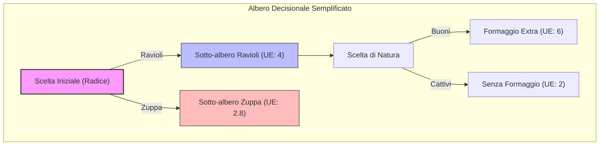

# Lezione: Teoria dei Giochi - Lotterie e Gestione dell'Incertezza

## Overview Didattica
Questa lezione introduce il concetto di **lotteria (lottery)** all'interno della Teoria dei Giochi (*Game Theory*), definita formalmente come una distribuzione di probabilità su un insieme di esiti discreti. L'obiettivo principale è fornire un metodo rigoroso per rimuovere o gestire gli elementi casuali (*random elements*) nei giochi, riconducendo situazioni incerte (come le preferenze su esiti variabili) a modelli analitici trattabili dai giocatori razionali. Vengono inoltre delineate le analogie con le variabili casuali discrete e la loro estensione teorica ai casi continui.

---

### Introduzione alle lotte e agli elementi casuali

Questa lezione rappresenta una cosiddetta "lezione plug-in" (o *plug-in lecture*): una deviazione temporanea ma utile dal percorso principale del corso che serve a colmare una specifica lacuna. L'obiettivo è capire come gestire la presenza di **elementi casuali (random elements)** all'interno dei giochi, per poi ricollegarsi al flusso principale della trattazione. 

Il motivo per cui vogliamo eliminare la casualità è semplice: la casualità è problematica nei giochi. Vogliamo poter fare previsioni affidabili sui comportamenti e sugli esiti, ma se il sistema è governato dal caso, anche le nostre previsioni lo saranno. Per questo motivo, nella teoria dei giochi tendiamo a concentrarci su contesti in cui il comportamento (e l'esito) è idealmente deterministico, lasciando da parte situazioni come il gioco d'azzardo o gli sport puri, fortemente dominati dalla componente aleatoria.

---

### Il problema della casualità: un esempio pratico

Immaginiamo di trovarci nuovamente nell'esempio della mensa universitaria. Un utente deve scegliere tra due piatti: ravioli o zuppa. 
* Se i piatti avessero esiti fissi (ad esempio, sappiamo con certezza che i ravioli sono meglio della zuppa), la scelta sarebbe banale e basata su preferenze certe.
* Tuttavia, nella realtà, la qualità è variabile. La zuppa cambia ogni giorno (può essere fatta con patate, carote, ecc.), introducendo un elemento casuale imprevedibile.

Consideriamo un esempio numerico delle utilità associate alle scelte:
* **Ravioli**: offrono un'utilità pari a $5$ nel $50\%$ dei casi (probabilità $0.5$), e un'utilità pari a $2$ nel restante $50\%$ dei casi.
* **Zuppa**: offre un'utilità pari a $1$ nella maggior parte dei casi (probabilità $0.8$), ma in rare occasioni (probabilità $0.2$) offre un'utilità eccellente pari a $10$.

Se dovessimo pagare lo stesso prezzo per entrambi i piatti, quale sceglieremmo? Confrontare due situazioni del genere significa trovarsi a scegliere tra due **lotterie** differenti. Una scelta puramente razionale fatica a trovare un criterio immediato e netto, poiché l'incertezza altera la capacità di inferire le conseguenze dirette di un'azione.

---

### Formalizzazione delle lotterie

Matematicamente, una lotteria non è altro che una **distribuzione di probabilità** definita su un insieme di esiti certi $X = \{x_1, x_2, \dots, x_n\}$. 

* In questa trattazione ci concentriamo principalmente su **variabili aleatorie discrete** (insiemi di esiti discreti $X$). 
* L'estensione alle variabili continue (tramite funzioni di densità di probabilità, *probability density functions*) segue logiche analoghe, spesso lasciate come esercizio.
* Nella pratica della teoria dei giochi, le probabilità degli esiti sono spesso condizionate dalle azioni compiute dai giocatori. Per brevità di scrittura omettiamo la condizione, ma la dipendenza dall'azione scelta resta implicita: ad esempio, consideriamo la distribuzione di probabilità subordinata al fatto di aver scelto l'azione $a$.

Un aspetto importante è che **una lotteria può anche essere degenere**: se un'opzione assegna probabilità $1$ a un unico esito certo e probabilità $0$ a tutte le altre, la lotteria collassa nel caso deterministico standard in cui a un'azione corrisponde un unico esito preciso.

---

### Il ruolo della "Natura" e i Diagrammi di Decisione

Nel gergo della teoria dei giochi, la casualità viene spesso modellata introducendo un giocatore fittizio speciale chiamato **Natura (Nature)**.

* **Cos'è la Natura?** È un giocatore non razionale i cui movimenti consistono in lanci di monete, estrazioni o qualsiasi altro meccanismo che determini un evento casuale.
* **Ordine delle mosse:** Spesso la Natura viene pensata concettualmente come un giocatore che muove prima di tutti gli altri, fissando le condizioni casuali iniziali a cui i giocatori razionali dovranno poi reagire.

All'interno di un **albero di decisione (decision tree)**, l'introduzione della casualità modifica la struttura delle scelte: il giocatore compie una scelta (es. scegliere tra ravioli o zuppa), ma successivamente interviene la Natura a determinare l'esito effettivo (es. se l'utilità sarà alta o bassa) in base alle rispettive probabilità. Di conseguenza, il giocatore si trova a dover prendere una decisione razionale *prima* di conoscere l'esito casuale determinato dalla Natura.

---

### Il Criterio delle Aspettative e i Fondamenti di von Neumann-Morgenstern

Riprendendo il problema decisionale in condizioni di incertezza (già introdotto con l'esempio dei ravioli e della zuppa), supponiamo di trovarci di fronte a delle **lotterie** (lotteries), ovvero a distribuzioni di probabilità su un insieme di possibili esiti. 

Mentre in spazi discreti la rappresentazione tramite alberi decisionali (Decision Trees) è immediata e intuitiva, la modellazione in uno **spazio continuo** (con variabili aleatorie continue) risulta più complessa dal punto di vista grafico, poiché richiederebbe un numero infinito di rami. Tuttavia, come ingegneri, dobbiamo essere capaci di ragionare sul problema e risolverlo anche in assenza di una rappresentazione visiva esplicita.

---

### La Scelta Razionale e il Limite del Valore Atteso Classico

Consideriamo una versione semplificata in cui due scelte (es. ravioli $R$ e zuppa $S$) possono portare solo a due esiti: "gustoso" o "non gustoso", con payoff associati rispettivamente a $10$ e $1$. 
Se la probabilità di ottenere un esito positivo è più alta nella lotteria $R$ rispetto alla $S$, la scelta razionale è immediata. Ma cosa accade quando cambiano sia le probabilità che i payoff numerici?

L'intuizione suggerisce di affidarsi alla media, ovvero di confrontare le **aspettative matematiche**. Tuttavia, l'uso del semplice valore atteso monetario fallisce in molte situazioni reali a causa della soggettività umana. 
* *Esempio:* Ricevere 1 € certo è preferibile per molti rispetto a una lotteria che offre 1.000 € con probabilità $1/1000$, nonostante il valore atteso monetario sia identico ($1 €$). Questo dimostra che esiste una **valutazione soggettiva** del rischio e del valore.

---

### La Teoria dell'Utilità di von Neumann-Morgenstern

Per superare questo limite, i matematici **John von Neumann** e **Oskar Morgenstern** svilupparono la **Teoria dell'Utilità Attesa (Expected Utility Theory)**, nota come **utilità di von Neumann-Morgenstern (VNM utility)**. 

Secondo questo approccio, un agente razionale non massimizza il valore monetario atteso, bensì l'**utilità attesa**. Questa teoria permette di confrontare lotterie incerte con esiti certi (degeneri).

#### Perché l'aspettativa funziona? (L'approccio assiomatico)
Spesso si giustifica l'uso dell'aspettativa con un approccio frequentista (frequentist approach), cioè pensando a cosa accadrebbe se il gioco venisse ripetuto un migliaio di volte. Tuttavia, nella realtà, molte decisioni economiche e strategiche vengono prese in giochi che si giocano **una sola volta**. 

L'intuizione di von Neumann e Morgenstern non si basa sulle ripetizioni, ma sulla dimostrazione che l'utilizzo delle aspettative è l'unico modo per rappresentare una relazione di preferenza che soddisfa tre assiomi fondamentali di razionalità.

---

### Gli Assiomi di von Neumann-Morgenstern

Per accettare formalmente la validità dell'utilità attesa, le preferenze di un agente devono sottostare a tre categorie di assiomi:

1. **Razionalità (Rationality):** Le preferenze devono essere *complete* (l'agente sa sempre ordinare due lotterie) e *transitive* (se $A \succ B$ e $B \succ C$, allora $A \succ C$).
2. **Assioma di Continuità (Continuity Axiom)**
3. **Assioma di Indipendenza (Independence Axiom)**

#### 1. L'Assioma di Continuità
Prima di definire la continuità, ricordiamo che data la natura delle probabilità, possiamo costruire **lotterie composte** (compound lotteries) combinando linearmente due lotterie $P$ e $Q$ tramite un peso $\alpha \in [0, 1]$:

$$\alpha P + (1 - \alpha)Q$$

L'**assioma di continuità** afferma che i sottoinsiemi di valori di $\alpha$ per cui una combinazione lineare è preferita a una lotteria $R$ (o viceversa) sono **insiemi chiusi** (closed sets). 

* *Significato intuitivo:* Piccole variazioni nelle probabilità non devono causare salti discontinui e irrazionali nelle preferenze. 
* *Esempio:* Se camminare in un parco è sicuro al $100\%$ e preferite andarci piuttosto che restare a casa, scoprire che la sicurezza è al $99.99999\%$ non ribalta improvvisamente la vostra preferenza. Se la probabilità di un evento negativo cresce in modo significativo, la preferenza può cambiare, ma la transizione avviene in modo continuo, senza oscillazioni erratiche o paradossali al variare infinitesimo di $\alpha$.

---

### Applicazione Pratica delle Lotterie e Casi Continui

#### Dagli Assiomi alla Regola dell'Utilità Attesa
Riprendendo il discorso sugli assiomi delle lotterie, l'assioma di indipendenza ci dice che se preferiamo la lotteria $P$ alla lotteria $Q$, aggiungere un'alternativa indipendente e irrilevante (cioè la stessa lotteria $R$ combinata con gli stessi pesi a entrambe) non altera la preferenza. Ad esempio, se preferite scommettere sul calcio rispetto ai cavalli, e vi propongo un lancio di moneta in cui se esce testa giochiamo la vostra scommessa (calcio o cavalli) e se esce croce giochiamo a roulette, continuerete a preferire il calcio, perché la parte di roulette è identica in entrambi gli scenari.

Esiste un celebre teorema — dimostrato tradizionalmente attraverso cinque *lemma* — che formalizza tutto ciò. Il teorema di von Neumann-Morgenstern (Teorema di Utilità di von Neumann-Morgenstern) stabilisce che una comparazione coerente delle lotterie si basa unicamente sul calcolo del valore atteso. In formule, la relazione di preferenza $P \succ Q$ è rappresentabile se e solo se l'utilità attesa della lotteria $P$ è maggiore di quella della lotteria $Q$:

$$\mathbb{E}[U(P)] > \mathbb{E}[U(Q)] \iff P \succ Q$$

Un aspetto fondamentale dimostrato da uno dei *lemma* è che l'operatore di preferenza, per poter essere rappresentato da un'utilità, deve essere **lineare**. Poiché qualsiasi lotteria può essere vista come una combinazione lineare di lotterie elementari (in cui ogni singolo esito è scelto con una certa probabilità), il quadro di von Neumann-Morgenstern implica che si debba massimizzare l'utilità attesa.

*   **Esempio della mensa:** Dovete scegliere tra i ravioli e la zuppa. Se il valore atteso dei ravioli è $3.5$ e quello della zuppa è $2.8$, la scelta razionale (preferenza) ricade sui ravioli.
*   *Attenzione alle scelte composte:* L'utilità attesa può rimanere identica anche se la struttura del rischio cambia radicalmente. Ad esempio, un esito certo di valore $5$ può essere matematicamente equivalente (in termini di valore atteso) a una lotteria in cui c'è il $20\%$ di probabilità di ottenere $25$ e l'$80\%$ di ottenere $0$. 
*   *Nota ingegneristica fondamentale:* Gli economisti spesso ignorano un'assunzione nascosta molto forte in questi alberi decisionali: si assume che le scelte successive della natura siano **indipendenti** tra loro, il che nei sistemi reali non è sempre così ovvio.

---

#### Il Caso Continuo: Il Problema dello Scavo del Pozzo
Quando passiamo a un contesto continuo, non possiamo più utilizzare un albero decisionale discreto. Vediamo come impostare un problema di ottimizzazione in presenza di elementi aleatori continui, analizzando l'esempio classico dello **scavo di un pozzo** (*digging a well*).

1.  **Variabile di decisione:** Sia $D$ la profondità del pozzo che decidiamo di scavare. Può variare da $0$ (nessuno scavo) fino a un valore massimo pari al raggio della Terra.
2.  **Costo/Sforzo:** Assumiamo che lo scavo comporti uno sforzo modellato come una funzione quadratica della profondità:
    $$\text{Sforzo} = \frac{D^2}{2}$$
    *(Nota: Questo è un modello di esempio, non una legge universale, sebbene sia ampiamente usato nei problemi ingegneristici).*
3.  **Ricavo aleatorio (Acqua estratta):** L'acqua che riusciamo a estrarre è una variabile casuale che dipende da $D$. Se $D = 0$, l'acqua è $0$. Altrimenti, l'acqua è distribuita uniformemente tra $0$ e $20D$.
4.  **Funzione di Utilità:** L'utilità è definita come il guadagno (acqua ottenuta) meno lo sforzo profuso:
    $$U = \text{Acqua} - \frac{D^2}{2}$$
    *(Nota: Le unità di misura devono essere omogenee; ad esempio, misuriamo lo sforzo in metri cubi equivalenti, proprio come l'acqua).*

Per trovare la profondità ottimale $D$, dobbiamo massimizzare l'utilità attesa $\mathbb{E}[U(D)]$. Calcolando il valore atteso dell'acqua estratta (essendo una uniforme tra $0$ e $20D}$, il suo valore medio è la metà dell'intervallo, ovvero $10D$), otteniamo la funzione obiettivo:

$$\mathbb{E}[U(D)] = 10D - \frac{D^2}{2}$$

Applicando la regola ingegneristica standard (derivata prima posta uguale a zero per trovare il punto di massimo):

$$\frac{d}{dD} \left( 10D - \frac{D^2}{2} \right) = 10 - D = 0 \implies D = 10 \text{ metri}$$

Con $D = 10$, l'utilità attesa risultante è:
$$\mathbb{E}[U(10)] = 10(10) - \frac{10^2}{2} = 100 - 50 = 50$$

---

#### L'Importanza dei Valori Assoluti e l'Avversione al Rischio
Nei contesti deterministici, l'utilità ha una natura puramente *ordinale* (conta solo quale esito viene prima dell'altro). Tuttavia, **quando introduciamo il rischio e le lotterie, i valori assoluti contano eccome**, poiché stiamo calcolando delle aspettative matematiche ($\mathbb{E}[U]$).

Consideriamo due lotterie con lo stesso valore atteso:
*   **Lotteria 1:** Ottenere $1$ con certezza (esito $x_2$).
*   **Lotteria 2:** Ottenere $0$ con probabilità del $95\%$ e $20$ con probabilità del $5\%$ (o in generale, variazioni su larga scala come vincere $1.000$ vs $1$).

Un individuo non sceglie necessariamente in base al solo valore atteso monetario, ma in base alla propria **attitudine al rischio** (*risk attitude*), che dipende dalla forma della sua funzione di utilità $U(x)$:

*   **Neutralità al Rischio ($U(x)$ lineare):** L'individuo è indifferente tra un guadagno certo e una lotteria con lo stesso valore atteso.
*   **Avversione al Rischio ($U(x)$ concava):** L'utilità marginale decresce all'aumentare della ricchezza. L'individuo preferisce un risultato certo a una lotteria dal valore atteso identico ma incerto (es. preferisce $1$ sicuro piuttosto che rischiare). Questo spiega perché le persone preferiscono non scommettere se il gioco è equo o sfavorevole.
*   **Propensione al Rischio ($U(x)$ convessa):** L'individuo preferisce la variabilità e il brivido della vincita, spiegando il successo commerciale delle lotterie reali.

---

#### Decisioni Dinamiche e Programmazione Dinamica (Backward Induction)
Immaginiamo ora una situazione decisionale più complessa, che si sviluppa nel tempo e prevede scelte multiple sia del giocatore che della "natura" (es. decidiamo di ordinare i ravioli alla mensa, poi la natura decide se sono saporiti o insipidi, poi possiamo decidere se aggiungere del formaggio, il quale a sua volta può essere fresco o guasto, e così via).

Quando ci troviamo all'inizio di un albero decisionale complesso, la scelta immediata appare difficile perché non stiamo semplicemente valutando uno stato finale, ma stiamo guardando a un futuro in cui **noi stessi faremo altre scelte** in base a ciò che accadrà nel mezzo. 

Come risolvono questo problema gli ingegneri e i teorici dei giochi? Semplice: procedendo **a ritroso** (*backward induction*), un concetto noto in teoria del controllo come **Programmazione Dinamica** (*Dynamic Programming*, celebre per i testi di Dimitri Bertsekas).

1.  **Classificazione dei nodi:** Raggruppiamo i nodi in gruppi $k$. Il *Gruppo 1* contiene tutte le decisioni finali del giocatore che precedono immediatamente gli esiti (senza ulteriori scelte strategiche di altri giocatori o della natura).
2.  **Induzione all'indietro:** Ci si sposta all'indietro nel tempo. Poiché un giocatore razionale anticipa le conseguenze delle proprie azioni future, possiamo determinare cosa sceglierà nei nodi del Gruppo $1$, sostituendo tali rami con il valore di utilità ottimale atteso. 
3.  Procedendo ricorsivamente all'indietro fino alla radice dell'albero, il decisore (es. Ercole al bivio, o lo studente alla mensa) può valutare con precisione quale azione iniziale massimizzi l'utilità attesa globale, tenendo conto di tutte le future biforcazioni.

---

### Risoluzione dell'albero tramite Induzione a Ritorno (Backward Induction)

Abbiamo visto come l'albero decisionale si componga di nodi del giocatore e nodi di "natura" (scelte casuali o ambientali). Per procedere alla risoluzione, utilizziamo la tecnica dell'**induzione a ritornò** (*backward induction*). 

Il principio logico è semplice: si parte dai nodi terminali (foglie) e si risale verso la radice. 
1. Si identificano i nodi del gruppo di livello più basso (foglie immediate o nodi terminali delle scelte).
2. Si effettuano le scelte ottimali in quei nodi massimizzando l'utilità attesa.
3. Una volta risolti questi nodi, li si considera come "decisioni già prese", rimuovendoli dall'albero e scalando di uno il rango di tutti i nodi precedenti (i nodi di gruppo $K$ diventano $K-1$).
4. Si ripete il procedimento iterativamente fino a raggiungere la radice dell'albero.

Nel nostro esempio pratico con il pranzo in mensa:
* Nei nodi con le scelte finali (es. aggiungere o meno il formaggio extra sui ravioli), valutiamo l'utilità attesa: se prendiamo i ravioli con formaggio extra otteniamo un'utilità di $6$, mentre senza extra l'utilità è $5$. La scelta ottimale è quindi l'extra formaggio.
* Sostituendo questi rami risolti con il loro valore di utilità attesa ottimale, i nodi precedenti (come la scelta iniziale tra ravioli $R$ e zuppa $S$ alla radice dell'albero) possono essere confrontati direttamente.
* Tramite questo confronto, la scelta ricadrà sui ravioli, poiché l'utilità attesa complessiva è superiore rispetto alla zuppa (ad esempio, $4$ contro $2.8$).

---

### Inclusione del Fattore di Sconto (Discount Factor)

Quando le decisioni si sviluppano su un intervallo temporale esteso, l'utilità futura tende a degradare. Per modellare questo fenomeno introduciamo un **fattore di sconto** ($\delta$), con $0 < \delta < 1$. 

Ad esempio, l'idea di aggiungere del formaggio extra sui ravioli potrebbe essere ottima, ma nel tempo necessario per raggiungere il tavolo, il formaggio potrebbe scadere o perdere qualità. Di conseguenza, il payoff massimo non sarà più il valore assoluto $10$, bensì un valore scontato:
$$\text{Payoff scontato} = 10 \delta$$

L'introduzione di $\delta$ dimostra che il risultato numerico finale non dipende soltanto dai valori assoluti delle utilità, ma anche dalla dinamica temporale e dal tasso di degrado applicato alle scelte.

---

### Il Valore dell'Informazione (Value of Information)

Finora abbiamo ipotizzato che il giocatore debba prendere decisioni senza conoscere in anticipo la scelta di "natura" (se i ravioli saranno buoni o cattivi, se la zuppa sarà buona o cattiva). La situazione ideale, tuttavia, si verificherebbe se potessimo conoscere l'esito di natura *prima* di effettuare la nostra scelta.

#### 1. Gioco standard (senza informazione preventiva)
Nel gioco di base, l'ordine delle decisioni riflette la nostra incertezza: scegliamo tra ravioli e zuppa senza sapere come saranno, e solo successivamente natura compie la sua mossa. In questo scenario, calcolando l'induzione a ritrono, l'utilità attesa globale del gioco è ad esempio:
$$\text{UE}_{\text{standard}} = 3.5$$

#### 2. Gioco con informazione perfetta
Immaginiamo ora di incontrare un amico che è già stato in mensa e conosce esattamente le scelte di natura (se i ravioli sono buoni/cattivi e la zuppa è buona/cattiva). Questo amico è disposto a rivelarci l'informazione, ma in cambio vuole un compenso (es. dei coupon per il dessert). 

Se modifichiamo l'albero invertendo l'ordine, ponendo la scelta di natura all'inizio (il giocatore conosce l'esito e sceglie di conseguenza), il problema decisionale cambia radicalmente. Risolvendo questo nuovo albero con le informazioni complete, otteniamo una nuova utilità attesa:
$$\text{UE}_{\text{informazione}} = 4.8$$

#### Quantificazione del valore dell'informazione
Il **valore dell'informazione** si calcola come la differenza tra l'utilità attesa con informazione perfetta e quella del gioco standard:
$$\text{Valore dell'Informazione} = \text{UE}_{\text{informazione}} - \text{UE}_{\text{standard}} = 4.8 - 3.5 = 1.3$$

* **Criterio di convenienza:** Questa metrica ci permette di stabilire se vale la pena pagare il nostro amico per l'informazione. Se il costo richiesto dall'amico ha un'utilità equivalente inferiore a $1.3$ (ad esempio $1$), lo scambio è conveniente e l'accordo si chiude ("deal"). Se il costo richiesto fosse superiore a $1.3$ (ad esempio $2$), l'informazione non varrebbe lo sforzo e rifiuteremmo l'offerta.