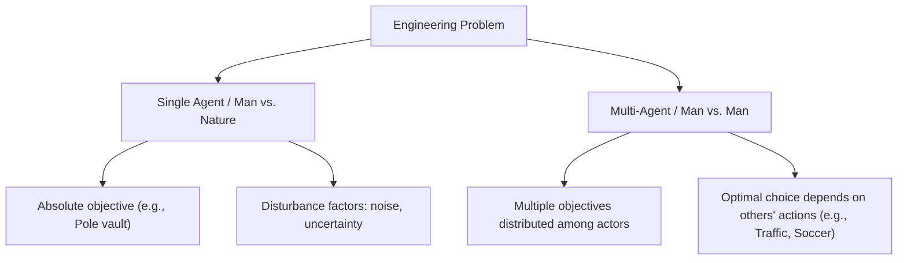
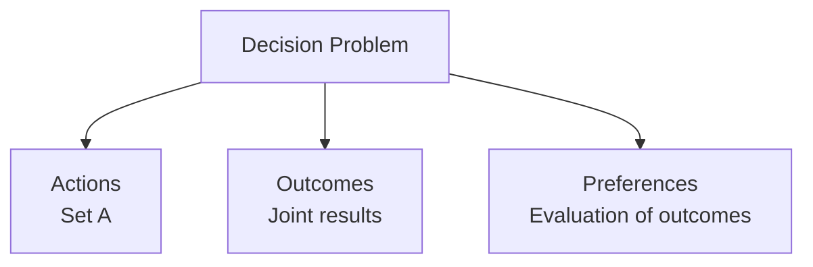
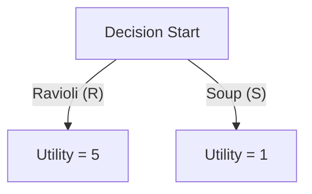
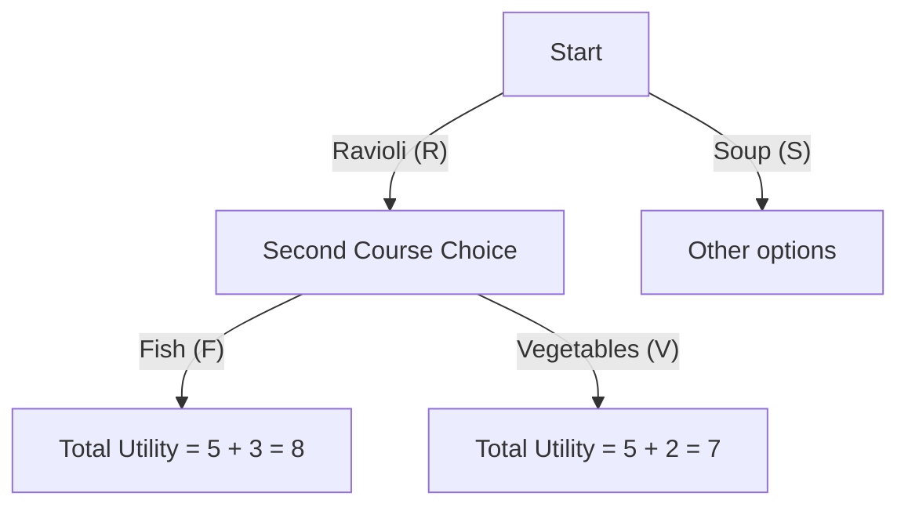

# Introduction to the Course and Logistics (Game Theory)

## Didactic Overview
The opening lecture of the *Game Theory* course focuses mainly on administrative, organizational, and logistical aspects. The students' origin backgrounds (Computer Engineering, ICT for Internet and Multimedia, Cybersecurity, and others) are surveyed, and the fundamental bureaucratic distinction regarding other courses with the same name taught by different professors (Professors Marchioro and Borra) is clarified. These other courses target different degree programs such as Control Systems Engineering, Data Science, or Mathematical Engineering. The instructor, Prof. Leonardo Badia, presents his research background focused on mathematical modeling applied to wireless networks, epidemiology, and social networking, while also providing guidelines for email communications and the delivery format of future lectures (via pre-recorded lectures and interactive sessions).

---

### Logistical Introduction and Course Structure

Welcome to the **Game Theory** course. This initial section is dedicated exclusively to logistical and organizational aspects, as well as the structure of the teaching.

#### Instructor Presentation and Contacts

The instructor responsible for this course is Professor **Leonardo Badia**.
* **Contact email**: `leonardo.badia@gmail.com` or the institutional address `@unipd.it`.
* *Note on communication*: Both addresses converge into the same inbox. If you do not receive an immediate response, do not worry: it is often due to email overload. The instructor encourages patience but also persistence, and you should not hesitate to send a second or third reminder in case of no response.

The instructor's research interests mainly concern mathematical modeling applied to *wireless networks*, a field in which Game Theory is widely used. Other interests include digital epidemiology, *social networking*, and *digital signal processing*.

---

### Bureaucratic Management of Courses (Watch Out for Sorting)

A fundamental **Key Concept** concerns the distinction between the Game Theory courses activated at the Department of Information Engineering. Indeed, there are two parallel courses:

1. **Game Theory** (taught by Prof. Leonardo Badia) — Aimed at students of *Computer Engineering*, ICT for Internet and Multimedia, and Cybersecurity.
2. **Game Theory and Strategic Behavior** (taught by Professors Marchioro and Borra) — Aimed at students of *Control Systems Engineering*, Data Science, *Mathematical Engineering*, *Computer Science*, and ICT for Life and Health.

> **Important / Exam Warning**: Content-wise, the two courses are practically identical, follow the same syllabus, and take place on the same dates. However, **the separation is mandatory for bureaucratic reasons**. Students must absolutely attend, enroll in the correct Moodle page, and register the exam with the professors officially assigned to their study plan. Following the wrong course will inevitably cause administrative and grade registration issues.

---

### Lecture Delivery Mode

The course follows a blended format alternating in-person classroom lectures and online lectures.

* Lectures are recorded to allow students to review them at a later time.
* Since these are video recordings that include interactions, chats, and streaming links, participation implies acceptance of the processing of one's presence within the recorded material.

---

### Course Delivery Mode and Study Materials

Attendance at lectures is not mandatory, in accordance with the tradition of the Italian university system. However, participation is **strongly recommended** to keep pace with the course syllabus, especially for practical activities and project discussions (for which presence is warmly advised). The flow of lectures can be compared to a TV series: following the episodes on a regular schedule avoids accumulating work and makes comprehension much easier.

#### Support and Communication Tools
* **Moodle Platform**: This is the main reference point for the course. It contains the teaching material, video recordings of online lectures, and a selection of video recordings from past years (useful for catch-up, although bearing in mind possible minor content variations).
* **Office Hours**: These generally take place **by appointment**. Since the course is in blended mode, it is essential to arrange a meeting via email before heading to the department, to avoid failing to find the instructor (who is often engaged in remote online lectures). Group or online meetings are encouraged.
* **Discussion Forum**: An open forum is active on the Moodle platform. It is the ideal tool for raising doubts and questions, as it allows interaction among students, who can help each other, compare ideas, and even form project groups. Asking questions too frequently via private channels is discouraged in favor of a shared and trackable space.

#### Lecture Schedule
* **Monday (Online, 4:20 PM)**: Theoretical lecture or analysis of pre-recorded videos made available in advance. It is recommended to follow the timeline so as not to lose the logical thread.
* **Wednesday (In-person, 2:30 PM)**: Classroom lecture, ideal for direct and physical interaction.
* **Duration**: Approximately 80 continuous minutes, without breaks, to allow an early conclusion and facilitate students' commuting.
* **Suspensions**: The regular schedule will continue until December, during which variations are expected due to conference commitments and holidays, with the objective, however, of finishing the lectures before Christmas.

---

### Reference Textbooks and Teaching Material

It is not necessary to buy specific books, although excellent resources on *Game Theory* exist.

1. **Tadelis's Textbook**: An excellent reference manual, published by Princeton, written in an accessible tone geared towards economists. The instructor periodically supplements it with more rigorous mathematical steps for the use of engineers. The structure follows the course standard:
   * *Static Games*
   * *Dynamic Games*
   * *Bayesian Games*
2. **Instructor's Textbook (with Prof. Marchioro)**: A collection of past exams useful as a reference map to understand the type of exam exercises.
   * *Key Concept*: **Beware of reverse engineering exam texts**. Using the book to understand how to set up exercises is correct, but copying solutions without noticing subtle differences in the exam texts inevitably leads to a negative evaluation.
3. **Course Slides**: Available on Moodle, they fully cover the syllabus, including extra content added over time by the instructor.

---

### The Mandatory Project

Starting this year, **the research project is mandatory** in order to access the regular exam sessions. Submitting an empty project or failing to do so results in a score of zero points, effectively preventing access to the regular exam calls.

* **Characteristics**: It must be an original essay of 5–8 pages, to be carried out individually or in groups of two people (exceptionally three, in case of justified complexities).
* **Topics**: The list of 12–15 official topics is published within the **first week of November**. It is possible to propose a custom topic, but it must be preliminarily approved by the instructors to ensure its consistency with the course themes. Multiple groups can choose the same topic, provided it is developed in a differentiated way.
* **Use of Artificial Intelligence (AI)**: The use of tools like ChatGPT, Gemini, or Claude for support (e.g., theorem checking, writing Monte Carlo simulations, or linguistic correction) **is permitted and encouraged**. However, **it must be strictly declared** in a dedicated section of the project.
   * *Key Concept*: **Fraud and undeclared use of AI**. Passing off entirely AI-generated work as one's own constitutes a serious violation, with sanctions ranging from temporary suspension (resulting in the loss of scholarships) to severe disciplinary measures managed by the ethics committee.

---

### Exam Rules and Grading System

The final grade consists of two elements: a **written test** and the **project evaluation**.

#### Scoring Structure
* **Written Exam**: Provides up to a maximum of $27$ points. It is necessary to obtain at least **$15$ points** to pass the written part.
* **Project**: Provides a score from $0$ to $9$ points.
* **Final Grade**: Given by the sum of the two components, it must be **$\ge 18$** to consider the exam passed. Any scores above $30$ grant honors (*lode*).

#### Test Schedule and Deadlines
* **December Preliminary Test**: Scheduled indicatively for **December 23rd** (pending confirmation of a large classroom). It allows taking a written test before the holidays.
* **Project Submission Deadline**: Strictly set for **January 25th**.
* **Regular Exam Calls**: February 3rd, February 18th, June 15th, August 27th.

#### Exam Access Rules
1. **Fundamental Rule**: Students are allowed to take the regular written exam calls **only after submitting the project**.
2. **Exception for the December Test**: The December preliminary test represents the only exception, allowing the written test to be taken before Christmas.
3. **Grade Management and Repeatability**:
   * The written exam can be retaken as many times as the student desires to improve the grade.
   * **The project can be submitted only once**: the acquired project grade remains final.
   * If a student passes the December preliminary test with a sufficient grade (e.g., $20/30$), they can decide to accept that grade by submitting an empty project ($0$ points), or enrich the final evaluation by submitting the project by the January deadline to sum up the points.

---

### Grade Regulations, Project Validity, and Exam Call Management

Before diving into the scientific content, some fundamental logistical and organizational aspects for passing the course are defined:

*   **Project submission and exam sessions:** The project must be mandatorily submitted *before* registering and sitting for the written exam (whether it is the June or August exam calls). It is not possible to take the written exam if the project part has not been previously deposited.
*   **Temporal validity of the project:** A submitted project remains valid for **one calendar year**. However, the internal rules of the University of Padua (UNIPD) establish that academic validity is tied to the academic year (which officially ends on October $1\text{st}$). This means that if a project is submitted in August but the written exam is failed in the same month, technically the project could expire with the start of the new academic year (October 1st), especially if the course changes instructor or regulations the following year.
*   **Discussion and originality:** There is no actual mandatory oral exam for the project, but the student is required to be able to **justify and explain it**. In case of suspected plagiarism or non-original work, the case is reported directly to the ethics committee. The instructor also reserves the right to summon the student even just out of curiosity or interest in a particularly valid piece of work.
*   **Exam dates:** Exam dates are mandatory and non-negotiable. There is no bargaining on exam schedules.
*   **Lecture recordings:** The instructor chooses not to record lectures in streaming or in-person. This choice is motivated by the fact that interactive classroom discussion makes recordings redundant and potentially misleading if they contain extemporaneous errors. Complete study materials for the independent reconstruction of topics will still be provided.

---

### Introduction to Game Theory and Differences with Traditional Problem Solving

The scientific part of the *Game Theory* course begins. People often fall into the mistaken belief that, since they are called "games", the course will be about video games, sports, or gambling. In reality, the mathematical definition of a game has nothing to do with these recreational contexts.

A **game** is formally defined as a **multi-person multi-objective problem**. The goal of the course is not to study leisure, but to analyze the underlying mathematical models. Being models, engineers prefer them to be simple and *tractable*, avoiding the excessive complexity of real-world activities like professional soccer or modern video games.

#### The Mindset Shift: Man vs. Nature vs. Man vs. Man

To understand the difference between traditional engineering and Game Theory, two distinct situations can be compared:

1.  **Single-agent problem (Man vs. Nature):**
    *   *Example:* The *pole vault* at the Olympics.
    *   *Characteristics:* The athlete has a clear objective (vaulting over the bar). Success depends solely on one's own abilities and adverse environmental variables (noise, sparse data, uncertainty). The engineer or athlete tries to dominate and overcome "nature". There is a clear binary dichotomy: either you clear the bar (success) or you knock it down (failure).
2.  **Multi-agent problem (Man vs. Man):**
    *   *Example:* A children's soccer match or rush-hour car traffic in Rome.
    *   *Characteristics:* There is no single solution or clear division between "good and bad". If a player has to take a penalty kick, the optimal move depends on what the goalkeeper does. In urban traffic, a driver's choice strictly depends on the trajectories and decisions of all other agents (pedestrians, cyclists, other cars).

This explains why airplane autopilots are a consolidated reality (they face a "against nature" problem, following an isolated route), while autonomous driving systems for cars encounter enormous difficulties in chaotic traffic: they must manage strategic interaction with multiple unpredictable intelligent agents.

---

### Fundamental Assumptions and Criteria of a Game

Unlike traditional multi-objective optimization — which is often solved by aggregating objectives into a linear combination of the type:

$$\text{Global Objective} = \alpha O_1 + \beta O_2 + \gamma O_3$$

in Game Theory every agent possesses their own independent objective and pursues their own interest. For a game to be mathematically analyzable, two fundamental hypotheses are introduced:

1.  **Known rules:** The rules of the game are known a priori to all participants.
2.  **Player *Rationality*:** Players are considered rational, meaning capable of lucidly anticipating the consequences of their actions.

Furthermore, a mathematically interesting game requires that **the final outcome depends on the joint choices of all participants**. If the actions of individuals had no impact on the overall result, the game would be degenerate and devoid of analytical interest.

---

### Engineering Applications of Game Theory

Although born within microeconomics and subsequently extended to political science and biology, Game Theory today finds very broad employment in engineering and information sciences:

*   **Medium Access Control (*MAC*):** In telecommunication networks, deciding whether or not to transmit on a shared channel is a classic game theory problem. If too many nodes try to access simultaneously, a collision is generated (analogous to a gridlock or a traffic accident at an intersection).
*   **Routing Protocols and Data Networks:** In the analysis of routing protocols, it is usually assumed that intermediate nodes (e.g., nodes $C$ and $D$ along the route between $A$ and $B$) cooperate by forwarding packets. With a game theory approach, it is possible to verify whether such nodes actually have the economic or energetic incentive to cooperate.
*   **Internet of Things (*IoT*) and Multi-Agent Systems:** With the spread of intelligent devices and *agentic AI*, behaviors tend to be perfectly predictable in mathematical terms, making the application of game theory ideal for modeling complex interactions between autonomous devices in distributed environments.

---

### Application Overview of Game Theory

Game Theory does not apply solely to pure competitive contexts (such as the classic example of the penalty kick between kicker and goalkeeper), but also models cooperative situations, cybersecurity scenarios, and communication protocols.

For example, in IoT (Internet of Things) systems or Medium Access Control (MAC) protocols, devices react to collisions and the behavior of other nodes. Other highly relevant areas include:
- **Security and veridicality of information:** Monitoring the impact of malicious agents who violate security or inject false data.
- **Online platforms and digital markets:** Management of online reputation, collusion, auctions, social networks, and electronic voting systems.

---

### Preliminary Economic Concepts

Before formalizing the models, it is useful to introduce some basic concepts borrowed from economics and distributed systems:

* **Monopoly and Oligopoly:**
  - *Monopoly* occurs when a single actor controls the entire market for a good.
  - *Oligopoly* sees a limited number of actors controlling the market (a common situation in today's digital world, dominated by a few giants in telecommunications, operating systems, or artificial intelligence). Society tends to punish monopolies through sanctions to protect collective welfare, ensuring that market decisions follow Adam Smith's "invisible hand", with the exception of state monopolies (e.g., tobacco or gambling) aimed at controlling potentially dangerous goods.
* **Substitute Goods:** Goods whose demand increases as the price of another equivalent good increases (e.g., tea and coffee, or walking versus using gasoline).
* **Discount Factor:** Represents the devaluation of a good or earning over time. It is denoted by the symbol $\delta$ (with $0 < \delta < 1$).
  The value of a good at time $T$ relative to the initial time is given by:
  $$V(T) = \delta^T$$
  Economic and engineering motivations include inflation, depreciation of the good, immediate temporal preference of users (*"I want everything right now"*), or, in networking contexts, the probability that a service remains active and available over time.

---

### Fundamental Elements of Decision Problems

A generic *decision problem*, whether single-agent optimization or multi-agent, always consists of three fundamental elements:

1. **Actions:** The set of choices available to agents (e.g., choosing whether to turn left or right at a fork).
2. **Outcomes:** The result deriving from the combination of actions chosen by the participants.
3. **Preferences:** The way individual players evaluate and rank the various possible outcomes.

In multi-agent problems (**games**), the outcome does not depend solely on the individual's choice, but is determined jointly by the actions of all participants.

---

### Preferences and Rationality

#### Preference Relation
Formally, given a series of alternatives in the set $A$, preference is denoted by the symbol $\succcurlyeq$ (a binary relation similar to greater than or equal to). Saying that alternative $A$ is preferred to $B$ is written as $A \succcurlyeq B$.

For a preference relation to be defined as **rational** (equivalent to a *total order relation* in mathematics), it must satisfy the following properties:
* **Reflexive:** Every alternative is preferred or indifferent to itself ($A \succcurlyeq A$).
* **Antisymmetric:** If $A \succcurlyeq B$ and $B \succcurlyeq A$, then $A$ and $B$ are the same alternative.
* **Complete:** For any pair of alternatives $A$ and $B$, either $A \succcurlyeq B$ or $B \succcurlyeq A$ always holds (indecision is not allowed).
* **Transitive:** If $A \succcurlyeq B$ and $B \succcurlyeq C$, then necessarily $A \succcurlyeq C$.

#### Utility Functions (Payoffs)
To avoid the complexity of directly handling symbolic order relations, Game Theory uses **utility functions** (or *payoffs*), which are numerical quantifications of preferences.

Given a set of outcomes, the utility function assigns a real number to each outcome:
$$U: A \to \mathbb{R}$$

- If a good is quantifiable (e.g., quantity of a good $Q$), the utility function $U(Q)$ is generally increasing, but often presents **diminishing marginal utility** (the first derivative is positive, but the second derivative is non-positive, $U''(Q) \le 0$), meaning that the value tends to saturate (owning 100 cars is not 100 times better than owning one).
- Numerical values count only in terms of ranking: if $U(A) > U(B)$, outcome $A$ is strictly preferred to $B$. Absolute values have no intrinsic physical meaning unless tied to real quantities (such as *throughput* in a telecommunication network).

> **Key Concept: Rationality and Utility**
> A **rational** player is an agent who possesses their own utility function and acts with the objective of **maximizing it**, being aware of the consequences of their actions.
> *Ethical/behavioral note:* In this context, "maximizing one's utility" is often defined as *selfish* behavior, but this does not necessarily imply material selfishness: an individual's utility can encompass the well-being of others (e.g., the happiness of one's children).
> In the case of algorithms, AI, and computers, rationality is total and free of emotional hesitation; the true criticality lies in the accuracy of the mathematical model in predicting reality.

An important representation theorem establishes that **a utility function represents a preference if and only if the preference is rational**. Thanks to this, game analysis relies almost entirely on the use of numerical utilities, omitting abstract preference relations.

---

### From Single Choice to Decision Trees

In the study of optimization and choices, a fundamental concept is represented by the definition of preferences and utilities associated with sequential paths. Let's imagine a common and seemingly trivial situation: being in the cafeteria and having to choose what to eat.

If we face a decision fork where we have to choose between two options, for example ravioli ($R$) or soup ($S$), we can assign a numerical utility value to each option.

In this simple **decision tree**:
- The player is at a decision node.
- The branches represent the available options.
- The leaves (terminal nodes) represent the final utilities.

Obviously, the rational choice for a single agent consists in maximizing their utility, opting for the path that guarantees the higher numerical value (in our example, choosing ravioli with utility $5$).

#### Sequential Choices and Additive Utilities

Decisions can nevertheless develop over multiple levels (successive choices). Returning to the cafeteria example, after choosing the first course, we might face a second choice for the second course: fish ($F$) or vegetables ($V$). The decision tree extends by adding new levels.

In this model, we can hypothesize that utilities are **additive**, meaning that the overall utility is given by the sum of the partial utilities of the individual stages:
$$\text{Total Utility} = U(\text{First Course}) + U(\text{Second Course})$$

However, **beware**: additivity is not a logical or mathematical obligation. Often human preferences are non-linear: we might appreciate ravioli and appreciate fish, but detest their combination. In such a case, the final value will not be the algebraic sum, but a different value (it might even be zero or a negative value in terms of liking).

### Single-Agent Optimization vs. Multi-Player Games

When dealing with **single-player optimization** problems, from a technical standpoint we face a maximization problem.

- **Computational Complexity:** Even if a problem can be computationally complex (for example, problems classified as NP-complete), conceptually the solution "only" requires greater computing power or *exhaustive search* among all possible alternatives to identify the one that maximizes utility.
- **Tree Collapse:** A decision tree composed of multiple levels can theoretically be collapsed into a single level, reducing the choice to an overall optimal option. A single agent sufficiently "intelligent" or equipped with adequate computing resources can solve these problems autonomously.

Things change radically when we move from a single-person context to a context with **multiple players**, where the choices of one agent directly influence the payoffs and strategies of the others.

---

> [!NOTE]
> ### Exam Notes and Instructor Warnings
> - **Written exam structure:** The written exam is usually composed of 3 exercises with 3 questions each (3 points for each correct answer), for a maximum total of 27 points. Typically, the exercises include: a static game, a dynamic game, and a Bayesian game.
> - **Requirements to take the exam:** Students are allowed to take the regular written exam (on the February, June, or August dates) ONLY after submitting the project (which is mandatory, although it can also be submitted empty to get 0 points).
> - **December preliminary exam call:** A preliminary written test (unofficial) is scheduled for December 23rd, which allows finalizing/passing the exam before Christmas (with a maximum score of 27 points from the written part).
> - **Scores and Passing:** The written part grants up to 27 points (at least 15 points are needed to pass it). The project grants from 0 to 9 points. The sum of the two must be greater than or equal to 18 to pass the exam (with honors for scores above 30). Alternatively, one can stop at the grade of the December preliminary test without doing the project.
> - **Project validity:** The submitted project remains valid for one academic year (until the following October 1st). In case of failing the written exam in August, if the course changes or if the professors change, the project might no longer be considered valid.
> - **Reference material and prohibitions:** It is strongly discouraged to do "reverse engineering" by copying and pasting exercises from the textbook to the exams, as there are differences and there is a risk of failing. It is strictly forbidden to use AI (e.g., ChatGPT) to write the entire project; the use of AI is tolerated only for support (e.g., proofreading, writing simulations) and must be mandatorily declared, under penalty of referral to the ethics committee.