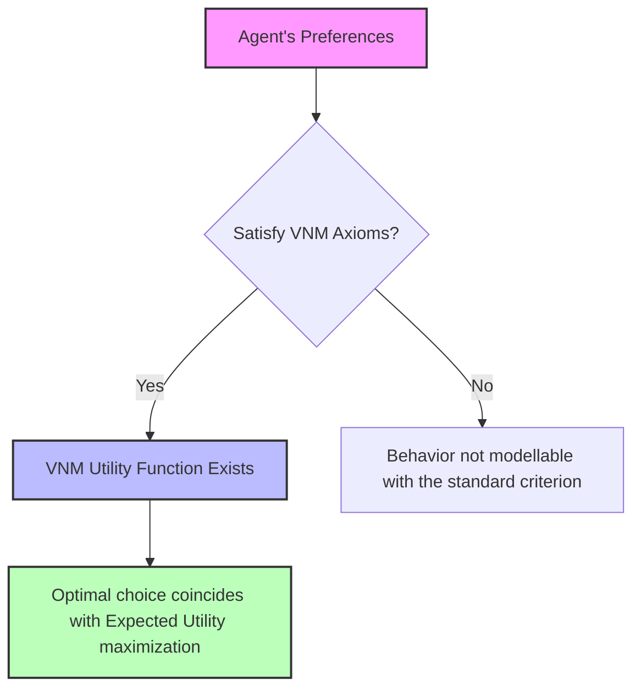
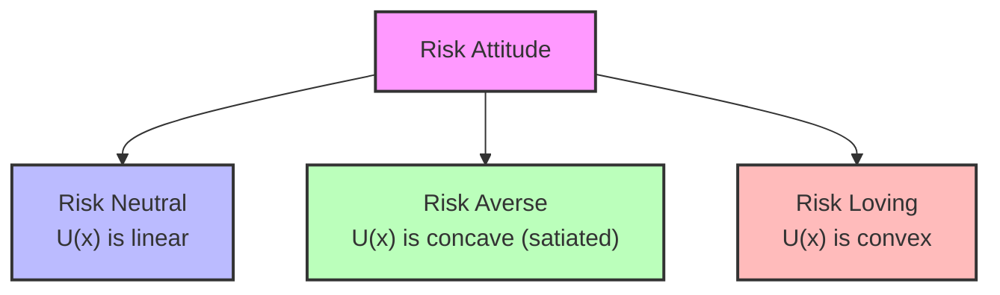
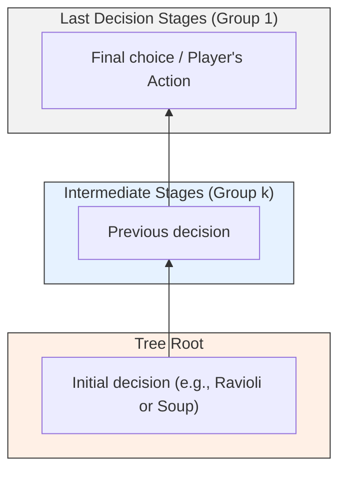
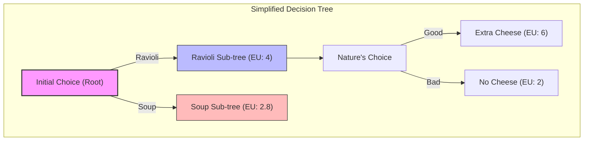

# Lecture: Game Theory - Lotteries and Decision Making under Uncertainty

## Didactic Overview
This lecture introduces the concept of a **lottery** within Game Theory, formally defined as a probability distribution over a set of discrete outcomes. The main objective is to provide a rigorous method to remove or manage random elements in games, reducing uncertain situations (such as preferences over variable outcomes) to analytical models that can be handled by rational players. Analogies with discrete random variables and their theoretical extension to continuous cases are also outlined.

---

### Introduction to Lotteries and Random Elements

This lecture represents a so-called "plug-in lecture": a temporary yet useful deviation from the main course path designed to fill a specific knowledge gap. The goal is to understand how to handle the presence of **random elements** within games, and then reconnect to the main flow of the discussion. 

The reason why we want to eliminate randomness is simple: randomness is problematic in games. We want to be able to make reliable predictions about behaviors and outcomes, but if the system is governed by chance, our predictions will be as well. For this reason, in game theory we tend to focus on contexts where behavior (and outcome) is ideally deterministic, leaving aside situations such as gambling or pure sports, which are heavily dominated by the aleatory component.

---

### The Problem of Randomness: A Practical Example

Imagine we find ourselves once again in the university cafeteria example. A user must choose between two dishes: ravioli or soup. 
* If the dishes had fixed outcomes (for example, we know with certainty that ravioli are better than soup), the choice would be trivial and based on certain preferences.
* However, in reality, quality is variable. The soup changes every day (it can be made with potatoes, carrots, etc.), introducing an unpredictable random element.

Consider a numerical example of the utilities associated with the choices:
* **Ravioli**: offer a utility equal to $5$ in $50\%$ of cases (probability $0.5$), and a utility equal to $2$ in the remaining $50\%$ of cases.
* **Soup**: offers a utility equal to $1$ in the majority of cases (probability $0.8$), but on rare occasions (probability $0.2$) offers an excellent utility equal to $10$.

If we had to pay the same price for both dishes, which one would we choose? Comparing two situations like this means finding oneself choosing between two different **lotteries**. A purely rational choice struggles to find an immediate and clear criterion, as uncertainty alters the ability to infer the direct consequences of an action.

---

### Formalization of Lotteries

Mathematically, a lottery is nothing more than a **probability distribution** defined over a set of certain outcomes $X = \{x_1, x_2, \dots, x_n\}$. 

* In this discussion, we focus mainly on **discrete random variables** (sets of discrete outcomes $X$). 
* The extension to continuous variables (via probability density functions) follows analogous logic, often left as an exercise.
* In game theory practice, the probabilities of outcomes are often conditioned by the actions taken by the players. For brevity of writing, we omit the condition, but the dependence on the chosen action remains implicit: for example, we consider the probability distribution subordinated to having chosen action $a$.

An important aspect is that **a lottery can also be degenerate**: if an option assigns probability $1$ to a single certain outcome and probability $0$ to all others, the lottery collapses into the standard deterministic case where an action corresponds to a single precise outcome.

---

### The Role of "Nature" and Decision Trees

In game theory jargon, randomness is often modeled by introducing a special fictitious player called **Nature**.

* **What is Nature?** It is a non-rational player whose moves consist of coin flips, draws, or any other mechanism that determines a random event.
* **Order of moves:** Nature is often conceptually thought of as a player who moves before all others, fixing the initial random conditions that rational players must then react to.

Within a **decision tree**, the introduction of randomness modifies the structure of choices: the player makes a choice (e.g., choosing between ravioli or soup), but subsequently, Nature intervenes to determine the actual outcome (e.g., whether the utility will be high or low) based on the respective probabilities. Consequently, the player finds themselves having to make a rational decision *before* knowing the random outcome determined by Nature.

---

### The Expectation Criterion and the Foundations of von Neumann-Morgenstern

Revisiting the decision problem under conditions of uncertainty (already introduced with the ravioli and soup example), suppose we are faced with **lotteries**, that is, probability distributions over a set of possible outcomes. 

While in discrete spaces the representation via Decision Trees is immediate and intuitive, modeling in a **continuous space** (with continuous random variables) is more complex from a graphical standpoint, as it would require an infinite number of branches. However, as engineers, we must be able to reason about the problem and solve it even in the absence of an explicit visual representation.

---

### Rational Choice and the Limit of Classical Expected Value

Consider a simplified version where two choices (e.g., ravioli $R$ and soup $S$) can lead to only two outcomes: "tasty" or "not tasty", with payoffs associated respectively to $10$ and $1$. 
If the probability of obtaining a positive outcome is higher in lottery $R$ compared to $S$, the rational choice is immediate. But what happens when both probabilities and numerical payoffs change?

Intuition suggests relying on the average, or comparing **mathematical expectations**. However, the use of simple monetary expected value fails in many real-world situations due to human subjectivity. 
* *Example:* Receiving $1\text{ \euro}$ for certain is preferred by many over a lottery that offers $1,000\text{ \euro}$ with probability $1/1000$, despite the monetary expected value being identical ($1\text{ \euro}$). This demonstrates that there is a **subjective valuation** of risk and value.

---

### von Neumann-Morgenstern Utility Theory

To overcome this limitation, mathematicians **John von Neumann** and **Oskar Morgenstern** developed **Expected Utility Theory**, known as **von Neumann-Morgenstern (VNM) utility**. 

According to this approach, a rational agent does not maximize the expected monetary value, but rather the **expected utility**. This theory allows uncertain lotteries to be compared with certain (degenerate) outcomes.

#### Why does expectation work? (The axiomatic approach)
The use of expectation is often justified using a frequentist approach, that is, thinking about what would happen if the game were played a thousand times. However, in reality, many economic and strategic decisions are made in games that are played **only once**. 

The intuition of von Neumann and Morgenstern is not based on repetitions, but on the demonstration that using expectations is the only way to represent a preference relation that satisfies three fundamental axioms of rationality.

---

### von Neumann-Morgenstern Axioms

To formally accept the validity of expected utility, an agent's preferences must satisfy three categories of axioms:

1. **Rationality:** Preferences must be *complete* (the agent always knows how to rank two lotteries) and *transitive* (if $A \succ B$ and $B \succ C$, then $A \succ C$).
2. **Continuity Axiom**
3. **Independence Axiom**

#### 1. The Continuity Axiom
Before defining continuity, recall that given the nature of probabilities, we can construct **compound lotteries** by linearly combining two lotteries $P$ and $Q$ via a weight $\alpha \in [0, 1]$:

$$\alpha P + (1 - \alpha)Q$$

The **continuity axiom** states that the subsets of values of $\alpha$ for which a linear combination is preferred to a lottery $R$ (or vice versa) are **closed sets**. 

* *Intuitive meaning:* Small variations in probabilities must not cause discontinuous and irrational jumps in preferences. 
* *Example:* If walking in a park is $100\%$ safe and you prefer going there rather than staying at home, discovering that safety is at $99.99999\%$ does not suddenly flip your preference. If the probability of a negative outcome grows significantly, the preference may change, but the transition occurs continuously, without erratic or paradoxical oscillations as $\alpha$ varies infinitesimally.

---

### Practical Application of Lotteries and Continuous Cases

#### From Axioms to the Expected Utility Rule
Returning to the discussion on lottery axioms, the independence axiom tells us that if we prefer lottery $P$ to lottery $Q$, adding an independent and irrelevant alternative (i.e., the same lottery $R$ combined with the same weights to both) does not alter the preference. For example, if you prefer betting on football over horses, and I propose a coin toss where if heads comes up we play your bet (football or horses) and if tails comes up we play roulette, you will continue to prefer football, because the roulette part is identical in both scenarios.

There is a famous theorem — traditionally demonstrated through five *lemmas* — that formalizes all this. The von Neumann-Morgenstern theorem (von Neumann-Morgenstern Utility Theorem) establishes that a coherent comparison of lotteries is based solely on the calculation of the expected value. In formulas, the preference relation $P \succ Q$ is representable if and only if the expected utility of lottery $P$ is greater than that of lottery $Q$:

$$\mathbb{E}[U(P)] > \mathbb{E}[U(Q)] \iff P \succ Q$$

A fundamental aspect demonstrated by one of the *lemmas* is that the preference operator, in order to be represented by a utility, must be **linear**. Since any lottery can be seen as a linear combination of elementary lotteries (in which each single outcome is chosen with a certain probability), the von Neumann-Morgenstern framework implies that expected utility must be maximized.

*   **Cafeteria example:** You must choose between ravioli and soup. If the expected value of ravioli is $3.5$ and that of soup is $2.8$, the rational choice (preference) falls on the ravioli.
*   *Caution regarding compound choices:* Expected utility can remain identical even if the risk structure changes radically. For example, a certain outcome of value $5$ can be mathematically equivalent (in terms of expected value) to a lottery where there is a $20\%$ probability of obtaining $25$ and an $80\%$ probability of obtaining $0$. 
*   *Fundamental engineering note:* Economists often ignore a very strong hidden assumption in these decision trees: it is assumed that Nature's subsequent choices are **independent** of each other, which in real systems is not always so obvious.

---

#### The Continuous Case: The Well Digging Problem
When we move to a continuous context, we can no longer use a discrete decision tree. Let's see how to set up an optimization problem in the presence of continuous random elements, analyzing the classical example of **digging a well**.

1.  **Decision variable:** Let $D$ be the depth of the well we decide to dig. It can vary from $0$ (no digging) up to a maximum value equal to the Earth's radius.
2.  **Cost/Effort:** We assume that digging involves an effort modeled as a quadratic function of depth:
    $$\text{Effort} = \frac{D^2}{2}$$
    *(Note: This is an example model, not a universal law, although it is widely used in engineering problems).*
3.  **Random revenue (Water extracted):** The water we manage to extract is a random variable that depends on $D$. If $D = 0$, the water is $0$. Otherwise, the water is uniformly distributed between $0$ and $20D$.
4.  **Utility Function:** Utility is defined as the gain (water obtained) minus the effort expended:
    $$U = \text{Water} - \frac{D^2}{2}$$
    *(Note: Units of measurement must be homogeneous; for example, we measure effort in equivalent cubic meters, just like water).*

To find the optimal depth $D$, we must maximize the expected utility $\mathbb{E}[U(D)]$. By calculating the expected value of the extracted water (being uniform between $0$ and $20D$, its mean value is half the interval, i.e., $10D$), we obtain the objective function:

$$\mathbb{E}[U(D)] = 10D - \frac{D^2}{2}$$

Applying the standard engineering rule (first derivative set to zero to find the maximum point):

$$\frac{d}{dD} \left( 10D - \frac{D^2}{2} \right) = 10 - D = 0 \implies D = 10 \text{ meters}$$

With $D = 10$, the resulting expected utility is:
$$\mathbb{E}[U(10)] = 10(10) - \frac{10^2}{2} = 100 - 50 = 50$$

---

#### The Importance of Absolute Values and Risk Aversion
In deterministic contexts, utility has a purely *ordinal* nature (only which outcome comes before the other matters). However, **when we introduce risk and lotteries, absolute values matter very much**, since we are calculating mathematical expectations ($\mathbb{E}[U]$).

Consider two lotteries with the same expected value:
*   **Lottery 1:** Obtaining $1$ with certainty (outcome $x_2$).
*   **Lottery 2:** Obtaining $0$ with a probability of $95\%$ and $20$ with a probability of $5\%$ (or in general, large-scale variations like winning $1,000$ vs $1$).

An individual does not necessarily choose based solely on monetary expected value, but rather on their **risk attitude**, which depends on the shape of their utility function $U(x)$:

*   **Risk Neutrality ($U(x)$ linear):** The individual is indifferent between a certain gain and a lottery with the same expected value.
*   **Risk Aversion ($U(x)$ concave):** Marginal utility decreases as wealth increases. The individual prefers a certain result to a lottery with an identical but uncertain expected value (e.g., they prefer a safe $1$ rather than taking a risk). This explains why people prefer not to bet if the game is fair or unfavorable.
*   **Risk Seeking ($U(x)$ convex):** The individual prefers variability and the thrill of winning, explaining the commercial success of real lotteries.

---

#### Dynamic Decisions and Dynamic Programming (Backward Induction)
Now imagine a more complex decision-making situation that unfolds over time and involves multiple choices by both the player and "Nature" (e.g., we decide to order ravioli at the cafeteria, then Nature decides whether they are flavorful or bland, then we can decide whether to add cheese, which in turn can be fresh or spoiled, and so on).

When we find ourselves at the beginning of a complex decision tree, the immediate choice appears difficult because we are not simply evaluating a final state, but we are looking at a future in which **we ourselves will make other choices** based on what will happen in the middle. 

How do engineers and game theorists solve this problem? Simple: by proceeding **backwards** (*backward induction*), a concept known in control theory as **Dynamic Programming** (famous from Dimitri Bertsekas's texts).

1.  **Classification of nodes:** We group the nodes into groups $k$. *Group 1* contains all the player's final decisions that immediately precede the outcomes (without further strategic choices by other players or Nature).
2.  **Backward Induction:** We move backwards in time. Since a rational player anticipates the consequences of their future actions, we can determine what they will choose in the nodes of Group $1$, replacing those branches with the optimal expected utility value. 
3.  Proceeding recursively backwards to the root of the tree, the decision-maker (e.g., Hercules at the crossroads, or the student at the cafeteria) can accurately evaluate which initial action maximizes the global expected utility, taking into account all future bifurcations.

---

### Tree Resolution via Backward Induction

We have seen how the decision tree is composed of player nodes and "Nature" nodes (random or environmental choices). To proceed with the resolution, we use the **backward induction** technique. 

The logical principle is simple: we start from the terminal nodes (leaves) and work our way back to the root. 
1. We identify the nodes of the lowest level group (immediate leaves or choice terminal nodes).
2. We make the optimal choices at those nodes by maximizing expected utility.
3. Once these nodes are resolved, we treat them as "decisions already made," removing them from the tree and decreasing the rank of all preceding nodes by one (group $K$ nodes become $K-1$).
4. We repeat the process iteratively until we reach the root of the tree.

In our practical example with the cafeteria lunch:
* In the nodes with final choices (e.g., whether or not to add extra cheese on the ravioli), we evaluate expected utility: if we take ravioli with extra cheese we obtain a utility of $6$, whereas without extra cheese the utility is $5$. The optimal choice is therefore extra cheese.
* By replacing these resolved branches with their optimal expected utility value, the preceding nodes (such as the initial choice between ravioli $R$ and soup $S$ at the root of the tree) can be compared directly.
* Through this comparison, the choice will fall on ravioli, since the overall expected utility is higher than that of soup (e.g., $4$ versus $2.8$).

---

### Inclusion of the Discount Factor

When decisions unfold over an extended time interval, future utility tends to degrade. To model this phenomenon, we introduce a **discount factor** ($\delta$), with $0 < \delta < 1$. 

For example, the idea of adding extra cheese to the ravioli might be great, but in the time required to reach the table, the cheese might expire or lose quality. Consequently, the maximum payoff will no longer be the absolute value $10$, but rather a discounted value:
$$\text{Discounted Payoff} = 10 \delta$$

The introduction of $\delta$ shows that the final numerical result does not depend solely on the absolute values of the utilities, but also on the temporal dynamics and the degradation rate applied to the choices.

---

### The Value of Information

So far we have assumed that the player must make decisions without knowing Nature's choice in advance (whether the ravioli will be good or bad, whether the soup will be good or bad). The ideal situation, however, would occur if we could know Nature's outcome *before* making our choice.

#### 1. Standard game (without prior information)
In the base game, the order of decisions reflects our uncertainty: we choose between ravioli and soup without knowing how they will be, and only afterwards does Nature make its move. In this scenario, calculating by backward induction, the global expected utility of the game is, for example:
$$\text{EU}_{\text{standard}} = 3.5$$

#### 2. Game with perfect information
Now imagine meeting a friend who has already been to the cafeteria and knows Nature's choices exactly (whether the ravioli are good/bad and the soup is good/bad). This friend is willing to reveal the information to us, but in exchange wants compensation (e.g., dessert coupons). 

If we modify the tree by inverting the order, placing Nature's choice at the beginning (the player knows the outcome and chooses accordingly), the decision problem changes radically. Solving this new tree with complete information, we obtain a new expected utility:
$$\text{EU}_{\text{information}} = 4.8$$

#### Quantifying the Value of Information
The **value of information** is calculated as the difference between the expected utility with perfect information and that of the standard game:
$$\text{Value of Information} = \text{EU}_{\text{information}} - \text{EU}_{\text{standard}} = 4.8 - 3.5 = 1.3$$

* **Convenience criterion:** This metric allows us to establish whether it is worth paying our friend for the information. If the cost requested by the friend has a lower equivalent utility than $1.3$ (for example $1$), the exchange is convenient and the deal is closed. If the requested cost were higher than $1.3$ (for example $2$), the information would not be worth the effort and we would reject the offer.