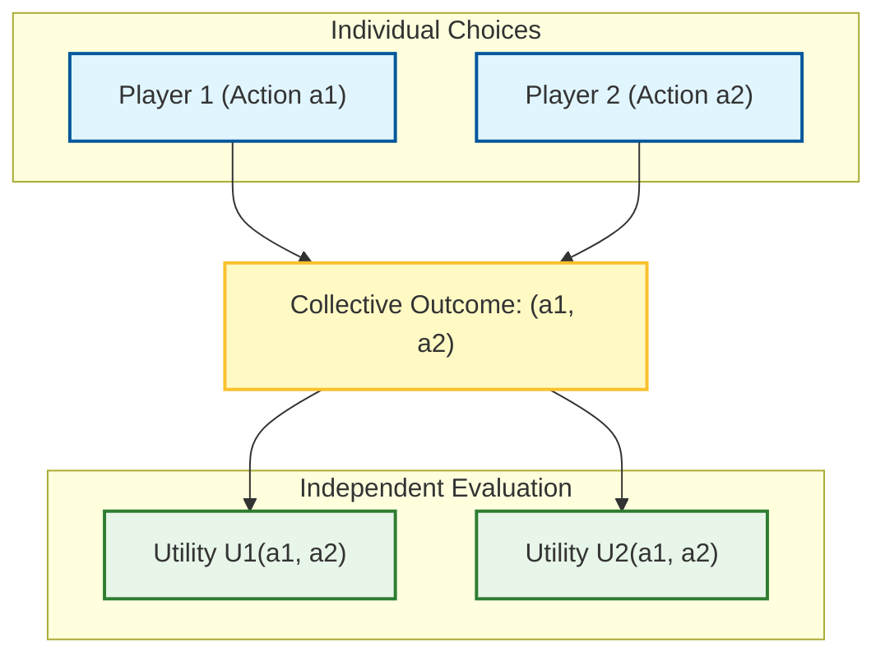
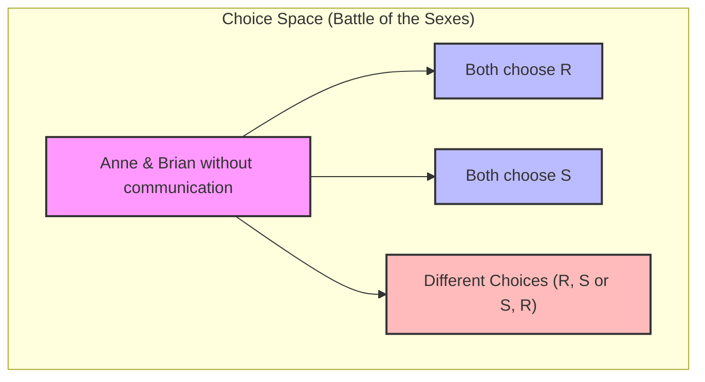
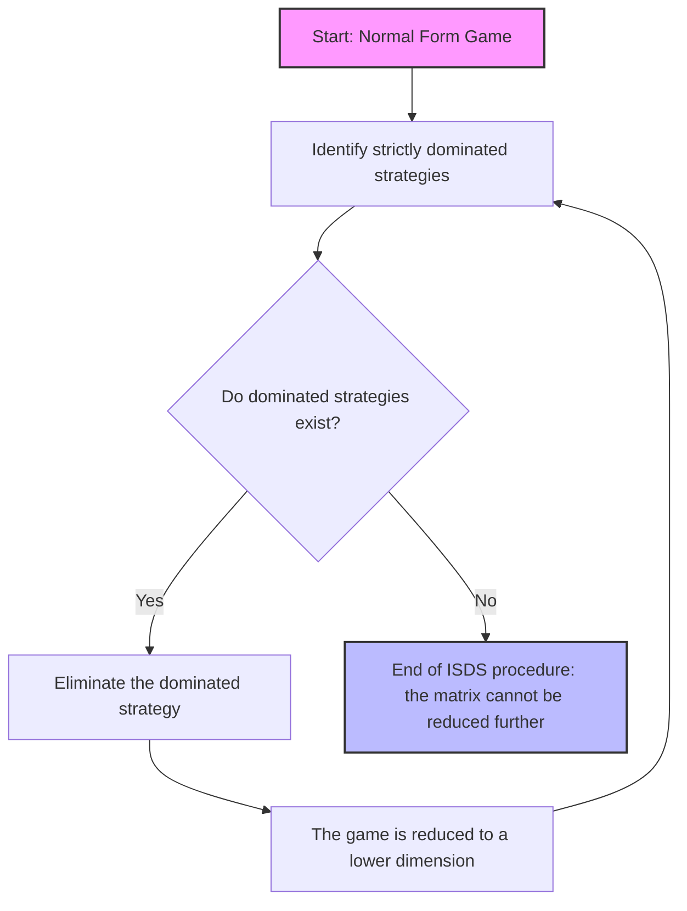

# Game Theory: Introduction to Static Games of Complete Information

## Educational Overview

In this lecture, we introduce the most elementary form of multi-agent interaction: **static games of complete information** (*Static Games of Complete Information*). The fundamental objective is to model the strategic interaction between multiple rational decision-makers, each oriented towards maximizing their own specific utility function or payoff (*Payoff Function*), without elements of spontaneous cooperation or altruism.

The core concepts covered include:
* **Rationality Hypothesis and Individual Payoffs**: Each player chooses their move to maximize their own utility return, taking into account that the other agents also rationally pursue the same self-interested goal.
* **Static Nature of the Game (*Static Game*)**: Players make decisions simultaneously and independently. The "static" attribute does not necessarily imply physical temporal simultaneity, but rather the strategic equivalence whereby no player knows the opponents' choice at the time of their own decision, nullifying time advantages (such as the first move in chess).
* **Complete Information (*Complete Information*)**: All participants know the game's rule set and each opponent's payoff functions perfectly. The only uncertainty lies in the actual action the counterparty will choose to play.
* **Introductory Models and Isomorphisms**: Analysis of simple zero-sum and two-player games, such as *Odds and Evens* (*Odds and Evens*), *Matching Pennies*, and *Rock-Paper-Scissors* (*Rock-Paper-Scissors*), highlighting their mathematical equivalence structure (strategic isomorphism).
* **Formalization of the Action Set**: Preliminary definition of the space of available alternatives for generic player $i$, denoted as the action set $A_i$.

---

### Fundamentals of Static Games of Complete Information, Common Knowledge, and Normal Form Representation

Static games of complete information represent the simplest form of multi-player interaction in Game Theory. The objective is to analyze the effects of the presence of multiple decision-making agents interacting strategically, starting from the baseline case without elements of randomness (absence of *chance* events) and without temporal asymmetries.

#### The Constituent Elements of a Static Game
To define a strategic interaction, we introduce three fundamental elements:
1. **Actions (or Strategies):** Each player independently and simultaneously chooses an action from their available set.
2. **Outcome:** The combination of the individual choices of all players determines the collective outcome of the game.
3. **Utility (Payoff):** Each player possesses their own utility function that evaluates the overall outcome based on their personal preferences.

Consider a set of $n$ players. Each player $i$ chooses an action $a_i$ from a set of available actions $A_i$. The set of all possible action combinations is given by the Cartesian product:
$$A = A_1 \times A_2 \times \dots \times A_n$$

The outcome of the game is an $n$-tuple of actions $(a_1, a_2, \dots, a_n)$. 
Each player $i$ pursues the maximization of their own utility function (or payoff) $u_i$, which maps the outcome of the interaction into a real number:
$$u_i: A_1 \times A_2 \times \dots \times A_n \to \mathbb{R}$$

*Key Concept:* Each player decides selfishly to maximize their own utility, disregarding the well-being of others. However, the crucial aspect is interdependence: my utility depends not only on what I do, but also on what others do.

---

#### Actions and Strategies: Pure Strategies
In the early stages of the course, we will deal with scenarios where a one-to-one correspondence between *action* and *strategy* exists. 
* **Pure Strategy:** It is a deterministic plan of action, namely a definite choice among the available alternatives in the set of moves. In static games of complete information, the choice reduces to selecting an action and adhering to it deterministically, since there is no possibility of reacting dynamically to others' moves (as these are unknown at the time of decision).

---

#### The Complete Information Hypothesis and Common Knowledge
The name "static games of complete information" encapsulates two fundamental assumptions:

1. **Staticity:** Players make their choices *simultaneously* or, from the standpoint of strategic effect, *independently* (without anyone knowing the other's move at the time of the choice). Physical simultaneity is not strictly necessary; what matters is that decisions are made without knowledge of others' choices.
2. **Complete Information:** It does not merely mean that the rules of the game are known, but that **the utility functions of all players are public knowledge**. 

To rigorously define this level of transparency, the concept of **Common Knowledge** is introduced:
A fact is *common knowledge* if all players know it, all know that the others know it, all know that the others know that the others know it, and so on ad infinitum ($ad\ libitum$). 

In static games of complete information, the following are *common knowledge*:
* The rules of the game and the sets of available strategies.
* The utility functions of all participants.
* The **rationality** of the players themselves (everyone knows that others are rational and aim to maximize their utility, and knows that others know that they are rational).

---

#### Normal Form Representation and Bimatrix
For a general $n$-player game, the formal mathematical representation (the **normal form representation**) is defined by the collection of strategy sets and utility functions:
$$\Gamma = \{S_1, S_2, \dots, S_n; u_1, u_2, \dots, u_n\}$$
*(Note: The number of players $n$ is implicitly deducible from the cardinality of the strategy sets or functions).*

In the special case of **two-player games**, the normal form can be visualized graphically through a two-way table called a **bimatrix**. 

* By convention, the strategies of **Player 1** are associated with the **rows**, while the strategies of **Player 2** are associated with the **columns**.
* Each cell of the table corresponds to an outcome (a combination of strategies) and contains an ordered pair of numbers: $(u_1, u_2)$, where the first element is Player 1's utility and the second is Player 2's utility.

##### Bimatrix Example
Consider a game in which Player A has three strategies available ($\text{U}, \text{M}, \text{D}$) and Player B has two strategies ($\text{L}, \text{R}$):

| Player A \ B | L | R |
| :---: | :---: | :---: |
| **U** | $(u_{1A}, u_{1B})$ | $(u_{2A}, u_{2B})$ |
| **M** | $(1, 0)$ | $(3, 2)$ |
| **D** | $(0, 4)$ | $(2, 1)$ |

* **Player A's Strategies:** $\{\text{U}, \text{M}, \text{D}\}$ (row choice).
* **Player B's Strategies:** $\{\text{L}, \text{R}\}$ (column choice).
* **Outcome:** If Player A chooses $\text{M}$ and Player B chooses $\text{L}$, the strategic outcome is the pair $(\text{M}, \text{L})$.
* **Utility (Payoff):** For the outcome $(\text{M}, \text{L})$, Player A's utility is $1$ and Player B's utility is $0$. Proper notation always distinguishes the strategic outcome $(\text{M}, \text{L})$ from the numerical utility values $(1, 0)$.

---

### Classical Game Models and Pareto Efficiency

In this section, we explore some of the classical game models in normal form representation (Normal Form Representation) and introduce a fundamental concept for evaluating outcomes: Pareto efficiency.

---

### Discoordination Games

We start from a classic intuitive example: the **odds and evens game** (*odds and evens*). Imagine two players betting a fixed amount of money, for example $4$ euros. 

The strategies available to the players do not require considering arbitrarily large numbers: it suffices to consider the parity of the chosen number, reducing the strategies to two options:
* $0$: even number.
* $1$: odd number.

An outcome such as $(0,0)$ means that both players have chosen an even number; consequently, the sum is even, the player who bet on odd loses, and the one on even wins. Assuming the players are risk-neutral (*risk-neutral*), the utilities correspond directly to monetary values: $+4$ for the winner and $-4$ for the loser.

This game exhibits a particular dynamic:
* One player wants to make the **same** move as the opponent.
* The other player wants to make a **different** move.

This type of interaction takes the formal name of **discoordination game** (*discoordination game*). Similar dynamics are found in very diverse contexts:
* In **soccer** (penalty kick between penalty taker and goalkeeper): if they aim for the same side, the penalty taker wins; if they aim for opposite sides, the goalkeeper wins.
* In **drone control** (*drone transmission*): one drone wants to transmit together with another, while the second prefers to avoid simultaneous transmission to prevent interference.

Another similar example is **Rock, Paper, Scissors** (**Sasso, Carta, Forbici** - *Rock, Paper, Scissors*), in which there are three (or more) strategies and utilities vary between win, loss, or tie ($0$ for both parties in the case of an identical choice).

---

### Coordination Games: Battle of the Sexes (*Battle of the Sexes*)

Let us now consider a mirror class of games, in which **both** players aim to make the same choice, despite having different preferences regarding the details.

The historical name of this model is **the battle of the sexes** (*battle of the sexes*), derived from the classic example in which two partners must decide independently (without being able to communicate) which evening event to attend, wavering between a boxing match and the opera. In a more modern version, we can imagine two partners, Anne and Brian, who need to meet at the cinema but have dead phone batteries. They must choose independently between two movies:
* A romantic movie ($R$).
* A science fiction movie ($S$).

#### Structure of Preferences and Utilities
* Anne prefers the romantic movie ($R$).
* Brian prefers the science fiction movie ($S$).
* The primary goal of both is to **meet** at the cinema: if they choose different movies, the utility is $0$ for both.
* If they choose the same movie, the utility reflects their personal preferences:
  * Both on $R$ (outcome $\text{double } R$): Anne gets a high utility of $2$, while Brian gets $1$.
  * Both on $S$ (outcome $\text{double } S$): Brian gets a high utility of $2$, while Anne gets $1$.

This scenario is formally defined as a **coordination game** (*coordination game*). The difficulty lies in the impossibility of communicating beforehand: players choose "blindly", trying to maximize their utility while knowing that coordinating on a suboptimal option for their personal taste is still preferable to failing to meet ($0$ utility).

---

### The Prisoner's Dilemma (*Prisoner's Dilemma*)

Another fundamental pillar of game theory is the **prisoner's dilemma** (*prisoner's dilemma*). 

#### The Classical Version
Two criminals (Al and Bob) are arrested and placed in separate cells, preventing them from communicating. The police possess sufficient evidence for a minor conviction, but need a confession for a major crime. Each prisoner is offered two choices:
* **Cooperate / Keep Quiet** ($M$ - *Mum*): remain silent.
* **Confess / Betray** ($F$ - *Fink*): confess and implicate the other.

The consequences (measured in months of prison, hence negative utility values) follow this logic:
* If both choose $M$ (remain silent), the minor evidence leads to $1$ month of prison for both.
* If both choose $F$ (confess), the cooperation is partially rewarded, leading to $6$ months of prison for both.
* If one confesses ($F$) and the other remains silent ($M$), the one who confessed is freed immediately ($0$ months), while the one who remained silent serves a severe sentence ($9$ months).

Even though cooperating by remaining silent ($M, M$) would lead to the best collective benefit, the individual incentive to defect pushes the players toward an inefficient outcome.

---

### Pareto Efficiency

To evaluate the quality of an outcome in a game, we introduce the concept of **Pareto efficiency**, introduced by the Italian economist and sociologist Vilfredo Pareto.

#### Definition
A joint strategy $S$ is said to be **Pareto dominated** (*Pareto dominated*) by another joint strategy $S'$ if:
1. The utility of every player $I$ under $S'$ is greater than or equal to the utility under $S$:
   $$U_I(S') \ge U_I(S) \quad \forall \text{ player } I$$
2. There exists at least one player for whom the inequality is strict:
   $$\exists J \text{ such that } U_J(S') > U_J(S)$$

If a joint strategy is **not** Pareto dominated by any other strategy, it is defined as **Pareto efficient** (*Pareto efficient*).

* **What does it mean in practice?** A Pareto-efficient situation is a state where it is impossible to improve anyone's condition without worsening someone else's. 
* Conversely, being in a Pareto-dominated strategy is "unreasonable", since there exists an alternative where no one is worse off and someone is decidedly better off.
* Often, in a game, **multiple Pareto-efficient strategies exist** that do not dominate one another (they simply represent different trade-offs among the players).

---

### Strictly Dominated Strategies and Iterated Elimination (ISDS)

The concept of Pareto dominance (or Pareto efficiency) evaluates the outcome of a game based on the joint well-being of the players, but often it is not sufficient to guide the strategic choice of an individual. To do this, we introduce the concept of a **strictly dominated strategy** (*strictly dominated strategy*).

A strategy of player $i$, which we denote by $s_i$, is said to be strictly dominated by another strategy $s'_i$ of theirs if, independently of the choices made by the other players, the first strategy always yields a strictly lower utility than the second.

Formally, strategy $s_i$ is strictly dominated by $s'_i$ if for every possible combination of strategies of the other players $s_{-i} = (s_1, \dots, s_{i-1}, s_{i+1}, \dots, s_N)$, the following strict inequality holds:

$$u_i(s_1, \dots, s'_i, \dots, s_N) > u_i(s_1, \dots, s_i, \dots, s_N)$$

#### The Principle of Rationality
If a player is **rational**, their objective is to maximize their utility. Knowing the rules of the game and the implications of their actions perfectly, a rational player will *never* choose to play a strictly dominated strategy. Doing so would be "foolish" (or irrational), since there exists an alternative ($s'_i$) that ensures a payoff that is always higher, regardless of what the opponents do.

*Note:* This does not mean that the dominating strategy $s'_i$ produces an absolute payoff that is always greater in every single outcome of the game compared to $s_i$. It means that, holding others' moves constant, the outcome associated with $s'_i$ is always strictly superior to the one associated with $s_i$.

---

### Iterated Elimination of Strictly Dominated Strategies (ISDS)

The true power of this concept emerges when it is applied iteratively. The **Iterated Elimination of Strictly Dominated Strategies** (*Iterated Elimination of Strictly Dominated Strategies - ISDS*) is a procedure based on logical reasoning that proceeds in successive steps, similar to the deductive method used by Sherlock Holmes (eliminating the impossible to arrive at the only logical solution).

#### How the Procedure Works:
1. **First level of elimination:** Strictly dominated strategies are identified in the original game matrix and removed, since no rational player will ever use them.
2. **Common information update:** Since players are rational and know that others are rational (complete information hypothesis and common knowledge of rationality), the removal of a strategy by a player is known to all.
3. **Iteration:** The removal of a "useless" strategy may render a previously undominated strategy suddenly dominated. By repeating the process, the size of the game is progressively reduced.

#### Practical Example of ISDS
* **Step 1:** In the initial matrix, player $A$ observes that strategy $D$ is strictly dominated by strategy $M$. $D$ is therefore eliminated.
* **Step 2:** Player $B$, knowing that $A$ is rational and will never play $D$, recalculates the payoff of their own moves. At this point, player $B$'s strategy $L$ becomes strictly dominated (since it provided good results only if $A$ had chosen $D$, an option that is now discarded). $L$ is eliminated as well.
* **Step 3:** With $L$ out of the game, player $A$ sees that their strategy $U$ is now dominated by $M$. $U$ is also eliminated.
* **Conclusion:** By iterating the process, one arrives at a unique predictable rational outcome, for example the strategy pair $(M, R)$.

---

### The Prisoner's Dilemma and Limitations of ISDS

#### The Case of the Prisoner's Dilemma (*Prisoner's Dilemma*)
Applying ISDS to the famous **Prisoner's Dilemma** (where players can Confess $F$ or Keep silent $M$), one finds that the strategy of confessing ($F$) strictly dominates that of not confessing ($M$) for both players. 

Iterated elimination leaves as the unique rational outcome the pair $(F, F)$ (both confess). However, this outcome is **inefficient** in the Pareto sense: there exists an alternative outcome, namely $(M, M)$, that would guarantee both players a higher overall utility. This highlights the paradox whereby strictly individual and rational choice leads to a socially poor outcome.

#### When ISDS Fails
Despite being a formidable tool, ISDS **does not always guarantee a solution**. There are entire games in which:
* No strictly dominated strategies exist from the outset.
* The procedure fails to reduce the matrix, leaving players without a clear logical prediction based solely on this criterion (e.g., games like *Odds and Evens* or the *Battle of the Sexes*).

In these cases, even though we know that players are intelligent and that optimal outcomes exist, ISDS is not sufficient to justify the theoretical prediction, making it necessary to use more advanced solution concepts (such as the Nash equilibrium).