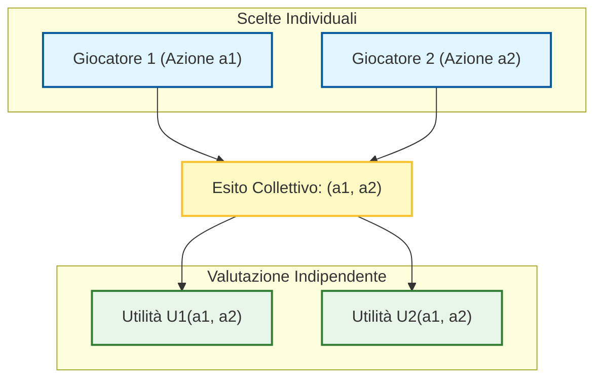
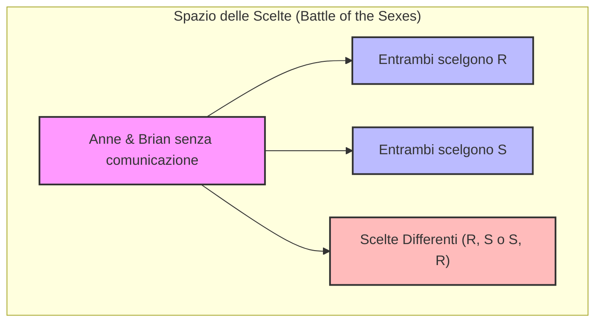
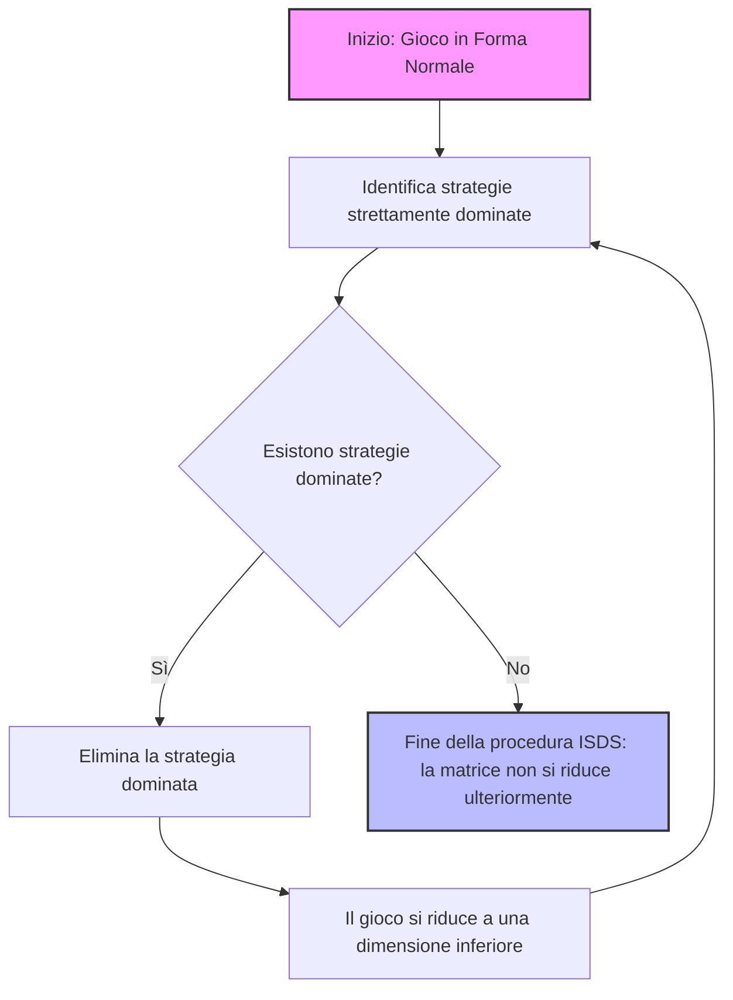

# Teoria dei Giochi: Introduzione ai Giochi Statici a Informazione Completa

## Overview Didattica

In questa lezione si introduce la forma più elementare di interazione multi-agente: i **giochi statici a informazione completa** (*Static Games of Complete Information*). L'obiettivo fondamentale è modellare l'interazione strategica tra più decisori razionali, ciascuno orientato alla massimizzazione della propria specifica funzione di utilità o payoff (*Payoff Function*), senza elementi di cooperazione spontanea o altruismo.

I concetti cardine trattati includono:
* **Ipotesi di Razionalità e Payoff Individuali**: Ogni giocatore sceglie la propria mossa per massimizzare il proprio ritorno di utilità, tenendo conto del fatto che anche gli altri agenti perseguono razionalmente il medesimo obiettivo egoistico.
* **Natura Statica del Gioco (*Static Game*)**: I giocatori prendono decisioni in modo simultaneo e indipendente. L'attributo "statico" non implica necessariamente una simultaneità temporale fisica, bensì l'equivalenza strategica per cui nessun giocatore conosce la scelta degli avversari al momento della propria decisione, annullando vantaggi di tempo (come la prima mossa negli scacchi).
* **Informazione Completa (*Complete Information*)**: Tutti i partecipanti conoscono perfettamente l'insieme delle regole del gioco e le funzioni di payoff di ciascun avversario. L'unica incertezza risiede nell'azione effettiva che la controparte deciderà di giocare.
* **Modelli Introduttivi ed Isomorfismi**: Analisi di semplici giochi a somma zero e a due giocatori, come il *Pari o Dispari* (*Odds and Evens*), il *Matching Pennies* e la *Morra Cinese* (*Rock-Paper-Scissors*), evidenziandone la struttura di equivalenza matematica (isomorfismo strategico).
* **Formalizzazione dell'Insieme delle Azioni**: Definizione preliminare dello spazio delle alternative disponibili per il generico giocatore $i$, denotato come insieme delle azioni $A_i$.

---

### Fondamenti dei giochi statici a informazione completa, common knowledge e rappresentazione in forma normale

I giochi statici a informazione completa rappresentano la forma più semplice di interazione multi-giocatore nella Teoria dei Giochi (Game Theory). L'obiettivo è analizzare gli effetti della presenza di più agenti decisionali che interagiscono in modo strategico, partendo dal caso base senza elementi di casualità (assenza di eventi di *chance*) e senza asimmetrie temporali.

#### Gli elementi costitutivi di un gioco statico
Per definire un'interazione strategica, introduciamo tre elementi fondamentali:
1. **Azioni (o Strategie):** Ciascun giocatore sceglie in modo indipendente e simultaneo un'azione dal proprio insieme di disponibilità.
2. **Esito (Outcome):** La combinazione delle singole scelte di tutti i giocatori determina l'esito collettivo del gioco.
3. **Utilità (Payoff):** Ciascun giocatore possiede una propria funzione di utilità che valuta l'esito complessivo in base alle proprie preferenze personali.

Consideriamo un insieme di $n$ giocatori. Ogni giocatore $i$ sceglie un'azione $a_i$ da un insieme di azioni disponibili $A_i$. L'insieme di tutte le possibili combinazioni di azioni è dato dal prodotto cartesiano:
$$A = A_1 \times A_2 \times \dots \times A_n$$

L'esito del gioco è una $n$-upla di azioni $(a_1, a_2, \dots, a_n)$. 
Ogni giocatore $i$ persegue la massimizzazione della propria funzione di utilità (o payoff) $u_i$, la quale mappa l'esito dell'interazione in un numero reale:
$$u_i: A_1 \times A_2 \times \dots \times A_n \to \mathbb{R}$$

*Concetto Chiave:* Ciascun giocatore decide in modo egoista per massimizzare la propria utilità, disinteressandosi del benessere altrui. Tuttavia, l'aspetto cruciale è l'interdipendenza: la mia utilità non dipende solo da ciò che faccio io, ma anche da ciò che fanno gli altri.

---

#### Azioni e Strategie: Strategie Pure
Nelle prime fasi del corso tratteremo scenari in cui esiste una corrispondenza biunivoca tra *azione* e *strategia*. 
* **Strategia Pura (Pure Strategy):** È un piano d'azione deterministico, ovvero una scelta certa tra le alternative disponibili nel set di mosse. Nei giochi statici a informazione completa, la scelta si riduce a selezionare un'azione e mantenerla in modo deterministico, poiché non vi è la possibilità di reagire dinamicamente alle mosse altrui (essendo queste ignote al momento della decisione).

---

#### L'ipotesi di Informazione Completa e il Common Knowledge
Il nome "giochi statici a informazione completa" racchiude due assunzioni fondamentali:

1. **Staticità:** I giocatori compiono le proprie scelte *simultaneamente* oppure, dal punto di vista dell'effetto strategico, in modo *indipendente* (senza che nessuno conosca la mossa dell'altro al momento della scelta). La simultaneità fisica non è strettamente necessaria; ciò che conta è che le decisioni vengano prese all'insaputa delle scelte altrui.
2. **Informazione Completa:** Non significa soltanto che le regole del gioco sono note, ma che **le funzioni di utilità di tutti i giocatori sono di dominio pubblico**. 

Per definire rigorosamente questo livello di trasparenza, si introduce il concetto di **Common Knowledge (Sapere Comune)**:
Un fatto è *common knowledge* se tutti i giocatori lo sanno, tutti sanno che gli altri lo sanno, tutti sanno che gli altri sanno che gli altri lo sanno, e così via all'infinito ($ad\ libitum$). 

Nei giochi statici a informazione completa, sono *common knowledge*:
* Le regole del gioco e gli insiemi di strategie disponibili.
* Le funzioni di utilità di tutti i partecipanti.
* La **razionalità** dei giocatori stessi (ognuno sa che gli altri sono razionali e mirano a massimizzare la propria utilità, e sa che gli altri sanno che lui è razionale).

---

#### Rappresentazione in Forma Normale e Bi-Matrice
Per un gioco generale a $n$ giocatori, la rappresentazione matematica formale (la **forma normale (normal form representation)**) è definita dalla collezione degli insiemi di strategie e delle funzioni di utilità:
$$\Gamma = \{S_1, S_2, \dots, S_n; u_1, u_2, \dots, u_n\}$$
*(Nota: Il numero dei giocatori $n$ è implicitamente deducibile dalla cardinalità degli insiemi di strategie o delle funzioni).*

Nel caso particolare di **giochi a due giocatori**, la forma normale può essere visualizzata graficamente tramite una tabella a doppia entrata chiamata **bi-matrice (bimatrix)**. 

* Convenzionalmente, le strategie del **Giocatore 1** sono associate alle **righe**, mentre le strategie del **Giocatore 2** sono associate alle **colonne**.
* Ogni cella della tabella corrisponde a un esito (una combinazione di strategie) e contiene una coppia ordinata di numeri: $(u_1, u_2)$, dove il primo elemento è l'utilità del Giocatore 1 e il secondo è l'utilità del Giocatore 2.

##### Esempio di Bi-Matrice
Consideriamo un gioco in cui il Giocatore A ha tre strategie a disposizione ($\text{U}, \text{M}, \text{D}$) e il Giocatore B ha due strategie ($\text{L}, \text{R}$):

| Giocatore A \ B | L | R |
| :---: | :---: | :---: |
| **U** | $(u_{1A}, u_{1B})$ | $(u_{2A}, u_{2B})$ |
| **M** | $(1, 0)$ | $(3, 2)$ |
| **D** | $(0, 4)$ | $(2, 1)$ |

* **Strategie del Giocatore A:** $\{\text{U}, \text{M}, \text{D}\}$ (scelta della riga).
* **Strategie del Giocatore B:** $\{\text{L}, \text{R}\}$ (scelta della colonna).
* **Esito (Outcome):** Se il Giocatore A sceglie $\text{M}$ e il Giocatore B sceglie $\text{L}$, l'esito strategico è la coppia $(\text{M}, \text{L})$.
* **Utilità (Payoff):** Per l'esito $(\text{M}, \text{L})$, l'utilità del Giocatore A è $1$ e l'utilità del Giocatore B è $0$. La notazione corretta distingue sempre l'esito strategico $(\text{M}, \text{L})$ dai valori numerici di utilità $(1, 0)$.

---

### Modelli Classici di Gioco ed Efficienza Paretiana

In questa sezione esploriamo alcuni dei modelli classici di gioco in forma normale (Normal Form Representation) e introduciamo un concetto fondamentale per la valutazione dei risultati: l'efficienza paretiana.

---

### Giochi di Discoordinazione (Discoordination Games)

Partiamo da un classico esempio intuitivo: il **gioco di pari e dispari** (*odds and evens*). Immaginiamo due giocatori che scommettono una quantità fissa di denaro, ad esempio $4$ euro. 

Le strategie a disposizione dei giocatori non richiedono di considerare numeri arbitrariamente grandi: basta considerare la parità del numero scelto, riducendo le strategie a due opzioni:
* $0$: numero pari.
* $1$: numero dispari.

Un esito come $(0,0)$ significa che entrambi i giocatori hanno scelto un numero pari; di conseguenza la somma è pari, il giocatore che puntava sul dispari perde e quello sul pari vince. Assumendo che i giocatori siano neutrali al rischio (*risk-neutral*), le utilità corrispondono direttamente ai valori monetari: $+4$ per il vincitore e $-4$ per il perdente.

Questo gioco presenta una dinamica particolare:
* Un giocatore vuole fare la **stessa** mossa dell'avversario.
* L'altro giocatore vuole fare una mossa **diversa**.

Questo tipo di interazione prende il nome formale di **gioco di discoordinazione** (*discoordination game*). Dinamiche simili si ritrovano in contesti molto diversi:
* Nel **calcio** (rigore tra rigorista e portiere): se tirano dallo stesso lato, vince il rigorista; se tirano da lati opposti, vince il portiere.
* Nel **controllo di droni** (*drone transmission*): un drone vuole trasmettere insieme a un altro, mentre il secondo preferisce evitare la trasmissione simultanea per evitare interferenze.

Un altro esempio simile è la morra cinese (**Sasso, Carta, Forbici** - *Rock, Paper, Scissors*), in cui le strategie sono tre (o più) e le utilità variano tra vincita, perdita o pareggio ($0$ per entrambe le parti in caso di scelta identica).

---

### Giochi di Coordinazione: La Battaglia dei SessI (*Battle of the Sexes*)

Consideriamo ora una classe di giochi speculare, in cui **entrambi** i giocatori hanno l'obiettivo di compiere la stessa scelta, pur avendo preferenze differenti sui dettagli.

Il nome storico di questo modello è **la battaglia dei sessi** (*battle of the sexes*), derivato dal classico esempio in cui due partner devono decidere in modo indipendente (senza poter comunicare) quale spettacolo seguire la sera, oscillando tra un incontro di boxe e l'opera lirica. In una versione più moderna, possiamo immaginare due partner, Anne e Brian, che devono incontrarsi al cinema ma hanno il telefono scarico. Devono scegliere indipendentemente tra due film:
* Un film romantico ($R$).
* Un film di fantascienza ($S$).

#### Struttura delle Preferenze e Utilità
* Anne preferisce il film romantico ($R$).
* Brian preferisce il film di fantascienza ($S$).
* L'obiettivo principale di entrambi è **incontrarsi** al cinema: se scelgono film diversi, l'utilità è $0$ per entrambi.
* Se scelgono lo stesso film, l'utilità riflette le loro preferenze personali:
  * Entrambi su $R$ (esito $\text{double } R$): Anne ottiene un'utilità elevata pari a $2$, mentre Brian ottiene $1$.
  * Entrambi su $S$ (esito $\text{double } S$): Brian ottiene un'utilità elevata pari a $2$, mentre Anne ottiene $1$.

Questo scenario viene definito formalmente **gioco di coordinazione** (*coordination game*). La difficoltà risiede nell'impossibilità di comunicare preventivamente: i giocatori scelgono "alla cieca", cercando di massimizzare la propria utilità pur sapendo che coordinarsi su un'opzione sub-ottimale per il proprio gusto personale è comunque preferibile al mancato incontro ($0$ di utilità).

---

### Il Dilemma del Prigioniero (*Prisoner's Dilemma*)

Un altro pilastro fondamentale della teoria dei giochi è il **dilemma del prigioniero** (*prisoner's dilemma*). 

#### La Versione Classica
Due criminali (Al e Bob) vengono arrestati e messi in celle separate, impedendo loro di comunicare. La polizia possiede prove sufficienti per una condanna minore, ma ha bisogno della confessione per un reato maggiore. A ciascun prigioniero vengono offerte due scelte:
* **Collaborare / Tacere** ($M$ - *Mum*): rimanere in silenzio.
* **Confessare / Tradire** ($F$ - *Fink*): confessare e accusare l'altro.

Le conseguenze (misurate in mesi di prigione, quindi valori di utilità negativi) seguono questa logica:
* Se entrambi scelgono $M$ (tacere), le prove minori portano a $1$ mese di prigione per entrambi.
* Se entrambi scelgono $F$ (confessare), la collaborazione viene premiata parzialmente, portando a $6$ mesi di prigione per entrambi.
* Se uno confessa ($F$) e l'altro tace ($M$), chi ha confessato viene liberato immediatamente ($0$ mesi), mentre chi è rimasto in silenzio sconta una pena severa ($9$ mesi).

Nonostante cooperare tacendo ($M, M$) porterebbe al beneficio collettivo migliore, l'incentivo individuale a tradire spinge i giocatori verso un esito inefficiente.

---

### Efficienza Paretiana (Pareto Efficiency)

Per valutare la bontà di un esito in un gioco, introduciamo il concetto di **efficienza paretiana**, introdotto dall'economista e sociologo italiano Vilfredo Pareto.

#### Definizione
Una strategia congiunta $S$ si dice **dominata pareticamente** (*Pareto dominated*) da un'altra strategia congiunta $S'$ se:
1. L'utilità di ogni giocatore $I$ sotto $S'$ è maggiore o uguale all'utilità sotto $S$:
   $$U_I(S') \ge U_I(S) \quad \forall \text{ giocatore } I$$
2. Esiste almeno un giocatore per cui la disuguaglianza è stretta:
   $$\exists J \text{ tale che } U_J(S') > U_J(S)$$

Se una strategia congiunta **non** è dominata pareticamente da nessun'altra strategia, viene definita **efficiente in senso di Pareto** (*Pareto efficient*).

* **Cosa significa in pratica?** Una situazione Pareto-efficiente è un punto in cui non è possibile migliorare la condizione di nessuno senza peggiorare quella di qualcun altro. 
* Al contrario, trovarsi in una strategia Pareto-dominata è "irragionevole", poiché esiste un'alternativa in cui nessuno ci rimette e qualcuno sta decisamente meglio.
* Spesso, in un gioco, **esistono molteplici strategie Pareto-efficienti** che non dominano l'una l'altra (rappresentano semplicemente differenti trade-off tra i giocatori).

---

### Strategie Strettamente Dominate e Eliminazione Iterata (ISDS)

Il concetto di dominanza paretiana (o efficienza paretiana) valuta l'esito di un gioco basandosi sul benessere congiunto dei giocatori, ma spesso non basta a guidare la scelta strategica del singolo. Per fare questo, introduciamo il concetto di **strategia strettamente dominata** (*strictly dominated strategy*).

Una strategia di un giocatore $i$, che indichiamo con $s_i$, si dice strettamente dominata da un'altra sua strategia $s'_i$ se, indipendentemente dalle scelte compiute dagli altri giocatori, la prima strategia garantisce sempre un'utilità strettamente inferiore rispetto alla seconda.

Formalmente, la strategia $s_i$ è strettamente dominata da $s'_i$ se per ogni possibile combinazione delle strategie degli altri giocatori $s_{-i} = (s_1, \dots, s_{i-1}, s_{i+1}, \dots, s_N)$, vale la seguente disuguaglianza stretta:

$$u_i(s_1, \dots, s'_i, \dots, s_N) > u_i(s_1, \dots, s_i, \dots, s_N)$$

#### Il principio di razionalità
Se un giocatore è **razionale**, il suo obiettivo è massimizzare la propria utilità. Conoscendo perfettamente le regole del gioco e le implicazioni delle proprie azioni, un giocatore razionale non sceglierà *mai* di giocare una strategia strettamente dominata. Farlo sarebbe "stupido" (o irrazionale), poiché esiste un'alternativa ($s'_i$) che assicura un payoff sempre superiore, a prescindere da cosa faranno gli avversari.

*Nota:* Questo non significa che la strategia dominante $s'_i$ produca un payoff assoluto sempre maggiore in ogni singolo esito del gioco rispetto a $s_i$. Significa che, a parità di mosse altrui, l'esito associato a $s'_i$ è sempre strettamente superiore a quello associato a $s_i$.

---

### Eliminazione Iterata di Strategie Strettamente Dominate (ISDS)

Il vero potere di questo concetto emerge quando viene applicato in modo iterativo. L'**Eliminazione Iterata di Strategie Strettamente Dominate** (*Iterated Elimination of Strictly Dominated Strategies - ISDS*) è una procedura basata sul ragionamento logico che procede per passi successivi, simile al metodo deduttivo utilizzato da Sherlock Holmes (eliminare l'impossibile per arrivare all'unica soluzione logica).

#### Come funziona la procedura:
1. **Primo livello di eliminazione:** Si identificano le strategie strettamente dominate nella matrice di gioco originale e le si rimuovono, poiché nessun giocatore razionale le utilizzerà mai.
2. **Aggiornamento comune delle informazioni:** Poiché i giocatori sono razionali e sanno che gli altri sono razionali (ipotesi di informazione completa e comune conoscenza della razionalità), la rimozione di una strategia da parte di un giocatore è nota a tutti.
3. **Iterazione:** La rimozione di una strategia "inutile" può rendere una strategia precedentemente non dominata improvvisamente dominata. Ripetendo il processo, si riduce progressivamente la dimensione del gioco.

#### Esempio pratico di ISDS
* **Passo 1:** Nella matrice iniziale, il giocatore $A$ osserva che la strategia $D$ è strettamente dominata dalla strategia $M$. $D$ viene quindi cancellata.
* **Passo 2:** Il giocatore $B$, sapendo che $A$ è razionale e non giocherà mai $D$, ricalcola la convenienza delle proprie mosse. A questo punto, la strategia $L$ di $B$ diventa strettamente dominata (poiché dava buoni risultati solo se $A$ avesse scelto $D$, opzione ormai scartata). Anche $L$ viene eliminata.
* **Passo 3:** Con $L$ fuori dai giochi, il giocatore $A$ vede che la sua strategia $U$ è ora dominata da $M$. Anche $U$ viene eliminata.
* **Conclusione:** Iterando il processo, si arriva a un unico esito razionale prevedibile, ad esempio la coppia di strategie $(M, R)$.

---

### Il Dilemma del Prigioniero e le Limitazioni dell'ISDS

#### Il caso del Dilemma del Prigioniero (*Prisoner's Dilemma*)
Applicando l'ISDS al celebre **Dilemma del Prigioniero** (dove i giocatori possono Confessare $F$ o Mantenere il silenzio $M$), si scopre che la strategia di confessare ($F$) domina strettamente quella di non confessare ($M$) per entrambi i giocatori. 

L'eliminazione iterata lascia come unico esito razionale la coppia $(F, F)$ (entrambi confessano). Tuttavia, questo esito è **inefficiente** in senso paretiano: esiste un esito alternativo, ovvero $(M, M)$, che garantirebbe a entrambi i giocatori un'utilità complessiva maggiore. Questo evidenzia il paradosso per cui la scelta strettamente individuale e razionale conduce a un risultato socialmente misero.

#### Quando l'ISDS fallisce
Nonostante sia uno strumento formidabile, l'ISDS **non sempre garantisce una soluzione**. Vi sono interi giochi in cui:
* Non esistono strategie strettamente dominate fin dal principio.
* La procedura non riesce a ridurre la matrice, lasciando i giocatori senza una chiara predizione logica basata unicamente su questo criterio (es. giochi come *Pari e Dispari* o la *Battaglia dei SessI*).

In questi casi, pur sapendo che i giocatori sono intelligenti e che esistono esiti ottimali, l'ISDS non è sufficiente per giustificare la previsione teorica, rendendo necessario l'utilizzo di concetti di soluzione più avanzati (come l'equilibrio di Nash).