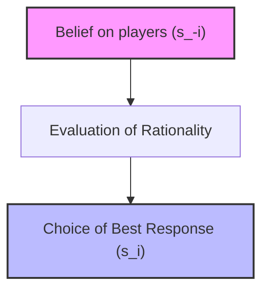
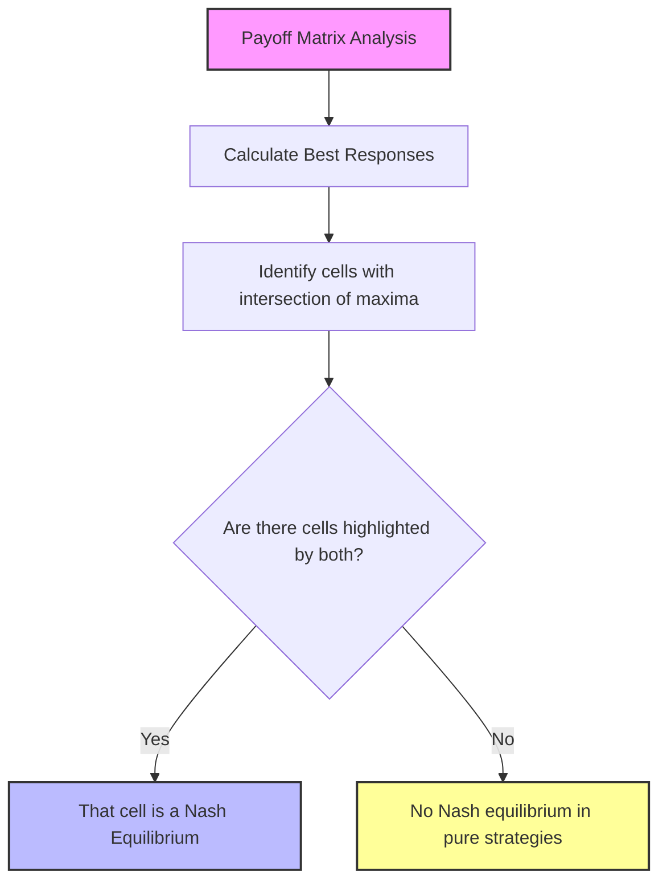
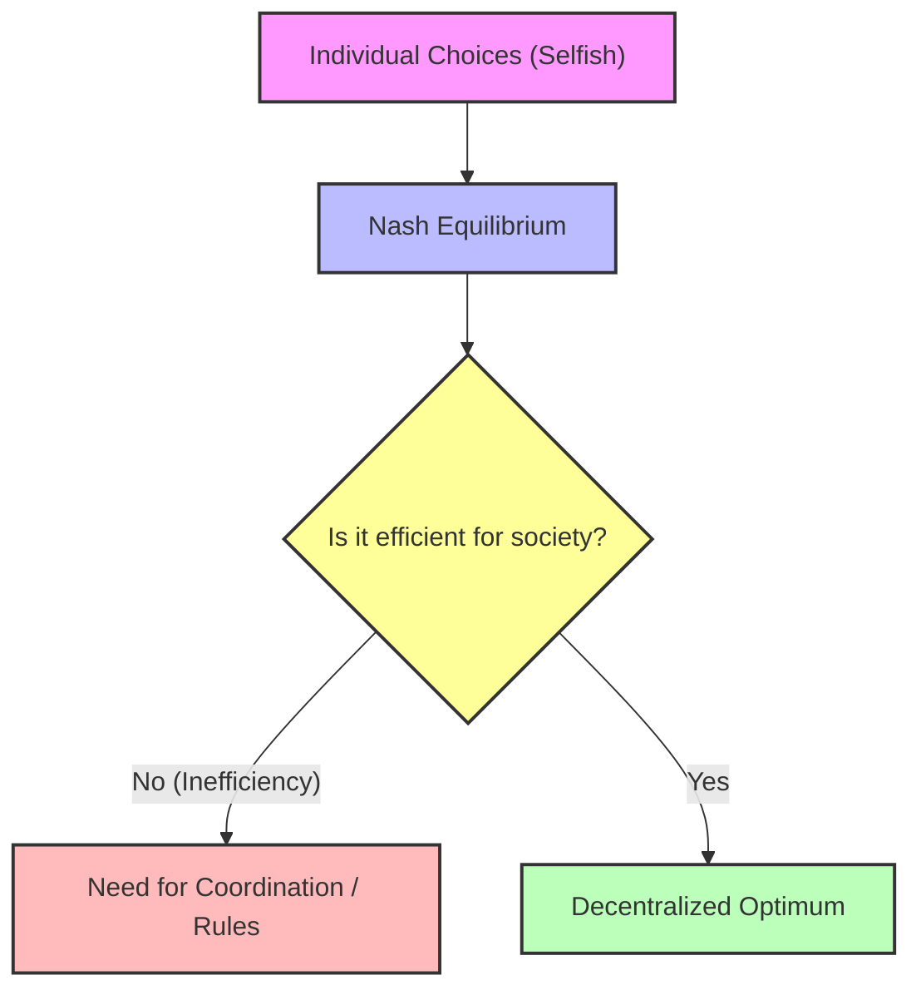

# Game Theory: Rational Solutions and the Concept of Best Response

## Didactic Overview

This lecture addresses the problem of identifying stable and rational solutions within multi-player game contexts, overcoming the intrinsic limitations of methods based on pure elimination. 

The highlighted points covered include:
* **From the "destructive" to the "constructive" method:** Iterated Elimination of Strictly Dominated Strategies (IESDS/ISDS), however rigorous, fails in most practical cases as it tends to leave multiple admissible strategies rather than a single deterministic solution. This gives rise to the need to construct a solution directly based on the players' optimal choices.
* **Formal definition of Best Response:** Identification of a player's strategy that maximizes their utility function ($u_i$) given a fixed and specific profile of opponents' choices, concisely denoted by the vector $s_{-i}$.
* **Distinction between Dominant Strategy and Best Response:** While a dominant strategy must be strictly better regardless of others' moves (a condition rarely verified), a best response is constrained to a specific opponent contingency and is always guaranteed for finite sets of alternatives.
* **Property of non-uniqueness:** Analysis of the mathematical reason why, strictly speaking, the best response cannot be defined generically as a "function" (but rather as a multi-valued correspondence or relation), given that multiple responses guaranteeing the same maximum pay-off can coexist for the same move of the opponent.

---

### Foundations of Rationality: Best Responses and Beliefs

#### Beyond the Destructive Solution: The Limit of Classical Rationality
In multi-player games, determining the optimal move a priori is complex because the outcome depends directly on the choices of others. In the previous lecture, we introduced the Iterated Elimination of Strictly Dominated Strategies (ISDS). This approach acts in a "destructive" way, comparable to how a sculptor removes excess marble to free the statue (the metaphor of Michelangelo's David).

However, the parallelism with Sherlock Holmes's deductive method shows its limits in reality:
* **"Plot Armor":** In fictional narratives, the detective always solves cases by removing impossibilities until the single correct solution is isolated.
* **Reality:** In most real games (*my majoria* type situations), the removal of dominated strategies does not leave a single solution, but still leaves multiple options open. 

Having to act constructively rather than purely subtractive, it is necessary to introduce formal concepts of rationality based on how players strategically react to the moves of others.

---

#### Formal Definition of Best Response
A strategy is a best response when it guarantees the player a utility greater than or equal to any other choice, given the behavior of the opponents.

Let $I$ be the set of players. To indicate the strategy vector of all players *except* player $i$, Game Theory uses the notation $s_{-i}$ (where the minus sign does not indicate a negative index, but the exclusion of element $i$). 
The complete vector is therefore $(s_i, s_{-i})$, belonging to the Cartesian product of the strategies.

##### Mathematical Definition
Strategy $s_i$ is a **best response** with respect to the opponents' strategy profile $s_{-i}$ if and only if:

$$U_i(s_i, s_{-i}) \ge U_i(s_i', s_{-i}) \quad \forall s_i' \in S_i$$

Where:
* $U_i$ is the utility function of player $i$.
* $s_i$ is the move chosen by player $i$.
* $s_i'$ represents any other alternative strategy available in the strategy space $S_i$.

##### Intuitive Example
Think of a penalty kick: the penalty taker's best response depends on what the goalkeeper does. If the goalkeeper dives to the left, the kicker's best response is to shoot to the right; if the goalkeeper dives to the right, the optimal strategy changes. The best response is always conditioned by a specific variable (the other person's move).

> **Key Concept:** Difference between Dominant Strategy and Best Response
> * **Dominant Strategy:** A choice that is always better than the others, *regardless* of what the opponents do. It does not always exist (e.g., the offer of a date with a celebrity like Sydney Sweeney represents an ideal dominant choice, but in reality it is not available).
> * **Best Response:** An optimal choice *conditioned* on a specific move or profile of others ($s_{-i}$). Unlike the dominant strategy, the best response always exists because alternatives are evaluated based on a fixed context.

---

#### The Uniqueness Problem: Functions vs Associations
Many economic textbooks improperly define the *"best response function"*. Formally in mathematics, for a relation to be a function, every element in the domain must correspond to **one and only one** element in the codomain. 

* *Bertrand Russell's example:* To distinguish a function from a non-function, the philosopher Bertrand Russell used the concept of "wife". In a monogamous society, the relation *"wife of $X$"* is a function because every married man corresponds to a single wife. In cultures where polygamy is permitted, the relation is not a function.
* *In our context:* The best response **is not unique** in general. Two or more strategies may exist that guarantee the same maximum utility given an opponent's move.

Consequently, the best response does not map a single value, but formally behaves like an **association** (represented at the theoretical level with double arrows) or, more rigorously, as a function mapping beliefs into the **power set** ($\mathcal{P}(S_i)$, the set of all possible subsets of $S_i$).

---

#### Beliefs and Rationality
While calculating the best response is a simple algebraic operation when knowing the payoff matrix (bi-matrix), the real critical node is **hypothesizing what others will do**.

* **Preliminary theorem:** If a strategy $s_i$ is *strictly dominated*, it can **never** be a best response to any belief or opponent's move.

##### What is a Belief?
In Game Theory, the term **belief** loses any religious or fideistic connotation:
* A belief is not a dogmatic conviction, but a working hypothesis (a conditional *"if"* block).
* It corresponds to a possible move (or a vector of joint moves $s_{-i}$) that the other players could make.

##### The Belief-Based Decision Mechanism
The mental process of a rational player with complete information unfolds as follows:
1. **Hypothesis:** I believe (by intuition, deduction, or sudden insight) that the opponents will play profile $s_{-i}$.
2. **Action:** Since I am a rational player, I choose to play a **best response** with respect to that belief ($s_{-i}$).

##### Limits of the Belief Model
The reasoning still presents two open points:
1. **Why do we believe a certain move?** There is no objective proof a priori; it is a conditional hypothesis ("if the others do X...").
2. **Which best response to choose in the presence of multiple equivalent optimal options?** If the analysis produces more than one best response, the model does not define a single deterministic behavior, although the alternatives lead to equivalent utility levels.

---

### Nash Equilibrium: Definition, Resolution Methods, and Relation with IESDS

After analyzing the foundations and construction of games, we introduce the undisputed protagonist of game theory: the **Nash Equilibrium**. Often known to the general public thanks to the biographical film *A Beautiful Mind* about John Nash (albeit with due cinematic license regarding the mathematician's true story), this concept represents the fundamental pillar for predicting the behavior of rational players.

---

### From Best Response to Self-Enforcing Prophecy

To understand the Nash Equilibrium, let's start with an analogy. Calculating the best response in a complete information game is conceptually simple if we find ourselves "from above", meaning if we know everyone's moves. The real problem, instead, is understanding what others will do. 

Game theory behaves similarly to magic, particularly in two aspects:
1. **Action at a distance:** an action performed by a player produces immediate effects on the decisions and payoffs of others (as in a telecommunications system).
2. **Capacity to make prophecies:** formulating a prediction (prophecy) on the future behavior of participants that turns out to be correct, even in the absence of an author who wrote the plot in advance (unlike what happens in novels).

A **Nash Equilibrium** is precisely a "self-enforcing prophecy": each player chooses a strategy that constitutes the best response to (correct) beliefs about the choices of others.

#### Formal Definition
In a game with $N$ players, a strategy vector $(S_1^*, S_2^*, \dots, S_N^*)$ is called a **Nash Equilibrium** if, for every player $i$, strategy $S_i^*$ is the best response to the strategies of all other players:

$$S_i^* \in \arg\max_{S_i} u_i(S_i, S_{-i}^*)$$

where $S_{-i}^*$ means the set of strategies of all players *except* the $i$-th one. In simple words: no player has a unilateral incentive to change their move, given the behavior of others.

---

### The Concept of Regret and Unilateral Deviation

An intuitive way to verify if we are facing a Nash Equilibrium is to analyze **regret**. 

Imagine finding ourselves at the end of a match and a player realizing they did not play the best response. This generates an **incentive for unilateral deviation**, meaning the desire to change move knowing what the others did.

> [!KEY CONCEPT]
> A **Nash Equilibrium** is a situation in which **no player has regrets** regarding their choice, since everyone is effectively playing the best response with respect to what the others are doing.

* **Watch out for misunderstandings:** 
  1. It is generally not permitted to "go back" and change moves (static games do not allow it).
  2. A Nash equilibrium does not guarantee a "social optimum" or a super-intelligent outcome; it only guarantees that, given the circumstances and the choices of others, the player has no interest in deviating alone.

---

### Resolution Methods: Isolation of Best Responses

A practical and constructive method to find Nash equilibria in a payoff matrix consists of identifying the best responses for each player:
1. For each column (choice of player B), the maximum payoff for player A is highlighted.
2. For each row (choice of player A), the maximum payoff for player B is highlighted.
3. The cells where **both values are highlighted** represent the **Nash Equilibria**.

However, one must consider that:
* No Nash equilibrium (in pure strategies) may exist, as in the game *Matching Pennies* or penalty kicks viewed antagonistically.
* **Multiple Nash equilibria** may exist (e.g., *Battle of the Sexes*), making it more difficult to predict which outcome the players will choose.
* An equilibrium can be socially inefficient (e.g., the *Prisoner's Dilemma*, where mutual confession is a Nash equilibrium despite leading to a very poor overall result).

---

### Relation between Nash Equilibrium and IESDS

There is a deep connection between the Iterated Elimination of Strictly Dominated Strategies (**IESDS**) and the Nash equilibrium.

#### Connection Theorem
* **If a game has a single outcome that survived IESDS**, that outcome **is a Nash Equilibrium**.
* More generally, **all Nash equilibria survive IESDS** (no Nash equilibrium can contain strictly dominated strategies, since a rational player will never play a dominated strategy as a best response).

Furthermore, **IESDS is order irrelevant**: the elimination path does not alter the final result if one proceeds with strictly dominated strategies.

#### Weak vs Strict Dominance
What happens if we consider weak dominance instead of strict dominance?
* If every player possesses a dominant strategy (even weakly), the collection of such strategies forms a Nash equilibrium.
* However, **the converse does not hold**: Nash equilibria can exist that do not derive from dominant strategies.
* **Watch out for the elimination of weakly dominated strategies:** unlike strict elimination, the iterated elimination of *weakly* dominated strategies can lead to the loss of valid Nash equilibria. For this reason, the standard IESDS algorithm strictly requires *strict* dominance.

---

### Conclusions and Further Insights on Game Theory

#### Pareto Efficiency and Inefficiency of Games

A fundamental concept to keep in mind is that Nash equilibria do not necessarily have to be "good" or desirable for society; sometimes they can be decidedly poor. To evaluate the quality of an outcome, we must compare it with the concept of **Pareto efficiency**.

An outcome is said to be Pareto efficient when it is not possible to improve the condition of one player without worsening that of another. 
The fundamental difference between the two concepts lies in the nature of deviation:
- In a **Nash equilibrium**, an individual player cannot improve their situation through a **unilateral deviation**.
- In a **Pareto efficient** outcome, it is not possible to improve the situation *of all* players (or improve someone without harming others), regardless of the type of deviation (unilateral or coordinated).

Often, a Nash equilibrium is not Pareto-efficient. Imagine a situation where players, acting selfishly and without coordination, end up rationally choosing a Nash equilibrium that nevertheless turns out to be inefficient for the community. A better solution existed for society, but since it is not a Nash equilibrium, players would have the incentive to deviate from it. 

This dilemma arises in many engineering and economic contexts: when dealing with distributed systems (such as a network of terminals or AI agents) where each entity makes autonomous decisions, the resulting outcome is a Nash equilibrium. The crucial question for an engineer is: *is it worthwhile to rely on a distributed approach or is a centralized approach needed to coordinate the agents?*

---

#### Quantifying Inefficiency: The Price of Anarchy

To answer the dilemma between decentralized and centralized approaches, scientists and engineers quantify how inefficient the Nash equilibrium is compared to the optimal case. 

To do this, society's utilities or costs are aggregated. Usually, the following are used:
- **Social Welfare:** The sum of the individual agents' utilities, where the goal is to maximize the overall value ($U_{tot} = \sum U_i$).
- **Social Cost:** The sum of the costs paid by the individual agents, expressed as negative utilities ($C_{tot} = \sum (-U_i)$).

However, alternative aggregation ways exist that take **fairness** into account, such as considering the *worst-case scenario*, avoiding situations where total welfare is high but polarized (e.g., few agents with very high scores and many at zero).

##### Price of Anarchy (PoA)
The **Price of Anarchy ($PoA$)** is the ratio between the social cost (or loss) in the worst possible Nash equilibrium and the social cost in the socially optimal case (best possible case):

$$PoA = \frac{K(S^*)}{K_{min}}$$

Where:
- $K(S^*)$ is the cost associated with the worst Nash equilibrium ($S^*$).
- $K_{min}$ is the absolute minimum cost obtainable (the centralized social optimum).

*Interpretative note:* The $PoA$ is usually a number greater than or equal to $1$ ($PoA \ge 1$). For example, if the Price of Anarchy is $1.2$, it means that using a distributed approach (Nash equilibrium) leads us to pay a cost $20\%$ higher than the centralized optimum. The advantage, however, is the decision-making freedom of the agents without a central dictator imposing the moves.

##### Price of Stability (PoS)
If instead of considering the *worst* Nash equilibrium we consider the *best* Nash equilibrium from society's point of view, we speak of the **Price of Stability**.

---

#### A Practical Experiment: The Mad Professor's Exam Game

To test practical understanding of the Nash equilibrium, let's consider a static complete information game based on a extravagant exam rule.

##### The Rules of the Game
- Two students (who do not know each other) are paired for an oral exam.
- Each student secretly chooses a grade they believe they deserve (an integer, for example between $18$ and $30$). Let $N_1$ and $N_2$ be the chosen numbers.
- **Case A (Equal choice):** If the two students choose the same number ($N_1 = N_2 = L$), that is the grade assigned to both.
- **Case B (Different choice):** If the two students choose different numbers, the professor rewards the more modest student (the one who wrote the lower number, $L$) and punishes the more arrogant one (the one who wrote the higher number, $H$).
  - The modest student gets: $L + R$ (where $R$ is a bonus).
  - The arrogant student gets: $L - R$ (a penalty based on the number chosen by the other, not on their own).

##### Equilibrium Analysis
If we analyze the possible combinations of choices (for example pairs like $(30, 18)$, $(30, 30)$ or $(24, 23)$), we notice that almost none of them represent a Nash equilibrium. 
- If the pair $(30, 18)$ is chosen, the student with $18$ receives a bonus and goes up to $20$, while the one with $30$ fails. Both would have an incentive to change their move (regret regime).
- If the pair $(30, 30)$ is chosen, both get $30$, but knowing what the other did, a selfish student would have preferred to write $29$ to exploit the bonus rule.

**Key Concept:** The single and exclusive <b>Nash equilibrium</b> for this game (regardless of the value of the bonus/penalty $R$, whether it is $2$ or $10$) is the pair in which both students choose the minimum grade: <b>$(18, 18)$</b>.

In this outcome $(18, 18)$, neither student gets a particularly thrilling grade, but **neither has an incentive for unilateral deviation**: if one of them were to change moves alone, they would be severely punished. This game represents a modified version of the *Prisoner's Dilemma* and shows how, in the absence of coordination, perfectly rational and selfish agents converge on a sub-optimal but stable equilibrium.