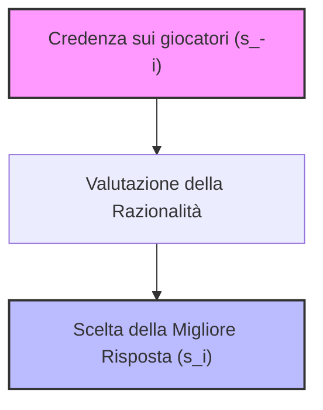
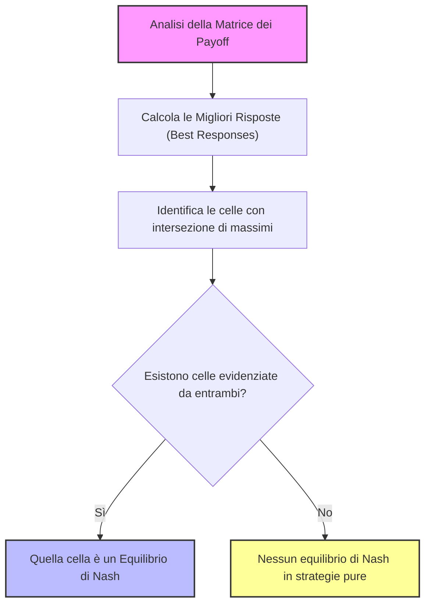
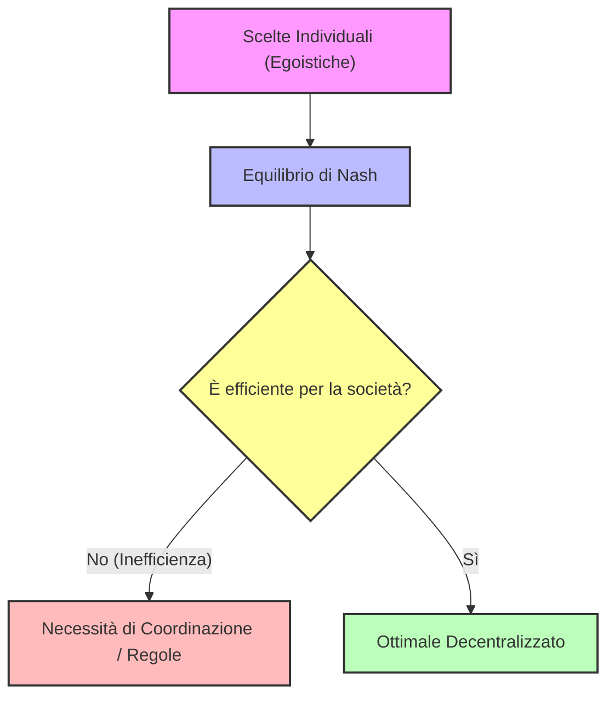

# Teoria dei Giochi: Soluzioni Razionali e Concetto di Migliore Risposta (Best Response)

## Overview Didattica

In questa lezione si affronta il problema di individuare soluzioni stabili e razionali all'interno di contesti di gioco a più giocatori, superando i limiti intrinseci dei metodi basati sulla pura eliminazione. 

I punti salienti trattati includono:
* **Dal metodo "distruttivo" al metodo "costruttivo":** L'Eliminazione Iterata di Strategie Strettamente Dominate (*Iterated Elimination of Strictly Dominated Strategies - IESDS/ISDS*), per quanto rigorosa, fallisce nella maggior parte dei casi pratici poiché tende a lasciare molteplici strategie ammissibili anziché un'unica soluzione deterministica. Da qui nasce la necessità di costruire una soluzione basandosi direttamente sulle scelte ottimali dei giocatori.
* **Definizione formale di Migliore Risposta (*Best Response*):** Identificazione della strategia di un giocatore che massimizza la sua funzione di utilità ($u_i$) dato un profilo fissato e specifico di scelte degli avversari, denotato sinteticamente con il vettore $s_{-i}$.
* **Distinzione tra Strategia Dominante e Migliore Risposta:** Mentre una strategia dominante (*dominant strategy*) deve risultare strettamente migliore a prescindere dalle mosse altrui (condizione raramente verificata), una migliore risposta è vincolata a una specifica contingenza avversaria ed è sempre garantita per insiemi finiti di alternative.
* **Proprietà di non-unicità:** Analisi del motivo matematico per cui, in senso stretto, la migliore risposta non può essere definita genericamente come una "funzione" (bensì come una corrispondenza o relazione multivalore), dato che a parità di mossa dell'avversario possono coesistere risposte multiple che garantiscono il medesimo pay-off massimo.

---

### Fondamenti di Razionalità: Migliori Risposte (Best Responses) e Credenze (Beliefs)

#### Oltre la Soluzione Distruttiva: Il Limite della Razionalità Classica
Nei giochi multi-giocatore, determinare la mossa ottimale a priori risulta complesso perché l'esito dipende direttamente dalle scelte altrui. Nella lezione precedente abbiamo introdotto l'Eliminazione Iterata delle Strategie Dominate (Iterated Elimination of Strictly Dominated Strategies - ISDS). Questo approccio agisce in modo "distruttivo", paragonabile a come lo scultore rimuove il marmo in eccesso per liberare la statua (metafora del David di Michelangelo).

Tuttavia, il parallelismo con il metodo deduttivo di Sherlock Holmes mostra i suoi limiti nella realtà:
* **Il "Plot Armor" (Trama Protetta):** Nella finzione narrativa, il detective risolve sempre i casi rimuovendo le impossibilità fino a isolare l'unica soluzione corretta.
* **La realtà dei fatti:** Nella maggior parte dei giochi reali (situazioni di tipo *my majoria*), la rimozione delle strategie dominate non lascia un'unica soluzione, ma lascia ancora aperte molteplici opzioni. 

Dovendo agire in modo costruttivo anziché puramente sottrattivo, occorre introdurre concetti formali di razionalità basati su come i giocatori reagiscono strategicamente alle mosse altrui.

---

#### Definizione Formale di Migliore Risposta (Best Response)
Una strategia è una migliore risposta quando garantisce al giocatore una utilità maggiore o uguale rispetto a qualsiasi altra scelta, dato il comportamento degli avversari.

Sia $I$ l'insieme dei giocatori. Per indicare il vettore delle strategie di tutti i giocatori *tranne* il giocatore $i$, in Teoria dei Giochi (Game Theory) si usa la notazione $s_{-i}$ (dove il segno meno non indica un indice negativo, ma l'esclusione dell'elemento $i$). 
Il vettore completo è quindi $(s_i, s_{-i})$, appartenente al prodotto cartesiano delle strategie.

##### Definizione Matematica
La strategia $s_i$ è una **migliore risposta (best response)** rispetto al profilo di strategie avversarie $s_{-i}$ se e solo se:

$$U_i(s_i, s_{-i}) \ge U_i(s_i', s_{-i}) \quad \forall s_i' \in S_i$$

Dove:
* $U_i$ è la funzione di utilità del giocatore $i$.
* $s_i$ è la mossa scelta dal giocatore $i$.
* $s_i'$ rappresenta qualsiasi altra strategia alternativa disponibile nello spazio delle strategie $S_i$.

##### Esempio Intuitivo
Pensate a un calcio di rigore: la migliore risposta del rigorista dipende da cosa fa il portiere. Se il portiere si tuffa a sinistra, la migliore risposta del tiratore è tirare a destra; se il portiere si tuffa a destra, la strategia ottimale cambia. La migliore risposta è sempre condizionata da una variabile specifica (la mossa altrui).

> **Concetto Chiave:** Differenza tra Strategia Dominante e Migliore Risposta
> * **Strategia Dominante (Dominant Strategy):** Una scelta che risulta sempre migliore delle altre, *indipendentemente* da ciò che fanno gli avversari. Non sempre esiste (es. l'offerta di un appuntamento con una celebrità come Sydney Sweeney rappresenta una scelta dominante ideale, ma nella realtà non è disponibile).
> * **Migliore Risposta (Best Response):** Una scelta ottimale *condizionata* a una specifica mossa o profilo altrui ($s_{-i}$). A differenza della strategia dominante, la migliore risposta esiste sempre perché si valutano le alternative in base a un contesto fisso.

---

#### Il Problema dell'Unicità: Funzioni vs Associazioni
Molti manuali economici definiscono impropriamente la *"funzione di best response"*. Formalmente in matematica, affinché una relazione sia una funzione, a ogni elemento del dominio deve corrispondere **uno e un solo** elemento nel codominio. 

* *L'esempio di Bertrand Russell:* Per distinguere una funzione da una non-funzione, il filosofo Bertrand Russell usava il concetto di "moglie". In una società monogama, la relazione *"moglie di $X$"* è una funzione perché a ogni uomo sposato corrisponde una sola moglie. Nelle culture in cui è ammessa la poligamia, la relazione non è una funzione.
* *Nel nostro contesto:* La migliore risposta **non è unica** in generale. Possono esistere due o più strategie che garantiscono la medesima utilità massima a fronte della mossa di un avversario.

Di conseguenza, la best response non mappa un singolo valore, ma si comporta formalmente come un'**associazione** (rappresentata a livello teorico con doppie frecce) o, più rigorosamente, come una funzione che mappa le credenze nell'**insieme delle parti** ($\mathcal{P}(S_i)$, l'insieme di tutti i sottositi possibili di $S_i$).

---

#### Credenze (Beliefs) e Razionalità
Se calcolare la migliore risposta è un'operazione algebrica semplice conoscendo la matrice dei payoff (bi-matrix), il vero nodo critico è **ipotizzare cosa faranno gli altri**.

* **Teorema preliminare:** Se una strategia $s_i$ è *strettamente dominated* (strettamente dominata), essa non potrà **mai** essere una migliore risposta a nessuna credenza o mossa avversaria.

##### Cos'è una Credenza (Belief)?
In Teoria dei Giochi, il termine **credenza (belief)** perde qualsiasi connotazione religiosa o fideistica:
* Una credenza non è una convinzione dogmatica, ma un'ipotesi di lavoro (un blocco condizionale *"se"*).
* Corrisponde a una possibile mossa (o a un vettore di mosse congiunte $s_{-i}$) che gli altri giocatori potrebbero compiere.

##### Il Meccanismo Decisionale basato sulle Credenze
Il processo mentale di un giocatore razionale con informazione completa si articola così:
1. **Ipotesi:** Credo (per intuito, per deduzione o per un'intuizione improvvisa) che gli avversari giocheranno il profilo $s_{-i}$.
2. **Azione:** Poiché sono un giocatore razionale, scelgo di giocare una **migliore risposta** rispetto a quella credenza ($s_{-i}$).

##### Limiti del Modello di Credenza
Il ragionamento presenta ancora due punti aperti:
1. **Perché crediamo a una determinata mossa?** Non esiste una prova oggettiva a priori; si tratta di un'ipotesi condizionale ("se gli altri fanno X...").
2. **Quale migliore risposta scegliere in presenza di più opzioni ottimali equivalenti?** Se l'analisi produce più di una migliore risposta, il modello non definisce un unico comportamento deterministico, sebbene le alternative conducano a livelli di utilità equivalenti.

---

### L'Equilibrio di Nash: Definizione, Metodi di Risoluzione e Relazione con l'IESDS

Dopo aver analizzato le basi e la costruzione dei giochi, introduciamo il protagonista indiscusso della teoria dei giochi: l'**Equilibrio di Nash** (Nash equilibrium). Spesso noto al grande pubblico grazie al film biografico *A Beautiful Mind* su John Nash (sebbene con le dovute licenze cinematografiche rispetto alla vera storia del matematico), questo concetto rappresenta il pilastro fondamentale per prevedere il comportamento di giocatori razionali.

---

### Dalla Miglior Risposta alla Profezia Autoverificante

Per comprendere l'Equilibrio di Nash, partiamo da un'analogia. Calcolare la miglior risposta in un gioco a informazione completa è concettualmente semplice se ci troviamo "dall'alto", ovvero se conosciamo le mosse di tutti. Il problema reale è invece capire cosa faranno gli altri. 

La teoria dei giochi si comporta in modo simile alla magia, in particolare sotto due aspetti:
1. **Effetto a distanza:** un'azione compiuta da un giocatore produce effetti immediati sulle decisioni e sui payoff degli altri (come in un sistema di telecomunicazioni).
2. **Capacità di fare profezie:** formulare una previsione (profezia) sul comportamento futuro dei partecipanti che risulti corretta, pur in assenza di un autore che abbia scritto la trama in anticipo (al contrario di quanto accade nei romanzi).

Un **Equilibrio di Nash** è proprio una "profezia autoverificante" (*self-enforcing prophecy*): ciascun giocatore sceglie una strategia che costituisce la miglior risposta alle credenze (corrette) sulle scelte degli altri.

#### Definizione Formale
In un gioco con $N$ giocatori, un vettore di strategie $(S_1^*, S_2^*, \dots, S_N^*)$ è detto **Equilibrio di Nash** se, per ogni giocatore $i$, la strategia $S_i^*$ è la miglior risposta alle strategie di tutti gli altri giocatori:

$$S_i^* \in \arg\max_{S_i} u_i(S_i, S_{-i}^*)$$

dove con $S_{-i}^*$ si intende l'insieme delle strategie di tutti i giocatori *tranne* l'iesimo. In parole semplici: nessun giocatore ha un incentivo unilaterale a cambiare la propria mossa, dato il comportamento altrui.

---

### Il Concetto di Rimpianto e Deviazione Unilaterale

Un modo intuitivo per verificare se ci troviamo di fronte a un equilibrio di Nash è analizzare il **rimpianto** (*regret*). 

Immaginiamo di trovarci alla fine di una partita e che un giocatore si accorga di non aver giocato la miglior risposta. Questo genera un **incentivo alla deviazione unilaterale** (*incentive for unilateral deviation*), ovvero il desiderio di cambiare mossa sapendo cosa hanno fatto gli altri.

> [!CONCETTO CHIAVE]
> Un **Equilibrio di Nash** è una situazione in cui **nessun giocatore ha rimpianti** riguardo alla propria scelta, poiché ciascuno sta effettivamente giocando la miglior risposta rispetto a ciò che gli altri stanno facendo.

* **Attenzione agli equivoci:** 
  1. Non è generalmente permesso "tornare indietro" e cambiare mossa (i giochi statici non lo consentono).
  2. Un equilibrio di Nash non garantisce un "ottimo sociale" o un risultato super-intelligente; garantisce solo che, date le circostanze e le scelte altrui, il giocatore non ha interesse a deviare da solo.

---

### Metodi di Risoluzione: L'Isolamento delle Migliori Risposte

Un metodo pratico e costruttivo per trovare gli equilibri di Nash in una matrice dei payoff consiste nell'individuare le migliori risposte per ciascun giocatore:
1. Per ogni colonna (scelta del giocatore B), si evidenzia il payoff massimo per il giocatore A.
2. Per ogni riga (scelta del giocatore A), si evidenzia il payoff massimo per il giocatore B.
3. Le celle in cui **entrambi i valori sono evidenziati** rappresentano gli **Equilibri di Nash**.

Tuttavia, bisogna considerare che:
* Potrebbe non esistere alcun equilibrio di Nash (in strategie pure), come nel gioco *Pari o Dispari* o nei calci di rigore visti in chiave antagonistica.
* Possono esistere **molteplici equilibri di Nash** (es. *Battaglia dei Sessi*), rendendo più difficile prevedere quale esito sceglieranno i giocatori.
* Un equilibrio può essere socialmente inefficiente (es. il *Dilemma del Prigioniero*, dove la confessione reciproca è un equilibrio di Nash pur portando a un pessimo risultato complessivo).

---

### Relazione tra Equilibrio di Nash e IESDS

Esiste una connessione profonda tra l'eliminazione iterata delle strategie strettamente dominate ( **IESDS** - *Iterated Elimination of Strictly Dominated Strategies* ) e l'equilibrio di Nash.

#### Teorema di Collegamento
* **Se un gioco ha un unico esito sopravvissuto all'IESDS**, tale esito **è un Equilibrio di Nash**.
* Più in generale, **tutti gli equilibri di Nash sopravvivono all'IESDS** (nessun equilibrio di Nash può contenere strategie strettamente dominate, poiché un giocatore razionale non giocherà mai una strategia dominata come miglior risposta).

Inoltre, l'**IESDS è irrilevante rispetto all'ordine** (*order irrelevant*): il percorso di eliminazione non altera il risultato finale se si procede con strategie strettamente dominate.

#### Dominanza Debole vs Dominanza Stretta
Cosa succede se consideriamo la dominanza debole anziché stretta?
* Se ogni giocatore possiede una strategia dominante (anche debolmente), la collezione di tali strategie forma un equilibrio di Nash.
* Tuttavia, **non vale il viceversa**: possono esistere equilibri di Nash che non derivano da strategie dominanti.
* **Attenzione all'eliminazione di strategie debolmente dominate:** a differenza dell'eliminazione stretta, l'eliminazione iterata di strategie *debolmente* dominate può portare alla perdita di validi equilibri di Nash. Per questo motivo, l'algoritmo standard IESDS richiede rigorosamente la dominanza *stretta*.

---

### Conclusioni e Approfondimenti sulla Teoria dei Giochi

#### Efficienza di Pareto e Inefficienza dei Giochi

Un concetto fondamentale da tenere a mente è che gli equilibri di Nash non devono per forza essere "buoni" o desiderabili per la società; a volte possono essere decisamente pessimi. Per valutare la qualità di un risultato, dobbiamo confrontarlo con il concetto di **efficienza di Pareto (Pareto efficiency)**.

Un esito si dice efficiente secondo Pareto quando non è possibile migliorare la condizione di un giocatore senza peggiorare quella di un altro. 
La differenza fondamentale tra i due concetti risiede nella natura della deviazione:
- In un **equilibrio di Nash**, un singolo giocatore non può migliorare la propria situazione tramite una **deviazione unilaterale**.
- In un esito **efficiente secondo Pareto**, non è possibile migliorare la situazione *di tutti* i giocatori (o migliorare qualcuno senza danneggiare altri), a prescindere dal tipo di deviazione (unilaterale o coordinata).

Spesso, un equilibrio di Nash non è Pareto-efficiente. Immaginiamo una situazione in cui i giocatori, agendo in modo egoistico e senza coordinazione, finiscono per scegliere razionalmente un equilibrio di Nash che però risulta inefficiente per la collettività. Esisteva una soluzione migliore per la società, ma non essendo un equilibrio di Nash, i giocatori avrebbero l'incentivo a deviare da essa. 

Questo dilemma si presenta in moltissimi contesti ingegneristici ed economici: quando abbiamo a che fare con sistemi distribuiti (come una rete di terminali o di agenti IA) in cui ogni entità prende decisioni autonome, il risultato a cui si arriva è un equilibrio di Nash. La domanda cruciale per un ingegnere è: *conviene affidarsi a un approccio distribuito o serve un approccio centralizzato per coordinare gli agenti?*

---

#### Quantificare l'Inefficienza: Il Prezzo dell'Anarchia

Per rispondere al dilemma tra approccio centralizzato e distribuito, gli scienziati e gli ingegneri quantificano quanto l'equilibrio di Nash sia inefficiente rispetto al caso ottimale. 

Per farlo, si aggregano le utilità o i costi della società. Solitamente si utilizzano:
- **Benessere totale (Social Welfare):** La somma delle utilità dei singoli agenti, dove l'obiettivo è massimizzare il valore complessivo ($U_{tot} = \sum U_i$).
- **Costo totale (Social Cost):** La somma dei costi pagati dai singoli agenti, espressi come utilità negative ($C_{tot} = \sum (-U_i)$).

Esistono tuttavia modi alternativi di aggregazione che tengono conto della **equità (fairness)**, come ad esempio considerare lo scenario peggiore (*worst-case scenario*), evitando situazioni in cui il benessere totale è alto ma polarizzato (es. pochi agenti con punteggi altissimi e molti a zero).

##### Il Prezzo dell'Anarchia (Price of Anarchy - PoA)
Il **Prezzo dell'Anarchia ($PofA$)** è il rapporto tra il costo sociale (o la perdita) nel peggior equilibrio di Nash possibile e il costo sociale nel caso socialmente ottimo (best possible case):

$$PoA = \frac{K(S^*)}{K_{min}}$$

Dove:
- $K(S^*)$ è il costo associato al peggior equilibrio di Nash ($S^*$).
- $K_{min}$ è il costo minimo assoluto ottenibile (l'ottimo sociale centralizzato).

*Nota interpretativa:* Il $PoA$ è solitamente un numero maggiore o uguale a $1$ ($PoA \ge 1$). Ad esempio, se il Prezzo dell'Anarchia è $1.2$, significa che l'utilizzo di un approccio distribuito (equilibrio di Nash) ci porta a pagare un costo superiore del $20\%$ rispetto all'ottimo centralizzato. Il vantaggio, tuttavia, è la libertà decisionale degli agenti senza un dittatore centrale che imponga le mosse.

##### Il Prezzo della Stabilità (Price of Stability - PoS)
Se invece di considerare il *peggior* equilibrio di Nash prendiamo in considerazione il *miglior* equilibrio di Nash dal punto di vista della società, parliamo di **Prezzo della Stabilità (Price of Stability)**.

---

#### Un Esperimento Pratico: Il Gioco dell'Esame del Professore Pazzo

Per testare la comprensione pratica dell'equilibrio di Nash, consideriamo un gioco statico di informazione completa basato su una stravagante regola d'esame.

##### Le Regole del Gioco
- Due studenti (che non si conoscono tra loro) vengono accoppiati per un esame orale.
- Ciascuno studente sceglie segretamente un voto che ritiene di meritare (un numero intero, ad esempio tra $18$ e $30$). Siano $N_1$ e $N_2$ i numeri scelti.
- **Caso A (Scelta uguale):** Se i due studenti scelgono lo stesso numero ($N_1 = N_2 = L$), quello è il voto assegnato a entrambi.
- **Caso B (Scelta diversa):** Se i due studenti scelgono numeri diversi, il professore premia lo studente più modesto (colui che ha scritto il numero più basso, $L$) e punisce quello più arrogante (colui che ha scritto il numero più alto, $H$).
  - Lo studente modesto prende: $L + R$ (dove $R$ è un bonus).
  - Lo studente arrogante prende: $L - R$ (una penalità basata sul numero scelto dall'altro, non sul proprio).

##### Analisi dell'Equilibrio
Se analizziamo le possibili combinazioni di scelte (ad esempio coppie come $(30, 18)$, $(30, 30)$ o $(24, 23)$), notiamo che quasi nessuna di esse rappresenta un equilibrio di Nash. 
- Se viene scelta la coppia $(30, 18)$, lo studente con $18$ riceve un bonus e sale a $20$, mentre quello con $30$ viene bocciato. Entrambi avrebbero un incentivo a cambiare la propria mossa (regime di rimpianto).
- Se viene scelta la coppia $(30, 30)$, entrambi prendono $30$, ma sapendo cosa ha fatto l'altro, un giocatore egoista avrebbe preferito scrivere $29$ per sfruttare la regola del bonus.

**Concetto Chiave:** L'unico ed esclusivo <b>equilibrio di Nash</b> per questo gioco (indipendentemente dal valore del bonus/penalità $R$, che sia $2$ o $10$) è la coppia in cui entrambi gli studenti scelgono il voto minimo: **$(18, 18)$**.

In questo esito $(18, 18)$, nessuno dei due studenti ottiene un voto particolarmente esaltante, ma **nessuno ha un incentivo alla deviazione unilaterale**: se uno dei due cambiasse mossa da solo, verrebbe punito severamente. Questo gioco rappresenta una versione modificata del *Dilemma del Prigioniero* e mostra come, in assenza di coordinazione, agenti perfettamente razionali ed egoisti convergano su un equilibrio sub-ottimale ma stabile.