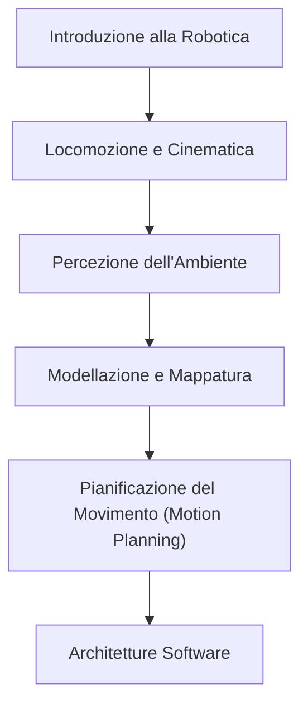
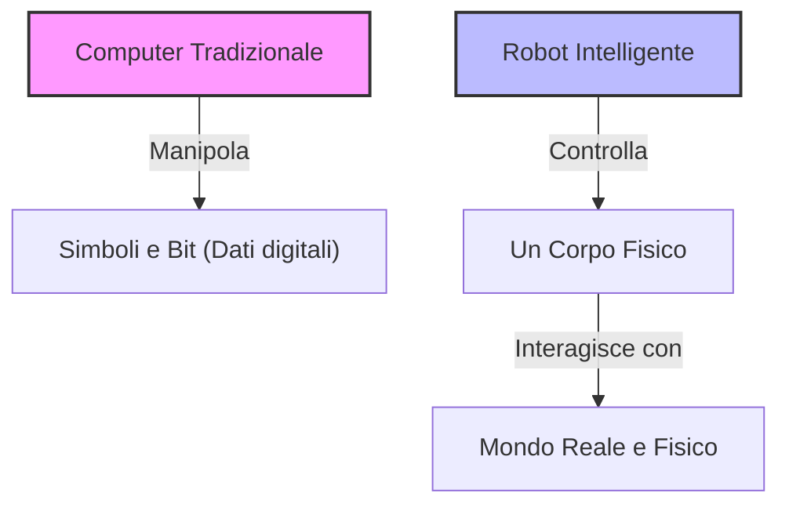
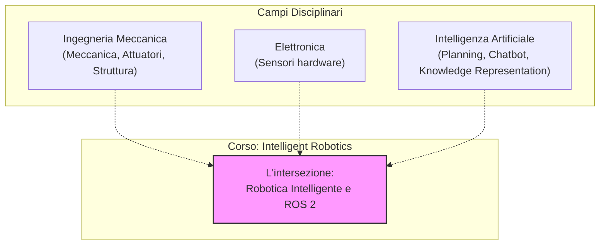
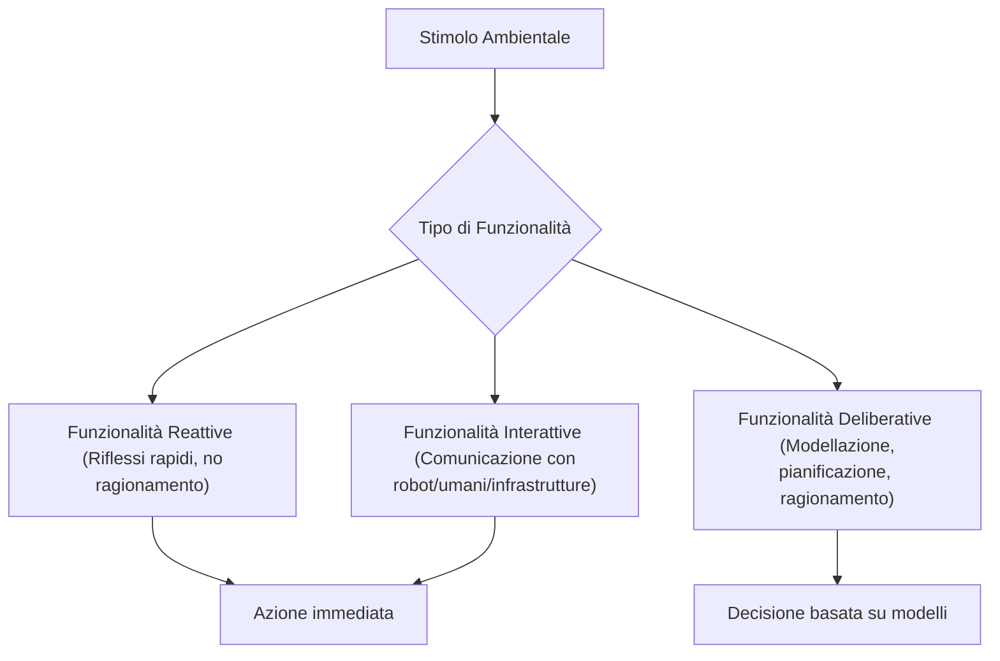

# Introduzione al Corso di Intelligent Robotics e Organizzazione del Laboratorio IAS-Lab

## Overview Didattica
Questa lezione inaugurale introduce il corso di **Intelligent Robotics** e delinea la struttura del laboratorio di ricerca **IAS-Lab** (Intelligent Autonomous Systems Laboratory) dell'Università di Trento, evidenziando i diversi ambiti di ricerca dei docenti coinvolti: Computer Vision (Visione Artificiale), Edge AI e Tiny Machine Learning (TinyML), Neurobotics (Neuro-robotica) e Interazione Uomo-Macchina (HRI - Human-Robot Interaction). 

Il focus principale del corso non risiede nella componente meccanica o hardware, bensì nello **stack software** e nei comportamenti intelligenti autonomi dei robot mobili. L'insegnamento si sviluppa attraverso i seguenti macro-temi chiave:
- Introduzione generale alla robotica e modellazione del movimento e dei comandi per gli attuatori.
- Sistemi di percezione ambientale e mappatura (Environment Modeling).
- Algoritmi di pianificazione del movimento (**Motion Planning**).
- Architetture software per l'orchestrazione dei moduli di percezione, pianificazione e controllo.
- Problematiche di interazione uomo-robot (**Human-Robot Interaction**, HRI) derivanti dal passaggio dei robot da ambienti industriali isolati a contesti domestici e non strutturati ("*in the wild*").
- Testimonianze aziendali e seminari con startup e imprese innovative del settore robotico.

---

### Introduzione al corso e organizzazione della didattica

Benvenuti al corso di **Intelligent Robotics (Intelligenza Robotica)**. Per prima cosa, è stata aperta la pagina del corso sulla piattaforma Moodle di Ateneo (`stem.elearning.unitn.it`), intitolata *Intelligent Robotics 2627*. Per effettuare l'iscrizione è richiesta una chiave d'accesso: `iaslab`. 

Questa chiave richiama direttamente l'**IAS-Lab** (Intelligent Autonomous Systems Laboratory), il laboratorio di ricerca di riferimento in cui il docente collabora con diversi colleghi che potreste aver già incontrato durante il vostro percorso di studi magistrale:
- **Professor Ridoni**: si occupa della parte di *Computer Vision* (visione artificiale) applicata alla robotica.
- **Professor Nicola Bellotto**: focalizzato sulle macchine intelligenti, in particolare sugli algoritmi di intelligenza artificiale per robot di piccole dimensioni con risorse computazionali limitate (*tiny machine learning*).
- **Professor Luca Zini**: attivo nel campo della *neurorobotica* (trattata in un corso opzionale), che studia come interfacciare il corpo umano con i dispositivi sfruttando i segnali biologici o muscolari, sia per l'assistenza a persone con disabilità sia per potenziare le capacità di utenti normodotati.
- **Professor Stefano Tortora**: si occupa di interazione uomo-robot, con particolare attenzione agli esoscheletri per il supporto alla mobilità di persone con impairment motori.

---

### Panoramica dell'Intelligenza Robotica

Il corso si concentra principalmente su due aspetti chiave: capire cosa sia un robot, quali tipologie esistano e, soprattutto, come progettarne l'intelligenza. L'approccio **non** tratterà la parte meccanica o quella strettamente elettrica, bensì la **componente software** e i comportamenti intelligenti autonomi necessari affinché il robot raggiunga gli obiettivi prefissati dai programmatori.

Il percorso didattico si articolerà attraverso i seguenti macro-temi:

1. **Introduzione generale alla robotica**: panoramica iniziale sui sistemi robotici.
2. **Locomozione e cinematica**: comprensione delle diverse modalità con cui un robot può muoversi nello spazio e modellazione matematica del movimento per generare i comandi corretti per gli attuatori.
3. **Percezione**: come il robot percepisce l'ambiente circostante. Così come guidare un'auto richiede attenzione alla strada anziché guardare lo smartphone, un robot ha bisogno di sensori e algoritmi di percezione per una navigazione sicura.
4. **Modellazione dell'ambiente**: la capacità di elaborare i dati sensoriali per costruire un modello strutturato dello spazio circostante, andando oltre la mera informazione istantanea.
5. **Motion Planning (Pianificazione del movimento)**: la famiglia di algoritmi che risponde alla domanda: *"Sapendo dove mi trovo, come mi muovo e dove voglio andare, qual è il percorso ottimale da seguire per raggiungere l'obiettivo?"*.
6. **Architetture software**: l'infrastruttura software necessaria per coordinare e orchestrare tutti i moduli precedenti (percezione, pianificazione ed esecuzione), verificando continuamente che il piano venga eseguito correttamente e inviando i comandi agli attuatori in un ciclo chiuso (*closed-loop*).

---

### Introduzione alla Robotica Moderna e Interazione Uomo-Robot (HRI)

#### Dalla fabbrica al mondo reale: la necessità di una struttura software
Storicamente, i robot operavano in ambienti confinati e rigorosamente strutturati. Fino a circa 10-15 anni fa, la robotica si divideva principalmente in due categorie:
*   **Robot industriali:** Bracci meccanici relegati all'interno di fabbriche, fisicamente isolati dagli operatori umani tramite gabbie di sicurezza per evidenti motivi di incolumità.
*   **Robot di laboratorio:** Sistemi confinati in aree di ricerca controllate.

Oggi lo scenario è radicalmente cambiato. I robot escono dai laboratori e dalle fabbriche per entrare in ambienti non strutturati (quelli che nella community vengono definiti *"in the wild"*), condividendo lo spazio con le persone. Un esempio comune è rappresentato dai robot aspirapolvere domestici (come i Roomba). 

Questo cambiamento introduce sfide complesse legate all'**Interazione Uomo-Robot (Human-Robot Interaction - HRI)**. 
> **Concetto Chiave:** Un robot in un ambiente domestico non possiede la consapevolezza sociale o contestuale umana. Può, ad esempio, scambiare le gambe di una persona per i mobili di una stanza e tentare di pulire attorno ad esse proprio mentre l'utente si sta lavando i denti, generando situazioni tipiche di interazione non pianificata che la robotica moderna deve imparare a gestire.

#### L'evoluzione storica e la scommessa della Robocup
Trattandosi di un corso magistrale in Ingegneria Informatica (e non di una laurea specialistica interamente dedicata alla robotica), non è possibile suddividere i vari argomenti (cinematica, percezione, motion planning) in corsi semestrali separati. Verrà quindi fornita una panoramica introduttiva, esplorando algoritmi e approcci rappresentativi.

Per comprendere lo sviluppo della robotica mobile, il docente cita la nascita della **Robocup** (fondata nel 1998):
*   L'obiettivo provocatorio fissato dai fondatori fu: *"Entro il 2050, una squadra di robot umanoidi giocherà a calcio così bene da battere i campioni umani della Coppa del Mondo"*.
*   All'epoca (circa 20 anni fa), la robotica mobile era considerata una nicchia accademica un po' futuristica (spesso basata su piccoli robot a ruote confinati nei laboratori), e i docenti si interrogatevano sull'utilità di insegnare concetti così distanti dal mercato industriale del tempo.
*   Nel giro di pochi anni, con l'avvento sul mercato di massa dei robot aspirapolvere, quella che sembrava una nicchia è diventata una realtà economica concreta. Questo suggerisce che settori emergenti come la *neuro-robotica* potrebbero rappresentare la prossima grande rivoluzione tecnologica.

---

### I Pilastri del Corso e l'Introduzione a ROS 2

Il corso si regge su due pilastri fondamentali:
1.  **Teoria:** Comprendere cos'è un robot, come funziona, la terminologia corretta e distinguere ciò che è fattibile da ciò che è pura fantascienza.
2.  **Pratica (Programmazione):** Imparare a programmare un robot da zero utilizzando **ROS 2**.

#### Cos'è ROS 2?
**ROS (Robot Operating System)** viene comunemente chiamato sistema operativo per robot, ma dal punto di vista dell'ingegneria informatica **non è un vero e proprio sistema operativo**. 

Si tratta invece di un **middleware**: uno strato software (*software layer*) posizionato tra il sistema operativo di basso livello del computer di bordo e i vari sensori e attuatori connessi al robot. 
*   **Funzione:** Offre servizi di comunicazione, sincronizzazione e astrazione che guidano e semplificano lo sviluppo delle applicazioni robotiche.
*   **Standard di settore:** Quasi ogni robot intelligente oggi utilizza ROS 2 (o implementazioni proprietarie basate su di esso).

> **Concetto Chiave:** Uno dei motivi principali del successo di ROS è che **impone uno stile di programmazione modulare e riutilizzabile**. Attraverso moduli predefiniti e interfacce di comunicazione standardizzate, costringe lo sviluppatore a scrivere codice ben strutturato.

*   **Nota linguaggi:** Durante il corso, ROS 2 verrà utilizzato principalmente con il linguaggio **C++** (pur essendo supportato anche Python), offrendo agli studenti un'ottima opportunità per migliorare o consolidare le proprie competenze in C++.

---

### Embodiment, interazione uomo-robot e convergenza tra intelligenza artificiale e robotica

Prima di entrare nel vivo dei contenuti tecnici, il docente fornisce alcune informazioni organizzative sul corso. Il syllabus ufficiale sul portale universitario presenta momentaneamente un problema di visualizzazione (la pagina è raggiungibile ma la descrizione non è visibile), un problema già segnalato agli uffici competenti. Viene inoltre proposto un breve sondaggio iniziale per mappare i corsi già seguiti dagli studenti (in particolare riguardo ad *Artificial Intelligence* e *Computer Vision*) e individuare la presenza di studenti Erasmus, così da calibrare al meglio il livello di partenza.

Per quanto riguarda il calendario, le lezioni si articolano su tre appuntamenti settimanali:
- Martedì (mattina)
- Mercoledì (pomeriggio)
- Giovedì (pomeriggio, subito dopo pranzo)

La sessione del giovedì è dedicata alla parte di laboratorio, focalizzata sulla programmazione tramite **ROS (Robot Operating System)**, per mettere in pratica quanto appreso durante le lezioni teoriche.

---

### Il divario fondamentale: Robot vs Computer

> **Concetto Chiave:** Un robot **non è** un computer. 

Sebbene la maggior parte degli studenti abbia familiarità con l'intelligenza artificiale applicata a software tradizionali (come i modelli linguistici o la manipolazione di immagini), esiste una differenza abissale tra il risolvere un problema all'interno di un computer e risolverlo tramite un robot.

- **Il computer manipola simboli:** Un'immagine digitale, ad esempio, è composta da pixel codificati in byte o strutture dati all'interno della memoria. Si tratta pur sempre di numeri e bit. Il software opera su astrazioni e simboli logici, un dominio in cui i computer eccellono.
- **Il robot è un agente fisicamente situato (*physically situated agent*):** Un robot possiede un corpo (*body*) e deve interagire direttamente con il mondo fisico reale.

Questa differenza introduce requisiti software completamente nuovi e richiede un totale cambio di paradigma nella progettazione e programmazione.

### Il concetto di *Embodiment*

I moderni sistemi di intelligenza artificiale (come i grandi modelli linguistici sviluppati da OpenAI o Anthropic) possiedono capacità di ragionamento straordinarie e operano nel mondo virtuale del web. Tuttavia, essi **mancano di un corpo** (*disembodied*).

Se un'intelligenza artificiale avanzata priva di corpo dovesse improvvisamente trovarsi a controllare l'hardware di un robot, molto probabilmente non sarebbe in grado di farlo funzionare correttamente. La ragione risiede nel concetto di **Embodiment**: il software robotico deve fare i conti con i vincoli fisici, la cinematica, la dinamica, l'attrito, la gravità e l'incertezza del mondo reale.

### La complessità dell'interazione con il mondo e con gli umani

Controllare un robot in un ambiente fisico presenta sfumature di difficoltà diverse a seconda dell'interlocutore:

1. **Interazione con oggetti fisici inanimati (es. una palla):** Se lanciamo una palla, il suo movimento è governato da leggi fisiche precise (come la forza di gravità). La traiettoria è predicibile perché, a parità di condizioni iniziali, la palla si comporta sempre allo stesso modo. Un robot può imparare a catturarla sfruttando modelli matematici basati sulle leggi fisiche o apprendendo dall'esperienza (*machine learning*).
2. **Interazione con gli esseri umani:** Gli esseri umani sono infinitamente più imprevedibili della fisica di una palla. Quando un robot deve interagire a stretto contatto con le persone, la sfida progettuale cresce in modo esponenziale.

### La convergenza tra Intelligenza Artificiale e Robotica

Il corso si colloca all'intersezione tra questi due mondi, rispecchiando la struttura del curriculum *Artificial Intelligence and Robotics*. 

Storicamente, i due campi si sono sviluppati in modo parzialmente separato, ma oggi assistiamo a una **forte convergenza**:
- L'Intelligenza Artificiale ha sempre più bisogno di un corpo (*embodied AI*) per agire nel mondo reale.
- La Robotica trae enormi benefici dai nuovi e più potenti algoritmi di IA per gestire compiti complessi.

Tuttavia, i due campi rimangono discipline sterminate. Per questo motivo, nei piani di studio futuri i curricula si divideranno in modo più mirato tra IA pura e Robotica Intelligente, pur mantenendo una forte contaminazione reciproca: chi studia robotica continuerà ad approfondire i fondamenti avanzati dell'intelligenza artificiale, data la loro indissolubile complementarità nei sistemi moderni.

---

### Il Campo d'Azione del Corso: Robotica e Intelligenza Artificiale

Prima di entrare nel vivo della programmazione, è fondamentale chiarire quali argomenti tratteremo in questo corso e quali no, tracciando il confine tra la robotica tradizionale e l'intelligenza artificiale (Artificial Intelligence - AI).

Spesso, i video che circolano online di robot umanoidi che ballano o che affrontano la sfida dei 100 metri piani generano molta enfasi. In realtà, dietro a queste performance c'è molta meno intelligenza di quanto sembri:
- I **robot umanoidi danzanti** non fanno altro che riprodurre una sequenza pre-pianificata di movimenti, esattamente come farebbe un braccio robotico in una fabbrica (industrial robot) che inserisce componenti o sposta pezzi su un nastro trasportatore. Non sono significativamente più "intelligenti" dei robot industriali.
- Il celebre **robot che corre i 100 metri** e finisce per schiantarsi contro la barriera di gommapiuma non è programmato per riconoscere la fine della pista o evitare ostacoli imprevisti. Esegue semplicemente un comando per correre il più velocemente possibile, sfruttando magari un controllo a bassissimo livello in retroazione (closed-loop), ma senza alcuna capacità di ragionamento di alto livello sulla struttura dell'ambiente.

Come illustrato nello schema, il corso si concentra esclusivamente sull'**area di sovrapposizione** tra Robotica e AI:
- **Cosa NON faremo:** Non studieremo la progettazione meccanica dei corpi robotici o lo sviluppo hardware dei sensori (compiti di competenza dei colleghi di meccanica ed elettronica), né affronteremo temi classici dell'intelligenza artificiale come la pianificazione complessa degli impegni (*scheduling*), la rappresentazione della conoscenza (*knowledge representation*) o lo sviluppo di chatbot.
- **Cosa FAREMO:** Ci concentreremo su ciò che rende un robot *intelligente* e sulla sua programmazione pratica mediante l'ecosistema ROS 2 (Robot Operating System 2).

---

### Terminologia e Modalità d'Esame

Un obiettivo primario del corso è l'acquisizione del **lessico tecnico corretto**. 

> [!IMPORTANT]
> **Concetto Chiave: La Terminologia Scientifica**
> Durante l'esame, una parte molto rilevante della valutazione consisterà nella capacità dello studente di parlare di robotica utilizzando i termini appropriati in modo rigoroso. Saper definire cos'è un robot, un'intelligenza artificiale, una mappa, un percorso (*path*) o un algoritmo di pianificazione del movimento (*motion planning algorithm*) è fondamentale.

Il corpo docente del corso è supportato da tre assistenti didattici (*Teaching Assistants*): Anna Polato, Mattia Crociani e Tommaso Fortezza, che seguiranno gli studenti durante le sessioni pratiche di programmazione con ROS 2.

---

### Evoluzione del Formato d'Esame e Impatto dell'Intelligenza Artificiale

Negli anni passati, con classi formate da un numero relativamente ridotto di studenti (fino a 6-7 anni fa), le esercitazioni di laboratorio venivano svolte direttamente su **robot reali**. Successivamente, a causa dell'aumento drastico degli iscritti (passati a 100-120 e arrivati a circa 180 studenti quest'anno), il corso è diventato obbligatorio (*compulsory*) e le attività si sono spostate su **robot simulati** tramite ROS 2.

Fino allo scorso anno, l'esame prevedeva una prova scritta di teoria e un progetto di laboratorio da sviluppare a casa. Tuttavia, questo approccio è stato profondamente ridiscusso a causa dei recenti progressi tecnologici.

> [!IMPORTANT]
> **Concetto Chiave: L'impatto dei Large Language Models sull'Esame**
> Con il rilascio pubblico di strumenti come ChatGPT da parte di OpenAI nel 2022, e successivamente di assistenti di codifica avanzati come Claude o GitHub Copilot, le dinamiche di valutazione sono cambiate radicalmente. Oggi questi sistemi sono in grado di risolvere in pochi secondi le consegne di programmazione (*homework*) leggendo direttamente i file PDF delle istruzioni.

Proseguire con la vecchia modalità d'esame presentava tre problemi insostenibili:
1. **Perdita di tempo per gli studenti:** Copiare e incollare le consegne in un'intelligenza artificiale non stimola l'apprendimento reale.
2. **Inutilità per i docenti:** Valutare codice scritto da agenti artificiali anziché dagli studenti perde di significato formativo.
3. **Impatto ambientale:** Generare codice tramite LLM per compiti che lo studente non comprende consuma risorse ed energia inutilmente.

#### La Nuova Struttura dell'Esame di Laboratorio
Per ovviare a questo problema, si è deciso di eliminare il progetto a casa come deliverable d'esame e di introdurre un **esame di laboratorio in presenza**:
- La prova si svolgerà in un'aula informatica protetta.
- L'ambiente sarà **completely unplugged** (senza connessione a internet e isolato da qualsiasi agente intelligente esterno).
- Gli studenti dovranno scrivere il codice in autonomia per dimostrare le competenze acquisite.

---

### Gestione dei Compiti a Casa (Homework) e Strategia di Apprendimento

Per raggiungere il livello di competenza richiesto per superare l'esame in ambiente protetto, le sole ore di lezione settimanali non sono sufficienti. Per questo motivo vengono assegnati regolarmente dei compiti a casa (*homework*).

Il sistema di incentivi per i compiti è strutturato come segue:
- Vengono assegnati in totale **4 homework** nel corso del semestre.
- Ciascun homework completato garantisce un incremento di **$+0.25$ punti** sul voto finale, per un massimo di **$+1.0$ punto** aggiuntivo se tutti vengono consegnati.

Tuttavia, sorge spontanea una riflessione etica e pratica sull'uso dell'IA: *conviene farsi fare i compiti dall'intelligenza artificiale per ottenere quel punto in più?*
- Se si utilizzano gli agenti IA per svolgere i compiti senza comprendere il codice, non si svilupperà alcuna competenza pratica.
- Di conseguenza, trovandosi in aula durante l'esame senza il supporto degli strumenti intelligenti, si rischia seriamente di non superare la prova.

Il punto extra è un incentivo minimo pensato per premiare lo sforzo costante, ma il vero valore risiede nell'esercizio autonomo. Sull'utilizzo esplicito dell'IA nello svolgimento dei compiti a casa, l'approccio didattico lascia un margine di riflessione: *è possibile (o tollerato) utilizzare l'intelligenza artificiale, a patto che lo studente la usi come strumento attivo di apprendimento, sforzandosi di capire e interiorizzare i concetti generati, e non come un semplice generatore automatico di codice.*

---

### Funzionalità Reattive e Deliberative nei Robot

L'organizzazione del software robotico può essere suddivisa in macro-categorie funzionali, che riflettono il modo in cui il sistema elabora gli stimoli e pianifica le azioni. 

*   **Funzionalità Reattive (Reactive Functionalities / Reactive Intelligence):** Riguardano l'intelligenza intrinseca legata all'interazione diretta tra i sensori, l'ambiente e il corpo del robot, senza la necessità di un ragionamento cognitivo superiore. Si tratta di risposte immediate a stimoli esterni, caratterizzate da una velocità di esecuzione elevata.
    *   *Esempio biologico:* Quando tocchiamo accidentalmente dell'acqua bollente, il riflesso incondizionato attiva i circuiti del sistema nervoso periferico e dei muscoli facendo ritirare il dito *prima* ancora che il segnale termico raggiunga il cervello e che si realizzi coscientemente il pericolo. La presa di coscienza ("era troppo caldo") avviene a posteriori, quando il pericolo è già stato evitato.
*   **Funzionalità Deliberative (Deliberative Functionalities):** Richiedono processi di ragionamento, pianificazione e costruzione di un modello del mondo. In questa categoria rientrano attività complesse come:
    *   La localizzazione e la mappatura dell'ambiente.
    *   La pianificazione del movimento e dei percorsi (*motion planning*, *path planning*).
    *   La presa di decisioni strutturate (es. decidere come sterzare per evitare un ostacolo complesso).
*   **Funzionalità Interattive (Interactive Functionalities):** Gestiscono lo scambio di informazioni tra il robot e altri agenti, che possono essere altri robot, l'infrastruttura circostante o gli esseri umani.

---

### Valore Professionale delle Competenze Robotiche nel Mercato del Lavoro

Le competenze legate alla robotica e alla programmazione di sistemi robotici (come l'utilizzo di ROS / ROS 2) rappresentano un valore aggiunto di grande rilievo nel mercato del lavoro attuale. 

*   **Mercato e Investimenti:** Il settore della robotica attraversa cicli periodici di forte attenzione mediatica e industriale (spaziando dai robot mobili ai sistemi umanoidi e alla robotica soffice o *soft robotics*). Gli investimenti globali in questo campo sono in costante crescita.
*   **Prospettive di Carriera:** Saper sviluppare software complesso per robot è una competenza altamente apprezzata dalle aziende. Questo si riflette in un'elevata richiesta di ingegneri robotici qualificati e in livelli retributivi generalmente molto vantaggiosi.

---

### Preparazione al Laboratorio di ROS 2 e Raccomandazioni per lo Studio

#### Introduzione al Laboratorio e Obiettivi di ROS 2
La parte pratica del corso si concentra sulla programmazione dei robot partendo dalle basi, utilizzando **ROS 2 (Robot Operating System 2)**. 

Come promemoria storico, ROS 1 ha raggiunto il termine del supporto ufficiale già da diversi anni, rendendo ROS 2 lo standard di riferimento attuale. Rispetto al predecessore, ROS 2 introduce importanti novità:
- È progettato per essere più modulare.
- Offre funzionalità avanzate precedentemente assenti.
- Presenta però una curva di apprendimento leggermente più ripida e una struttura del codice più pesante e prolissa (*wordy*). Tuttavia, l'utilizzo di strumenti di supporto odierni (come i copilot basati su intelligenza artificiale) semplifica notevolmente la stesura del codice.

Attraverso lo studio e l'utilizzo di ROS 2 si imparerà a:
- Gestire la comunicazione tra robot, sensori e moduli software interni.
- Elaborare i dati provenienti dai sensori.
- Sfruttare librerie esistenti per la navigazione, la manipolazione, la simulazione e la visualizzazione.

#### Struttura del Corso Pratico e Risorse
- **Calendario e Lezioni:** Verrà fornito un calendario con gli obiettivi di apprendimento specifici per ogni lezione di laboratorio.
- **Open Lab:** Sono previsti momenti di laboratorio aperto in cui gli studenti possono recarsi in aula per ricevere supporto dai tutor e dai teaching assistant per risolvere problemi di programmazione o dubbi sui codici.
- **Esercizi e Homework:** Gli homework sono individuali e **non obbligatori** (la mancata consegna comporta una penalizzazione di un solo punto su 33). Tuttavia, il docente raccomanda fortemente di svolgerli, poiché rappresentano lo strumento principale per raggiungere il livello richiesto all'esame.

#### Suggerimenti Metodologici per il Laboratorio
Il docente fornisce alcune raccomandazioni fondamentali per affrontare con successo la parte pratica:

- **Non saltare i laboratori:** Affrontare l'ecosistema ROS da autodidatti partendo da zero può risultare estremamente dispersivo e confuso. Seguire la guida strutturata in laboratorio rende l'apprendimento molto più accessibile.
- **Uso consapevole dell'Intelligenza Artificiale e del lavoro di squadra:** 
  - L'IA (come GitHub Copilot o Codex) e i colleghi di corso ("agenti a intelligenza naturale") possono essere consultati per superare blocchi di programmazione e migliorare le proprie competenze.
  - *Concetto Chiave:* È fondamentale **non delegare** interamente la scrittura del codice all'IA o ai compagni. L'obiettivo è imparare a programmare in prima persona; delegare significa perdere l'opportunità di acquisire un bagaglio di competenze professionale molto richiesto dal mercato.
- **Pratica costante:** La programmazione è come lo sport; richiede esercizi quotidiani e costanti per diventare proficienti.
- **Canali di comunicazione ufficiali:** Per qualsiasi problema tecnico (es. errori di installazione di ROS), **non inviare email ai docenti**, ma utilizzare l'apposito **forum del laboratorio** sulla piattaforma Moodle (distinto dal forum degli annunci ufficiali). Questo permette di creare una bacheca condivisa dove studenti e tutor possono rispondere e aiutarsi reciprocamente.

---

### Linee Guida di Comunicazione e Supporto per il Corso
- **Canali di comunicazione ufficiali:** Per qualsiasi dubbio di natura tecnica o teorica, **non** bisogna inviare email né al docente né al teaching assistant. Si deve tassativamente utilizzare il forum del laboratorio.
- **Vantaggi del forum:** 
  - Permette di dare una risposta pubblica visibile a tutti, risolvendo contemporaneamente il problema a più studenti.
  - Sfrutta la collaborazione collettiva: un compagno di corso potrebbe aver già riscontrato e risolto lo stesso problema un'ora prima, fornendo supporto in pochi minuti.
- **Risoluzione autonoma (Troubleshooting):** Le installazioni fornite sono stabili. Prima di chiedere aiuto, è bene effettuare un po' di troubleshooting in autonomia, poiché il team del corso non può occuparsi di reinstallazioni o configurazioni da zero continue.

---

### Introduzione a ROS 2 (Robot Operating System 2)
Viene introdotto l'uso della distribuzione Long-Term Support (LTS) di **ROS 2**. Durante le lezioni si seguirà la documentazione ufficiale il più vicino possibile, così da facilitare il ripasso e la comprensione dei concetti di base in autonomia.

#### Cos'è ROS (e cosa non è)
Spesso si fa confusione sulla natura di ROS. Per capire cos'è, è utile partire da cosa **non** è:
- **Non è un Sistema Operativo (Operating System):** Non gestisce direttamente l'hardware a basso livello come farebbe un kernel Linux.
- **Non è un linguaggio di programmazione:** Si possono scrivere nodi ROS in C++, Python, ecc., ma ROS in sé non definisce una nuova sintassi o un nuovo linguaggio.
- **Non è solo una libreria:** Offre molto di più di un semplice insieme di funzioni da importare.

> **Concetto Chiave:** **Cos'è ROS in realtà?** 
> ROS è un **middleware**. Un middleware è un'infrastruttura software che si pone tra il sistema operativo e le applicazioni, facilitando la comunicazione e offrendo un framework di sviluppo standardizzato. Oltre alle librerie di comunicazione, ROS fornisce strumenti fondamentali (tools) per lo sviluppo e il debug delle applicazioni robotiche, come **Rviz** e **Gazebo**.

#### Perché usare ROS?
- **Standard di fatto (*de facto standard*):** Non è uno standard ISO ufficiale riconosciuto dall'International Organization for Standardization, ma è l'ambiente universalmente adottato a livello globale nel mondo della robotica di ricerca e industriale.
- **Nascita e comunità:** Nato inizialmente nella comunità accademica e di ricerca come software open-source, è cresciuto enormemente anno dopo anno grazie alla sua modularità. Successivamente è nato l'Open Source Robotics Foundation (OSRF) e le aziende hanno iniziato ad adottarlo.
- **Fine del "reinventare la ruota":** Prima di ROS, ogni laboratorio nel mondo doveva sviluppare da zero il codice per:
  - La scheda di controllo dei motori
  - La lettura dei sensori di prossimità e degli encoder
  - La navigazione, il motion planning e il ragionamento (*reasoning*)
  Grazie alla forte modularità di ROS, oggi è possibile prendere il codice scritto da terzi per il controllo dei motori e concentrarsi unicamente sulla parte di proprio interesse (ad esempio, la percezione robotica), facendo interagire software scritti da persone che neanche si conoscono.

---

### Installazione e Configurazione dell'Ambiente

#### Scelta del Sistema Operativo
ROS 2 è cross-platform, ma offre le performance migliori e la maggiore stabilità sotto **Linux** (in particolare si suggerisce la distribuzione **Ubuntu**).

Le modalità di installazione consigliate, in ordine di preferenza:
1. **Dual Boot (Consigliato):** Installare Linux nativamente a fianco dell'altro sistema operativo per sfruttare al 100% le risorse hardware.
2. **Container o Virtual Machine:** Utile su Windows (dove le cose funzionano comunque discretamente). Su **macOS** l'uso di una macchina virtuale risulta piuttosto lento, quindi è sconsigliato a meno di non possedere un computer estremamente potente.

#### Utilizzo dei PC del Laboratorio Dipartimentale
Se il proprio PC non è sufficientemente potente o si riscontrano problemi di configurazione, è possibile utilizzare le sale computer del dipartimento. 
- *Attenzione al collo di bottiglia:* Le simulazioni complete con ambienti come **Gazebo** sono computazionalmente molto pesanti. I PC del laboratorio potrebbero risentire di questo carico.
- *Nota di supporto:* Il team del corso non è responsabile di eventuali malfunzionamenti dell'infrastruttura di laboratorio (gestita dai tecnici di Ateneo). L'assistenza del docente e dei tutor copre unicamente i problemi legati al codice ROS e non ai disservizi della rete o delle macchine del laboratorio.