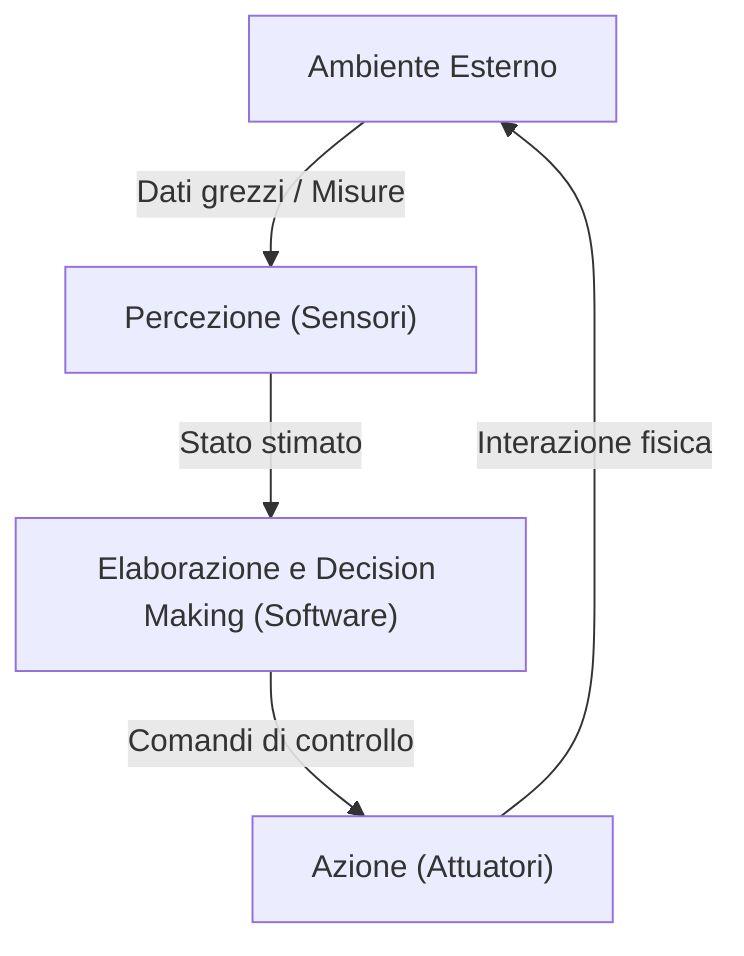
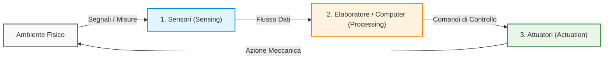
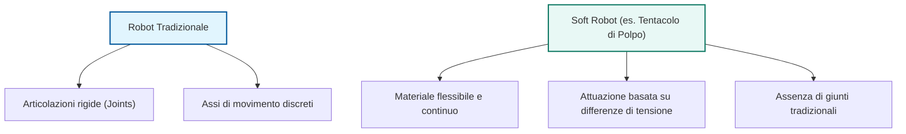
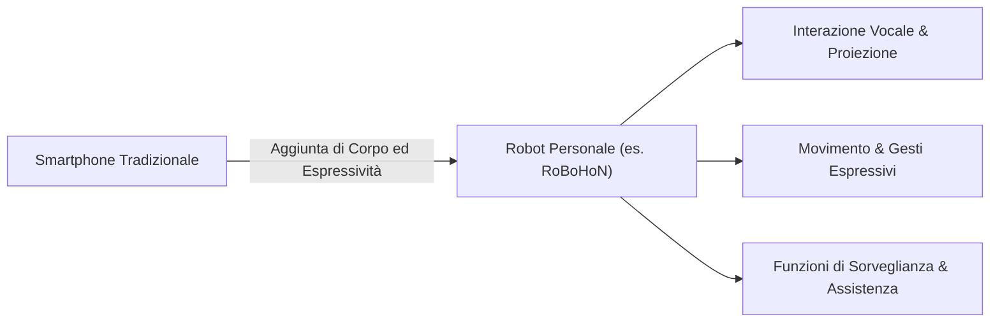
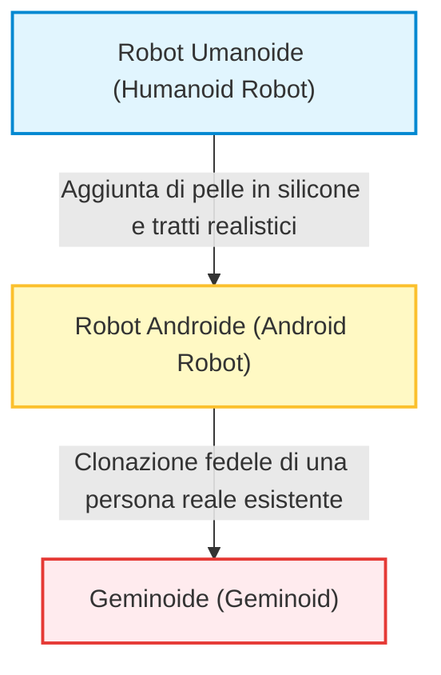
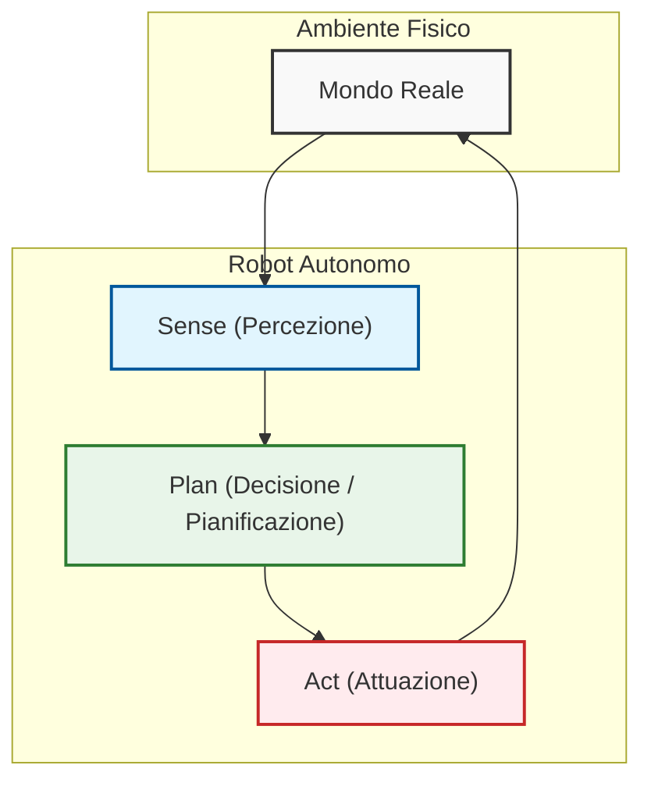

# Introduzione alla Robotica e Organizzazione del Corso

## Overview Didattica
Questa lezione introduce i concetti fondamentali della robotica e traccia una panoramica storica dell'evoluzione dei robot, partendo dai miti antichi fino ai sistemi intelligenti moderni. Vengono inoltre fornite importanti indicazioni pratiche sull'organizzazione del corso, sull'uso della piattaforma GitHub per la consegna degli homework e sulle modalità di accesso agli ambienti di laboratorio tramite ROS 2 (Robot Operating System 2).

### Concetti Chiave
- **Natura Multidisciplinare della Robotica**: La robotica unisce meccanica, attuazione, sensoristica e ingegneria del software. Questo corso si concentra in particolare sull'aspetto **software** e di controllo intelligente.
- **Definizione di Robotica**: Scienza che studia la connessione intelligente tra **percezione** (perception) e **azione** (action), permettendo a una macchina autonoma di reagire e modificare il proprio comportamento in base all'ambiente circostante.
- **Evoluzione Storica**: 
  - Anni '60: Primi robot controllati da computer.
  - Anni '70: Primi robot industriali nelle fabbriche per compiti gravosi o pericolosi.
  - Anni '80: Introduzione dei concetti di percezione e agenti autonomi.
  - Anni '90: Diffusione dei robot fuori dalle fabbriche (robot di servizio e da campo).
- **Strumenti di Laboratorio**: Utilizzo di ROS 2, controllo tramite terminale su macchine virtuali remote e gestione del codice sorgente tramite **Git/GitHub**, considerato uno standard fondamentale anche per la stesura del CV ingegneristico.

---

### Introduzione al Corso e Strumenti di Laboratorio

#### Organizzazione e Competenze Trasversali
La robotica è una disciplina ampia che si interseca con diversi ambiti dell'ingegneria. All'interno del percorso di studi, questo corso si focalizza sulla **robotica intelligente** (*intelligent robotics*), sui robot di servizio (*service robots*) e sui robot da campo (*field robots*), distinguendosi dalla trattazione classica della sola automazione industriale. Per garantire una base comune a tutti gli studenti, verrà comunque dedicata una lezione introduttiva specifica ai **robot industriali** (*industrial robots*).

Corsi complementari consigliati per completare il profilo:
*   *Robotica Industriale* e *Robotica e Controllo 1* (per le basi di cinematica, dinamica e controllo dei manipolatori).
*   *Elaborazione Dati 3D* (*3D Data Processing*).
*   *Neurorobotica* (*Neurorobotics*).

#### Ambiente Software: ROS 2 e Git
Le attività pratiche si basano sull'uso di:
*   **ROS 2** (*Robot Operating System 2*): il framework middleware standard de facto per lo sviluppo di software robotico. L'ambiente è disponibile sia tramite installazione locale su laptop sia tramite macchine virtuali basate su Ubuntu eseguite sui server di dipartimento.
*   **Git / GitHub**: sistema di controllo versione (*Version Control System*) utilizzato per la consegna degli elaborati e la gestione del codice, strumento fondamentale per la collaborazione e la presentazione professionale dei progetti software.

---

### Che cos'è la Robotica?

La robotica è la scienza che studia come progettare e realizzare macchine in grado di sostituire o coadiuvare l'essere umano nello svolgimento di compiti specifici, in particolare quando l'ambiente operativo è **pericoloso**, **ostile** o quando il lavoro risulta **troppo gravoso o usurante**.

Un robot moderno non è semplicemente un attuatore terminale (*end-effector*) telecomandato a distanza: l'obiettivo fondamentale della robotica intelligente è dotare la macchina di un certo grado di **autonomia decisionale** (*decision making*), permettendole di operare in modo indipendente nel mondo reale.

#### Una Scienza Multidisciplinare
Per realizzare un sistema robotico fisico autonomo è necessaria l'integrazione di quattro pilastri fondamentali:
1.  **Meccanica**: la struttura fisica e la cinematica del robot.
2.  **Attuazione**: i motori e i sistemi di trasmissione per generare il movimento.
3.  **Percezione / Sensoristica** (*Sensing*): sensori per misurare lo stato interno della macchina e le proprietà dell'ambiente circostante.
4.  **Software di Controllo e Intelligenza**: algoritmi per elaborare i dati sensoriali, pianificare le azioni, prendere decisioni e coordinare l'attuazione.

> **Prospettiva del corso:** L'approccio adottato è prevalentemente orientato al **software** e all'**elaborazione delle informazioni**, focalizzandosi su come trasformare i dati sensoriali in comportamenti intelligenti.

---

### Evoluzione Storica della Robotica

L'idea di costruire macchine antropomorfe o entità artificiali autonome affonda le radici nella mitologia e nella letteratura antica. Tuttavia, come disciplina scientifica e tecnologica, la robotica moderna si è sviluppata nell'arco degli ultimi sessant'anni:

*   **Anni '60:** Nascita dei primi prototipi di robot controllati da calcolatore come macchine indipendenti.
*   **Fine anni '70:** Introduzione dei primi veri e propri robot industriali nelle fabbriche. La robotica si afferma principalmente come tecnologia per l'**automazione rigida**, impiegata per sostituire l'uomo nelle mansioni più ripetitive, sporche e rischiose delle linee di montaggio.
*   **Anni '80:** Transizione concettuale dall'automazione classica alla **robotica intelligente**. Il robot smette di essere un mero esecutore cieco di traiettorie predeterminate e diventa un **agente autonomo** (*autonomous agent*) dotato di sensori.
*   **Anni '90 in poi:** Uscita dei robot dagli ambienti strutturati delle fabbriche verso ambienti non strutturati (robotica di servizio, esplorazione spaziale, veicoli autonomi).

---

### La Definizione Moderna: Il Loop Percezione-Azione

A partire dalla svolta degli anni '80, la definizione formale di robotica si è consolidata attorno all'interazione attiva con l'ambiente:

> **Concetto Chiave: Definizione di Robotica**  
> La robotica è la scienza che studia la **connessione intelligente tra Percezione e Azione** (*Perception-Action loop*).  
> Un robot intelligente non si limita a ripetere sequenze di comandi preimpostate, ma:
> 1.  **Percepisce** lo stato del mondo tramite sensori.
> 2.  **Ragiona / Elabora** i dati misurati.
> 3.  **Agisce** modificando attivamente il proprio comportamento e l'ambiente in risposta a ciò che accade.

---

### Evoluzione della Robotica: Dalla Fabbrica al Mondo Reale

Tradizionalmente confinata negli ambienti strutturati e controllati delle linee di produzione industriali, la robotica moderna si sta espandendo verso contesti non strutturati (*in the wild*), affrontando la complessità del mondo reale. Questa transizione ha dato vita a due macro-categorie applicative:

*   **Robotica di Servizio (Service Robotics):** Sistemi progettati per assistere l'essere umano e migliorarne la qualità della vita, operando prevalentemente in ambienti interni (indoor). Gli ambiti tipici includono la pulizia domestica (es. robot aspirapolvere), l'assistenza personale, la sanità e la logistica di prossimità (consegna merci).
*   **Robotica da Campo (Field Robotics):** Robot mobili progettati per operare in ambienti esterni (outdoor) complessi e dinamici, come nell'agricoltura di precisione, nel monitoraggio ambientale, nell'esplorazione spaziale o nelle missioni di soccorso e ricerca.

---

### Definizione Architetturale e Funzionale di "Robot"

Nel definire formalmente cosa sia un robot, non basta descrivere il suo comportamento autonomo o la sua semplice interazione fisica con l'ambiente. 

Ad esempio, un dispositivo puramente meccanico come il **pantografo** trasmette un movimento da un'estremità all'altra: possiede un'interfaccia di "rilevamento" meccanico dell'input e una di "attuazione" dell'output, ma non è un robot poiché manca completamente un elemento intermedio di calcolo e decisione.

> **Concetto Chiave: La Triade Fondamentale del Robot**  
> Un robot è un sistema cibernetico/meccatronico autonomo o semi-autonomo definito dalla presenza e dall'interconnessione di tre moduli essenziali:
> 1. **Sensori (Sensing):** Dispositivi che acquisiscono dati sullo stato interno del sistema e sull'ambiente circostante.
> 2. **Unità di Elaborazione / Computer (Processing & Control):** L'infrastruttura computazionale (hardware e software) che elabora le informazioni sensoriali, esegue algoritmi decisionali, pianifica traiettorie e genera i comandi di controllo.
> 3. **Attuatori (Actuation):** Organi meccanici, motori o sistemi di azionamento che trasformano i comandi computazionali in azioni fisiche nell'ambiente.

---

### Origini del Termine e Influenza Culturale

A differenza di molte discipline ingegneristiche, la robotica non è nata originariamente all'interno di laboratori scientifici, bensì nella letteratura e nella drammaturgia.

#### L'Etimologia: *R.U.R.* e Karel Čapek (1920)
Il termine **"Robot"** fu introdotto per la prima volta nel 1920 dallo scrittore e drammaturgo ceco **Karel Čapek** nella sua opera teatrale *R.U.R. (Rossum's Universal Robots)*. 
*   La parola deriva dal termine ceco **"robota"**, che significa letteralmente *lavoro pesante*, *corvée* o *lavoro servile/forzato*.
*   Nell'opera, i robot erano entità organiche artificiali create per sostituire gli esseri umani nei lavori di fabbrica più faticosi e alienanti, liberando l'uomo dalla schiavitù del lavoro manuale.

#### L'Impatto della Fantascienza (Sci-Fi)
L'immaginario collettivo (da personaggi cinematografici come *R2-D2* o *C-3PO* di Star Wars fino ai romanzi di Isaac Asimov) continua a esercitare una forte influenza non solo sul pubblico, ma anche sulla comunità scientifica. Spesso i ricercatori traggono ispirazione dai paradigmi antropomorfi e cooperativi della fantascienza per concepire nuove architetture, forme e funzionalità per i robot reali.

---

### Robotica Reale: Il Ruolo Predominante dei Robot Industriali

Nonostante l'immaginario sia popolato da robot umanoidi o d'assistenza, dal punto di vista economico, commerciale e di maturità tecnologica, il settore è storicamente e quantitativamente dominato dai **robot industriali**.

*   **Attori e Standard Industriali:** Grandi costruttori internazionali (come ABB, KUKA, FANUC, Yaskawa) generano la quota predominante del fatturato del settore.
*   **Tipologie Strutturali e Applicative:**
    *   *Manipolatori seriali rigidi:* Bracci articolati ad alta precisione, ripetibilità e velocità, impiegati per saldatura, verniciatura e manipolazione pesante in celle isolate da barriere di sicurezza.
    *   *Architetture SCARA (Selective Compliance Assembly Robot Arm):* Robot rigidi lungo l'asse verticale $z$ e conformi sul piano orizzontale $xy$, ideali per operazioni rapide di *pick-and-place* e assemblaggio.
    *   *Robot Collaborativi (Cobot):* Sistemi più recenti (come *ABB YuMi* o *Universal Robots UR10*) progettati con sensoristica avanzata di coppia/forza per lavorare a stretto contatto con gli operatori umani senza barriere fisiche.

Mentre i robot industriali eccellono per efficienza, precisione e robustezza in ambienti rigidamente strutturati, presentano limiti evidenti quando devono adattarsi a scenari dinamici e imprevedibili, aprendo la strada alle sfide della robotica mobile e autonoma.

---

### Dagli Robot Industriali ai Robot Mobili: Limiti e Flessibilità

Il limite principale dei bracci robotici industriali tradizionali risiede nel fatto di essere imbullonati al suolo (*fixed to the ground*). Questa configurazione fissa comporta dei vincoli operativi evidenti:
- **Spazio di lavoro limitato:** Possono operare solo all'interno di una determinata area circoscritta.
- **Pianificazione rigida:** Il percorso (*path*) e il movimento (*motion*) sono interamente pre-pianificati in anticipo.
- **Riferimento spaziale assoluto:** Poiché la base è immobile, esiste un sistema di riferimento cartesiano fisso centrato sull'origine della base stessa. Questo rende semplice calcolare la posizione esatta dell'utensile finale (*tool*) nello spazio.

Al contrario, i **robot mobili** (*mobile robots*) offrono una flessibilità enormemente superiore. Possono muoversi nell'ambiente circostante, adattarsi a imprevisti (come mobili spostati o la presenza di persone) e cambiare dinamicamente il loro percorso per completare il compito assegnato. Questo richiede tuttavia un software di controllo molto più complesso rispetto a quello dei robot industriali.

#### Il Fenomeno dei Robot Umanoidi
Un discorso a parte meritano i **robot umanoidi** (*humanoid robots*). Attualmente rappresentano una tecnologia molto popolare e di grande impatto mediatico, ma non sono ancora pienamente maturi per un impiego industriale efficace. Un esempio emblematico citato in aula riguarda l'azienda automobilistica BMW, che ha acquistato alcuni robot umanoidi per integrarli nelle proprie linee di produzione salvo poi restituirli dopo pochi mesi perché non sufficientemente efficienti. Al contrario, i robot mobili (come i robot aspirapolvere) rappresentano ormai una realtà economica consolidata e un mercato di massa globale.

---

### La Definizione Universale di Robot

Indipendentemente dalla forma, dalla struttura corporea o dalle diverse tecnologie impiegate, è possibile formulare una definizione condivisa che racchiuda la natura di tutte queste macchine. 

> **Concetto Chiave:** Un **robot** è un meccanismo attuato (*actuated mechanism*), programmabile in due o più assi, dotato di un certo grado di autonomia, che si muove all'interno del proprio ambiente per eseguire un compito previsto (*intended task*).

Analizziamo i punti chiave di questa definizione:
1. **Programmabile:** Il robot deve disporre di un computer o di un microprocessore per elaborare dati, gestire informazioni ed eseguire un programma software.
2. **Autonomia:** Non si limita a ripetere passivamente una sequenza meccanica rigida, ma possiede un certo livello di autonomia decisionale.
3. **Movimento:** Deve disporre di attuatori per muoversi (anche nel caso dei robot industriali, dove la base è fissa ma il corpo si muove nello spazio circostante).

---

### Analisi di Casi Quotidiani: La Lavatrice e l'Auto Autonoma

Per comprendere meglio i confini di questa definizione, il docente analizza due esempi tratti dalla vita di tutti i giorni: una lavatrice e un'automobile autonoma.

#### 1. La Lavatrice (Moderna)
Una lavatrice moderna è un elettrodomestico complesso:
- **È programmabile?** Sì, permette di selezionare diversi programmi di lavaggio tramite un microcontrollore o un microprocessore integrato.
- **È autonoma?** In parte. Funzioni di base come caricare una quantità fissa di acqua (es. 5 litri) o riscaldarla fino a una certa soglia (es. $40^\circ\text{C}$) rientrano nella semplice **automatizzazione** (*automation*). Tuttavia, i modelli più avanzati mostrano una vera **autonomia** quando adattano il comportamento in base alle condizioni esterne: ad esempio, pesando il carico di vestiti per calibrare automaticamente la quantità d'acqua, oppure rilevando il livello di sporco per regolare il dosaggio del detersivo.
- **Si muove?** Sì, muove gli oggetti al suo interno attraverso la rotazione del cestello (*drum*).
- **Il problema degli assi:** Nonostante la programmabilità e un certo grado di autonomia, **la lavatrice non è un robot**. Il motivo principale è che possiede **un solo asse di attuazione** (la rotazione del cestello), mentre la definizione richiede due o più assi.

#### 2. L'Automobile Autonoma (*Autonomous Car*)
Un'auto a guida autonoma viene invece classificata a pieno titolo come un robot. Verifichiamo i requisiti:
- **È programmabile e ha un computer a bordo?** Sì, esegue software complessi in tempo reale.
- **È autonoma?** Sì, per definizione.
- **Possiede due o più assi di attuazione?** Assolutamente sì. L'architettura di movimento richiede almeno due gradi di libertà principali:
  1. Il controllo della velocità tramite il pedale (che regola la spinta delle ruote).
  2. Il controllo della direzione tramite il **volante** (*steering wheel*), che gestisce l'asse dello sterzo.

---

### Applicazioni pratiche, limiti delle definizioni e campi della robotica

Continuando il discorso sui sistemi robotici, il professore analizza le sfumature e i confini applicativi delle definizioni date finora, introducendo le differenze chiave tra i vari tipi di robot e le loro applicazioni nel mondo reale.

#### Limiti delle definizioni ingegneristiche

Ogni definizione o astrazione ha dei limiti intrinseci. Prendiamo il caso di un'auto a guida autonoma (autonomous car): pensiamo comunemente che il motore controlli la velocità facendo girare le ruote, ma c'è un secondo asse attuato, ovvero il volante (steering wheel). È proprio grazie a questo secondo grado di libertà che consideriamo l'auto un robot.

Ma cosa dire di un treno a guida autonoma (driverless train) come quelli della metropolitana? È un robot? 
- Da un lato, non ha la possibilità di scegliere lo sterzo perché vincolato dai binari (railways). 
- Dall'altro, escluderlo dalla categoria dei robot solo per questo motivo sembra forzato, dal momento che svolge compiti di trasporto autonomo del tutto analoghi.

Un altro esempio che mette alla prova le definizioni tradizionali è la **robotica soffice (soft robotics)**. 

Un robot realizzato con materiale flessibile che si contrae sotto l'effetto di una differenza di tensione — come un robot ispirato a un polpo (octopus robot) — non possiede giunti singoli né assi meccanici tradizionali. Eppure, a tutti gli effetti, si tratta di un robot. 

La conclusione del docente è pratica: *le definizioni ingegneristiche servono perché sono utili*, ma dobbiamo mantenere una certa flessibilità di comprensione. Nonostante queste eccezioni, per la maggior parte dei sistemi la definizione standard basata sui tre elementi fondamentali rimane valida.

#### I tre elementi chiave di un robot
Ricapitolando, affinché un sistema possa essere definito tale, deve integrare tre componenti essenziali (che siano di natura artificiale o persino biologica, ricavati cioè da tessuti viventi):
1. **Sensori (Sensors)**
2. **Attuatori (Actuators)**
3. **Elaborazione delle informazioni (Information processing)**

È per questo motivo che la robotica è una scienza marcatamente **multidisciplinare**. Nell'ambito dell'ingegneria informatica e dell'automazione, ad esempio, si sfrutta praticamente tutto ciò che si studia nel corso di studi:
* Sistemi operativi in tempo reale (Real-time operating systems), fondamentali perché il robot è un agente fisico inserito nell'ambiente e deve reagire in tempo reale ai cambiamenti.
* Linguaggi di programmazione dedicati.
* Algoritmi per i Big Data per estrarre informazioni dall'ambiente.
* Tecniche di Intelligenza Artificiale (AI) e Machine Learning.
* Elaborazione della percezione, come la Computer Vision e l'elaborazione di dati tridimensionali ($3D$).

---

#### Robot industriali vs. Robot da campo e di servizio

Una distinzione fondamentale riguarda il contesto operativo del robot:

* **Robot Industriali (Industrial Robots):** Lavorano in un *ambiente strutturato*, ovvero un ambiente noto e ingegnerizzato in anticipo per semplificare i compiti del robot (es. catene di montaggio).
* **Robot da Campo e di Servizio (Field and Service Robots):** Lavorano in *ambienti non strutturati* o solo parzialmente modificati. In questi contesti, la percezione e il processo decisionale (decision-making) diventano molto più critici, poiché il robot deve mostrare un livello di autonomia notevolmente superiore.

##### Esempi di Field e Service Robotics:
* **Robot su Marte (Mars Rovers):** 
  - *Nei primi anni:* I rover non erano autonomi. Gli ingegneri della NASA utilizzavano una mappa fotografica marittima in scala e un robottino giocattolo delle stesse dimensioni sulla Terra. Trovavano un percorso libero da rocce, calcolavano i comandi e li caricavano sul robot marziano, che li eseguiva con minima autonomia (controllando solo lo slittamento delle ruote).
  - *Oggi:* I rover moderni sono molto più autonomi: possono rilevare gli ostacoli in autonomia e persino decidere quali rocce siano più interessanti da analizzare.
* **Robot per ambienti pericolosi (Hazardous environments):** Utilizzati in contesti industriali simulati per chiudere valvole o rilevare allarmi (spesso robot quadrupedi avanzati capaci persino di sollevarsi su due zampe).
* **Robot domestici:** Come i robot aspirapolvere (Roomba) o i tagliaerba robotizzati, i pulitori per piscine e i dispositivi per la pulizia delle grondaie.

---

#### Robotica Medica

Un settore a parte è rappresentato dalla **medicina**, dove tuttavia **l'autonomia non è ammessa** a causa dei rischi elevati, delle responsabilità legali e delle assicurazioni.

> **Concetto Chiave:** Quando sentiamo al telegiornale che un paziente è stato operato da un *robot chirurgico*, non dobbiamo pensare che sia la macchina a prendere decisioni o a tagliare in autonomia. Il robot è interamente guidato da un chirurgo umano.

Un esempio celebre è il **Robot Da Vinci**:
* Il chirurgo siede davanti a un display in realtà virtuale che mostra l'interno del paziente in $3D$.
* Attraverso due manipolatori avanzati (simili a joystick), il chirurgo controlla gli strumenti microscopici all'interno del corpo.
* **Il ruolo del robot:** Non compie movimenti autonomi (evitando il rischio di recidere accidentalmente un vaso sanguigno). Si limita a replicare i movimenti del chirurgo introducendo due vantaggi fondamentali:
  1. *Riduzione della scala (Scaling):* Un movimento ampio del medico viene ridotto a livello microscopico, permettendo precisioni impossibili per la mano umana.
  2. *Filtraggio dei movimenti:* Il robot elimina i micro-tremori naturali anche del chirurgo più esperto.

La lezione si chiude accennando ad altre applicazioni in forte crescita, come i **robot educativi** (su cui si fa ricerca attiva da oltre 15 anni) e una gamma sempre più vasta di robot domestici per la cura della casa.

---

### Robot Personali e di Assistenza (Personal and Assistive Robots)

L'idea fondamentale del **robot personale** (*Personal Robot*) è la realizzazione di un agente robotico compagno (*companion robot*), una sorta di assistente o maggiordomo in grado di affiancarci nella vita quotidiana e semplificare le attività di tutti i giorni.

Nonostante l'attrattiva del concetto, il mercato commerciale ha rappresentato una sfida enorme per queste tecnologie:
* Numerose aziende hanno tentato di commercializzare robot da compagnia (come i celebri *Nao* e *Pepper* della SoftBank Robotics, o il cane robotico *AIBO* di Sony), affrontando frequenti fallimenti commerciali, interruzioni della produzione o vendite molto limitate.
* Un esempio emblematico di questo paradigma è stato **RoBoHoN** (sviluppato da Tomotaka Takahashi in Giappone): un dispositivo ibrido a metà tra uno smartphone e un robot umanoide miniaturizzato. RoBoHoN integrava funzioni di telefonia mobile, assistente vocale intelligente, fotocamera autonoma e persino un proiettore/beamer integrato per mostrare immagini o video, comunicando notifiche attraverso gesti ed espressioni corporee.

Al di là dei dispositivi tascabili, lo sviluppo della robotica di servizio si è orientato verso i **robot di assistenza domestica** (*Assistive Robots*): sistemi pensati per rimanere all'interno dell'abitazione con compiti di pulizia avanzata, supporto all'autonomia e monitoraggio di persone anziane che vivono sole.

---

### Dallo Umanoide al Geminoide: Lo Spettro dell'Antropomorfismo

La ricerca sui robot da assistenza e da compagnia si articola lungo uno spettro di complessità morfologica ed estetica basato sul livello di fedeltà all'aspetto umano:

1. **Robot Umanoide (*Humanoid Robot*)**: Presenta la struttura corporea generica dell'essere umano (tipicamente una testa, due braccia e due gambe o una base mobile), ma mantiene un aspetto chiaramente meccanico/robotico.
2. **Robot Androide (*Android Robot*)**: È progettato per essere indistinguibile da un essere umano. Utilizza rivestimenti in silicone per simulare la pelle e riproduce le proporzioni, la micro-espressività facciale e i movimenti biologici con estrema precisione.
3. **Geminoide (*Geminoid*)**: Rappresenta l'estremo di questo spettro. È la replica esatta, clonata nelle fattezze fisiche e nella voce, di una specifica persona reale vivente (concetto introdotto e sviluppato prevalentemente dal Prof. Hiroshi Ishiguro dell'Università di Osaka).

#### Motivazioni Scientifiche: Human-Robot Interaction ed Embodiment

La costruzione di androidi e geminoidi non risponde soltanto a fini applicativi o di telepresenza (come la possibilità di inviare un proprio clone robotico a tenere lezioni o conferenze a distanza), ma costituisce una vera e propria piattaforma di ricerca per le neuroscienze, la psicologia cognitiva e l'**Interazione Uomo-Robot** (*Human-Robot Interaction - HRI*).

> **Concetto Chiave: La Teoria dell'Embodiment nell'Interazione Naturale**  
> L'evoluzione del cervello umano si è strutturata per milioni di anni attorno alla comunicazione tra corpi simili. Di conseguenza, l'interfaccia più naturale per interagire con una tecnologia complessa non è rappresentata da tastiere, mouse o touchscreen, bensì dal **linguaggio combinato con la presenza corporea (*Embodiment*)**.  
> Espressioni facciali, sguardi, micro-movimenti della testa, postura e gestualità delle mani veicolano una quantità fondamentale di informazione: un agente intelligente dotato di un corpo antropomorfo stimola nel nostro cervello i medesimi circuiti cognitivi ed empatici attivati nella comunicazione tra esseri umani.

Questi modelli consentono di indagare come la mente umana percepisca l'intelligenza artificiale quando questa assume le sembianze di un individuo reale, analizzando questioni legate alla consapevolezza, all'antropomorfismo e all'accettazione sociale delle macchine.

---

### Nuove Frontiere: Mobilità Autonoma e Sistemi di Trasporto Intelligenti

Negli ultimi anni, i confini della robotica si sono allargati fino a comprendere settori tradizionalmente afferenti all'ingegneria dei trasporti e all'ingegneria meccanica. 

I **Sistemi di Trasporto Intelligenti** (*Intelligent Transportation Systems - ITS*), inizialmente focalizzati sulla semplice sensorizzazione di treni e infrastrutture ferroviarie, sono oggi a tutti gli effetti un ramo di punta della robotica applicata:

* **Guida Autonoma (*Autonomous Driving*)**: I veicoli a guida autonoma non sono più considerati meri sistemi meccanici, ma veri e propri robot mobili su larga scala. L'architettura dominante di questi sistemi richiede competenze avanzate di ingegneria informatica ed elettronica: percezione multimodale tramite sensori (LiDAR, Radar, telecamere), algoritmi di localizzazione e mappatura simultanea (*SLAM - Simultaneous Localization and Mapping*), pianificazione della traiettoria e sistemi di controllo in tempo reale.
* **Micro-mobilità e Sedie Intelligenti**: Sviluppo di piattaforme robotiche per il trasporto individuale indoor e outdoor (particolarmente diffuse nei contesti di ricerca asiatici). L'utente può semplicemente indicare la destinazione (es. *"portami in biblioteca"*) e la sedia autonoma pianifica il percorso evitando gli ostacoli dinamici, rappresentando un valido supporto sia per persone con disabilità motorie sia per il comfort generale.
* **Taxi Volanti Autonomi (*Autonomous Flying Taxis*)**: Sistemi aerei a decollo e atterraggio verticale (*eVTOL - electric Vertical Take-Off and Landing*) guidati da controllori autonomi per il trasporto passeggeri urbano.

---

### Esoscheletri e Tassonomia dei Robot

Prima di concludere la panoramica sui diversi tipi di sistemi robotici, un cenno particolare va fatto agli esoscheletri (*exoskeletons*). Non si tratta semplicemente di robot che ci circondano, ma di dispositivi fisicamente attaccati al corpo umano. Trovano impiego sia in ambito medico, per dare a persone con disabilità la possibilità di camminare nuovamente, sia in ambito industriale, per supportare i lavoratori e ridurre il carico fisico sugli arti, prevenendo infortuni e danni al corpo.

Dato il vasto panorama di robot incontrati in campi differenti, è possibile tracciarne una tassonomia basata su diversi punti di vista:

*   **Mobilità:** Si distinguono robot mobili (*mobile robots*), capaci di spostarsi su pavimenti, terreni agricoli, in aria, sottacqua o persino su altri pianeti, e robot fissi.
*   **Capacità e Applicazioni:** 
    *   *Robot di manipolazione:* Tipicamente i robot industriali, pensati per manipolare oggetti e produrre beni, oppure robot di servizio dotati di bracci meccanici per assistere gli utenti.
    *   *Grado di autonomia:* Possono essere completamente autonomi oppure **teleoperati** (*teleoperated*), ovvero controllati a distanza da un operatore umano che sfrutta flussi video dai sensori e interfacce (spesso aptiche) per inviare comandi tramite joystick.

---

### Il Loop Classico: Sense-Plan-Act

Nonostante le enormi differenze nelle modalità di percezione, attuazione e negli algoritmi di movimento, tutti i robot autonomi condividono un principio di funzionamento fondamentale, rappresentato come un ciclo chiuso (*closed-loop*) sull'ambiente. Questo schema prende il nome di **Sense-Plan-Act (SPA)**.

1.  **Sense (Percezione):** Il robot acquisisce informazioni dall'ambiente circostante tramite i sensori.
2.  **Plan (Pianificazione):** Le capacità di elaborazione processano i dati percettivi per decidere quali comandi inviare.
3.  **Act (Attuazione):** Gli attuatori eseguono i comandi (es. ruotare una ruota, muovere un giunto).

---

### Limiti del paradigma Sense-Plan-Act e l'Incertezza del Mondo Reale

Il paradigma *Sense-Plan-Act* funziona egregiamente in ambienti controllati e noti. Un esempio classico è il gioco degli scacchi: lo spazio degli stati è totalmente conosciuto, gli oggetti sono mappati in simboli (la torre, il cavallo) e le regole sono rigide (approccio tipico della *Good Old-Fashioned AI*).

Tuttavia, quando il robot opera nel mondo reale, questo schema classico mostra forti limiti a causa di tre fattori critici:

*   **Incertezza di attuazione (*Actuation Uncertainty*):** Non possiamo dare per scontato che l'attuazione abbia successo. Ad esempio, se un robot su Marte ha le ruote che slittano sulla sabbia o affondano, il sistema di controllo penserà di essersi spostato di una certa distanza, mentre in realtà è rimasto fermo. Lo stesso vale per problemi di attrito o scivolamento sul ghiaccio.
*   **Incertezza di percezione e Symbol Grounding:** Tradurre oggetti fisici reali in simboli (*symbol grounding*) non è banale. Un oggetto in movimento è un gatto o un grosso topo? Una sagoma è un cavallo o una zebra? A ciò si aggiunge il rumore intrinseco dei sensori, per cui le misurazioni non sono mai perfettamente uguali o prive di errore.
*   **Interazione con l'Umano:** La presenza umana rende l'ambiente intrinsecamente imprevedibile. Spesso l'essere umano non si limita ad agire nell'ambiente, ma interagisce direttamente con il robot, interferendo con le sue azioni o inviandogli comandi. Il robot deve capire se eseguire ciecamente il comando o interpretarlo in base al contesto.

Per far fronte a tutte queste criticità, l'infrastruttura software di controllo richiede architetture molto più complesse rispetto al semplice ciclo *Sense-Plan-Act*, argomenti che verranno approfonditi nel corso delle prossime lezioni.