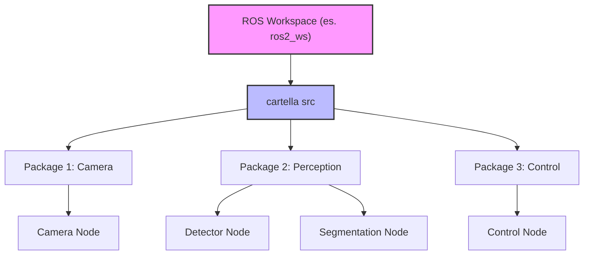
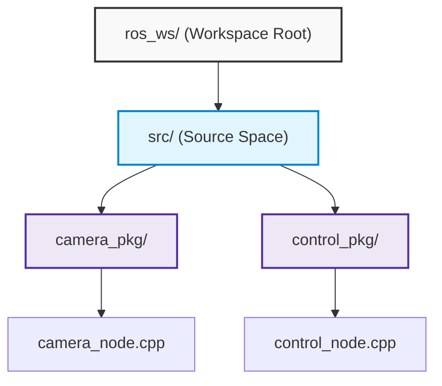
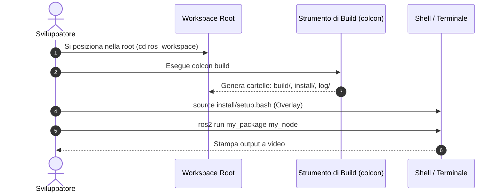
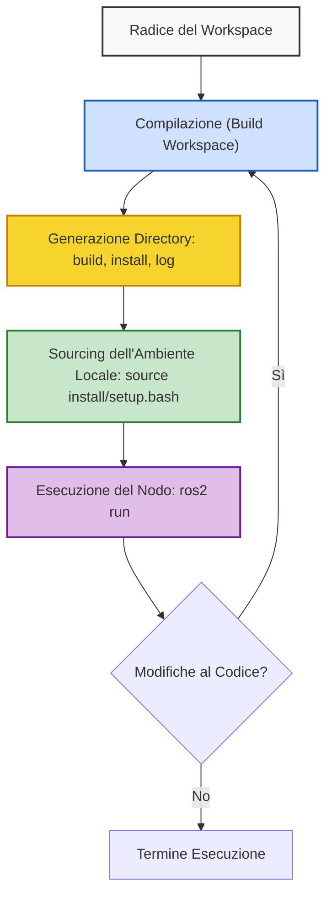

# Introduzione a ROS e Configurazione dell'Ambiente di Lavoro

## Overview Didattica
In questa lezione introduttiva vengono affrontati i concetti preliminari per lo sviluppo di applicazioni robotiche utilizzando ROS (Robot Operating System). Vengono definiti la natura e il ruolo di ROS, distinguendolo da un linguaggio di programmazione, un sistema operativo tradizionale o una semplice libreria, e sottolineandone la natura di insieme di strumenti e librerie software modulari e distribuite. Vengono inoltre illustrate le fasi iniziali per la configurazione dell'ambiente di lavoro, inclusi il caricamento delle variabili d'ambiente nel terminale (`source`), l'organizzazione gerarchica dei file attraverso i concetti di Workspace, Package e Node, e i prerequisiti per la gestione delle distribuzioni software (in particolare Ubuntu 24 con ROS Jazzy Jalisco).

---

### Introduzione a ROS e configurazione dell'ambiente di lavoro

In questo corso utilizzeremo **ROS** (Robot Operating System), in particolare la distribuzione **Jazzy Jalisco**, che gira su **Ubuntu 24.04**. Il punto di riferimento principale per la documentazione ufficiale, le guide di installazione e i tutorial è il sito ufficiale di ROS, con cui è consigliabile familiarizzare fin da subito.

#### Che cos'è (e che cosa non è) ROS?
Prima di iniziare a scrivere codice, è importante chiarire la natura di ROS:
* **Non è un linguaggio di programmazione:** i programmi (chiamati *ROS nodes*) vengono scritti in C++ o Python.
* **Non è un sistema operativo tradizionale:** gira *sopra* un sistema operativo esistente (solitamente Linux). Tuttavia, dal punto di vista del robot, può essere visto come tale poiché fornisce servizi, astrazioni e primitive di basso livello.
* **Non è una semplice libreria:** è un insieme completo di librerie software e strumenti (*tools*) per la creazione di applicazioni robotiche.

Tra le sue caratteristiche principali troviamo:
* **Modularità:** un'applicazione ROS non è un blocco monolitico, ma è scomposta in tanti moduli indipendenti, ciascuno dedicato a un compito specifico. Questi moduli possono girare anche su macchine diverse (calcolo distribuito).
* **Interfaccia comune:** i moduli condividono interfacce standard, facilitando la condivisione, la modifica, il testing e il debug isolato.
* **Community:** una vasta community *open-source* che mette a disposizione componenti già pronti su GitHub, evitando di dover scrivere tutto da zero.

---

### Configurazione iniziale dell'ambiente

Dopo aver installato ROS, la primissima operazione da compiere in ogni terminale è il **cropping/source** dell'ambiente di lavoro, ovvero indicare al terminale dove trovare i binari e le configurazioni di ROS.

Il comando da eseguire è:
```bash
source /opt/ros/jazzy/setup.bash
```

Dato che digitare questo comando ogni volta che si apre un nuovo terminale risulta scomodo, è buona norma automatizzare la procedura aggiungendolo in fondo al proprio file di configurazione della shell (`.bashrc`).

---

### Organizzazione del Workspace e dei Pacchetti

Quando sviluppiamo un'applicazione ROS, dobbiamo seguire una struttura a cartelle ben definita:



* **Workspace:** è la cartella principale che contiene tutte le nostre applicazioni e i nostri progetti.
* **Cartella `src`:** si trova all'interno del workspace e contiene i pacchetti sorgente.
* **Pacchetti (*Packages*):** rappresentano l'unità organizzativa di base in ROS. Raggruppano codice, configurazioni e risorse relative a una specifica funzionalità (es. gestione della camera, percezione, controllo).
* **Nodi ROS (*ROS Nodes*):** sono i singoli programmi eseguibili scritti all'interno dei pacchetti per svolgere un compito specifico. I nodi comunicheranno tra loro tramite le interfacce e i messaggi di ROS (argomento che approfondiremo nelle prossime lezioni).

---

### Configurazione dell'Ambiente e Concetto di Workspace

Prima di creare e manipolare progetti in ROS 2, è fondamentale comprendere come il sistema operativo individua i comandi e le librerie necessarie.

#### Sourcing dell'Ambiente Globale

Ogni volta che si apre un nuovo terminale, la shell non sa automaticamente dove siano installati gli eseguibili di ROS 2. È necessario eseguire il cosiddetto **sourcing** dell'ambiente:

```bash
source /opt/ros/jazzy/setup.bash
```

> **Concetto Chiave**: Per evitare di digitare questo comando a ogni nuova sessione di terminale, si inserisce l'istruzione direttamente nel file di configurazione della shell (`~/.bashrc`):
> ```bash
> echo "source /opt/ros/jazzy/setup.bash" >> ~/.bashrc
> ```

---

### Creazione del Workspace e Struttura delle Directory

Un **Workspace** (Spazio di Lavoro) è semplicemente la directory radice all'interno della quale risiedono i progetti ROS 2. All'interno del workspace, tutto il codice sorgente deve risiedere all'interno di una cartella dedicata chiamata `src` (o `source`).



#### Regole di Modularità
*   **Workspace**: Contiene l'intero applicativo software per il robot.
*   **Package (Pacchetto)**: Unità atomica di compilazione e rilascio, deputata a una specifica funzionalità (es. gestione del sensore fotocamera).
*   **Node (Nodo)**: Il singolo programma eseguibile (es. il processo che cattura ed elabora i frame video).

Per creare la struttura iniziale, ci posizioniamo nella directory desiderata e creiamo contemporaneamente il workspace e la cartella sorgente tramite:

```bash
mkdir -p ros_workspace/src
```

---

### Creazione e Anatomia di un Package C++

In ROS 2 è possibile realizzare pacchetti sia in **Python** (usando il build-type `ament_python`) sia in **C++** (usando `ament_cmake`). 

#### Struttura di un Pacchetto C++
Una volta generato, il pacchetto C++ presenta la seguente anatomia:
*   `CMakeLists.txt`: File contenente le direttive di compilazione per CMake (include directory, target eseguibili, dipendenze da librerie esterne).
*   `package.xml`: File manifesto contenente i metadati (nome pacchetto, versione, manutentore, licenza) e l'elenco esplicito delle dipendenze a livello di compilazione ed esecuzione.
*   `include/`: Cartella destinata a ospitare gli header file (`.hpp` o `.h`).
*   `src/`: Cartella in cui risiede il codice sorgente C++ (`.cpp`), ovvero l'implementazione logica dei nodi.

#### Comando di Creazione del Pacchetto
Per creare un pacchetto, bisogna posizionarsi **all'interno della cartella `src`** ed eseguire il comando da terminale:

```bash
cd ros_workspace/src
ros2 pkg create --build-type ament_cmake --license Apache-2.0 --node-name my_node my_package
```

*   `--build-type ament_cmake`: Specifica che si tratta di un pacchetto C++.
*   `--license Apache-2.0`: Dichiara la tipologia di licenza associata al codice.
*   `--node-name my_node`: Genera automaticamente uno scheletro di nodo C++ "Hello World" segnaposto (`my_node.cpp`) all'interno di `src/`.
*   `my_package`: Nome identificativo del pacchetto.

---

### Compilazione, Sourcing Locale ed Esecuzione

Una volta definiti i nodi e configurato il pacchetto, il codice sorgente deve essere compilato per poter essere eseguito.



#### 1. Compilazione del Workspace con Colcon
La compilazione viene effettuata tramite il comando `colcon build`. 

> **Concetto Chiave**: Il comando `colcon build` deve essere eseguito **tassativamente dalla radice del workspace** (`ros_workspace`), non all'interno di `src/` o dentro le singole cartelle dei pacchetti.

```bash
cd ~/ros_workspace
colcon build
```

Al termine della compilazione, nella radice del workspace compariranno tre nuove cartelle generate automaticamente:
*   `build/`: Spazio di memorizzazione dei file intermedi di compilazione.
*   `install/`: Cartella contenente gli eseguibili compilati, le librerie e gli script di configurazione per l'ambiente.
*   `log/`: File di log generati durante la fase di build.

#### 2. Sourcing Locale (Overlay)
Se proviamo a eseguire subito il nostro nodo con `ros2 run my_package my_node`, il terminale restituirà un errore: il sistema non ha ancora registrato la presenza dei nuovi pacchetti appena compilati.

Bisogna informare il terminale su dove trovare gli eseguibili locali effettuando il source dell'overlay:

```bash
source install/setup.bash
```

#### 3. Esecuzione del Nodo
Dopo aver fatto il source, è possibile avviare il nodo utilizzando la sintassi standard della CLI (Interfaccia a Linea di Comando / *Command Line Interface*):

```bash
ros2 run <nome_pacchetto> <nome_nodo>
```

Nel nostro caso:
```bash
ros2 run my_package my_node
```

Il terminale visualizzerà l'output standard definito nel main C++ del nodo segnaposto (tipicamente un messaggio di benvenuto del tipo `hello world my_package`).

---

### Compilazione, Configurazione ed Esecuzione del Nodo

Dopo aver creato il pacchetto e implementato il codice sorgente del nodo, il passo successivo consiste nel compilare l'intero ambiente di lavoro (**Workspace**). Nei sistemi ROS 2 (Robot Operating System 2), analogamente a quanto avviene nei progetti C++ o Rust, il codice deve essere compilato per generare gli eseguibili e preparare l'albero di installazione.



---

#### 1. Compilazione del Workspace

La compilazione deve essere sempre invocata posizionandosi nella **radice del workspace** (e non all'interno delle singole sottocartelle del codice sorgente). 

Durante la fase di build, all'interno del workspace vengono create automaticamente tre cartelle di output:
* `build/`: contiene i file intermedi generati dal processo di compilazione.
* `install/`: contiene i file binari, le librerie e gli script di configurazione pronti per l'esecuzione.
* `log/`: raccoglie le informazioni e i log relativi al processo di compilazione.

---

#### 2. Configurazione dell'Ambiente (*Sourcing*)

Affinché il terminale riconosca i nuovi pacchetti e i relativi eseguibili generati, è necessario effettuare il caricamento delle variabili d'ambiente (**Sourcing**) generate dentro la directory di installazione:

$$\text{source install/setup.bash}$$

Una volta eseguito il source:
* Il sistema aggiorna i percorsi di ricerca dei pacchetti.
* Diventa disponibile il completamento automatico tramite il tasto `Tab` per i comandi legati ai pacchetti personalizzati.

---

#### 3. Esecuzione del Nodo

Per avviare il nodo compilato, si utilizza la sintassi standard:

$$\text{ros2 run } \langle\text{nome\_pacchetto}\rangle \text{ } \langle\text{nome\_nodo}\rangle$$

Ad esempio:
$$\text{ros2 run my\_package my\_node}$$

---

### Flusso Iterativo di Sviluppo

> **Concetto Chiave: Ricompilazione Obbligatoria**  
> Ogni volta che viene apportata una modifica al codice sorgente (ad esempio variando un messaggio di output a schermo), il nodo **non** rifletterà le modifiche se eseguito direttamente. È mandatorio:
> 1. Salvare le modifiche al codice.
> 2. Ricompilare il workspace dalla radice.
> 3. Eseguire nuovamente il sourcing (se sono stati modificati parametri di build o dipendenze).
> 4. Eseguire il nodo.

Se non si ricompila il workspace, il runtime continuerà ad eseguire l'ultimo binario presente all'interno della cartella `install/`.

---

### Esercizio Pratico Assegnato

Come consolidamento pratico di quanto visto finora, viene assegnato il seguente esercizio da svolgere in vista della prossima lezione:

* **Obiettivo**: Modificare il nodo base appena realizzato per implementare un **nodo contatore** (*Counter Node*).
* **Funzionalità richiesta**: Il nodo deve incrementare un contatore numerico $c \in \mathbb{N}$ e stamparne a video il valore corrente a intervalli temporali regolari ogni $N$ secondi (ad esempio con periodo $T = 2\text{ s}$).
* **Risoluzione**: L'analisi della soluzione e la discussione del codice costituiranno l'introduzione alla lezione successiva.