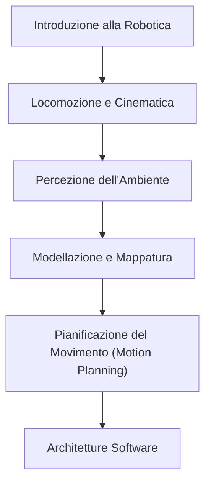
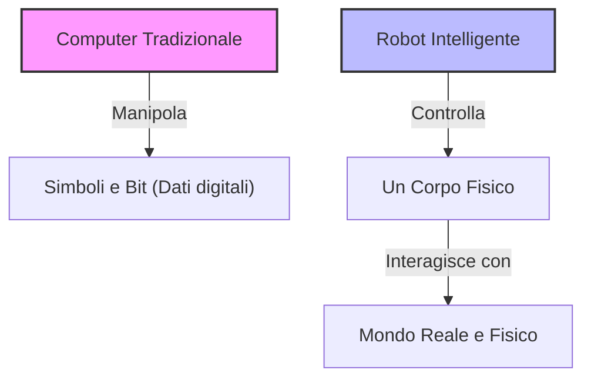
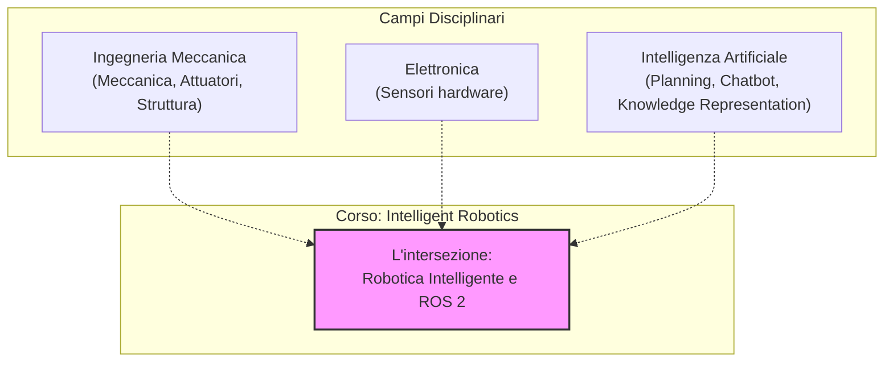
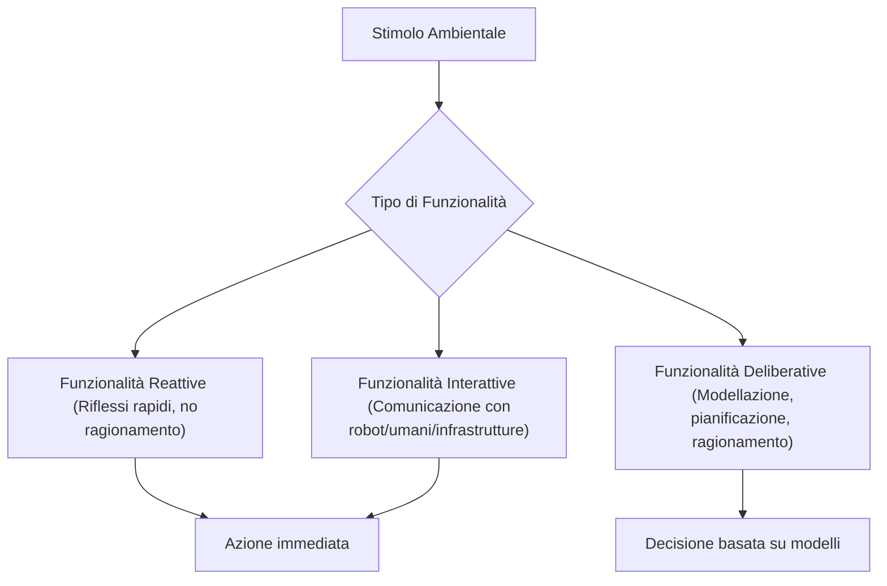

# Introduction to the Intelligent Robotics Course and IAS-Lab Laboratory Organization

## Educational Overview
This opening lecture introduces the **Intelligent Robotics** course and outlines the structure of the **IAS-Lab** (Intelligent Autonomous Systems Laboratory) research laboratory at the University of Trento, highlighting the different research areas of the involved faculty members: Computer Vision, Edge AI and Tiny Machine Learning (TinyML), Neurobotics, and Human-Robot Interaction (HRI). 

The primary focus of the course does not lie in the mechanical or hardware components, but rather in the **software stack** and the autonomous intelligent behaviors of mobile mobile robots. The teaching develops through the following key macro-themes:
- General introduction to robotics and modeling of movement and actuator commands.
- Environmental perception and mapping systems (Environment Modeling).
- Motion planning algorithms (**Motion Planning**).
- Software architectures for the orchestration of perception, planning, and control modules.
- Human-robot interaction issues (**Human-Robot Interaction**, HRI) arising from the transition of robots from isolated industrial environments to domestic and unstructured contexts ("*in the wild*").
- Corporate testimonials and seminars with startups and innovative companies in the robotics sector.

---

### Introduction to the course and teaching organization

Welcome to the **Intelligent Robotics** course. First of all, the course page has been opened on the University's Moodle platform (`stem.elearning.unitn.it`), titled *Intelligent Robotics 2627*. An access key is required to enroll: `iaslab`. 

This key directly references the **IAS-Lab** (Intelligent Autonomous Systems Laboratory), the reference research laboratory where the instructor collaborates with several colleagues whom you may have already met during your master's degree studies:
- **Professor Ridoni**: deals with the *Computer Vision* part applied to robotics.
- **Professor Nicola Bellotto**: focused on intelligent machines, particularly on artificial intelligence algorithms for small-sized robots with limited computational resources (*tiny machine learning*).
- **Professor Luca Zini**: active in the field of *neurobotics* (covered in an optional course), which studies how to interface the human body with devices by exploiting biological or muscular signals, both for assisting people with disabilities and for enhancing the capabilities of able-bodied users.
- **Professor Stefano Tortora**: deals with human-robot interaction, with particular attention to exoskeletons for supporting the mobility of people with motor impairments.

---

### Overview of Intelligent Robotics

The course focuses mainly on two key aspects: understanding what a robot is, what types exist, and above all, how to design its intelligence. The approach **will not** cover the mechanical or strictly electrical parts, but rather the **software component** and the autonomous intelligent behaviors necessary for the robot to achieve the goals set by the programmers.

The educational path will unfold through the following macro-themes:

1. **General introduction to robotics**: initial overview of robotic systems.
2. **Locomotion and kinematics**: understanding the different ways a robot can move in space and mathematical modeling of movement to generate the correct commands for the actuators.
3. **Perception**: how the robot perceives the surrounding environment. Just as driving a car requires paying attention to the road rather than looking at a smartphone, a robot needs sensors and perception algorithms for safe navigation.
4. **Environment modeling**: the ability to process sensory data to build a structured model of the surrounding space, going beyond mere instantaneous information.
5. **Motion Planning**: the family of algorithms that answers the question: *"Knowing where I am, how I move, and where I want to go, what is the optimal path to follow to reach the goal?"*.
6. **Software architectures**: the software infrastructure necessary to coordinate and orchestrate all the previous modules (perception, planning, and execution), continuously verifying that the plan is executed correctly and sending commands to the actuators in a closed-loop.

---

### Introduction to Modern Robotics and Human-Robot Interaction (HRI)

#### From the factory to the real world: the need for a software structure
Historically, robots operated in confined and rigorously structured environments. Until about 10-15 years ago, robotics was mainly divided into two categories:
*   **Industrial robots:** Mechanical arms relegated inside factories, physically isolated from human operators by safety cages for obvious safety reasons.
*   **Laboratory robots:** Systems confined in controlled research areas.

Today the scenario has radically changed. Robots are leaving laboratories and factories to enter unstructured environments (those defined in the community as *"in the wild"*), sharing space with people. A common example is represented by domestic robotic vacuum cleaners (such as Roombas). 

This change introduces complex challenges related to **Human-Robot Interaction (HRI)**. 
> **Key Concept:** A robot in a domestic environment does not possess human social or contextual awareness. It may, for example, mistake a person's legs for room furniture and try to clean around them right while the user is brushing their teeth, generating typical situations of unplanned interaction that modern robotics must learn to manage.

#### Historical evolution and the Robocup challenge
Since this is a master's degree course in Computer Engineering (and not a specialized degree entirely dedicated to robotics), it is not possible to divide the various topics (kinematics, perception, motion planning) into separate semester courses. An introductory overview will therefore be provided, exploring representative algorithms and approaches.

To understand the development of mobile robotics, the instructor cites the birth of **Robocup** (founded in 1998):
*   The provocative goal set by the founders was: *"By 2050, a team of humanoid robots will play soccer well enough to beat the human World Cup champions"*.
*   At the time (about 20 years ago), mobile robotics was considered a somewhat futuristic academic niche (often based on small wheeled robots confined in laboratories), and instructors questioned the usefulness of teaching concepts so far removed from the industrial market of the time.
*   Within a few years, with the advent of mass-market robotic vacuum cleaners, what seemed like a niche became a concrete economic reality. This suggests that emerging sectors such as *neurobotics* could represent the next major technological revolution.

---

### The Pillars of the Course and Introduction to ROS 2

The course relies on two fundamental pillars:
1.  **Theory:** Understanding what a robot is, how it works, the correct terminology, and distinguishing what is feasible from what is pure science fiction.
2.  **Practice (Programming):** Learning to program a robot from scratch using **ROS 2**.

#### What is ROS 2?
**ROS (Robot Operating System)** is commonly called an operating system for robots, but from a computer engineering perspective **it is not a real operating system**. 

Instead, it is a **middleware**: a software layer positioned between the low-level operating system of the onboard computer and the various sensors and actuators connected to the robot. 
*   **Function:** It offers communication, synchronization, and abstraction services that guide and simplify the development of robotic applications.
*   **Industry standard:** Almost every intelligent robot today uses ROS 2 (or proprietary implementations based on it).

> **Key Concept:** One of the main reasons for ROS's success is that **it enforces a modular and reusable programming style**. Through predefined modules and standardized communication interfaces, it forces the developer to write well-structured code.

*   **Language note:** During the course, ROS 2 will be used mainly with the **C++** language (although Python is also supported), offering students an excellent opportunity to improve or consolidate their C++ skills.

---

### Embodiment, Human-Robot Interaction, and Convergence between Artificial Intelligence and Robotics

Before getting to the heart of the technical content, the instructor provides some organizational information about the course. The official syllabus on the university portal temporarily presents a display problem (the page is reachable but the description is not visible), an issue that has already been reported to the competent offices. A brief initial survey is also proposed to map the courses already taken by students (in particular regarding *Artificial Intelligence* and *Computer Vision*) and identify the presence of Erasmus students, so as to best calibrate the starting level.

Regarding the schedule, classes are organized into three weekly appointments:
- Tuesday (morning)
- Wednesday (afternoon)
- Thursday (afternoon, right after lunch)

Thursday's session is dedicated to the laboratory part, focused on programming via **ROS (Robot Operating System)**, to put into practice what was learned during theoretical lectures.

---

### The Fundamental Divide: Robot vs Computer

> **Key Concept:** A robot **is not** a computer. 

Although most students are familiar with artificial intelligence applied to traditional software (such as language models or image manipulation), there is an abysmal difference between solving a problem inside a computer and solving it through a robot.

- **The computer manipulates symbols:** A digital image, for example, is composed of pixels encoded in bytes or data structures within memory. These are still numbers and bits. Software operates on abstractions and logical symbols, a domain in which computers excel.
- **The robot is a physically situated agent:** A robot has a body and must interact directly with the real physical world.

This difference introduces completely new software requirements and demands a total paradigm shift in design and programming.

### The Concept of *Embodiment*

Modern artificial intelligence systems (such as large language models developed by OpenAI or Anthropic) possess extraordinary reasoning capabilities and operate in the virtual world of the web. However, they **lack a body** (*disembodied*).

If an advanced disembodied artificial intelligence were to suddenly find itself controlling a robot's hardware, it most likely would not be able to make it work properly. The reason lies in the concept of **Embodiment**: robotic software must contend with physical constraints, kinematics, dynamics, friction, gravity, and the uncertainty of the real world.

### The Complexity of Interaction with the World and with Humans

Controlling a robot in a physical environment presents shades of difficulty that vary depending on the interlocutor:

1. **Interaction with inanimate physical objects (e.g., a ball):** If we throw a ball, its movement is governed by precise physical laws (such as gravity). The trajectory is predictable because, under identical initial conditions, the ball always behaves the same way. A robot can learn to catch it by exploiting mathematical models based on physical laws or by learning from experience (*machine learning*).
2. **Interaction with human beings:** Human beings are infinitely more unpredictable than the physics of a ball. When a robot must interact closely with people, the design challenge grows exponentially.

### The Convergence between Artificial Intelligence and Robotics

The course lies at the intersection of these two worlds, reflecting the structure of the *Artificial Intelligence and Robotics* curriculum. 

Historically, the two fields have developed in a partially separate way, but today we are witnessing a **strong convergence**:
- Artificial Intelligence increasingly needs a body (*embodied AI*) to act in the real world.
- Robotics draws enormous benefits from new and more powerful AI algorithms to handle complex tasks.

However, the two fields remain vast disciplines. For this reason, in future study plans, curricula will split in a more targeted way between pure AI and Intelligent Robotics, while maintaining a strong mutual contamination: those who study robotics will continue to delve into advanced fundamentals of artificial intelligence, given their indissoluble complementarity in modern systems.

---

### The Scope of the Course: Robotics and Artificial Intelligence

Before diving into programming, it is essential to clarify which topics we will cover in this course and which we will not, drawing the boundary between traditional robotics and artificial intelligence (AI).

Often, online videos of humanoid robots dancing or tackling the 100-meter dash generate a lot of hype. In reality, behind these performances lies much less intelligence than it seems:
- **Dancing humanoid robots** do nothing more than reproduce a pre-planned sequence of movements, exactly like an industrial robot arm in a factory that inserts components or moves pieces on a conveyor belt. They are not significantly more "intelligent" than industrial robots.
- The famous **robot that runs 100 meters** and ends up crashing into the foam barrier is not programmed to recognize the end of the track or avoid unexpected obstacles. It simply executes a command to run as fast as possible, perhaps exploiting very low-level closed-loop control, but without any high-level reasoning capability regarding the structure of the environment.

As illustrated in the diagram, the course focuses exclusively on the **overlap area** between Robotics and AI:
- **What we will NOT do:** We will not study the mechanical design of robotic bodies or the hardware development of sensors (tasks belonging to our colleagues in mechanical and electronic engineering), nor will we address classic artificial intelligence topics such as complex scheduling, knowledge representation, or chatbot development.
- **What we WILL do:** We will focus on what makes a robot *intelligent* and on its practical programming through the ROS 2 (Robot Operating System 2) ecosystem.

---

### Terminology and Exam Modalities

A primary objective of the course is the acquisition of the **correct technical lexicon**. 

> [!IMPORTANT]
> **Key Concept: Scientific Terminology**
> During the exam, a very relevant part of the evaluation will consist of the student's ability to speak about robotics using appropriate terms rigorously. Knowing how to define what a robot, an artificial intelligence, a map, a path, or a motion planning algorithm is, is fundamental.

The course teaching staff is supported by three Teaching Assistants: Anna Polato, Mattia Crociani, and Tommaso Fortezza, who will guide students during the practical programming sessions with ROS 2.

---

### Evolution of the Exam Format and Impact of Artificial Intelligence

In past years, with classes formed by a relatively small number of students (up to 6-7 years ago), laboratory exercises were performed directly on **real robots**. Subsequently, due to the drastic increase in enrollments (jumping to 100-120 and reaching about 180 students this year), the course became *compulsory* and activities moved to **simulated robots** via ROS 2.

Until last year, the exam included a written theory test and a laboratory project to be developed at home. However, this approach has been thoroughly reconsidered due to recent technological progress.

> [!IMPORTANT]
> **Key Concept: The Impact of Large Language Models on the Exam**
> With the public release of tools like ChatGPT by OpenAI in 2022, and subsequently advanced coding assistants like Claude or GitHub Copilot, evaluation dynamics have changed radically. Today these systems are able to solve homework assignments in seconds by directly reading instruction PDF files.

Proceeding with the old exam mode presented three unsustainable problems:
1. **Waste of time for students:** Copying and pasting assignments into an artificial intelligence does not stimulate real learning.
2. **Uselessness for instructors:** Evaluating code written by artificial agents instead of students loses its educational meaning.
3. **Environmental impact:** Generating code via LLMs for tasks that the student does not understand consumes resources and energy uselessly.

#### The New Laboratory Exam Structure
To overcome this problem, it was decided to eliminate the home project as an exam deliverable and introduce an **in-person laboratory exam**:
- The test will take place in a secure computer lab.
- The environment will be **completely unplugged** (without internet connection and isolated from any external intelligent agent).
- Students must write code autonomously to demonstrate the acquired skills.

---

### Homework Management and Learning Strategy

To reach the level of competence required to pass the exam in a protected environment, weekly lectures alone are not sufficient. For this reason, homework assignments are regularly assigned.

The incentive system for homework is structured as follows:
- A total of **4 homework** assignments are given during the semester.
- Each completed homework guarantees an increase of **$+0.25$ points** on the final grade, up to a maximum of **$+1.0$ extra point** if all are submitted.

However, an ethical and practical reflection on the use of AI naturally arises: *is it worth having artificial intelligence do the homework to get that extra point?*
- If AI agents are used to do the homework without understanding the code, no practical competence will be developed.
- Consequently, finding oneself in the classroom during the exam without the support of intelligent tools runs the serious risk of failing the test.

The extra point is a minimum incentive designed to reward constant effort, but the true value lies in autonomous exercise. Regarding the explicit use of AI in completing homework assignments, the educational approach leaves room for reflection: *it is possible (or tolerated) to use artificial intelligence, as long as the student uses it as an active learning tool, striving to understand and internalize the generated concepts, and not as a simple automatic code generator.*

---

### Reactive and Deliberative Functionalities in Robots

The organization of robotic software can be divided into functional macro-categories, which reflect how the system processes stimuli and plans actions. 

*   **Reactive Functionalities (Reactive Intelligence):** These concern the intrinsic intelligence linked to the direct interaction between sensors, the environment, and the robot's body, without the need for superior cognitive reasoning. These are immediate responses to external stimuli, characterized by high execution speed.
    *   *Biological example:* When we accidentally touch boiling water, the unconditioned reflex activates the circuits of the peripheral nervous system and muscles, causing the finger to withdraw *before* the thermal signal even reaches the brain and the danger is consciously realized. Realization ("it was too hot") happens post-facto, when the danger has already been avoided.
*   **Deliberative Functionalities:** These require reasoning processes, planning, and the construction of a world model. This category includes complex activities such as:
    *   Environmental localization and mapping.
    *   Motion and path planning (*motion planning*, *path planning*).
    *   Structured decision-making (e.g., deciding how to steer to avoid a complex obstacle).
*   **Interactive Functionalities:** These manage the exchange of information between the robot and other agents, which can be other robots, the surrounding infrastructure, or human beings.

---

### Professional Value of Robotic Skills in the Labor Market

Skills related to robotics and robotic systems programming (such as the use of ROS / ROS 2) represent an added value of great significance in the current job market. 

*   **Market and Investments:** The robotics sector goes through periodic cycles of strong media and industrial attention (ranging from mobile robots to humanoid systems and soft robotics). Global investments in this field are constantly growing.
*   **Career Prospects:** Knowing how to develop complex software for robots is a skill highly appreciated by companies. This translates into high demand for qualified robotic engineers and generally very advantageous salary levels.

---

### Preparation for the ROS 2 Laboratory and Study Recommendations

#### Introduction to the Laboratory and Objectives of ROS 2
The practical part of the course focuses on programming robots starting from the basics, using **ROS 2 (Robot Operating System 2)**. 

As a historical reminder, ROS 1 reached the end of its official support several years ago, making ROS 2 the current reference standard. Compared to its predecessor, ROS 2 introduces important new features:
- It is designed to be more modular.
- It offers advanced features previously absent.
- However, it presents a slightly steeper learning curve and heavier, more verbose code structure. Nevertheless, the use of today's support tools (such as AI-based copilots) significantly simplifies code writing.

Through the study and use of ROS 2, you will learn to:
- Manage communication between robots, sensors, and internal software modules.
- Process data coming from sensors.
- Exploit existing libraries for navigation, manipulation, simulation, and visualization.

#### Structure of the Practical Course and Resources
- **Calendar and Lectures:** A calendar with specific learning objectives for each laboratory session will be provided.
- **Open Lab:** Open laboratory moments are planned where students can go to the classroom to receive support from tutors and teaching assistants to solve programming problems or code doubts.
- **Exercises and Homework:** Homework assignments are individual and **non-mandatory** (failure to submit entails a penalty of only one point out of 33). However, the instructor strongly recommends doing them, as they represent the main tool to reach the level required for the exam.

#### Methodological Suggestions for the Laboratory
The instructor provides some fundamental recommendations to successfully tackle the practical part:

- **Do not skip laboratories:** Tackling the ROS ecosystem autodidactically starting from scratch can be extremely dispersive and confusing. Following the structured guidance in the laboratory makes learning much more accessible.
- **Conscious use of Artificial Intelligence and teamwork:** 
  - AI (such as GitHub Copilot or Codex) and course colleagues ("natural intelligence agents") can be consulted to overcome programming blocks and improve one's skills.
  - *Key Concept:* It is essential **not to entirely delegate** code writing to AI or peers. The goal is to learn to program firsthand; delegating means losing the opportunity to acquire a professional skill set highly sought after by the market.
- **Constant practice:** Programming is like sports; it requires daily and constant exercises to become proficient.
- **Official communication channels:** For any technical problem (e.g., ROS installation errors), **do not send emails to instructors**, but use the dedicated **laboratory forum** on the Moodle platform (distinct from the official announcements forum). This allows creating a shared board where students and tutors can answer and help each other reciprocally.

---

### Communication Guidelines and Support for the Course
- **Official communication channels:** For any technical or theoretical doubt, **do not** send emails to either the instructor or the teaching assistant. You must strictly use the laboratory forum.
- **Advantages of the forum:** 
  - It allows giving a public response visible to everyone, simultaneously solving the problem for multiple students.
  - It leverages collective collaboration: a classmate may have already encountered and resolved the same problem an hour earlier, providing support in a few minutes.
- **Autonomous resolution (Troubleshooting):** The provided installations are stable. Before asking for help, it is good practice to perform some troubleshooting independently, as the course team cannot handle continuous reinstallations or configurations from scratch.

---

### Introduction to ROS 2 (Robot Operating System 2)
The use of the Long-Term Support (LTS) distribution of **ROS 2** is introduced. During lectures, we will follow the official documentation as closely as possible to facilitate review and autonomous understanding of basic concepts.

#### What ROS is (and what it is not)
Confusion often arises regarding the nature of ROS. To understand what it is, it is useful to start from what it **is not**:
- **It is not an Operating System:** It does not directly manage low-level hardware like a Linux kernel would.
- **It is not a programming language:** You can write ROS nodes in C++, Python, etc., but ROS itself does not define a new syntax or language.
- **It is not just a library:** It offers much more than a simple set of functions to import.

> **Key Concept:** **What is ROS actually?** 
> ROS is a **middleware**. A middleware is a software infrastructure that sits between the operating system and applications, facilitating communication and offering a standardized development framework. In addition to communication libraries, ROS provides fundamental tools for developing and debugging robotic applications, such as **Rviz** and **Gazebo**.

#### Why use ROS?
- **De facto standard:** It is not an official ISO standard recognized by the International Organization for Standardization, but it is the environment universally adopted globally in the research and industrial robotics world.
- **Origin and community:** Initially born in the academic and research community as open-source software, it grew enormously year after year thanks to its modularity. Subsequently, the Open Source Robotics Foundation (OSRF) was born, and companies began adopting it.
- **End of "reinventing the wheel":** Before ROS, every laboratory in the world had to develop code from scratch for:
  - Motor control boards
  - Proximity sensor and encoder readings
  - Navigation, motion planning, and reasoning
  Thanks to ROS's strong modularity, today it is possible to take code written by third parties for motor control and focus solely on the part of one's interest (e.g., robotic perception), making software written by people who don't even know each other interact.

---

### Installation and Environment Configuration

#### Choice of Operating System
ROS 2 is cross-platform, but offers the best performance and greatest stability under **Linux** (specifically, the **Ubuntu** distribution is suggested).

Recommended installation methods, in order of preference:
1. **Dual Boot (Recommended):** Install Linux natively alongside the other operating system to exploit hardware resources 100%.
2. **Container or Virtual Machine:** Useful on Windows (where things work reasonably well anyway). On **macOS**, using a virtual machine is quite slow, so it is discouraged unless you own an extremely powerful computer.

#### Using Departmental Laboratory PCs
If your PC is not powerful enough or you encounter configuration problems, you can use the department computer labs. 
- *Bottleneck warning:* Full simulations with environments like **Gazebo** are computationally very heavy. Laboratory PCs might suffer under this load.
- *Support note:* The course team is not responsible for any malfunctions of the laboratory infrastructure (managed by University technicians). Instructor and tutor assistance only covers problems related to ROS code and not network or laboratory machine outages.