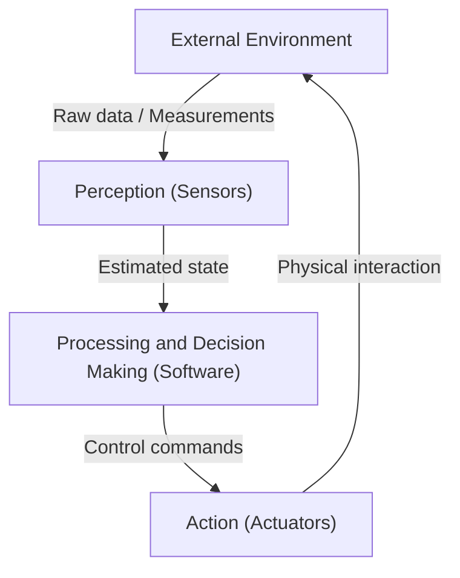
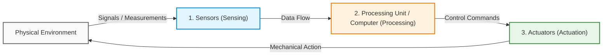
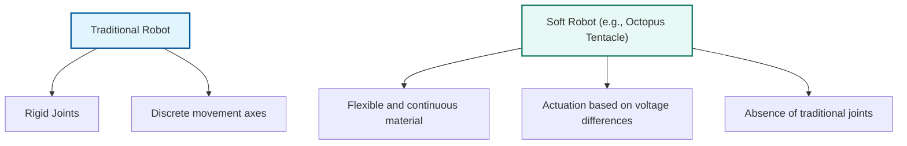
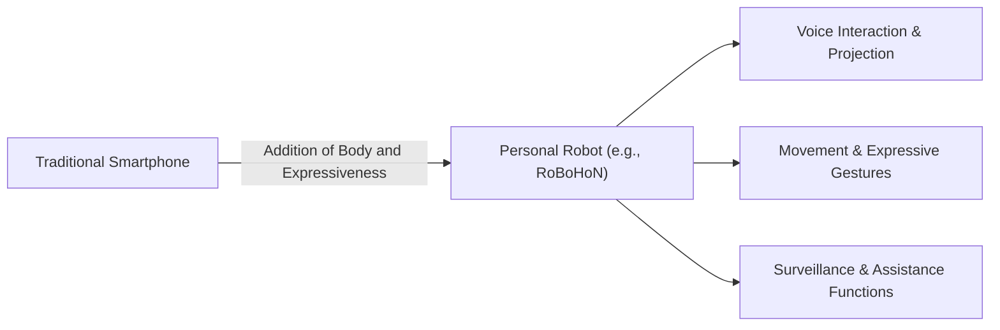
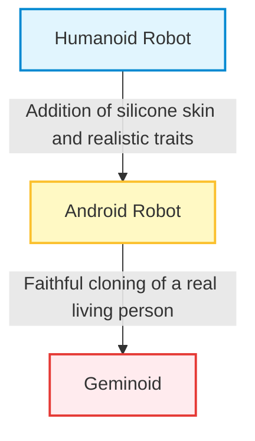
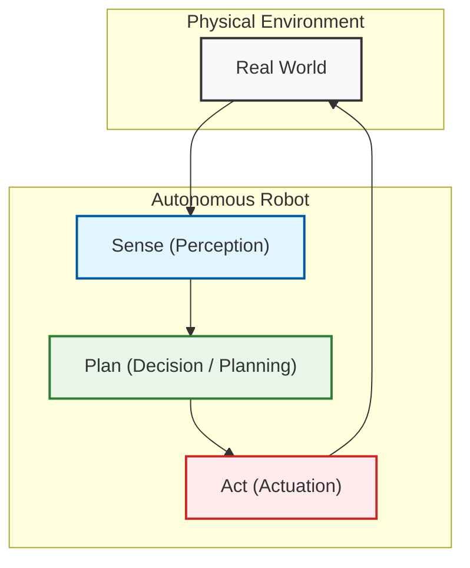

# Introduction to Robotics and Course Organization

## Didactic Overview
This lecture introduces the fundamental concepts of robotics and provides a historical overview of the evolution of robots, starting from ancient myths up to modern intelligent systems. Important practical guidelines are also provided regarding the course organization, the use of the GitHub platform for homework submission, and the methods for accessing laboratory environments using ROS 2 (Robot Operating System 2).

### Key Concepts
- **Multidisciplinary Nature of Robotics**: Robotics combines mechanics, actuation, sensing, and software engineering. This course focuses in particular on the **software** and intelligent control aspects.
- **Definition of Robotics**: The science that studies the intelligent connection between **perception** and **action**, enabling an autonomous machine to react and modify its behavior based on the surrounding environment.
- **Historical Evolution**: 
  - 1960s: First computer-controlled robots.
  - 1970s: First industrial robots in factories for heavy or hazardous tasks.
  - 1980s: Introduction of the concepts of perception and autonomous agents.
  - 1990s: Spread of robots outside factories (service and field robots).
- **Laboratory Tools**: Use of ROS 2, terminal-based control on remote virtual machines, and source code management via **Git/GitHub**, considered a fundamental standard also for drafting an engineering CV.

---

### Introduction to the Course and Laboratory Tools

#### Organization and Soft Skills
Robotics is a broad discipline that intersects with various fields of engineering. Within the study path, this course focuses on **intelligent robotics**, **service robots**, and **field robots**, distinguishing itself from the classical treatment of industrial automation alone. To ensure a common foundation for all students, a specific introductory lecture dedicated to **industrial robots** will nevertheless be provided.

Recommended complementary courses to complete the profile:
*   *Industrial Robotics* and *Robotics and Control 1* (for the basics of kinematics, dynamics, and manipulator control).
*   *3D Data Processing*.
*   *Neurorobotics*.

#### Software Environment: ROS 2 and Git
Practical activities are based on the use of:
*   **ROS 2** (*Robot Operating System 2*): the de facto standard middleware framework for robotic software development. The environment is available either through a local installation on laptops or via Ubuntu-based virtual machines running on department servers.
*   **Git / GitHub**: a Version Control System used for assignment submissions and code management, a fundamental tool for collaboration and the professional presentation of software projects.

---

### What is Robotics?

Robotics is the science that studies how to design and build machines capable of replacing or assisting humans in performing specific tasks, particularly when the operating environment is **hazardous**, **hostile**, or when the work proves **too heavy or grueling**.

A modern robot is not simply a remotely teleoperated **end-effector**: the fundamental goal of intelligent robotics is to equip the machine with a degree of **decision-making autonomy**, allowing it to operate independently in the real world.

#### A Multidisciplinary Science
To build a physical autonomous robotic system, the integration of four fundamental pillars is necessary:
1.  **Mechanics**: the physical structure and kinematics of the robot.
2.  **Actuation**: motors and transmission systems to generate movement.
3.  **Perception / Sensing**: sensors to measure the internal state of the machine and the properties of the surrounding environment.
4.  **Control Software and Intelligence**: algorithms to process sensory data, plan actions, make decisions, and coordinate actuation.

> **Course Perspective:** The adopted approach is predominantly oriented towards **software** and **information processing**, focusing on how to transform sensory data into intelligent behaviors.

---

### Historical Evolution of Robotics

The idea of building anthropomorphic machines or autonomous artificial entities has its roots in ancient mythology and literature. However, as a scientific and technological discipline, modern robotics has developed over the last sixty years:

*   **1960s:** Birth of the first prototypes of computer-controlled robots as independent machines.
*   **Late 1970s:** Introduction of the first true industrial robots in factories. Robotics established itself mainly as a technology for **rigid automation**, employed to replace humans in the most repetitive, dirty, and risky tasks on assembly lines.
*   **1980s:** Conceptual transition from classical automation to **intelligent robotics**. The robot ceases to be a mere blind executor of predetermined trajectories and becomes an **autonomous agent** equipped with sensors.
*   **1990s onwards:** Transition of robots out of structured factory environments into unstructured environments (service robotics, space exploration, autonomous vehicles).

---

### The Modern Definition: The Perception-Action Loop

Starting from the turning point of the 1980s, the formal definition of robotics has consolidated around active interaction with the environment:

> **Key Concept: Definition of Robotics**  
> Robotics is the science that studies the **intelligent connection between Perception and Action** (*Perception-Action loop*).  
> An intelligent robot does not limit itself to repeating preset command sequences, but:
> 1.  **Perceives** the state of the world through sensors.
> 2.  **Reasons / Processes** the measured data.
> 3.  **Acts** by actively modifying its own behavior and the environment in response to what happens.

---

### Evolution of Robotics: From the Factory to the Real World

Traditionally confined to structured and controlled environments of industrial production lines, modern robotics is expanding into unstructured contexts (*in the wild*), tackling the complexity of the real world. This transition has given rise to two macro-application categories:

*   **Service Robotics:** Systems designed to assist human beings and improve their quality of life, operating predominantly in indoor environments. Typical fields include home cleaning (e.g., robot vacuum cleaners), personal assistance, healthcare, and proximity logistics (goods delivery).
*   **Field Robotics:** Mobile robots designed to operate in complex and dynamic outdoor environments, such as precision agriculture, environmental monitoring, space exploration, or search and rescue missions.

---

### Architectural and Functional Definition of a "Robot"

In formally defining what a robot is, it is not enough to describe its autonomous behavior or its simple physical interaction with the environment. 

For example, a purely mechanical device such as a **pantograph** transmits movement from one end to the other: it possesses a mechanical input "sensing" interface and an output "actuation" interface, but it is not a robot because it completely lacks an intermediate calculation and decision-making element.

> **Key Concept: The Fundamental Triad of the Robot**  
> A robot is an autonomous or semi-autonomous cybernetic/mechatronic system defined by the presence and interconnection of three essential modules:
> 1. **Sensors (Sensing):** Devices that acquire data on the internal state of the system and the surrounding environment.
> 2. **Processing Unit / Computer (Processing & Control):** The computational infrastructure (hardware and software) that processes sensory information, executes decision-making algorithms, plans trajectories, and generates control commands.
> 3. **Actuators (Actuation):** Mechanical organs, motors, or drive systems that transform computational commands into physical actions in the environment.

---

### Origins of the Term and Cultural Influence

Unlike many engineering disciplines, robotics did not originate within scientific laboratories, but rather in literature and drama.

#### Etymology: *R.U.R.* and Karel Čapek (1920)
The term **"Robot"** was introduced for the first time in 1920 by the Czech writer and playwright **Karel Čapek** in his play *R.U.R. (Rossum's Universal Robots)*. 
*   The word derives from the Czech term **"robota"**, which literally means *hard labor*, *corvée*, or *servile/forced labor*.
*   In the play, robots were artificial organic entities created to replace human beings in the most tiring and alienating factory work, freeing man from the slavery of manual labor.

#### The Impact of Science Fiction (Sci-Fi)
The collective imagination (from cinematic characters like *R2-D2* or *C-3PO* from Star Wars to Isaac Asimov's novels) continues to exert a strong influence not only on the public, but also on the scientific community. Researchers often draw inspiration from the anthropomorphic and cooperative paradigms of science fiction to conceive new architectures, shapes, and functionalities for real robots.

---

### Real Robotics: The Predominant Role of Industrial Robots

Although the public imagination is populated by humanoid or assistive robots, from an economic, commercial, and technological maturity standpoint, the sector is historically and quantitatively dominated by **industrial robots**.

*   **Industrial Actors and Standards:** Major international manufacturers (such as ABB, KUKA, FANUC, Yaskawa) generate the predominant share of the sector's revenue.
*   **Structural and Application Typologies:**
    *   *Rigid serial manipulators:* Articulated arms with high precision, repeatability, and speed, used for welding, painting, and heavy material handling in cells isolated by safety barriers.
    *   *SCARA Architectures (Selective Compliance Assembly Robot Arm):* Robots that are rigid along the vertical $z$-axis and compliant on the horizontal $xy$-plane, ideal for rapid *pick-and-place* and assembly operations.
    *   *Collaborative Robots (Cobots):* Newer systems (such as *ABB YuMi* or *Universal Robots UR10*) designed with advanced torque/force sensing to work in close contact with human operators without physical barriers.

While industrial robots excel in efficiency, precision, and robustness in rigidly structured environments, they present evident limitations when they have to adapt to dynamic and unpredictable scenarios, paving the way for the challenges of mobile and autonomous robotics.

---

### From Industrial Robots to Mobile Robots: Limitations and Flexibility

The main limitation of traditional industrial robotic arms lies in the fact that they are bolted to the ground (*fixed to the ground*). This fixed configuration entails evident operational constraints:
- **Limited workspace:** They can only operate within a certain circumscribed area.
- **Rigid planning:** The path and motion are entirely pre-planned in advance.
- **Absolute spatial reference:** Since the base is immobile, there is a fixed Cartesian reference system centered on the origin of the base itself. This makes it easy to calculate the exact position of the end tool in space.

Conversely, **mobile robots** offer enormously superior flexibility. They can move around in the surrounding environment, adapt to unforeseen events (such as moved furniture or the presence of people), and dynamically change their path to complete the assigned task. However, this requires much more control software complexity compared to industrial robots.

#### The Phenomenon of Humanoid Robots
A separate discussion is warranted for **humanoid robots**. They currently represent a very popular technology with great media impact, but they are not yet fully mature for effective industrial use. An emblematic example cited in the lecture concerns the automotive company BMW, which purchased some humanoid robots to integrate them into its production lines only to return them after a few months because they were not sufficiently efficient. Conversely, mobile robots (such as robot vacuum cleaners) now represent a consolidated economic reality and a global mass market.

---

### The Universal Definition of Robot

Regardless of shape, bodily structure, or the various technologies employed, it is possible to formulate a shared definition that encompasses the nature of all these machines. 

> **Key Concept:** A **robot** is an actuated mechanism, programmable in two or more axes, endowed with a certain degree of autonomy, that moves within its environment to perform an intended task.

Let us analyze the key points of this definition:
1. **Programmable:** The robot must have a computer or microprocessor to process data, manage information, and execute a software program.
2. **Autonomy:** It does not simply and passively repeat a rigid mechanical sequence, but possesses a certain level of decision-making autonomy.
3. **Movement:** It must have actuators to move (even in the case of industrial robots, where the base is fixed but the body moves in the surrounding space).

---

### Analysis of Everyday Cases: The Washing Machine and the Autonomous Car

To better understand the boundaries of this definition, the lecturer analyzes two examples taken from everyday life: a washing machine and an autonomous car.

#### 1. The Washing Machine (Modern)
A modern washing machine is a complex appliance:
- **Is it programmable?** Yes, it allows selecting different wash programs via an integrated microcontroller or microprocessor.
- **Is it autonomous?** In part. Basic functions such as loading a fixed amount of water (e.g., 5 liters) or heating it up to a certain threshold (e.g., $40^\circ\text{C}$) fall under simple **automation**. However, more advanced models show true **autonomy** when they adapt behavior based on external conditions: for example, weighing the load of clothes to automatically calibrate the amount of water, or detecting the dirt level to adjust the detergent dosage.
- **Does it move?** Yes, it moves the objects inside it through the rotation of the drum.
- **The axes problem:** Despite programmability and a degree of autonomy, **the washing machine is not a robot**. The main reason is that it possesses **only a single axis of actuation** (drum rotation), whereas the definition requires two or more axes.

#### 2. The Autonomous Car
An autonomous car is instead fully classified as a robot. Let us verify the requirements:
- **Is it programmable and does it have an onboard computer?** Yes, it runs complex software in real time.
- **Is it autonomous?** Yes, by definition.
- **Does it possess two or more axes of actuation?** Absolutely yes. The movement architecture requires at least two main degrees of freedom:
  1. Speed control via the pedal (which regulates wheel thrust).
  2. Direction control via the **steering wheel**, which manages the steering axis.

---

### Practical Applications, Limitations of Definitions, and Fields of Robotics

Continuing the discussion on robotic systems, the professor analyzes the nuances and application boundaries of the definitions given so far, introducing key differences between various types of robots and their applications in the real world.

#### Limitations of Engineering Definitions

Every definition or abstraction has intrinsic limits. Take the case of an autonomous car: we commonly think that the engine controls speed by turning the wheels, but there is a second actuated axis, namely the steering wheel. It is precisely thanks to this second degree of freedom that we consider the car a robot.

But what about a driverless train like those on the subway? Is it a robot? 
- On one hand, it lacks the ability to choose its steering because it is constrained by railways. 
- On the other hand, excluding it from the category of robots solely for this reason seems forced, since it performs autonomous transport tasks entirely analogous to them.

Another example that tests traditional definitions is **soft robotics**. 

A robot made of flexible material that contracts under the effect of a voltage difference — like an octopus robot — possesses neither single joints nor traditional mechanical axes. Yet, to all intents and purposes, it is a robot. 

The lecturer's conclusion is practical: *engineering definitions serve because they are useful*, but we must maintain a certain flexibility of understanding. Despite these exceptions, for the vast majority of systems the standard definition based on the three fundamental elements remains valid.

#### The Three Key Elements of a Robot
To recap, for a system to be defined as such, it must integrate three essential components (whether they are artificial or even biological in nature, i.e., derived from living tissues):
1. **Sensors**
2. **Actuators**
3. **Information processing**

This is why robotics is a markedly **multidisciplinary** science. In computer engineering and automation, for instance, practically everything studied in the curriculum is leveraged:
* Real-time operating systems, crucial because the robot is a physical agent embedded in the environment and must react in real time to changes.
* Dedicated programming languages.
* Big Data algorithms to extract information from the environment.
* Artificial Intelligence (AI) and Machine Learning techniques.
* Perception processing, such as Computer Vision and three-dimensional ($3D$) data processing.

---

#### Industrial Robots vs. Field and Service Robots

A fundamental distinction concerns the operational context of the robot:

* **Industrial Robots:** Work in a *structured environment*, meaning a known environment engineered in advance to simplify the robot's tasks (e.g., assembly lines).
* **Field and Service Robots:** Work in *unstructured environments* or environments only partially modified. In these contexts, perception and decision-making become much more critical, as the robot must exhibit a significantly higher level of autonomy.

##### Examples of Field and Service Robotics:
* **Mars Rovers:** 
  - *In the early years:* Rovers were not autonomous. NASA engineers used a scaled Martian photographic map and a toy robot of the same size on Earth. They found a rock-free path, calculated commands, and uploaded them to the Martian robot, which executed them with minimal autonomy (checking only wheel slip).
  - *Today:* Modern Rovers are much more autonomous: they can detect obstacles independently and even decide which rocks are most interesting to analyze.
* **Robots for hazardous environments:** Used in simulated industrial contexts to close valves or detect alarms (often advanced quadrupedal robots capable of even standing up on two legs).
* **Domestic robots:** Such as robot vacuum cleaners (Roomba) or robotic lawn mowers, pool cleaners, and gutter-cleaning devices.

---

#### Medical Robotics

A separate sector is represented by **medicine**, where, however, **autonomy is not permitted** due to high risks, legal responsibilities, and insurance.

> **Key Concept:** When we hear on the news that a patient has been operated on by a *surgical robot*, we must not think that the machine makes decisions or cuts autonomously. The robot is entirely guided by a human surgeon.

A famous example is the **Da Vinci Robot**:
* The surgeon sits in front of a virtual reality display showing the patient's interior in $3D$.
* Through two advanced manipulators (similar to joysticks), the surgeon controls the microscopic instruments inside the body.
* **The robot's role:** It performs no autonomous movements (avoiding the risk of accidentally severing a blood vessel). It merely replicates the surgeon's movements while introducing two fundamental advantages:
  1. *Scaling:* A large movement by the doctor is reduced to a microscopic level, enabling precision impossible for the human hand.
  2. *Movement filtering:* The robot eliminates the natural micro-tremors of even the most expert surgeon.

The lecture closes by hinting at other rapidly growing applications, such as **educational robots** (which have been actively researched for over 15 years) and an increasingly wide range of domestic robots for home care.

---

### Personal and Assistive Robots

The fundamental idea of the **personal robot** is the realization of a companion robotic agent, a sort of assistant or butler capable of supporting us in daily life and simplifying everyday activities.

Despite the appeal of the concept, the commercial market has presented an enormous challenge for these technologies:
* Numerous companies have attempted to commercialize companion robots (such as the famous *Nao* and *Pepper* by SoftBank Robotics, or Sony's robotic dog *AIBO*), facing frequent commercial failures, production halts, or very limited sales.
* An emblematic example of this paradigm was **RoBoHoN** (developed by Tomotaka Takahashi in Japan): a hybrid device halfway between a smartphone and a miniaturized humanoid robot. RoBoHoN integrated mobile telephony functions, an intelligent voice assistant, an autonomous camera, and even an integrated projector/beamer to show images or video, communicating notifications through gestures and body expressions.

Beyond pocket-sized devices, the development of service robotics has shifted towards **assistive robots**: systems designed to remain inside the home with tasks of advanced cleaning, autonomy support, and monitoring of elderly people living alone.

---

### From Humanoid to Geminoid: The Spectrum of Anthropomorphism

Research on assistive and companion robots unfolds along a spectrum of morphological and aesthetic complexity based on the level of fidelity to the human appearance:

1. **Humanoid Robot**: Features the generic body structure of a human being (typically a head, two arms, and two legs or a mobile base), but maintains a clearly mechanical/robotic appearance.
2. **Android Robot**: Designed to be indistinguishable from a human being. It uses silicone coverings to simulate skin and reproduces proportions, facial micro-expressiveness, and biological movements with extreme precision.
3. **Geminoid**: Represents the extreme of this spectrum. It is the exact replica, cloned in physical features and voice, of a specific real living person (a concept introduced and developed primarily by Prof. Hiroshi Ishiguro of Osaka University).

#### Scientific Motivations: Human-Robot Interaction and Embodiment

The construction of androids and geminoids does not merely serve application or telepresence purposes (such as sending one's robotic clone to give lectures or conferences remotely), but constitutes a true research platform for neuroscience, cognitive psychology, and **Human-Robot Interaction (HRI)**.

> **Key Concept: The Embodiment Theory in Natural Interaction**  
> The evolution of the human brain has structured itself over millions of years around communication between similar bodies. Consequently, the most natural interface for interacting with complex technology is not represented by keyboards, mice, or touchscreens, but by **language combined with bodily presence (*Embodiment*)**.  
> Facial expressions, gazes, micro-movements of the head, posture, and hand gestures convey a fundamental amount of information: an intelligent agent equipped with an anthropomorphic body stimulates the exact same cognitive and empathetic circuits in our brain that are activated during communication between human beings.

These models allow us to investigate how the human mind perceives artificial intelligence when it assumes the appearance of a real individual, analyzing issues related to awareness, anthropomorphism, and the social acceptance of machines.

---

### New Frontiers: Autonomous Mobility and Intelligent Transport Systems

In recent years, the boundaries of robotics have expanded to encompass sectors traditionally pertaining to transportation engineering and mechanical engineering. 

**Intelligent Transportation Systems (ITS)**, initially focused on the simple sensorization of trains and rail infrastructure, are today effectively a cutting-edge branch of applied robotics:

* **Autonomous Driving:** Autonomous vehicles are no longer considered mere mechanical systems, but full-scale mobile robots. The dominant architecture of these systems requires advanced computer engineering and electronic engineering skills: multi-modal perception via sensors (LiDAR, Radar, cameras), Simultaneous Localization and Mapping (SLAM) algorithms, trajectory planning, and real-time control systems.
* **Micro-mobility and Intelligent Wheelchairs:** Development of robotic platforms for indoor and outdoor individual transport (particularly widespread in Asian research contexts). The user can simply indicate the destination (e.g., *"take me to the library"*) and the autonomous chair plans the path while avoiding dynamic obstacles, representing a valuable support both for people with motor disabilities and for general comfort.
* **Autonomous Flying Taxis:** Electric Vertical Take-Off and Landing (eVTOL) aerial systems guided by autonomous controllers for urban passenger transport.

---

### Exoskeletons and Robot Taxonomy

Before concluding the overview of different types of robotic systems, a special mention must be made of exoskeletons. These are not simply robots that surround us, but devices physically attached to the human body. They find use both in the medical field, to give people with disabilities the ability to walk again, and in the industrial field, to support workers and reduce physical load on limbs, preventing injuries and physical damage.

Given the vast landscape of robots encountered in different fields, it is possible to trace a taxonomy based on various viewpoints:

*   **Mobility:** A distinction is made between **mobile robots**, capable of moving on floors, agricultural terrain, in the air, underwater, or even on other planets, and fixed robots.
*   **Capabilities and Applications:** 
    *   *Manipulation robots:* Typically industrial robots, designed to manipulate objects and produce goods, or service robots equipped with mechanical arms to assist users.
    *   *Degree of autonomy:* They can be fully autonomous or **teleoperated**, meaning controlled from a distance by a human operator who leverages video streams from sensors and interfaces (often haptic) to send commands via joystick.

---

### The Classical Loop: Sense-Plan-Act

Despite enormous differences in perception and actuation modalities and movement algorithms, all autonomous robots share a fundamental operating principle, represented as a closed-loop on the environment. This scheme is named **Sense-Plan-Act (SPA)**.

1.  **Sense (Perception):** The robot acquires information from the surrounding environment through sensors.
2.  **Plan (Planning):** Processing capabilities analyze perceptual data to decide which commands to send.
3.  **Act (Actuation):** Actuators execute commands (e.g., rotate a wheel, move a joint).

---

### Limitations of the Sense-Plan-Act Paradigm and Real-World Uncertainty

The *Sense-Plan-Act* paradigm works remarkably well in controlled and known environments. A classic example is the game of chess: the state space is totally known, objects are mapped into symbols (the rook, the knight), and the rules are rigid (a typical Good Old-Fashioned AI approach).

However, when the robot operates in the real world, this classical scheme shows strong limitations due to three critical factors:

*   **Actuation Uncertainty:** We cannot take for granted that actuation will succeed. For example, if a Mars robot has wheels slipping on sand or sinking, the control system will think it has moved a certain distance, whereas in reality it has stayed still. The same applies to friction or slipping issues on ice.
*   **Perception Uncertainty and Symbol Grounding:** Translating real physical objects into symbols (*symbol grounding*) is not trivial. Is a moving object a cat or a large rat? Is a silhouette a horse or a zebra? Added to this is the intrinsic noise of sensors, meaning measurements are never perfectly identical or error-free.
*   **Human Interaction:** The human presence makes the environment intrinsically unpredictable. Often, human beings do not merely act within the environment, but directly interact with the robot, interfering with its actions or sending it commands. The robot must understand whether to blindly execute the command or interpret it based on context.

To cope with all these critical issues, the control software architecture requires much more complex architectures than the simple *Sense-Plan-Act* cycle—topics that will be explored in depth during upcoming lectures.