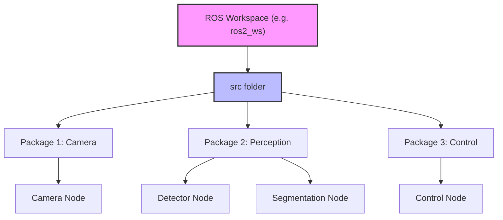
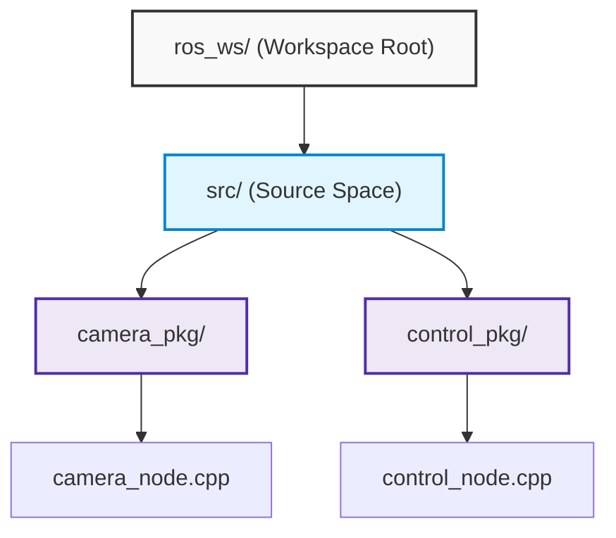
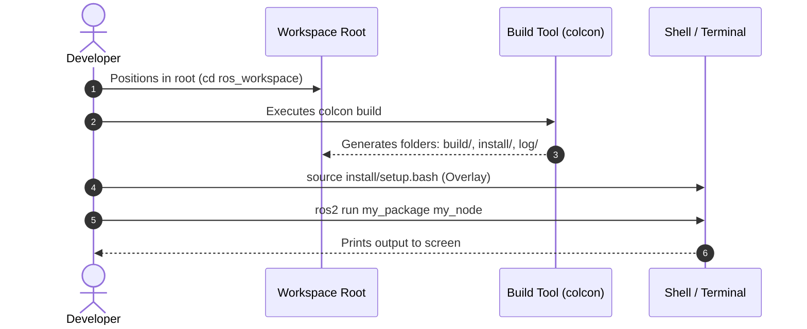
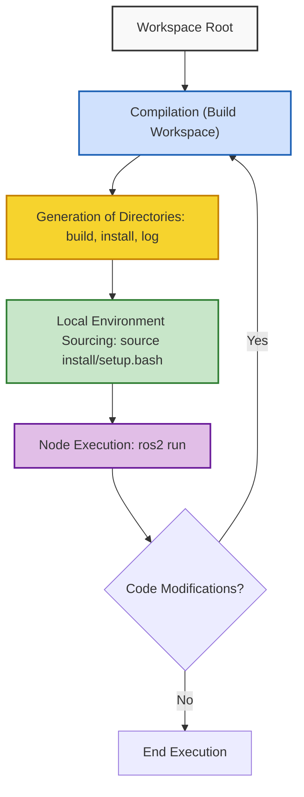

# Introduction to ROS and Working Environment Configuration

## Didactic Overview
In this introductory lesson, preliminary concepts for developing robotic applications using ROS (Robot Operating System) are addressed. The nature and role of ROS are defined, distinguishing it from a programming language, a traditional operating system, or a simple library, and emphasizing its nature as a set of modular and distributed software tools and libraries. Furthermore, the initial phases for configuring the working environment are illustrated, including the loading of environment variables in the terminal (`source`), the hierarchical organization of files through the concepts of Workspace, Package, and Node, and the prerequisites for managing software distributions (specifically Ubuntu 24 with ROS Jazzy Jalisco).

---

### Introduction to ROS and environment configuration

In this course we will use **ROS** (Robot Operating System), specifically the **Jazzy Jalisco** distribution, which runs on **Ubuntu 24.04**. The primary reference point for official documentation, installation guides, and tutorials is the official ROS website, which you should familiarize yourself with right away.

#### What is (and what is not) ROS?
Before starting to write code, it is important to clarify the nature of ROS:
* **It is not a programming language:** programs (called *ROS nodes*) are written in C++ or Python.
* **It is not a traditional operating system:** it runs *on top of* an existing operating system (usually Linux). However, from the robot's perspective, it can be viewed as such since it provides services, abstractions, and low-level primitives.
* **It is not a simple library:** it is a complete set of software libraries and *tools* for creating robotic applications.

Among its main features we find:
* **Modularity:** a ROS application is not a monolithic block, but is broken down into many independent modules, each dedicated to a specific task. These modules can even run on different machines (distributed computing).
* **Common interface:** modules share standard interfaces, facilitating sharing, modification, testing, and isolated debugging.
* **Community:** a vast *open-source* community that provides ready-to-use components on GitHub, avoiding the need to write everything from scratch.

---

### Initial environment configuration

After installing ROS, the very first operation to perform in each terminal is **sourcing** the working environment, which means telling the terminal where to find the ROS binaries and configurations.

The command to execute is:
```bash
source /opt/ros/jazzy/setup.bash
```

Since typing this command every time a new terminal is opened is inconvenient, it is good practice to automate the procedure by adding it to the end of your shell configuration file (`.bashrc`).

---

### Workspace and Packages Organization

When developing a ROS application, we must follow a well-defined folder structure:



* **Workspace:** is the main folder that contains all our applications and projects.
* **`src` folder:** is located inside the workspace and contains the source packages.
* **Packages:** represent the basic organizational unit in ROS. They group code, configurations, and resources related to a specific functionality (e.g., camera management, perception, control).
* **ROS Nodes:** are the individual executable programs written within the packages to perform a specific task. Nodes will communicate with each other using ROS interfaces and messages (a topic we will explore in upcoming lessons).

---

### Environment Configuration and Workspace Concept

Before creating and manipulating projects in ROS 2, it is fundamental to understand how the operating system locates the necessary commands and libraries.

#### Sourcing the Global Environment

Every time a new terminal is opened, the shell does not automatically know where the ROS 2 executables are installed. It is necessary to perform the so-called **sourcing** of the environment:

```bash
source /opt/ros/jazzy/setup.bash
```

> **Key Concept**: To avoid typing this command at every new terminal session, the instruction is inserted directly into the shell configuration file (`~/.bashrc`):
> ```bash
> echo "source /opt/ros/jazzy/setup.bash" >> ~/.bashrc
> ```

---

### Workspace Creation and Directory Structure

A **Workspace** is simply the root directory inside which ROS 2 projects reside. Within the workspace, all source code must reside inside a dedicated folder named `src` (or `source`).



#### Modularity Rules
*   **Workspace**: Contains the entire software application for the robot.
*   **Package**: Atomic unit of compilation and release, dedicated to a specific functionality (e.g., camera sensor management).
*   **Node**: The single executable program (e.g., the process that captures and processes video frames).

To create the initial structure, we position ourselves in the desired directory and simultaneously create the workspace and the source folder via:

```bash
mkdir -p ros_workspace/src
```

---

### Creation and Anatomy of a C++ Package

In ROS 2 it is possible to create packages in both **Python** (using the `ament_python` build-type) and **C++** (using `ament_cmake`). 

#### Structure of a C++ Package
Once generated, the C++ package presents the following anatomy:
*   `CMakeLists.txt`: File containing compilation directives for CMake (include directories, executable targets, dependencies on external libraries).
*   `package.xml`: Manifest file containing metadata (package name, version, maintainer, license) and the explicit list of compile-time and run-time dependencies.
*   `include/`: Folder intended to host header files (`.hpp` or `.h`).
*   `src/`: Folder where the C++ source code (`.cpp`) resides, i.e., the logical implementation of the nodes.

#### Package Creation Command
To create a package, you must position yourself **inside the `src` folder** and execute the terminal command:

```bash
cd ros_workspace/src
ros2 pkg create --build-type ament_cmake --license Apache-2.0 --node-name my_node my_package
```

*   `--build-type ament_cmake`: Specifies that it is a C++ package.
*   `--license Apache-2.0`: Declares the type of license associated with the code.
*   `--node-name my_node`: Automatically generates a placeholder C++ "Hello World" node skeleton (`my_node.cpp`) inside `src/`.
*   `my_package`: Identifying name of the package.

---

### Compilation, Local Sourcing, and Execution

Once the nodes have been defined and the package configured, the source code must be compiled in order to be executed.



#### 1. Workspace Compilation with Colcon
Compilation is performed using the `colcon build` command. 

> **Key Concept**: The `colcon build` command must be executed **strictly from the workspace root** (`ros_workspace`), not inside `src/` or within individual package folders.

```bash
cd ~/ros_workspace
colcon build
```

Upon compilation, three new automatically generated folders will appear in the workspace root:
*   `build/`: Storage space for intermediate compilation files.
*   `install/`: Folder containing compiled executables, libraries, and environment configuration scripts.
*   `log/`: Log files generated during the build phase.

#### 2. Local Sourcing (Overlay)
If we try to immediately execute our node with `ros2 run my_package my_node`, the terminal will return an error: the system has not yet registered the presence of the newly compiled packages.

It is necessary to inform the terminal where to find the local executables by sourcing the overlay:

```bash
source install/setup.bash
```

#### 3. Node Execution
After sourcing, it is possible to launch the node using the standard CLI (Command Line Interface) syntax:

```bash
ros2 run <package_name> <node_name>
```

In our case:
```bash
ros2 run my_package my_node
```

The terminal will display the standard output defined in the C++ main of the placeholder node (typically a welcome message such as `hello world my_package`).

---

### Compilation, Configuration, and Node Execution

After creating the package and implementing the source code of the node, the next step consists in compiling the entire working environment (**Workspace**). In ROS 2 (Robot Operating System 2), similarly to what happens in C++ or Rust projects, the code must be compiled to generate executables and prepare the installation tree.



---

#### 1. Workspace Compilation

Compilation must always be invoked by positioning oneself in the **workspace root** (and not inside the individual subfolders of the source code). 

During the build phase, three output folders are automatically created inside the workspace:
* `build/`: contains intermediate files generated by the compilation process.
* `install/`: contains binary files, libraries, and configuration scripts ready for execution.
* `log/`: collects information and logs related to the compilation process.

---

#### 2. Environment Configuration (*Sourcing*)

In order for the terminal to recognize the new packages and their generated executables, it is necessary to load the environment variables (**Sourcing**) generated inside the installation directory:

$$\text{source install/setup.bash}$$

Once sourcing is executed:
* The system updates package search paths.
* `Tab` key auto-completion becomes available for custom package-related commands.

---

#### 3. Node Execution

To launch the compiled node, the standard syntax is used:

$$\text{ros2 run } \langle\text{package\_name}\rangle \text{ } \langle\text{node\_name}\rangle$$

For example:
$$\text{ros2 run my\_package my\_node}$$

---

### Iterative Development Workflow

> **Key Concept: Mandatory Recompilation**  
> Every time a modification is made to the source code (for example changing an output message on screen), the node will **not** reflect the changes if executed directly. It is mandatory to:
> 1. Save code modifications.
> 2. Recompile the workspace from the root.
> 3. Re-execute sourcing (if build parameters or dependencies were modified).
> 4. Run the node.

If the workspace is not recompiled, the runtime will continue to execute the last binary present inside the `install/` folder.

---

### Assigned Practical Exercise

As practical consolidation of what has been seen so far, the following exercise is assigned to be completed ahead of the next lesson:

* **Objective**: Modify the basic node just created to implement a **Counter Node**.
* **Required functionality**: The node must increment a numeric counter $c \in \mathbb{N}$ and print its current value to the screen at regular time intervals every $N$ seconds (for example with period $T = 2\text{ s}$).
* **Resolution**: The analysis of the solution and the discussion of the code will constitute the introduction to the next lesson.