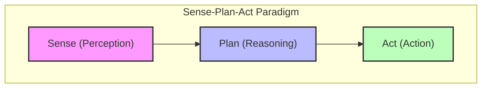
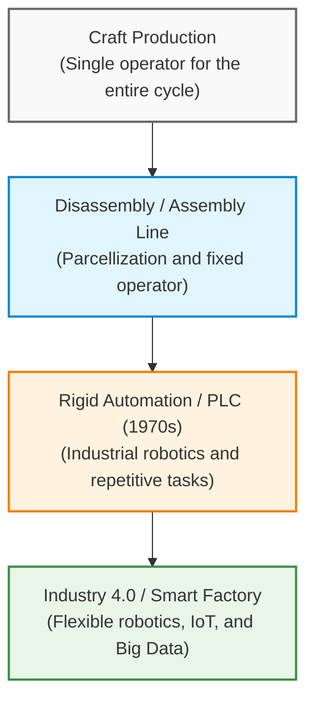
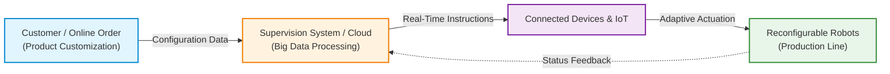
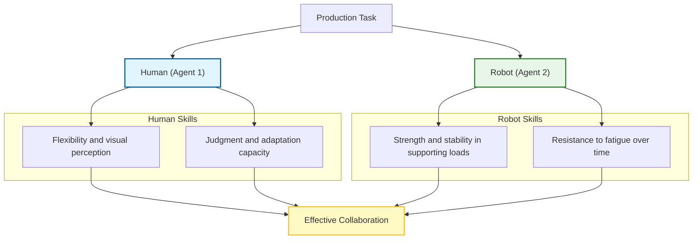
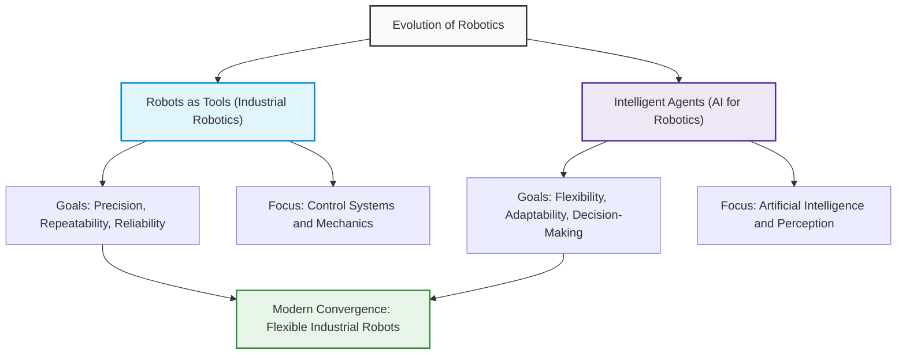
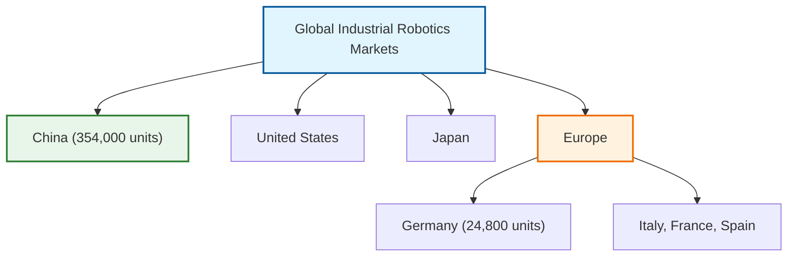
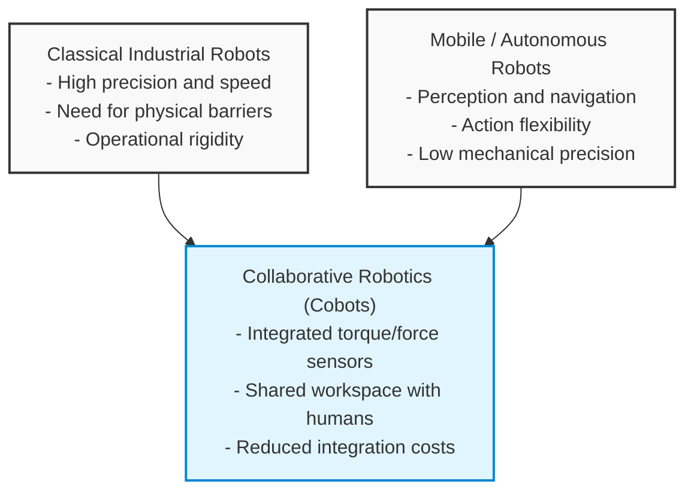

# Lecture 1: Introduction to Robotics and Control Paradigms (Part II)

## Didactic Overview
In this lecture, the fundamental concepts introduced in the previous lecture are reviewed, verifying the installation status of ROS (*Robot Operating System*) and laying the foundations for message-based communication between different nodes. Next, the instructor analyzes the limitations of the classical *sense-plan-act* paradigm (inspired by symbolic artificial intelligence) when applied to the real world and, in particular, to *Human-Robot Interaction* contexts, introducing the need for hybrid systems. Finally, a historical overview of the industrial revolutions is outlined (from the first revolution centered on mechanization and the use of the steam engine, to the second based on mass production and the assembly line) to understand the evolution and introduction of robots in manufacturing contexts, initially driven by the need to replace humans in dangerous or hazardous tasks.

---

### Introduction to the Course and Installation Status

Before diving into the core of the lecture, the instructor opens with a verification moment regarding the status of the ROS (Robot Operating System) platform. The goal is to ensure that all students have their working environment ready on their own computers or via VLAB. 

*Key Concept*: It is essential that every student is able to create and execute at least one basic node and print a message to the terminal at regular intervals. In the next lecture, in fact, we will move on to the next phase: communication and the exchange of messages between different nodes through *topics*. For any technical issue, students are reminded to use the official course forum.

---

### The "Sense-Plan-Act" Paradigm and Its Limits

In the previous lecture, we introduced the formal definition of a robot and analyzed how, regardless of their form or application, all robots share the need for three fundamental elements. Historically, the classical approach with which robots are designed is based on the **Sense-Plan-Act (SPA)** paradigm, which clearly divides software responsibilities into three sequential phases:



1. **Sense (Perception)**: Acquisition of data from the environment via sensors.
2. **Plan (Reasoning)**: Logical processing and move planning (inspired by symbolic Artificial Intelligence).
3. **Act (Action)**: Physical execution of commands via actuators.

#### The Limits of the SPA Paradigm in the Real World
This approach works excellently if the system only needs to manipulate abstract symbols (as in classical problem-solving problems). However, it shows severe limitations when applied to robots in the **real world**:
* The real world cannot be entirely described using discrete symbols.
* Entities in the real world can change their state autonomously, without the robot performing any action.
* The criticality increases dramatically in **Human-Robot Interaction (HRI)**: the robot does not just operate in the environment, but closes the loop on the human being (providing services or support). In many cases, the human is completely embedded within the robot's control loop, issuing direct commands and interfacing with it.

These considerations push toward a paradigm shift in the development of control software, introducing the so-called **hybrid systems**.

---

### History of the First Three Industrial Revolutions

To understand how robots are changing not only how we program them, but also their physical structure, let's take a step back by analyzing technological evolution through the first three industrial revolutions.

#### 1. First Industrial Revolution: The Mechanization of Manufacturing
* **The context**: Until then, the workforce to produce goods (hammering, forging, working textiles) was provided exclusively by humans or animals (such as a donkey walking in a circle to turn a millstone).
* **The turning point**: The introduction of the **steam engine** and the exploitation of hydraulic power. Thermal and water energy is converted into useful mechanical work, applied not only to transportation (trains) but also to production machinery, such as mechanical looms.

#### 2. Second Industrial Revolution: Mass Production
* **The context**: The shift moves from the idea of building every single object handcrafted from scratch to the decomposition of the production process into separate, repetitive phases assigned to different workers.

---

### Evolution of Production Models: From the Assembly Line to Industrial Automation

#### Historical Origins of Line Production
The core idea of modern serial production consists of breaking down a complex process into single elementary phases entrusted to specialized operators. This intuition is often attributed to Henry Ford with the introduction of the *assembly line* in the automotive sector. In reality, the concept originated in the mid-19th century in US industrial slaughterhouses (between Philadelphia and Pittsburgh). 

In that context, it was understood that instead of having a single butcher debone an entire carcass, the process was drastically faster by hanging the animal from hooks on suspended rails:
- The work object moves along the line.
- The operator remains stationary at their workstation, specializing exclusively on a specific anatomical portion or task.

This principle of work decomposition was later translated into manufacturing, supplanting the artisanal model (in which a single worker made the entire manufactured good from start to finish, as in the case of a chair starting from a raw log) in favor of rapid, modular, and standardized production.



---

#### Motivations Underlying Automation
Once the production cycle was broken down into well-defined phases, the next logical step was to replace the human operator with a machine. The historical reasons for this transition can be summarized in three factors:

1. **Precision and Repeatability:** Machines guarantee greater force, tighter tolerances, and qualitative consistency not subject to human fatigue.
2. **Safety and Health Safeguarding (*Dangerous, Dirty, Dull* jobs):** Many industrial operations were unhealthy or lethal. 
   - *Historical example:* In FIAT plants in Turin during the 1960s, the department applying *antirust* (the soundproofing paint sprayed on vehicle underbodies) recorded a very high turnover rate and severe occupational diseases among workers due to the toxicity of the chemical compounds used. The automation of that specific phase was introduced primarily to protect the lives of the operators.
3. **Labor Shortage:** In today's Western industrial contexts, the main driver of automation is the structural difficulty in finding personnel willing to work on production lines, coupled with the progressive aging of the workforce and the absence of generational turnover.

---

### Limits of Traditional Automation and Transition Toward Flexibility

#### Classical Industrial Robotics (1970s)
Starting in the mid-1970s, the advent of digital electronics and Programmable Logic Controllers (PLCs) enabled the large-scale spread of industrial robotics. 

However, these systems presented a fundamental limit: **rigidity**. First-generation industrial robots were programmed to execute deterministic work cycles and endlessly repeat the same trajectory in the operating space.

```
       High Fixed Costs
[ Workcell Engineering + Programming ]
                    │
                    ▼
Requires High Production Volumes (Mass Production)
                    │
                    ▼
     Rigidity of the Production Cycle
(Every product variation requires manual reprogramming and plant downtime)
```

To amortize the huge costs of programming, setup, and calibration of the robotic workcell, companies had to produce millions of identical pieces (*mass production*). Any minor modification to the product resulted in plant stoppage and manual reconfiguration of the *workcell*.

#### The Shift to Mass Customization
Current market demands have overturned this paradigm: consumers no longer demand homogeneous mass products, but highly customized goods (for example, minimum batches or single pieces with specific colors, finishes, and geometries).

To respond to this demand without losing economic margins, robotics and production systems must become **flexible**, **self-reconfiguring**, and capable of adapting their operational cycle in real time.

---

### The Industry 4.0 Paradigm and the Smart Factory

The concept of **Industry 4.0** identifies a manufacturing ecosystem in which machines, robots, sensors, and logistics systems constantly communicate with each other and with corporate supervision systems.



#### Characteristics of the *Smart Factory*
- **Connectivity and Internet of Things (IoT):** Every single actuator or machine is a network node capable of transmitting its status and receiving operational parameters.
- **Direct Customer-Factory Interaction:** The order sent by a user (e.g., a specific color variant for a car or a water bottle) is processed instantly by the factory software, which commands the manipulators along the line to pick the correct components without any human reprogramming intervention.
- **Big Data Integration:** The amount of data generated by the plant is analyzed in real time to optimize flows, manage predictive maintenance, and make autonomous system-level decisions.

> **Key Concept: The Predictive Nature of Industry 4.0**  
> Unlike the first three industrial revolutions — identified and formalized by historians and economists only *after* their effective technological consolidation — the **fourth industrial revolution is the first to have been theorized and proclaimed before fully materializing**.  
> In today's industrial reality, the complete integration of cloud, IoT, and total autonomous reconfigurability remains an evolutionary goal (a reference paradigm) rather than a reality widespread across all production facilities.

---

### Predictive Maintenance and Human-Machine Interfaces in Industry 4.0

The supervision software in an advanced industrial context is not limited to controlling the current state of the line, but is capable of identifying paths to improve production or intercept problems before they occur. A striking example of this approach is **predictive maintenance**. 

*   **How it works:** By collecting and analyzing production data, the system is able to understand in advance whether a machine or a component (such as a motor) is going to experience a failure.
*   **Operational advantages:** Instead of suffering a sudden plant shutdown — which would force production to stop for weeks waiting for a spare part — the company can order the component ahead of time, schedule a brief planned shutdown, and replace the motor before it breaks.

However, connecting all these devices entails new challenges, first and foremost **cybersecurity** and the need to manage access to the cloud. Furthermore, advanced automation is not enough if an adequate **Human-Machine Interface (HMI)** is lacking. If machines communicate with each other but operators do not understand messages or error states, it becomes impossible to intervene promptly to resolve malfunctions. The human factor must always remain in control of what happens.

Another key technology redefining production processes in Industry 4.0 is **additive manufacturing**.

---

### The Myth and Limits of "Dark Factories"

When the fourth industrial revolution was formulated, many feared it would lead to the total elimination of humans from factories. This led to discussions about **"dark factories"**.

*   **What dark factories are:** Completely automated production facilities where human presence is not foreseen.
*   **Why "dark"?** Precisely because there are no workers inside, there is no need to turn on lights (neither artificial nor exploiting natural light). The machinery uses active sensors that do not depend on external lighting. This allows energy costs to be drastically cut, saving on both lighting and heating (considering that many machines operate optimally even at very low temperatures, for example at $10^\circ\text{C}$).

#### Why Dark Factories Failed?
Even giants like Tesla (with its *gigafactories* about ten years ago, when Elon Musk promised facilities free of human operators) never managed to materialize this model. The main reasons are:

1.  **Limits of robotics:** Current robotics is not yet mature enough to handle the entire complexity of a production line. Many operations are not automatable or it is not cost-effective to do so. For example, the production of a smartphone or tablet requires extremely precise assembly: a single device is touched by human hands dozens or hundreds of times during the production cycle, as tasks like quality control and certain insertion operations still prove too complex for machines.
2.  **Inability to handle unexpected events:** Machines do not know how to cope with situations not foreseen by designers. If a cat sneaks into the factory, mobile robots do not know how to recognize it nor how to react, risking the generation of chaos.
3.  **Cascade failure management:** If a robot breaks down and gets stuck in the middle of a hallway, other robots are unable to move it or remedy the failure, causing the entire plant to shut down.

---

### Collaborative Robotics (Cobotics) and Industry 5.0

The solution to the limitations of fully automated factories is not to eliminate humans, but to work alongside them through **collaborative robotics**, giving birth to collaborative robots known as **cobots**.

*   **The collaborative paradigm:** Robots do not replace human beings, but support them in carrying out work. 
*   **Ergonomic and social advantages:** The robot can act as an "extra limb," supporting heavy loads and relieving the operator from physical strain. This prevents joint problems and allows companies to leverage the experience of senior workers (55-65 years old), who can no longer lift heavy weights but can continue to make their know-how available without health risks.



#### Application Example: Aeronautical Assembly
In a European research project focused on aircraft cabin assembly (specifically the installation of internal fuselage metal panels and windows), the cobot and operator work in synergy exploiting their respective optimal qualities:
*   **The robot:** Supports the weight of the heavy panel and maintains position stably over time, canceling the perceived force of gravity. However, it does not possess complex visual perception to find hidden attachments behind the panel.
*   **The human:** Uses their flexibility and perception to finely guide the panel and center the hooks on the fuselage structure.
*   **The interaction:** The robot simply perceives the forces applied by the operator on its end effector or arm, adapting to human-guided movements.

#### The Transition Toward Industry 5.0
Precisely the awareness that the fourth industrial revolution risked being "born blind" — that is, focused exclusively on technology and disconnected from human centrality — prompted the European Commission and the industrial world to introduce the concept of **Industry 5.0**. The fundamental pillar of this new paradigm is **human-centricity**, where production processes and assembly lines are designed putting the well-being and active role of workers first.

---

### From Traditional Factory (Industry 3.0) to Collaborative Cells (Industry 5.0)

The transition toward **Industry 5.0** does not aim solely to increase production or the economic return of production lines, but places **worker well-being** (*human-centric*) at the center. The goal is to leverage new technologies (robotics, Internet of Things, advanced perception, and artificial intelligence) to create safe and healthy jobs where people are motivated to work.

This new paradigm, which emerged in particular in the period following the COVID-19 pandemic under the push of the European Union, is based on three fundamental pillars:
*   **Human-centric:** Evaluating and designing production processes considering the impact on the worker.
*   **Resilient:** The production's ability to cope with disruptions, such as supply chain crises, by having alternative supplies.
*   **Sustainable:** Eco-compatible production that respects the planet's resources without over-exploiting them.

---

### Visual Comparison: Traditional Plant (Industry 3.0) vs Collaborative Cell

#### Traditional Factory (Industry 3.0)
Looking at a typical traditional industrial plant (for example, a car welding department), some evident characteristics emerge:
*   **Presence of multiple robotic arms:** Often five or more robots work simultaneously in the same workcell, synchronized via PLCs (Programmable Logic Controllers).
*   **Absence of humans in the work area:** Operators cannot access the operating space of the robots.
*   **Safety Fences:** By law (automatic machinery directive), industrial robots must be enclosed inside a protective cage.
*   **Safety Interlock:** The cage is equipped with a single access door for maintenance, the handle of which is connected directly to the main power switch and not to a software stop. Opening the door physically cuts off the electrical power of the entire cell for maximum safety reasons.
*   **Lack of perception:** Traditional robots execute pre-defined trajectories from point $A$ to point $B$ without any ability to perceive the presence of obstacles or humans along the path. Having high masses and sustained speeds, an impact with an operator would be extremely dangerous.

#### Collaborative Cell (Industry 5.0)
In the paradigm of **collaborative robots** (*cobots*), the situation is the exact opposite:
*   **Close interaction:** People (even non-technical ones, such as visitors or children) can station close to the robot in complete safety.
*   **Sensors and perception:** Robots are equipped with advanced sensors capable of detecting human presence and adapting actuator movements.
*   **Human-Machine Interface (HMI):** Visual communication systems inform the operator of the robot's intentions (e.g., LED lights changing color to indicate cooperative mode or displays simulating gaze/movement direction).

---

### Pioneers and Startups: From iRobot to Rethink Robotics

*   **Rodney Brooks:** Considered the father of modern robotics, famous for introducing *behavior-based robotics*. Brooks founded important startups:
    *   **iRobot:** A highly commercially successful company that created the *Roomba*, the first successful robot for the mass market.
    *   **Rethink Robotics:** A startup born to revolutionize industrial robotics by introducing collaborative robots (such as the dual-arm robot *Baxter*). Although the company later failed due to market difficulties, many of the introduced ideas continue to influence the new generation of cobots.

---

### Origins and Evolution of Robotics

The idea of machines capable of assisting or replacing human beings is very ancient, but the technological development of automatic or autonomous machines received a strong acceleration only after World War II. 

According to historical reconstruction (largely reflecting the US perspective described by Prof. Robin Murphy in the text *Introduction to AI Robotics*), the initial push between the 1950s and 1960s came mainly from two key sectors:

1.  **The nuclear industry:** Characterized by extremely high-risk environments where direct handling of radioactive elements (such as plutonium or uranium) was barred to human beings due to lethal radiation. This gave rise to the need for **tele-manipulation** and remote control systems (human operator supervising from a safe distance).
2.  **Space exploration:** From the beginning, NASA understood the limits of astronaut movement in space and the need to have supporting machines or robots to operate on the Moon or in orbit.

These two areas generated two different development trends:
*   **Robots as Tools:** Driven by the nuclear and heavy industry, focused on precise manipulation capabilities and remote or autonomous control aimed at industrial production.
*   **Robots as Intelligent Agents:** Focused on interaction in open environments and autonomous mobility, laying the foundations for **mobile robotics** and drones.

---

### Historical Separation: Robots as Tools vs Intelligent Agents

The evolution of robotics has been deeply marked by a historical methodological and conceptual split, which divided both the industrial world and the scientific community into two parallel and long-separated research lines.



#### 1. The Robot as a "Tool" (Industrial Robotics)
* **Primary Objective**: Maximize millimeter precision, *repeatability*, cycle speed, and *reliability*.
* **Methodological Approach**: Typical of automation engineering and *control systems*. The robot is conceived as a deterministic and precise actuator embedded in strictly structured environments (e.g., assembly lines).

#### 2. The Robot as an "Intelligent Agent" (AI Robotics)
* **Primary Objective**: Make machines autonomous, capable of perceiving, reasoning, adapting to unstructured environments, and handling unexpected situations.
* **Methodological Approach**: Typical of *Artificial Intelligence (AI)* and computer science. The focus is not so much on mechanics or exact millimeter control, but on *decision-making*.

Both communities grew separately until reaching a high level of technological maturity. Today, however, the intrinsic limitations of a purely mechanical or purely abstract approach are imposing a strong convergence: industry demands robots that maintain classical reliability but integrate the adaptability typical of intelligent systems.

---

### Origins and Evolution of Industrial Robotics

The birth of the modern robotics industry can be traced back to a fundamental milestone:

* **1956**: George Devol and Joseph Engelberger found **Unimation** (short for *Universal Automation*), the world's first robotics company.
* **1959**: Installation of history's first industrial robot, the **Unimate**.

The Unimate was a programmable manipulator used in heavy industry for grueling and hazardous tasks, specifically unloading incandescent parts from a die-casting machine.

```
Technological Characteristics of the Era:
• Control: Programmed directly in joint coordinates.
• Memory: Data recording on a magnetic drum. 
  (Commercial microprocessors or RAM memories as we understand them today did not exist yet).
```

---

### Market Maturity and the Flexibility Challenge

Over the decades, the industrial robotics sector has developed machines with extreme physical capabilities, widely surpassing human performance in dedicated tasks:

* **Speed and Precision**: Manipulators capable of *sorting* or assembling components at extremely high frequencies with tolerances below a millimeter.
* **Operational Reliability**: Systems with *Mean Time Between Failures (MTBF)* regularly exceeding hundreds of thousands or millions of working hours.
* **Payload Capacity**: Commercial availability as standard of robots capable of lifting high loads (e.g., $250\text{ kg}$ or over $500\text{ kg}$ synchronizing multiple arms).

#### Saturation of the Innovation Curve

From the standpoint of pure hardware (speed, force, and repeatability), industrial robotics has reached the saturation phase of its technological S-curve: further increasing these parameters now offers diminishing marginal returns at exponential costs.

> **Key Concept: The Lack of Flexibility**  
> The critical element missing from traditional industrial robotics is *flexibility*. Classical robots are extremely rigid: if the position of a part varies by even just a few millimeters compared to the programmed one, the system fails. The sector's current goal is to integrate sensory and reasoning capabilities to allow precise machines to dynamically adapt to variations in the work environment.

This state of maturity is also reflected in economic data: the annual growth rate of new installations of traditional industrial robots is progressively slowing down, stabilizing at almost constant values in historically industrialized markets such as Europe and North America. The new market push will depend on the ability to make these systems truly adaptive and intelligent.

---

### Global Market Statistics and the Rise of Robotics

Global statistics on industrial robotics are collected and published annually by the *International Federation of Robotics (IFR)* within the **World Robotics** report. Analyzing the most recent data, it clearly emerges how Asia represents the main growth engine of the sector, although in markets like the Asian and Australian ones, a certain saturation phase is beginning to be recorded after years of very strong expansion. In 2024, a total of $402,000$ industrial robots were installed worldwide.



Looking at individual countries, **China** clearly dominates with $354,000$ units installed (data referring to 2025). It is followed by the United States and Japan. Regarding Europe, the top country for installations is **Germany** ($24,800$ units), followed by Italy, France, and Spain. If we consider Europe as a single economy, the volume of investments exceeds that of the United States by almost double, demonstrating a strong industrial commitment in the sector.

#### Evolution of Application Sectors
Historically, the **automotive** sector has been the main driver for the growth of industrial robotics. Car manufacturing lends itself particularly well to automation because:
* Processes are highly repetitive and effective.
* Each successful model requires high volumes, often exceeding $1\text{ million}$ pieces produced.

However, in recent years a progressive decrease in the relative share of the automotive sector has been observed. The new fast-growing markets are:
1. **Electrical and Electronics Assembly**: has become the primary market by number of installations.
2. **Metal and Machinery**: a sector traditionally closed to robotics that now records steady growth.
3. **Food Production**: an area once considered the exclusive domain of human manual labor, but today increasingly automated.

This change is made possible by the fact that modern industrial robots are becoming **more flexible and intelligent**. Thanks to the integration of advanced sensors, robots can now perform tasks previously reserved for humans (such as loading and unloading parts from a machine or performing quality control), opening the doors to application markets previously inaccessible.

---

### The Birth of Artificial Intelligence and Intelligent Robotics

Intelligent robotics has its roots in **Artificial Intelligence (AI)**. Robotics has always been considered an application of AI, and a significant part of the artificial intelligence scientific community still works in the field of robotics.

#### The Dartmouth Conference of 1956
Before the 1950s, computers were machines designed exclusively to compute (*to compute*), such as calculating missile trajectories, simulations, or solving equations. 

> **Key Concept**: Initially, the term "computer" did not indicate a machine, but a **profession performed by people** (often women employed in the scientific or military sector, as also documented in film contexts for NASA), whose job was to manually perform complex calculations, integrals, and logarithms handed down on sheets of paper by engineers.

A fundamental turning point occurred in **1950**, when **Alan Turing** published a seminal paper titled *"Can Machines Think?"*, introducing the idea that computers should not only serve for numerical calculations, but could be employed for reasoning, logic, and everyday problem-solving.

Six years later, in **1956**, the famous **Dartmouth Conference** was held (organized in Stanford, entrusting the task to the young PhD student **John McCarthy**). McCarthy decided to discard formal and boring titles like *"Symposium on the computational ability of machine"* and officially coined the term **Artificial Intelligence**. The conference was attended by the most important mathematicians, computer engineers, and pioneers of information engineering.

#### The First Mobile Robots: Shaky
In the late 1960s, also at Stanford, the first mobile robot capable of moving autonomously from one room to another in a department was developed: **Shaky**. 

The robot was equipped with:
* A tall, heavy antenna.
* Heavy analog cameras mounted on the upper structure to transmit images to a large remote computer.

Due to the oscillating and unstable movement caused by the heavy structure during travel, the machine was nicknamed *Shaky*. This system represented the first true example of a mobile robot capable of performing autonomous actions, receiving navigation commands to move along corridors.

---

### Service Robots and Mobile Robotics: State of the Art and Market

Mobile robotics and service robots now represent a consolidated technology. Today, Autonomous Mobile Robots (AMRs) are capable of moving in unstructured environments, detecting obstacles, re-planning trajectories, and executing tasks in real time with high speed and reliability. From the engineering standpoint of navigation and perception, we can consider this problem largely solved.

From an economic perspective, analyzing IFR (*International Federation of Robotics*) data, it is essential to distinguish two segments:
* **Consumer service robots:** low-cost devices for domestic use (e.g., robot vacuums, commercial drones).
* **Professional Service Robots:** machines designed for commercial/industrial tasks. This market is growing strongly and is mainly dominated by:
  1. **Transport and Logistics:** covers about $50\%$ of the sector (goods handling in warehouses, factories, and sorting centers).
  2. **Professional Cleaning:** sanitization of large commercial or hospital areas.
  3. **Hospitality and Healthcare:** delivery of meals, medicines, or linen handling in hotels and hospitals.

---

### Technological Convergence: Evolution Toward Cobots

In recent years, we have witnessed the convergence of two major complementary technological trends:

1. **Traditional Industrial Robotics:** characterized by very high precision, repeatability ($< 0.05\text{ mm}$), rigidity, and high operating speed, but lacking flexibility, enclosed in cages, and with scarce adaptation capacity to the surrounding environment.
2. **Mobile/Autonomous Robotics:** endowed with great contextual awareness (*world modeling*), flexibility, and ability to interact with dynamic environments, but with intrinsic limits of accuracy and mechanical rigidity.

The union of these two paradigms gave rise to **Collaborative Robots (*Cobots*)**.



#### Advantages of Cobots for the Production System
Cobots integrate force/torque sensors on joints, tactile sensors (or actual "sensorized skins"), and vision systems to constantly monitor the operating space, making the machine intrinsically safe for the human operator:

* **Reduced Integration Costs:** In a traditional industrial cell, the cost of the manipulator alone often constitutes only a fraction of the total plant cost ($30\text{–}40\%$). The rest of the expense is allocated to physical safety fences, light curtains, interlocks, and layout design. Cobots eliminate a large part of these accessory costs.
* **Reduced Footprint:** Not requiring segregated perimeter barriers, humans and robots can share the same workbench, allowing installation in tight spaces typical of Small and Medium Enterprises (SMEs).

> **Key Concept:** Currently cobots represent about $10\%$ of the global industrial robot market, but grow at an annual rate exceeding $20\%$. However, their main limitation lies in **operating speed**: to comply with safety regulations on human contact, a cobot works at significantly lower speeds compared to a traditional segregated industrial robot.

---

### Integration of Artificial Intelligence and Safety Constraints

The advent of advanced Artificial Intelligence and generative models (*Generative AI*, LLMs) is enriching robots with decision-making capabilities, semantic scene understanding, and automated task planning. 

However, there is a strong misalignment between modern AI and industrial requirements:
* **Lack of determinism and certification:** Current generative AI architectures operate as black-box probabilistic models, guaranteeing neither determinism nor *fault tolerance*.
* **Industrial Safety Standards:** Regulations mandate that safety-critical control systems meet rigorous requirements (e.g., performance levels $PL_d$ or $PL_e$ according to ISO 13849). Generative AI is currently unable to provide such mathematical and formal guarantees, slowing down its direct adoption in safety-critical control loops.

---

### Humanoid Robots: Critical Analysis Between Hype and Industrial Reality

*Humanoid Robots* receive massive media and commercial attention, but on the industrial front their maturity is still extremely limited. This is a "niche within a niche," with global sales estimates for *full-size* robots numbering in the low thousands of experimental units.

```
       Commercial Maturity vs. Technological Hype
┌──────────────────────────────────────────────────────────┐
│  Industrial Robots   --> Full maturity and certain ROI   │
│  Cobots              --> Rapid application expansion     │
│  Humanoid Robots     --> R&D phase / Low IFR maturity    │
└──────────────────────────────────────────────────────────┘
```

#### Main Technical Limits in Industrial Adoption

1. **Absence of a fixed reference to the ground (*Floating Base*):**  
   Unlike an industrial arm rigidly mounted to a base or a cobot fixed to a table, the humanoid rests on feet. The accumulation of odometry errors, contact deformations, and mobile-base kinematics make it difficult to establish precise and repeatable coordinates for millimeter-precision tasks.
2. **Real manipulation vs. Kinematic dexterity:**  
   Many prototypes exhibit anthropomorphic hands with a high number of Degrees of Freedom (DoF). However, positioning fingers in space does not equate to manipulating: true manipulation requires distributed tactile feedback, pressure feedback, friction, dynamic slip control, and real-time sensory integration.
3. **Repeatability, Reliability, and Return on Investment (ROI):**  
   If a manufacturing company does not adopt cobots because they are considered too slow compared to necessary production cycles, adopting a humanoid is even less economically justifiable. A humanoid presents high costs, very long cycle times, poor long-term reliability, and safety standards not yet defined for close human-contact work.

> **IFR Evaluation:** The International Federation of Robotics emphasizes the importance of distinguishing **technological potential** from **commercial maturity**. Although companies are purchasing humanoids for Research and Development (R&D) purposes, their actual effectiveness and cost-effectiveness within real production lines remain a technical hypothesis yet to be proven.