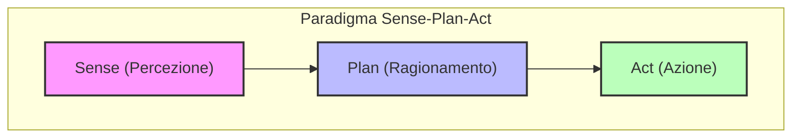
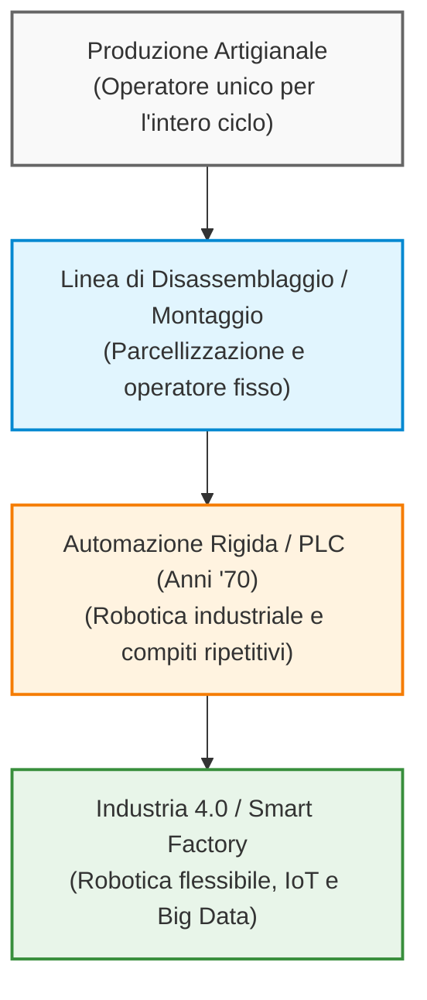
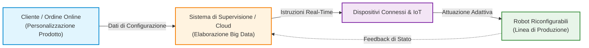
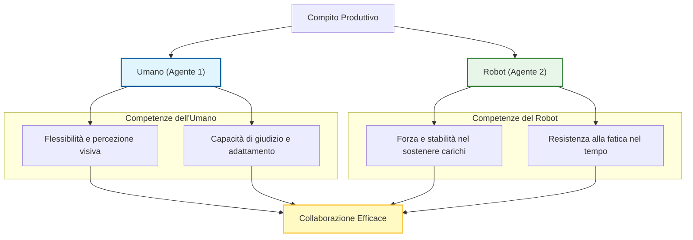
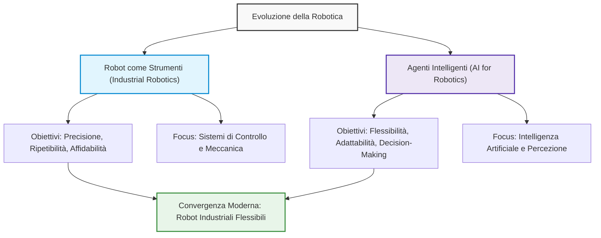
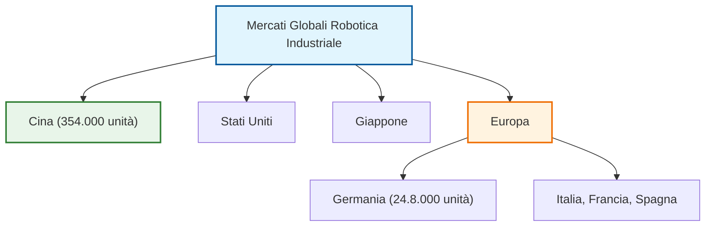
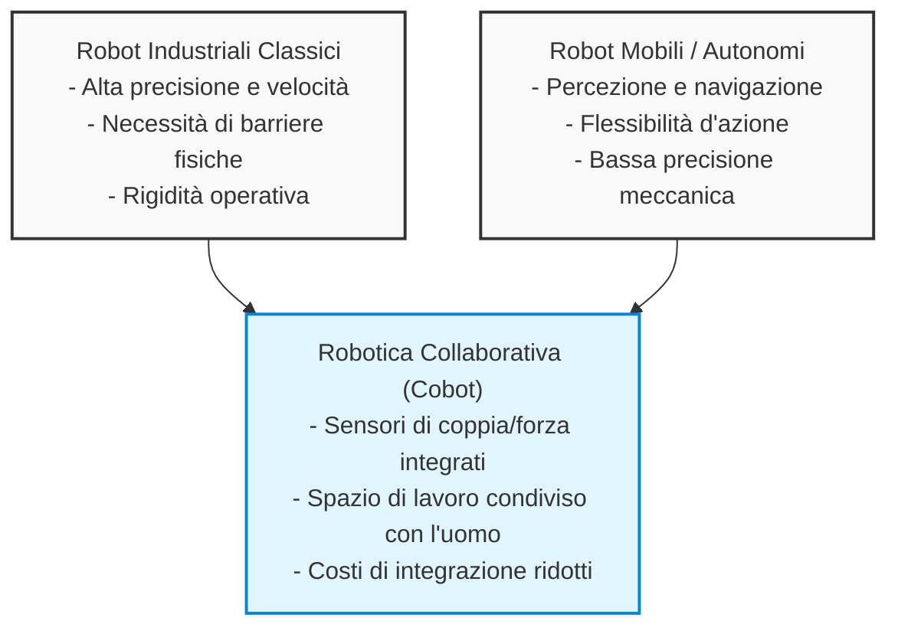

# Lezione 1: Introduzione alla Robotica e Paradigmi di Controllo (Parte II)

## Overview Didattica
In questa lezione vengono ripresi i concetti fondamentali introdotti nella lezione precedente, verificando lo stato dell'installazione di ROS (*Robot Operating System*) e impostando le basi per la comunicazione tramite messaggi tra nodi differenti. Successivamente, il docente analizza i limiti del paradigma classico *sense-plan-act* (ispirato all'intelligenza artificiale simbolica) quando applicato al mondo reale e, in particolare, ai contesti di interazione uomo-robot (*Human-Robot Interaction*), introducendo la necessità di sistemi ibridi. Infine, viene tracciata un'excursus storico sulle rivoluzioni industriali (dalla prima rivoluzione incentrata sulla meccanizzazione e l'uso del motore a vapore, alla seconda basata sulla produzione di massa e sulla catena di montaggio) per comprendere l'evoluzione e l'introduzione dei robot nei contesti manifatturieri, spinta inizialmente dalla necessità di sostituire l'uomo in mansioni pericolose o nocive.

---

### Introduzione al corso e stato delle installazioni

Prima di entrare nel vivo della lezione, il docente apre con un momento di verifica sullo stato della piattaforma ROS (Robot Operating System). L'obiettivo è assicurarsi che tutti gli studenti abbiano l'ambiente di lavoro pronto sul proprio computer o tramite VLAB. 

*Concetto Chiave*: È fondamentale che ogni studente sia in grado di creare ed eseguire almeno un nodo di base e far stampare a terminale un messaggio a intervalli regolari. Nella prossima lezione, infatti, passeremo alla fase successiva: la comunicazione e lo scambio di messaggi tra nodi differenti attraverso i *topic*. Per qualsiasi problema tecnico, viene ricordato di utilizzare il forum ufficiale del corso.

---

### Il paradigma "Sense-Plan-Act" e i suoi limiti

Nella lezione precedente abbiamo introdotto la definizione formale di robot e analizzato come, indipendentemente dalla loro forma o applicazione, tutti i robot condividano la necessità di tre elementi fondamentali. Storicamente, l'approccio classico con cui vengono progettati i robot si basa sul paradigma **Sense-Plan-Act (SPA)**, che divide nettamente le responsabilità del software in tre fasi sequenziali:



1. **Sense (Percezione)**: Acquisizione dei dati dall'ambiente tramite sensori.
2. **Plan (Ragionamento)**: Elaborazione logica e pianificazione delle mosse (ispirata all'Intelligenza Artificiale simbolica, *symbolic Artificial Intelligence*).
3. **Act (Azione)**: Esecuzione fisica dei comandi tramite gli attuatori.

#### I limiti del paradigma SPA nel mondo reale
Questo approccio funziona in modo eccellente se il sistema deve manipolare esclusivamente simboli astratti (come nei problemi classici di problem-solving). Tuttavia, mostra forti limiti quando applicato ai robot nel **mondo reale**:
* Il mondo reale non è interamente descrivibile tramite simboli discreti.
* Le entità nel mondo reale possono modificare il loro stato in modo autonomo, senza che il robot compia alcuna azione.
* La criticità aumenta drasticamente nell'**Interazione Uomo-Robot (Human-Robot Interaction - HRI)**: il robot non si limita a operare nell'ambiente, ma chiude il loop sull'essere umano (fornendo servizi o supporto). In molti casi, l'umano è completamente inserito all'interno del loop di controllo del robot, impartendo comandi diretti e interfacciandosi con esso.

Queste considerazioni spingono verso un cambio di paradigma nello sviluppo del software di controllo, introducendo i cosiddetti **sistemi ibridi (hybrid systems)**.

---

### La storia delle prime tre rivoluzioni industriali

Per comprendere come i robot stiano cambiando non solo il modo in cui li programmo, ma anche la loro struttura fisica, facciamo un passo indietro analizzando l'evoluzione tecnologica attraverso le prime tre rivoluzioni industriali.

#### 1. Prima Rivoluzione Industriale: La meccanizzazione della manifattura
* **Il contesto**: Fino a quel momento, la forza lavoro per produrre beni (martellare, forgiare, lavorare i tessuti) era fornita esclusivamente dagli esseri umani o dagli animali (come un asino che gira in cerchio per muovere una macina).
* **La svolta**: L'introduzione della **macchina a vapore** (*steam engine*) e lo sfruttamento dell'energia idraulica. L'energia termica e dell'acqua viene convertita in lavoro meccanico utile, applicato non solo ai trasporti (treni) ma anche ai macchinari di produzione, come i telai meccanici (*loom*).

#### 2. Seconda Rivoluzione Industriale: La produzione di massa
* **Il contesto**: Si passa dall'idea di costruire ogni singolo oggetto artigianalmente da zero alla scomposizione del processo produttivo in fasi separate e ripetitive assegnate a lavoratori differenti.

---

### Evoluzione dei Modelli Produttivi: Dalla Catena di Montaggio all'Automazione Industriale

#### Origini storiche della produzione in linea
L'idea cardine della produzione seriale moderna consiste nel parcellizzare un processo complesso in singole fasi elementari affidate a operatori specializzati. Spesso si attribuisce questa intuizione a Henry Ford con l'introduzione della catena di montaggio (*assembly line*) nel settore automobilistico. In realtà, il concetto nasce verso la metà del XIX secolo nei macelli industriali statunitensi (tra Filadelfia e Pittsburgh). 

In quel contesto si capì che, anziché far disossare un intero capo di bestiame a un singolo macellaio, il processo risultava drasticamente più rapido appendendo l'animale a ganci su rotaie sospese:
- L'oggetto del lavoro si muove lungo la linea.
- L'operatore rimane fermo nella propria postazione, specializzandosi esclusivamente su una specifica porzione anatomica o mansione.

Questo principio di scomposizione del lavoro è stato poi traslato nella manifattura, soppiantando il modello artigianale (in cui un singolo operaio realizzava l'intero manufatto dall'inizio alla fine, come nel caso di una sedia partendo dal tronco grezzo) a favore di una produzione rapida, modulare e standardizzata.



---

#### Le motivazioni alla base dell'automazione
Una volta scomposto il ciclo produttivo in fasi ben definite, il passo logico successivo è stato sostituire l'operatore umano con una macchina. I motivi storici di questa transizione si possono riassumere in tre fattori:

1. **Precisione e ripetibilità:** Le macchine garantiscono una forza maggiore, tolleranze più strette e una costanza qualitativa non soggetta all'affaticamento umano.
2. **Sicurezza e salvaguardia della salute (Lavori *Dangerous, Dirty, Dull*):** Molte operazioni industriali risultavano insalubri o letali. 
   - *Esempio storico:* Negli stabilimenti FIAT a Torino durante gli anni '60, il reparto di applicazione dell'*antirombo* (la vernice insonorizzante spruzzata sul sottoscocca dei veicoli) registrava un altissimo tasso di turnover e gravi malattie professionali tra gli operai a causa della tossicità dei composti chimici impiegati. L'automazione di quella fase specifica fu introdotta primariamente per tutelare la vita degli operatori.
3. **Carenza di manodopera (*Labor Shortage*):** Nei contesti industriali occidentali odierni, il driver principale dell'automazione è la difficoltà strutturale nel reperire personale disposto a lavorare sulle linee di produzione, a fronte di un progressivo invecchiamento della forza lavoro e dell'assenza di ricambio generazionale.

---

### Limiti dell'Automazione Tradizionale e Transizione verso la Flessibilità

#### La robotica industriale classica (Anni '70)
A partire dalla metà degli anni '70, l'avvento dell'elettronica digitale e dei controllori a logica programmabile (PLC, *Programmable Logic Controller*) ha consentito la diffusione su larga scala della robotica industriale. 

Tuttavia, questi sistemi presentavano un limite fondamentale: **la rigidità**. I robot industriali di prima generazione erano programmati per eseguire cicli di lavoro deterministici e ripetere all'infinito la medesima traiettoria nello spazio operativo.

```
       Costi Fissi Elevati
[ Ingegnerizzazione Cella + Programmazione ]
                    │
                    ▼
Richiede Alti Volumi di Produzione (Mass Production)
                    │
                    ▼
     Rigidità del Ciclo Produttivo
(Ogni variazione del prodotto richiede riprogrammazione manuale e fermo impianto)
```

Per ammortizzare gli ingenti costi di programmazione, allestimento e calibrazione della cella di lavoro robotizzata, le aziende dovevano produrre milioni di pezzi identici (*mass production*). Qualsiasi minima modifica al prodotto comportava un arresto dell'impianto e una riconfigurazione manuale della cella (*workcell*).

#### Il passaggio alla produzione personalizzata (*Mass Customization*)
Le richieste del mercato attuale hanno ribaltato questo paradigma: i consumatori non richiedono più prodotti di massa omogenei, ma beni altamente personalizzati (ad esempio, lotti minimi o singoli pezzi con colori, finiture e geometrie specifiche).

Per rispondere a questa domanda senza perdere marginalità economica, la robotica e i sistemi di produzione devono diventare **flessibili**, **auto-riconfigurabili** e capaci di adattare il proprio ciclo operativo in tempo reale.

---

### Il Paradigma di Industria 4.0 e la Fabbrica Intelligente (*Smart Factory*)

Il concetto di **Industria 4.0** identifica un ecosistema manifatturiero in cui macchine, robot, sensori e sistemi logistici comunicano costantemente tra loro e con i sistemi di supervisione aziendali.



#### Caratteristiche della *Smart Factory*
- **Connettività e *Internet of Things* (IoT):** Ogni singolo attuatore o macchina è un nodo di rete in grado di trasmettere il proprio stato e ricevere parametri operativi.
- **Interazione diretta Cliente-Fabbrica:** L'ordine inviato da un utente (es. una variante colore specifica per un'automobile o una borraccia) viene elaborato istantaneamente dal software di fabbrica, che comanda ai manipolatori lungo la linea di prelevare i componenti corretti senza alcun intervento umano di riprogrammazione.
- **Integrazione dei *Big Data*:** La mole di dati generata dall'impianto viene analizzata in tempo reale per ottimizzare i flussi, gestire la manutenzione predittiva e prendere decisioni autonome a livello di sistema.

> **Concetto Chiave: La natura previsionale di Industria 4.0**  
> A differenza delle prime tre rivoluzioni industriali — identificate e formalizzate dagli storici e dagli economisti solo *dopo* il loro effettivo consolidamento tecnologico — la **quarta rivoluzione industriale è la prima a essere stata teorizzata e proclamata prima che si realizzasse pienamente**.  
> Nella realtà industriale odierna, l'integrazione completa di cloud, IoT e totale riconfigurabilità autonoma rimane un obiettivo evolutivo (un paradigma di riferimento) e non ancora una realtà diffusa nella totalità degli stabilimenti produttivi.

---

### Manutenzione Predittiva e Interfacce Uomo-Macchina nell'Industria 4.0

Il software di supervisione in un contesto industriale avanzato non si limita a controllare lo stato corrente della linea, ma è in grado di individuare percorsi per migliorare la produzione o intercettare i problemi prima che si verifichino. Un esempio lampante di questo approccio è la **manutenzione predittiva (predictive maintenance)**. 

*   **Come funziona:** Raccogliendo e analizzando i dati di produzione, il sistema è in grado di capire in anticipo se una macchina o un componente (ad esempio un motore) andrà incontro a un guasto.
*   **Vantaggi operativi:** Invece di subire un blocco improvviso dell'impianto — che costringerebbe a fermare la produzione per settimane in attesa di unpezzo di ricambio — l'azienda può ordinare il componente per tempo, pianificare un breve arresto programmato e sostituire il motore prima che si rompa.

Tuttavia, connettere tutti questi dispositivi comporta nuove sfide, prima fra tutte la **sicurezza informatica (cyber security)** e la necessità di gestire l'accesso al cloud. Inoltre, l'automazione spinta non è sufficiente se manca un'adeguata **Interfaccia Uomo-Macchina (Human-Machine Interface - HMI)**. Se le macchine comunicano tra loro ma gli operatori non comprendono i messaggi o gli stati di errore, diventa impossibile intervenire tempestivamente per risolvere i malfunzionamenti. Il fattore umano deve rimanere sempre in controllo di ciò che accade.

Un'altra tecnologia chiave che sta ridefinendo i processi produttivi nell'Industria 4.0 (Industry 4.0) è la **produzione additiva (additive manufacturing)**.

---

### Il Mito e i Limiti delle "Dark Factories"

Quando è stata formulata la quarta rivoluzione industriale, in molti temevano che avrebbe portato alla totale eliminazione dell'uomo dalle fabbriche. Si è iniziato così a parlare di **"dark factories" (fabbriche buie)**.

*   **Cosa sono le dark factories:** Impianti produttivi completamente automatizzati in cui la presenza umana non è prevista.
*   **Perché "buie"?** Proprio perché non ci sono lavoratori all'interno, non è necessario accendere le luci (né quelle artificiali né sfruttare la luce naturale). I macchinari utilizzano sensori attivi che non dipendono dall'illuminazione esterna. Questo consente di tagliare drasticamente i costi energetici, risparmiando sia sull'illuminazione sia sul riscaldamento (considerando che molte macchine operano in modo ottimale anche a temperature molto basse, ad esempio a $10^\circ\text{C}$).

#### Perché le Dark Factories hanno fallito?
Anche giganti come Tesla (con le sue *gigafactories* circa dieci anni fa, quando Elon Musk prometteva impianti privi di operatori umani) non sono mai riusciti a concretizzare questo modello. I motivi principali sono:

1.  **Limiti della robotica:** La robotica attuale non è ancora sufficientemente matura per gestire l'intera complessità di una linea di produzione. Molte operazioni non sono automatizzabili o non è conveniente farlo. Ad esempio, la produzione di uno smartphone o di un tablet richiede un assemblaggio estremamente preciso: un singolo dispositivo viene toccato da mani umane decine o centinaia di volte durante il ciclo produttivo, poiché compiti come il controllo qualità e alcune operazioni di inserimento risultano ancora troppo complessi per le macchine.
2.  **Incapacità di gestire gli imprevisti:** Le macchine non sanno far fronte a situazioni non previste dai progettisti. Se un gatto si intrufola nella fabbrica, i robot mobili non sanno riconoscerlo né sanno come reagire, rischiando di generare il caos.
3.  **Gestione dei guasti a cascata:** Se un robot si rompe e si blocca in mezzo a un corridoio, gli altri robot non sono in grado di spostarlo o di rimediare al guasto, provocando l'arresto dell'intero impianto.

---

### Robotica Collaborativa (Cobotics) e Industria 5.0

La soluzione ai limiti delle fabbriche completamente automatizzate non è eliminare l'uomo, ma affiancarlo attraverso la **robotica collaborativa (collaborative robotics)**, dando vita a robot collaborativi noti come **cobot**.

*   **Il paradigma collaborativo:** I robot non sostituiscono gli esseri umani, ma li supportano nello svolgimento del lavoro. 
*   **Vantaggi ergonomici e sociali:** Il robot può fungere da "arto supplementare", sostenendo carichi pesanti e sgravando l'operatore dallo sforzo fisico. Questo previene i problemi alle articolazioni e permette alle aziende di valorizzare l'esperienza di lavoratori senior (55-65 anni), i quali non possono più sollevare pesi ma possono continuare a mettere a disposizione il proprio know-how senza rischi per la salute.



#### Esempio Applicativo: Assemblaggio Aeronautico
In un progetto di ricerca europeo incentrato sull'assemblaggio di una cabina d'aereo (in particolare l'installazione dei pannelli metallici interni della fusoliera e dei finestrini), il cobot e l'operatore lavorano in sinergia sfruttando le rispettive qualità ottimali:
*   **Il robot:** Sostiene il peso del pannello pesante e mantiene la posizione in modo stabile nel tempo, annullando la forza di gravità percepita. Non possiede tuttavia una percezione visiva complessa per trovare gli agganci nascosti dietro al pannello.
*   **L'umano:** Sfrutta la propria flessibilità e percezione per guidare finemente il pannello e centrare i ganci sulla struttura della fusoliera.
*   **L'interazione:** Il robot percepisce semplicemente le forze applicate dall'operatore sul proprio organo terminale (*end effector*) o sul braccio, adattandosi ai movimenti guidati dall'uomo.

#### La Transizione verso l'Industria 5.0
Proprio la consapevolezza che la quarta rivoluzione industriale rischiasse di "nascere cieca" — ovvero focalizzata esclusivamente sulla tecnologia e slegata dalla centralità dell'uomo — ha spinto la Commissione Europea e il mondo industriale a introdurre il concetto di **Industria 5.0 (Industry 5.0)**. Il pilastro fondamentale di questo nuovo paradigma è la **centralità dell'uomo (human-centric)**, in cui i processi produttivi e le linee di montaggio vengono progettati mettendo al primo posto il benessere e il ruolo attivo dei lavoratori.

---

### Dalla Fabbrica Tradizionale (Industry 3.0) alle Celle Collaborative (Industry 5.0)

La transizione verso la **Industry 5.0** non mira unicamente a incrementare la produzione o il ritorno economico delle linee produttive, ma pone al centro il **benessere dei lavoratori** (*human-centric*). L'obiettivo è sfruttare le nuove tecnologie (robotica, Internet of Things, percezione avanzata e intelligenza artificiale) per creare posti di lavoro sicuri e salutari, in cui le persone siano motivate a lavorare.

Questo nuovo paradigma, emerso in particolare nel periodo successivo alla pandemia di COVID-19 sotto la spinta dell'Unione Europea, si fonda su tre pilastri fondamentali:
*   **Human-centric (Umano-centrico):** Valutare e progettare i processi produttivi considerando l'impatto sul lavoratore.
*   **Resilient (Resiliente):** Capacità della produzione di far fronte a interruzioni, come crisi nella catena di approvvigionamento (*supply chain*), disponendo di forniture alternative.
*   **Sustainable (Sostenibile):** Produzione ecocompatibile che rispetta le risorse del pianeta senza sfruttarle eccessivamente.

---

### Confronto Visivo: Impianto Tradizionale (Industry 3.0) vs Cella Collaborativa

#### Fabbrica Tradizionale (Industry 3.0)
Osservando un tipico impianto industriale tradizionale (ad esempio, un reparto di saldatura per automobili), emergono alcune caratteristiche evidenti:
*   **Presenza di bracci robotici multipli:** Spesso cinque o più robot lavorano contemporaneamente nella stessa cella di lavoro, sincronizzati tramite PLC (*Programmable Logic Controller*).
*   **Assenza di umani nell'area di lavoro:** Gli operatori non possono accedere allo spazio operativo dei robot.
*   **Recinzioni di sicurezza (Fences):** Per legge (direttiva sulle macchine automatiche), i robot industriali devono essere racchiusi all'interno di una gabbia protettiva.
*   **Interblocco di sicurezza:** La gabbia è dotata di un'unica porta di accesso per la manutenzione, la cui maniglia è collegata direttamente all'interruttore generale dell'alimentazione elettrica (*power switch*) e non a un software di arresto. Aprendo la porta, si interrompe fisicamente l'energia elettrica dell'intera cella per motivi di massima sicurezza.
*   **Mancanza di percezione:** I robot tradizionali eseguono traiettorie predefinite da un punto $A$ a un punto $B$ senza alcuna capacità di percepire la presenza di ostacoli o umani lungo il percorso. Avendo masse elevate e velocità sostenute, l'impatto con un operatore risulterebbe estremamente pericoloso.

#### Cella Collaborativa (Industry 5.0)
Nel paradigma dei **robot collaborativi** (i cosiddetti *cobots*), la situazione è l'esatto opposto:
*   **Interazione stretta:** Persone (anche non tecniche, come visitatori o bambini) possono stazionare vicine al robot in piena sicurezza.
*   **Sensori e percezione:** I robot sono equipaggiati con sensori avanzati in grado di rilevare la presenza umana e adattare i movimenti degli attuatori.
*   **Interfaccia Uomo-Macchina (HMI):** Sistemi di comunicazione visiva informano l'operatore sulle intenzioni del robot (es. luci LED che cambiano colore per indicare la modalità cooperativa o display che simulano la direzione dello sguardo/movimento).

---

### Pionieri e Startup: Da iRobot a Rethink Robotics

*   **Rodney Brooks:** Considerato il padre della robotica moderna, celebre per aver introdotto la *behavior-based robotics* (robotica basata sui comportamenti). Brooks ha fondato importanti startup:
    *   **iRobot:** Azienda di grande successo commerciale che ha realizzato il *Roomba*, il primo robot di successo per il mercato di massa.
    *   **Rethink Robotics:** Startup nata per rivoluzionare la robotica industriale introducendo i robot collaborativi (come il robot a due braccia *Baxter*). Sebbene l'azienda sia poi fallita a causa di difficoltà di mercato, molte delle idee introdotte continuano a influenzare la nuova generazione di cobots.

---

### Le Origini e l'Evoluzione della Robotica

L'idea di macchine in grado di assistere o sostituire l'essere umano è antichissima, ma lo sviluppo tecnologico di macchine automatiche o autonome ha ricevuto una forte accelerazione solo dopo la Seconda Guerra Mondiale. 

Secondo la ricostruzione storica (riflettendo in gran parte la prospettiva statunitense descritta dalla Prof.ssa Robin Murphy nel testo *Introduction to AI Robotics*), la spinta iniziale tra gli anni '50 e '60 è arrivata principalmente da due settori chiave:

1.  **L'industria nucleare:** Caratterizzata da ambienti ad altissimo rischio in cui la manipolazione diretta di elementi radioattivi (come plutonio o uranio) era preclusa agli esseri umani per via delle radiazioni letali. Nacque così l'esigenza di sistemi di **telemanipolazione** e controllo a distanza (operatore umano che supervisiona da una distanza di sicurezza).
2.  **L'esplorazione spaziale:** Fin dall'inizio, la NASA comprese i limiti di movimento degli astronauti nello spazio e la necessità di avere macchine o robot di supporto per operare sulla Luna o in orbita.

Questi due ambiti hanno generato due differenti filoni di sviluppo:
*   **I Robot come Strumenti (Tools):** Guidati dall'industria nucleare e pesante, focalizzati su capacità di manipolazione precisa e controllo remoto o autonomo finalizzato alla produzione industriale.
*   **I Robot come Agenti Intelligenti (Agents):** Focalizzati sull'interazione in ambienti aperti e sulla mobilità autonoma, gettando le basi della **robotica mobile** e dei droni.

---

### La Separazione Storica: Robot come Strumenti vs Agenti Intelligenti

L'evoluzione della robotica è stata profondamente segnata da una storica spaccatura metodologica e concettuale, che ha diviso sia il mondo industriale sia la comunità scientifica in due filoni di ricerca paralleli e a lungo separati.



#### 1. Il Robot come "Strumento" (Robotica Industriale)
* **Obiettivo Primario**: Massimizzare la precisione millimetrica, la ripetibilità (*repeatability*), la velocità di ciclo e l'affidabilità (*reliability*).
* **Approccio Metodologico**: Tipico dell'ingegneria dell'automazione e dei sistemi di controllo (*control systems*). Il robot è concepito come un attuatore deterministico e preciso inserito in ambienti rigorosamente strutturati (es. catene di montaggio).

#### 2. Il Robot come "Agente Intelligente" (Robotica AI)
* **Obiettivo Primario**: Rendere le macchine autonome, capaci di percepire, ragionare, adattarsi ad ambienti non strutturati e gestire situazioni impreviste.
* **Approccio Metodologico**: Tipico dell'Intelligenza Artificiale (*Artificial Intelligence - AI*) e dell'informatica. Il focus non è tanto sulla meccanica o sul controllo esatto del millimetro, quanto sul processo decisionale (*decision-making*).

Entrambe queste comunità sono cresciute separatamente fino a raggiungere un elevato livello di maturità tecnologica. Oggi, tuttavia, i limiti intrinseci di un approccio puramente meccanico o puramente astratto stanno imponendo una forte convergenza: l'industria richiede robot che mantengano l'affidabilità classica ma integrino l'adattabilità tipica dei sistemi intelligenti.

---

### Origini ed Evoluzione della Robotica Industriale

La nascita dell'industria robotica moderna può essere ricondotta a una tappa fondamentale:

* **1956**: George Devol e Joseph Engelberger fondano la **Unimation** (acronimo di *Universal Automation*), la prima azienda di robotica al mondo.
* **1959**: Installazione del primo robot industriale della storia, l'**Unimate**.

L'Unimate era un manipolatore programmabile impiegato nell'industria pesante per compiti usuranti e rischiosi, nello specifico lo scarico di pezzi incandescenti da una macchina di pressofusione.

```
Caratteristiche Tecnologiche dell'Epoca:
• Controllo: Programmato direttamente in coordinate di giunto (joint coordinates).
• Memoria: Registrazione dei dati su tamburo magnetico (magnetic drum). 
  (Non esistevano ancora microprocessori commerciali o memorie RAM come le intendiamo oggi).
```

---

### Maturità del Mercato e la Sfida della Flessibilità

Nel corso dei decenni, il settore della robotica industriale ha sviluppato macchine con capacità fisiche estreme, superando ampiamente le prestazioni umane in compiti dedicati:

* **Velocità e Precisione**: Manipolatori in grado di smistare (*sorting*) o assemblare componenti a frequenze elevatissime con tolleranze inferiori al millimetro.
* **Affidabilità Operativa**: Sistemi con tempi medi fra i guasti (*Mean Time Between Failures - MTBF*) che superano regolarmente centinaia di migliaia o milioni di ore di lavoro.
* **Capacità di Carico (*Payload*)**: Disponibilità commerciale standard di robot capaci di sollevare carichi elevati (es. $250\text{ kg}$ o oltre $500\text{ kg}$ sincronizzando più bracci).

#### La Saturazione della Curva di Innovazione

Dal punto di vista dell'hardware puro (velocità, forza e ripetibilità), la robotica industriale ha raggiunto la fase di saturazione della propria curva tecnologica ad S: incrementare ulteriormente questi parametri offre ormai ritorni marginali decrescenti a costi esponenziali.

> **Concetto Chiave: La Mancanza di Flessibilità**  
> L'elemento critico che manca alla robotica industriale tradizionale è la **flessibilità** (*flexibility*). I robot classici sono estremamente rigidi: se la posizione di un pezzo varia anche solo di pochi millimetri rispetto al programmato, il sistema fallisce. L'obiettivo attuale del settore è integrare capacità sensoriali e di ragionamento per consentire a macchine precise di adattarsi dinamicamente alle variazioni dell'ambiente di lavoro.

Questo stato di maturità si riflette anche nei dati economici: il tasso di crescita annuale delle nuove installazioni di robot industriali tradizionali sta progressivamente rallentando, stabilizzandosi su valori quasi costanti nei mercati storicamente industrializzati come l'Europa e il Nord America. La nuova spinta di mercato dipenderà dalla capacità di rendere questi sistemi realmente adattivi e intelligenti.

---

### Statistiche globali di mercato e ascesa della robotica

Le statistiche globali sulla robotica industriale vengono raccolte e pubblicate annualmente dalla *International Federation of Robotics (IFR)* all'interno del report **World Robotics**. Analizzando i dati più recenti, emerge chiaramente come l'Asia rappresenti il principale motore di crescita del settore, sebbene in mercati come quello asiatico e australiano si stia iniziando a registrare una certa fase di saturazione dopo anni di fortissima espansione. Nel 2024 sono stati installati complessivamente $402.000$ robot industriali in tutto il mondo.



Guardando ai singoli Paesi, la **Cina** domina in modo netto con $354.000$ unità installate (dati riferiti al 2025). Seguono gli Stati Uniti e il Giappone. Per quanto riguarda l'Europa, il primo Paese per installazioni è la **Germania** ($24.8.000$ unità), seguita da Italia, Francia e Spagna. Se consideriamo l'Europa come un'unica economia, il volume di investimenti supera quello degli Stati Uniti di quasi il doppio, a dimostrazione di un forte impegno industriale nel settore.

#### Evoluzione dei settori applicativi
Storicamente, il settore **automotive** è stato il principale driver per la crescita della robotica industriale. La produzione di automobili si presta particolarmente all'automazione perché:
* I processi sono altamente ripetitivi ed efficaci.
* Ogni modello di successo richiede volumi elevati, spesso superiori a $1 milione$ di pezzi prodotti.

Tuttavia, negli ultimi anni si osserva una progressiva diminuzione della quota relativa del settore automotive. I nuovi mercati in forte ascesa sono:
1. **Electrical and Electronics Assembly**: è diventato il mercato principale per numero di installazioni.
2. **Metal and Machinery**: un settore tradizionalmente chiuso alla robotica che oggi registra una crescita costante.
3. **Food Production**: un'area un tempo considerata esclusivo appannaggio del lavoro manuale umano, ma oggi sempre più automatizzata.

Questo cambiamento è reso possibile dal fatto che i robot industriali moderni stanno diventando **più flessibili e intelligenti**. Grazie all'integrazione di sensori avanzati, i robot possono oggi svolgere mansioni precedentemente riservate agli esseri umani (come caricare e scaricare pezzi da una macchina o effettuare il controllo qualità), aprendo le porte a mercati applicativi prima inaccessibili.

---

### La nascita dell'Intelligenza Artificiale e la robotica intelligente

La robotica intelligente affonda le sue radici nell'**Intelligenza Artificiale (AI)**. La robotica è da sempre considerata un'applicazione dell'AI, e una parte significativa della comunità scientifica dell'intelligenza artificiale lavora tuttora nel campo della robotica.

#### La Conferenza di Dartmouth del 1956
Prima degli anni '50, i computer erano macchine progettate esclusivamente per eseguire calcoli matematici (*to compute*), come il calcolo delle traiettorie dei missili, simulazioni o la risoluzione di equazioni. 

> **Concetto Chiave**: Inizialmente, il termine "computer" non indicava una macchina, ma una **professione svolta da persone** (spesso donne impiegate nel settore scientifico o militare, come documentato anche in ambito cinematografico per la NASA), il cui compito era eseguire manualmente calcoli complessi, integrali e logaritmi consegnati su fogli di carta dagli ingegneri.

Un punto di svolta fondamentale si ebbe nel **1950**, quando **Alan Turing** pubblicò un articolo fondamentale (*seminal paper*) dal titolo *"Can Machines Think?"*, introducendo l'idea che i computer non dovessero servire solo per calcoli numerici, ma potessero essere impiegati per il ragionamento, la logica e la risoluzione di problemi quotidiani.

Sei anni dopo, nel **1956**, si tenne la celebre **Conferenza di Dartmouth** (organizzata a Stanford, affidando l'incarico al giovane dottorando **John McCarthy**). McCarthy decise di scartare titoli formali e noiosi come *"Symposium on the computational ability of machine"* e coniò ufficialmente il termine **Intelligenza Artificiale (Artificial Intelligence)**. Alla conferenza parteciparono i più importanti matematici, ingegneri informatici e pionieri dell'information engineering.

#### I primi robot mobili: Shaky
Negli ultimi anni '60, sempre a Stanford, venne sviluppato il primo robot mobile in grado di muoversi autonomamente da una stanza all'altra di un dipartimento: **Shaky**. 

Il robot era equipaggiato con:
* Un'antenna alta e pesante.
* Telecamere analogiche pesanti montate sulla struttura superiore per trasmettere le immagini a un grande computer remoto.

A causa del movimento oscillante e instabile causato dalla struttura pesante durante gli spostamenti, la macchina fu soprannominata *Shaky* (tremolante). Questo sistema ha rappresentato il primo vero esempio di robot mobile capace di compiere azioni autonome, ricevendo comandi di navigazione per spostarsi lungo i corridoi.

---

### Robot di Servizio e Robotica Mobile: Stato dell'Arte e Mercato

La robotica mobile e i robot di servizio rappresentano ormai una tecnologia consolidata. Oggi i robot mobili autonomi (AMR, *Autonomous Mobile Robots*) sono in grado di muoversi in ambienti non strutturati, rilevare ostacoli, ripianificare la traiettoria ed eseguire compiti in tempo reale con elevata velocità e affidabilità. Dal punto di vista ingegneristico della navigazione e della percezione, possiamo considerare questo problema ampiamente risolto.

Dal punto di vista economico, analizzando i dati della IFR (*International Federation of Robotics*), è fondamentale distinguere due segmenti:
* **Robot di servizio per uso consumer:** dispositivi a basso costo per uso domestico (es. aspirapolvere robot, droni commerciali).
* **Robot di servizio professionali (*Professional Service Robots*):** macchine progettate per compiti commerciali/industriali. Questo mercato è in forte crescita ed è dominato principalmente da:
  1. **Trasporto e Logistica:** copre circa il $50\%$ del settore (movimentazione merci in magazzini, fabbriche e centri di smistamento).
  2. **Pulizia professionale:** sanificazione di grandi aree commerciali o ospedaliere.
  3. **Ospitalità e Sanità:** consegna pasti, farmaci o movimentazione biancheria in hotel e ospedali.

---

### La Convergenza Tecnologica: L'Evoluzione verso i Cobot

Negli ultimi anni si è assistito alla convergenza di due grandi filoni tecnologici complementari:

1. **Robotica Industriale Tradizionale:** caratterizzata da altissima precisione, ripetibilità ($< 0.05\text{ mm}$), rigidezza e velocità operativa elevata, ma priva di flessibilità, chiusa in gabbie e con scarsa capacità di adattamento all'ambiente circostante.
2. **Robotica Mobile/Autonoma:** dotata di grande consapevolezza contestuale (*world modeling*), flessibilità e capacità di interagire con ambienti dinamici, ma con limiti intrinseci di accuratezza e rigidezza meccanica.

L'unione di questi due paradigmi ha dato origine ai **Robot Collaborativi (*Cobot*)**.



#### Vantaggi dei Cobot per il Sistema Produttivo
I cobot integrano sensori di forza/coppia sui giunti, sensori tattili (o vere e proprie "pelli sensorizzate") e sistemi di visione per monitorare costantemente lo spazio operativo, rendendo la macchina intrinsecamente sicura per l'operatore umano:

* **Abbattimento dei costi di integrazione (*Reduced Costs*):** In una cella industriale tradizionale, il costo del solo manipolatore costituisce spesso solo una frazione del costo totale dell'impianto ($30\text{–}40\%$). Il resto della spesa è destinato a recinzioni di sicurezza fisiche, barriere fotoelettriche, interblocchi e progettazione del layout. I cobot eliminano gran parte di questi costi accessori.
* **Riduzione del footprint (*Reduced Footprint*):** Non richiedendo barriere perimetrali segregate, uomo e robot possono condividere lo stesso banco di lavoro, permettendo l'installazione in spazi ristretti tipici delle Piccole e Medie Imprese (PMI).

> **Concetto Chiave:** Attualmente i cobot rappresentano circa il $10\%$ del mercato globale dei robot industriali, ma crescono a un tasso annuo superiore al $20\%$. Tuttavia, il loro limite principale risiede nella **velocità operativa**: per rispettare le normative di sicurezza sul contatto con l'uomo, un cobot lavora a velocità notevolmente inferiori rispetto a un robot industriale tradizionale segregato.

---

### Integrazione dell'Intelligenza Artificiale e Vincoli di Sicurezza

L'avvento dell'Intelligenza Artificiale avanzata e dei modelli generativi (*Generative AI*, LLM) sta arricchendo i robot di capacità decisionali, comprensione semantica della scena e pianificazione automatica dei task. 

Tuttavia, esiste un forte disallineamento tra l'AI moderna e i requisiti industriali:
* **Mancanza di determinismo e certificazione:** Le attuali architetture di AI generativa operano come modelli probabilistici a scatola nera (*black-box*), non garantendo determinismo né tolleranza ai guasti (*fault tolerance*).
* **Standard di sicurezza industriale (*Safety Standards*):** La normativa impone che i sistemi di controllo critici per la sicurezza rispondano a requisiti rigorosi (es. livelli di prestazione $PL_d$ o $PL_e$ secondo ISO 13849). L'AI generativa non è attualmente in grado di fornire tali garanzie matematiche e formali, rallentandone l'adozione diretta nei loop di controllo safety-critical.

---

### Robot Umanoidi: Analisi Critica tra Hype e Realtà Industriale

I robot umanoidi (*Humanoid Robots*) ricevono una massiccia attenzione mediatica e commerciale, ma sul piano industriale la loro maturità è ancora estremamente limitata. Si tratta di una "nicchia all'interno di una nicchia", con stime globali di vendita di robot *full-size* nell'ordine di poche migliaia di unità sperimentali.

```
       Maturità Commerciale vs. Hype Tecnologico
┌──────────────────────────────────────────────────────────┐
│  Robot Industriali   --> Piena maturità e ROI certo      │
│  Cobot               --> In rapida espansione applicativa│
│  Robot Umanoidi      --> Fase R&D / Bassa maturità IFR   │
└──────────────────────────────────────────────────────────┘
```

#### Limiti Tecnici Principali nell'Adozione Industriale

1. **Assenza di un riferimento fisso a terra (*Floating Base*):**  
   A differenza di un braccio industriale montato rigidamente a basamento o di un cobot fissato su un tavolo, l'umanoide poggia su piedi. L'accumulo di errori di odometria, le deformazioni di contatto e la cinematica a base mobile rendono difficile stabilire coordinate precise e ripetibili per compiti di precisione millimetrica.
2. **Manipolazione reale vs. Destrezza cinematica:**  
   Molti prototipi esibiscono mani antropomorfe con un alto numero di Gradi di Libertà (DoF, *Degrees of Freedom*). Tuttavia, posizionare le dita nello spazio non equivale a manipolare: la vera manipolazione richiede sensibilità tattile distribuita, feedback di pressione, attrito, controllo dinamico dello scivolamento e integrazione sensoriale in tempo reale.
3. **Ripetibilità, Affidabilità e Ritorno sull'Investimento (ROI):**  
   Se un'azienda manifatturiera non adotta i cobot perché considerati troppo lenti rispetto ai cicli produttivi necessari, l'adozione di un umanoide risulta ancora meno giustificabile economicamente. Un umanoide presenta costi elevati, tempi ciclo molto lunghi, scarsa affidabilità sul lungo periodo e standard di sicurezza non ancora definiti per il lavoro a stretto contatto con l'uomo.

> **Valutazione IFR:** L'International Federation of Robotics sottolinea l'importanza di distinguere il **potenziale tecnologico** dalla **maturità commerciale**. Sebbene le aziende stiano acquistando umanoidi a scopo di Ricerca e Sviluppo (R&D), la loro effettiva efficacia ed economicità all'interno di linee di produzione reali resta un'ipotesi tecnica ancora da dimostrare.