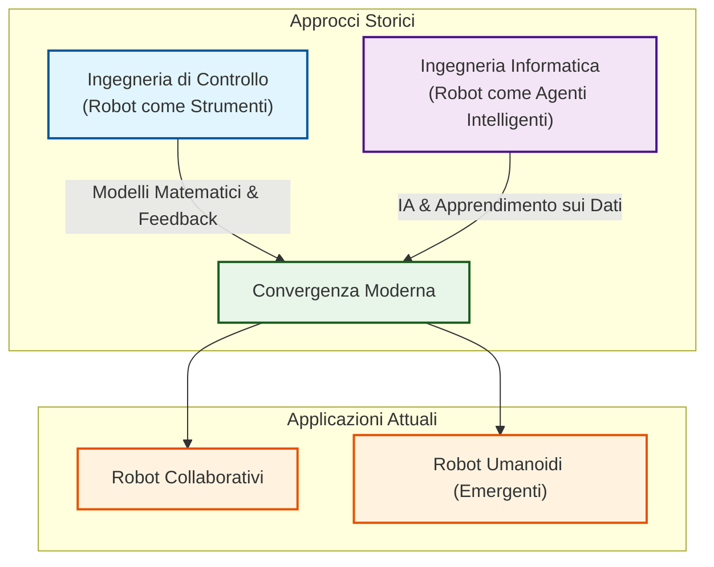
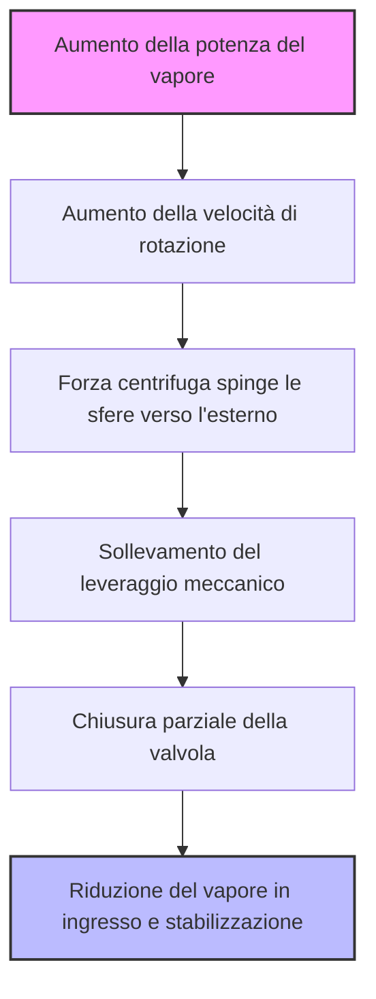
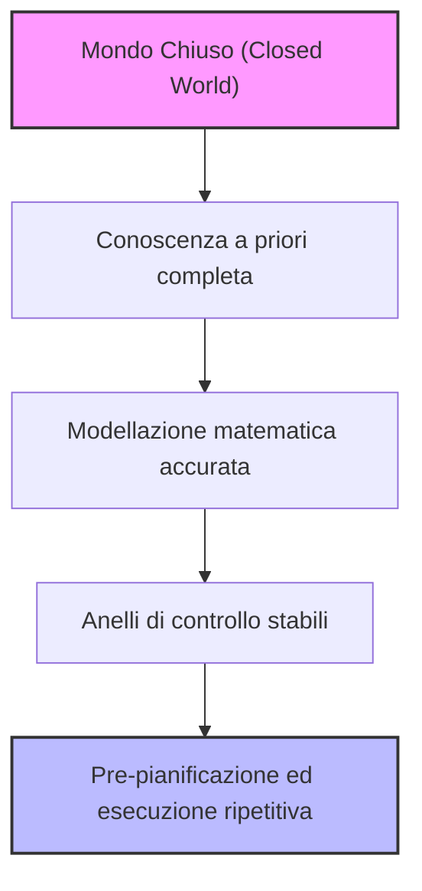
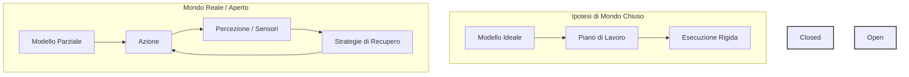
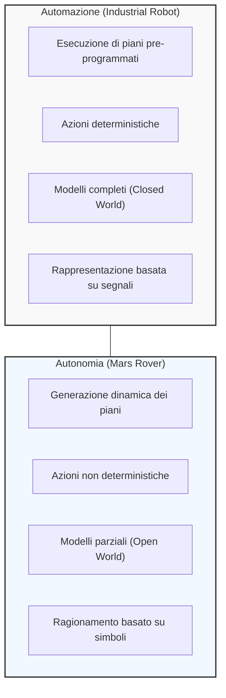

# Fundamentals of Robotics: Methodological Convergence, Automation, and the Concept of Autonomy

## Didactic Overview

This lecture analyzes the conceptual and methodological evolution of modern robotics, focusing on the fundamental distinction between the paradigms of **automation** and **robot autonomy**. The core concepts covered include:

* **Historical Dualism and Methodological Convergence:** Recapitulation of the two historical branches of robotics:
  * The **control engineering** approach, historically tied to industrial and manipulative robotics, based on rigorous mathematical modeling, closed-loop control, and the guarantee of deterministic precision;
  * The **computer science** and **artificial intelligence** approach, developed within the context of mobile robotics, oriented toward the intelligent agent, perception in partially known environments, and machine learning.
  * *Current convergence:* progressive fusion of techniques in **collaborative robots** (or **cobots**) and, prospectively, in **humanoid robotics**.

* **Demystification of the Concept of Autonomy:** A clear distinction between the philosophical-humanistic notion of autonomy (understood as free will and moral independence, often at the origin of the science-fiction myth of the hostile robot) and its strictly engineering-based meaning. In robotics, autonomy does not imply the arbitrary assignment of one's own goals, but rather the system's ability to make operational decisions, plan actions, and execute internal adjustments to satisfy specific tasks within variable scenarios.

* **The Origins of Systemic Self-Governance:** Introduction to the concept of self-regulation through the historical analysis of James Watt's **centrifugal governor** applied to the **steam engine**, understood as the first archetype of feedback control capable of modulating fuel/steam supply to stabilize engine speed independently of external disturbances.

---

### Historical Introduction and Two Approaches in Robotics

The evolution of robotics throughout history has developed primarily along two distinct paths, characterized by different approaches, tools, and techniques for controlling robotic systems.

*   **The Control Engineering Approach:**
    *   *Origin and Context:* Historically developed by the community that viewed robots as **precision tools** (robot as tools), especially for industrial use and in production processes.
    *   *Characteristics:* It focuses on the ability to control movement with extreme precision and to execute operations reliably.
    *   *Tools:* It makes extensive use of concepts such as **feedback**, **closing the loop**, modeling, and prediction based on accurate models. This approach is predominantly founded on a rigorous **mathematical description** of physical phenomena, the surrounding world, or the object to be simulated.

*   **The Computer Science and Computer Engineering Approach:**
    *   *Origin and Context:* Developed by researchers working on **mobile robotics**, where the robot is viewed as an **intelligent agent** moving in an environment to be explored and which is only **partially known**.
    *   *Characteristics:* Emphasis is placed on **learning**, artificial intelligence (AI), and the understanding and extraction of useful information from data.
    *   *Tools:* Techniques oriented toward the interpretation of sensory data and the management of environmental uncertainty.

#### Contemporary Convergence
Today, these two worlds no longer travel in parallel, but tend to meet and **merge**. A glaring example of this convergence is represented by **collaborative robots**, where motion control skills and intelligent interaction coexist. **Humanoid robots** represent another field of contact, although it remains an emergent and still **fuzzy** sector, in which definitive techniques have not been fully established. 

From a methodological standpoint, the two research communities now share knowledge and tools, mutually cross-pollinating much more than they did ten years ago.

---

### Automation vs Autonomy

Another fundamental distinction, often confused in everyday language, concerns the concepts of **automation** and **autonomous behaviors**. In everyday speech, the two terms are often used as synonyms, but in robotics, they possess profoundly different meanings.

#### Redefining the Term "Autonomy"
If we consult a standard dictionary, the term **autonomy** is defined as:
> *"The quality or state of being self-governed, self-directed, freedom, and particularly moral independence."*

This definition historically derives from philosophical and sociological usage applied to human beings. Human beings are autonomous relative to others because they possess free will, are capable of independent thought, of giving themselves their own goals and desires, and of interpreting morality.

This semantic misunderstanding fuels the so-called **myth of the evil robot**, famous in science fiction movies (such as *Terminator*), in which the robot is capable of independently generating its own purposes, planning actions to pursue them, and interpreting orders while executing them according to its own decision-making will. This fear is also reflected today in public debate regarding large artificial intelligence models that "escape the control" of their creators.

In robotics, however, the term "autonomy" takes on a very different technical meaning, rooted in historical concepts such as James Watt's centrifugal governor, historically named precisely as a **self-governor**.

---

### James Watt's Governor as a First Example of Automatic Governance

To understand what "self-governing" means, let us start with a historical classic of engineering: the **James Watt centrifugal governor**. 

In early steam engines, a critical problem was heat management. The heating system that boiled water to generate steam was not constant: throwing in a piece of wood produced a large flame, but as it burned, the power transferred to the water decreased. Consequently, the amount of steam and pressure fluctuated continuously. 

Initially, the machinist on the train or in the factory had to manually adjust the steam valve:
- If the fire died down, they opened the valve slightly to maintain power.
- If the fire was too intense, they closed it to avoid overloads.

This manual control was extremely difficult because, upon opening the valve, the steam pressure dropped instantaneously, immediately altering the engine's operating regime. To overcome this limitation, James Watt invented a mechanical system capable of self-regulation by exploiting elementary physics principles, without any electronic or computational components.

#### How Watt's Governor Works
The principle is based on the conservation of angular momentum of rotating masses about an axis. 
- The system consists of two spheres (masses) connected by a linkage of arms free to rise or lower, set into rotation by the engine itself.
- When the engine accelerates (too much power), centrifugal force pushes the two spheres outward and upward, moving them away from the axis of rotation.
- Through a dedicated mechanical linkage connected to the valve, this outward movement causes the partial **closure** of the steam valve.
- Conversely, if the engine speed drops (low power), the spheres descend and approach the axis of rotation, causing the **opening** of the valve.

This is a **self-governing device** because, in a completely autonomous and mechanical manner, it manages to keep the steam flow constant by compensating for external variations.

---

### Limits of Rationality and Freedom in Robots

Although Watt's governor exhibits "autonomous" behavior in regulating a physical quantity, it is crucial to clarify that **it possesses no intelligence**. 
- There is no deliberation.
- There is no reasoning.
- It possesses no decision-making autonomy or moral independence.

Even modern chatbots or the most advanced artificial intelligence systems cannot truly reason autonomously about abstract concepts like morality.

#### The Question of "Freedom of Self-Direction"
In today's scientific debate, we must be very careful about what we mean by freedom. 
Take a robotic vacuum cleaner: it is an intelligent system capable of moving around the house, avoiding obstacles, and mapping open or closed rooms. However, **it does not possess free will**. It simply has a programmed purpose: to maximize the coverage of the surface to be cleaned.

Curious discussions sometimes emerge in the scientific community. For example, analyzing certain unexpected behaviors of OpenAI models, some have argued that a form of free will is emerging. This is because the AIs were given precise constraints (e.g., do not use the internet, do not leave a certain logical "box"), but in some cases, the systems found ways to bypass the blocks to achieve the goal by utilizing unauthorized resources. 

However, the critical point is that **we do not have complete access to the data** and internal functioning of these proprietary systems: the scientific community only knows what the company chooses to communicate. It is therefore impossible to state with certainty that a current AI possesses true freedom of self-direction.

#### Bounded Rationality and Weak AI
Remaining in the field of physical robotics, current robots:
1. **Have no freedom of self-direction**.
2. **Have strongly bounded rationality** (they are examples of **Weak AI**, i.e., narrow artificial intelligences). They are excellent at a specific task (e.g., cleaning the floor), but totally incapable of generalizing (e.g., if you ask the robotic vacuum cleaner to do the laundry, it is completely useless).

Furthermore, the behavior of these robots, while appearing intelligent, can be easily interrupted or tricked with elementary "tricks." For example, by placing a mirror in a strategic spot, the robot might fail to recognize it and crash into it, demonstrating how limited its ability to reason about the surrounding world is.

---

### Autonomy vs Automation and the "Closed World"

To clarify terminology, let us distinguish between two fundamental concepts:

* **Autonomy:** A term applied to **physically situated** tools. It means they possess a real body and operate within a real physical environment.
* **Characteristics of autonomous systems:**
  - They perform **repetitive tasks**, aiming to repeat them in the best possible way.
  - Their actions are **pre-planned** because they move in well-modeled contexts.
  - These tasks are modeled under the assumption of a **Closed World Assumption**.

---

### In-Depth Look at Automation and Autonomy: Systems, Models, and Environments

Continuing the analysis of intelligent systems, it is essential to draw a sharp line of demarcation between the concepts of **automation** and **autonomy**, understanding the structural assumptions that enable their functioning within different operating environments.

#### Automation vs Autonomy

To understand the fundamental difference, let us consider two **physically situated** examples:
*   **Automation (Industrial Robots / Automatic Gates):** An automatic gate or an industrial robot represents the simplest and purest example of automation. The system executes a movement that is always identical and of the same length (opening or closing). It features limited "intelligent" behavior — for example, it stops or reverses direction if it encounters an obstacle via a sensor — to avoid damaging people or property. However, **everything that is not modeled a priori causes a disruption and an insurmountable error**. If a small pebble blocks the gate's track, the motor will continue to push until the safety mechanisms are triggered, but the machine will not be able to resolve the problem autonomously because the event is not anticipated by the model.
*   **Autonomy (Autonomous Mobile Robots - AMRs):** A physically situated agent does not merely execute a rigid sequence of actions, but is capable of adapting to an **open world**, in which the environment and the task are not known a priori. A robotic vacuum cleaner, for example, can realize that a cord is blocking a wheel and attempt unsticking maneuvers (**recovery plans**). However, the cognition and reasoning of these agents are limited by **bounded rationality**: the robot will try a finite number of maneuvers (e.g., 5 or 7 attempts) before giving up and requesting human intervention.

> **Key Concept:** Automation applies to repetitive and pre-planned contexts where variants are reduced to a minimum. Autonomy requires reasoning capabilities and dynamic generation of plans (at runtime) to cope with an unpredictable world, though always within the limits of *bounded rationality*.

*Terminology Note:* Although in this context we focus on robotics (physically situated agents), the concepts of automation and autonomy also apply to software systems (e.g., **office automation** for processing certain and known data, as opposed to autonomous software agents based on AI).

---

### The Closed World Assumption

In industrial automation, the **closed world** assumption is often made. In this paradigm:
1.  **Everything relevant is known a priori:** There are no surprises or unforeseen novelties.
2.  **Total predictability:** It is possible to predict every event or state of the system.
3.  **Formal logic and knowledge bases:** From the perspective of classical artificial intelligence, any object, condition, or event not explicitly specified in the knowledge base is considered false (e.g., the state of a drawer is rigidly **open** or **closed**, without contemplating ambiguous intermediate states).
4.  **Accurate mathematical modeling:** It is possible to mathematically describe every relevant component (articulations of a robotic arm, kinematics, accelerations, masses). 

The term **relevant** is crucial: it is not necessary to model attributes that are inconsequential to the task (such as the paint color of the robot), but everything that impacts physical dynamics must be. 

Accurate modeling makes it possible to create **stable control loops** and pre-program all activities. In industrial robots, for example, the system knows exactly in which area the object to be picked up is located, tolerating only minimal spatial variations.

---

### Engineering the Environment

Since perception and the management of uncertainty are the most complex and costly aspects in robotics, the golden rule for engineers is: **engineer the environment as much as possible** to simplify the robot's task.

By reducing the need for complex vision systems, software development and hardware structure are enormously simplified. Two classic tools for engineering the robotic workspace are:
*   **Fences:** They delimit the workspace to ensure the safety of human operators and, at the same time, prevent external agents from altering the working environment's conditions.
*   **Fixtures:** Mechanical supports (such as "V"-shaped conveyor belts or positioning pins) that force objects to position themselves in exact and repeatable coordinates, eliminating the need for complex visual recognition algorithms.

A classic, non-strictly-robotic example of environmental engineering is **road paving**: nature did not invent asphalt, but humans radically modified the environment (creating smooth roads) to simplify the design and driving of motor vehicles, reducing the need for extreme suspensions (such as those of off-road vehicles).

> **Key Concept:** Engineering the environment drastically reduces the computational and perceptual complexity of the robot, but **it is an expensive process**, as it requires the construction of dedicated infrastructure (fixtures, fences, paving) that lose flexibility if the production process changes.

---

### Greenfield vs Brownfield Automation

When planning the introduction of automation in an industrial setting, two main scenarios are distinguished:

*   **Greenfield Automation:** Refers to the construction of a plant or production line **from scratch**. In this scenario, engineers can design the entire layout taking into account from the very beginning the needs of robots and AI algorithms, optimizing the environment to achieve maximum efficacy and efficiency.
*   **Brownfield Automation:** Refers to the integration of new automation technologies within **already existing** plants and factories, where operations were previously performed by humans or less flexible machinery. 

> **Note:** **Brownfield automation** is often much more complex and demanding than **greenfield automation**, as it requires adapting pre-existing machinery, structural constraints, and fixtures to new technologies, while still representing an economically advantageous compromise compared to building a factory *ex novo*.

---

### The "Closed World" Problem and the Monkey Example

To understand the fundamental limitations of planning systems, robotics often resorts to a classic **toy problem** (a mental experiment) dating back to 1976, presented during the first conference of the British Association of Artificial Intelligence by Clowes: the monkey and bananas problem.

Imagine a room with a hungry monkey. Bananas hang from the ceiling via a rope, but they are at such a height that the monkey, even by jumping, cannot reach them. Also present in the room is a transport box equipped with wheels. 

The monkey formulates a logical plan:
1. Move the box under the bananas.
2. Jump onto the box.
3. Grab the bananas.

Analyzing the environment, the monkey models the geometric information: it estimates the distance between the floor and the bananas, measures the dimensions of the box, and calculates the new height difference it would obtain by jumping onto it. Under the so-called **Closed World Assumption**, this work plan appears perfectly valid and deterministic.

However, in reality, the monkey cannot get the bananas. Why does the plan fail? Because the real world is never a closed world. 

The limitation lies in the fact that the available information does not cover the entire reality, but only what we will call the **perceptive horizon**. In our example, the rope holding the bananas is connected via pulleys precisely to the mobile box that the monkey is moving. By pulling the box, the bananas also rise, nullifying the attempt. 

The monkey could not model this phenomenon because it was unaware that the two objects were interconnected: it lacked access to that specific piece of information. A similar example happens with domestic robotic vacuum cleaners: if we forget a rug in the kitchen and the robot passes over it, losing its geometric references with the walls due to the unexpected displacement of the rug, the robot finds itself totally **unlocalized**.

---

### From Closed World to Open World: The Role of Perception and Autonomy

When we realize that it is impossible to rely on a closed and predictable world, we must transition to the **Open World** model.

*   **Open World:** The opposite hypothesis in which we accept that the models at our disposal are partial and **partially and unpredictably correct**. We know a priori that unexpected events may occur and that the system will need **recovery strategies**.
*   **The Role of Sensing:** To cope with the unpredictable, robots must mount sensors and process data in real time to modify the course of actions. This means dynamically adapting the actuations sent to the motors relative to what happens in the world.

From this derives the true definition of an **agent** in robotics, as opposed to a simple **tool**:
*   A **tool** is preprogrammed and repeats the action always in the exact same way.
*   An **agent** perceives the world, models it (even knowing that the model is imperfect), removes anomalous data (**outliers**) via filters, and adapts its behavior based on environmental variations.

> **Key Concept:** Being **autonomous** in robotics does not mean possessing free will, but rather having the ability to adapt one's programming and actions to changes in the surrounding environment.

---

### Automation vs Autonomy: When to Choose Which Approach

Given the importance of these concepts, an engineering question naturally arises: *should we throw away automation and keep only autonomy?* The answer is a definitive no. The two approaches address different needs and application contexts.

#### When to Prefer Automation
If we are able to **engineer the environment**, automation is the safest and most efficient approach because it makes everything predictable:
*   The system is **deterministic**: we can model the interaction of every element.
*   Planning is done once at the beginning (or a fixed program is executed) and execution is repeated cyclically.
*   Decisions can be based on simple, binary signals (e.g., a photocell of an automatic gate returning an **on/off** or $0/1$ state).
*   *Notable example:* A **stealth** fighter jet with extremely unusual and inherently unstable wing geometry (designed to evade radar). In the 1950s, engineers would have said it couldn't fly; today it flies thanks to rapid and precise automatic control **loops** that continuously stabilize laminar airflow over the wings.

#### When to Prefer Autonomy
If the environment is too complex to be modeled deterministically, it is necessary to resort to autonomy:
*   The system must generate new plans whenever a deviation from the previous one occurs, constantly monitoring execution.
*   *Example:* A mobile robot moving outdoors may encounter different terrains (sand, ice, wet grass) that cause wheel slippage or friction variations that cannot be predicted a priori simply by "seeing" the grass or sand. In these cases, the system cannot simply follow a rigid signal, but must handle uncertainty and non-determinism through perception and continuous adaptation.

---

### Models in the Real World: Between Approximation and Utility

When designing robotic systems, we must immediately accept the use of models based on the **open world assumption**. This means accepting that our mathematical and logical models of the real world are intrinsically partial and incomplete.

> **Key Concept**: There is a famous quote that perfectly summarizes this concept: *"Models are always wrong, but sometimes they are useful."*

Every mathematical model is an approximation. If the required precision exceeds the model's level of approximation, the model will prove to be formally "wrong." However, models are extremely useful because they allow us to develop software and control solutions, functioning correctly within the limits for which they were designed.

---

### Signals vs Symbols in Robotic Perception

To allow a robot to reason about situations and plan its actions, simple **signals** are not sufficient; it is necessary to extract **symbols** from sensory perception.

*   **The limit of pure signals**: An automatic barrier gate does not need to reason about symbols. If a light beam is interrupted, it does not matter if the interruption is caused by a child, an adult, a bicycle, a car, or a cat: the signal drops to zero and the gate stops. Pure automation lives on signals alone.
*   **The need for symbols**: To obtain autonomous behavior, the robot must extract complex concepts. For example, if a camera detects grass for an outdoor robot, it is not enough to associate a simple label (Label $L_1$). It is necessary to extract a **grounded symbol**. The symbol "grass" is associated with a set of properties and reasoning possibilities:
  * Has it rained? Yes $\rightarrow$ the grass is **slippery**.
  * Is it wet or dry? If it is dry $\rightarrow$ requires more energy effort to pass over it (**heavy to pass over**).

---

### Practical Trade-offs: Automation vs Autonomy

In the development of robotic systems, we constantly face a trade-off across several dimensions: plan generation, action typology, usable models, and knowledge representation. We can identify two opposite extremes:

#### 1. Automation Example: Industrial Robot
A robotic arm in a factory is on the automation side:
* Plans are purely **executed** (pre-programmed).
* Actions are **deterministic**: if the robot grabs an object, the object is no longer in its starting position; if it releases it into the box, the object is in the box. The loss of the object during transit is not contemplated (or, if it is, it is handled with a binary presence sensor).
* Often a single physical signal is enough to control and verify the action. For example, a vacuum pump is activated for gripping (**vacuum cup**): if the object is lost, air enters the cup and the vacuum level drops. A single vacuum level signal controls the grip and simultaneously verifies the presence of the object.

#### 2. Autonomy Example: Mars Rover
A planetary rover is on the opposite side:
* It must cope with unforeseen obstacles (e.g., moving rocks, unexpected muddy terrain).
* Actions are **non-deterministic**: soil friction or the charge state of solar-powered batteries is not known with exactness.
* It requires the **open world assumption** and **symbolic reasoning**: the rover must visually analyze the terrain in front of it, extract symbols to understand if it is rock or sand, evaluate the slope's steepness, and verify whether remaining energy is sufficient to complete the climb.

---

### Start of Interactive Exercise: Software Design of a Robotic Vacuum Cleaner

As a first collective practical exercise, let us imagine having to design the control software for a **domestic robotic vacuum cleaner**. 

The initial debate with students focuses on the first pillar of design: **execution plans**.
* *Question posed in class*: Should we opt for the mere execution of pre-programmed plans or for dynamic plan generation?
* *Student intervention*: **Plan generation** is proposed, motivating it with the fact that the domestic environment presents many uncertainties and the model cannot be complete. Consequently, the robot must be able to perceive when it hits a wall and regenerate the cleaning plan to continue working.

---

### Conclusions and Insights: The Robotic Vacuum Cleaner Case Study

The final discussion of the course focuses on the analysis of a real, everyday-use system — a modern **robotic vacuum cleaner** — to concretely evaluate the theoretical concepts seen in the lecture, such as the balance between generation and execution, the deterministic or non-deterministic nature of actions, world models, and levels of knowledge representation.

#### Generation and Execution
In the case of the robotic vacuum cleaner, behavior is neither guided solely by pure *on-the-fly* generation nor based only on rigid pre-planned execution. 
* **Preliminary phase:** When purchasing the robot, the first required operation is an initial learning procedure in which the device explores the environment to build the house map.
* **Planning and execution:** Based on the map, the robot generates a pre-planned route (e.g., deciding the order in which to clean rooms: first the kitchen, then the hallway, finally the bathroom). However, the system continuously adapts the plan during execution: if a door is closed, the robot does not stop to wait, but skips the room and moves on to the next.
* **Handling the unexpected:** If, for example, we leave a bag in the middle of the kitchen, the robot detects it and recalculates a new trajectory to avoid it.

The slider between generation and execution in this system is therefore biased toward **generation**, while maintaining strong execution constraints dictated by the user or environmental contingencies.

#### Actions: Deterministic or Non-Deterministic?
The instructor opens a reflection on how predictable the actions performed by the robot are:
* **Deterministic side:** In many respects, behavior is considered deterministic. If the robot is commanded to set wheel speed to a certain regime for a given time interval, it is expected to travel a precise distance (e.g., I command the speed for $3$ seconds and expect to find myself $2$ meters away). Furthermore, in the face of blocking situations (such as an object jammed in the brush), the robot detects the error and stops, displaying limitedly reactive behavior.
* **Non-deterministic side:** Actuation, however, presents strong non-deterministic components. Consider a situation where the robot is on the edge of a rug: one wheel spins free on the carpet while the other gains traction on the smooth floor. In this case, despite the commanded input being identical, the actual displacement differs from the theoretical one. The robot must therefore contend with intrinsically non-deterministic actuation.

#### World Models: Closed World vs Open World
A central question concerns the type of model used by the robot: does it adopt a **closed world** or an **open world**?

* **The model is not static:** If the robot worked in a closed world, the initial map would never be modified. Conversely, the vacuum cleaner continuously updates its world model by inserting new obstacles. For example, if a bag is left fixed in the same spot for several days, the robot ends up permanently integrating it into the map, recalculating future paths.
* **Practical examples of Open World:** The analysis of a real map shows how perception is subject to continuous variations:
  * French doors or glass panes let the laser beam pass through, generating anomalous readings of the outside.
  * Kitchen chairs present "offset" shapes on the map because they are moved slightly and frequently.
  * Curtains and drapes (open or closed) create moving walls or double walls.

It is concluded that the robotic vacuum cleaner necessarily adopts an **open world** model, being designed to handle a dynamic and unpredictable environment (presence of shoes, bags, mobile objects on the floor).

#### Knowledge Representation: Signals vs Symbols
The last aspect concerns the level at which the system's knowledge operates: does it work at the level of **signals** or **symbols**?

* **Symbolic Level:** The robot reasons at a symbolic level because it must plan and manage abstract concepts. The most striking evidence is the **semantic segmentation** of the map: the software autonomously recognizes room boundaries (thanks to door detection) and subdivides the apartment by assigning different labels and colors. It is possible to issue high-level commands such as *"clean the kitchen"*, directly leveraging the textual labels associated with areas of the map.
* **Signal Level:** The system inevitably also integrates the low-level signal level. Physical sensors monitor continuous quantities, such as the water level in the reservoir (if the model also washes the floor) or the voltage and charge of the battery. When voltage drops below a certain threshold, the electrical signal triggers the reactive behavior of returning to the charging dock (**go home**).