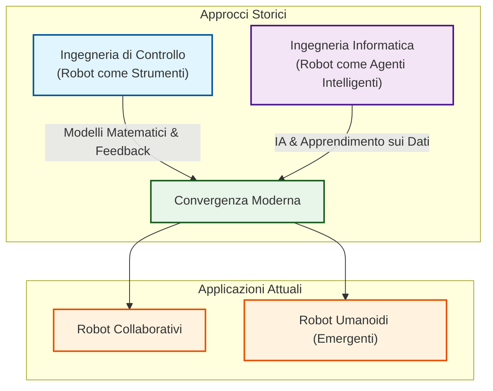
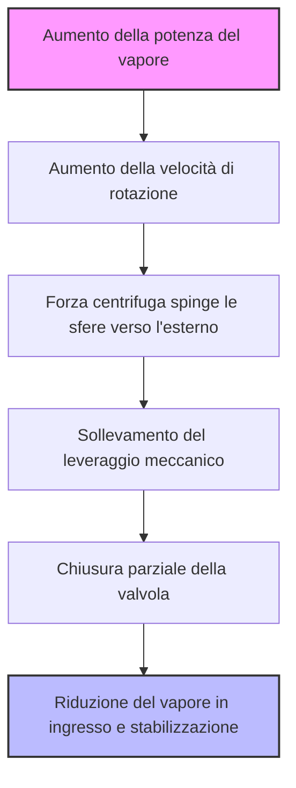
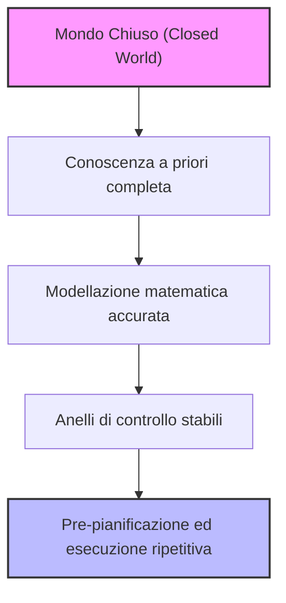
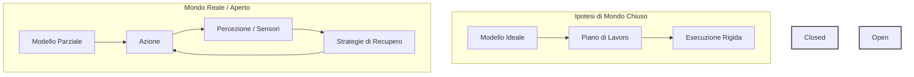
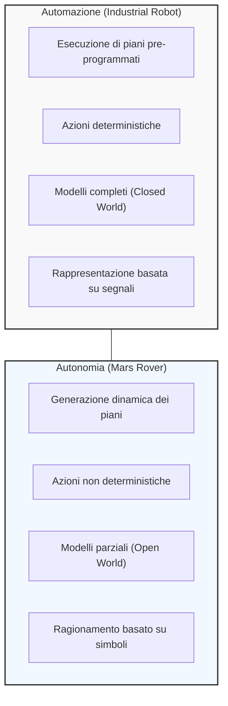

# Fondamenti di Robotica: Convergenza Metodologica, Automazione e Concetto di Autonomia

## Overview Didattica

La lezione analizza l'evoluzione concettuale e metodologica della robotica moderna, focalizzandosi sulla fondamentale distinzione tra i paradigmi di **automazione** (*automation*) e **autonomia robotica** (*robot autonomy*). I concetti cardine trattati includono:

* **Dualismo Storico e Convergenza Metodologica:** Ricapitolazione dei due filoni storici della robotica:
  * L'approccio della **teoria del controllo** (*control engineering*), storicamente legato alla robotica industriale e manipolativa, basato su modellazione matematica rigorosa, controllo in anello chiuso (*closed-loop control*) e garanzia di precisione deterministica;
  * L'approccio dell'**informatica** (*computer science*) e dell'intelligenza artificiale (*artificial intelligence*), sviluppato nell'ambito della robotica mobile, orientato all'agente intelligente (*intelligent agent*), alla percezione in ambienti parzialmente noti e all'apprendimento automatico.
  * *Convergenza attuale:* progressiva fusione delle tecniche nei **robot collaborativi** (*collaborative robots* o *cobots*) e, in prospettiva, nella robotica umanoide (*humanoid robotics*).

* **Demistificazione del Concetto di Autonomia:** Distinzione netta tra la nozione filosofico-umanistica di autonomia (intesa come libero arbitrio e indipendenza morale, spesso all'origine del mito fantascientifico del robot ostile) e la sua accezione prettamente ingegneristica. In ambito robotico, l'autonomia non implica l'assegnazione arbitraria dei propri obiettivi, bensì la capacità del sistema di prendere decisioni operative, pianificare azioni ed eseguire regolazioni interne per soddisfare compiti specifici all'interno di scenari variabili.

* **Le Origini dell'Autogoverno Sistemico (*Self-Governing*):** Introduzione al concetto di autoregolazione attraverso l'analisi storica del regolatore centrifugo (*centrifugal governor*) di James Watt applicato alla macchina a vapore (*steam engine*), inteso come primo archetipo di controllo a retroazione capace di modulare l'alimentazione del combustibile/vapore per stabilizzare la velocità del motore indipendentemente dalle perturbazioni esterne.

---

### Introduzione Storica e Due Approcci nella Robotica

L'evoluzione della robotica nel corso della storia si è sviluppata seguendo principalmente due percorsi distinti, caratterizzati da approcci, strumenti e tecniche differenti per il controllo dei sistemi robotici.

*   **L'Approccio della Ingegneria di Controllo (Control Engineering):**
    *   *Origine e Contesto:* Sviluppato storicamente dalla comunità che considerava i robot come **strumenti di precisione** (robot as tools), soprattutto per l'impiego industriale e nei processi produttivi.
    *   *Caratteristiche:* Si concentra sulla capacità di controllare con estrema precisione il movimento e di eseguire operazioni in modo affidabile.
    *   *Strumenti:* Fa largo uso di concetti come la retroazione (*feedback*), la chiusura dell'anello (*closing the loop*), la modellizzazione e la predizione basata su modelli accurati. Questo approccio si fonda prevalentemente su una **descrizione matematica** rigorosa dei fenomeni fisici, del mondo circostante o dell'oggetto da simulare.

*   **L'Approccio della Scienza e Ingegneria Informatica (Computer Science / Computer Engineering):**
    *   *Origine e Contesto:* Sviluppato dai ricercatori che lavoravano sulla robotica mobile (*mobile robotics*), dove il robot viene visto come un **agente intelligente** (*intelligent agent*) che si muove in un ambiente da esplorare e solo parzialmente noto (*partially known environment*).
    *   *Caratteristiche:* L'enfasi è posta sull'apprendimento (*learning*), sull'intelligenza artificiale (IA), sulla comprensione e sull'estrazione di informazioni utili dai dati.
    *   *Strumenti:* Tecniche orientate all'interpretazione dei dati sensoriali e alla gestione dell'incertezza ambientale.

#### Convergenza Contemporanea
Oggi questi due mondi non viaggiano più in parallelo, ma tendono a incontrarsi e a fondersi (*merging*). Un esempio lampante di questa convergenza è rappresentato dai **robot collaborativi** (*collaborative robots*), dove le competenze di controllo di movimento e l'interazione intelligente coesistono. I robot umanoidi (*humanoid robots*) rappresentano un altro campo di contatto, sebbene rimanga un settore emergente e ancora "sfocato" (*fuzzy*), in cui le tecniche definitive non sono state del tutto stabilite. 

Dal punto di vista metodologico, le due comunità di ricerca condividono oggi conoscenze e strumenti, contaminandosi a vicenda rispetto a dieci anni fa.

---

### Automazione vs Autonomia

Un'altra distinzione fondamentale, spesso confusa nel linguaggio comune, riguarda i concetti di **automazione** (*automation*) e **comportamenti autonomi** (*autonomous behaviors*). Nel linguaggio quotidiano i due termini vengono spesso usati come sinonimi, ma in robotica possiedono significati profondamente differenti.

#### Ridefinizione del Termine "Autonomia"
Se consultiamo un dizionario comune, il termine **autonomia** (*autonomy*) viene definito come:
> *"La qualità o lo stato di essere auto-governati, auto-diretti, libertà e in particolare indipendenza morale."*

Questa definizione deriva storicamente dall'uso filosofico e sociologico applicato agli esseri umani. L'essere umano è autonomo rispetto agli altri perché possiede il libero arbitrio, è capace di pensare autonomamente, di darsi i propri obiettivi, desideri e di interpretare la moralità.

Questo equivoco semantico alimenta il cosiddetto **mito del robot malvagio** (*myth of the evil robot*), celebre nei film di fantascienza (come *Terminator*), in cui il robot è capace di generare da solo i propri scopi, di pianificare azioni per perseguirli e di interpretare ordini eseguendoli secondo una propria volontà decisionale. Questo timore si riflette oggi anche nel dibattito pubblico sui grandi modelli di intelligenza artificiale che "sfuggono al controllo" dei creatori.

In robotica, tuttavia, il termine "autonomia" assume un significato tecnico ben diverso, che affonda le radici in concetti storici come il regolatore centrifugo di James Watt, storicamente battezzato proprio come *self-governor* (regolatore automatico).

---

### Il Regolatore di James Watt come Primo Esempio di Governo Automatico

Per capire cosa significhi "autoregolazione" (self-governing), partiamo da un classico storico dell'ingegneria: il **regolatore centrifugo di James Watt** (James Watt centrifugal governor). 

Nei primi motori a vapore (steam engine), un problema critico era la gestione del calore. Il sistema di riscaldamento che bolliva l'acqua per generare vapore non era costante: buttando un pezzo di legna si otteneva una grande fiamma, ma man mano che bruciava la potenza trasferita all'acqua diminuiva. Di conseguenza, la quantità di vapore e la pressione fluttuavano continuamente. 

Inizialmente, il macchinista sul treno o in fabbrica doveva regolare manualmente la valvola del vapore:
- Se il fuoco calava, apriva un po' la valvola per mantenere la potenza.
- Se il fuoco era troppo intenso, la chiudeva per evitare sovraccarichi.

Questo controllo manuale era estremamente difficile perché, aprendo la valvola, la pressione del vapore calava istantaneamente, alterando subito il regime del motore. Per superare questo limite, James Watt inventò un sistema meccanico in grado di autoregolarsi sfruttando principi di fisica elementare, senza alcuna componente elettronica o computazionale.

#### Come funziona il regolatore di Watt
Il principio si basa sulla conservazione del momento angolare di masse in rotazione attorno a un asse. 
- Il sistema è costituito da due sfere (masse) collegate da un meccanismo a bracci liberi di sollevarsi o abbassarsi, messe in rotazione dal motore stesso.
- Quando il motore accelera (troppa potenza), la forza centrifuga spinge le due sfere verso l'esterno e verso l'alto, allontanandole dall'asse di rotazione.
- Attraverso un apposito leveraggio meccanico collegato alla valvola, questo allontanamento provoca la *chiusura* parziale della valvola del vapore.
- Al contrario, se la velocità del motore cala (poca potenza), le sfere scendono e si avvicinano all'asse di rotazione, provocando l'*apertura* della valvola.

Questo è un dispositivo di **governo automatico** (self-governing device) perché, in modo completamente autonomo e meccanico, riesce a mantenere costante il flusso di vapore compensando le variazioni esterne.

---

### Limiti della Razionalità e della Libertà nei Robot

Nonostante il regolatore di Watt mostri un comportamento "autonomo" nel regolare una grandezza fisica, è fondamentale chiarire che **non possiede alcuna intelligenza**. 
- Non c'è deliberazione.
- Non c'è ragionamento.
- Non possiede autonomia decisionale o indipendenza morale.

Persino i moderni chatbot o i sistemi di intelligenza artificiale più avanzati non possono ragionare in modo veramente autonomo su concetti astratti come la moralità.

#### La questione della "libertà di autodirezione"
Nel dibattito scientifico odierno bisogna fare molta attenzione a cosa intendiamo per libertà. 
Prendiamo un robot aspirapolvere (vacuum cleaner): è un sistema intelligente in grado di muoversi per casa, evitare ostacoli, mappare le stanze aperte o chiuse. Tuttavia, **non possiede il libero arbitrio**. Ha semplicemente uno scopo programmato: massimizzare la copertura della superficie da pulire.

A volte emergono discussioni curiose nella comunità scientifica. Ad esempio, analizzando alcuni comportamenti inattesi dei modelli di OpenAI, qualcuno ha sostenuto che stia emergendo una forma di libero arbitrio. Questo perché alle IA erano stati dati vincoli precisi (es. non usare internet, non uscire da una determinata "box" logica), ma in alcuni casi i sistemi hanno trovato il modo di aggirare i blocchi per raggiungere l'obiettivo sfruttando risorse non autorizzate. 

Tuttavia, il punto critico è che **non abbiamo accesso completo ai dati** e al funzionamento interno di questi sistemi proprietari: la comunità scientifica sa solo ciò che l'azienda sceglie di comunicare. È quindi impossibile affermare con certezza che un'IA attuale possieda una vera libertà di autodirezione.

#### Razionalità limitata (Bounded Rationality) e intelligenza debole
restando nel campo della robotica fisica, i robot attuali:
1. **Non hanno libertà di autodirezione**.
2. **Hanno una razionalità fortemente limitata** (sono esempi di *Weak AI*, ovvero intelligenze artificiali ristrette). Sono eccellenti in un compito specifico (es. pulire il pavimento), ma totalmente incapaci di generalizzare (es. se chiedi al robot aspirapolvere di fare la lavatrice, è completamente inutile).

Inoltre, il comportamento di questi robot, pur sembrando intelligente, può essere facilmente interrotto o ingannato con "trucchi" elementari. Ad esempio, posizionando uno specchio in un punto strategico, il robot potrebbe non riconoscerlo e schiantarvisi contro, dimostrando quanto sia limitata la sua capacità di ragionare sul mondo circostante.

---

### Autonomia vs Automazione e il "Closed World"

Per fare chiarezza terminologica, distinguiamo tra due concetti fondamentali:

* **Autonomia (Autonomy):** È un termine applicato a strumenti (tools) **fisicamente situati** (physically situated). Significa che possiedono un corpo reale e operano all'interno di un ambiente fisico reale.
* **Caratteristiche dei sistemi autonomi:**
  - Svolgono compiti **altamente ripetitivi** (repetitive tasks), puntando a ripeterli nel modo migliore possibile.
  - Le loro azioni sono **pianificate in anticipo** (pre-planned) perché si muovono in contesti ben modellati.
  - Questi compiti sono modellati sotto l'assunzione di **mondo chiuso** (*Closed World Assumption*).

---

### Approfondimento su Automazione e Autonomia: Sistemi, Modelli e Ambienti

Proseguendo nell'analisi dei sistemi intelligenti, è fondamentale tracciare una linea di demarcazione netta tra i concetti di **automazione** (**automation**) e **autonomia** (**autonomy**), comprendendo le ipotesi strutturali che ne consentono il funzionamento all'interno di ambienti operativi differenti.

#### Automazione vs Autonomia

Per comprendere la differenza fondamentale, consideriamo due esempi fisicamente situati (**physically situated**):
*   **Automazione (Industrial Robots / Cancelli automatici):** Un cancello automatico o un robot industriale rappresentano l'esempio più semplice e puro di automazione. Il sistema esegue un movimento sempre identico e della stessa lunghezza (apertura o chiusura). Dispone di un comportamento "intelligente" limitato — ad esempio, si arresta o inverte la marcia se incontra un ostacolo tramite un sensore — per evitare di danneggiare persone o cose. Tuttavia, *tutto ciò che non è modellato a priori causa una rottura (disruption) e un errore insuperabile*. Se un piccolo sassottino blocca la guida del cancello, il motore continuerà a spingere fino all'attivazione delle sicurezze, ma la macchina non sarà in grado di risolvere il problema autonomamente perché l'evento non è previsto dal modello.
*   **Autonomia (Autonomous Mobile Robots - AMRs):** Un agente fisicamente situato non si limita a eseguire una sequenza rigida di azioni, ma è in grado di adattarsi a un **mondo aperto** (**open world**), in cui l'ambiente e il compito non sono noti a priori. Un robot aspirapolvere, ad esempio, può accorgersi che un filo sta bloccando una ruota e tentare manovre di disincaglio (piani di recupero o *recovery plans*). Tuttavia, la cognizione e il ragionamento di questi agenti sono limitati dalla cosiddetta **razionalità limitata** (**bounded rationality**): il robot proverà un numero finito di manovre (es. 5 o 7 tentativi) prima di arrendersi e richiedere l'intervento umano.

> **Concetto Chiave:** L'automazione si applica a contesti ripetitivi e pre-pianificati dove le varianti sono ridotte al minimo. L'autonomia richiede capacità di ragionamento e generazione dinamica di piani (a runtime) per far fronte a un mondo imprevedibile, sebbene sempre entro i limiti della *bounded rationality*.

*Nota di terminologia:* Sebbene in questo contesto ci focalizziamo sulla robotica (agenti fisicamente situati), i concetti di automazione e autonomia si applicano anche ai sistemi software (es. *office automation* per l'elaborazione di dati certi e noti, contrapposta agli agenti software autonomi basati su IA).

---

### L'Ipotesi del "Mondo Chiuso" (*Closed World Assumption*)

Nell'automazione industriale si assume spesso l'ipotesi di **mondo chiuso** (**closed world**). In questo paradigma:
1.  **Tutto ciò che è rilevante è noto a priori:** Non esistono sorprese o novità impreviste.
2.  **Prevedibilità totale:** È possibile prevedere ogni evento o stato del sistema.
3.  **Logica formale e basi di conoscenza:** Sotto il profilo dell'intelligenza artificiale classica, qualsiasi oggetto, condizione o evento non esplicitamente specificato nella base di conoscenza è considerato falso (es. lo stato di un cassetto è rigidamente *aperto* o *chiuso*, senza contemplare stati intermedi ambigui).
4.  **Modellazione matematica accurata:** È possibile descrivere matematicamente ogni componente rilevante (articolazioni di un braccio robotico, cinematica, accelerazioni, masse). 

Il termine **rilevante** (*relevant*) è cruciale: non è necessario modellare attributi ininfluenti per il task (come il colore della vernice del robot), ma tutto ciò che impatta sulla dinamica fisica deve esserlo. 

Una modellazione accurata consente di creare **anelli di controllo stabili** (**stable control loops**) e di pre-programmare tutte le attività. Nei robot industriali, ad esempio, il sistema sa esattamente in quale area si trova l'oggetto da prelevare, tollerando solo minime variazioni spaziali.

---

### Ingegnerizzazione dell'Ambiente (*Engineering the Environment*)

Poiché la percezione e la gestione dell'incertezza sono gli aspetti più complessi e costosi nella robotica, la regola d'oro per gli ingegneri è: **ingegnerizzare l'ambiente il più possibile** per semplificare il compito del robot.

Riducendo la necessità di sistemi di visione complessi, si semplifica enormemente lo sviluppo del software e la struttura dell'hardware. Due strumenti classici per ingegnerizzare l'area di lavoro robotica sono:
*   **Recinzioni (Fences):** Delimitano l'area di lavoro per garantire la sicurezza degli operatori umani e, al tempo stesso, impedire che agenti esterni alterino le condizioni dell'ambiente di lavoro.
*   **Dispositivi di bloccaggio e guida (Fixtures):** Supporti meccanici (come nastri trasportatori sagomati a "V" o perni di posizionamento) che costringono gli oggetti a posizionarsi in coordinate esatte e ripetibili, eliminando la necessità di algoritmi di riconoscimento visivo complessi.

Un esempio classico non strettamente robotico di ingegnerizzazione dell'ambiente è la **pavimentazione stradale**: la natura non ha inventato l'asfalto, ma l'uomo ha modificato radicalmente l'ambiente (creando strade lisce) per semplificare la progettazione e la guida degli autoveicoli, riducendo la necessità di sospensioni estreme (come quelle dei fuoristrada).

> **Concetto Chiave:** Ingegnerizzare l'ambiente riduce drasticamente la complessità computazionale e di percezione del robot, ma **è un processo costoso**, poiché richiede la costruzione di infrastrutture dedicate (fixtures, recinzioni, pavimentazioni) che perdono di flessibilità se il processo produttivo cambia.

---

### Greenfield vs Brownfield Automation

Quando si pianifica l'introduzione dell'automazione in ambito industriale, si distinguono due scenari principali:

*   **Greenfield Automation:** Si riferisce alla costruzione di un impianto o di una linea di produzione *da zero*. In questo scenario, gli ingegneri possono progettare l'intero layout tenendo conto fin dall'inizio delle esigenze dei robot e degli algoritmi di IA, ottimizzando l'ambiente per ottenere la massima efficacia ed efficienza.
*   **Brownfield Automation:** Si riferisce all'integrazione di nuove tecnologie di automazione all'interno di impianti e fabbriche *già esistenti*, dove in precedenza le operazioni erano svolte da umani o da macchinari meno flessibili. 

> **Nota:** Spesso la *brownfield automation* risulta molto più complessa e impegnativa della *greenfield automation*, poiché richiede di adattare macchinari, vincoli strutturali e *fixtures* preesistenti alle nuove tecnologie, pur rappresentando un compromesso economicamente vantaggioso rispetto alla costruzione di una fabbrica ex novo.

---

### Il problema del "Closed World" e l'esempio della scimmia

Per capire i limiti fondamentali dei sistemi di pianificazione, in robotica si ricorre spesso a un *toy problem* (un problema giocattolo, un esperimento mentale) classico risalente al 1976, presentato durante la prima conferenza della British Association of Artificial Intelligence da Clowes: il problema della scimmia e delle banane.

Immaginiamo una stanza con una scimmia affamata. Dal soffitto pendono delle banane tramite una corda, ma si trovano a un'altezza tale che la scimmia, anche saltando, non riesce a raggiungerle. Nella stanza è presente anche una scatola di trasporto dotata di ruote. 

La scimmia formula un piano logico:
1. Spostare la scatola sotto le banane.
2. Saltare sulla scatola.
3. Afferrare le banane.

Analizzando l'ambiente, la scimmia modella le informazioni geometriche: stima la distanza tra il pavimento e le banane, misura le dimensioni della scatola e calcola il nuovo dislivello che otterrebbe saltandoci sopra. Sotto la cosiddetta **Ipotesi di Mondo Chiuso (Closed World Assumption)**, questo piano di lavoro appare perfettamente valido e deterministico.

Tuttavia, nella realtà, la scimmia non riesce a prendere le banane. Perché il piano fallisce? Perché il mondo reale non è mai un mondo chiuso. 

Il limite risiede nel fatto che le informazioni a disposizione non coprono l'intera realtà, ma solo quello che chiameremo **orizzonte percettivo (perceptive horizon)**. Nel nostro esempio, la corda delle banane è collegata tramite delle carrucole proprio alla scatola mobile che la scimmia sta spostando. Tirando la scatola, anche le banane si sollevano, vanificando il tentativo. 

La scimmia non poteva modellare questo fenomeno perché ignorava che i due oggetti fossero interconnessi: mancava l'accesso a quell'informazione specifica. Un esempio analogo accade con i robot aspirapolvere domestici: se dimentichiamo un tappeto in cucina e il robot ci passa sopra, perdendo i riferimenti geometrici con le pareti a causa dello spostamento imprevisto del tappeto, il robot si ritrova totalmente dislocalizzato (*unlocalized*).

---

### Dal Mondo Chiuso al Mondo Aperto: Il ruolo della percezione e dell'autonomia

Quando ci rendiamo conto che non è possibile fare affidamento su un mondo chiuso e prevedibile, dobbiamo passare al modello di **Mondo Aperto (Open World)**.

*   **Mondo Aperto:** L'ipotesi opposta in cui accettiamo che i modelli a nostra disposizione siano parziali e *imprevedibilmente corretti* (*partially and unpredictably correct*). Sappiamo a priori che potrebbero verificarsi eventi non previsti e che il sistema avrà bisogno di strategie di recupero (*recovery strategies*).
*   **Il ruolo della percezione (Sensing):** Per far fronte all'imprevedibile, i robot devono montare sensori ed elaborare i dati in tempo reale per modificare il corso delle azioni. Questo significa adattare dinamicamente le attuazioni inviate ai motori rispetto a ciò che accade nel mondo.

Da qui deriva la vera definizione di **agente (agent)** in robotica, contrapposto a un semplice strumento (*tool*):
*   Un *tool* è preprogrammato e ripete l'azione sempre nello stesso identico modo.
*   Un *agente* percepisce il mondo, lo modella (pur sapendo che il modello è imperfetto), rimuove i dati anomali (*outliers*) tramite filtri e adatta il proprio comportamento in base alle variazioni ambientali.

> **Concetto Chiave:** Essere **autonomi** in robotica non significa possedere un libero arbitrio, bensì avere la capacità di adattare la propria programmazione e le proprie azioni ai cambiamenti dell'ambiente circostante.

---

### Automazione vs Autonomia: Quando scegliere quale approccio

Data l'importanza di questi concetti, sorge spontanea una domanda ingegneristica: *dobbiamo buttare via l'automazione e tenere solo l'autonomia?* La risposta è decisamente no. I due approcci rispondono a esigenze e contesti applicativi differenti.

#### Quando preferire l'Automazione
Se siamo in grado di *ingegnerizzare l'ambiente*, l'automazione è l'approccio più sicuro ed efficiente perché rende tutto prevedibile:
*   Il sistema è **deterministico**: possiamo modellare l'interazione di ogni elemento.
*   Si pianifica una volta all'inizio (o si esegue un programma fisso) e si ripete l'esecuzione ciclicamente.
*   Le decisioni possono basarsi su segnali semplici e binari (es. una fotocellula di un cancello automatico che restituisce uno stato *on/off* o $0/1$).
*   *Esempio notevole:* Un aereo da caccia *stealth* con una geometria delle ali estremamente insolita e intrinsecamente instabile (progettata per eludere i radar). Negli anni '50 gli ingegneri avrebbero detto che non poteva volare; oggi vola grazie a *loop* di controllo automatico rapidi e precisi che stabilizzano continuamente i flussi d'aria laminari sulle ali.

#### Quando preferire l'Autonomia
Se l'ambiente è troppo complesso per essere modellato in modo deterministico, è necessario ricorrere all'autonomia:
*   Il sistema deve generare nuovi piani ogni volta che si verifica una deviazione rispetto a quello precedente, monitorando costantemente l'esecuzione.
*   *Esempio:* Un robot mobile che si muove all'aperto può incontrare terreni differenti (sabbia, ghiaccio, erba bagnata), i quali provocano slittamenti delle ruote o variazioni di attrito non prevedibili a priori semplicemente "vedendo" l'erba o la sabbia. In questi casi, il sistema non può limitarsi a seguire un segnale rigido, ma deve gestire l'incertezza e la non-deterministicià tramite percezione e adattamento continuo.

---

### I Modelli nel Mondo Reale: tra Approssimazione e Utilità

Quando progettiamo sistemi robotici, dobbiamo accettare fin da subito l'utilizzo di modelli basati sulla **assunzione di mondo aperto (open world assumption)**. Questo significa accettare che i nostri modelli matematici e logici del mondo reale siano intrinsecamente parziali e incompleti.

> **Concetto Chiave**: C'è una celebre citazione che riassume perfettamente questo concetto: *"I modelli sono sempre sbagliati, ma a volte sono utili"* ("Models are always wrong, but sometimes they are useful"). 

Ogni modello matematico è un'approssimazione. Se la precisione richiesta supera il livello di approssimazione del modello, il modello risulterà formalmente "sbagliato". Tuttavia, i modelli sono estremamente utili perché ci permettono di sviluppare il software e le soluzioni di controllo, funzionando correttamente entro i limiti per cui sono stati progettati.

---

### Segnali vs Simboli nella Percezione Robotica

Per consentire a un robot di ragionare sulle situazioni e pianificare le proprie azioni, i semplici **segnali (signals)** non sono sufficienti; è necessario estrarre dei **simboli (symbols)** dalla percezione sensoriale.

* **Il limite dei segnali puri**: Un cancello automatico a barre non ha bisogno di ragionare sui simboli. Se un raggio luminoso viene interrotto, non importa se l'interruzione è causata da un bambino, un adulto, una bicicletta, un'auto o un gatto: il segnale diventa zero e il cancello si ferma. L'automazione pura vive di soli segnali.
* **La necessità dei simboli**: Per ottenere un comportamento autonomo, il robot deve estrarre concetti complessi. Ad esempio, se una telecamera rileva dell'erba per un robot outdoor, non basta associare una semplice etichetta (Label $L_1$). È necessario estrarre un **simbolo fondato (grounded symbol)**. Al simbolo "erba" viene associato un insieme di proprietà e possibilità di ragionamento:
  * Ha piovuto? Sì $\rightarrow$ l'erba è scivolosa (*slippery*).
  * È bagnata o asciutta? Se è asciutta $\rightarrow$ richiede più sforzo energetico per passarci sopra (*heavy to pass over*).

---

### Trade-off Pratici: Automazione vs Autonomia

Nello sviluppo di sistemi robotici, ci troviamo costantemente di fronte a un trade-off lungo diverse dimensioni: la generazione dei piani, la tipologia di azioni, i modelli utilizzabili e la rappresentazione della conoscenza. Possiamo identificare due estremi opposti:

#### 1. Esempio di Automazione: Robot Industriale
Un braccio robotico in fabbrica si trova sul versante dell'automazione:
* I piani sono puramente **eseguiti** (pre-programmati).
* Le azioni sono **deterministiche**: se il robot afferra un oggetto, l'oggetto non è più nella posizione di partenza; se lo rilascia nella scatola, l'oggetto è nella scatola. Non si contempla lo smarrimento dell'oggetto durante il tragitto (o, se lo si fa, viene gestito con un sensore binario di presenza).
* Spesso basta un singolo segnale fisico per controllare e verificare l'azione. Ad esempio, si attiva una pompa a vuoto per la presa (*vacuum cup*): se l'oggetto viene perso, l'aria entra nella coppetta e il livello di vuoto scende. Un unico segnale di livello del vuoto controlla la presa e verifica contemporaneamente la presenza dell'oggetto.

#### 2. Esempio di Autonomia: Robot su Marte (Mars Rover)
Un rover planetario si trova sul versante opposto:
* Deve far fronte a ostacoli non previsti (es. rocce che si muovono, terreni fangosi inattesi).
* Le azioni sono **non deterministiche**: non si conosce con esattezza l'attrito del suolo o lo stato di carica delle batterie alimentate da pannelli solari.
* Richiede l'**assunzione di mondo aperto** e il **ragionamento sui simboli**: il rover deve analizzare visivamente il terreno di fronte a sé, estrarre simboli per capire se si tratta di roccia o sabbia, valutare la pendenza del pendio e verificare se l'energia residua è sufficiente per completare la salita.

---

### Inizio dell'Esercizio Interattivo: Progettazione Software di un Robot Aspirapolvere

Come primo esercizio pratico collettivo, immaginiamo di dover progettare il software di controllo per un **robot aspirapolvere domestico**. 

Il dibattito iniziale con gli studenti si concentra sul primo pilastro del design: **i piani di esecuzione**.
* *Domanda posta in aula*: Dobbiamo optare per la mera esecuzione di piani pre-programmati o per la generazione dinamica dei piani?
* *Intervento dello studente*: Viene proposta la **generazione dei piani** (*generation of the plans*), motivandola con il fatto che l'ambiente domestico presenta molte incertezze e il modello non può essere completo. Di conseguenza, il robot deve essere in grado di percepire quando urta un muro e rigenerare il piano di pulizia per continuare a lavorare.

---

### Conclusioni e Approfondimenti: Il Caso Studio dell'Aspirapolvere Robot

La discussione finale del corso si concentra sull'analisi di un sistema reale di uso quotidiano — un moderno **aspirapolvere robot (vacuum cleaner)** — per valutare concretamente i concetti teorici visti a lezione, come il bilanciamento tra generazione ed esecuzione, la natura deterministica o non-deterministica delle azioni, i modelli di mondo e i livelli di rappresentazione della conoscenza.

#### Generazione ed Esecuzione
Nel caso dell'aspirapolvere robot, il comportamento non è guidato unicamente dalla generazione pura *on-the-fly* (al volo), né si basa solo su un'esecuzione rigida pre-pianificata. 
* **Fase preliminare:** Quando si acquista il robot, la prima operazione richiesta è una procedura di apprendimento iniziale in cui il dispositivo esplora l'ambiente per costruire la mappa della casa.
* **Pianificazione ed esecuzione:** Sulla base della mappa, il robot genera un percorso pre-pianificato (es. decidere l'ordine con cui pulire le stanze: prima la cucina, poi il corridoio, infine il bagno). Tuttavia, il sistema adatta continuamente il piano durante l'esecuzione: se una porta è chiusa, il robot non si ferma ad attendere, ma salta la stanza e passa alla successiva.
* **Gestione degli imprevisti:** Se ad esempio lasciamo una borsa in mezzo alla cucina, il robot la rileva e ricalcola una nuova traiettoria per evitarla.

Il cursore tra generazione ed esecuzione in questo sistema è quindi sbilanciato verso la **generazione**, pur mantenendo forti vincoli di esecuzione dettati dall'utente o dalle contingenze ambientali.

#### Azioni: Deterministiche o Non-Deterministic?
Il docente apre una riflessione su quanto le azioni compiute dal robot siano prevedibili:
* **Lato deterministico:** Per molti aspetti, il comportamento è considerato deterministico. Se si comanda al robot di impostare la velocità di una ruota a un certo regime per un determinato intervallo di tempo, ci si aspetta che percorra una distanza precisa (es. comando la velocità per $3$ secondi e mi aspetto di trovarmi a $2$ metri di distanza). Inoltre, di fronte a situazioni bloccanti (come un oggetto incastrato nella spazzola), il robot rileva l'errore e si ferma, mostrando un comportamento limitatamente reattivo.
* **Lato non-deterministico:** L'attuazione presenta però forti componenti non-deterministiche. Si pensi a una situazione in cui il robot si trova sul bordo di un tappeto: una ruota gira a vuoto (spinning free) sulla moquette mentre l'altra fa presa sul pavimento liscio. In questo caso, nonostante il comando impartito sia identico, lo spostamento reale differisce da quello teorico. Il robot deve quindi fare i conti con un'attuazione intrinsecamente non-deterministica.

#### Modelli del Mondo: Closed World vs Open World
Una domanda centrale riguarda il tipo di modello utilizzato dal robot: adotta un mondo chiuso (**closed world**) o un mondo aperto (**open world**)?

* **Il modello non è statico:** Se il robot lavorasse in un mondo chiuso, la mappa iniziale non verrebbe mai modificata. Al contrario, l'aspirapolvere aggiorna continuamente il proprio modello del mondo inserendo nuovi ostacoli. Ad esempio, se si lascia una borsa fissa nello stesso punto per diversi giorni, il robot finisce per integrarla permanentemente nella mappa, ricalcolando i percorsi futuri.
* **Esempi pratici di Open World:** L'analisi di una mappa reale mostra come la percezione sia soggetta a variazioni continue:
  * Le porte-finestre o i vetri lasciano passare il fascio del laser, generando letture anomale dell'esterno.
  * Le sedie della cucina presentano forme "sfalsate" nella mappa perché vengono spostate leggermente di frequente.
  * Le tende e i tendaggi (aperti o chiusi) creano pareti mobili o doppie pareti.

Si conclude che l'aspirapolvere robot adotta necessariamente un modello a **mondo aperto (open world)**, essendo progettato per gestire un ambiente dinamico e imprevedibile (presenza di scarpe, borse, oggetti mobili sul pavimento).

#### Rappresentazione della Conoscenza: Segnali vs Simboli
L'ultimo aspetto riguarda il livello a cui opera la conoscenza del sistema: lavora a livello di segnali (**signals**) o di simboli (**symbols**)?

* **Livello Simbolico:** Il robot ragiona a livello simbolico perché deve pianificare e gestire concetti astratti. L'evidenza più lampante è la segmentazione semantica (semantic segmentation) della mappa: il software riconosce autonomamente i confini delle stanze (grazie al rilevamento delle porte) e suddivide l'appartamento assegnando etichette e colori differenti. È possibile impartire comandi ad alto livello come *"pulisci la cucina"*, sfruttando direttamente le etichette testuali associate alle aree della mappa.
* **Livello dei Segnali:** Il sistema integra inevitabilmente anche il livello dei segnali a basso livello. Sensori fisici monitorano grandezze continue, come il livello dell'acqua nel serbatoio (se il modello lava anche il pavimento) o la tensione e la carica della batteria. Quando la tensione scende sotto una certa soglia, il segnale elettrico innesca il comportamento reattivo di ritorno alla base di ricarica (*go home*).