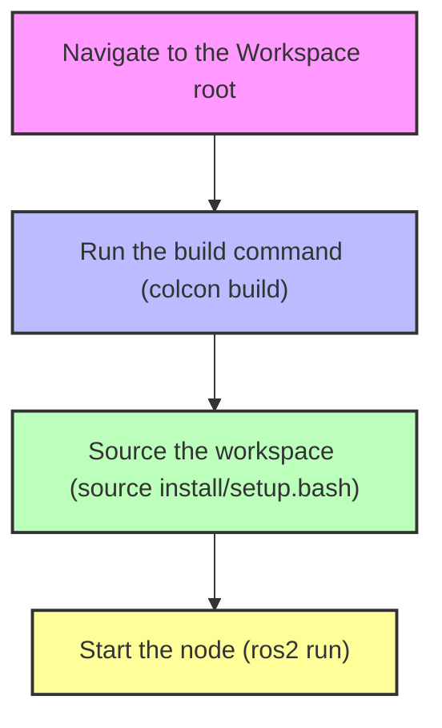
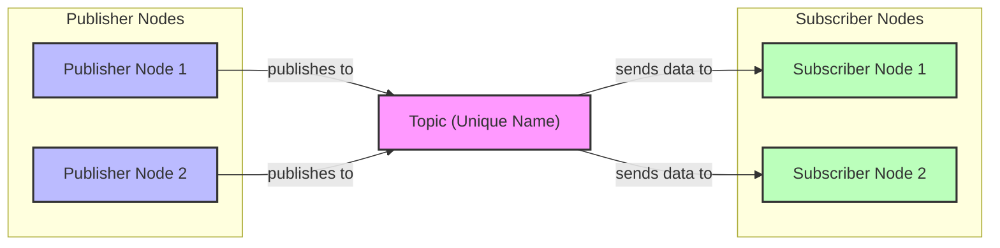
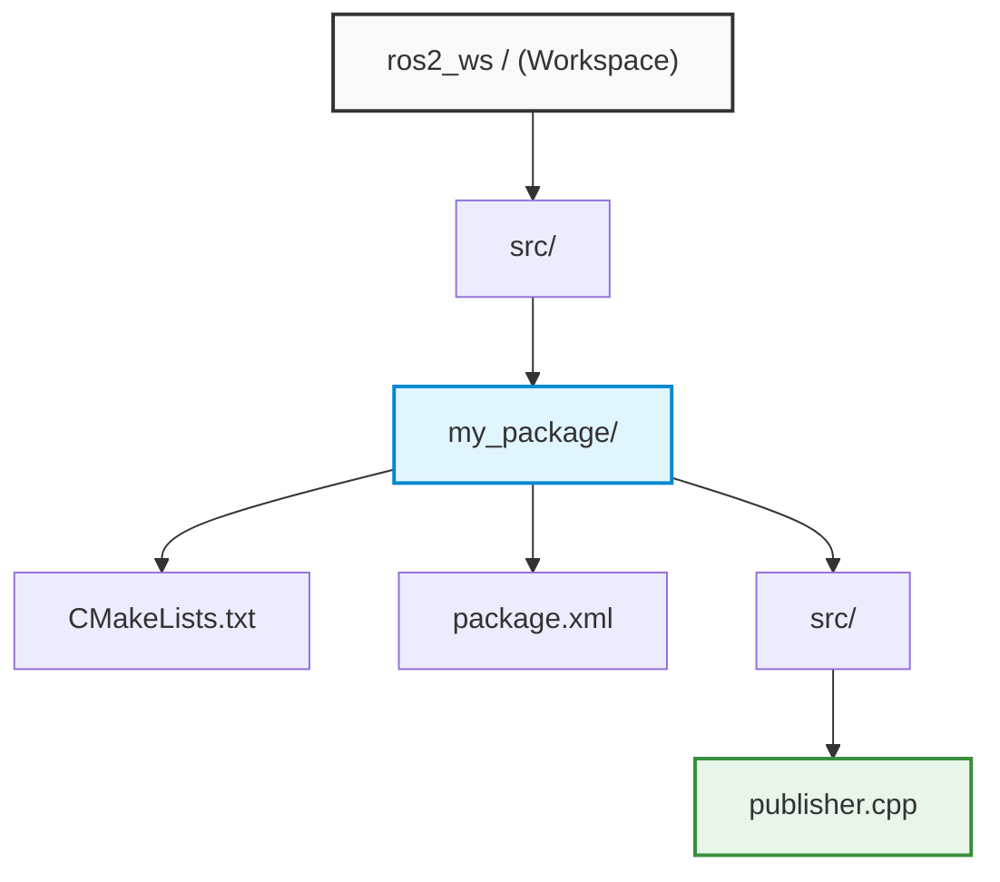
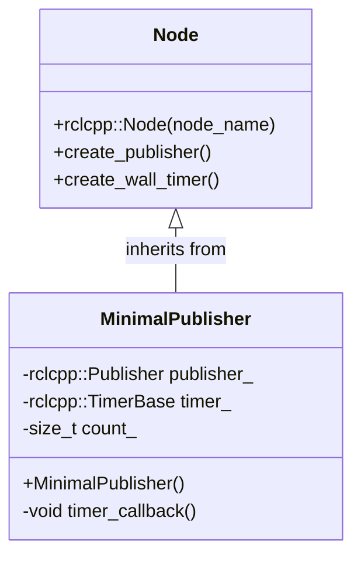
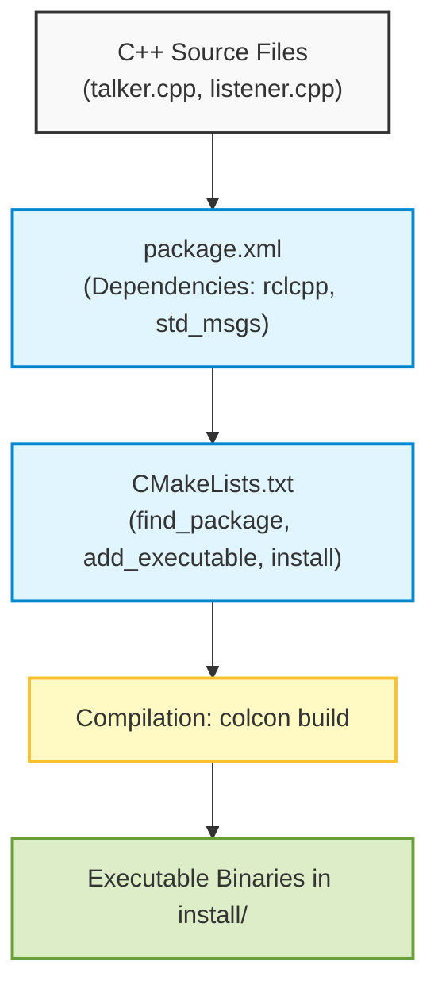

# Development of ROS 2 Nodes in C++ and Publisher-Subscriber Communication Architecture

## Didactic Overview

In this lesson, the fundamental operational concepts of the **ROS 2** framework (*Robot Operating System 2*) are consolidated by analyzing the practical implementation of a periodic node in **C++** and introducing the fundamentals of the message-passing communication model.

The key points covered include:
* **ROS 2 Node Implementation:** utilization of the C++ client library (`rclcpp`), context initialization, memory management via smart pointers (such as `std::shared_ptr`), and creation of a periodic timer (`create_wall_timer`) associated with a callback function.
* **Execution Cycle and Spinning:** understanding the spinning mechanism (`rclcpp::spin`), which is essential to keep the node running and enable the middleware to process events and their relative callbacks.
* **Configuration, Compilation, and Execution Flow:** defining dependencies in the package metadata file (`package.xml`) and build instructions (`CMakeLists.txt` via `find_package` and `ament_target_dependencies`), followed by the operational sequence from the terminal: workspace compilation (*build*), environment loading (*sourcing*), and node execution (`ros2 run`).
* **Command-Line Inspection:** basic commands for analyzing active nodes at runtime (`ros2 node list` and `ros2 node info`).
* **Publisher-Subscriber Architecture:** introduction to the asynchronous communication paradigm based on named channels called topics (*Topics*) and standardized or complex data structures (*Messages*), highlighting supported connection topologies (one-to-one, one-to-many, many-to-many) and the critical importance of topic name consistency to avoid interference or communication failures between nodes.

---

### Solution to the Previous Exercise: Counter Node in C++

As an exercise from the previous lesson, you were asked to modify the classic "Hello World" node to print an incremental integer value (a counter) every two seconds. Let's look in detail at the structure of the C++ code required to implement this functionality.

#### C++ Code Analysis

The source code of the node consists of the following fundamental steps:

*   **Including libraries:** First, it is necessary to include the ROS 2 C++ library, namely `rclcpp`. This library provides all the components needed to interact with the ROS system (creating nodes, topics, services, etc.).
    ```cpp
    #include "rclcpp/rclcpp.hpp"
    ```
*   **Main function (`main`):** Inside the `main`, the first mandatory step consists of initializing the ROS context.
    ```cpp
    int main(int argc, char ** argv) {
        // 1. Initialize ROS context
        rclcpp::init(argc, argv);
        
        // ...
    }
    ```
*   **Creating the Node:** Next, the actual node is instantiated by creating an object of the `rclcpp::Node` class. In our case, we call it `"counter"`. To manage memory automatically and safely, we use a smart pointer (`std::shared_ptr`).
    ```cpp
    auto node = std::make_shared<rclcpp::Node>("counter");
    ```
*   **Initializing the counter variable:** We define a simple integer variable starting from zero.
    ```cpp
    int counter = 0;
    ```
*   **Defining the Timer and Callback Function:** To execute an operation at regular intervals, ROS provides a timer-based mechanism. We exploit the node's `create_wall_timer` method to schedule the periodic execution of a callback function (an anonymous function or *lambda function* in C++) that increments and prints the counter every $2$ seconds.
    ```cpp
    auto timer = node->create_wall_timer(
        std::chrono::seconds(2),
        [node, &counter]() {
            RCLCPP_INFO(node->get_logger(), "Counter: %d", counter);
            counter++;
        }
    );
    ```

> **Key Concept: The Spin Mechanism (`rclcpp::spin`)**
> *Warning:* Once nodes, timers, and callbacks are configured, if you do not start the so-called node **spin**, the C++ program will close immediately without executing any callbacks. The *spin* keeps the node running, allowing ROS to intercept events (such as the timer expiring) and execute the corresponding callback functions until the user explicitly interrupts the process (e.g., via `Ctrl+C`).

Finally, upon closing the program, ROS resources are correctly released:
```cpp
    // 2. Spin the node
    rclcpp::spin(node);

    // 3. Shutdown the ROS context
    rclcpp::shutdown();
    return 0;
}
```

---

### Configuring the ROS 2 Package

Since we introduced a dependency on the `rclcpp` library, writing the C++ code is not enough; we must also update the package's configuration files so that the build system correctly recognizes these dependencies.

1.  **Modifying `package.xml`:**
    Inside this metadata file, we must explicitly declare that our package depends on `rclcpp` by adding the respective dependency tag:
    ```xml
    <depend>rclcpp</depend>
    ```

2.  **Modifying `CMakeLists.txt`:**
    In the CMake configuration file, we must ensure that we find the ROS 2 library and link it to our node's executable target:
    *   Add the directive to find the package:
        ```cmake
        find_package(rclcpp REQUIRED)
        ```
    *   Link the dependency to the node's executable target:
        ```cmake
        ament_target_dependencies(my_node rclcpp)
        ```

---

### Build, Sourcing, and Execution

Once the modifications to the configuration files and source code are complete, we can proceed with compilation and execution inside the terminal.



1.  **Build:** Make sure to position yourself in the main workspace folder (the workspace root, *not* inside the `src` folder):
    ```bash
    colcon build
    ```
2.  **Sourcing:** After compilation, it is necessary to load the workspace configurations into the current terminal:
    ```bash
    source install/setup.bash
    ```
3.  **Execution:** We start the node using the ROS 2 command-line interface (`ros2 run`), specifying the package name and the executable name:
    ```bash
    ros2 run my_package my_node
    ```
    At this point, we observe in the terminal that the node prints the incremental counter value every two seconds.

---

### Useful Commands for Node Inspection

When developing complex systems with ROS 2, it is essential to have tools to monitor the state of active nodes. The main commands shown are:

*   `ros2 node list`: Returns the list of all ROS nodes currently active in the network. If we terminate our node with `Ctrl+C` and rerun the command, we will notice that the `counter` node is no longer present in the list.
*   `ros2 node info <node_name>` (e.g., `ros2 node info counter`): Provides detailed information about a specific running node, including details on associated *Publishers*, *Subscribers*, *Services*, and *Actions* (concepts that will be explored further in upcoming lessons).

---

### Introduction to Topic and Message-Based Communication

A fundamental concept for understanding how communication works within a ROS 2 (Robot Operating System 2) network concerns the ways in which different nodes exchange information. This interaction is based on the **publisher-subscriber** architecture.

In this scheme:
- A node can act as a **publisher** by publishing data on a specific communication channel called a **topic**.
- Another node can act as a **subscriber** by listening (subscribing) to that same topic to receive the information.

Connection relationships can take on different topologies:
- *One-to-one*: a single publisher communicates with a single subscriber.
- *One-to-many*: a publisher sends data to multiple subscribers.
- *Many-to-one*: multiple publishers send data to a single subscriber.
- *Many-to-many*: multiple publishers and subscribers interact on the same topic.



#### Rules and Properties of Topics and Messages
- **Unique topic name**: This is a critical aspect. If two topics with the same name are defined within the same ROS 2 network, messages will overlap or cause interference. Furthermore, the name match must be exact: even a single different character will prevent connection between nodes. The topic is defined directly in the code at the moment the publisher or subscriber is created.
- **Message type**: In addition to the topic name, it is necessary to know the type of data transmitted. Messages can range from very simple information (strings or numbers) to complex data structures, necessary for example to handle video streams from cameras or laser scans from LiDAR sensors.
- **Standard messages (Ready-to-use messages)**: To prevent every developer from having to define data structures from scratch, ROS 2 provides a vast library of predefined messages for common purposes (such as poses, velocities, laser scans, or point clouds). Using these standards greatly simplifies code sharing at the actual community level.

---

### Practical Example: Using a 2D LiDAR Sensor

To concretely understand how this architecture works, let's consider a 2D LiDAR sensor. The sensor itself acts as a publisher node, as it emits data outward via a specific topic and a predefined message format. 

In the specific case shown:
- **Topic name**: `scan left`
- **Message type**: `sensor_msgs/msg/LaserScan`

#### Terminal Commands for Data Inspection

When working with a sensor or developing an application in ROS 2, the terminal offers powerful tools to verify the communication status and data structure.

1. **Verify active topics**:
   To view the list of all topics currently published in the network, use the command:
   ```bash
   ros2 topic list
   ```
   This will return the list, among which we will find our `scan left`.

2. **Inspect a message structure**:
   If you do not know how a message type is internally composed, you can query the ROS 2 interface with the command:
   ```bash
   ros2 interface show sensor_msgs/msg/LaserScan
   ```
   The resulting structure will show several fundamental fields describing the scan:
   - `angle_min`: start angle of the scan (typically $-\pi$ radians).
   - `angle_max`: stop angle of the scan (typically $+\pi$ radians).
   - `angle_increment`: angular resolution between one measurement and the next (often $\pi/180$).
   - `ranges`: a vector (array) containing individual distance measurements expressed in meters.
   - `intensities`: optional field (potentially empty) for signal reflectivity.

3. **Monitor data flow in real time (Echo)**:
   To view the actual data published on the topic, use the `echo` command:
   ```bash
   ros2 topic echo scan left
   ```
   By interrupting execution, you can analyze the message contents in text format: the numerical values present in the `ranges` array represent the distances detected by the sensor relative to the surrounding environment.

#### Graphical Data Visualization
Since raw reading of numerical data from the terminal is difficult to understand, dedicated visualization tools (such as *Rviz*) can be used. Through this software, it is possible to graphically visualize the point cloud or the two-dimensional laser scan (the profile of the room or surrounding environment) by associating it with a specific spatial *reference frame* (`frame_id`).

---

### Command-Line Tools for Message Inspection

Before moving on to writing the code for a *publisher*, it is essential to master certain commands from the ROS 2 CLI (*Command Line Interface*) useful for analyzing the system state and the structure of exchanged data:

*   **Inspecting message structure:**
    ```bash
    ros2 interface show <message_type>
    ```
    This command shows the internal fields that make up a message (for example, for `sensor_msgs/msg/LaserScan` or `std_msgs/msg/String`). It always works, regardless of whether there are active running nodes, since it directly queries the definitions installed on the system.

*   **List of active topics:**
    ```bash
    ros2 topic list
    ```
    Unlike the previous command, `topic list` only returns a result if there are currently running nodes publishing or listening on those channels. If no nodes are active, the output will be empty.

*   **Details on a specific topic:**
    ```bash
    ros2 topic info /topic_name
    ```
    Provides targeted information about the topic: the message type used (e.g., `sensor_msgs/msg/LaserScan`), the number of nodes publishing to it (*publishers*), and the number of nodes listening (*subscriptions*). A typical subscriber example is RViz (*ROS Visualization*), the graphical tool for viewing sensors and environmental data.

---

### Preparing the Development Environment (Workspace and Package)

To develop the C++ node, the directory tree in your workspace (*workspace*) must follow the standard ROS 2 convention:



*   The root folder is our **workspace** (e.g., `workspace/` or `ros2_ws/`).
*   Inside, the `src/` folder must be present, containing software packages.
*   Each individual ROS 2 package must include:
    *   `package.xml`: configuration file with metadata and dependencies.
    *   `CMakeLists.txt`: build rules for CMake.
    *   Its own `src/` subfolder in which to place source code (e.g., `publisher.cpp`).

> **Warning (Source file setup):** To implement the node, we take the code of the minimal node (*minimal publisher*) from the official ROS 2 guide (*Writing a simple publisher and subscriber in C++*) as a reference, saving it inside the `src/` folder of our package under the name `publisher.cpp`.

---

### Anatomy of the Publisher Code in C++

Writing a ROS 2 node follows a series of very precise structural rules, starting from includes down to class-based management.



#### 1. Header Inclusion and Message Inspection
In the C++ file, it is mandatory to import the central ROS 2 framework and the definitions of the messages you intend to use:

```cpp
#include <rclcpp/rclcpp.hpp>
#include <std_msgs/msg/string.hpp>
```

If we want to use a standard string message type (`std_msgs/msg/String`), we can verify its structure from the terminal:
```bash
ros2 interface show std_msgs/msg/String
```
The output shows that the message contains a single field:
```text
string data
```
Consequently, inside the C++ code, to populate the message payload, we will need to access and assign values to the `.data` member precisely.

#### 2. Defining the Node as a C++ Class

> **Key Concept (Object-oriented programming in nodes):** 
> It is considered best architectural practice to program ROS 2 nodes as **C++ classes** derived from `rclcpp::Node`, rather than concentrating all procedural logic inside the `main` function. This guarantees modularity, encapsulation, and facilitates code reuse.

The class inherits publicly from `rclcpp::Node`:
```cpp
class MinimalPublisher : public rclcpp::Node
{
public:
  MinimalPublisher()
  : Node("minimal_publisher"), count_(0)
  {
    // Initialization of publisher and timer
  }
  // ...
};
```

#### 3. Initializing the Publisher and Timer
Inside the class constructor, the main configurations take place:
*   **Creating the Publisher:** A node can instantiate one or more publishers, towards identical or different topics, handling different message types.
    ```cpp
    publisher_ = this->create_publisher<std_msgs::msg::String>("scan", 10);
    ```
    Here we specify:
    1.  The data type in angular brackets: `<std_msgs::msg::String>`.
    2.  The topic name: `"scan"`.
    3.  The Quality of Service (QoS) queue size: `10`.

*   **Creating the Periodic Timer:** To publish at a fixed frequency without blocking the thread, a timer is associated with a callback function:
    ```cpp
    timer_ = this->create_wall_timer(
      500ms, std::bind(&MinimalPublisher::timer_callback, this));
    ```

#### 4. Publication Callback
The function called periodically by the timer executes three logical steps:
1.  Instantiates a message object of the established type (`auto message = std_msgs::msg::String();`).
2.  Populates the `data` field with the desired string (e.g., `"Hello, world! " + std::to_string(count_++)`).
3.  Sends the message on the channel via the `publisher_->publish(message)` method.

---

### Implementing the Subscriber Node

Having completed the publisher node logic, we move on to creating the receiving node, namely the subscriber. In ROS 2, this node is also structured as a C++ class derived from `rclcpp::Node`.

#### Including Dependencies and Callback
Similarly to the publisher, the subscriber must know the data type it will read from the topic:
1. Include the header for the main library `rclcpp/rclcpp.hpp`.
2. Include the message type definition, in this case standard library strings (`std_msgs/msg/string.hpp`).

Inside the class constructor lies the fundamental line for reception: the invocation of `create_subscription`. 

```cpp
subscription_ = this->create_subscription<std_msgs::msg::String>(
    "scan", 10, std::bind(&MinimalSubscriber::topic_callback, this, std::placeholders::_1));
```

> **Key Concept: The Callback Function (Topic Callback)**
> The reception mechanism in ROS 2 is completely asynchronous and event-driven. When we instantiate a subscription with `create_subscription`, we specify two main parameters:
> - The **data type** exchanged (e.g., `std_msgs::msg::String`).
> - The **topic name** (in this case renamed to `"scan"`, consistently with the publisher).
>
> Furthermore, it is necessary to associate a **callback function**. This function establishes what the node must do as soon as a new message is available on the topic. In our didactic case, the callback retrieves the information and prints it to the terminal via logging macros (e.g., `RCLCPP_INFO`).

Finally, in the `main()` function, we invoke `rclcpp::spin(node)`. The spinning function blocks the main thread keeping it actively listening for events, allowing the node to intercept incoming messages and promptly invoke the defined callback.

---

### Configuring the Build System: `package.xml` and `CMakeLists.txt`

In order for the `colcon`-based build system to compile and execute our C++ source files, we must explicitly update the dependencies and executable targets.



#### 1. Declaring dependencies in `package.xml`
Inside the package manifest file, we must declare the dependencies upon which the source code relies:
* `<depend>rclcpp</depend>`
* `<depend>std_msgs</depend>`

#### 2. Defining directives in `CMakeLists.txt`
Inside the `CMakeLists.txt` file, we indicate the compilation steps for both nodes:

* **Package resolution**:
  ```cmake
  find_package(rclcpp REQUIRED)
  find_package(std_msgs REQUIRED)
  ```
* **Creating executables**:
  We add both nodes by associating their respective sources to the binaries (here named for didactic convention `talker` and `listener`):
  ```cmake
  add_executable(talker src/publisher_member_function.cpp)
  ament_target_dependencies(talker rclcpp std_msgs)

  add_executable(listener src/subscriber_member_function.cpp)
  ament_target_dependencies(listener rclcpp std_msgs)
  ```
* **Install Targets**:
  It is mandatory to specify where to install the generated binaries so that ROS 2 can find them at runtime:
  ```cmake
  install(TARGETS
    talker
    listener
    DESTINATION lib/${PROJECT_NAME}
  )
  ```

---

### Compiling and Running the Nodes

Before running the software, it is necessary to compile the workspace and correctly configure the bash environment.

#### Workspace Compilation
Positioning yourself at the root of your workspace (ROS 2 Workspace):
```bash
colcon build
```

> **Key Concept: Environment Sourcing**
> This is a fundamental step without which the terminal will recognize neither ROS 2 commands nor the newly compiled nodes:
> 1. Sourcing the ROS distribution (e.g., Jazzy):
>    ```bash
>    source /opt/ros/jazzy/setup.bash
>    ```
> 2. Sourcing the local overlay generated by the build:
>    ```bash
>    source install/setup.bash
>    ```
> This operation must be repeated **in each new terminal** opened.

#### Parallel Execution
To verify pub/sub communication:
1. **In the first terminal (Publisher)**:
   ```bash
   ros2 run int_rob_labs talker
   ```
   The node will start sending messages (e.g., `"Hello World: 1"`, `"Hello World: 2"`, incrementing the counter $k \in \mathbb{N}$).
2. **In the second terminal (Subscriber)**:
   ```bash
   ros2 run int_rob_labs listener
   ```
   The node will receive the messages conveyed on the topic and print them on screen in real time.

---

### Inspection and Debugging from the Command Line (CLI)

To verify the state of the computational graph without modifying the code, ROS 2 provides powerful command-line tools:

* **List of active topics**:
  ```bash
  ros2 topic list
  ```
  Allows confirming that the renamed topic (e.g., `/scan`) is visible in the system.
* **Inspecting topic properties**:
  ```bash
  ros2 topic info /scan
  ```
  Provides targeted information on the exchanged message type (`std_msgs/msg/String`), as well as the exact count of publishers ($N_p = 1$) and subscribers ($N_s = 1$) currently connected.
* **Real-time content monitoring**:
  ```bash
  ros2 topic echo /scan
  ```
  Creates a temporary subscriber from the terminal that intercepts and prints all data in transit on the selected topic to the screen.

---

### Autonomous Practical Exercise

To complete the lab session, you are required to independently develop an application variant of this architecture:
* Implement an independent Publisher-Subscriber pair.
* Modify the message type: instead of a string (`String`), the communication must transmit a floating-point numerical value, employing the appropriate type (e.g., `Float32` or `Float64` from `std_msgs`).
* Correctly configure `package.xml`, `CMakeLists.txt`, and verify transmission via `ros2 topic echo`.