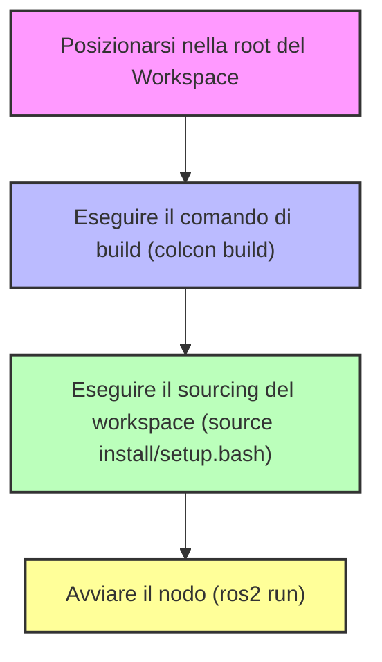
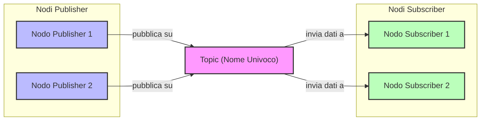
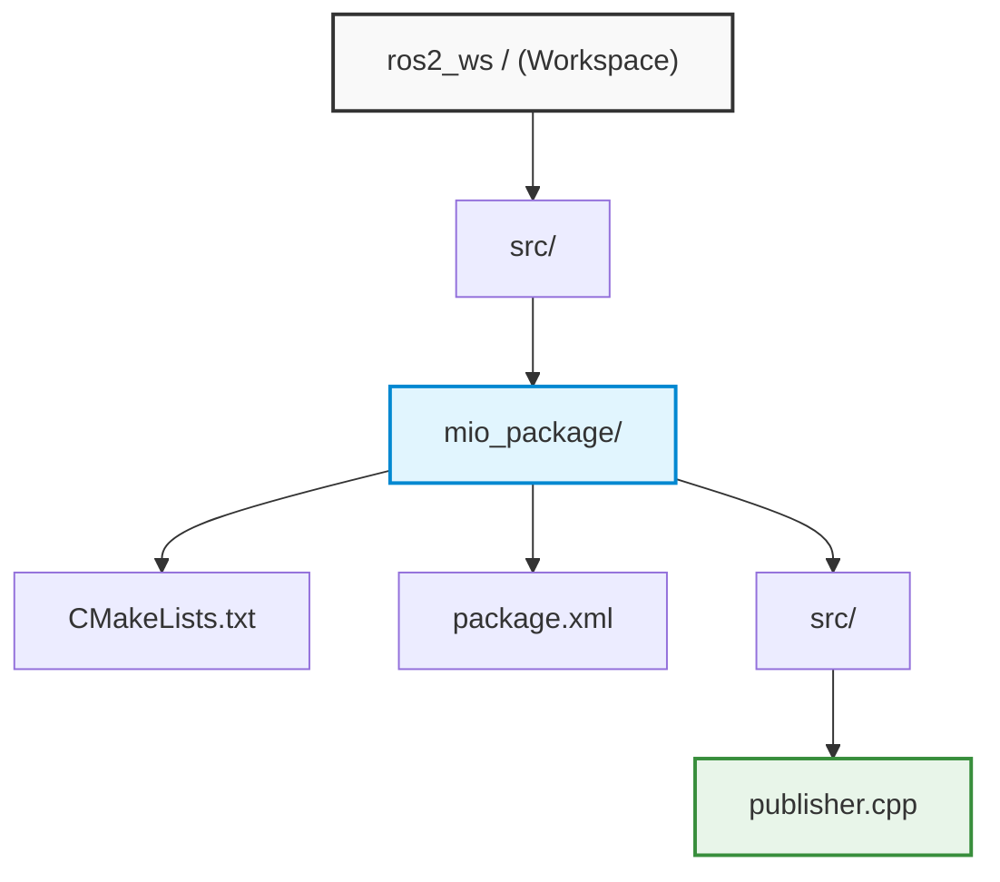
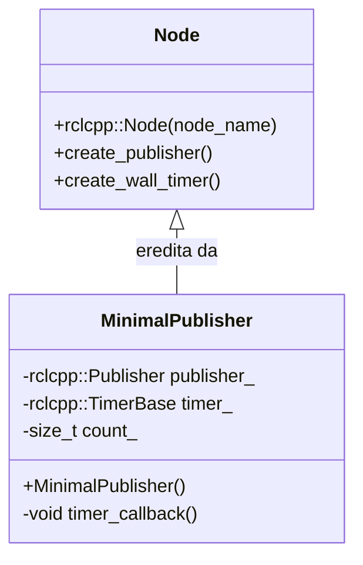
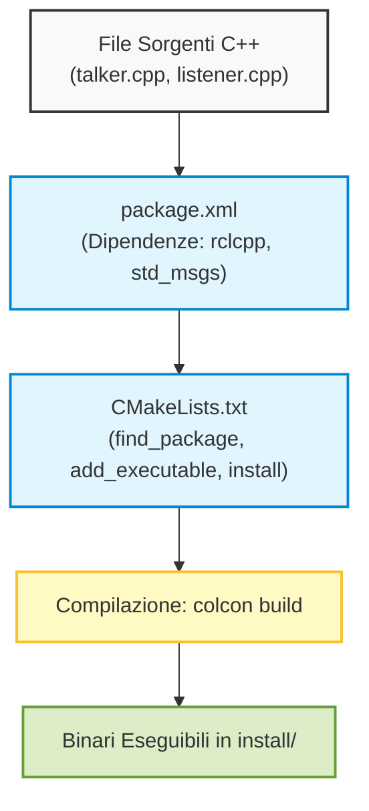

# Sviluppo di Nodi ROS 2 in C++ e Architettura di Comunicazione Publisher-Subscriber

## Overview Didattica

In questa lezione vengono consolidati i concetti operativi fondamentali del framework **ROS 2** (*Robot Operating System 2*), analizzando l'implementazione pratica di un nodo periodico in **C++** e introducendo i fondamenti del modello di comunicazione a scambio di messaggi.

I punti cardine trattati includono:
* **Implementazione di un Nodo ROS 2:** utilizzo della libreria client C++ (`rclcpp`), inizializzazione del contesto, gestione della memoria tramite puntatori intelligenti (*smart pointers* come `std::shared_ptr`) e creazione di un timer periodico (`create_wall_timer`) associato a una funzione di richiamo (*callback function*).
* **Ciclo di Esecuzione e Spinning:** comprensione del meccanismo di *spinning* (`rclcpp::spin`), essenziale per mantenere il nodo in esecuzione e abilitare il processamento degli eventi e delle relative callback da parte del middleware.
* **Flusso di Configurazione, Compilazione ed Esecuzione:** definizione delle dipendenze nel file dei metadati del pacchetto (`package.xml`) e nelle istruzioni di compilazione (`CMakeLists.txt` tramite `find_package` e `ament_target_dependencies`), seguita dalla sequenza operativa da terminale: compilazione del workspace (*build*), caricamento dell'ambiente (*sourcing*) ed esecuzione del nodo (`ros2 run`).
* **Ispezione a Riga di Comando:** comandi base per l'analisi dei nodi attivi a runtime (`ros2 node list` e `ros2 node info`).
* **Architettura Publisher-Subscriber:** introduzione al paradigma di comunicazione asincrono basato su canali denominati topic (*Topics*) e strutture dati standardizzate o complesse (*Messages*), evidenziando le topologie di connessione supportate (uno-a-uno, uno-a-molti, molti-a-molti) e l'importanza critica della coerenza nei nomi dei topic per evitare interferenze o mancate comunicazioni tra nodi.

---

### Soluzione dell'esercizio precedente: Nodo Contatore in C++

Come esercizio della lezione precedente, veniva richiesto di modificare il classico nodo "Hello World" per fare in modo che stampasse un valore intero incrementale (un contatore) ogni due secondi. Vediamo nel dettaglio la struttura del codice C++ necessario per implementare questa funzionalità.

#### Analisi del Codice C++

Il codice sorgente del nodo si compone dei seguenti passi fondamentali:

*   **Inclusione delle librerie:** Per prima cosa, è necessario includere la libreria ROS 2 per C++, ovvero `rclcpp`. Questa libreria mette a disposizione tutti i componenti necessari per interagire con il sistema ROS (creazione di nodi, topic, servizi, ecc.).
    ```cpp
    #include "rclcpp/rclcpp.hpp"
    ```
*   **Funzione principale (`main`):** All'interno del `main`, il primo passo obbligatorio consiste nell'inizializzare il contesto di ROS.
    ```cpp
    int main(int argc, char ** argv) {
        // 1. Inizializzazione del contesto ROS
        rclcpp::init(argc, argv);
        
        // ...
    }
    ```
*   **Creazione del Nodo:** Successivamente, si istanzia il nodo vero e proprio creando un oggetto della classe `rclcpp::Node`. Nel nostro caso, lo chiamiamo `"counter"`. Per gestire la memoria in modo automatico e sicuro, utilizziamo un puntatore intelligente (`std::shared_ptr`).
    ```cpp
    auto node = std::make_shared<rclcpp::Node>("counter");
    ```
*   **Inizializzazione della variabile contatore:** Definiamo una semplice variabile intera partendo da zero.
    ```cpp
    int counter = 0;
    ```
*   **Definizione del Timer e della Callback Function:** Per eseguire un'operazione a intervalli regolari, ROS mette a disposizione un meccanismo basato su timer. Sfruttiamo il metodo `create_wall_timer` del nodo per pianificare l'esecuzione periodica di una funzione di callback (una funzione anonima o *lambda function* in C++) che incrementa e stampa il contatore ogni $2$ secondi.
    ```cpp
    auto timer = node->create_wall_timer(
        std::chrono::seconds(2),
        [node, &counter]() {
            RCLCPP_INFO(node->get_logger(), "Counter: %d", counter);
            counter++;
        }
    );
    ```

> **Concetto Chiave: Il meccanismo di Spin (`rclcpp::spin`)**
> *Attenzione:* Una volta configurati nodi, timer e callback, se non si avvia il cosiddetto **spin** del nodo, il programma C++ si chiuderà immediatamente senza eseguire alcuna callback. Lo *spin* mantiene il nodo in esecuzione, permettendo a ROS di intercettare gli eventi (come lo scadere del timer) e di eseguire le relative funzioni di callback finché l'utente non interrompe esplicitamente il processo (es. tramite `Ctrl+C`).

Infine, alla chiusura del programma, si rilasciano correttamente le risorse ROS:
```cpp
    // 2. Spin del nodo
    rclcpp::spin(node);

    // 3. Chiusura del contesto ROS
    rclcpp::shutdown();
    return 0;
}
```

---

### Configurazione del Package ROS 2

Poiché abbiamo introdotto una dipendenza dalla libreria `rclcpp`, non è sufficiente scrivere il codice C++, ma dobbiamo aggiornare i file di configurazione del package affinché il sistema di build riconosca correttamente tali dipendenze.

1.  **Modifica di `package.xml`:**
    All'interno di questo file di metadati, dobbiamo dichiarare esplicitamente che il nostro package dipende da `rclcpp` aggiungendo il rispettivo tag di dipendenza:
    ```xml
    <depend>rclcpp</depend>
    ```

2.  **Modifica di `CMakeLists.txt`:**
    Nel file di configurazione di CMake dobbiamo assicurarci di trovare la libreria ROS 2 e di collegarla all'eseguibile del nostro nodo:
    *   Aggiungere la direttiva per trovare il pacchetto:
        ```cmake
        find_package(rclcpp REQUIRED)
        ```
    *   Linkare la dipendenza al target eseguibile del nodo:
        ```cmake
        ament_target_dependencies(my_node rclcpp)
        ```

---

### Build, Sourcing ed Esecuzione

Una volta completate le modifiche ai file di configurazione e al codice sorgente, possiamo procedere con la compilazione e l'esecuzione all'interno del terminale.



1.  **Build:** Assicurati di posizionarti nella cartella principale del workspace (la root del workspace, *non* all'interno della cartella `src`):
    ```bash
    colcon build
    ```
2.  **Sourcing:** Dopo la compilazione, è necessario caricare le configurazioni del workspace nel terminale corrente:
    ```bash
    source install/setup.bash
    ```
3.  **Esecuzione:** Avviamo il nodo utilizzando l'interfaccia a riga di comando di ROS 2 (`ros2 run`), specificando il nome del package e il nome dell'eseguibile:
    ```bash
    ros2 run my_package my_node
    ```
    A questo punto, osserviamo nel terminale che il nodo stampa il valore del contatore incrementale ogni due secondi.

---

### Comandi Utili per l'Ispezione dei Nodi

Quando si sviluppano sistemi complessi con ROS 2, è fondamentale disporre di strumenti per monitorare lo stato dei nodi attivi. I comandi principali mostrati sono:

*   `ros2 node list`: Restituisce l'elenco di tutti i nodi ROS attualmente attivi nella rete. Se terminiamo il nostro nodo con `Ctrl+C` e rieseguiamo il comando, noteremo che il nodo `counter` non sarà più presente nella lista.
*   `ros2 node info <nome_nodo>` (es. `ros2 node info counter`): Fornisce informazioni dettagliate su uno specifico nodo in esecuzione, inclusi i dettagli su *Publisher*, *Subscribers*, *Services* e *Actions* associati (concetti che verranno approfonditi nelle prossime lezioni).

---

### Introduzione alla comunicazione basata su topic e messaggi

Un concetto fondamentale per comprendere il funzionamento della comunicazione all'interno di una rete ROS 2 (Robot Operating System 2) riguarda le modalità con cui i diversi nodi si scambiano le informazioni. Questa interazione si basa sull'architettura **publisher-subscriber** (editore-sottoscrittore).

In questo schema:
- Un nodo può fungere da **publisher** pubblicando dati su un determinato canale di comunicazione, chiamato **topic**.
- Un altro nodo può fungere da **subscriber** mettendosi in ascolto (sottoscrivendosi) su quello stesso topic per ricevere le informazioni.

Le relazioni di connessione possono assumere diverse topologie:
- *One-to-one*: un singolo publisher comunica con un singolo subscriber.
- *One-to-many*: un publisher invia dati a molteplici subscriber.
- *Many-to-one*: più publisher inviano dati a un unico subscriber.
- *Many-to-many*: molteplici publisher e subscriber interagiscono sullo stesso topic.



#### Regole e proprietà dei Topic e dei Messaggi
- **Nome univoco del topic**: È un aspetto critico. Se all'interno della stessa rete ROS 2 vengono definiti due topic con lo stesso nome, i messaggi si sovrapporranno o causeranno interferenze. Inoltre, la corrispondenza del nome deve essere esatta: anche un solo carattere differente impedirà la connessione tra i nodi. Il topic viene definito direttamente nel codice nel momento in cui si crea il publisher o il subscriber.
- **Tipo di messaggio**: Oltre al nome del topic, è necessario conoscere il tipo di dati trasmesso. I messaggi possono variare da informazioni molto semplici (stringhe o numeri) a strutture dati complesse, necessarie ad esempio per gestire flussi video da telecamere o scansioni laser da sensori LiDAR.
- **Messaggi standard (Ready-to-use messages)**: Per evitare che ogni sviluppatore debba definire da zero le strutture dati, ROS 2 mette a disposizione una vasta libreria di messaggi predefiniti per scopi comuni (come pose, velocità, scansioni laser o point cloud). L'utilizzo di questi standard semplifica enormemente la condivisione del codice all'effettivo livello della community.

---

### Esempio pratico: Utilizzo di un sensore LiDAR 2D

Per capire concretamente il funzionamento di questa architettura, consideriamo un sensore LiDAR 2D. Il sensore stesso agisce come un nodo publisher, poiché emette dati verso l'esterno tramite un topic specifico e un formato di messaggio predefinito. 

Nel caso specifico mostrato:
- **Nome del topic**: `scan left`
- **Tipo di messaggio**: `sensor_msgs/msg/LaserScan`

#### Comandi da terminale per l'ispezione dei dati

Quando si lavora con un sensore o si sviluppa un'applicazione in ROS 2, il terminale offre strumenti potenti per verificare lo stato della comunicazione e la struttura dei dati.

1. **Verificare i topic attivi**:
   Per visualizzare l'elenco di tutti i topic attualmente pubblicati nella rete, si utilizza il comando:
   ```bash
   ros2 topic list
   ```
   Questo restituirà l'elenco, tra cui troveremo il nostro `scan left`.

2. **Ispezionare la struttura di un messaggio**:
   Se non si conosce come è composto internamente un tipo di messaggio, è possibile interrogare l'interfaccia ROS 2 con il comando:
   ```bash
   ros2 interface show sensor_msgs/msg/LaserScan
   ```
   La struttura risultante mostrerà diversi campi fondamentali che descrivono la scansione:
   - `angle_min`: angolo iniziale della scansione (tipicamente $-\pi$ radianti).
   - `angle_max`: angolo finale della scansione (tipicamente $+\pi$ radianti).
   - `angle_increment`: risoluzione angolare tra una misura e la successiva (spesso $\pi/180$).
   - `ranges`: un vettore (array) contenente le singole misurazioni di distanza espresse in metri.
   - `intensities`: campo opzionale (eventualmente vuoto) per la riflettività del segnale.

3. **Monitorare il flusso dei dati in tempo reale (Echo)**:
   Per visualizzare i dati effettivi pubblicati sul topic, si utilizza il comando `echo`:
   ```bash
   ros2 topic echo scan left
   ```
   Interrompendo l'esecuzione, è possibile analizzare il contenuto dei messaggi in formato testuale: i valori numerici presenti nell'array `ranges` rappresentano le distanze rilevate dal sensore rispetto all'ambiente circostante.

#### Visualizzazione grafica dei dati
Poiché la lettura grezza dei dati numerici da terminale risulta poco comprensibile, è possibile utilizzare strumenti di visualizzazione dedicati (come *Rviz*). Tramite questi software è possibile visualizzare graficamente la nuvola di punti o la scansione laser bidimensionale (il profilo della stanza o dell'ambiente circostante) associandola a un apposito *frame di riferimento* spaziale (`frame_id`).

---

### Strumenti da Riga di Comando per l'Ispezione dei Messaggi

Prima di passare alla scrittura del codice per un *publisher*, è fondamentale padroneggiare alcuni comandi della CLI (*Command Line Interface*) di ROS 2 utili per analizzare lo stato del sistema e la struttura dei dati scambiati:

*   **Ispezione della struttura dei messaggi:**
    ```bash
    ros2 interface show <tipo_di_messaggio>
    ```
    Questo comando mostra i campi interni che compongono un messaggio (ad esempio per `sensor_msgs/msg/LaserScan` o `std_msgs/msg/String`). Funziona sempre, a prescindere dal fatto che vi siano nodi attivi in esecuzione, poiché interroga direttamente le definizioni installate nel sistema.

*   **Elenco dei topic attivi:**
    ```bash
    ros2 topic list
    ```
    A differenza del comando precedente, `topic list` restituisce un risultato solo se ci sono nodi attualmente in esecuzione che stanno pubblicando o ascoltando su quei canali. Se nessun nodo è attivo, l'output sarà vuoto.

*   **Dettagli su un topic specifico:**
    ```bash
    ros2 topic info /nome_del_topic
    ```
    Fornisce informazioni puntuali sul topic: la tipologia di messaggio utilizzata (es. `sensor_msgs/msg/LaserScan`), il numero di nodi che vi pubblicano (*publishers*) e il numero di nodi in ascolto (*subscriptions*). Un esempio tipico di sottoscrittore è RViz (*ROS Visualization*), il tool grafico per visualizzare sensori e dati ambientali.

---

### Preparazione dell'Ambiente di Sviluppo (Workspace e Package)

Per sviluppare il nodo in C++, l'albero delle directory nel proprio spazio di lavoro (*workspace*) deve rispettare la convenzione standard di ROS 2:



*   La cartella radice è il nostro **workspace** (es. `workspace/` o `ros2_ws/`).
*   All'interno deve essere presente la cartella `src/`, contenente i pacchetti software.
*   Ogni singolo pacchetto ROS 2 deve includere:
    *   `package.xml`: file di configurazione con metadati e dipendenze.
    *   `CMakeLists.txt`: regole di compilazione per CMake.
    *   Una propria sottocartella `src/` in cui inserire il codice sorgente (es. `publisher.cpp`).

> **Attenzione (Setup del file sorgente):** Per implementare il nodo, prendiamo come riferimento il codice del nodo minimo (*minimal publisher*) dalla guida ufficiale di ROS 2 (*Writing a simple publisher and subscriber in C++*), salvandolo all'interno della cartella `src/` del nostro pacchetto con il nome `publisher.cpp`.

---

### Anatomia del Codice del Publisher in C++

La scrittura di un nodo ROS 2 segue una serie di regole strutturali ben precise, a partire dalle inclusioni fino alla gestione a classi.



#### 1. Inclusione degli Header e Ispezione del Messaggio
Nel file C++ è obbligatorio importare il framework centrale di ROS 2 e le definizioni dei messaggi che si intendono utilizzare:

```cpp
#include <rclcpp/rclcpp.hpp>
#include <std_msgs/msg/string.hpp>
```

Se vogliamo usare un messaggio standard di tipo stringa (`std_msgs/msg/String`), possiamo verificarne la struttura da terminale:
```bash
ros2 interface show std_msgs/msg/String
```
L'output mostra che il messaggio contiene un singolo campo:
```text
string data
```
Di conseguenza, all'interno del codice C++, per popolare il payload del messaggio dovremo accedere e valorizzare esattamente il membro `.data`.

#### 2. Definizione del Nodo come Classe C++

> **Concetto Chiave (Programmazione orientata agli oggetti nei nodi):** 
> È considerata ottima pratica architetturale programmare i nodi ROS 2 come **classi C++** derivate da `rclcpp::Node`, anziché concentrare tutta la logica procedurale all'interno della funzione `main`. Questo garantisce modularità, incapsulamento e facilita il riuso del codice.

La classe eredita pubblicamente da `rclcpp::Node`:
```cpp
class MinimalPublisher : public rclcpp::Node
{
public:
  MinimalPublisher()
  : Node("minimal_publisher"), count_(0)
  {
    // Inizializzazione di publisher e timer
  }
  // ...
};
```

#### 3. Inizializzazione del Publisher e del Timer
All'interno del costruttore della classe avvengono le configurazioni principali:
*   **Creazione del Publisher:** Un nodo può istanziare uno o più publisher, verso topic uguali o differenti, gestendo tipi di messaggio diversi.
    ```cpp
    publisher_ = this->create_publisher<std_msgs::msg::String>("scan", 10);
    ```
    Qui specifichiamo:
    1.  Il tipo di dato tra parentesi angolari: `<std_msgs::msg::String>`.
    2.  Il nome del topic: `"scan"`.
    3.  La dimensione della coda di qualità del servizio (QoS, *Quality of Service*): `10`.

*   **Creazione del Timer Periodico:** Per pubblicare a una frequenza fissa senza bloccare il thread, si associa un timer a una funzione di callback:
    ```cpp
    timer_ = this->create_wall_timer(
      500ms, std::bind(&MinimalPublisher::timer_callback, this));
    ```

#### 4. Callback di Pubblicazione
La funzione richiamata periodicamente dal timer esegue tre passaggi logici:
1.  Istantia un oggetto messaggio del tipo stabilito (`auto message = std_msgs::msg::String();`).
2.  Popola il campo `data` con la stringa desiderata (es. `"Hello, world! " + std::to_string(count_++)`).
3.  Invia il messaggio sul canale tramite il metodo `publisher_->publish(message)`.

---

### Implementazione del Nodo Sottoscrittore (Subscriber)

Completata la logica del nodo pubblicatore (Publisher), passiamo alla realizzazione del nodo ricevitore, ovvero il sottoscrittore (Subscriber). In ROS 2, anche questo nodo viene strutturato come una classe C++ derivata da `rclcpp::Node`.

#### Inclusione delle Dipendenze e Callback
Analogamente al publisher, il subscriber deve conoscere il tipo di dato che andrà a leggere dal topic:
1. Si include l'intestazione della libreria principale `rclcpp/rclcpp.hpp`.
2. Si include la definizione del tipo di messaggio, in questo caso le stringhe della libreria standard (`std_msgs/msg/string.hpp`).

All'interno del costruttore della classe risiede la riga fondamentale per la ricezione: l'invocazione di `create_subscription`. 

```cpp
subscription_ = this->create_subscription<std_msgs::msg::String>(
    "scan", 10, std::bind(&MinimalSubscriber::topic_callback, this, std::placeholders::_1));
```

> **Concetto Chiave: La Funzione di Callback (Topic Callback)**
> Il meccanismo di ricezione in ROS 2 è completamente asincrono e guidato dagli eventi. Quando istanziamo una sottoscrizione con `create_subscription`, specifichiamo due parametri principali:
> - Il **tipo di dato** scambiato (es. `std_msgs::msg::String`).
> - Il **nome del topic** (in questo caso rinominato in `"scan"`, coerentemente con il publisher).
>
> Inoltre, è necessario associare una **funzione di richiamo (callback function)**. Questa funzione stabilisce cosa deve fare il nodo non appena un nuovo messaggio è disponibile sul topic. Nel nostro caso didattico, la callback preleva l'informazione e la stampa a terminale tramite le macro di logging (es. `RCLCPP_INFO`).

Infine, nella funzione `main()`, invochiamo `rclcpp::spin(node)`. La funzione di *spinning* blocca il thread principale mantenendolo in ascolto attivo degli eventi, permettendo al nodo di intercettare i messaggi in ingresso e invocare tempestivamente la callback definita.

---

### Configurazione del Sistema di Compilazione: `package.xml` e `CMakeLists.txt`

Affinché il sistema di compilazione (Build System) basato su `colcon` sia in grado di compilare ed eseguire i nostri file sorgente C++, dobbiamo aggiornare esplicitamente le dipendenze e i target eseguibili.



#### 1. Dichiarazione delle dipendenze in `package.xml`
All'interno del file manifest del pacchetto dobbiamo dichiarare le dipendenze da cui dipende il codice sorgente:
* `<depend>rclcpp</depend>`
* `<depend>std_msgs</depend>`

#### 2. Definizione delle direttive in `CMakeLists.txt`
All'interno del file `CMakeLists.txt` indichiamo gli step di compilazione per entrambi i nodi:

* **Risoluzione dei pacchetti**:
  ```cmake
  find_package(rclcpp REQUIRED)
  find_package(std_msgs REQUIRED)
  ```
* **Creazione degli eseguibili**:
  Aggiungiamo entrambi i nodi associando al binario il rispettivo sorgente (qui denominati per convenzione didattica `talker` e `listener`):
  ```cmake
  add_executable(talker src/publisher_member_function.cpp)
  ament_target_dependencies(talker rclcpp std_msgs)

  add_executable(listener src/subscriber_member_function.cpp)
  ament_target_dependencies(listener rclcpp std_msgs)
  ```
* **Installazione dei target (Install Targets)**:
  È obbligatorio specificare dove installare i binari generati affinché ROS 2 possa trovarli a runtime:
  ```cmake
  install(TARGETS
    talker
    listener
    DESTINATION lib/${PROJECT_NAME}
  )
  ```

---

### Compilazione ed Esecuzione dei Nodi

Prima di eseguire il software è necessario compilare il workspace e configurare correttamente l'ambiente bash.

#### Compilazione del Workspace
Posizionandosi alla radice del proprio spazio di lavoro (ROS 2 Workspace):
```bash
colcon build
```

> **Concetto Chiave: Sourcing dell'Ambiente**
> È un passaggio fondamentale senza il quale il terminale non riconoscerà né i comandi ROS 2 né i nodi appena compilati:
> 1. Sourcing della distribuzione ROS (es. Jazzy):
>    ```bash
>    source /opt/ros/jazzy/setup.bash
>    ```
> 2. Sourcing dell'overlay locale generato dalla build:
>    ```bash
>    source install/setup.bash
>    ```
> Questa operazione va ripetuta **in ogni nuovo terminale** aperto.

#### Esecuzione Parallela
Per verificare la comunicazione pub/sub:
1. **Nel primo terminale (Publisher)**:
   ```bash
   ros2 run int_rob_labs talker
   ```
   Il nodo avvierà l'invio del messaggio (es. `"Hello World: 1"`, `"Hello World: 2"`, incrementando il contatore $k \in \mathbb{N}$).
2. **Nel secondo terminale (Subscriber)**:
   ```bash
   ros2 run int_rob_labs listener
   ```
   Il nodo riceverà i messaggi veicolati sul topic e li stamperà a schermo in tempo reale.

---

### Ispezione e Debugging da Riga di Comando (CLI)

Per verificare lo stato del grafo computazionale senza modificare il codice, ROS 2 mette a disposizione potenti strumenti da linea di comando:

* **Elenco dei topic attivi**:
  ```bash
  ros2 topic list
  ```
  Permette di confermare che il topic rinominato (es. `/scan`) sia visibile nel sistema.
* **Ispezione delle proprietà del topic**:
  ```bash
  ros2 topic info /scan
  ```
  Fornisce informazioni puntuali sul tipo di messaggio scambiato (`std_msgs/msg/String`), nonché il conteggio esatto del numero di publisher ($N_p = 1$) e subscriber ($N_s = 1$) correntemente connessi.
* **Monitoraggio in tempo reale del contenuto**:
  ```bash
  ros2 topic echo /scan
  ```
  Crea un sottoscrittore temporaneo da terminale che intercetta e stampa a schermo tutti i dati in transito sul topic selezionato.

---

### Esercitazione Pratica Autonoma

A completamento della sessione di laboratorio, è richiesto lo sviluppo in autonomia di una variante applicativa di questa architettura:
* Implementare una coppia Publisher-Subscriber indipendente.
* Modificare il tipo di messaggio: invece di una stringa (`String`), la comunicazione deve trasmettere un valore numerico a virgola mobile, impiegando il tipo appropriato (es. `Float32` o `Float64` da `std_msgs`).
* Configurare correttamente `package.xml`, `CMakeLists.txt` e verificare la trasmissione tramite `ros2 topic echo`.