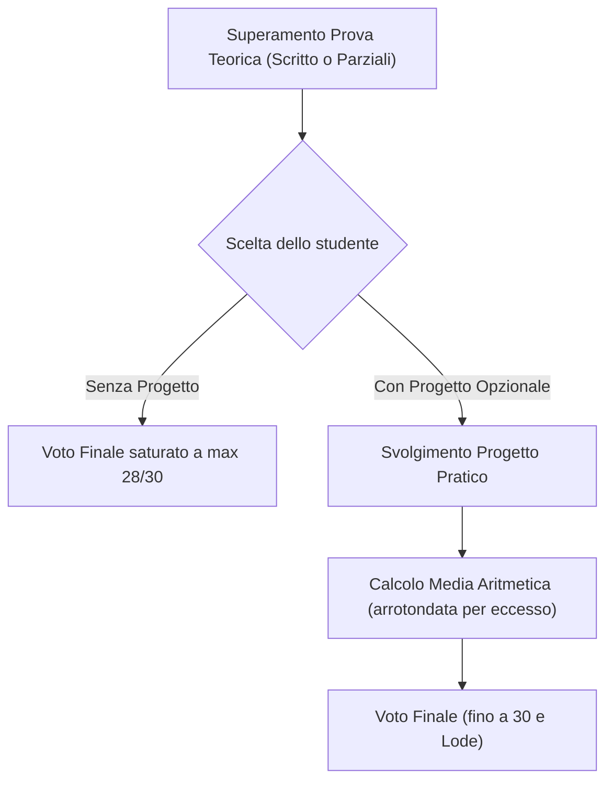
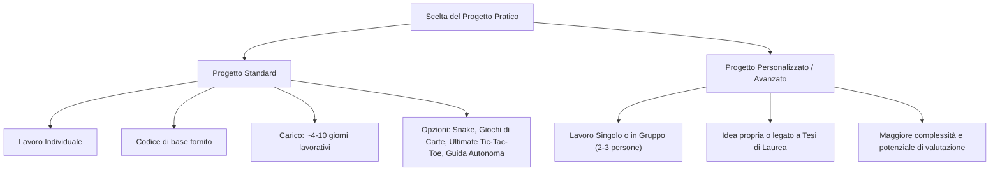
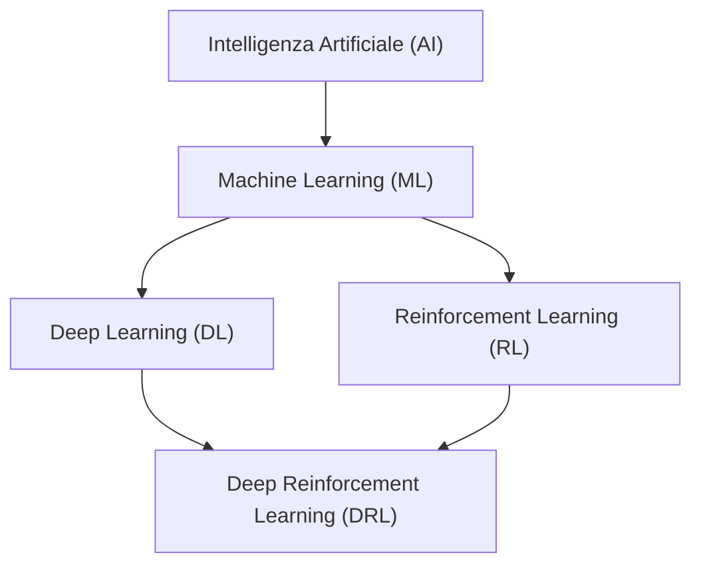

# Introduzione al Corso: Organizzazione, Risorse e Panoramica sul Reinforcement Learning

## Overview Didattica
Questa lezione introduttiva illustra l'organizzazione generale e gli obiettivi didattici del corso di **Apprendimento per Rinforzo** (*Reinforcement Learning - RL*), delineando la struttura dei contenuti teorici e la loro applicazione pratica. Il percorso formativo si articola in due macro-sezioni principali: una prima parte fondamentale basata sulla trattazione sistematica dei metodi tabulari e dell'approssimazione di funzione lineare, ed una seconda parte avanzata rivolta all'**Apprendimento per Rinforzo Profondo** (*Deep Reinforcement Learning*) e all'utilizzo di **modelli non lineari** (*non-linear models*). 

Vengono inoltre presentati i riferimenti bibliografici chiave — con particolare enfasi sul testo di riferimento standard della disciplina di Sutton e Barto — e l'impostazione metodologica del corso, che affianca alla formalizzazione teorica e algoritmica (tramite pseudocodice) la sperimentazione pratica su ambienti di simulazione complessi e benchmark applicativi.

---

### Organizzazione del Corso e Materiale Didattico

#### Accesso ai Canali e Registrazioni
L'iscrizione alla pagina Moodle del corso è ad accesso libero (senza chiave d'iscrizione). 

Sebbene la frequenza in presenza sia vivamente consigliata, tutte le lezioni frontali e le esercitazioni di laboratorio verranno registrate e rese disponibili su Moodle entro poche ore dal termine della classe. Questa modalità è pensata per agevolare chi riscontra sovrapposizioni d'orario con altri corsi (come *Robotica Intelligente (Intelligent Robotics)*) o necessita di rivedere specifici passaggi esplicativi.

#### Materiale di Studio e Testi di Riferimento
Il materiale didattico principale è costituito dalle **slide ufficiali del corso**, le quali coprono circa il 95% degli argomenti d'esame. Eventuali argomenti avanzati o opzionali non presenti nelle slide verranno esplicitamente segnalati durante le lezioni.

Il testo di riferimento fondamentale per la materia è:
* **"Reinforcement Learning: An Introduction"** di Richard S. Sutton e Andrew G. Barto.

> **Concetto Chiave: La "Bibbia" del RL**
> Il libro di Sutton e Barto è considerato lo standard di riferimento globale per l'Apprendimento per Rinforzo (*Reinforcement Learning - RL*). È disponibile gratuitamente in formato PDF online.
> 
> Le prime 12 lezioni del corso seguiranno in modo estremamente sistematico i primi capitoli del testo. Nella parte finale del corso (dal capitolo 13-14 in poi), la trattazione si discosterà parzialmente dal libro: il testo predilige un approccio basato su modelli lineari, mentre a lezione ci si concentrerà maggiormente su modelli non lineari e sull'*Apprendimento per Rinforzo Profondo (Deep Reinforcement Learning)*.

Per la preparazione dell'esame si raccomanda di:
1. Consultare le prove d'esame degli anni precedenti con relative soluzioni (disponibili nella cartella condivisa del corso).
2. Svolgere gli esercizi teorici in coda ai capitoli del libro di Sutton e Barto. Non essendoci soluzioni ufficiali pubblicate per il libro, è possibile mostrare le proprie risoluzioni ai docenti o agli assistenti per una verifica.

---

### Struttura e Valutazione dell'Esame

L'esame verifica la comprensione teorica e algoritmica della materia e prevede la possibilità di integrare un progetto pratico opzionale.

#### Composizione della Prova Scritti e Valutazione
La prova scritta riguarda sia la teoria sia la scrittura di **Pseudocodice (*Pseudocode*)** per gli algoritmi trattati a lezione. La correttezza dello pseudocodice viene valutata dal punto di vista logico e strutturale (non viene compilato o eseguito codice su macchina).

Lo studente può scegliere tra due modalità di completamento dell'esame:

1. **Modalità Solo Teoria (Senza Progetto):**
   * Si sostiene unicamente la prova scritta (o i due parziali).
   * Il voto finale ha un **tetto massimo di 28/30**.

2. **Modalità Teoria + Progetto Pratico (Opzionale):**
   * Si sostiene la prova scritta, la quale in questo caso **non viene saturata a 28**, ma può raggiungere punteggi superiori (fino a $32$ o $33$ in base alla difficoltà dello scritto).
   * Si svolge un progetto pratico di programmazione (*Problem with Project*).
   * Il voto finale è dato dalla media aritmetica tra il voto della teoria e il voto del progetto, **arrotondata per eccesso**:
     $$Voto\_Finale = \left\lceil \frac{Voto\_Teoria + Voto\_Progetto}{2} \right\rceil$$

#### Prove Parziali e Appelli
* **Prove Parziali (*Partials*):** Verranno svolti due parziali durante il semestre (indicativamente a inizio novembre e metà dicembre). L'accesso al secondo parziale è subordinato al superamento del primo.
* **Appelli Regolari:** Sono previsti i classici 4 appelli d'esame distribuiti nella sessione invernale ed estiva/autunnale.
* **Verbalizzazione Flessibile:** Da marzo a settembre vengono aperte apposite "sessioni di registrazione virtuali" mensili per consentire di verbalizzare il voto non appena il progetto viene completato.

#### Scadenze per la Consegna del Progetto Pratico
Per poter consegnare il progetto pratico è necessario aver già superato con esito sufficiente la parte teorica. Le scadenze temporali per la consegna sono così regolamentate:

* **Teoria superata nei Parziali o negli Appelli 1, 2 e 3:** Il progetto può essere consegnato entro la **fine di settembre** dello stesso anno accademico.
* **Teoria superata nel 4° Appello (Settembre):** Il progetto può essere consegnato fino al **31 dicembre** dello stesso anno.

#### Scenari Tipo di Gestione dell'Esame

* **Studente A (Percorso Standard Rapido):** Supera i due parziali a dicembre, consegna il progetto prima dell'inizio del secondo semestre e verbalizza con il massimo dei voti.
* **Studente B (Percorso con Mobilità/Erasmus):** Supera i parziali a dicembre, svolge il progetto durante la pausa estiva e lo consegna entro settembre.
* **Studente C (Percorso Solo Teoria):** Sostiene lo scritto (o i parziali), ottiene un voto teorico elevato ma sceglie di non fare il progetto; verbalizza direttamente il punteggio massimo consentito di $28/30$.
* **Studente D (Sessione Autunnale):** Supera la teoria nel quarto appello (settembre); sfrutta la finestra estesa per consegnare il progetto entro il 31 dicembre.

---

### Tipologie di Progetti Pratici

Nel corso di Apprendimento per Rinforzo (*Reinforcement Learning - RL*), la parte pratica copre un ruolo fondamentale per consolidare la teoria. Vengono offerte due macro-tipologie di progetti: **Progetti Standard** e **Progetti Personalizzati / Avanzati**.

#### Progetti Standard (*Standard Projects*)

I progetti standard sono pensati per richiedere indicativamente tra i **4 e i 10 giorni di lavoro**. Per ciascun progetto viene fornito un codice di base (*base code*) e un ambiente (*environment*) già strutturato, permettendo di concentrarsi direttamente sull'implementazione dell'agente RL.

> **Concetto Chiave: Modalità di Lavoro nei Progetti Standard**
> I progetti standard devono essere svolti **obbligatoriamente in modalità individuale**.

Le opzioni disponibili includono:

1. **Snake**: Addestramento di un agente intelligente per giocare al classico gioco Snake. È un ottimo punto di partenza per verificare il corretto funzionamento degli algoritmi di base.
2. **Giochi di Carte/Tradizionali**: Modellazione di strategie per giochi tradizionali da bar o da tavolo.
3. **Ultimate Tic-Tac-Toe**: Una versione avanzata del tris tradizionale (*Tic-Tac-Toe*). Il tabellone è composto da una griglia $3 \times 3$ di sotto-griglie $3 \times 3$. La mossa effettuata da un giocatore in una casella specifica della sotto-griglia determina in quale sotto-griglia dovrà giocare l'avversario al turno successivo. 
   * *Rilevanza per l'RL*: Richiede una pianificazione e una strategia a lungo termine (*long-term strategy*), rendendo cruciale il bilanciamento tra ricompense immediate e l'assegnazione del credito (*credit assignment*) sul lungo periodo.
4. **Guida Autonoma (*Autonomous Driving*)**: Sviluppo di un agente capace di guidare un veicolo in un ambiente simulato gestendo ostacoli e traiettorie.

---

#### Progetti Personalizzati o Avanzati (*Custom / Advanced Projects*)

Se state già lavorando a un argomento di vostro interesse o volete applicare il *Reinforcement Learning* alla vostra Tesi di Laurea Magistrale (*Master's Thesis*), potete proporre un progetto autonomo.

* **Lavoro di Gruppo**: A differenza dei progetti standard, i progetti avanzati o personalizzati possono essere svolti in gruppi di **2 o 3 persone** (previo accordo con il docente).
* **Valutazione**: Trattandosi di problemi più complessi e meno strutturati, questi progetti presentano una sfida maggiore (*more challenging*), ma offrono un potenziale di valutazione superiore in sede d'esame.

---

### Regole di Comunicazione e Gestione del Corso

Per garantire un flusso di lavoro efficiente ed evitare intoppi burocratici, è necessario attenersi rigorosamente ad alcune regole di comunicazione.

> **Concetto Chiave: Canali Ufficiali di Comunicazione**
> 1. **Solo Email**: Non si accettano chiamate telefoniche né visite improvvisate nello studio del docente senza appuntamento.
> 2. **Tag nell'Oggetto**: Utilizzate sempre il prefisso/tag del corso nell'oggetto dell'email (*email subject tag*). Questo permette di smistare il messaggio direttamente nella cartella corretta ed evitarne lo smarrimento.
> 3. **Gestione dei Dubbi Didattici**: Se inviate un quesito di interesse generale, il docente risponderà direttamente all'inizio della lezione successiva. In questo modo la spiegazione andrà a beneficio di tutta la classe.
> 4. **Domande Rapide**: Per chiarimenti brevi, è preferibile parlare con il docente di persona prima o subito dopo la fine della lezione.

---

### Gestione delle Scadenze e Flusso di Valutazione

Il corso offre massima flessibilità per la consegna dei progetti e la registrazione dei voti.

* **Flessibilità della Data**: Non c'è una scadenza rigida e immediata per la consegna del progetto; c'è la possibilità di completarlo nel corso della carriera accademica.
* **Separazione Teoria/Pratica**: È possibile sostenere prima la prova teorica e successivamente consegnare il progetto pratico (o viceversa). 
* **Procedura di Verbalizzazione**: Quando sostenete e superate una parte dell'esame, il voto parziale o provvisorio viene registrato o congelato in accordo con il docente, in attesa della sottomissione finale del progetto per il calcolo del voto definitivo.

---

H3: Tassonomia della Disciplina: AI, Machine Learning e Deep Learning

Per affrontare in modo rigoroso lo studio dell'Apprendimento per Rinforzo (*Reinforcement Learning - RL*), è fondamentale collocare la materia all'interno del corretto quadro concettuale delle scienze dell'informazione.

#### Definizione di Intelligenza Artificiale (Artificial Intelligence - AI)
L'Intelligenza Artificiale non deve essere necessariamente legata al concetto di intelligenza umana o biologica. In termini ingegneristici, definiamo **IA** qualsiasi macchina o sistema in grado di **replicare o mimare un comportamento o un processo umano**. 
* Un sistema d'IA non deve per forza essere "intelligente" nel senso comune (come un *chatbot* evoluto); anche automatismi e sistemi basati su regole molto semplici rientrano in questa definizione se svolgono compiti precedentemente affidati all'uomo.

#### Machine Learning (ML) e Deep Learning (DL)
* **Apprendimento Automatico (*Machine Learning - ML*)**: È un sottoinsieme dell'IA. La caratteristica fondante del Machine Learning è l'uso dei **dati**. Anziché programmare esplicitamente le regole di un problema, si utilizzano i dati estratti dal mondo reale per descrivere un fenomeno attraverso un modello matematico $y = f(x; \theta)$, consentendo alla macchina di effettuare previsioni o classificazioni.
* **Apprendimento Profondo (*Deep Learning - DL*)**: Rappresenta una famiglia specifica di algoritmi all'interno del Machine Learning, basata sull'uso di reti neurali artificiali profonde. Il Deep Learning si è dimostrato straordinariamente efficace nell'estrarre caratteristiche (*features*) da dati complessi e non strutturati (immagini, audio, testo).

> **Nota sui requisiti**: Per affrontare questo corso non è strettamente obbligatoria una conoscenza pregressa di Machine Learning, anche se risulterà utile. Gli strumenti matematici davvero fondamentali sono l'algebra lineare, elementi di probabilità e la programmazione base. L'integrazione di tecniche di Deep Learning nell'RL verrà trattata ed esplorata nella seconda parte del corso.

---

H3: Il Limite del Machine Learning Classico: Dalla Percezione al Decision Making

I sistemi di Machine Learning tradizionali si concentrano principalmente su problemi "verticali" e ben delimitati, riconducibili a compiti di **percezione** e **previsione**.

#### Il ruolo della Percezione (*Perception*)
In contesti complessi — come la **Guida Autonoma (*Autonomous Driving*)** o la robotica industriale — il Machine Learning classico gestisce la componente sensoriale. 
Prendendo in ingresso dati ad alta dimensione $X$ provenienti da sensori (telecamere, LiDAR, radar), i modelli di ML risolvono problemi di:
* **Classificazione**: Identificare se un oggetto è un pedone, un veicolo o un segnale stradale.
* **Segmentazione**: Delimitare i confini della carreggiata o rilevare difetti in un processo produttivo.
* **Predizione**: Stimare la traiettoria immediata di un ostacolo.

La percezione è una condizione necessaria: se il sistema non è in grado di interpretare lo stato dell'ambiente circostante, non può funzionare in modo sicuro.

#### La necessità del Decision Making a lungo termine

**Concetto Chiave**: Riconoscere un oggetto o stimare uno stato (*Percezione*) non equivale a sapere cosa fare (*Decision Making*). La percezione risponde alla domanda *"Cosa c'è intorno a me?"*, ma non risolve il problema di *"Quale azione devo compiere ora per raggiungere un obiettivo futuro?"*.

Riprendendo l'esempio della guida autonoma:
1. Il sistema di percezione (*ML/DL*) analizza la scena e individua la strada, i pedoni e le altre auto.
2. Il sistema di **Decision Making** (*Reinforcement Learning*) deve invece stabilire la sequenza ottimale di azioni (accelerare, frenare, svoltare) per portare il veicolo dal punto $A$ al punto $B$, garantendo la sicurezza e minimizzando i tempi di percorrenza.

L'Apprendimento per Rinforzo si colloca esattamente in questo spazio: estende il Machine Learning oltre la semplice stima statico-predittiva, fornendo un quadro matematico per **prendere decisioni sequenziali e strategiche a medio e lungo termine** all'interno di un ambiente dinamico.

---

> [!NOTE]
> ### Note per l'Esame e Avvisi del Docente
> - **Modalità dell'esame**: L'esame teorico è una prova scritta (con domande dirette e algoritmi in pseudocodice; il docente ha specificato che non cercherà di "compilare" quanto scritto).
> - **Materiale d'esame**: Circa il 95% del contenuto presente nelle slide fa parte del materiale d'esame. Per esercitarsi, il docente consiglia di consultare la cartella con le prove degli anni precedenti (con soluzioni) e le domande in fondo ai capitoli del libro di testo (Sutton & Barto).
> - **Prove parziali (intermedie)**: Si terranno due prove parziali di pari peso il venerdì pomeriggio alle 16:15 (indicativamente a inizio novembre e metà dicembre). Si può accedere al secondo parziale solo se si è ottenuta la sufficienza nel primo.
> - **Progetto (facoltativo) e Struttura dei voti**: 
>   - Sostenendo solo la prova scritta (o i parziali) senza fare il progetto di programmazione, il voto massimo raggiungibile è **28**.
>   - Svolgendo il progetto (facoltativo), il voto della teoria non viene limitato a 28 e il voto finale sarà la media (arrotondata per eccesso) tra la prova teorica e il progetto.
> - **Scadenze per la consegna del progetto**: Se si ottiene la sufficienza nella teoria (parziali o appelli regolari), si ha tempo fino a fine settembre 2027 per consegnare il progetto. Se la teoria viene superata nell'appello di settembre 2027, la scadenza per il progetto è estesa a fine dicembre 2027.
> - **Tipologia di progetti**: Saranno offerti 4-5 progetti standard (singoli, come Snake, Briscola/Discord, Ultimate Tic-Tac-Toe, guida autonoma) oppure è possibile concordare un progetto personalizzato/avanzato (che può essere svolto anche in piccoli gruppi previa approvazione).