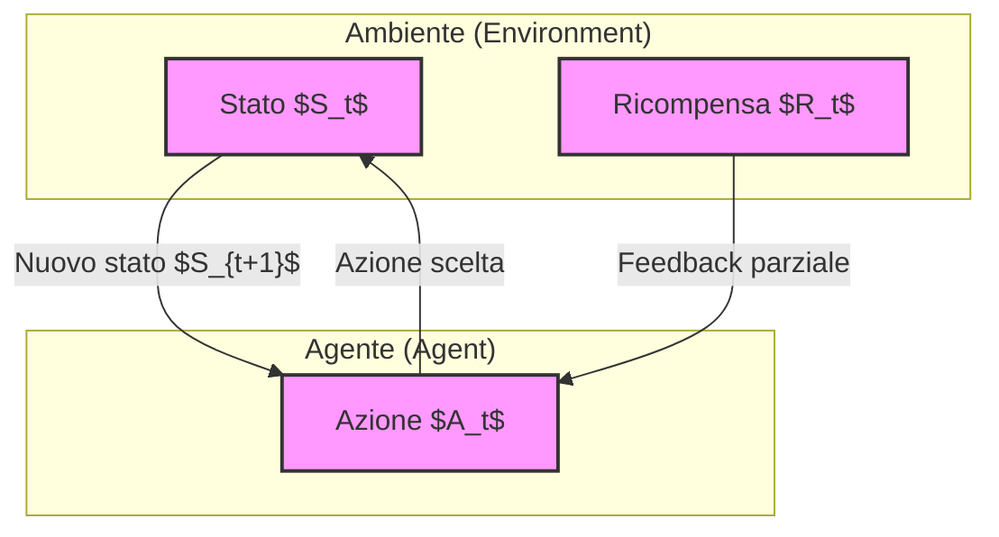
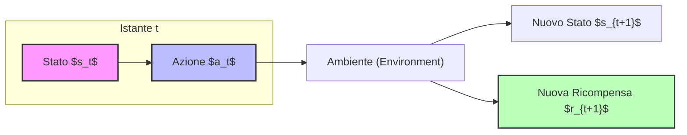
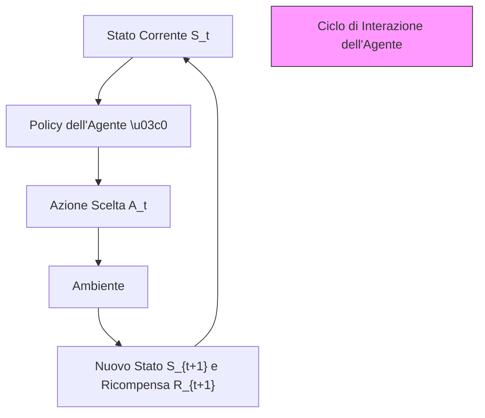
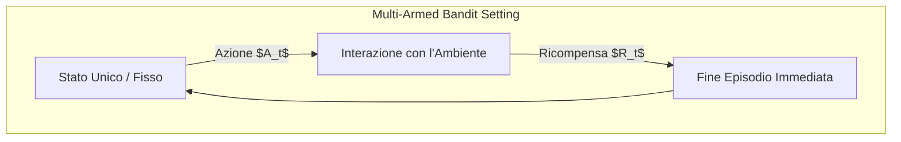
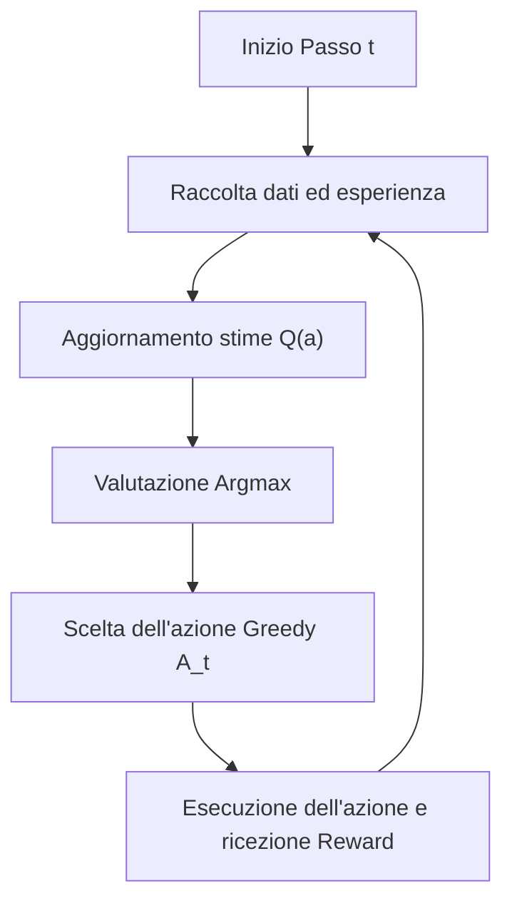

# Apprendimento per Rinforzo: Elementi Fondamentali e Introduzione ai Banditi

## Overview Didattica
In questa lezione vengono introdotti i concetti formali e preliminari dell'Apprendimento per Rinforzo (*Reinforcement Learning* - RL), un paradigma di machine learning basato sull'interazione diretta con il mondo reale e sull'ottimizzazione di obiettivi a lungo termine, senza la necessità di dati storici etichettati. Vengono formalizzati gli elementi costitutivi del sistema di RL: l'Agente (*Agent*), l'Ambiente (*Environment*), gli Stati (*States*) e le Azioni (*Actions*), ponendo le basi teoriche che verranno utilizzate per tutto il corso.

---

### Introduzione al Reinforcement Learning e Definizioni di Base

Il **Reinforcement Learning (RL)** rappresenta un paradigma peculiare all'interno del Machine Learning. A differenza dell'apprendimento supervisionato tradizionale, l'RL non si basa su dataset storici preesistenti, ma permette a un sistema di apprendere interagendo direttamente con il mondo reale. L'obiettivo principale è combinare l'apprendimento con il processo decisionale (decision making), consentendo all'agente di compiere scelte orientate al raggiungimento di obiettivi a lungo termine, come la massimizzazione di ricompense future.

Prima di affrontare problemi complessi su larga scala (spesso risolti tramite tecniche di Deep Learning), è fondamentale comprendere gli elementi costitutivi di base del Reinforcement Learning, che rimarranno invariati per tutto il corso.

---

### Gli Elementi Fondamentali del Reinforcement Learning

Il framework di base si compone di quattro entità principali che interagiscono continuamente in un ciclo chiuso (loop):

#### 1. L'Agente (Agent)
L'agente è l'entità intelligente che dobbiamo addestrare. A differenza dei bot conversazionali basati su IA (dove il termine "agente" può avere accezioni diverse), in questo contesto l'agente possiede *agency*: ha la capacità di compiere scelte autonome. Per farlo, deve essere dotato di strategie adeguate a selezionare l'azione corretta in base a un determinato obiettivo.

#### 2. L'Ambiente (Environment)
Tutto ciò che non è sotto il controllo diretto dell'agente costituisce l'ambiente. Ad esempio, nel caso di una macchina a guida autonoma (self-driving car), l'ambiente è rappresentato dai pedoni, dalla strada, dalla segnaletica e dagli altri veicoli. 

#### 3. Gli Stati (States)
Il concetto di stato in Reinforcement Learning è estremamente simile a quello di stato in teoria dei sistemi e nei sistemi di controllo (rappresentato comunemente dalla variabile $x$). 
Uno **stato** è una descrizione sintetica e completa del problema in un dato momento, contenente tutte le informazioni necessarie per risolverlo. 

* **Notazione:** L'insieme di tutti i possibili stati viene indicato con la lettera calligrafica $\mathcal{S}$. Un singolo stato a un generico istante di tempo $t$ è indicato con la lettera minuscola $S_t$.
* *Esempio per una macchina a guida autonoma:* Lo stato $S_t$ può includere informazioni meteorologiche, velocità attuale, angolo di sterzata delle ruote e distanza dagli ostacoli.

#### 4. Le Azioni (Actions)
Le azioni sono le scelte operative che l'agente può compiere per influenzare l'ambiente e perseguire i propri obiettivi a lungo termine.

* **Notazione:** L'insieme di tutte le azioni possibili è indicato con la lettera calligrafica $\mathcal{A}$. Una singola azione scelta all'istante $t$ è indicata con $A_t$.
* **Dipendenza dallo stato:** In molti casi, l'insieme delle azioni disponibili dipende dallo stato corrente. Ad esempio, se una macchina si trova troppo vicina a un muro, l'azione "girare a destra" potrebbe non essere fisicamente ammissibile. Per indicare questa dipendenza, la notazione formale può essere espressa come $\mathcal{A}(S)$.

---

### L'Interazione tra Agente e Ambiente: Il Ciclo Temporale

Il processo di apprendimento si sviluppa attraverso un'interazione iterativa e continua tra l'agente e l'ambiente nel corso del tempo (discreto, indicato dall'indice $t$). Ad ogni passo temporale $t$:

1. L'agente osserva lo stato corrente $S_t$ e decide di compiere un'azione $A_t$ (anche l'azione di "non fare nulla" è considerata un'azione valida).
2. L'ambiente riceve l'azione $A_t$ e risponde fornendo due elementi chiave:
   * **La Ricompensa (Reward):** Un segnale numerico scalare $R_{t+1}$ che valuta la bontà dell'azione compiuta rispetto all'obiettivo. La ricompensa rappresenta un'informazione parziale (un feedback immediato), non una garanzia assoluta di successo a lungo termine. Può anche essere pari a zero o negativa (penalizzazione).
   * **La Transizione di Stato:** L'ambiente spinge l'agente in un nuovo stato $S_{t+1}$.

Questa sequenza continua passo dopo passo, costituendo la spina dorsale di qualsiasi algoritmo di Reinforcement Learning.

---

### Obiettivi dell'Agente e Struttura Temporale

Il vero obiettivo di un agente (Agent) nell'Apprendimento per Rinforzo (Reinforcement Learning - RL) non è semplicemente raccogliere qualche ricompensa immediata lungo la via, bensì **massimizzare la ricompensa cumulativa** (cumulative reward) a lungo termine. 

Immaginiamo di guidare un'auto autonoma (autonomous car): l'obiettivo finale è arrivare a destinazione sani e salvi. Durante il tragitto, l'agente potrebbe decidere di rallentare, allungando i tempi di percorrenza, pur di evitare incidenti. Questo comporta sacrificare la ricompensa immediata (arrivare prima) per un bene superiore a lungo termine (la sicurezza).

#### La Sequenza Temporale e la Notazione
Nel corso del tempo, l'interazione tra l'agente e l'ambiente si sviluppa in istanti temporali discreti $t$. È fondamentale familiarizzare fin da subito con la notazione standard che useremo costantemente:

- $t$: indica il generico istante temporale discreto (discrete timestamp). La formalizzazione è discreta perché rende gli algoritmi più semplici da spiegare e implementare. Inoltre, se i computer sono abbastanza veloci, possiamo trattare problemi intrinsecamente continui campionandoli a una frequenza molto alta.
- $s_t \in \mathcal{S}$: lo stato (state) dell'agente al tempo $t$, appartenente all'insieme di tutti i possibili stati.
- $a_t \in \mathcal{A}$: l'azione (action) intrapresa al tempo $t$, appartenente all'insieme delle azioni possibili.
- $r_{t+1}$: la ricompensa (reward) ricevuta come conseguenza dell'azione $a_t$, che si osserva insieme al nuovo stato $s_{t+1}$. 
  
*Concetto Chiave:* Notare bene che la ricompensa e il nuovo stato sono indicati con il pedice $t+1$, poiché arrivano *dopo* che l'azione $a_t$ è stata eseguita nello stato $s_t$.

---

### Task Episodici vs Task Continui

A seconda della natura del problema, i task (compiti) in Reinforcement Learning si dividono in due categorie principali:

- **Task Episodici (Episodic Tasks):** Sono problemi che hanno un inizio e una fine naturale (chiamati episodi, *episodes*). Un esempio classico è una partita a scacchi o un gioco sportivo (strutturato in inning): si gioca, la partita finisce, e poi se ne inizia una nuova. L'agente sfrutta l'esperienza accumulata nei giochi precedenti per diventare più intelligente e performare meglio nei episodi successivi.
- **Task Continui (Continuing Tasks):** Sono task che non si fermano mai, senza una conclusione naturale. Esempi tipici sono il controllo della temperatura e del comfort di un edificio (sistema HVAC) o il trading finanziario (portfolio management).

#### Come gestire i task continui?
Anche se la maggior parte degli algoritmi di base è pensata per task episodici, possiamo applicarli anche a contesti continui. Esistono due trucchi principali:
1. **Fattore di sconto (Discount factor):** Un parametro $\gamma$ (gamma) che aggiungeremo agli elementi del sistema per permettere agli approcci episodici di funzionare anche su task che non finiscono mai (lo vedremo a breve nelle prossime lezioni).
2. Tecniche avanzate che vedremo nella seconda parte del corso.

---

### Progettazione delle Ricompense (Reward Design)

> **Concetto Chiave:** In Machine Learning il successo dipende spesso dalla qualità dei dati, ma in *Reinforcement Learning* la definizione corretta della funzione di ricompensa è il fattore più critico in assoluto per il successo (o il fallimento) dell'algoritmo.

La difficoltà nel progettare le ricompense varia a seconda del dominio applicativo:

#### 1. Ambiti in cui la ricompensa è intrinseca al problema
In alcuni contesti, le regole stesse definiscono chiaramente cosa sia una vittoria o una sconfitta:
- **Scacchi o giochi da tavolo:** Vincere dà $+1$, perdere dà $-1$.
- **Trading finanziario:** La ricompensa è già definita dal denaro guadagnato o perso, o dalla fluttuazione del valore delle azioni.

#### 2. Ambiti in cui la ricompensa va progettata (Domain Knowledge)
In molti altri problemi, come la guida autonoma o i sistemi di raccomandazione, spetta al progettista definire la funzione di ricompensa usando la conoscenza del dominio (*domain knowledge*). 

Prendiamo il caso di un'auto autonoma che deve andare dal punto $A$ al punto $B$:
- Vogliamo che segua una traiettoria lineare: potremmo dare $+1$ per ogni istante in cui si trova sulla traiettoria corretta, e $-1$ se ne esce.
- Vogliamo che arrivi in fretta: potremmo penalizzare ogni secondo trascorso con un valore piccolo, ad esempio $-0.1$ per ogni timestamp.
- Vogliamo che eviti gli incidenti: il rischio di crash deve essere fortemente penalizzato, ad esempio con un enorme $-1000$.

Altri esempi di progettazione delle ricompense:
- **Controllo della temperatura:** Se l'obiettivo è mantenere i gradi a $22^\circ\text{C}$, una temperatura di $24^\circ\text{C}$ riceverà una penalità proporzionale all'errore (es. $-2$). Spesso si modella anche un trade-off tra il mantenimento della temperatura desiderata e il risparmio energetico.
- **Online Advertising / Recommendation Systems:** Consigliare un item seguito dall'utente dà una ricompensa positiva (es. $+1$), mentre un annuncio ignorato dà una penalità (es. $-0.2$).
- **Chatbot e Sentiment Analysis:** I chatbot sfruttano feedback espliciti (es. ChatGPT con le risposte A e B valutate dall'utente) ma anche feedback impliciti derivanti dalla soddisfazione dell'utente (se non si arrabbia e non ripete la domanda continuamente).

Durante la teoria di questo corso, non faremo un "tuning" dinamico delle ricompense durante il processo di apprendimento: la funzione di ricompensa viene definita a monte in fase di progettazione del problema e l'agente imparerà a interagire con essa.

---

### Funzione Obiettivo e Ipotesi di Ricompensa

Dato che stiamo interagendo con una macchina, esattamente come nel Machine Learning tradizionale dove definiamo una funzione di perdita (loss function), nel Reinforcement Learning dobbiamo quantificare in modo rigoroso ciò che vogliamo ottenere. 

Il compito fondamentale dell'agente è **massimizzare la ricompensa cumulativa** (*cumulative rewards*), ovvero la somma delle ricompense ottenute nel corso di un episodio o di un flusso continuo di passi temporali.

*   **Concetto Chiave:** **L'Ipotesi di Ricompensa (Reward Hypothesis)**. Questa ipotesi stabilisce che qualsiasi obiettivo desiderato possa essere formalizzato come la massimizzazione della ricompensa cumulativa attesa. In altre parole, qualunque traguardo vogliamo far raggiungere all'agente deve poter essere tradotto in un segnale scalare quantitativo inserito in un'equazione.

#### Conseguenze a lungo termine e ritardo della ricompensa
Spesso l'agente deve perseguire conseguenze a lungo termine, il che significa che le ricompense possono essere ritardate. 
*   *Esempio:* Negli scacchi, potremmo assegnare penalità intermedie come $-0.1$ se perdiamo un pedone o $-0.5$ se perdiamo un alfiere (funzione di *proxy*), accettando sacrifici locali nel corso della partita per raggiungere il risultato finale di dare scacco matto al re.
*   Tuttavia, una formalizzazione più pulita potrebbe limitarsi a $+1$ per la vittoria e $-1$ per la sconfitta. Un altro esempio eccellente è la guida autonoma (*autonomous driving*), dove l'agente può decidere di rallentare temporaneamente non perché sta rischiando di schiantarsi, ma perché rientra nella strategia ottimale per raggiungere il punto B nel minor tempo sicuro possibile.

---

### Dinamica Temporale e Notazione degli Stati

Nel Reinforcement Learning, l'interazione tra agente e ambiente procede a passi discreti nel tempo. A ogni passo temporale $t$ (all'interno di un task episodico o continuo):
1. L'agente si trova in uno stato $S_t$, dove $S_t \in \mathcal{S}$ ($\mathcal{S}$ è l'insieme di tutti i possibili stati).
2. L'agente sceglie un'azione $A_t$, dove $A_t \in \mathcal{A}$ ($\mathcal{A}$ è l'insieme di tutte le azioni legali possibili).
3. L'ambiente risponde fornendo una ricompensa $R_{t+1}$ e facendo transire l'agente nel nuovo stato $S_{t+1}$.

Questa sequenza temporale produce una traiettoria di interazione:
$$S_0, A_0, R_1, S_1, A_1, R_2, S_2, \dots$$

*Nota sulla notazione:* È importante prestare attenzione agli indici pedici. L'indice cambia a partire dall'azione $A_t$: lo stato risultante e la ricompensa associata vengono indicati con $t+1$ perché sono la conseguenza dell'azione intrapresa al tempo $t$.

---

### Osservabilità dello Stato

Un concetto fondamentale è cosa definisca uno stato. Lo stato $S_t$ racchiude *tutta* l'informazione utile per risolvere il problema di Reinforcement Learning. Le informazioni irrilevanti vengono scartate.

Nel corso del nostro studio faremo una forte assunzione:
*   **Stato completamente osservabile (Fully Observable):** L'agente ha accesso a tutto ciò che è utile per migliorare e risolvere il task. Esempi classici sono i giochi da tavolo (es. scacchi), dove la scacchiera, i propri pezzi e quelli dell'avversario sono completamente visibili. In questo scenario, lo stato e l'osservazione coincidono ($\mathcal{S} = \mathcal{O}$).
*   **Stato parzialmente osservabile (Partially Observable):** L'agente vede solo una porzione dello stato (es. nel poker Texas Hold'em, dove non si conoscono le carte coperte degli avversari). Anche se esistono algoritmi specifici per gestire scenari parzialmente osservabili, in questo corso assumeremo sempre la piena osservabilità.

---

### Introduzione Formale delle Policy ($\pi$)

A differenza di semplici modelli di Machine Learning supervisionato, un agente di Reinforcement Learning possiede componenti strutturali ben precise. Una componente che *è sempre presente*, indipendentemente dall'algoritmo di training utilizzato, è la **policy** (politica), indicata con la lettera greca $\pi$.

*   **Definizione:** La policy $\pi$ è la legge o la regola che l'agente segue per decidere quale azione compiere in un dato stato. 
*   Nei primi stadi di apprendimento, la policy sarà inevitabilmente "ingenua" o scarsamente performante ($\pi_0$). L'obiettivo degli algoritmi di RL è migliorare iterativamente questa policy fino a renderla ottimale.

#### Tipologie di Policy
La policy può essere formalizzata in due modi principali:
1.  **Policy Deterministica:** Dato uno stato $S_t$, restituisce sempre un'unica azione specifica $A_t$.
2.  **Policy Stocastica:** Fornisce una distribuzione di probabilità sulle azioni possibili. Ad esempio, la policy potrebbe stabilire che nello stato corrente l'agente debba muoversi a destra con il $70\%$ di probabilità e a sinistra con il $30\%$. 

Matematicamente, la scelta di un'azione $a$ in base allo stato $s$ secondo la policy $\pi$ si esprime come:
$$\pi(a|s) = P(A_t = a \mid S_t = s)$$

---

### Altri componenti fondamentali: Funzioni Value e Q-Value

Proseguendo nella formalizzazione del Reinforcement Learning, introduciamo due grandezze fondamentali che, se note, permettono di risolvere il problema:
- La **funzione di valore** (Value Function), indicata solitamente con $V$.
- La **funzione Q-value** (Q-Value Function), indicata con $Q$.

Queste funzioni rappresentano una quantità estremamente potente. Per esempio, la funzione Q-value ci dice: *"Dato che ti trovi in questo stato (es. una determinata configurazione su una scacchiera), se compi l'azione $A$ (es. muovere il re), hai una determinata probabilità o aspettativa di vincita; se ne compi un'altra, ne hai una diversa"*. 

In sintesi, avere a disposizione queste funzioni permette all'agente di capire immediatamente se si trova in una situazione favorevole o sfavorevole e quale decisione prendere. Gran parte degli algoritmi di Reinforcement Learning che studieremo nel corso avranno proprio l'obiettivo di stimare queste due quantità in modo efficiente utilizzando una quantità limitata di dati.

---

### Transizione concettuale verso i Multi-Armed Bandits

Prima di affrontare il problema generale del Reinforcement Learning con sequenze complesse di stati, azioni e ricompense, introduciamo uno scenario semplificato: i **Multi-Armed Bandits** (o *K-armed bandits*).

#### Caratteristiche principali dei Multi-Armed Bandits
Il setting dei multi-armed bandits differisce dal Reinforcement Learning generale per due aspetti chiave:
1. **Assenza di transizione di stato:** Non esiste una sequenza dinamica in cui l'azione porta l'agente in un *nuovo* stato differente. Si può pensare che esista un unico stato (o nessun, o uno stato fisso $0$), poiché l'ambiente non cambia.
2. **Episodi istantanei:** Non c'è una traiettoria temporale del tipo $S_t, A_t, R_{t+1}, S_{t+1}, \dots$ che termina dopo un certo numero di passi. L'agente compie un'azione, riceve una ricompensa immediata e l'episodio si conclude subito. Si riparte immediatamente dal medesimo stato iniziale.

#### Perché studiare i Multi-Armed Bandits?
Anche se si tratta di un problema notevolmente semplificato, i multi-armed bandits ci permettono di introdurre due concetti fondamentali ("meta-concetti") che sfrutteremo fino alla fine del corso:
- **Decision making sotto incertezza:** Gestire situazioni tipiche dei contesti ingegneristici in cui l'ambiente è incerto.
- **Il dilemma esplorazione-sfruttamento (Exploration-Exploitation Dilemma):** Il sottile compromesso tra il voler sfruttare le azioni che sappiamo già essere vantaggiose (sfruttamento) e il voler provare nuove azioni per scoprire se esistono opzioni migliori (esplorazione).

#### Nota sulla Notazione nei Multi-Armed Bandits
Seguendo la notazione del libro di testo di riferimento:
- Nel Reinforcement Learning generale, il pedice $t$ indica solitamente i singoli *time-step* all'interno di un episodio.
- Nei Multi-Armed Bandits, non avendo una sequenza temporale interna all'episodio, la $t$ viene spesso utilizzata per indicare l'indice dell'episodio stesso (o dell'interazione), in cui l'agente sceglie un'azione $A_t$ e riceve una ricompensa $R_t$. 

Sebbene questa notazione possa risultare inizialmente confusa a causa del cambio di significato rispetto al caso generale, familiarizzare fin da subito con i simboli del testo ci permetterà di comprendere senza problemi i concetti avanzati che verranno edificati su queste basi.

---

### Il problema dei Multi-Armed Bandits

Il nome "multi-armed bandit" (o bandito a bracci multipli) deriva da una metafora piuttosto vivida: la classica slot machine da casinò, definita ironicamente "unarmed bandit" (un bandito a un braccio solo) perché, nel lungo periodo, è progettata per rubare i soldi agli utenti. 

Immaginiamo uno scenario in cui un agente si trova davanti a una slot machine con $K$ leve diverse (da qui *K-armed bandit*). L'agente possiede un numero elevato di gettoni e ha il compito di decidere quale leva tirare a ogni passo per massimizzare la vincita totale. 

Anche se può sembrare un problema giocattolo (*toy problem*), questo modello in realtà governa gran parte dei sistemi digitali e decisionali moderni:
* **Online Advertising:** Scegliere quale annuncio pubblicitario mostrare a un utente per massimizzare la probabilità di clic.
* **Campagne di disinformazione:** Mostrare diverse notizie per capire quale genera più interazione (*enragement*).
* **Ambito medico:** Testare diverse medicine o trattamenti sui pazienti per capire quale sia il più efficace senza causare danni irreparabili.

La complessità principale risiede nel fatto che la ricompensa (*reward*) non è deterministica: tirare la stessa leva non garantisce sempre lo stesso risultato, ma segue una distribuzione di probabilità stocastica ed incerta.

---

### Il dilemma Esplorazione-Sfruttamento (Exploration-Exploitation Dilemma)

Quando ci troviamo di fronte a più scelte (es. tre medicine: rosa, gialla e azzurra) senza alcuna informazione preliminare (*prior information*), sorge spontanea una domanda: quale strategia dobbiamo adottare?

* **Strategia Casuale/Ingenua:** Potremmo iniziare provando a caso le varie opzioni. Tuttavia, fare tentativi ha un costo reale (nel caso medico, significa somministrare un trattamento potenzialmente peggiore o letale a dei pazienti).
* **Strategia Greedy (Golosa):** Sfruttare subito le informazioni raccolte finora per scegliere sempre l'opzione che, in base ai dati attuali, sembra la migliore.

Qui emerge il **dilemma esplorazione-sfruttamento (exploration-exploitation dilemma)**:
1. **Sfruttamento (*Exploitation*):** Scegliere l'azione che attualmente sembra la più promettente per massimizzare il ritorno immediato.
2. **Esplorazione (*Exploration*):** Provare azioni alternative per raccogliere nuove informazioni, rischiando magari di subire perdite a breve termine ma scoprendo opzioni potenzialmente superiori nel lungo periodo.

---

### Formalizzazione del problema e Funzione Q-value

Definiamo formalmente il problema:
* Abbiamo un insieme di azioni possibili pari a $K$. Quindi la cardinalità dell'insieme delle azioni è $K$.
* Assumiamo per il momento che l'ambiente abbia un unico stato (o zero stati rilevanti).

Per valutare la bontà delle azioni introduciamo la **funzione Q-value** ($Q$-value function). 

> **Concetto Chiave:** In questa fase iniziale senza stati, la funzione $Q$-value è associata unicamente all'azione. Essa rappresenta la **ricompensa attesa** se viene scelta una determinata azione $a$.

Matematicamente, per ciascuna azione $a$, definiamo il valore vero $Q(a)$ come il valore atteso della ricompensa ottenuta scegliendo quell'azione:

$$Q(a) = \mathbb{E}[R_t \mid A_t = a]$$

Dove:
* $R_t$ è la ricompensa al tempo $t$.
* $A_t$ è l'azione scelta al tempo $t$.

#### Stima del Q-value tramite campionamento
Nella realtà non conosciamo la vera distribuzione delle ricompense (che potrebbe essere estremamente complessa, multimodale e non necessariamente gaussiana). Il nostro obiettivo **non** è ricostruire l'intera distribuzione di probabilità — operazione che richiederebbe una quantità immensa di dati e costi elevati — bensì **stimare la media** delle ricompense per capire quale azione sia la migliore.

Per farlo, memorizziamo le esperienze passate e calcoliamo la media campionaria delle ricompense ottenute per ciascuna azione:

$$Q_t(a) \doteq \frac{\text{Somma delle ricompense ottenute quando l'azione } a \text{ è stata scelta}}{\text{Numero di volte in cui l'azione } a \text{ è stata scelta}}$$

Ogni volta che raccogliamo una nuova ricompensa per un'azione specifica, aggiorniamo unicamente la voce corrispondente nel nostro array di stime.

---

### La Politica Greedy (Greedy Policy)

Una volta ottenute le stime $Q_t(a)$ per tutte le azioni, come le utilizziamo per prendere una decisione? La strategia più semplice è la **politica greedy** (*greedy policy*), in cui l'agente sceglie l'azione che massimizza la stima corrente del $Q$-value.

Notazione matematica per l'azione greedy al tempo $t$:

$$A_t = \arg\max_{a} Q_t(a)$$

Significato: l'operatore $\arg\max$ analizza tutte le possibili azioni $a$ e restituisce l'azione $A_t$ per la quale la stima della ricompensa media $Q_t(a)$ raggiunge il valore massimo.

---

### Differenza chiave tra Machine Learning tradizionale e Reinforcement Learning

È fondamentale comprendere la differenza di approccio rispetto al Machine Learning classico:

* **Machine Learning Tradizionale:** Spesso cerca di apprendere e stimare l'intera distribuzione sottostante dei dati. Questo richiede molti dati e un costo computazionale/sperimentale elevato.
* **Reinforcement Learning (in questo contesto):** Non si interessa di conoscere a fondo il modello o la distribuzione del problema. L'obiettivo è unicamente **essere efficienti** e prendere la decisione giusta spendendo il minor numero possibile di risorse (ovvero raccogliendo pochi dati tramite l'esperienza). Anche se le nostre stime $Q_t(a)$ possono essere imperfette o completamente sballate, l'importante è che siano sufficienti a identificare qual è l'azione migliore da compiere.

---

### Strategie di Esplorazione e l'Approccio Epsilon-Greedy

Abbiamo visto che esiste un vero e proprio dilemma quando dobbiamo scegliere se agire sfruttando le informazioni già note (sfruttamento o **exploitation**) o raccogliere nuove informazioni rischiando di perdere qualcosa nel breve termine (esplorazione o **exploration**). Oggi introduciamo il primo approccio algoritmico per affrontare questo problema, noto come politica $\epsilon$-greedy ($\epsilon$-greedy policy).

#### L'Approccio $\epsilon$-Greedy

Partiamo da un'idea intuitiva proposta dai vostri colleghi: una politica puramente *greedy* sceglie sempre l'azione che, in base alle stime attuali, sembra la migliore. Questo approccio, tuttavia, si concentra esclusivamente sull'exploitation, ignorando del modo più assoluto l'exploration.

Per bilanciare le due esigenze in modo semplice, modifichiamo la regola di scelta dell'azione introducendo un piccolo parametro $\epsilon$ (con $0 \le \epsilon \le 1$). 

- Con probabilità $1 - \epsilon$, l'agente si comporta in modo *greedy*, scegliendo cioè l'azione che massimizza il valore stimato (sfruttamento).
- Con probabilità $\epsilon$, l'agente sceglie un'azione casuale tra tutte quelle disponibili, inclusa eventualmente la stessa azione *greedy* (esplorazione).

Formalmente, la probabilità di selezione di un'azione generica segue questa logica:
$$P(\text{azione}) = \begin{cases} 1 - \epsilon + \frac{\epsilon}{|\mathcal{A}|} & \text{se l'azione è la migliore stimata (greedy)} \\ \frac{\epsilon}{|\mathcal{A}|} & \text{altrimenti} \end{cases}$$
*(Nota: Esistono piccole varianti implementative nei testi, come quella in cui con probabilità $\epsilon$ si sceglie uniformemente solo tra le azioni non-greedy, ma il concetto e i risultati finali rimangono sostanzialmente equivalenti).*

Valori tipici di $\epsilon$ sono numeri piccoli, come $0.01$ o $0.1$ (quindi l'1% o il 10% delle volte l'agente esplora).

#### Analisi Empirica: Il Problema dei 10 Leve (10-armed Bandit)

Per valutare l'efficacia di questa strategia, facciamo riferimento al classico problema dei $10$-armed bandit descritto in letteratura. In questo scenario, le distribuzioni di ricompensa dei 10 bracci (leve) si sovrappongono in modo significativo, rendendo tutt'altro che banale individuare quale sia effettivamente la leva migliore (che risulta essere la numero 3).

> **Concetto Chiave:** Per ottenere risultati statisticamente solidi e grafici stabili, gli esperimenti non vengono eseguiti su una singola istanza del problema, bensì mediati su un numero elevato di esecuzioni indipendenti (ad esempio $2000$ volte sullo stesso insieme di bandit).

Osservando i risultati empirici su due metriche principali:
1. **Ricompensa Media (Average Reward):** Mostra quanta ricompensa l'agente riesce a collezionare nel corso dei passi temporali (episodi).
2. **Percentuale di Azioni Ottimali:** Monitora quante volte, in percentuale, l'agente sceglie effettivamente la leva migliore tra le 10 disponibili.

All'inizio, non conoscendo l'ambiente, l'agente ottiene ricompense basse e sceglie raramente l'azione ottimale. Nel corso del tempo, l'esperienza accumulata permette di migliorare le stime, incrementando sia le ricompense che la frequenza di scelta dell'azione migliore.

Confrontando diverse impostazioni del parametro $\epsilon$:
- $\epsilon = 0$ (linea blu): L'agente è puramente *greedy* e non esplora mai. Le performance si stabilizzano rapidamente su un livello mediocre perché l'agente rimane intrappolato su una soluzione sub-ottimale.
- $\epsilon = 0.1$ (linea arancione) e $\epsilon = 0.01$ (linea verde): L'introduzione di una percentuale di esplorazione migliora nettamente le performance a lungo termine, dimostrando che un minimo di esplorazione è fondamentale.

#### Limiti dell'Approccio $\epsilon$-Greedy

Nonostante la sua semplicità ed efficacia iniziale, la strategia $\epsilon$-greedy presenta dei limiti strutturali evidenti:

1. **Esplorazione Perpetua:** Poiché $\epsilon$ rimane costante nel tempo, l'agente continuerà a compiere azioni esplorative casuali anche quando avrà ormai imparato con assoluta certezza quale sia la scelta migliore. Questo impedisce all'agente di raggiungere la performance *massima* teorica (ottimalità). 
   * *Parallelismo:* Nelle reti neurali si adotta un approccio simile riducendo progressivamente il *learning rate* man mano che ci si avvicina alla soluzione, oppure riducendo $\epsilon$ nel tempo. Se eseguiamo l'esperimento per un numero molto elevato di passi riducendo l'esplorazione, si nota che strategie con un'esplorazione calibrata superano alla lunga i risultati standard.
2. **Mancanza di Conoscenza A Priori:** Nessuno ci dice quando sia il momento giusto per smettere di esplorare, a meno di non possedere informazioni pregresse sul problema (es. sapere già quale sia il limite massimo di ricompensa ottenibile).
3. **Ambienti Non Stazionari (Non-stationary Environments):** Finora abbiamo assunto che le distribuzioni di probabilità delle ricompense siano fisse nel tempo. Nel mondo reale, tuttavia, le condizioni possono variare (es. le condizioni meteorologiche cambiano la risposta di un'automobile). In questi scenari, un'esplorazione costante diventa necessaria per adattarsi ai cambiamenti, rendendo inadeguati modelli a esplorazione decrescente privi di adattamento continuo.

---

### Conclusioni e Approfondimenti

In questa ultima breve sezione di chiusura, il docente traccia una panoramica logica sul percorso fatto e su ciò che ci aspetta nella prossima lezione. 

* **Richiamo alle lezioni precedenti e future:** Il docente ci ricorda che lunedì torneremo su questi argomenti per analizzare strategie alternative e addentrarci ulteriormente nelle tematiche del corso.
* **Prossimi passi:** L'obiettivo sarà quello di esplorare nuove prospettive e approcci differenti, completando il quadro complessivo degli argomenti trattati.

---

> [!NOTE]
> ### Note per l'Esame e Avvisi del Docente
> - Quasi tutto il materiale relativo al capitolo 2 del libro (trattato a partire dai multi-armed bandits) farà parte del materiale d'esame. Il docente preciserà alla fine di ogni capitolo quali sezioni specifiche sono escluse o opzionali.
> - Le diapositive e tutto ciò che viene detto a lezione costituiscono materiale d'esame, salvo diversa esplicita indicazione (es. concetti come le "osservazioni" parziali introdotte come notazione generale ma specificate come non oggetto d'esame specifico in quel contesto).