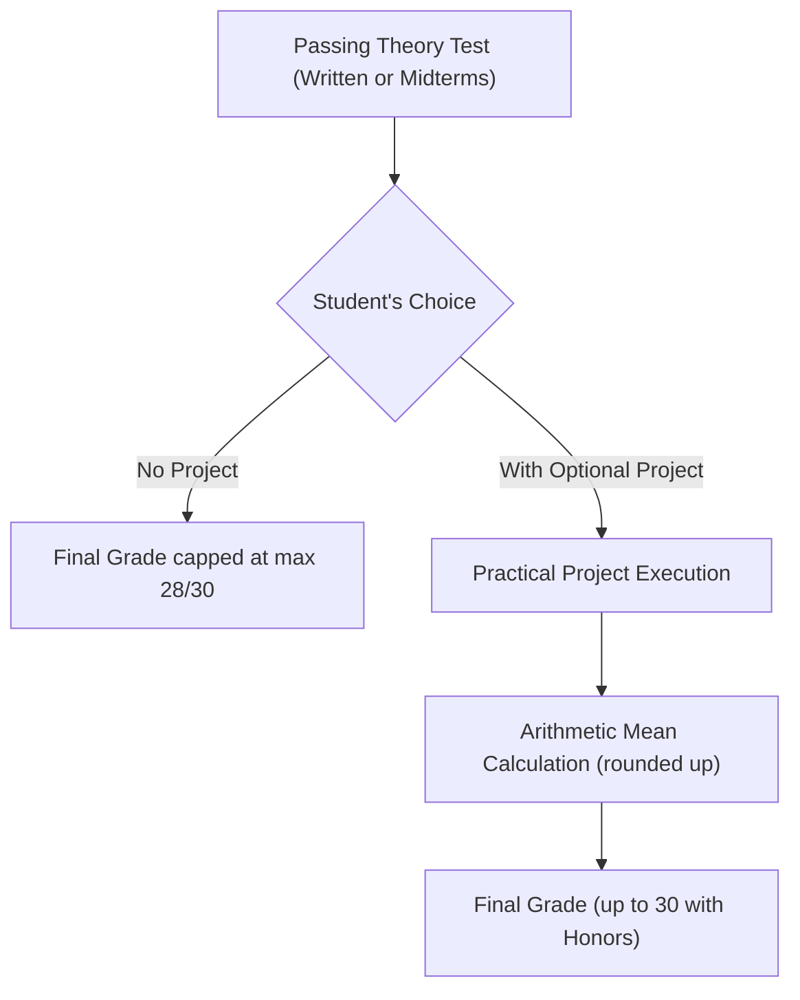
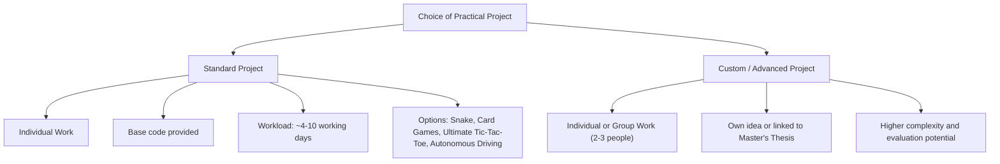
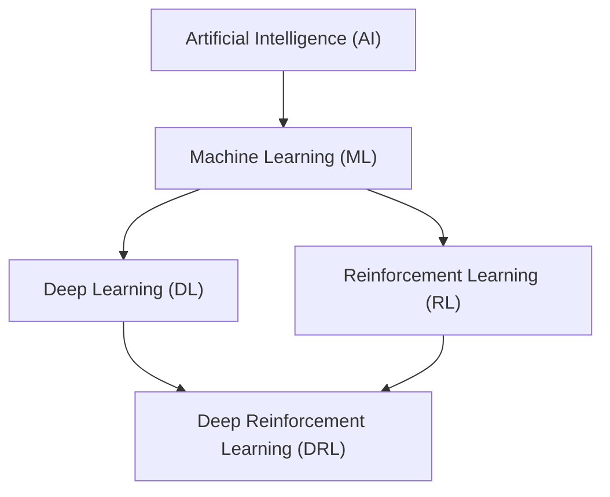

# Course Introduction: Organization, Resources, and Overview of Reinforcement Learning

## Didactic Overview
This introductory lecture illustrates the general organization and educational objectives of the **Reinforcement Learning (RL)** course, outlining the structure of the theoretical contents and their practical application. The educational path is divided into two main macro-sections: a first fundamental part based on the systematic treatment of tabular methods and linear function approximation, and a second advanced part dedicated to **Deep Reinforcement Learning** and the use of **non-linear models**. 

The key bibliographic references are also presented — with particular emphasis on the discipline's standard reference text by Sutton and Barto — alongside the methodological setup of the course, which pairs theoretical and algorithmic formalization (via pseudocode) with practical experimentation on complex simulation environments and application benchmarks.

---

### Course Organization and Teaching Material

#### Channel Access and Recordings
Registration on the course Moodle page is open access (no enrollment key required). 

Although in-person attendance is strongly recommended, all lectures and laboratory sessions will be recorded and made available on Moodle within a few hours after the class ends. This mode is designed to assist those who experience scheduling overlaps with other courses (such as *Intelligent Robotics*) or need to review specific explanatory passages.

#### Study Material and Reference Textbooks
The primary teaching material consists of the **official course slides**, which cover about 95% of the exam topics. Any advanced or optional topics not present in the slides will be explicitly highlighted during the lectures.

The fundamental reference text for the subject is:
* **"Reinforcement Learning: An Introduction"** by Richard S. Sutton and Andrew G. Barto.

> **Key Concept: The "Bible" of RL**
> Sutton and Barto's book is considered the global reference standard for Reinforcement Learning (RL). It is available for free in PDF format online.
> 
> The first 12 lectures of the course will follow the first chapters of the text in an extremely systematic way. In the final part of the course (from chapter 13-14 onwards), the treatment will partially diverge from the book: the text favors a linear-model-based approach, whereas lectures will focus more on non-linear models and *Deep Reinforcement Learning*.

To prepare for the exam, it is recommended to:
1. Consult past years' exam papers with their respective solutions (available in the shared course folder).
2. Complete the theoretical exercises at the end of the chapters in Sutton and Barto's book. Since there are no official solutions published for the book, students can show their solutions to the instructors or teaching assistants for verification.

---

### Exam Structure and Evaluation

The exam verifies the theoretical and algorithmic understanding of the subject and includes the possibility of integrating an optional practical project.

#### Written Test Composition and Evaluation
The written test covers both theory and the writing of **Pseudocode** for the algorithms covered in class. The correctness of the pseudocode is evaluated from a logical and structural standpoint (no code is compiled or executed on a machine).

Students can choose between two completion modes for the exam:

1. **Theory-Only Mode (No Project):**
   * Students take only the written exam (or the two midterms).
   * The final grade has a **maximum cap of 28/30**.

2. **Theory + Practical Project Mode (Optional):**
   * Students take the written exam, which in this case **is not capped at 28**, but can reach higher scores (up to $32$ or $33$ depending on the difficulty of the written test).
   * Students carry out a practical programming project (*Problem with Project*).
   * The final grade is given by the arithmetic mean between the theory grade and the project grade, **rounded up**:
     $$Final\_Grade = \left\lceil \frac{Theory\_Grade + Project\_Grade}{2} \right\rceil$$

#### Midterm Tests and Examination Sessions
* **Midterm Tests (*Partials*):** Two midterms will be held during the semester (roughly in early November and mid-December). Access to the second midterm is conditional on passing the first one.
* **Regular Examination Sessions (*Appelli*):** The classic 4 exam sessions distributed across the winter and summer/autumn sessions are provided.
* **Flexible Grade Recording:** From March to September, dedicated monthly "virtual registration sessions" are opened to allow students to record their grade as soon as the project is completed.

#### Practical Project Submission Deadlines
To submit the practical project, students must have already passed the theoretical part with a sufficient grade. The time deadlines for submission are regulated as follows:

* **Theory passed in Midterms or Exams 1, 2, and 3:** The project can be submitted by the **end of September** of the same academic year.
* **Theory passed in the 4th Exam Session (September):** The project can be submitted until **December 31st** of the same year.

#### Typical Exam Management Scenarios

* **Student A (Fast Standard Track):** Passes the two midterms in December, submits the project before the start of the second semester, and records the grade with top marks.
* **Student B (Mobility/Erasmus Track):** Passes the midterms in December, carries out the project during the summer break, and submits it by September.
* **Student C (Theory-Only Track):** Takes the written exam (or midterms), obtains a high theory grade but chooses not to do the project; directly records the maximum allowed score of $28/30$.
* **Student D (Autumn Session):** Passes the theory in the fourth exam session (September); utilizes the extended window to submit the project by December 31st.

---

### Types of Practical Projects

In the Reinforcement Learning (RL) course, the practical part plays a fundamental role in consolidating the theory. Two macro-types of projects are offered: **Standard Projects** and **Custom / Advanced Projects**.

#### Standard Projects

Standard projects are designed to take roughly between **4 and 10 days of work**. For each project, a base code and an already structured environment are provided, allowing students to focus directly on implementing the RL agent.

> **Key Concept: Working Mode in Standard Projects**
> Standard projects must be carried out **strictly on an individual basis**.

Available options include:

1. **Snake**: Training an intelligent agent to play the classic Snake game. It is an excellent starting point to verify the correct functioning of basic algorithms.
2. **Card / Traditional Games**: Modeling strategies for traditional pub or board games.
3. **Ultimate Tic-Tac-Toe**: An advanced version of traditional Tic-Tac-Toe. The board consists of a $3 \times 3$ grid of $3 \times 3$ sub-grids. The move made by a player in a specific cell of the sub-grid determines which sub-grid the opponent must play in for their next turn. 
   * *Relevance to RL*: Requires long-term planning and strategy, making the balance between immediate rewards and long-term *credit assignment* crucial.
4. **Autonomous Driving**: Developing an agent capable of driving a vehicle in a simulated environment while managing obstacles and trajectories.

---

#### Custom or Advanced Projects

If you are already working on a topic of your interest or want to apply *Reinforcement Learning* to your *Master's Thesis*, you can propose an independent project.

* **Group Work**: Unlike standard projects, advanced or custom projects can be carried out in groups of **2 or 3 people** (subject to instructor approval).
* **Evaluation**: Being more complex and less structured problems, these projects present a greater challenge, but they offer higher evaluation potential during the exam.

---

### Communication Rules and Course Management

To guarantee an efficient workflow and avoid bureaucratic hurdles, it is necessary to strictly adhere to certain communication rules.

> **Key Concept: Official Communication Channels**
> 1. **Email Only**: Phone calls or unannounced visits to the instructor's office without an appointment are not accepted.
> 2. **Subject Tag**: Always use the course prefix/tag in the email subject line. This allows messages to be sorted directly into the correct folder and prevents them from getting lost.
> 3. **Handling Didactic Doubts**: If you send a question of general interest, the instructor will answer it directly at the beginning of the next lecture. This way, the explanation will benefit the entire class.
> 4. **Quick Questions**: For brief clarifications, it is preferable to speak with the instructor in person before or immediately after the end of the lecture.

---

### Deadline Management and Evaluation Flow

The course offers maximum flexibility for project submission and grade recording.

* **Date Flexibility**: There is no rigid and immediate deadline for submitting the project; there is the possibility to complete it throughout the academic career.
* **Theory/Practice Separation**: It is possible to take the theoretical test first and subsequently submit the practical project (or vice versa). 
* **Recording Procedure**: When you take and pass a part of the exam, the partial or provisional grade is recorded or frozen in agreement with the instructor, pending the final submission of the project for the calculation of the final grade.

---

H3: Taxonomy of the Discipline: AI, Machine Learning, and Deep Learning

To rigorously approach the study of Reinforcement Learning (RL), it is fundamental to place the subject within the correct conceptual framework of information sciences.

#### Definition of Artificial Intelligence (AI)
Artificial Intelligence does not necessarily have to be linked to the concept of human or biological intelligence. In engineering terms, we define **AI** as any machine or system capable of **replicating or mimicking a human behavior or process**. 
* An AI system does not necessarily have to be "intelligent" in the common sense (like an advanced chatbot); even automation and very simple rule-based systems fall under this definition if they perform tasks previously entrusted to humans.

#### Machine Learning (ML) and Deep Learning (DL)
* **Machine Learning (ML)**: It is a subset of AI. The foundational characteristic of Machine Learning is the use of **data**. Instead of explicitly programming the rules of a problem, data extracted from the real world is used to describe a phenomenon through a mathematical model $y = f(x; \theta)$, allowing the machine to make predictions or classifications.
* **Deep Learning (DL)**: It represents a specific family of algorithms within Machine Learning, based on the use of deep artificial neural networks. Deep Learning has proven extraordinarily effective in extracting *features* from complex and unstructured data (images, audio, text).

> **Prerequisite Note**: Prior knowledge of Machine Learning is not strictly mandatory to tackle this course, although it will be useful. The truly fundamental mathematical tools are linear algebra, elements of probability, and basic programming. The integration of Deep Learning techniques into RL will be covered and explored in the second part of the course.

---

H3: The Limit of Classical Machine Learning: From Perception to Decision Making

Traditional Machine Learning systems focus mainly on "vertical" and well-bounded problems, attributable to **perception** and **prediction** tasks.

#### The Role of Perception
In complex contexts — such as **Autonomous Driving** or industrial robotics — classical Machine Learning handles the sensory component. 
Taking high-dimensional data $X$ from sensors (cameras, LiDAR, radar) as input, ML models solve problems of:
* **Classification**: Identifying whether an object is a pedestrian, a vehicle, or a traffic sign.
* **Segmentation**: Delimiting road boundaries or detecting defects in a manufacturing process.
* **Prediction**: Estimating the immediate trajectory of an obstacle.

Perception is a necessary condition: if the system is unable to interpret the state of the surrounding environment, it cannot operate safely.

#### The Need for Long-term Decision Making

**Key Concept**: Recognizing an object or estimating a state (*Perception*) is not equivalent to knowing what to do (*Decision Making*). Perception answers the question *"What is around me?"*, but it does not solve the problem of *"What action should I take now to achieve a future goal?"*.

Revisiting the autonomous driving example:
1. The perception system (*ML/DL*) analyzes the scene and identifies the road, pedestrians, and other cars.
2. The **Decision Making** system (*Reinforcement Learning*) must instead establish the optimal sequence of actions (accelerate, brake, turn) to take the vehicle from point $A$ to point $B$, ensuring safety and minimizing travel times.

Reinforcement Learning places itself exactly in this space: it extends Machine Learning beyond mere static-predictive estimation, providing a mathematical framework for **making sequential and strategic medium- and long-term decisions** within a dynamic environment.

---

> [!NOTE]
> ### Exam Notes and Instructor Notices
> - **Exam Format**: The theoretical exam is a written test (with direct questions and pseudocode algorithms; the instructor specified that they will not try to "compile" what is written).
> - **Exam Material**: About 95% of the content present in the slides is part of the exam material. To practice, the instructor recommends consulting the folder with past years' exams (with solutions) and the questions at the end of the textbook chapters (Sutton & Barto).
> - **Midterm Tests**: Two equal-weight midterm tests will be held on Friday afternoons at 16:15 (roughly in early November and mid-December). Access to the second midterm is only permitted if a passing grade is achieved in the first.
> - **Project (Optional) and Grade Structure**: 
>   - By taking only the written exam (or midterms) without doing the programming project, the maximum achievable grade is **28**.
>   - By carrying out the project (optional), the theory grade is not limited to 28, and the final grade will be the mean (rounded up) between the theoretical test and the project.
> - **Project Submission Deadlines**: If a passing grade is obtained in the theory (midterms or regular exam sessions), students have until the end of September 2027 to submit the project. If the theory is passed in the September 2027 exam session, the project deadline is extended to the end of December 2027.
> - **Project Types**: 4-5 standard projects will be offered (individual, such as Snake, Briscola/Discord, Ultimate Tic-Tac-Toe, autonomous driving) or it is possible to agree on a custom/advanced project (which can also be carried out in small groups upon approval).