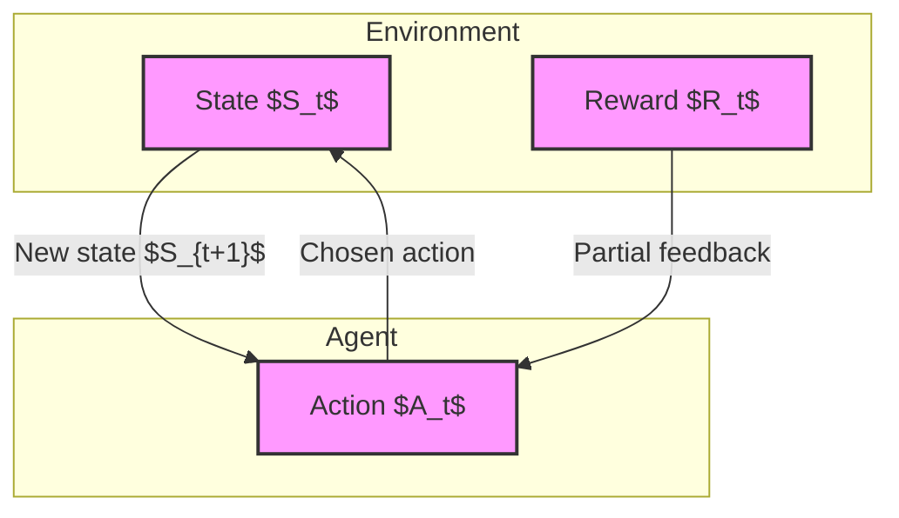
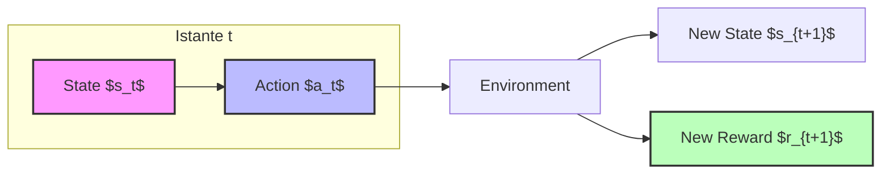
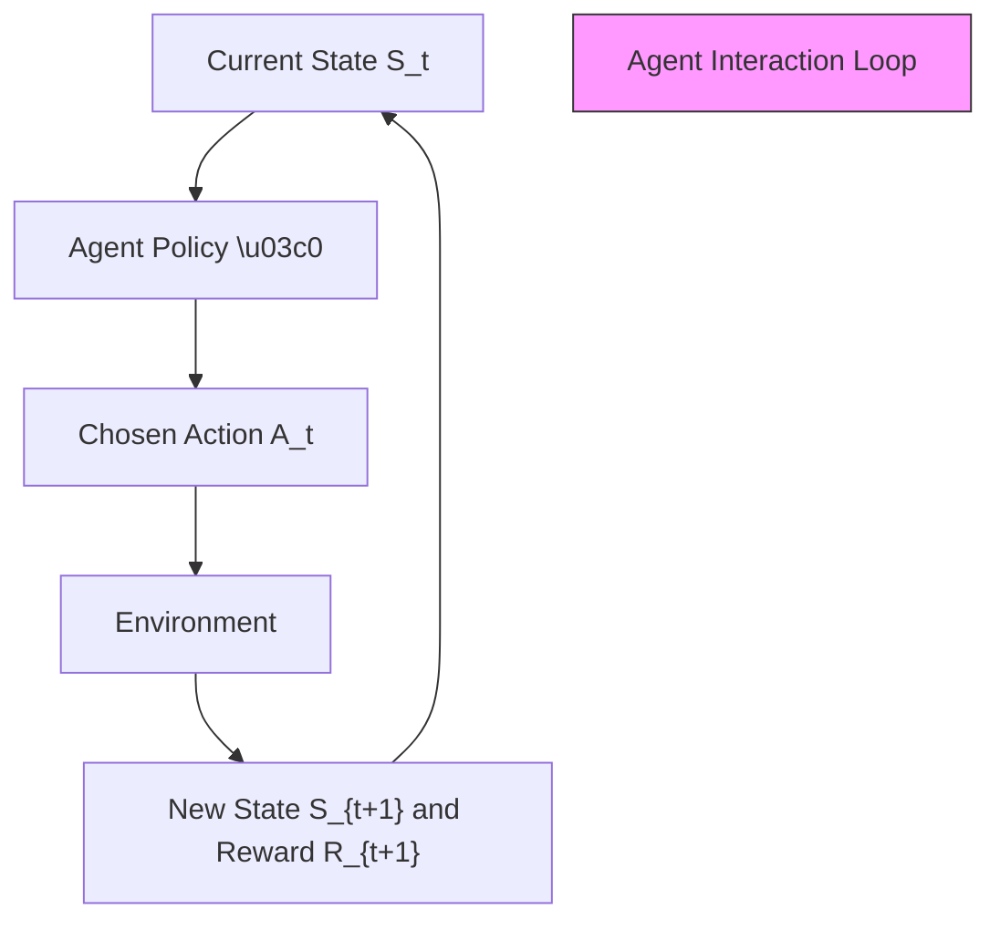
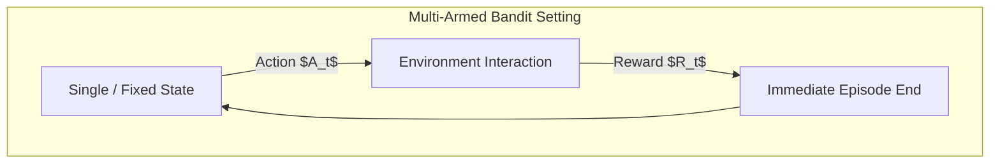
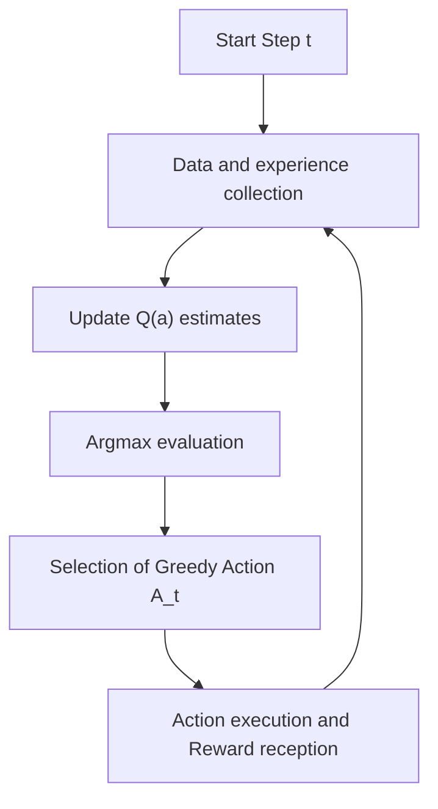

# Reinforcement Learning: Fundamental Elements and Introduction to Bandits

## Didactic Overview
This lecture introduces the formal and preliminary concepts of Reinforcement Learning (RL), a machine learning paradigm based on direct interaction with the real world and the optimization of long-term objectives without the need for historical labeled data. The constituent elements of the RL system are formalized: the Agent, the Environment, States, and Actions, laying the theoretical foundations that will be used throughout the course.

---

### Introduction to Reinforcement Learning and Basic Definitions

**Reinforcement Learning (RL)** represents a peculiar paradigm within Machine Learning. Unlike traditional supervised learning, RL does not rely on pre-existing historical datasets, but allows a system to learn by interacting directly with the real world. The main objective is to combine learning with decision making, enabling the agent to make choices oriented towards achieving long-term goals, such as the maximization of future rewards.

Before tackling complex, large-scale problems (often solved using Deep Learning techniques), it is essential to understand the basic constituent elements of Reinforcement Learning, which will remain unchanged throughout the course.

---

### Fundamental Elements of Reinforcement Learning

The basic framework consists of four main entities that continuously interact in a closed loop:

#### 1. The Agent
The agent is the intelligent entity we need to train. Unlike AI-based conversational bots (where the term "agent" can have different meanings), in this context the agent possesses *agency*: it has the capacity to make autonomous choices. To do this, it must be equipped with appropriate strategies to select the correct action based on a given objective.

#### 2. The Environment
Everything outside the agent's direct control constitutes the environment. For example, in the case of a self-driving car, the environment is represented by pedestrians, the road, signs, and other vehicles. 

#### 3. States
The concept of state in Reinforcement Learning is extremely similar to that of state in systems theory and control systems (commonly represented by the variable $x$). 
A **state** is a concise and complete description of the problem at a given moment, containing all the information necessary to solve it. 

* **Notation:** The set of all possible states is denoted by the calligraphic letter $\mathcal{S}$. A single state at a generic time step $t$ is denoted by the lowercase letter $S_t$.
* *Example for a self-driving car:* State $S_t$ may include weather information, current speed, wheel steering angle, and distance from obstacles.

#### 4. Actions
Actions are the operational choices the agent can make to influence the environment and pursue its long-term goals.

* **Notation:** The set of all possible actions is denoted by the calligraphic letter $\mathcal{A}$. A single action chosen at time $t$ is denoted by $A_t$.
* **State dependence:** In many cases, the set of available actions depends on the current state. For example, if a car is too close to a wall, the action "turn right" might not be physically permissible. To indicate this dependence, the formal notation can be expressed as $\mathcal{A}(S)$.

---

### Interaction Between Agent and Environment: The Time Loop

The learning process unfolds through an iterative and continuous interaction between the agent and the environment over time (discrete, indicated by the index $t$). At each time step $t$:

1. The agent observes the current state $S_t$ and decides to take an action $A_t$ (even the action of "doing nothing" is considered a valid action).
2. The environment receives the action $A_t$ and responds by providing two key elements:
   * **The Reward:** A scalar numerical signal $R_{t+1}$ that evaluates the goodness of the action taken with respect to the objective. The reward represents partial information (immediate feedback), not an absolute guarantee of long-term success. It can also be zero or negative (penalty).
   * **The State Transition:** The environment pushes the agent into a new state $S_{t+1}$.

This sequence continues step by step, forming the backbone of any Reinforcement Learning algorithm.

---

### Agent Objectives and Temporal Structure

The true objective of an Agent in Reinforcement Learning (RL) is not simply to collect some immediate reward along the way, but rather to **maximize the cumulative reward** in the long term. 

Imagine driving an autonomous car: the ultimate goal is to arrive at the destination safe and sound. During the journey, the agent might decide to slow down, lengthening travel times, just to avoid accidents. This involves sacrificing the immediate reward (arriving sooner) for a greater long-term good (safety).

#### Temporal Sequence and Notation
Over time, the interaction between the agent and the environment unfolds at discrete time steps $t$. It is essential to get familiar right away with the standard notation that we will use constantly:

- $t$: indicates the generic discrete timestamp. The formalization is discrete because it makes algorithms easier to explain and implement. Furthermore, if computers are fast enough, we can treat inherently continuous problems by sampling them at a very high frequency.
- $s_t \in \mathcal{S}$: the state of the agent at time $t$, belonging to the set of all possible states.
- $a_t \in \mathcal{A}$: the action taken at time $t$, belonging to the set of possible actions.
- $r_{t+1}$: the reward received as a consequence of action $a_t$, which is observed along with the new state $s_{t+1}$. 
  
*Key Concept:* Note carefully that the reward and the new state are indicated with the subscript $t+1$, since they arrive *after* action $a_t$ has been executed in state $s_t$.

---

### Episodic Tasks vs. Continuing Tasks

Depending on the nature of the problem, tasks in Reinforcement Learning are divided into two main categories:

- **Episodic Tasks:** These are problems that have a natural beginning and end (called episodes). A classic example is a game of chess or a sporting match (structured in innings): you play, the match ends, and then a new one starts. The agent exploits the experience accumulated in previous games to become smarter and perform better in subsequent episodes.
- **Continuing Tasks:** These are tasks that never stop, without a natural conclusion. Typical examples are building temperature and comfort control (HVAC system) or financial trading (portfolio management).

#### How to handle continuing tasks?
Even though most basic algorithms are designed for episodic tasks, we can also apply them to continuous contexts. There are two main tricks:
1. **Discount factor:** A parameter $\gamma$ (gamma) that we will add to the system elements to allow episodic approaches to work even on tasks that never end (we will see this shortly in upcoming lectures).
2. Advanced techniques that we will see in the second part of the course.

---

### Reward Design

> **Key Concept:** In Machine Learning, success often depends on data quality, but in *Reinforcement Learning* the correct definition of the reward function is the single most critical factor for the success (or failure) of the algorithm.

The difficulty in designing rewards varies depending on the application domain:

#### 1. Domains where the reward is intrinsic to the problem
In some contexts, the rules themselves clearly define what constitutes a win or a loss:
- **Chess or board games:** Winning gives $+1$, losing gives $-1$.
- **Financial trading:** The reward is already defined by the money earned or lost, or by the fluctuation in stock value.

#### 2. Domains where the reward must be designed (Domain Knowledge)
In many other problems, such as autonomous driving or recommendation systems, it is up to the designer to define the reward function using domain knowledge. 

Take the case of an autonomous car that needs to go from point $A$ to point $B$:
- We want it to follow a linear trajectory: we could give $+1$ for every time step it is on the correct trajectory, and $-1$ if it leaves it.
- We want it to arrive quickly: we could penalize every elapsed second with a small value, for example $-0.1$ for every timestamp.
- We want it to avoid accidents: the risk of a crash must be heavily penalized, for example with a huge $-1000$.

Other examples of reward design:
- **Temperature control:** If the goal is to maintain degrees at $22^\circ\text{C}$, a temperature of $24^\circ\text{C}$ will receive a penalty proportional to the error (e.g., $-2$). Often, a trade-off between maintaining the desired temperature and energy saving is also modeled.
- **Online Advertising / Recommendation Systems:** Recommending an item followed by the user gives a positive reward (e.g., $+1$), while an ignored ad gives a penalty (e.g., $-0.2$).
- **Chatbots and Sentiment Analysis:** Chatbots exploit explicit feedback (e.g., ChatGPT with answers A and B rated by the user) but also implicit feedback derived from user satisfaction (if they do not get angry and do not continuously repeat the question).

During the theory of this course, we will not perform dynamic reward "tuning" during the learning process: the reward function is defined upstream during the problem design phase, and the agent will learn to interact with it.

---

### Objective Function and Reward Hypothesis

Since we are interacting with a machine, exactly as in traditional Machine Learning where we define a loss function, in Reinforcement Learning we must rigorously quantify what we want to achieve. 

The fundamental task of the agent is to **maximize the cumulative reward**, i.e., the sum of the rewards obtained over the course of an episode or a continuous stream of time steps.

*   **Key Concept:** **The Reward Hypothesis**. This hypothesis states that any desired goal can be formalized as the maximization of the expected cumulative reward. In other words, whatever target we want the agent to achieve must be translatable into a quantitative scalar signal inserted into an equation.

#### Long-term consequences and reward delay
Often the agent must pursue long-term consequences, which means that rewards can be delayed. 
*   *Example:* In chess, we could assign intermediate penalties such as $-0.1$ if we lose a pawn or $-0.5$ if we lose a bishop (proxy function), accepting local sacrifices over the course of the game to achieve the final result of checkmating the king.
*   However, a cleaner formalization might limit itself to $+1$ for a win and $-1$ for a loss. Another excellent example is autonomous driving, where the agent may decide to slow down temporarily not because it is risking a crash, but because it is part of the optimal strategy to reach point B in the shortest safe time possible.

---

### Temporal Dynamics and State Notation

In Reinforcement Learning, the interaction between agent and environment proceeds in discrete time steps. At each time step $t$ (within an episodic or continuing task):
1. The agent is in a state $S_t$, where $S_t \in \mathcal{S}$ ($\mathcal{S}$ is the set of all possible states).
2. The agent chooses an action $A_t$, where $A_t \in \mathcal{A}$ ($\mathcal{A}$ is the set of all possible legal actions).
3. The environment responds by providing a reward $R_{t+1}$ and transitioning the agent to the new state $S_{t+1}$.

This temporal sequence produces an interaction trajectory:
$$S_0, A_0, R_1, S_1, A_1, R_2, S_2, \dots$$

*Note on notation:* It is important to pay attention to subscripts. The index changes starting from action $A_t$: the resulting state and the associated reward are denoted with $t+1$ because they are the consequence of the action taken at time $t$.

---

### State Observability

A fundamental concept is what defines a state. State $S_t$ encapsulates *all* the useful information to solve the Reinforcement Learning problem. Irrelevant information is discarded.

Over the course of our study, we will make a strong assumption:
*   **Fully Observable State:** The agent has access to everything useful to improve and solve the task. Classic examples are board games (e.g., chess), where the board, one's own pieces, and the opponent's pieces are completely visible. In this scenario, the state and the observation coincide ($\mathcal{S} = \mathcal{O}$).
*   **Partially Observable State:** The agent sees only a portion of the state (e.g., in Texas Hold'em poker, where opponents' hole cards are unknown). Even though specific algorithms exist to handle partially observable scenarios, in this course we will always assume full observability.

---

### Formal Introduction of Policies ($\pi$)

Unlike simple supervised Machine Learning models, a Reinforcement Learning agent possesses very precise structural components. One component that *is always present*, regardless of the training algorithm used, is the **policy**, denoted by the Greek letter $\pi$.

*   **Definition:** The policy $\pi$ is the law or rule that the agent follows to decide which action to take in a given state. 
*   In the early stages of learning, the policy will inevitably be "naive" or poorly performing ($\pi_0$). The goal of RL algorithms is to iteratively improve this policy until it becomes optimal.

#### Policy Types
The policy can be formalized in two main ways:
1.  **Deterministic Policy:** Given a state $S_t$, it always returns a single specific action $A_t$.
2.  **Stochastic Policy:** It provides a probability distribution over the possible actions. For example, the policy might establish that in the current state the agent should move right with a $70\%$ probability and left with a $30\%$ probability. 

Mathematically, the choice of an action $a$ given state $s$ according to policy $\pi$ is expressed as:
$$\pi(a|s) = P(A_t = a \mid S_t = s)$$

---

### Other Fundamental Components: Value and Q-Value Functions

Continuing with the formalization of Reinforcement Learning, let us introduce two fundamental quantities which, if known, allow the problem to be solved:
- The **Value Function**, usually denoted by $V$.
- The **Q-Value Function**, denoted by $Q$.

These functions represent an extremely powerful quantity. For example, the Q-value function tells us: *"Given that you are in this state (e.g., a certain configuration on a chessboard), if you take action $A$ (e.g., move the king), you have a certain probability or expectation of winning; if you take another, you have a different one"*. 

In summary, having these functions available allows the agent to immediately understand whether it is in a favorable or unfavorable situation and what decision to make. A large part of the Reinforcement Learning algorithms we will study in the course will have precisely the objective of estimating these two quantities efficiently using a limited amount of data.

---

### Conceptual Transition Towards Multi-Armed Bandits

Before tackling the general problem of Reinforcement Learning with complex sequences of states, actions, and rewards, let us introduce a simplified scenario: **Multi-Armed Bandits** (or *K-armed bandits*).

#### Main Characteristics of Multi-Armed Bandits
The multi-armed bandits setting differs from general Reinforcement Learning in two key aspects:
1. **Absence of state transition:** There is no dynamic sequence where the action leads the agent to a *new*, different state. One can think that there is a single state (or none, or a fixed state $0$), since the environment does not change.
2. **Instantaneous episodes:** There is no temporal trajectory of the type $S_t, A_t, R_{t+1}, S_{t+1}, \dots$ that ends after a certain number of steps. The agent takes an action, receives an immediate reward, and the episode ends immediately. It immediately restarts from the same initial state.

#### Why Study Multi-Armed Bandits?
Even though it is a considerably simplified problem, multi-armed bandits allow us to introduce two fundamental concepts ("meta-concepts") that we will leverage until the end of the course:
- **Decision making under uncertainty:** Handling typical situations in engineering contexts where the environment is uncertain.
- **The Exploration-Exploitation Dilemma:** The delicate trade-off between wanting to exploit actions we already know are advantageous (exploitation) and wanting to try new actions to discover if better options exist (exploration).

#### Note on Notation in Multi-Armed Bandits
Following the notation of the reference textbook:
- In general Reinforcement Learning, the subscript $t$ usually indicates individual time steps within an episode.
- In Multi-Armed Bandits, having no internal temporal sequence within the episode, $t$ is often used to indicate the index of the episode itself (or of the interaction), in which the agent chooses an action $A_t$ and receives a reward $R_t$. 

Although this notation may initially cause confusion due to the change in meaning compared to the general case, getting familiar right away with the text's symbols will allow us to seamlessly understand the advanced concepts built upon these foundations.

---

### The Multi-Armed Bandits Problem

The name "multi-armed bandit" derives from a rather vivid metaphor: the classic casino slot machine, ironically termed an "unarmed bandit" because, in the long run, it is designed to steal money from users. 

Imagine a scenario where an agent is in front of a slot machine with $K$ different levers (hence *K-armed bandit*). The agent possesses a large number of tokens and has the task of deciding which lever to pull at each step to maximize total winnings. 

Although it may seem like a toy problem, this model actually governs a large portion of modern digital and decision-making systems:
* **Online Advertising:** Choosing which ad to show a user to maximize click probability.
* **Disinformation campaigns:** Showing different news items to understand which one generates the most interaction (*enragement*).
* **Medical field:** Testing different medicines or treatments on patients to understand which is the most effective without causing irreparable harm.

The main complexity lies in the fact that the reward is not deterministic: pulling the same lever does not always guarantee the same result, but follows a stochastic and uncertain probability distribution.

---

### The Exploration-Exploitation Dilemma

When we are faced with multiple choices (e.g., three medicines: pink, yellow, and blue) without any prior information, a natural question arises: what strategy should we adopt?

* **Random/Naive Strategy:** We could start by trying the various options at random. However, making trials has a real cost (in the medical case, it means administering a potentially worse or lethal treatment to patients).
* **Greedy Strategy:** Immediately exploit the information collected so far to always choose the option that, based on current data, appears to be the best.

Here the **exploration-exploitation dilemma** emerges:
1. **Exploitation:** Choose the action that currently seems most promising to maximize immediate return.
2. **Exploration:** Try alternative actions to gather new information, risking potential short-term losses but discovering potentially superior options in the long run.

---

### Problem Formalization and Q-Value Function

Let us formally define the problem:
* We have a set of possible actions equal to $K$. Thus the cardinality of the action set is $K$.
* We assume for the moment that the environment has a single state (or zero relevant states).

To evaluate the goodness of actions, we introduce the **Q-value function**. 

> **Key Concept:** In this initial phase without states, the $Q$-value function is uniquely associated with the action. It represents the **expected reward** if a given action $a$ is chosen.

Mathematically, for each action $a$, we define the true value $Q(a)$ as the expected value of the reward obtained by choosing that action:

$$Q(a) = \mathbb{E}[R_t \mid A_t = a]$$

Where:
* $R_t$ is the reward at time $t$.
* $A_t$ is the action chosen at time $t$.

#### Estimating the Q-value via Sampling
In reality, we do not know the true reward distribution (which could be extremely complex, multimodal, and not necessarily Gaussian). Our goal is **not** to reconstruct the entire probability distribution — an operation that would require an immense amount of data and high costs — but rather to **estimate the mean** of the rewards to figure out which action is the best.

To do this, we store past experiences and compute the sample average of the rewards obtained for each action:

$$Q_t(a) \doteq \frac{\text{Sum of rewards obtained when action } a \text{ was chosen}}{\text{Number of times action } a \text{ was chosen}}$$

Every time we collect a new reward for a specific action, we update only the corresponding entry in our estimate array.

---

### The Greedy Policy

Once we obtain the estimates $Q_t(a)$ for all actions, how do we use them to make a decision? The simplest strategy is the **greedy policy**, in which the agent chooses the action that maximizes the current estimate of the $Q$-value.

Mathematical notation for the greedy action at time $t$:

$$A_t = \arg\max_{a} Q_t(a)$$

Meaning: the $\arg\max$ operator analyzes all possible actions $a$ and returns the action $A_t$ for which the estimated average reward $Q_t(a)$ reaches its maximum value.

---

### Key Difference Between Traditional Machine Learning and Reinforcement Learning

It is essential to understand the difference in approach compared to classical Machine Learning:

* **Traditional Machine Learning:** Often tries to learn and estimate the underlying data distribution as a whole. This requires a lot of data and high computational/experimental costs.
* **Reinforcement Learning (in this context):** Is not concerned with thoroughly knowing the model or the distribution of the problem. The goal is solely to **be efficient** and make the right decision spending as few resources as possible (i.e., gathering little data through experience). Even if our estimates $Q_t(a)$ might be imperfect or completely skewed, what matters is that they are sufficient to identify which action is best to take.

---

### Exploration Strategies and the Epsilon-Greedy Approach

We have seen that a true dilemma exists when we must choose whether to act by exploiting already known information (exploitation) or to gather new information while risking losing something in the short term (exploration). Today we introduce the first algorithmic approach to address this problem, known as the $\epsilon$-greedy policy.

#### The $\epsilon$-Greedy Approach

Let us start from an intuitive idea proposed by your peers: a purely *greedy* policy always chooses the action that, based on current estimates, appears to be the best. This approach, however, focuses exclusively on exploitation, completely ignoring exploration.

To balance the two requirements in a simple way, we modify the action selection rule by introducing a small parameter $\epsilon$ (with $0 \le \epsilon \le 1$). 

- With probability $1 - \epsilon$, the agent behaves in a *greedy* manner, i.e., choosing the action that maximizes the estimated value (exploitation).
- With probability $\epsilon$, the agent chooses a random action among all available ones, potentially including the same *greedy* action (exploration).

Formally, the selection probability for a generic action follows this logic:
$$P(\text{action}) = \begin{cases} 1 - \epsilon + \frac{\epsilon}{|\mathcal{A}|} & \text{if the action is the best estimated (greedy)} \\ \frac{\epsilon}{|\mathcal{A}|} & \text{otherwise} \end{cases}$$
*(Note: There are minor implementation variants in textbooks, such as one where with probability $\epsilon$ one chooses uniformly only among non-greedy actions, but the concept and final results remain substantially equivalent).*

Typical values of $\epsilon$ are small numbers, such as $0.01$ or $0.1$ (meaning 1% or 10% of the time the agent explores).

#### Empirical Analysis: The 10-Armed Bandit Problem

To evaluate the effectiveness of this strategy, we refer to the classic $10$-armed bandit problem described in the literature. In this scenario, the reward distributions of the 10 arms overlap significantly, making it far from trivial to figure out which lever is actually the best one (which turns out to be number 3).

> **Key Concept:** To obtain statistically solid results and stable graphs, experiments are not run on a single problem instance, but averaged over a high number of independent runs (e.g., $2000$ times on the same set of bandits).

Observing empirical results on two main metrics:
1. **Average Reward:** Shows how much reward the agent manages to collect over time steps (episodes).
2. **Percentage of Optimal Actions:** Monitors how many times, as a percentage, the agent actually chooses the best lever among the 10 available.

Initially, knowing nothing about the environment, the agent gets low rewards and rarely chooses the optimal action. Over time, accumulated experience allows estimates to be improved, increasing both rewards and the frequency of choosing the best action.

Comparing different settings of the parameter $\epsilon$:
- $\epsilon = 0$ (blue line): The agent is purely *greedy* and never explores. Performance quickly plateaus at a mediocre level because the agent gets trapped in a sub-optimal solution.
- $\epsilon = 0.1$ (orange line) and $\epsilon = 0.01$ (green line): The introduction of an exploration percentage clearly improves long-term performance, proving that a minimum amount of exploration is essential.

#### Limitations of the $\epsilon$-Greedy Approach

Despite its simplicity and initial effectiveness, the $\epsilon$-greedy strategy presents evident structural limitations:

1. **Perpetual Exploration:** Since $\epsilon$ remains constant over time, the agent will continue to perform random exploratory actions even when it has learned with absolute certainty which choice is the best. This prevents the agent to reach the theoretical *maximum* performance (optimality). 
   * *Parallelism:* In neural networks, a similar approach is adopted by progressively reducing the *learning rate* as one approaches the solution, or by reducing $\epsilon$ over time. If we run the experiment for a very high number of steps while reducing exploration, we notice that strategies with calibrated exploration outperform standard results in the long run.
2. **Lack of A Priori Knowledge:** No one tells us when the right time is to stop exploring, barring prior knowledge about the problem (e.g., already knowing the maximum obtainable reward limit).
3. **Non-stationary Environments:** So far we have assumed that reward probability distributions are fixed over time. In the real world, however, conditions can vary (e.g., weather conditions change a car's response). In these scenarios, constant exploration becomes necessary to adapt to changes, rendering decaying-exploration models devoid of continuous adaptation inadequate.

---

### Conclusions and Further Readings

In this final brief closing section, the instructor outlines a logical overview of the path covered and what awaits us in the next lecture. 

* **Recall of previous and future lectures:** The instructor reminds us that on Monday we will return to these topics to analyze alternative strategies and delve further into the course themes.
* **Next steps:** The goal will be to explore new perspectives and different approaches, completing the overall picture of the topics covered.

---

> [!NOTE]
> ### Exam Notes and Instructor Warnings
> - Almost all the material related to chapter 2 of the book (covered starting from multi-armed bandits) will be part of the exam material. The instructor will specify at the end of each chapter which specific sections are excluded or optional.
> - The slides and everything said in class constitute exam material, unless explicitly indicated otherwise (e.g., concepts like partial "observations" introduced as general notation but specified as not subject to a specific exam question in that context).