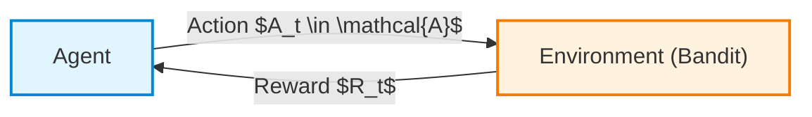
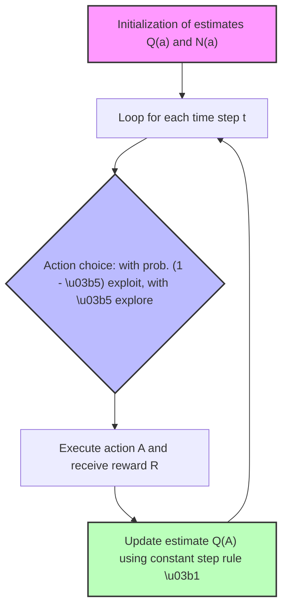
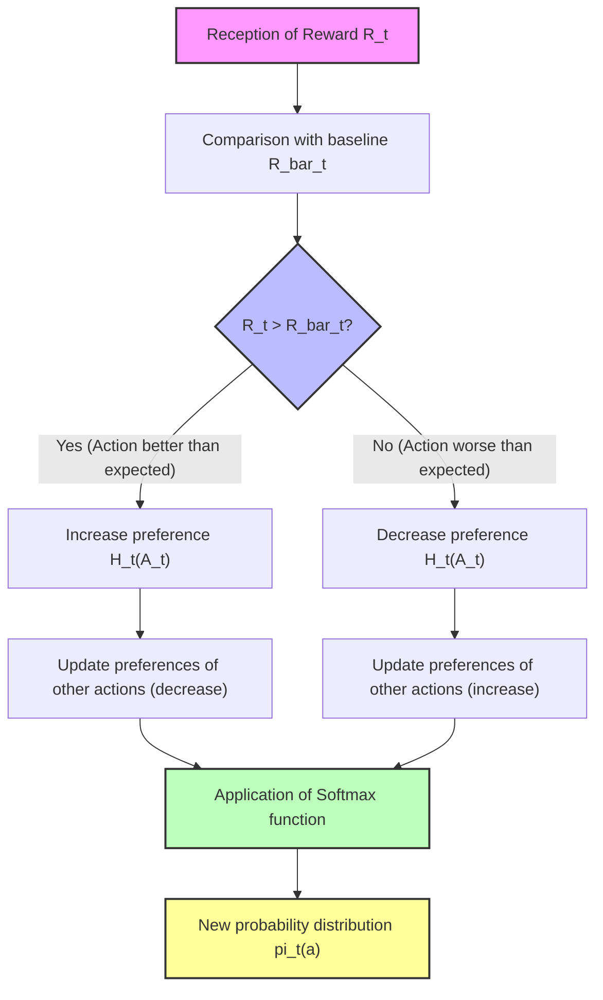
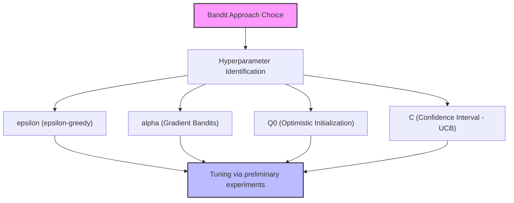
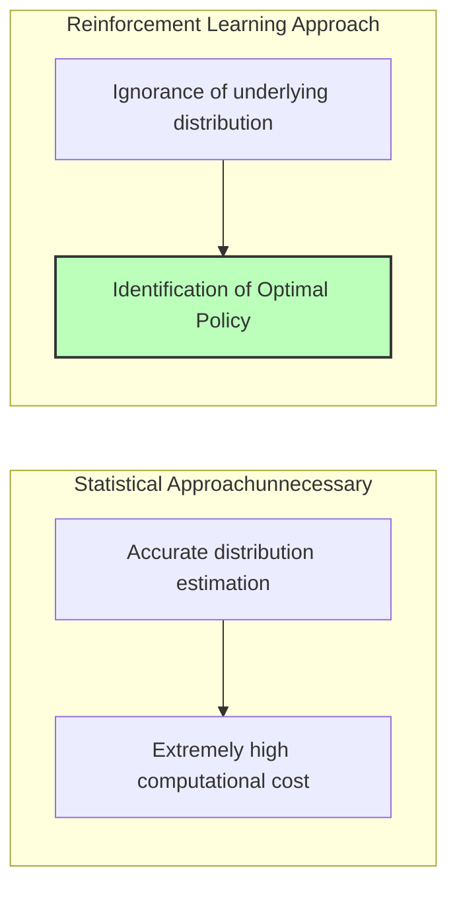
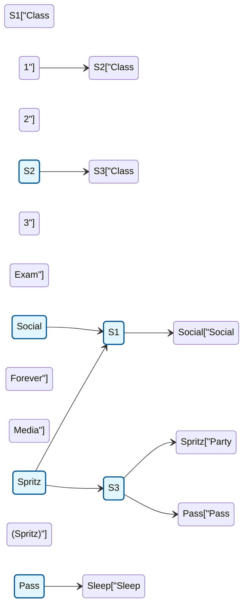

# Lecture 1: Conclusion of Multi-Armed Bandits and Introduction to Markov Decision Processes

## Didactic Overview
In this lecture, the concepts related to *Multi-Armed Bandits* (Chapter 2 of the reference textbook) are concluded, focusing on computational efficiency through the incremental implementation of the sample average estimate (*sample average method*). Subsequently, the fundamental mathematical formalism for modeling sequential decision-making problems is introduced: *Markov Decision Processes* (MDPs). Logistic communications regarding the programming lab schedule and the exceptional procedures for partial midterms reserved for international students or those with schedule conflicts are also provided.

---

### Introduction and Logistic Course Information

Before delving into the theoretical contents, let us briefly summarize some organizational notes:
* **Partial exams:** In case of serious and verifiable overlapping reasons or travel, students who pass the first midterm will be able to take the second midterm during the first official January date.
* **Teaching material:** The slides are updated regularly during the course; to get an early overview of the syllabus, it is possible to consult the materials from the previous academic year.
* **Programming labs:** The practical exercises are optional, but strongly recommended both to fully understand the algorithms and in preparation for the possible exam project. Notebooks and recordings will be made available after each session.

---

### Recap: The Multi-Armed Bandit Problem

The **Multi-Armed Bandit** problem represents a fundamental abstraction for Reinforcement Learning (RL). Although it is a simplified model, it introduces core elements that we will encounter throughout the discipline.

The distinguishing features of this context are:
1. **Absence of state dynamics:** We can consider the problem as stateless or characterized by a single invariant state.
2. **Non-sequential decisions:** Each episode or experience consists of the selection of a single action and the immediate reception of a reward (*reward*). The episode ends immediately, without influencing the next state.
3. **Agency (decision-making capacity):** The agent has a finite set of $K$ possible actions available, $a \in \mathcal{A}$ (with $|\mathcal{A}| = K$).

The agent's objective is to learn an optimal **policy** (*policy*), i.e., a decision rule that allows it to maximize the total sum of expected rewards.

---

### Estimating Action Values: The Action-Value Function

To guide the agent's choices, it is essential to quantify the value of each action. The theoretical value of an action $a$, denoted as $q_*(a)$, is defined as the expected value of the reward obtained by choosing that action:

$$q_*(a) \doteq \mathbb{E}[R_t \mid A_t = a]$$

Since the agent does not know the reward probability distributions a priori, it must estimate $q_*(a)$ empirically from the data collected during its experience. 

Let us denote with $Q_t(a)$ the estimate of the value of action $a$ at time step $t$. The most natural method is the **sample average method** (*sample-average method*):

$$Q_t(a) \doteq \frac{\sum_{i=1}^{t-1} R_i \cdot \mathbb{I}(A_i = a)}{\sum_{i=1}^{t-1} \mathbb{I}(A_i = a)}$$

where $\mathbb{I}(\cdot)$ is the indicator function, which equals $1$ if action $a$ was chosen at time instant $i$, and $0$ otherwise.

> **Key Concept:** The sample average is an unbiased estimator of the expected reward value. As the selections of a given action increase, by the Law of Large Numbers, the estimate $Q_t(a)$ converges almost surely to the true value $q_*(a)$.

---

### Incremental Implementation

The naive implementation of the sample average would require storing the entire history of rewards obtained for each action, recalculating the sum at each step. This approach is inefficient both in terms of memory and computational complexity.

It is possible to reformulate the computation of the average in an **incremental** way.

#### Mathematical Derivation
Let us consider a specific action and denote with $R_i$ the reward received after selecting it for the $i$-th time. Let $Q_n$ be the value estimate after $n-1$ selections:

$$Q_n = \frac{R_1 + R_2 + \dots + R_{n-1}}{n-1}$$

Upon the arrival of the $n$-th reward $R_n$, the new estimate $Q_{n+1}$ is obtained as:

$$Q_{n+1} = \frac{1}{n} \sum_{i=1}^{n} R_i$$

By isolating the last term of the summation:

$$Q_{n+1} = \frac{1}{n} \left( R_n + \sum_{i=1}^{n-1} R_i \right)$$

Since $\sum_{i=1}^{n-1} R_i = (n-1) Q_n$, we can substitute:

$$Q_{n+1} = \frac{1}{n} \left( R_n + (n-1) Q_n \right)$$
$$Q_{n+1} = \frac{1}{n} \left( R_n + n Q_n - Q_n \right)$$
$$Q_{n+1} = Q_n + \frac{1}{n} [R_n - Q_n]$$

*(Note: The algebraic steps have been made explicit for didactic clarity).*

---

#### General Structure of the Update

The resulting form is one of the fundamental equations of Reinforcement Learning and follows the universal pattern:

$$\text{NewEstimate} \leftarrow \text{OldEstimate} + \text{StepSize} \cdot [\text{Target} - \text{OldEstimate}]$$

* **$\text{Target} = R_n$:** Represents the new empirical observation.
* **$[\text{Target} - \text{OldEstimate}] = [R_n - Q_n]$:** It is the **estimation error** (or *innovation*), i.e., the novel information brought by the new data compared to previous knowledge.
* **$\text{StepSize} = \frac{1}{n}$:** Determines the weight assigned to the estimation error in the update.

#### Computational Advantages
1. **Reduced memory:** There is no need to save all past rewards. It is sufficient to store:
   * A vector of current estimates $Q(a)$ of dimension $K$.
   * A vector of counters $N(a)$ of dimension $K$ (number of times action $a$ has been executed).
2. **Constant computational cost:** The update requires $\mathcal{O}(1)$ time complexity at each step (one subtraction, one multiplication, and one addition).

---

### Limitations of Simple Averaging and Note on Non-Stationary Problems

In the sample average update, the learning step $\alpha_n = \frac{1}{n}$ decreases as the number of samples $n$ increases. 

* **Asymptotic behavior:** When an action has been selected many times ($n$ large), $\frac{1}{n} \to 0$. Consequently, even in the presence of a reward $R_n$ very different from the current estimate (large estimation error), the correction made to $Q_n$ will be almost negligible.
* **Problem:** This behavior is desirable in **stationary** environments (where reward probability distributions do not vary over time). However, in **non-stationary** contexts — in which rewards vary over time — a decreasing weight prevents the agent from adapting to recent environmental changes.

---

### Handling Non-Stationary Problems

In problems where the distribution from which we draw rewards changes over time (non-stationary problems), the classical sample average approach in which all past actions are stored is no longer sufficient. If the environment changes, we must be able to adapt and give more importance to recent data compared to old ones, without having to recalculate everything from scratch by saving the complete history.

A common approximation consists of updating the action value estimate using a constant **step size** $\alpha$ (for example $0.1$ or $0.01$), instead of dividing by the number of times $n$ the action was chosen:

$$Q_{n+1} = Q_n + \alpha (R_n - Q_n)$$

Where:
- $Q_n$ is the previous estimate.
- $R_n$ is the new reward obtained.
- $(R_n - Q_n)$ represents the estimation error (*error*).
- $\alpha \in (0, 1]$ is the constant update step.

This approach allows tracking non-stationary problems because it assigns a higher weight to recent rewards, while the importance of past rewards decreases exponentially over time. 
> **Key Concept:** We will often use **telescopic arguments** to demonstrate mathematical properties and theorems related to these updates during the Reinforcement Learning course. Isolating a quantity, considering it a step backward, and summing it recursively is a fundamental algebraic trick.

---

### The Exploration-Exploitation Dilemma

A fundamental aspect in Reinforcement Learning is the **exploration-exploitation dilemma**:
- **Exploitation:** If the objective is to maximize immediate reward, we must choose the action we know to be the best based on current estimates. (E.g., always going to the restaurant we know is excellent).
- **Exploration:** If we are not certain about other options, we risk missing better opportunities. We must try alternative actions to understand if they can offer superior value. (E.g., trying a new restaurant).

Without exploration, we risk getting stuck on sub-optimal solutions guided by incorrect initial estimates.

---

### The $\varepsilon$-greedy Algorithm

A simple and effective approach to handle the dilemma is the **$\varepsilon$-greedy** strategy (*$\varepsilon$-greedy algorithm*):
- Most of the time (with probability $1 - \varepsilon$, for example $90\%$ or $99\%$), exploitation is chosen: the greedy action is selected, i.e., the one that maximizes the estimate $Q$.
- For a small percentage of time (with probability $\varepsilon$, for example $1\%$ or $10\%$), exploration is chosen: an action is selected at random with uniform probability among all available actions.

#### Pseudocode of the $\varepsilon$-greedy Bandit Algorithm

---

### Optimistic Initial Values

In addition to $\varepsilon$-greedy, other ideas exist to encourage exploration. One of these consists of modifying the initial values of the expected distribution (*priors*): **optimistic initial values**.

Instead of initializing the estimates $Q(a)$ to zero (which is a completely arbitrary choice), we can set them to artificially high values compared to the actual rewards we expect from the environment. 
- *Example:* If we know that a slot machine returns at most 1 coin, we can set the initial estimate $Q(a) = 10$.
- *Why it works:* When the agent tries an action and receives a reward lower than the optimistic expectations ($R < Q$), it will be disappointed and the estimation error will push the algorithm to immediately try another action. This naturally encourages strong initial exploration in a native way, without needing to force random choices via $\varepsilon$. It exploits the **a priori knowledge** that we have about the problem.

---

### Optimistic Initial Values Method

A first alternative approach to the $\epsilon$-greedy strategy for managing the exploitation vs. exploration dilemma consists of using **optimistic initial values**. 

Imagine facing a situation similar to that of a gambler who is a bit "disappointed" or overly confident, inserting a coin into a slot machine naively thinking of getting back on average ten times the stake. We can apply this same mindset to our agent: suppose, for example, that at the beginning of a medical problem every time we prescribe a treatment we expect to heal two patients. Naturally, this estimate is unrealistic, but introducing a strongly optimistic initialization possesses a very interesting property for the learning phase: **it naturally favors exploration**.

Let us see how it works step by step:
1. At the beginning, we set the estimated action values $Q(a)$ to a value much higher than the maximum real reward we expect.
2. We choose an action and obtain a positive reward (e.g., $+1$). The estimate for that action updates accordingly.
3. With a normal greedy approach, we would continue to exploit that action forever, ignoring the others. However, with optimistic initial values, the other untried actions maintain a very high initial $Q$ value (e.g., $6.2$ versus $1.5$ of the just-tried action). 
4. Consequently, the agent will decide to try the other actions, not because it is pushed by a random component (like $\epsilon$), but because their initial estimates still appear more alluring.

This behavior embodies a fundamental principle that we will encounter often in the course: **optimism in the face of uncertainty**. If we do not know which choice to undertake, we temporarily assume that the outcome will be exceptionally positive.

#### Practical Exercise and Long-Term Results
Comparing two configurations on the same standard numerical problem:
* **Blue Line:** Purely greedy approach ($\epsilon = 0$) but with optimistic initial values ($Q = 5$, a very high value compared to real averages).
* **Orange Line:** Standard greedy approach with a small exploration percentage ($\epsilon = 0.1$, i.e., 10%) and initial estimates set to zero ($Q = 0$).

In the early stages of the simulation, the simple trick of setting $Q = 5$ allows the agent to achieve overall superior performance, measured as the percentage of time the truly optimal action is chosen.

> **Key Concept:** The effect of optimistic initial values is **transitory**. It provides a strong exploration benefit solely in the initial phase of learning. As time passes, data accumulates, and estimates update, the influence of the initial values fades and the agent "forgets" about them.

In many real-world applications, however, we might not know an appropriate "optimistic" value a priori. Moreover, in practice, the two strategies (optimistic initial values and $\epsilon$-greedy) are not mutually exclusive, but **are often used together** (for example, setting $Q$ high at the beginning while also maintaining a small $\epsilon > 0$, such as $0.01$).

---

### Introduction to Upper Confidence Bound (UCB)

Let us now explore a second approach to handle the choice of exploratory actions, modifying the way we select actions when we do not behave purely greedily.

Up to now we have considered only a point estimate of the expected reward $Q(a)$. However, an agent can greatly benefit from also tracking the **variability** or uncertainty associated with that estimate. 

Statistically, as we collect data points on a phenomenon, our uncertainty about it tends to decrease. 
* If an action (let us call it $A_2$) has been chosen many times, our estimate of its value is very solid and the associated uncertainty is **small**.
* If an action ($A_3$) has been tried few times, the estimate is shaky and the uncertainty is **large**.

Instead of relying solely on the expected mean, we can estimate a confidence interval (visually represented as whiskers around the mean). The underlying idea of the **Upper Confidence Bound (UCB)** is to select the action not based on the highest mean, but based on the **upper limit of the estimate**, i.e., the action that *potentially* can provide the best return considering uncertainty:

$$\text{UCB Action} = \operatorname*{arg\,max}_{a} \left[ Q(a) + c \sqrt{\frac{\ln t}{N(a)}} \right]$$

*Note: Step integrated with didactic clarity to formalize the concept discussed in class.*

Analyzing the UCB algorithm formula:
* The first term, $Q(a)$, represents **exploitation**: it rewards actions that on average have yielded the most.
* The second term represents **exploration**: it grows if the action has been chosen few times ($N(a)$ is small) and decreases as time $t$ advances and that action is explored. The parameter $c > 0$ controls the degree of exploration.

This approach pushes the agent to choose actions of which it is still very uncertain, not by pure chance, but because there is a concrete (statistical) possibility that they are the best.

---

### Overview of the Gradient Bandit Algorithm

A third and final approach briefly introduced is the **Gradient Bandit** algorithm. 

Unlike the methods seen so far, which directly estimate the expected value of rewards $Q(a)$ for each action, the Gradient Bandit method **learns a numerical preference** for each action, denoted as $H_t(a)$. 

The probability of choosing an action at a given instant does not depend directly on the estimated reward value, but is derived by applying a probability distribution function (typically the **Softmax** function) to the preferences:

$$P(A_t = a) = \frac{e^{H_t(a)}}{\sum_{b=1}^{k} e^{H_t(b)}}$$

* When the agent receives a reward, the preferences of the chosen action are updated via **stochastic gradient ascent**: the action that led to a result better than the average of historical rewards will see its preference $H$ increase, raising the probability of being chosen in the future, while the others will see their preference reduced.

---

### Gradient Bandit Algorithm and Softmax Function

While the strategies seen previously (such as $\epsilon$-greedy exploration or the Upper Confidence Bound - UCB approach) directly modify action selection based on the estimated value of returns, there exists another class of approaches that shifts focus to **action preferences**. The **Gradient Bandit** algorithm belongs to this family.

#### The Preference Concept and the Limit of $\epsilon$-greedy

In approaches like $\epsilon$-greedy, non-optimal action selection happens in a completely random (uniform) way. However, as we collect data, we may realize that some non-optimal actions are decidedly worse than others. 

Instead of relying on direct value estimates and random selections, the idea behind the Gradient Bandit is to associate each action with a numerical quantity called **preference**, denoted as $H_t(a)$. 
- The preference space $H$ has the same cardinality as the action space $K$.
- Preferences are not probabilities: they can take any real value (positive, negative, or zero).
- Preferences change over time as the agent gathers experience and updates its information on how convenient it is to choose a given action.

#### The Use of the Softmax Function for Policy Definition

Since the agent needs probabilities to choose actions (and not simple preference scores), we must map the preference vector $H_t(a)$ into a probability distribution. Recall that a probability function must satisfy two fundamental requirements:
1. All probabilities must be positive.
2. The sum of probabilities over all possible actions must be exactly equal to $1$.

To achieve this result without imposing complex restrictions during the update, we use the **Softmax** function (very well known also in Deep Learning, for example in the final layer of a neural network for classification). 

We define the probability of choosing action $a$ at time $t$ as:

$$\pi_t(a) = \frac{e^{H_t(a)}}{\sum_{b=1}^{K} e^{H_t(b)}}$$

Thanks to the exponential property $e^{x} > 0$, the numerator is always positive. By dividing by the sum of all exponentials in the denominator, we obtain a normalized probability distribution between $0$ and $1$ whose total sum is $1$.

#### Preference Updates in Gradient Bandit

How do we update preferences $H_t(a)$ after executing an action and observing a reward? The fundamental intuition is as follows:
- If we obtain a reward **higher** than the expected value (or the average of rewards obtained up to that moment), the preference for that action must **increase**, making it more probable in the future. Concurrently, the preferences of all other actions should **decrease**.
- If the reward is **lower** than expectations, the preference for that action must **decrease**, while those of other actions will increase.

We have two distinct update equations available: one specific for the newly selected action $A_t$ and another for all other actions $a \neq A_t$.

**Update for the chosen action $A_t$:**
$$H_{t+1}(A_t) = H_t(A_t) + \alpha (R_t - \bar{R}_t)(1 - \pi_t(A_t))$$

**Update for all other actions $a \neq A_t$:**
$$H_{t+1}(a) = H_t(a) - \alpha (R_t - \bar{R}_t)\pi_t(a)$$

Where:
- $\alpha > 0$ is the learning rate.
- $R_t$ is the reward obtained at time $t$.
- $\bar{R}_t$ is the estimated average reward up to time $t$ (acting as a baseline).
- $\pi_t(a)$ is the probability associated with the action calculated via Softmax.

Through this mechanism, we act directly on the preference values $H$, which are translated into probabilities via Softmax, dynamically and continuously guiding the agent's exploration and exploitation policy.

---

### The Importance of the Baseline in Gradient Bandits and the Role of Hyperparameters

Continuing the analysis of gradient-based bandit algorithms (Gradient Bandits), let us examine the fundamental impact of introducing a **baseline** and choosing the step size, known as **learning rate** or **step size** ($\alpha$).

#### The Role of the Baseline
In comparing the versions of the algorithm provided in the reference textbook (on a 10-action problem), the use of a baseline always records superior performance. 

* **Key Concept**: Without the baseline, the update equation loses a crucial normalization component. In real practice, algorithms without a baseline are practically never used because they do not work efficiently.
* **Why does it work?** Suppose we receive a new reward $R_t = 200$. If our previous estimate of the average reward was equal to $0$, that value represents extremely positive feedback for the action just performed. If instead the historical average already stood at $199$, obtaining $200$ is not indicative of an extraordinary success specifically linked to the action undertaken, but falls within the norm. The baseline thus acts as a normalizing comparison term that allows us to evaluate how "surprising" or good a reward really is compared to the average obtained so far.

#### The Step Size Trade-off ($\alpha$)
The parameter $\alpha$ regulates the aggressiveness of preference updates based on new information. 
* If $\alpha$ is **large** (e.g., $\alpha = 0.4$), the agent learns very quickly at the beginning, but never stably converges to a definitive optimal solution, oscillating.
* If $\alpha$ is **small** (e.e., $\alpha = 0.1$), learning is slower, but long-term estimates turn out more stable and precise, allowing higher overall reward values to be reached.

The policy followed by the agent is not deterministic, but **probabilistic**: the estimated preferences are translated into choice probabilities via a distribution (e.g., softmax), and the action is sampled following those probabilities.

---

### Hyperparameters in Multi-Armed Bandits

All approaches seen so far to handle the exploration-exploitation dilemma in bandit problems (Multi-Armed Bandits) share a common characteristic: the presence of **hyperparameters** that must be tuned by the user, unless possessing specific domain a priori knowledge.

* $\epsilon$ (epsilon) in the $\epsilon$-greedy strategy.
* $\alpha$ (step size) in Gradient Bandits.
* $Q_0$ (initial value) in optimistic initialization.
* $C$ (confidence interval width parameter) in Upper Confidence Bound (UCB).

As in many areas of Machine Learning, there is no fixed universal rule: it is necessary to test different configurations empirically to find the optimal balance for the specific problem.

---

### Learning Objectives: Policy Optimization vs. Regret

In the context of Reinforcement Learning and bandit problems, it is essential to distinguish between two different objective philosophies, depending on the practical application:

1. **Finding the Optimal Policy (Asymptotic Performance):**
   The primary objective is to discover, at the end of a training phase (or in stationary environments where the agent continues to operate indefinitely, such as in building HVAC control), what is the absolute best action to take, maximizing the reward at steady state. In this scenario, it does not matter how many mistakes were made during the initial exploration phase, as long as the correct choice is eventually identified.

2. **Minimizing Regret (Cumulative Reward / Opportunity Cost):**
   *Regret* represents the cost of missed opportunities, i.e., the sum of rewards we *did not* obtain due to sub-optimal choices during the learning path. 
   * *Example:* If we spend all our economic resources playing the wrong slot machines and figure out which one is winning only on the last attempt, we will have lost all our capital. In contexts where every error has an immediate economic or temporal cost (e.g., clinical trials of drugs or online advertising), minimizing cumulative regret over episodes is much more important than finding the perfect policy at the end of time.

---

### The True Purpose of Reinforcement Learning: Policies vs. Distribution Estimates

A key concept, often reiterated during exams, concerns the very nature of the objective in Reinforcement Learning: **we do not care about accurately estimating the underlying statistical distribution**.

* Accurately estimating reward probability distributions requires a huge amount of data, episodes, and computational resources.
* In RL, our only true goal is **finding the correct policy**, i.e., knowing which action to take.

It may happen that the mathematical estimate of the average value of an action is heavily imprecise or "wrong" compared to reality, but as long as that estimation error preserves the relative ordering between actions, the agent will still choose the correct action. Being "ignorant" about the exact distribution of the problem does not prevent finding the ideal action strategy. This guiding principle drives not only bandits, but the entire Reinforcement Learning course.

---

### Final Remarks and Recommended Readings

* **Section 2.9 (Contextual Bandits):** Covered in the reference text and widely used in domains like marketing (often combined with supervised learning or clustering techniques). It represents an excellent starting point for possible theses or practical projects, although it is not among the main topics covered in the exam.
* **Gradient Bandits Derivation:** The mathematical derivation of gradient bandits starting from gradient descent is present in the book and is recommended for the most curious readers, while remaining optional reading.

---

### From Multi-Armed Bandits to Markov Decision Processes (MDPs)

So far we have analyzed the Multi-Armed Bandits (MAB) framework. However, Bandits present two fundamental limitations that prevent their use in complex problems:
1. **Absence of the state concept**: The state is always the same. After taking an action (e.g., pulling a lever), the agent is brought back to exactly the same initial situation.
2. **Lack of sequential decision-making**: There is no sequence of interdependent actions over time (as happens in chess, where a piece's move influences all future configurations). In Bandits, a single action is performed and the episode ends.

To overcome these limits, we introduce two key elements:
* **The concept of state ($s$)**: The state represents the external environment that defines the context in which the agent finds itself. For example, a rabbit sees a carrot to its left and a broccoli to its right. The state can change over time (e.g., in a subsequent episode the layout changes, or the agent moves).
* **Sequential decisions**: Actions taken now influence future states. The rabbit might prefer the carrot (higher immediate reward), but this leads it to face a puma (very bad future state). It is therefore worthwhile to sacrifice immediate reward (choosing the broccoli) to avoid worse consequences in subsequent steps.

In the new general scenario, whenever the agent is in a given state $s_t$ and takes an action $a_t$, the environment performs two fundamental actions:
1. Transitions the agent to a new state $s_{t+1}$.
2. Returns a reward $r_{t+1}$.

This cycle is repeated continuously until a terminal condition occurs (for example, the puma catches the rabbit).

---

### Introduction to Markov Decision Processes (MDPs)

To formalize this problem mathematically, we use a framework known as **Markov Decision Processes (MDPs)**. 

> [!NOTE] Key Concept
> **The role of MDPs in Reinforcement Learning**: 
> People often wonder why study MDPs if the goal of Reinforcement Learning is the intelligent agent. The answer is that the MDP constitutes the **underlying formalism** of the problem. To build a simulator or describe the environment, we need to define an MDP. 
> The real challenge (and magic) of Reinforcement Learning is that **the RL agent knows almost nothing about this underlying MDP**, yet, through interaction, it will be able to solve it.

To maintain a gentle approach, we do not immediately introduce the 5 complete elements of MDPs, but proceed step-by-step through a color-coding:
1. **Markov Processes (MPs)**
2. **Markov Reward Processes (MRPs)**
3. **Markov Decision Processes (MDPs)**

We will initially analyze the **fully observable case**, in which these formalisms are known to the agent.

---

### The Markov Property

The fundamental concept underlying this formalism is the **state**. The state must capture everything relevant for the agent to solve the assigned task. 

In particular, in this theory the state enjoys the **Markov property**:

> [!NOTE] Key Concept
> **Markov Property**: A state is Markovian if it encapsulates all relevant information coming from past history. 
> 
> In simple words: **history does not matter**. If we want to estimate the next state or the next reward, we do not need to remember the entire trajectory traveled by the agent (e.g., all the places visited by the rabbit in the savannah before meeting the puma), but solely the **current state**.

---

### Conclusions and Further Details

#### The Concept of State and the Markovian Property
In the context of learning and problem formalization, the concept of state is fundamental. Saying that a system is **Markovian** (Markovian property) means that the current formalization already encapsulates everything useful for the system's purposes: if the state is written correctly, we can completely forget the past history of observations. 

To fix intuition on how critical state definition is, let us consider a scientist's experiment on a lab mouse:
* **Episode 1:** the mouse sees a light, sees the light again, presses a lever, hears a bell, and receives an electric shock.
* **Episode 2:** the mouse hears a bell, sees a light, presses the lever once, presses it a second time, and gets a nice piece of cheese.
* **Episode 3:** the mouse presses a lever, sees a light, presses the lever again, hears a bell... what will happen?

Depending on how we decide to define the state, conclusions change radically:
1. If we define the state as *the number of times the lever has been pressed*, in the early steps the lever has been pressed once or twice, alternately leading to shocks or cheese.
2. If we define the state as *the sequence of the last three events that occurred*, the agent might interpret episode $C$ as identical to situations that previously led to a shock.

Multiple possible formalizations exist (the last $N$ events, the number of times a bell rings or a light is seen, etc.). State definition is crucial because it directly determines the evolution and outcome of the experiment for our agent.

#### Markov Processes
To study transitions between states in an environment devoid of *agency* (i.e., without actions chosen by an agent or rewards, simply observing an evolving phenomenon), we introduce **Markov Processes**. A Markov process is characterized by two main elements:
* A set of states $\mathcal{S}$ (also called state space).
* A **transition probability matrix**.

In a non-deterministic scenario, the transition matrix describes the probability of being in a new state starting from the current state $s$. If we denote rows with $s$ (starting state) and columns with $s'$ (arrival state), the matrix tells us, for example, what the probability is of moving from state 1 to state 4 or to state 10. 

Being based on the Markov property, the process is **memoryless**: past history is completely discarded and evolution depends solely on the current state through transition probabilities.

#### Example: The Student Markov Chain
Imagine an academic perspective modeled as a Markov chain, where we observe student behavior without actively intervening. There are $7$ possible states (e.g., attending class 1, class 2, class 3, getting distracted by social media like Instagram, going partying with a Spritz, passing the exam, or going to sleep forever).

Each arrow between states has a certain associated probability:
* Legal and forced transitions exist (with non-zero probability).
* Transitions with zero probability exist (for example, it is impossible to go directly from class 1 to the terminal state "sleep forever").
* Some states are **terminal states**, from which one can no longer exit (like going to sleep forever). 

The transition structure can be represented as a square matrix where rows and columns correspond to states $\mathcal{S}$, populated by zeros where passing is impossible and by probability values for allowed transitions.

##### Considerations on Initial and Terminal States
* **Initial State:** There is not always a single fixed starting state. In some Reinforcement Learning (RL) problems, the initial state can be random (for example, cards dealt in a hand of Texas Hold'em or Blackjack).
* **Terminal State:** There can be only one, none (processes that last forever), or multiple.

A fundamental aspect of Reinforcement Learning is that, initially, **this transition probability matrix is not known to the agent**. The RL agent will nonetheless be able to solve the decision process without knowing it a priori.

#### Trajectories
By observing the system over time, we can collect data on the experiences of students moving between various states (e.g., *Class 2 $\to$ Class 3 $\to$ Class 1 $\to$ Class 2 $\to$ Class 3 $\to$ Pass Exam $\to$ Sleep*). 

These sequences of states observed over time are called **trajectories**. Trajectories represent the empirical data of an agent's (or system's) evolution within its environment, and will be the main tool we exploit to learn to understand and optimize the behavior of the environment itself.

---

> [!NOTE]
> ### Exam Notes and Instructor's Announcements
> - The instructor stated that the **algorithms (pseudocode)** presented in the slides and book will be evaluated during midterms or the exam. It is necessary to thoroughly understand their logical concept rather than memorizing them line by line.
> - The instructor made explicit reference to the possible request to **derive or manipulate formulas via telescopic arguments**, defining them as trivial but very important steps for the course.