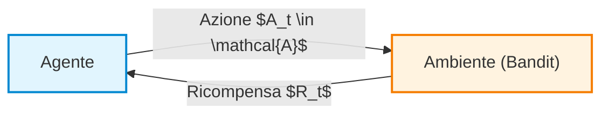
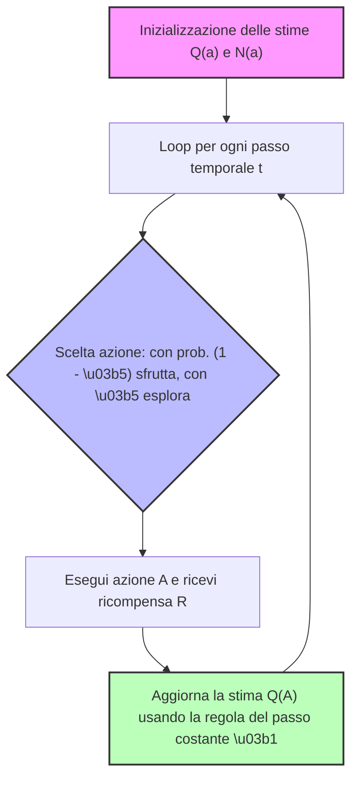
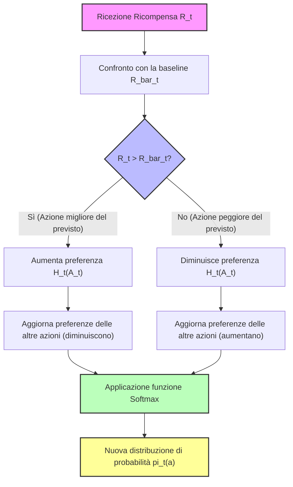
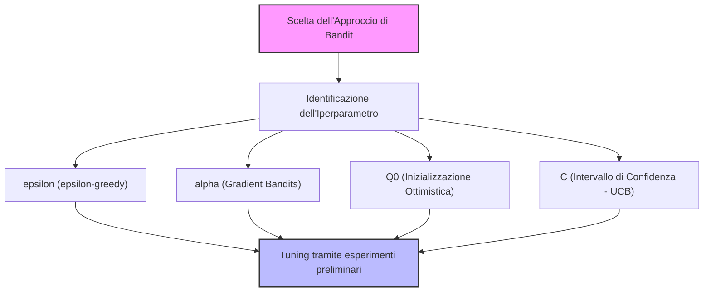
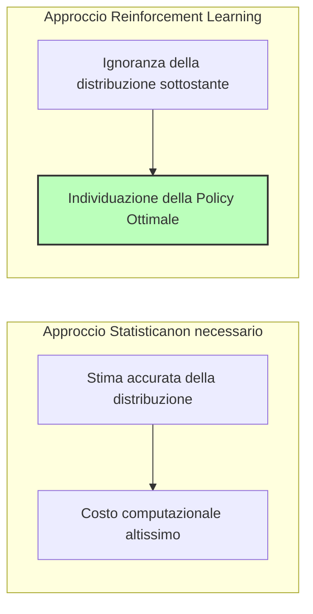
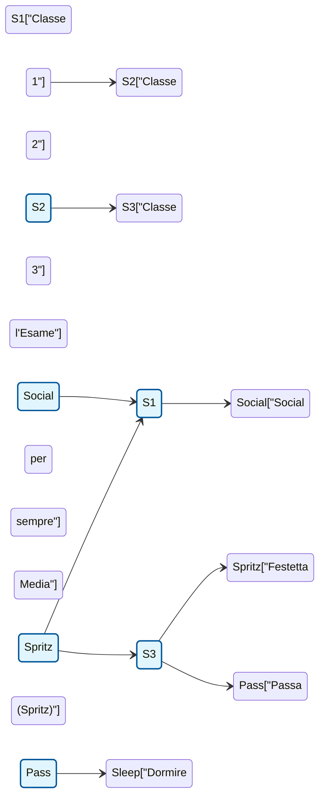

# Lezione 1: Conclusione dei Multi-Armed Bandits e Introduzione ai Markov Decision Processes

## Overview Didattica
In questa lezione vengono completati i concetti relativi ai *Multi-Armed Bandits* (capitolo 2 del testo di riferimento), focalizzandosi sull'efficienza computazionale tramite l'implementazione incrementale della stima della media campionaria (*sample average method*). Successivamente, viene introdotto il formalismo matematico fondamentale per la modellazione dei problemi di apprendimento sequenziale: i *Markov Decision Processes* (MDP). Vengono inoltre fornite comunicazioni logistiche relative al calendario dei laboratori di programmazione e alle modalità eccezionali per gli esoneri parziali riservate agli studenti internazionali o in conflitto di orario.

---

### Introduzione e Informazioni Logistiche del Corso

Prima di approfondire i contenuti teorici, riassumiamo brevemente alcune note organizzative:
* **Esami parziali:** In caso di gravi e verificabili motivi di sovrapposizione o trasferta, chi supera il primo parziale potrà sostenere il secondo parziale durante la prima data ufficiale di gennaio.
* **Materiale didattico:** Le slide vengono aggiornate regolarmente durante il corso; per avere una panoramica anticipata del programma è possibile consultare i materiali dell'anno accademico precedente.
* **Laboratori di programmazione:** Le esercitazioni pratiche sono facoltative, ma fortemente consigliate sia per comprendere a fondo gli algoritmi sia in preparazione all'eventuale progetto d'esame. I notebook e le registrazioni saranno resi disponibili dopo ogni sessione.

---

### Richiamo: Il Problema dei Multi-Armed Bandit

Il problema del **Multi-Armed Bandit** (Bandito a più braccia) rappresenta un'astrazione fondamentale per il Reinforcement Learning (RL). Pur trattandosi di un modello semplificato, introduce elementi cardine che ritroveremo in tutta la disciplina.

Le caratteristiche distintive di questo contesto sono:
1. **Assenza di dinamica di stato:** Possiamo considerare il problema come privo di stato o caratterizzato da un unico stato invariante.
2. **Decisioni non sequenziali:** Ogni episodio o esperienza consiste nella selezione di una singola azione e nell'immediata ricezione di una ricompensa (*reward*). L'episodio termina subito, senza influenzare lo stato successivo.
3. **Agency (capacità decisionale):** L'agente ha a disposizione un insieme finito di $K$ azioni possibili, $a \in \mathcal{A}$ (con $|\mathcal{A}| = K$).

L'obiettivo dell'agente è apprendere una **politica** (*policy*) ottimale, ovvero una regola decisionale che gli consenta di massimizzare la somma totale delle ricompense attese.

---

### Stima del Valore delle Azioni: Funzione Action-Value

Per guidare le scelte dell'agente, è fondamentale quantificare il valore di ciascuna azione. Il valore teorico di un'azione $a$, indicato con $q_*(a)$, è definito come il valore atteso della ricompensa ottenuta scegliendo tale azione:

$$q_*(a) \doteq \mathbb{E}[R_t \mid A_t = a]$$

Poiché l'agente non conosce a priori le distribuzioni di probabilità delle ricompense, deve stimare $q_*(a)$ empiricamente dai dati raccolti durante la propria esperienza. 

Indichiamo con $Q_t(a)$ la stima del valore dell'azione $a$ al passo temporale $t$. Il metodo più naturale è la **media campionaria** (*sample-average method*):

$$Q_t(a) \doteq \frac{\sum_{i=1}^{t-1} R_i \cdot \mathbb{I}(A_i = a)}{\sum_{i=1}^{t-1} \mathbb{I}(A_i = a)}$$

dove $\mathbb{I}(\cdot)$ è la funzione indicatrice, che vale $1$ se l'azione $a$ è stata scelta all'istante $i$, e $0$ altrimenti.

> **Concetto Chiave:** La media campionaria è uno stimatore non distorto (*unbiased*) del valore atteso della ricompensa. All'aumentare delle selezioni di una determinata azione, per la Legge dei Grandi Numeri, la stima $Q_t(a)$ converge quasi certamente al valore reale $q_*(a)$.

---

### Implementazione Incrementale

L'implementazione ingenua della media campionaria richiederebbe di memorizzare l'intero storico delle ricompense ottenute per ogni azione, ricalcolando la somma a ogni passo. Questo approccio è inefficiente sia in termini di memoria sia di complessità computazionale.

È possibile riformulare il calcolo della media in modo **incrementale**.

#### Derivazione Matematica
Consideriamo una specifica azione e indichiamo con $R_i$ la ricompensa ricevuta dopo averla selezionata per l'$i$-esima volta. Sia $Q_n$ la stima del valore dopo $n-1$ selezioni:

$$Q_n = \frac{R_1 + R_2 + \dots + R_{n-1}}{n-1}$$

All'arrivo della $n$-esima ricompensa $R_n$, la nuova stima $Q_{n+1}$ si ottiene come:

$$Q_{n+1} = \frac{1}{n} \sum_{i=1}^{n} R_i$$

Isolando l'ultimo termine della sommatoria:

$$Q_{n+1} = \frac{1}{n} \left( R_n + \sum_{i=1}^{n-1} R_i \right)$$

Poiché $\sum_{i=1}^{n-1} R_i = (n-1) Q_n$, possiamo sostituire:

$$Q_{n+1} = \frac{1}{n} \left( R_n + (n-1) Q_n \right)$$
$$Q_{n+1} = \frac{1}{n} \left( R_n + n Q_n - Q_n \right)$$
$$Q_{n+1} = Q_n + \frac{1}{n} [R_n - Q_n]$$

*(Nota: I passaggi algebrici sono stati esplicitati per chiarezza didattica).*

---

#### Struttura Generale dell'Aggiornamento

La forma ottenuta è una delle equazioni fondamentali del Reinforcement Learning e segue il pattern universale:

$$\text{NuovaStima} \leftarrow \text{VecchiaStima} + \text{Passo} \cdot [\text{Target} - \text{VecchiaStima}]$$

* **$\text{Target} = R_n$:** Rappresenta la nuova osservazione empirica.
* **$[\text{Target} - \text{VecchiaStima}] = [R_n - Q_n]$:** È l'**errore di stima** (o *innovazione*), ossia l'informazione inedita portata dal nuovo dato rispetto alla conoscenza pregressa.
* **$\text{Passo} = \frac{1}{n}$:** Determina il peso attribuito all'errore di stima nell'aggiornamento.

#### Vantaggi Computazionali
1. **Memoria ridotta:** Non serve salvare tutte le ricompense passate. È sufficiente memorizzare:
   * Un vettore delle stime correnti $Q(a)$ di dimensione $K$.
   * Un vettore dei contatori $N(a)$ di dimensione $K$ (numero di volte in cui l'azione $a$ è stata eseguita).
2. **Costo computazionale costante:** L'aggiornamento richiede complessità temporale $\mathcal{O}(1)$ a ogni passo (una sottrazione, una moltiplicazione e una somma).

---

### Limiti della Media Semplice e Cenno ai Problemi Non Stazionari

Nell'aggiornamento con media campionaria, il passo di apprendimento $\alpha_n = \frac{1}{n}$ decresce all'aumentare del numero di campioni $n$. 

* **Comportamento asintotico:** Quando un'azione è stata selezionata molte volte ($n$ elevato), $\frac{1}{n} \to 0$. Di conseguenza, anche a fronte di una ricompensa $R_n$ molto diversa dalla stima attuale (grande errore di stima), la correzione apportata a $Q_n$ sarà quasi trascurabile.
* **Problema:** Questo comportamento è desiderabile in ambienti **stazionari** (dove le distribuzioni di probabilità delle ricompense non variano nel tempo). Tuttavia, in contesti **non stazionari** — in cui le ricompense variano nel tempo — un peso decrescente impedisce all'agente di adattarsi ai cambiamenti ambientali recenti.

---

### Gestione dei problemi non stazionari

Nei problemi in cui la distribuzione da cui peschiamo le ricompense cambia nel tempo (problemi non stazionari, *non-stationary problems*), l'approccio classico basato sulla media campionaria in cui si memorizzano tutte le azioni passate non è più sufficiente. Se l'ambiente cambia, dobbiamo essere in grado di adattarci e dare più importanza ai dati recenti rispetto a quelli vecchi, senza dover ricalcolare tutto da capo salvando lo storico completo.

Un'approssimazione comune consiste nell'aggiornare la stima del valore di un'azione utilizzando una dimensione del passo (*step size*) costante $\alpha$ (ad esempio $0.1$ o $0.01$), invece di dividere per il numero di volte $n$ che l'azione è stata scelta:

$$Q_{n+1} = Q_n + \alpha (R_n - Q_n)$$

Dove:
- $Q_n$ è la stima precedente.
- $R_n$ è la nuova ricompensa ottenuta.
- $(R_n - Q_n)$ rappresenta l'errore di stima (*error*).
- $\alpha \in (0, 1]$ è il passo di aggiornamento costante.

Questo approccio permette di tracciare problemi non stazionari perché assegna un peso maggiore ai reward recenti, mentre l'importanza dei reward passati diminuisce esponenzialmente nel tempo. 
> **Concetto Chiave:** Useremo spesso argomenti telescopici (*telescopic arguments*) per dimostrare proprietà matematiche e teoremi legati a questi aggiornamenti nel corso di Reinforcement Learning. Isolare una quantità, considerarla un passo indietro e sommarla ricorsivamente è un trucco algebrico fondamentale.

---

### Il dilemma esplorazione-esploitazione

Un aspetto fondamentale nel Reinforcement Learning è il **dilemma esplorazione-esplotazione** (*exploration-exploitation dilemma*):
- **Sfruttamento (*Exploitation*):** Se l'obiettivo è massimizzare la ricompensa immediata, dobbiamo scegliere l'azione che sappiamo essere la migliore in base alle stime attuali. (Es. andare sempre nel ristorante che sappiamo essere ottimo).
- **Esplorazione (*Exploration*):** Se non siamo certi delle altre opzioni, rischiamo di perdere opportunità migliori. Dobbiamo provare azioni alternative per capire se possono offrirci un valore superiore. (Es. provare un nuovo ristorante).

Senza esplorazione, rischiamo di rimanere bloccati su soluzioni sub-ottimali guidate da stime iniziali errate.

---

### L'algoritmo $\varepsilon$-greedy

Un approccio semplice ed efficace per gestire il dilemma è la strategia **$\varepsilon$-greedy** (*$\varepsilon$-greedy algorithm*):
- Per la maggior parte del tempo (con probabilità $1 - \varepsilon$, ad esempio $90\%$ o $99\%$), si sceglie lo sfruttamento: si seleziona l'azione greedy, ovvero quella che massimizza la stima $Q$.
- Per una piccola percentuale del tempo (con probabilità $\varepsilon$, ad esempio $1\%$ o $10\%$), si sceglie l'esplorazione: si seleziona un'azione a caso con probabilità uniforme tra tutte le azioni disponibili.

#### Pseudocodice dell'algoritmo a Bandit con $\varepsilon$-greedy

---

### Valori iniziali ottimistici (*Optimistic Initial Values*)

Oltre a $\varepsilon$-greedy, esistono altre idee per favorire l'esplorazione. Una di queste consiste nel modificare i valori iniziali della distribuzione attesa (*priors*): i **valori iniziali ottimistici**.

Invece di inizializzare le stime $Q(a)$ a zero (che è una scelta del tutto arbitraria), possiamo impostarle su valori artificialmente alti rispetto alle reali ricompense che ci attendiamo dall'ambiente. 
- *Esempio:* Se sappiamo che una slot machine restituisce al massimo 1 moneta, possiamo impostare la stima iniziale $Q(a) = 10$.
- *Perché funziona:* Quando l'agente prova un'azione e riceve una ricompensa inferiore alle aspettative ottimistiche ($R < Q$), rimarrà deluso e l'errore di stima spingerà l'algoritmo a provare immediatamente un'altra azione. Questo incoraggia naturalmente una forte esplorazione iniziale in modo nativo, senza bisogno di forzare scelte casuali tramite $\varepsilon$. Sfrutta la conoscenza a priori (*a priori knowledge*) che abbiamo sul problema.

---

### Metodo dei Valori Iniziali Ottimistici (Optimistic Initial Values)

Un primo approccio alternativo alla strategia $\epsilon$-greedy per gestire il dilemma tra esplorazione e sfruttamento (exploitation vs exploration) consiste nell'utilizzare i **valori iniziali ottimistici** (*optimistic initial values*). 

Immaginiamo di trovarci di fronte a una situazione simile a quella di un giocatore d'azzardo un po' "deluso" o eccessivamente fiducioso, che inserisce una moneta in una slot machine pensando ingenuamente di ottenere indietro in media dieci volte la posta. Possiamo applicare questa stessa mentalità al nostro agente: supponiamo, ad esempio, che all'inizio di un problema medico ogni volta che prescriviamo una cura ci aspettiamo di guarire due pazienti. Naturalmente questa stima è irrealistica, ma introdurre un'inizializzazione fortemente ottimistica possiede una proprietà molto interessante per la fase di apprendimento: **favorisce in modo naturale l'esplorazione**.

Vediamo come funziona passo dopo passo:
1. All'inizio, impostiamo i valori stimati delle azioni $Q(a)$ su un valore molto più alto rispetto al massimo ricompensa reale che ci attendiamo.
2. Scegliamo un'azione e otteniamo una ricompensa positiva (es. $+1$). La stima per quell'azione si aggiorna di conseguenza.
3. Con un approccio avido normale (*greedy*), continueremmo a sfruttare sempre quell'azione, ignorando le altre. Tuttavia, con i valori iniziali ottimistici, le altre azioni non ancora provate mantengono un valore $Q$ iniziale molto elevato (es. $6.2$ contro l'1.5 dell'azione appena provata). 
4. Di conseguenza, l'agente deciderà di provare le altre azioni, non perché spinto da una componente casuale (come $\epsilon$), ma perché le loro stime iniziali appaiono ancora più allettanti.

Questo comportamento incarna un principio fondamentale che incontreremo spesso nel corso: l'**ottimismo di fronte all'incertezza** (*optimism in the face of uncertainty*). Se non sappiamo quale scelta intraprendere, assumiamo temporaneamente che l'esito sarà eccezionalmente positivo.

#### Esercizio Pratico e Risultati a Lungo Termine
Confrontando due configurazioni sullo stesso problema numerico standard:
* **Linea Blu:** Approccio puramente avido ($\epsilon = 0$) ma con valori iniziali ottimistici ($Q = 5$, un valore molto alto rispetto alle medie reali).
* **Linea Arancione:** Approccio avido standard con una piccola percentuale di esplorazione ($\epsilon = 0.1$, ovvero 10%) e stime iniziali fissate a zero ($Q = 0$).

Nei primi stadi della simulazione, il semplice trucco di impostare $Q = 5$ permette all'agente di ottenere prestazioni complessivamente superiori, misurate come percentuale di tempo in cui viene scelta l'azione realmente ottimale.

> **Concetto Chiave:** L'effetto dei valori iniziali ottimistici è **transitorio**. Fornisce un forte beneficio di esplorazione unicamente nella fase iniziale dell'apprendimento. Con il passare del tempo, man mano che i dati si accumulano e le stime si aggiornano, l'influenza dei valori iniziali svanisce e l'agente se ne "dimentica".

In molte applicazioni reali, tuttavia, potremmo non conoscere a priori quale sia un valore "ottimistico" adeguato. Inoltre, nella pratica, le due strategie (valori iniziali ottimistici e $\epsilon$-greedy) non si escludono a vicenda, ma **vengono spesso usate insieme** (ad esempio, impostando $Q$ alto all'inizio ma mantenendo anche un $\epsilon > 0$ piccolo, come $0.01$).

---

### Introduzione all'Upper Confidence Bound (UCB)

Esploriamo ora un secondo approccio per gestire la scelta delle azioni esplorative, modificando il modo in cui selezioniamo le azioni quando non ci comportiamo in modo puramente avido.

Fino ad ora abbiamo considerato solo una stima puntuale della ricompensa attesa $Q(a)$. Tuttavia, un agente può trarre grande vantaggio dal monitorare anche la **variabilità** o l'incertezza associata a quella stima. 

Statisticamente, man mano che raccogliamo dati (*data points*) su un fenomeno, la nostra incertezza su di esso tende a ridursi. 
* Se un'azione (chiamiamola $A_2$) è stata scelta moltissime volte, la nostra stima del suo valore è molto solida e l'incertezza associata è **piccola**.
* Se un'azione ($A_3$) è stata provata poche volte, la stima è traballante e l'incertezza è **grande**.

Invece di affidarci unicamente alla media attesa, possiamo stimare un intervallo di confidenza (rappresentato visivamente come dei "baffi" o *whisker* attorno alla media). L'idea di fondo dell'**Upper Confidence Bound (UCB)** è quella di selezionare l'azione non in base alla media più alta, ma in base al **limite superiore della stima**, ovvero l'azione che *potenzialmente* può fornire il rendimento migliore considerando l'incertezza:

$$\text{Azione UCB} = \operatorname*{arg\,max}_{a} \left[ Q(a) + c \sqrt{\frac{\ln t}{N(a)}} \right]$$

*Nota: Passaggio integrato con chiarezza didattica per formalizzare il concetto discusso a lezione.*

Analizzando la formula dell'algoritmo UCB:
* Il primo termine, $Q(a)$, rappresenta la **sfruttamento** (*exploitation*): premia le azioni che in media hanno reso di più.
* Il secondo termine rappresenta l'**esplorazione** (*exploration*): cresce se l'azione è stata scelta poche volte ($N(a)$ è piccolo) e diminuisce man mano che il tempo $t$ avanza e quell'azione viene esplorata. Il parametro $c > 0$ controlla il grado di esplorazione.

Questo approccio spinge l'agente a scegliere azioni di cui è ancora molto incerto, non per puro caso, ma perché esiste la concreta possibilità (statistica) che siano le migliori.

---

### Cenni sull'Algoritmo Gradient Bandit

Un terzo e ultimo approccio introdotto brevemente è l'algoritmo **Gradient Bandit**. 

A differenza dei metodi visti finora, che stimano direttamente il valore atteso delle ricompense $Q(a)$ per ciascuna azione, il metodo Gradient Bandit **apprende una preferenza numerica** per ciascuna azione, indicata con $H_t(a)$. 

La probabilità di scegliere un'azione a un determinato istante non dipende direttamente dal valore stimato della ricompensa, ma viene ricavata applicando una funzione di distribuzione di probabilità (tipicamente la funzione **Softmax**) alle preferenze:

$$P(A_t = a) = \frac{e^{H_t(a)}}{\sum_{b=1}^{k} e^{H_t(b)}}$$

* Quando l'agente riceve una ricompensa, le preferenze dell'azione scelta vengono aggiornate tramite **discesa/ascesa del gradiente stocastico** (*stochastic gradient ascent*): l'azione che ha portato a un risultato migliore della media delle ricompense storiche vedrà la sua preferenza $H$ aumentare, incrementando la probabilità di essere scelta in futuro, mentre le altre vedranno la loro preferenza ridursi.

---

### Algoritmo Gradient Bandit e Funzione Softmax

Mentre le strategie viste in precedenza (come l'esplorazione basata su $\epsilon\text{-greedy}$ o l'approccio Upper Confidence Bound - UCB) modificano direttamente la scelta dell'azione basandosi sul valore stimato dei ritorni, esiste un'altra classe di approcci che sposta l'attenzione sulle **preferenze d'azione**. L'algoritmo **Gradient Bandit** appartiene a questa famiglia.

#### Il concetto di Preferenza e il limite di $\epsilon\text{-greedy}$

Negli approcci come $\epsilon\text{-greedy}$, la scelta dell'azione non ottimale avviene in modo del tutto casuale (uniforme). Tuttavia, man mano che raccogliamo dati, possiamo renderci conto che alcune azioni non ottimali sono decisamente peggiori di altre. 

Invece di affidarci a stime dirette del valore e a selezioni casuali, l'idea alla base del Gradient Bandit è quella di associare a ciascuna azione una quantità numerica detta **preferenza** (preference), indicata con $H_t(a)$. 
- Lo spazio delle preferenze $H$ ha la stessa cardinalità dello spazio delle azioni $K$.
- Le preferenze non sono probabilità: possono assumere qualsiasi valore reale (positivo, negativo o zero).
- Le preferenze cambiano nel tempo man mano che l'agente raccoglie esperienza e aggiorna le proprie informazioni su quanto sia conveniente scegliere una determinata azione.

#### L'uso della funzione Softmax per la definizione delle politiche

Poiché l'agente ha bisogno di probabilità per scegliere le azioni (e non di semplici punteggi di preferenza), dobbiamo mappare il vettore delle preferenze $H_t(a)$ in una distribuzione di probabilità. Ricordiamo che una funzione di probabilità deve soddisfare due requisiti fondamentali:
1. Tutte le probabilità devono essere positive.
2. La somma delle probabilità su tutte le azioni possibili deve essere esattamente pari a $1$.

Per ottenere questo risultato senza imporre restrizioni complesse durante l'aggiornamento, utilizziamo la funzione **Softmax** (molto nota anche nel Deep Learning, ad esempio nell'ultimo livello di una rete neurale per la classificazione). 

Definiamo la probabilità di scegliere l'azione $a$ al tempo $t$ come:

$$\pi_t(a) = \frac{e^{H_t(a)}}{\sum_{b=1}^{K} e^{H_t(b)}}$$

Grazie alla proprietà esponenziale $e^{x} > 0$, il numeratore è sempre positivo. Dividendo per la somma di tutti gli esenziali al denominatore, otteniamo una distribuzione di probabilità normalizzata compresa tra $0$ e $1$ la cui somma totale è $1$.

#### Aggiornamento delle preferenze nel Gradient Bandit

Come si aggiornano le preferenze $H_t(a)$ dopo aver eseguito un'azione e aver osservato una ricompensa? L'intuizione fondamentale è la seguente:
- Se otteniamo una ricompensa **più alta** del valore atteso (o della media delle ricompense ottenute fino a quel momento), la preferenza per quell'azione deve **aumentare**, rendendola più probabile in futuro. Contestualmente, le preferenze di tutte le altre azioni dovrebbero **diminuire**.
- Se la ricompensa è **inferiore** alle attese, la preferenza per quell'azione deve **diminuire**, mentre quelle delle altre azioni aumenteranno.

Disponiamo di due equazioni distinte per l'aggiornamento: una specifica per l'azione appena selezionata $A_t$ e un'altra per tutte le altre azioni $a \neq A_t$.

**Aggiornamento per l'azione scelta $A_t$:**
$$H_{t+1}(A_t) = H_t(A_t) + \alpha (R_t - \bar{R}_t)(1 - \pi_t(A_t))$$

**Aggiornamento per tutte le altre azioni $a \neq A_t$:**
$$H_{t+1}(a) = H_t(a) - \alpha (R_t - \bar{R}_t)\pi_t(a)$$

Dove:
- $\alpha > 0$ è il tasso di apprendimento (learning rate).
- $R_t$ è la ricompensa ottenuta al tempo $t$.
- $\bar{R}_t$ è la ricompensa media stimata fino al tempo $t$ (che funge da baseline).
- $\pi_t(a)$ è la probabilità associata all'azione calcolata tramite Softmax.

Attraverso questo meccanismo, agiamo direttamente sui valori di preferenza $H$, i quali vengono tradotti in probabilità tramite Softmax, guidando in modo dinamico e continuo la politica di esplorazione ed emulsione dell'agente.

---

### L'importanza della Baseline nei Gradient Bandits e il Ruolo degli Iperparametri

Continuando l'analisi degli algoritmi di bandit basati su gradiente (Gradient Bandits), esaminiamo l'impatto fondamentale dell'introduzione di una **baseline** e della scelta della dimensione del passo, nota come **learning rate** o **step size** ($\alpha$).

#### Il Ruolo della Baseline
Nel confronto tra le versioni dell'algoritmo fornite nel testo di riferimento (su un problema a 10 azioni), l'utilizzo di una baseline fa sempre registrare prestazioni superiori. 

* **Concetto Chiave**: Senza la baseline, l'equazione di aggiornamento perde una componente di normalizzazione cruciale. Nella pratica reale, gli algoritmi senza baseline non vengono praticamente mai impiegati perché non funzionano in modo efficiente.
* **Perché funziona?** Supponiamo di ricevere una nuova ricompensa $R_t = 200$. Se la nostra stima precedente della ricompensa media era pari a $0$, quel valore rappresenta un feedback estremamente positivo per l'azione appena compiuta. Se invece la media storica si attestava già a $199$, ottenere $200$ non è indice di un successo straordinario legato specificamente all'azione intrapresa, ma rientra nella norma. La baseline agisce quindi come un termine di confronto normalizzante che ci permette di valutare quanto una ricompensa sia realmente "sorprendente" o buona rispetto alla media ottenuta finora.

#### Il Trade-off dello Step Size ($\alpha$)
Il parametro $\alpha$ regola l'aggressività dell'aggiornamento delle preferenze in base alle nuove informazioni. 
* Se $\alpha$ è **grande** (es. $\alpha = 0.4$), l'agente impara molto rapidamente all'inizio, ma non converge mai stabilmente a una soluzione ottimale definitiva, oscillando.
* Se $\alpha$ è **piccolo** (es. $\alpha = 0.1$), l'apprendimento è più lento, ma le stime a lungo termine risultano più stabili e precise, permettendo di raggiungere valori di ricompensa complessivi più alti.

La politica seguita dall'agente non è deterministica, ma **probabilistica**: le preferenze stimate vengono tradotte in probabilità di scelta tramite una distribuzione (ad esempio softmax), e l'azione viene estratta seguendo tali probabilità.

---

### Gli Iperparametri nei Multi-Armed Bandits

Tutti gli approcci visti finora per gestire il dilemma esplorazione-sfruttamento (exploration-exploitation) nei problemi di bandit (Multi-Armed Bandits) condividono una caratteristica comune: la presenza di **iperparametri** (hyperparameters) che devono essere sintonizzati (tuned) dall'utente, a meno di non possedere una conoscenza a priori (prior knowledge) specifica del dominio.

* $\epsilon$ (epsilon) nella strategia $\epsilon$-greedy.
* $\alpha$ (step size) nei Gradient Bandits.
* $Q_0$ (valore iniziale) nell'inizializzazione ottimistica (optimistic initialization).
* $C$ (parametro di ampiezza dell'intervallo di Confidenza) nell'Upper Confidence Bound (UCB).

Come in molti ambiti del Machine Learning, non esiste una regola universale fissa: è necessario testare diverse configurazioni empiricamente per trovare il bilanciamento ottimale per il problema specifico.

---

### Obiettivi di Apprendimento: Ottimizzazione della Policy vs. Regret

Nel contesto del Reinforcement Learning e dei problemi di bandit, è fondamentale distinguere tra due diverse filosofie di obiettivo, a seconda dell'applicazione pratica:

1. **Trovare la Policy Ottimale (Asymptotic Performance):**
   L'obiettivo primario è scoprire, al termine di una fase di training (o in ambienti stazionari in cui l'agente continua a operare indefinitamente, come nel controllo HVAC di un edificio), qual è l'azione migliore in assoluto da compiere, massimizzando la ricompensa a regime. In questo scenario, non importa quanti errori si siano fatti durante la fase iniziale di esplorazione, purché si arrivi a identificare la scelta corretta.

2. **Minimizzare il Regret (Cumulative Reward / Opportunity Cost):**
   Il *regret* rappresenta il costo delle opportunità mancate, ovvero la somma delle ricompense che *non* abbiamo ottenuto a causa di scelte sub-ottimali durante il percorso di apprendimento. 
   * *Esempio:* Se spendiamo tutte le nostre risorse economiche giocando su slot machine sbagliate e capiamo qual è quella vincente solo all'ultimo tentativo, avremo perso tutto il capitale. In contesti in cui ogni errore ha un costo economico o temporale immediato (es. sperimentazione clinica di farmaci o pubblicità online), minimizzare il regret cumulativo nel corso degli episodi è molto più importante che trovare la politica perfetta alla fine dei tempi.

---

### Il Vero Scopo del Reinforcement Learning: Politiche vs. Stime della Distribuzione

Un concetto chiave, spesso ribadito anche in sede d'esame, riguarda la natura stessa dell'obiettivo nel Reinforcement Learning: **non ci interessa stimare accuratamente la distribuzione statistica sottostante**.

* Stimare accuratamente le distribuzioni di probabilità delle ricompense richiede una quantità enorme di dati, episodi e risorse computazionali.
* Nel RL, il nostro unico vero traguardo è **trovare la policy corretta**, ovvero sapere quale azione intraprendere.

Può accadere che la stima matematica del valore medio di un'azione sia fortemente imprecisa o "errata" rispetto alla realtà, ma fintanto che quell'errore di stima preserva l'ordinamento relativo tra le azioni, l'agente sceglierà comunque l'azione corretta. Essere "ignoranti" sulla distribuzione esatta del problema non impedisce di trovare la strategia di azione ideale. Questo principio guida non solo i bandit, ma l'intero corso di Reinforcement Learning.

---

### Cenni Finali e Letture Consigliate

* **Sezione 2.9 (Contextual Bandits):** Trattata nel testo di riferimento e molto utilizzata in ambiti come il marketing (spesso combinata con tecniche di apprendimento supervisionato o clustering). Rappresenta un ottimo spunto per eventuali tesi o progetti pratici, pur non rientrando tra gli argomenti principali oggetto d'esame.
* **Derivazione dei Gradient Bandits:** La derivazione matematica dei gradient bandits a partire dalla discesa del gradiente (gradient descent) è presente nel libro ed è consigliata per i lettori più curiosi, pur rimanendo un approfondimento facoltativo.

---

### Dai Multi-Armed Bandits ai Processi Decisionali di Markov (MDP)

Finora abbiamo analizzato il framework dei Multi-Armed Bandits (MAB). Tuttavia, i Bandits presentano due limitazioni fondamentali che ne impediscono l'utilizzo in problemi complessi:
1. **Assenza del concetto di stato**: Lo stato è sempre lo stesso. Dopo aver compiuto un'azione (es. premere una leva), l'agente viene riportato esattamente nella stessa situazione iniziale.
2. **Mancanza di decision-making sequenziale**: Non esiste una sequenza di azioni interdipendenti nel tempo (come invece avviene negli scacchi, dove la mossa di un pezzo influenza tutte le configurazioni future). Nei Bandit si compie un'azione singola e l'episodio termina.

Per superare questi limiti, introduciamo due elementi chiave:
* **Il concetto di stato ($s$)**: Lo stato rappresenta l'ambiente esterno che definisce il contesto in cui si trova l'agente. Ad esempio, un coniglio vede una carota alla sua sinistra e un broccolo alla sua destra. Lo stato può cambiare nel tempo (es. in un episodio successivo la disposizione cambia, oppure l'agente si sposta).
* **Decisioni sequenziali**: Le azioni prese ora influenzano gli stati futuri. Il coniglio potrebbe preferire la carota (maggiore ricompensa immediata), ma questo lo porta a trovarsi di fronte a un puma (pessimo stato futuro). Conviene quindi sacrificare la ricompensa immediata (scegliendo il broccolo) per evitare conseguenze peggiori nei passi successivi.

Nel nuovo scenario generale, ogni volta che l'agente si trova in un dato stato $s_t$ e compie un'azione $a_t$, l'ambiente compie due azioni fondamentali:
1. Trhespetta l'agente in un nuovo stato $s_{t+1}$.
2. Restituisce una ricompensa $r_{t+1}$.

Questo ciclo viene ripetuto continuamente fino al verificarsi di una condizione terminale (ad esempio, il puma cattura il coniglio).

---

### Introduzione ai Processi Decisionali di Markov (MDP)

Per formalizzare matematicamente questo problema, utilizziamo un framework noto come **Processi Decisionali di Markov (Markov Decision Processes - MDP)**. 

> [!NOTE] Concetto Chiave
> **Il ruolo degli MDP nell'Apprendimento Rinforzato (Reinforcement Learning)**: 
> Spesso ci si chiede perché studiare gli MDP se l'obiettivo del Reinforcement Learning è l'agente intelligente. La risposta è che l'MDP costituisce il **modello matematico sottostante** (underlying formalism) del problema. Per costruire un simulatore o descrivere l'ambiente, abbiamo bisogno di definire un MDP. 
> La vera sfida (e la magia) del Reinforcement Learning è che **l'agente di RL non conosce quasi nulla di questo MDP sottostante**, eppure, attraverso l'interazione, sarà in grado di risolverlo.

Per mantenere un approccio graduale (*gentle approach*), non introduciamo subito i 5 elementi completi degli MDP, ma procediamo per passi attraverso una codifica a colori:
1. **Processi di Markov (Markov Processes - MP)**
2. **Processi di Decisione e Ricompensa di Markov (Markov Reward Processes - MRP)**
3. **Processi Decisionali di Markov (Markov Decision Processes - MDP)**

Analizzeremo inizialmente il caso **totalmente osservabile** (*fully observable case*), in cui queste formalizzazioni sono note all'agente.

---

### La Proprietà di Markov (Markov Property)

Il concetto fondamentale alla base di questa formalizzazione è lo **stato**. Lo stato deve catturare tutto ciò che è rilevante per l'agente per risolvere il compito assegnato. 

In particolare, in questa teoria lo stato gode della **Proprietà di Markov** (*Markov property*):

> [!NOTE] Concetto Chiave
> **Proprietà di Markov**: Uno stato è Markoviano se racchiude in sé tutte le informazioni rilevanti provenienti dalla storia passata. 
> 
> In parole semplici: **la storia non conta**. Se vogliamo stimare il prossimo stato o la prossima ricompensa, non abbiamo bisogno di ricordare l'intera traiettoria percorsa dall'agente (es. tutti i luoghi visitati dal coniglio nella savana prima di incontrare il puma), ma ci basta unicamente lo **stato corrente**.

---

### Conclusioni e Approfondimenti

#### Il concetto di Stato e la Proprietà Markoviana
Nel contesto dell'apprendimento e della formalizzazione di un problema, il concetto di stato è fondamentale. Dire che un sistema è **Markoviano** (proprietà Markoviana, *Markovian property*) significa che la formalizzazione attuale racchiude già tutto ciò che è utile ai fini del sistema: se lo stato è scritto correttamente, possiamo dimenticare completamente la storia passata delle osservazioni. 

Per fissare l'intuizione su quanto la definizione dello stato sia critica, consideriamo l'esperimento di uno scienziato su un topo di laboratorio:
* **Episodio 1:** il topo vede una luce, vede di nuovo la luce, preme una leva, sente un campanello e riceve una scossa elettrica.
* **Episodio 2:** il topo sente un campanello, vede una luce, preme la leva una volta, la preme una seconda volta e ottiene un bel pezzo di formaggio.
* **Episodio 3:** il topo preme una leva, vede una luce, preme di nuovo la leva, sente un campanello... cosa succederà?

A seconda di come decidiamo di definire lo stato, le conclusioni cambiano radicalmente:
1. Se definiamo lo stato come *il numero di volte che la leva è stata premuta*, nei primi passaggi la leva è stata premuta una o due volte, portando alternativamente a scosse o formaggio.
2. Se definiamo lo stato come *la sequenza degli ultimi tre eventi accaduti*, l'agente potrebbe interpretare l'episodio $C$ come identico a situazioni che in precedenza hanno portato a una scossa.

Esistono molteplici formalizzazioni possibili (gli ultimi $N$ eventi, il numero di volte che si attiva un campanello o si vede una luce, ecc.). La definizione dello stato è cruciale perché determina direttamente l'evoluzione e l'esito dell'esperimento per il nostro agente.

#### Processi di Markov (Markov Processes)
Per studiare la transizione tra stati in un ambiente privo di *agency* (ovvero senza azioni scelte da un agente o ricompense, osservando semplicemente un fenomeno che evolve), introduciamo i **Processi di Markov** (*Markov Processes*). Un processo di Markov è caratterizzato da due elementi principali:
* Un insieme di stati $\mathcal{S}$ (chiamato anche spazio degli stati, *state space*).
* Una **matrice di probabilità di transizione** (*transition probability matrix*).

In uno scenario non deterministico, la matrice di transizione descrive la probabilità di trovarsi in un nuovo stato partendo dallo stato corrente $s$. Se indichiamo con $s$ le righe (stato di partenza) e con $s'$ le colonne (stato di arrivo), la matrice ci dice, ad esempio, qual è la probabilità di passare dallo stato 1 allo stato 4 o allo stato 10. 

Essendo basato sulla proprietà Markoviana, il processo è **privo di memoria** (*memoryless*): la storia precedente viene completamente scartata e l'evoluzione dipende unicamente dallo stato corrente attraverso le probabilità di transizione.

#### Esempio: La catena di Markov dello studente
Immaginiamo una prospettiva accademica modellata come una catena di Markov, dove osserviamo il comportamento degli studenti senza intervenire attivamente. Ci sono $7$ stati possibili (es. seguire la lezione 1, la lezione 2, la lezione 3, farsi distrarre dai social media come Instagram, andare a festeggiare con uno Spritz, passare l'esame, o andare a dormire per sempre).

Ogni freccia tra gli stati ha una determinata probabilità associata:
* Esistono transizioni legali ed forzate (con probabilità non nulla).
* Esistono transizioni con probabilità pari a zero (per esempio, è impossibile passare direttamente dalla classe 1 allo stato terminale "dormire per sempre").
* Alcuni stati sono **stati terminali** (*terminal states*), dai quali non si può più uscire (come andare a dormire per sempre). 

La struttura di transizione può essere rappresentata come una matrice quadrata dove righe e colonne corrispondono agli stati $\mathcal{S}$, popolata da zeri dove il passaggio è impossibile e da valori di probabilità per i passaggi leciti.

##### Considerazioni sugli Stati Iniziali e Terminali
* **Stato Iniziale:** Non sempre esiste un unico stato di partenza fisso. In alcuni problemi di Reinforcement Learning (RL), lo stato iniziale può essere casuale (ad esempio, le carte distribuite in una mano di Texas Hold'em o di Blackjack).
* **Stato Terminale:** Può essercene uno solo, nessuno (processi che durano per sempre), oppure molteplici.

Un aspetto fondamentale del Reinforcement Learning è che, inizialmente, **questa matrice di probabilità di transizione non è nota all'agente**. L'agente di RL sarà comunque in grado di risolvere il processo decisionale senza conoscerla a priori.

#### Traiettorie
Osservando il sistema nel tempo, possiamo raccogliere dati sulle esperienze degli studenti che si muovono tra i vari stati (ad esempio: *Classe 2 $\to$ Classe 3 $\to$ Classe 1 $\to$ Classe 2 $\to$ Classe 3 $\to$ Passa l'esame $\to$ Dormire*). 

Queste sequenze di stati osservati nel tempo prendono il nome di **traiettorie** (*trajectories*). Le traiettorie rappresentano i dati empirici dell'evoluzione di un agente (o di un sistema) all'interno del proprio ambiente, e saranno lo strumento principale che sfrutteremo per imparare a comprendere e ottimizzare il comportamento dell'ambiente stesso.

---

> [!NOTE]
> ### Note per l'Esame e Avvisi del Docente
> - Il docente ha dichiarato che le **algoritmi (pseudocodice)** presentati nelle slide e nel libro saranno oggetto di valutazione durante le prove parziali o l'esame. È necessario comprenderne a fondo il concetto logico piuttosto che memorizzarli riga per riga.
> - Il docente ha fatto esplicito riferimento alla possibile richiesta di **derivare o manipolare formule tramite argomenti telescopici** (telescopic arguments), definendoli passaggi triviali ma molto importanti per il corso.