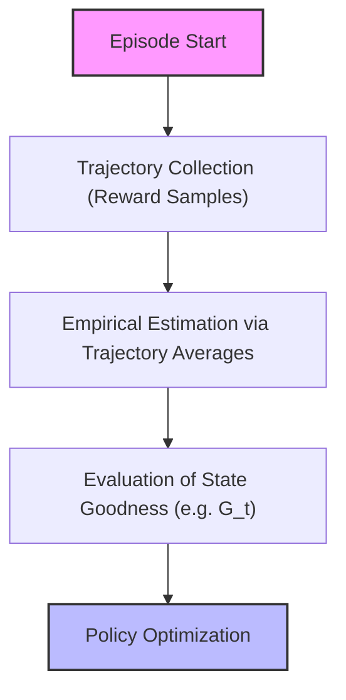
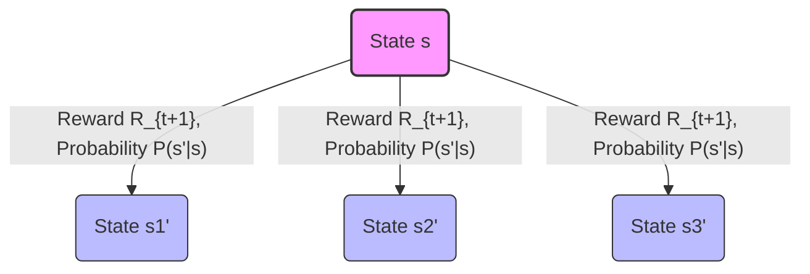
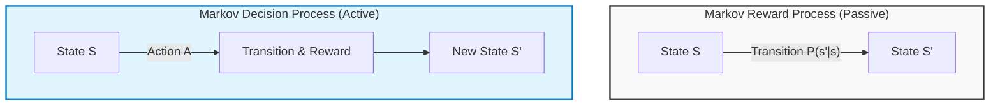
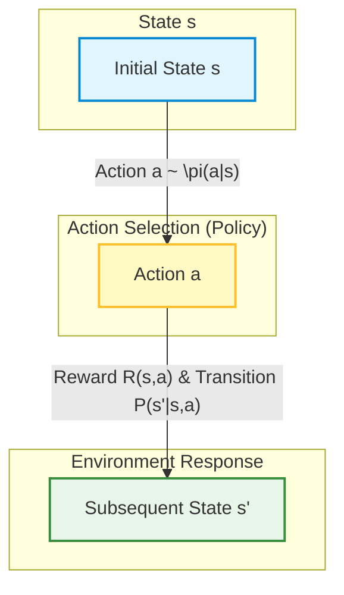

# Fundamentals of Reinforcement Learning: Markov Reward Processes (MRP) and Introduction to Bellman Equations

## Didactic Overview

This lecture explores the formal pathway leading to the mathematical modeling of Reinforcement Learning (RL). Starting from the basic framework of Markov Processes (MP) — characterized exclusively by the state space and the Transition Probability Matrix ($P$) — the discussion extends to Markov Reward Processes (MRP).

The key points addressed include:
* **Evolution of Formalization**: gradual transition from purely stochastic and descriptive models (MP) to models enriched with scalar feedback signals (MRP), up to the future inclusion of active control via actions in Markov Decision Processes (MDP).
* **Reward Function**: definition of the return signal associated with state persistence or state transition, managed in the form of an expected value to account for the environment's intrinsic potential stochasticity.
* **Discount Factor ($\gamma$)**: introduction of the mathematical parameter designed to weigh the importance of immediate rewards versus those deferred in time.
* **Passive vs. Active Perspective**: analysis of environmental dynamics (exemplified by the student model) in which the trajectory is observed without any choice capability on the part of an agent, laying the conceptual foundations for the application of the **Bellman Equations** as an analytical tool for solving decision-making processes.

---

### Introduction to Markov Decision Processes (MDP) and Markov Reward Processes (MRP)

The formalization path of Reinforcement Learning (RL) starts from the simplest cases, where the environment is completely known, and then extends to more complex scenarios (covered in chapter 5 of the reference textbook) where certain assumptions are relaxed. 

To tackle and formally solve an MDP, a fundamental mathematical tool is represented by the **Bellman equations**. Their introduction will allow us to define what it means to "solve" a Markov decision process.

---

### Review: Markov Processes

Recapping what was seen in the previous lecture, a **Markov Process** - visually identified by the green color code - is characterized by two main elements:
1. A **state space** (represented by the states of the system).
2. **Transition probabilities** between states, represented by arrows and enclosed in a transition matrix.

The transition matrix $P$ is a square matrix with cardinality (in terms of rows and columns) equal to the number of states of the system. It defines the probability of moving from one state to another at a subsequent time $t+1$, given the current state at time $t$. 

At this initial stage, the concept of an active agent or an action does not yet exist: this is a purely *passive* point of view, in which we observe the natural trajectories generated by the system.

---

### Markov Reward Processes (MRP)

Let us now take a step forward by introducing **Markov Reward Processes (MRP)**, associated with the blue color. An MRP extends the Markov process by adding a key element already encountered in the context of *Multi-Armed Bandits*: the **reward**.

Each time the environment evolves and the agent (or system) moves from one state to another, the environment provides numerical feedback in the form of a reward.

An MRP is defined by:
- A set of states.
- A transition probability matrix.
- A **reward function**.

#### The Reward Function in the MRP
As we move along a trajectory in the state space, the transition from a state $S_t$ to a subsequent state $S_{t+1}$ generates a reward. More formally, the expected reward associated with a state is defined as:

$$R_s = \mathbb{E}[R_{t+1} \mid S_t = s]$$

*Note:* The reward is not necessarily deterministic; it can be stochastic (exactly as it happened in bandit problems, where pulling a certain arm yielded stochastic payouts).

#### Example: The Student Process
Let us consider the classic student example (modeled as an MRP, hence still without actions or deliberate decisions):
- The student moves between states such as "Class 1", "Class 2", "Study", "Pub crawl (having a spritz)", "Sleep", and "Pass exam".
- Rewards are properties of the state (since there are no actions available yet):
  - Attending a lecture can be tiring, generating a negative reward (e.g., $-2$).
  - Scrolling through Instagram generates negative rewards.
  - Having a spritz is a short-term gratification (positive).
  - Passing the exam yields a large positive reward (the final "prize").

This scenario highlights a fundamental property of sequential planning: **short-term sacrifices for long-term benefits**. Studying and attending lectures is boring in the short run (negative reward), but it is the only path that allows reaching the high-reward final state (passing the exam).

---

### Toward Long-Term Decision Making

Unlike simple bandit problems, in a sequential context we must formalize long-term goals. 
We need to define mathematical quantities to optimize that do not exclusively account for immediate gains (short-term rewards), but instead evaluate the entire cumulative return along a trajectory. This will lead us, in future lectures, to introduce the final and most complete piece: **Markov Decision Processes (MDP)**, where the actions and active decisions of the agent will finally appear.

---

### Cumulative Return and Discount Factor

In the context of Markov Decision Processes (MDP) and Markov Reward Processes (MRP), we need a quantity that describes long-term success, a goal that guides us over time. 

While the immediate reward tells us how good a single action or transition is in the short term, we are interested in formally defining the **cumulative return** (return), which we will denote with the letter $G$.

#### Definition of Cumulative Return

The return $G_t$ is the sum of all rewards ($R$) that we obtain from a certain time step $t$ until the end of the episode or time:

$$G_t = R_{t+1} + R_{t+2} + R_{t+3} + \dots = \sum_{k=0}^{\infty} R_{t+k+1}$$

Unlike supervised learning where the typical goal is to *minimize* a cost or loss function, **the ultimate goal of Reinforcement Learning is to maximize the expected return $G$**. 

---

### The Discount Factor

To properly manage future rewards, we introduce a second fundamental element that will always be present in our models: the **discount factor**, denoted by the Greek letter $\gamma$ (gamma).

The discount factor $\gamma$ is a value between $0$ and $1$ ($0 \le \gamma \le 1$), and in practical applications it is often chosen very close to $1$ (e.g., $\gamma = 0.99$). 

Its intuitive meaning is tied to the time value of rewards:
- We give full importance (equal to $1$) to the immediately following reward ($R_{t+1}$).
- We give an importance equal to $\gamma$ to the subsequent reward ($R_{t+2}$).
- We give an importance equal to $\gamma^2$ to the reward after that, and so on ($\gamma^k$ for rewards further away in time).

Consequently, a reward obtained far off in the future will have a progressively decreasing weight in the total calculation.

#### Extreme Choices of the Discount Factor
- **$\gamma = 0$**: This means considering a myopic agent who cares *solely* about the immediately following reward, completely ignoring the future. This choice is never used in Reinforcement Learning.
- **$\gamma = 1$**: This means giving exactly the same weight to future rewards, regardless of when they occur. It is used in some specific classes of problems with finite episodes.

#### Why Do We Use the Discount Factor?
The professor highlights three main reasons why the introduction of $\gamma$ is crucial:

1. **Mathematical convenience**: The presence of $\gamma$ (with $\gamma < 1$) guarantees the convergence of infinite series of rewards, allowing us to prove solid theoretical theorems and properties without running into infinite and unbounded sums.
2. **Handling continuous (non-terminating) problems**: There are problems that by their very nature have no end (e.g., continuous temperature control of a room $24/7$ or financial market management). Thanks to $\gamma < 1$, rewards very far in time (e.g., at step $10,000$) are multiplied by $\gamma^{10,000}$, effectively becoming negligible. This allows us to maximize an approximated but manageable quantity.
3. **Philosophical and uncertainty perspective**: In the real world, the future is uncertain. We do not know if a model or an environment will remain stable in the very long term, or there might be intrinsic uncertainties in the transition probabilities. Valuing the future less reflects this structural uncertainty.

The discounted return is therefore mathematically formulated as:

$$G_t = R_{t+1} + \gamma R_{t+2} + \gamma^2 R_{t+3} + \dots = \sum_{k=0}^{\infty} \gamma^k R_{t+k+1}$$

---

### Learning Objectives and Empirical Analysis via Trajectories

Our ultimate goal is to find a **policy**, meaning a strategy that allows the agent to make decisions that maximize the return $G$. Even before finding the optimal strategy, however, we must be able to evaluate how "good" it is to be in a given state.

By observing a simplified MRP, we can empirically estimate the value of a state by evaluating what happens on average when following possible trajectories:
- If we are in a state from which we have a high probability (e.g., $60\%$) of transitioning to a state with a high reward (e.g., $+10$) and a lower probability (e.g., $40\%$) of ending up elsewhere, the expected value of that state will be remarkably high.
- Conversely, states that cyclically lead to penalties or negative rewards (e.g., $-2$) will have an overall unfavorable expected return, even if isolated small positive rewards (e.g., $+1$) are encountered along the path.

Through the collection of empirical samples (trajectories generated by interacting with the environment) and by calculating the average of the obtained returns, the agent learns to distinguish which states are advantageous and which are not, laying the groundwork for the future introduction of actions and optimization via Reinforcement Learning.

---

### The State-Value Function

So far we have analyzed how to move within a Markov process and how to accumulate rewards along a trajectory. However, when we want to understand how desirable it is to be in a specific situation, looking at the immediate reward is not enough: we need a long-term perspective. 

We need a quantity that tells us: *"What is the expected return I will get starting from this specific state until the end of time?"*

In Multi-Armed Bandit problems, the situation was much simpler because we did not move between different states: we chose an action (pulling a lever) and immediately observed an immediate reward, estimating its expectation. Now, in a Markov Decision Process (MDP) or a Markov Reward Process (MRP), we have not yet introduced actions. There is no "agent" actively choosing what to do; we are simply observing a system evolving through a trajectory.

In this context, we introduce a fundamental magnitude, closely related to the $Q$ quantity that we will see later: the **State-Value Function**, denoted by $V(s)$.

*   **Definition:** $V(s)$ is an array (having the same cardinality as the state space) representing the long-term expected return starting from a given state $s$.
*   In formula, we denote the value of state $s$ as the expected value of return $G$ conditioned on being in state $s$:
    $$V(s) = \mathbb{E}[G_t \mid S_t = s]$$

This function is exactly what we need to understand how good a state is. For example, if we are in a terminal state with a positive reward of $+10$, our expected return will obviously be $+10$. If instead we are in a state from which we are likely to end up in a negative loop (losing $-1$ at each step), the value $V(s)$ will be low or strongly negative, signaling that this is a terrible state to be in.

---

### How to Estimate Value: From Trajectories to Averages

Before introducing advanced mathematical tools, a natural question arises: *How do we estimate this quantity $V(s)$ in practice?*

A logical idea (already proposed by your colleagues) could be to exploit the transition probabilities $P$ of the system, if we know them. But let us imagine a future where we **do not** have the system model, we do not know the transition probabilities, and we do not know what happens "behind the scenes" (a data-driven approach, typical of Reinforcement Learning). 

How do we estimate expectations when we do not have the model? By using **sample averages**!
Just like we did with Bandits where we pulled levers and averaged the rewards, here we will do the same thing but based on **trajectories**:
1. A "visitor" moves inside the system (MRP/MDP) collecting rewards along the way.
2. Instead of looking at the single immediate reward, we care about the **total cumulative return** $G$ associated with that trajectory passing through state $s$.
3. We collect many experiences, sum the returns obtained starting from that state, and average them.

Even if the system has no end (it could continue indefinitely), the introduction of a discount factor allows us to keep numbers finite and optimize the quantity even in non-stationary or infinite contexts.

---

### Introduction to Bellman Equations

> [!CONCETTO CHIAVE]
> **Pay Utmost Attention:** This section introduces the **Bellman Equations**. They are absolutely **fundamental** for the entire Reinforcement Learning course. Even when we later abandon complete knowledge of the environment (the model $P$) to move to model-free algorithms, many of the most advanced methods will rely precisely on the equations we will introduce today and in the next lecture. It is strongly recommended to thoroughly master these mathematical tools and definitions.

Invented by the famous American mathematician Richard Bellman, these equations exploit the **recursive structure** inherent in Markov processes (MRP and MDP). 

Instead of calculating the return by looking at all infinite future possibilities step by step, the Bellman equations allow us to express the value of a state by relating it to the value of its subsequent states. In the upcoming lectures, we will see in detail the mathematical formulation of these equations and how to solve them to find the optimal values of $V(s)$.

---

### Recursive Derivation of Bellman Equations, Backup Diagrams, and Linear Systems

#### Recursive Derivation of the Return (Telescopic Argument)

To derive the equations governing decision-making processes in a stochastic environment, we use a telescopic argument. Let us start from the standard definition of the return (gain) $G_t$ starting from time step $t$:

$$G_t = R_{t+1} + \gamma R_{t+2} + \gamma^2 R_{t+3} + \dots = \sum_{k=0}^{\infty} \gamma^k R_{t+k+1}$$

We can manipulate this equation by isolating the first term and factoring out the discount factor $\gamma$ for the subsequent terms:

$$G_t = R_{t+1} + \gamma (R_{t+2} + \gamma R_{t+3} + \dots)$$

If we carefully observe the quantity inside the parentheses, we realize that it is exactly the definition of the return starting from the next time step $t+1$, namely $G_{t+1}$:

$$G_t = R_{t+1} + \gamma G_{t+1}$$

This result has a strong intuitive interpretation: the total gain that awaits us from a certain instant onward is equal to the immediate reward we get by taking one step, plus the discounted gain we will obtain from that new state until the end of the episode.

#### From the Definition of Return to the State-Value Function

Now we want to apply this recursive decomposition to the State-Value Function, denoted by $v(s)$, which by definition represents the expected value of the return conditioned on being in state $s$:

$$v(s) = \mathbb{E}[G_t \mid S_t = s]$$

Substituting the newly found recursive relation of $G_t$ into the expectation, we get:

$$v(s) = \mathbb{E}[R_{t+1} + \gamma G_{t+1} \mid S_t = s]$$

Using the linearity of the expectation operator, we can separate the immediate reward term from the future gain:

$$v(s) = \mathbb{E}[R_{t+1} \mid S_t = s] + \gamma \mathbb{E}[G_{t+1} \mid S_t = s]$$

Applying the law of iterated expectation on the second term, we can express the expectation of the future return in terms of the value of the next state $S_{t+1} = s'$. We thus arrive at the famous **Bellman Equation for Markov Reward Processes (MRP)**:

$$v(s) = \mathbb{E}[R_{t+1} + \gamma v(S_{t+1}) \mid S_t = s]$$

> **Key Concept:** This is a form of recursive definition. The value of a state $v(s)$ is expressed as a function of the expected immediate reward and the discounted value of future states we might end up in. We do not need an oracle to provide us with the correct values: this structure allows us to set up a rigorous system of equations.

---

#### Backup Diagrams

To visualize and understand local relationships between states in an MDP or MRP, we use a fundamental graphical tool: **backup diagrams**. 

These graphs show what happens in a single state $s$ (represented as a root node or a circle/triangle) when we make a transition to possible subsequent states $s'$.

*Explanatory note of the diagram:* White nodes (or circles) represent states. From the current state $s$, the agent can transition to various subsequent states $s'$ with a certain transition probability and obtain a reward. The "backup" indicates precisely this visual process in which information about future values is "brought back" (backed up) from the next state to the current state.

---

#### From Expected Form to Explicit Summation

If we do not want to (or cannot) rely solely on sample-based estimates grounded in expectations, we can make the Bellman equation explicit by considering all possible deterministic or stochastic transitions within the state space. 

If the state space has cardinality $K$, we can rewrite the Bellman equation not in the form of an abstract expected value, but as a summation extended to all possible subsequent states $s'$ reachable from state $s$:

$$v(s) = \mathcal{R}(s) + \gamma \sum_{s' \in \mathcal{S}} \mathcal{P}(s' \mid s) v(s')$$

Where:
- $\mathcal{R}(s)$ is the expected reward obtained by being in state $s$.
- $\mathcal{P}(s' \mid s)$ is the transition probability from state $s$ to state $s'$.
- $v(s')$ is the value of the subsequent state.

*Practical example:* Imagine being in a state $s$ from which we have a 40% probability of ending up in state $1$ (with a certain value $v(s_1)$) and a 60% probability of ending up in state $2$ (with value $v(s_2)$). The Bellman equation for that specific state translates numerically into:

$$v(s) = \mathcal{R}(s) + \gamma \left[ 0.4 \cdot v(s_1) + 0.6 \cdot v(s_2) \right]$$

Repeating this formulation for every state of the system, we obtain a system of linear equations which, although conceptually simple in its one-step decomposition, requires algebraic or numerical solution methods to find the exact values of $v(s)$ for each state.

---

### Solving Markov Reward Processes and Limits

In the previous modules we saw how to express the value function through the Bellman equations. From a mathematical standpoint, these equations form a system of linear equations.

If the cardinality of the state space $S$ is equal to $n$, we have $n$ equations and $n$ unknowns (represented by the state values). By leveraging complete knowledge of the transition probability and expected rewards, we can set up the system and solve it directly using tools like MATLAB or Python, for example by calculating matrix inversion. 

The computational complexity of this direct approach is on the order of $\mathcal{O}(n^3)$. However, this method has two major limitations:
1. **Model availability:** In advanced applications we will not know a priori the transition probabilities $P$ or the rewards $R$. Consequently, we will not be able to set up an explicit system of linear equations.
2. **Scalability:** For large-scale problems (with thousands or millions of states), $\mathcal{O}(n^3)$ matrix inversion becomes unfeasible.

To overcome the second problem, iterative methods such as Dynamic Programming are used, whereas to overcome the first problem we will introduce actual Reinforcement Learning agents.

---

### Introduction of Agency and Markov Decision Processes (MDP)

So far we have been in a purely passive position: we have observed trajectories and behaviors (such as the student's career in our previous examples) without being able to make decisions. The time has come to introduce **agency** (the capacity to act), moving from Markov Reward Processes (MRP) to **Markov Decision Processes (MDP)**.

#### Constituent Elements of an MDP
An MDP extends the MRP by introducing the set of actions:
* A finite set of actions $\mathcal{A}$ (or $\mathcal{A}(s)$ if the set of available actions depends on the current state, as in the case of a robot near a wall that cannot move in certain directions).

#### How the Dynamics Change:
1. **Transition function:** The transition probability to a new state $S'$ no longer depends solely on the previous state $S$, but is also conditioned on the action $A$ chosen by the agent:
   $$P(S' = s' \mid S = s, A = a)$$
2. **Reward function:** The reward also depends explicitly on the action undertaken in the current state. 
   
*Key Concept:* **The role of the action in the RL loop**. Each time the agent chooses an action in the current state, the environment responds by projecting the agent into a new state (influenced by that action) and returning a certain reward. The reward always arrives *after* the action has been executed.

#### Reshaping the Student Example
Revisiting the student example, let us change the perspective: we no longer passively suffer the states, but we can perform explicit actions (e.g., studying, going to sleep, using social media). Consequently:
* The state space may shrink (passing for example from 7 to 4 differently structured states).
* Actions become explicit entities in the flowchart and in future backup schemes.

In the backup diagrams that we will see shortly:
* **States** are represented by white circles ($\circ$).
* **Actions** are represented by black circles ($\bullet$).

---

### Policies and Action-Dependent Transition Dynamics

#### Transition from Markov Chains to Decision Processes
In the previous chapters we analyzed processes where rewards were associated solely with states (Markov Reward Processes, MRP). Now we introduce the fundamental component of the agent: **the action**. 

In real problems, the reward does not passively depend only on where we are, but is associated with the action we perform in a given state. For example, studying a certain topic grants a positive reward $+2$, while other actions can entail different gains or penalties. It is precisely the actions that drive the transition from one state to another (e.g., deciding to move from one class to another).

Transition dynamics can appear in two forms:
* **Deterministic**: the agent chooses an action in a given state and is certain of the new arrival state (e.g., I study for class $1$ and I definitely move to class $2$).
* **Stochastic**: the environment can lead the agent to different states with a certain probability distribution. For example, following an action in state $3$, we might have a $40\%$ probability of ending up in state $2$, $40\%$ in state $3$, and $20\%$ in state $6$.

The transition matrix captures both scenarios by treating them probabilistically, where transitions now explicitly depend on the state-action pair.

#### The Policy
The true goal of Reinforcement Learning is not just to describe or evaluate an environment, but to **make better choices**. We want to find a strategy that allows the agent to gather the maximum possible cumulative return (the sum of discounted rewards) from the current time step until the end of the episode. 

The strategy followed by the agent is called **Policy**, formalized by the symbol $\pi$:
* **Key Concept**: *The policy is the "law" or behavioral rule that the agent follows.* Depending on the state it is in, the policy defines which action the agent should perform.
* **Stochastic Policy**: Similarly to what was seen in the case of multi-armed bandits, the policy can be stochastic. For example, the agent might exploit past knowledge (exploitation) $90\%$ of the time and choose to explore (exploration) the remaining $10\%$ of the time.

Mathematically, given a policy $\pi$, it can be viewed as a vector (or a probability distribution) whose cardinality is equal to the action space. For a given state $s$, $\pi(a|s)$ defines the probability of selecting action $a$:

$$\pi(a|s) = P(A_t = a \mid S_t = s)$$

At the beginning of learning, the agent's policy will likely be "foolish" or random, but through the Reinforcement Learning process it will evolve toward an optimal policy.

#### Consequences of the Policy on Dynamics
The moment we introduce actions and the policy, the equations describing the system become more complex compared to passive Markov processes:

1. **State Transition Probability**: The global transition probability now depends both on the environment's transition probability given the state and action, and on the probability that the policy chooses that exact action:
   $$P(s' \mid s, \pi) = \sum_{a} \pi(a \mid s) P(s' \mid s, a)$$

2. **Reward Sequence**: The calculation of expected rewards is also enriched by a summation that takes into account all possible actions dictated by the policy $\pi$.

#### Redefining the State-Value Function ($V^\pi$)
The goodness of a state (whether being in that state is advantageous or not) no longer depends solely on the environment, but is strictly tied to the **policy** adopted by the agent. 

*Example:* Imagine a game of chess. The chessboard represents the state. If a beginner player or a Grand Master (like Garry Kasparov) is in that exact same state, the probability of future victory (and thus the value of the state) changes radically. 

The **State-Value Function** is therefore redefined by depending explicitly on the policy $\pi$:

$$V^\pi(s) = \mathbb{E}_\pi \left[ G_t \mid S_t = s \right]$$

This function represents the expected return starting from state $s$ and following policy $\pi$ from that moment onward.

#### Introduction of the State-Action Value Function ($Q$-function)
To have finer decision-making control, evaluating how good a state is in general is not enough. We must evaluate the goodness of undertaking a *specific action* within *that given state*.

Thus the **$Q$-function** (State-Action Value Function) is born:
$$Q^\pi(s, a) = \mathbb{E}_\pi \left[ G_t \mid S_t = s, A_t = a \right]$$

* **Key difference**: While the function $V^\pi(s)$ tells us how advantageous it is to be in state $s$ following policy $\pi$, the function $Q^\pi(s, a)$ tells us how convenient it is to be in state $s$, perform the specific action $a$, and *only afterward* continue following policy $\pi$.
* **Structural dimensions**: If the function $V$ is a vector with a dimension equal to the cardinality of the state space, the function $Q$ is a matrix (or a table) whose dimensions are given by the product of the cardinality of the state space and the cardinality of the action space ($\text{States} \times \text{Actions}$). This tool provides superior informational granularity, essential for the optimal choice of action.

---

### Bellman Expectation Equations for Markov Decision Processes (MDP)

So far we have seen how to solve the evaluation problem for Markov Reward Processes (MRP), where actions were not present. Now we take a step forward and move to **Markov Decision Processes (MDP)**, introducing actions and the policy ($\pi$). 

To do this, we need a new set of equations known as **Bellman Expectation Equations**, which allow us to define value functions not only for states ($V$), but also for state-action pairs ($Q$).

---

### The Two Value Functions in MDPs

In MDPs we have two main functions:
1. **State-value function ($V^\pi(s)$)**: tells us how good it is to be in a given state $s$ following a certain policy $\pi$.
2. **Action-value function ($Q^\pi(s, a)$)**: is a more specific measure. It tells us how good it is to be in state $s$, perform a specific action $a$, and *then* continue following policy $\pi$.

These two quantities conceptually represent the same thing (the expected return, $G$), but the $Q$ function is more specific because it singles out the contribution of a single initial action.

---

### Derivation via Backup Diagrams

To derive the Bellman equations without going through the complex formalisms of mathematical expectations every time, we can use **backup diagrams**. There are two complementary ways of looking at these relationships.

#### 1. From State to Actions (Policy Perspective)
If we are in a state $s$ and want to calculate $V^\pi(s)$, we must consider all possible actions we can undertake based on our policy $\pi(a|s)$. 

The probability of choosing an action can vary (some actions will have probability $0$, others $1$ if the policy is deterministic, or intermediate values). We can eliminate the expectation operator by enumerating all possible actions:

$$V^\pi(s) = \sum_{a \in A} \pi(a|s) Q^\pi(s, a)$$

This simply means that the state value $V^\pi(s)$ is the weighted average (via the policy) of the $Q$ values of all the actions we can perform in that state.

#### 2. From Action to Subsequent States (Environment Perspective)
What happens instead if we focus on a specific action $a$ just performed in a state $s$ (hence looking at $Q^\pi(s, a)$)? 

Here the environment comes into play. The agent chooses the action, but the environment decides (via the transition probability $P$ and the reward $R$):
- What the next state ($s'$) will be.
- What immediate reward ($R$) we will be assigned.

Using the recursive formulation, the expected return depends on where the environment "throws" us:

$$Q^\pi(s, a) = R(s, a) + \gamma \sum_{s' \in S} P(s' | s, a) V^\pi(s')$$

Where:
- $R(s, a)$ is the immediate reward obtained by performing action $a$ in state $s$.
- $\gamma$ is the discount factor.
- $P(s' | s, a)$ is the transition probability to the new state $s'$.
- $V^\pi(s')$ is the value of the subsequent state, calculated recursively.

---

### Complete Bellman Expectation Equations

Our ultimate goal is to obtain equations where $V$ is expressed as a function of $V$, or $Q$ as a function of $Q$. To do this, we simply combine the two equations seen above (substituting one inside the other).

#### Bellman Equation for $V^\pi$
Substituting the definition of $Q$ inside the equation for $V$, we obtain the closed form for the state:

$$V^\pi(s) = \sum_{a \in A} \pi(a|s) \left[ R(s, a) + \gamma \sum_{s'} P(s' | s, a) V^\pi(s') \right]$$

#### Bellman Equation for $Q^\pi$
Similarly, substituting $V$ inside $Q$, we obtain the form for the state-action pair:

$$Q^\pi(s, a) = R(s, a) + \gamma \sum_{s'} P(s' | s, a) \sum_{a'} \pi(a'|s') Q^\pi(s', a')$$

> **Key Concept**: These are the **Bellman Expectation Equations**. Although they may seem complex, they remain **linear equations**. Consequently, for small-scale environments, it is possible to put them into a system and solve them directly using software like MATLAB or Python, calculating exactly how good a policy $\pi$ is for each state or action.

---

### Summary Diagram: The Interaction Loop in Diagrams

---

### Overview of Optimality Equations (Preview of the Next Lecture)

What we have done so far gives us a tool to *evaluate* an existing policy ($\pi$), meaning to understand how good it is. 

However, the true goal of Reinforcement Learning is to find the **optimal policy**, i.e., the strategy that allows us to gather the maximum possible return in the long term. In the next lecture we will introduce a new set of equations, called **Bellman Optimality Equations**, which hold specifically when we are dealing with an optimal policy.

---

data-driven approach, typical of Reinforcement Learning.

> [!NOTE]
> ### Exam Notes and Instructor's Warnings
> - The instructor strongly recommends paying close attention to the mathematical tools and definitions presented (particularly the Bellman equations), defining them as "fundamental" for the course.
> - The instructor points out that in their exams they frequently ask to derive or provide the backup diagram of a given algorithm or structure.