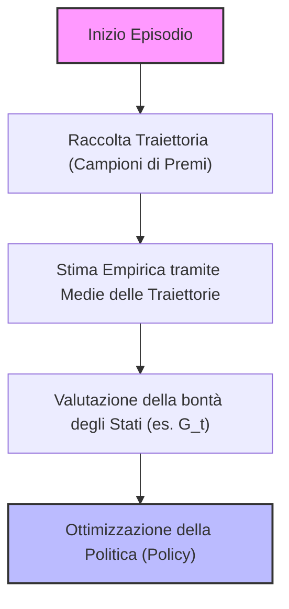
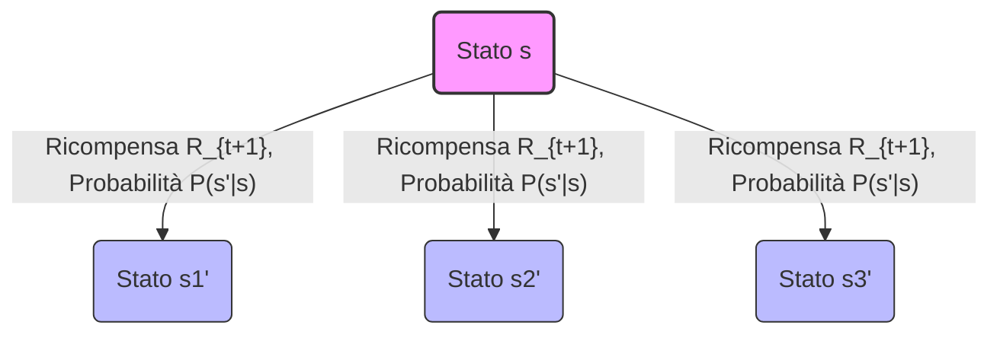
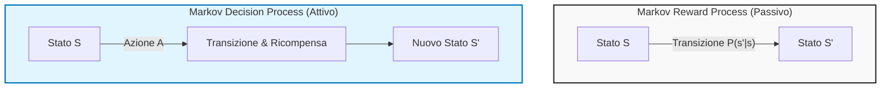
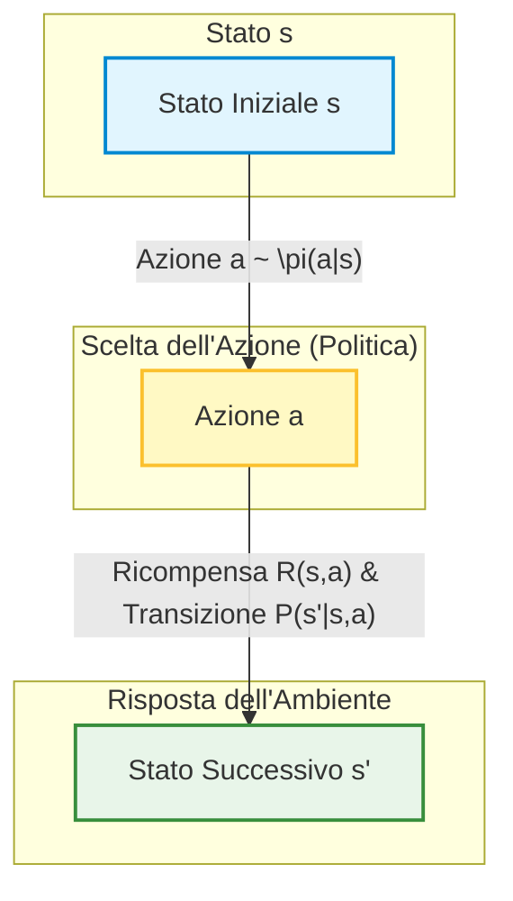

# Fondamenti di Reinforcement Learning: Processi di Ricompensa di Markov (MRP) e Introduzione alle Equazioni di Bellman

## Overview Didattica

In questa lezione viene approfondito il percorso formale che conduce alla modellazione matematica dell'apprendimento per rinforzo (*Reinforcement Learning*, RL). Partendo dal quadro di base dei Processi di Markov (*Markov Processes*, MP) — caratterizzati esclusivamente dallo spazio degli stati e dalla matrice delle probabilità di transizione (*Transition Probability Matrix*, $P$) — la trattazione si estende ai Processi di Ricompensa di Markov (*Markov Reward Processes*, MRP).

I punti cardine affrontati includono:
* **Evoluzione della formalizzazione**: transizione graduale da modelli puramente stocastici e descrittivi (MP) a modelli arricchiti con segnali di feedback scalari (MRP), fino alla futura inclusione del controllo attivo tramite azioni nei Processi di Decisione di Markov (*Markov Decision Processes*, MDP).
* **Funzione di Ricompensa (*Reward Function*)**: definizione del segnale di ritorno associato alla permanenza o alla transizione di stato, gestito in forma di valore atteso per considerare la potenziale stocasticità intrinseca dell'ambiente.
* **Fattore di Sconto (*Discount Factor*, $\gamma$)**: introduzione del parametro matematico deputato a ponderare l'importanza delle ricompense immediate rispetto a quelle differite nel tempo.
* **Prospettiva Passiva vs Attiva**: analisi delle dinamiche ambientali (esemplificate tramite il modello dello studente) in cui la traiettoria viene osservata senza capacità di scelta da parte di un agente, ponendo le basi concettuali per l'applicazione delle **Equazioni di Bellman (*Bellman Equations*)** come strumento analitico per la risoluzione dei processi decisionali.

---

### Introduzione ai Markov Decision Processes (MDP) e ai Markov Reward Processes (MRP)

Il percorso di formalizzazione dell'Apprendimento per Rinforzo (Reinforcement Learning - RL) parte dai casi più semplici, in cui l'ambiente è completamente noto, per poi estendersi a scenari più complessi (trattati nel capitolo 5 del libro di riferimento) in cui alcune ipotesi vengono rilassate. 

Per affrontare e risolvere formalmente un MDP, uno strumento matematico fondamentale è rappresentato dalle **equazioni di Bellman (Bellman equations)**. La loro introduzione ci permetterà di definire cosa significhi "risolvere" un processo decisionale markoviano.

---

### Richiamo: Processi di Markov (Markov Processes)

Riprendendo quanto visto nella lezione precedente, un **Processo di Markov (Markov Process)** - identificato visivamente dal codice colore verde - è caratterizzato da due elementi principali:
1. Uno **spazio degli stati** (rappresentato dagli stati del sistema).
2. Delle **probabilità di transizione** tra gli stati, rappresentate da frecce e racchiuse in una matrice di transizione.

La matrice di transizione $P$ è una matrice quadrata con cardinalità (in termini di righe e colonne) pari al numero di stati del sistema. Essa definisce la probabilità di spostarsi da uno stato a un altro a un tempo successivo $t+1$, dato lo stato corrente al tempo $t$. 

In questa fase iniziale non esiste ancora il concetto di agente attivo o di azione: si tratta di un punto di vista puramente *passivo*, in cui osserviamo le traiettorie naturali generate dal sistema.

---

### Markov Reward Processes (MRP)

Facciamo ora un passo avanti introducendo i **Processi di Premio di Markov (Markov Reward Processes - MRP)**, associati al colore blu. Un MRP estende il processo di Markov aggiungendo un elemento chiave già incontrato nel contesto dei *Multi-Armed Bandits*: la **ricompensa (reward)**.

Ogni volta che l'ambiente evolve e l'agente (o il sistema) si sposta da uno stato a un altro, l'ambiente fornisce un feedback numerico sotto forma di ricompensa.

Un MRP è definito da:
- Un insieme di stati.
- Una matrice di probabilità di transizione.
- Una **funzione di ricompensa (reward function)**.

#### La Funzione di Ricompensa nell'MRP
Mentre ci muoviamo lungo una traiettoria nello spazio degli stati, la transizione da uno stato $S_t$ a un successivo stato $S_{t+1}$ genera una ricompensa. Più formalmente, la ricompensa attesa associata a uno stato è definita come:

$$R_s = \mathbb{E}[R_{t+1} \mid S_t = s]$$

*Nota:* La ricompensa non è necessariamente deterministica; può essere stocastica (esattamente come accadeva nei problemi di bandit, dove estrarre un certo braccio forniva vincite stocastiche).

#### Esempio: Il Processo dello Studente
Consideriamo il classico esempio dello studente (modellato come MRP, quindi ancora senza azioni o decisioni deliberate):
- Lo studente si muove tra stati come "Classe 1", "Classe 2", "Studio", "Socializzare (prendendo uno spritz)", "Dormire" e "Superare l'esame".
- Le ricompense sono proprietà dello stato (poiché non ci sono ancora azioni disponibili):
  - Frequentare una lezione può essere faticoso, generando una ricompensa negativa (es. $-2$).
  - Stare su Instagram genera ricompense negative.
  - Prendere uno spritz è una gratificazione a breve termine (positiva).
  - Superare l'esame fornisce una grande ricompensa positiva (il "premio" finale).

Questo scenario evidenzia una proprietà fondamentale della pianificazione sequenziale: **sacrifici a breve termine per benefici a lungo termine**. Studiare e frequentare le lezioni è noioso nel breve periodo (reward negativo), ma è l'unico percorso che permette di raggiungere lo stato finale ad alta ricompensa (superare l'esame).

---

### Verso il Decision Making a Lungo Termine

A differenza dei semplici problemi di bandit, in un contesto sequenziale dobbiamo formalizzare obiettivi a lungo termine. 
Dobbiamo definire quantità matematiche da ottimizzare che non tengano conto esclusivamente del guadagno immediato (short-term rewards), ma che valutino l'intero ritorno cumulativo lungo una traiettoria. Questo ci porterà, nelle prossime lezioni, a introdurre l'ultimo e più completo tassello: i **Markov Decision Processes (MDP)**, dove compariranno finalmente le azioni e le decisioni attive dell'agente.

---

### Il Ritorno Cumulativo e il Fattore di Sconto

Nel contesto dei Processi di Decisione di Markov (Markov Decision Processes - MDP) e dei Processi di Premio di Markov (Markov Reward Processes - MRP), abbiamo bisogno di una quantità che descriva il successo a lungo termine, un obiettivo (goal) che ci guidi nel tempo. 

Mentre il premio immediato ci dice quanto è buona la singola azione o transizione sul breve periodo, a noi interessa definire formalmente il **ritorno cumulativo** (return), che indicheremo con la lettera $G$.

#### Definizione di Ritorno Cumulativo

Il ritorno $G_t$ è la somma di tutti i premi (rewards $R$) che otteniamo da un certo istante di tempo $t$ fino alla fine dell'episodio o del tempo:

$$G_t = R_{t+1} + R_{t+2} + R_{t+3} + \dots = \sum_{k=0}^{\infty} R_{t+k+1}$$

A differenza dell'apprendimento supervisionato (supervised learning) dove l'obiettivo tipico è *minimizzare* una funzione di costo o di perdita (loss function), **il fine ultimo del Reinforcement Learning è massimizzare il ritorno atteso $G$**. 

---

### Il Fattore di Sconto (Discount Factor)

Per gestire correttamente i premi futuri, introduciamo un secondo elemento fondamentale che sarà sempre presente nei nostri modelli: il **fattore di sconto** (discount factor), indicato con la lettera greca $\gamma$ (gamma).

Il fattore di sconto $\gamma$ è un valore compreso tra $0$ e $1$ ($0 \le \gamma \le 1$), e nelle applicazioni pratiche viene spesso scelto molto vicino a $1$ (ad esempio $\gamma = 0.99$). 

Il suo significato intuitivo è legato al valore temporale delle ricompense:
- Diamo importanza piena (pari a $1$) al premio immediatamente successivo ($R_{t+1}$).
- Diamo un'importanza pari a $\gamma$ al premio successivo ($R_{t+2}$).
- Diamo un'importanza pari a $\gamma^2$ al premio ancora dopo, e così via ($\gamma^k$ per i premi più lontani nel tempo).

Di conseguenza, un premio ottenuto molto lontano nel futuro avrà un peso via via decrescente nel calcolo totale.

#### Scelte Estreme del Fattore di Sconto
- **$\gamma = 0$**: Significa considerare un agente miope (myopic) che si interessa *unicamente* del premio immediato successivo, ignorando completamente il futuro. Questa scelta non viene mai utilizzata nel Reinforcement Learning.
- **$\gamma = 1$**: Significa dare esattamente lo stesso peso ai premi futuri, indipendentemente da quando si verificheranno. Viene usato in alcune specifiche classi di problemi con episodi finiti.

#### Perché usiamo il fattore di sconto?
Il professore evidenzia tre motivi principali per cui l'introduzione di $\gamma$ è cruciale:

1. **Convenienza matematica**: La presenza di $\gamma$ (con $\gamma < 1$) garantisce la convergenza delle serie infinite di premi, permettendoci di dimostrare teoremi e proprietà teoriche solide senza incorrere in somme infinite e non limitate.
2. **Gestione di problemi continui (non-terminanti)**: Esistono problemi che per loro natura non hanno una fine (es. il controllo continuo della temperatura di una stanza $24/7$ o la gestione dei mercati finanziari). Grazie a $\gamma < 1$, i premi molto lontani nel tempo (es. al passo $10.000$) vengono moltiplicati per $\gamma^{10.000}$, diventando di fatto trascurabili. Questo ci permette di massimizzare una quantità approssimata ma gestibile.
3. **Prospettiva filosofica e di incertezza**: Nel mondo reale il futuro è incerto. Non sappiamo se un modello o un ambiente rimarrà stabile nel lunghissimo termine, oppure potrebbero esserci incerpettezze intrinseche nelle probabilità di transizione. Dare meno valore al futuro riflette questa incertezza strutturale.

Il ritorno scontato (discounted return) si formula quindi matematicamente come:

$$G_t = R_{t+1} + \gamma R_{t+2} + \gamma^2 R_{t+3} + \dots = \sum_{k=0}^{\infty} \gamma^k R_{t+k+1}$$

---

### Obiettivi di Apprendimento e Analisi Empirica tramite Traiettorie

Il nostro scopo finale è trovare una **politica** (policy), ovvero una strategia che permetta all'agente di prendere decisioni tali da massimizzare il ritorno $G$. Prima ancora di trovare la strategia ottimale, dobbiamo però essere in grado di valutare quanto "buono" sia trovarsi in un determinato stato.

Osservando un MRP semplificato, possiamo stimare empiricamente il valore di uno stato valutando cosa accade in media seguendo le traiettorie possibili:
- Se ci troviamo in uno stato da cui abbiamo un'alta probabilità (es. $60\%$) di transizione verso uno stato con un premio elevato (es. $+10$) e una probabilità minore (es. $40\%$) di finire altrove, il valore atteso di quello stato sarà notevolmente alto.
- Al contrario, stati che conducono ciclicamente a penalità o premi negativi (es. $-2$) avranno un ritorno atteso complessivamente sfavorevole, anche se lungo il percorso si incontrano piccoli premi positivi isolati (es. $+1$).

Attraverso la raccolta di campioni empirici (le traiettorie generate dall'interazione con l'ambiente) e calcolando la media dei ritorni ottenuti, l'agente impara a distinguere quali stati sono vantaggiosi e quali no, ponendo le basi per la futura introduzione delle azioni e dell'ottimizzazione tramite il Reinforcement Learning.

---

### La Funzione di Valore dello Stato (State-Value Function)

Finora abbiamo analizzato come muoverci all'interno di un processo di Markov e come accumulare ricompense lungo una traiettoria. Tuttavia, quando vogliamo capire quanto sia desiderabile trovarsi in una specifica situazione, non basta guardare alla ricompensa immediata: abbiamo bisogno di una prospettiva a lungo termine. 

Ci serve una quantità che ci dica: *"Qual è il ritorno atteso che otterrò partendo da questo stato specifico fino alla fine dei tempi?"*

Nei problemi di Bandits (Multi-Armed Bandits) la situazione era molto più semplice perché non ci muovevamo tra stati diversi: sceglievamo un'azione (tirare una leva) e osservavamo subito una ricompensa immediata, stimandone l'attesa. Ora, in un Processo di Decisione di Markov (Markov Decision Process, MDP) o in un Processo di Ricompensa di Markov (Markov Reward Process, MRP), non abbiamo ancora introdotto le azioni. Non c'è un "agente" che sceglie attivamente cosa fare; stiamo semplicemente osservando un sistema che evolve attraverso una traiettoria.

In questo contesto, introduciamo una grandezza fondamentale, strettamente imparentata con la quantità $Q$ che vedremo in seguito: la **Funzione di Valore dello Stato** (State-Value Function), indicata con $V(s)$.

*   **Definizione:** $V(s)$ è un array (avente la stessa cardinalità dello spazio degli stati) che rappresenta il ritorno atteso a lungo termine partendo da un determinato stato $s$.
*   In formula, denotiamo il valore dello stato $s$ come il valore atteso del ritorno $G$ condizionato dal fatto di trovarsi nello stato $s$:
    $$V(s) = \mathbb{E}[G_t \mid S_t = s]$$

Questa funzione è esattamente ciò di cui abbiamo bisogno per capire quanto è buono uno stato. Ad esempio, se ci troviamo in uno stato terminale con una ricompensa positiva di $+10$, il nostro ritorno atteso sarà ovviamente $+10$. Se ci troviamo invece in uno stato da cui è probabile finire in un ciclo negativo (perdendo $-1$ a ogni passo), il valore $V(s)$ sarà basso o fortemente negativo, segnalandoci che quello è un pessimo stato in cui trovarsi.

---

### Come Stimare il Valore: Dalle Traiettorie alle Medie

Prima di introdurre strumenti matematici avanzati, sorge spontanea una domanda: *Come facciamo a stimare questa quantità $V(s)$ nella pratica?*

Un'idea logica (già proposta dai vostri colleghi) potrebbe essere quella di sfruttare le probabilità di transizione $P$ del sistema, se le conosciamo. Ma immaginiamo un futuro in cui **non** abbiamo il modello del sistema, non conosciamo le probabilità di transizione e non sappiamo cosa accade "dietro le quinte" (un approccio basato sui dati, tipico del Reinforcement Learning). 

Come stimiamo le aspettative (le attese) quando non abbiamo il modello? Usando le **medie campionarie** (Averages)!
Proprio come facevamo con i Bandits dove tiravamo le leve e facevamo la media delle ricompense, qui faremo la stessa cosa ma basandoci sulle **traiettorie**:
1. Un "visitatore" si muove all'interno del sistema (MRP/MDP) raccogliendo ricompense lungo la strada.
2. Invece di guardare alla singola ricompensa immediata, ci interessa il **ritorno cumulativo totale** $G$ associato a quella traiettoria che attraversa lo stato $s$.
3. Raccogliamo molte esperienze, sommiamo i ritorni ottenuti partendo da quello stato e ne facciamo la media.

Anche se il sistema non ha un termine (potrebbe continuare all'infinito), l'introduzione di un fattore di sconto (discount factor) ci permette di mantenere i numeri finiti e di ottimizzare la quantità anche in contesti non stazionari o infiniti.

---

### Introduzione alle Equazioni di Bellman

> [!CONCETTO CHIAVE]
> **Massima Attenzione:** Questa sezione introduce le **Equazioni di Bellman (Bellman Equations)**. Esse sono assolutamente **fondamentali** per l'intero corso di Reinforcement Learning. Anche quando più avanti abbandoneremo la conoscenza completa dell'ambiente (il modello $P$) per passare ad algoritmi model-free, molti dei metodi più avanzati si baseranno proprio sulle equazioni che introdurremo oggi e nella prossima lezione. Si consiglia caldamente di padroneggiare a fondo questi strumenti matematici e queste definizioni.

Inventate dal celebre matematico americano Richard Bellman, queste equazioni sfruttano la **struttura ricorsiva** intrinseca dei processi di Markov (MRP e MDP). 

Invece di calcolare il ritorno guardando a tutte le infinite possibilità future passo dopo passo, le equazioni di Bellman ci permettono di esprimere il valore di uno stato mettendolo in relazione con il valore dei suoi stati successivi. Nelle prossime lezioni vedremo in dettaglio la formulazione matematica di queste equazioni e come risolverle per trovare i valori ottimali di $V(s)$.

---

### Derivazione Ricorsiva delle Equazioni di Bellman, Diagrammi di Backup e Sistemi Lineari

#### Derivazione Ricorsiva del Return (Argomento Telescopico)

Per ricavare le equazioni che governano i processi decisionali in ambiente stocastico, sfruttiamo un argomento telescopico (telescopic argument). Partiamo dalla definizione standard del return (guadagno) $G_t$ a partire dal passo temporale $t$:

$$G_t = R_{t+1} + \gamma R_{t+2} + \gamma^2 R_{t+3} + \dots = \sum_{k=0}^{\infty} \gamma^k R_{t+k+1}$$

Possiamo manipolare questa equazione isolando il primo termine e raccogliendo il fattore di sconto $\gamma$ per i termini successivi:

$$G_t = R_{t+1} + \gamma (R_{t+2} + \gamma R_{t+3} + \dots)$$

Se osserviamo attentamente la quantità tra parentesi tonde, ci accorgiamo che si tratta esattamente della definizione del return ma a partire dal tempo successivo $t+1$, ovvero $G_{t+1}$:

$$G_t = R_{t+1} + \gamma G_{t+1}$$

Questo risultato ha una forte interpretazione intuitiva: il guadagno totale che ci aspetta da un certo istante in poi è pari all'immediata ricompensa che otteniamo facendo un passo, più il guadagno scontato che otterremo da quel nuovo stato fino alla fine dell'episodio.

#### Dalla Definizione di Return alla Funzione di Valore (State-Value Function)

Ora vogliamo applicare questa scomposizione ricorsiva alla funzione di valore dello stato (State-Value Function), indicata con $v(s)$, che per definizione rappresenta il valore atteso del return condizionato al fatto di trovarsi nello stato $s$:

$$v(s) = \mathbb{E}[G_t \mid S_t = s]$$

Sostituendo la relazione ricorsiva di $G_t$ appena trovata all'interno dell'attesa, otteniamo:

$$v(s) = \mathbb{E}[R_{t+1} + \gamma G_{t+1} \mid S_t = s]$$

Sfruttando la linearità dell'operatore di attesa, possiamo separare il termine di ricompensa immediata dal guadagno futuro:

$$v(s) = \mathbb{E}[R_{t+1} \mid S_t = s] + \gamma \mathbb{E}[G_{t+1} \mid S_t = s]$$

Applicando la legge delle attese iterate (law of iterated expectation) sul secondo termine, possiamo esprimere l'attesa del return futuro in termini del valore dello stato successivo $S_{t+1} = s'$. Arriviamo così alla celebre **Equazione di Bellman per i Processi di Ricompensa Markoviani (Markov Reward Process - MRP)**:

$$v(s) = \mathbb{E}[R_{t+1} + \gamma v(S_{t+1}) \mid S_t = s]$$

> **Concetto Chiave:** Questa è una forma di definizione ricorsiva. Il valore di uno stato $v(s)$ viene espresso in funzione della ricompensa immediata attesa e del valore scontato degli stati futuri in cui ci potremmo trovare. Non abbiamo bisogno di un oracolo che ci fornisca i valori corretti: questa struttura ci permette di impostare un sistema di equazioni rigoroso.

---

#### Diagrammi di Backup (Backup Diagrams)

Per visualizzare e comprendere le relazioni locali tra gli stati in un MDP o MRP, utilizziamo uno strumento grafico fondamentale: i **diagrammi di backup (backup diagrams)**. 

Questi grafici mostrano cosa accade in un singolo stato $s$ (rappresentato come un nodo radice o un cerchio/triangolo) quando compiamo una transizione verso i possibili stati successivi $s'$.

*Nota esplicativa del diagramma:* I nodi bianchi (o cerchi) rappresentano gli stati. Dal nodo corrente $s$, l'agente può transire verso diversi stati successivi $s'$ con una certa probabilità di transizione e ottenendo una ricompensa. Il "backup" indica proprio questo processo visivo in cui le informazioni sui valori futuri vengono "riportate" indietro (back up) dallo stato successivo allo stato corrente.

---

#### Dalla Forma Attesa alla Somma Esplicita

Se non vogliamo (o non possiamo) affidarci unicamente a stime campionarie basate sulle attese, possiamo esplicitare l'equazione di Bellman considerando tutte le possibili transizioni deterministiche o stocastiche all'interno dello spazio degli stati. 

Se lo spazio degli stati ha cardinalità $K$, possiamo riscrivere l'equazione di Bellman non sotto forma di valore atteso astratto, ma come una sommatoria estesa a tutti i possibili stati successivi $s'$ raggiungibili dallo stato $s$:

$$v(s) = \mathcal{R}(s) + \gamma \sum_{s' \in \mathcal{S}} \mathcal{P}(s' \mid s) v(s')$$

Dove:
- $\mathcal{R}(s)$ è la ricompensa attesa ottenuta trovandosi nello stato $s$.
- $\mathcal{P}(s' \mid s)$ è la probabilità di transizione dallo stato $s$ allo stato $s'$.
- $v(s')$ è il valore dello stato successivo.

*Esempio pratico:* Immaginiamo di trovarci in uno stato $s$ dal quale abbiamo il 40% di probabilità di finire nello stato $1$ (con un certo valore $v(s_1)$) e il 60% di probabilità di finire nello stato $2$ (con valore $v(s_2)$). L'equazione di Bellman per quello specifico stato si traduce numericamente in:

$$v(s) = \mathcal{R}(s) + \gamma \left[ 0.4 \cdot v(s_1) + 0.6 \cdot v(s_2) \right]$$

Ripetendo questa formulazione per ogni stato del sistema, otteniamo un sistema di equazioni lineari che, sebbene concettualmente semplice nella sua scomposizione a un passo, richiede metodi di risoluzione algebrica o numerica per trovare i valori esatti di $v(s)$ per ogni stato.

---

### Risoluzione dei Processi di Ricompensa di Markov e Limiti

Nei moduli precedenti abbiamo visto come esprimere la funzione di valore attraverso le equazioni di Bellman. Dal punto di vista matematico, queste equazioni formano un sistema di equazioni lineari.

Se la cardinalità dello spazio degli stati $S$ è pari a $n$, abbiamo $n$ equazioni e $n$ incognite (rappresentate dai valori di stato). Sfruttando la conoscenza completa della probabilità di transizione e delle ricompense attese, possiamo impostare il sistema e risolverlo direttamente tramite strumenti come MATLAB o Python, ad esempio calcolando l'inversione della matrice. 

La complessità computazionale di questo approccio diretto è dell'ordine di $\mathcal{O}(n^3)$. Tuttavia, questo metodo presenta due grossi limiti:
1. **Disponibilità del modello:** Nelle applicazioni avanzate non conosceremo a priori le probabilità di transizione $P$ né le ricompense $R$. Di conseguenza, non potremo impostare un sistema di equazioni lineari esplicito.
2. **Scalabilità:** Per problemi di grandi dimensioni (con migliaia o milioni di stati), l'inversione di matrice a costo $\mathcal{O}(n^3)$ diventa impraticabile.

Per superare il secondo problema si ricorre a metodi iterativi come la programmazione dinamica (Dynamic Programming), mentre per superare il primo problema introdurremo i veri e propri agenti di Reinforcement Learning.

---

### Introduzione dell'Agency e dei Markov Decision Processes (MDP)

Finora ci siamo trovati in una posizione puramente passiva: abbiamo osservato traiettorie e comportamenti (come la carriera dello studente nei nostri esempi precedenti) senza poter prendere decisioni. È arrivato il momento di introdurre l'**agency** (capacità di agire), passando dai processi di ricompensa di Markov (MRP) ai **Processi Decisionali di Markov (Markov Decision Processes - MDP)**.

#### Elementi costitutivi di un MDP
Un MDP estende l'MRP introducendo l'insieme delle azioni:
* Un insieme finito di azioni $\mathcal{A}$ (o $\mathcal{A}(s)$ se l'insieme delle azioni disponibili dipende dallo stato corrente, come nel caso di un robot vicino a un muro che non può muoversi in certe direzioni).

#### Come cambiano le dinamiche:
1. **Funzione di transizione:** La probabilità di transizione a un nuovo stato $S'$ non dipende più unicamente dallo stato precedente $S$, ma è condizionata anche dall'azione $A$ scelta dall'agente:
   $$P(S' = s' \mid S = s, A = a)$$
2. **Funzione di ricompensa:** Anche la ricompensa dipende esplicitamente dall'azione intrapresa nello stato corrente. 
   
*Concetto Chiave:* **Il ruolo dell'azione nel ciclo di RL**. Ogni volta che l'agente sceglie un'azione nello stato corrente, l'ambiente risponde proiettando l'agente in un nuovo stato (influenzato da quell'azione) e restituendo una determinata ricompensa. La ricompensa arriva sempre *dopo* che l'azione è stata eseguita.

#### Rimodellamento dell'esempio dello studente
Riprendendo l'esempio dello studente, modifichiamo la prospettiva: adesso non subiamo più passivamente gli stati, ma possiamo compiere azioni esplicite (es. studiare, andare a dormire, usare i social). Di conseguenza:
* Lo spazio degli stati può ridursi (passando ad esempio da 7 a 4 stati strutturati diversamente).
* Le azioni diventano entità esplicite nel diagramma di flusso e nei futuri schemi di backup.

Nei diagrammi di backup (backup diagrams) che vedremo a breve:
* Gli **stati** sono rappresentati da cerchi bianchi ($\circ$).
* Le **azioni** sono rappresentate da cerchi neri ($\bullet$).

---

### Politiche e Dinamiche di Transizione Dipendenti dalle Azioni

#### Transizione dalle catene di Markov ai processi decisionali
Nei capitoli precedenti abbiamo analizzato i processi in cui le ricompense erano associate unicamente agli stati (Markov Reward Processes, MRP). Ora introduciamo la componente fondamentale dell'agente: **l'azione**. 

Nei problemi reali, la ricompensa non dipende passivamente solo da dove ci troviamo, ma è associata all'azione che compiamo in un dato stato. Ad esempio, studiare un determinato argomento conferisce una ricompensa positiva $+2$, mentre altre azioni possono comportare guadagni o penalità differenti. Sono proprio le azioni a guidare la transizione da uno stato all'altro (es. decidere di muoversi da una classe all'altra).

Le dinamiche di transizione possono presentarsi in due forme:
* **Deterministica**: l'agente sceglie un'azione in un dato stato ed è certo del nuovo stato di arrivo (es. studio per la classe $1$ e mi sposto sicuramente alla classe $2$).
* **Stocastica**: l'ambiente può condurre l'agente in diversi stati con una certa distribuzione di probabilità. Ad esempio, a seguito di un'azione nello stato $3$, potremmo avere una probabilità del $40\%$ di finire nello stato $2$, del $40\%$ nello stato $3$, e del $20\%$ nello stato $6$.

La matrice di transizione cattura entrambi gli scenari trattandoli in modo probabilistico, dove le transizioni dipendono ora esplicitamente dalla coppia stato-azione.

#### La Politica (Policy)
Il vero obiettivo del Reinforcement Learning non è solo descrivere o valutare un ambiente, ma **fare scelte migliori**. Vogliamo trovare una strategia che permetti all'agente di raccogliere il massimo ritorno cumulativo possibile (la somma delle ricompense scontate) dall'istante corrente fino alla fine dell'episodio. 

La strategia seguita dall'agente prende il nome di **Politica** (Policy), formalizzata dal simbolo $\pi$:
* **Concetto Chiave**: *La politica è la "legge" o la regola comportamentale che l'agente segue.* In base allo stato in cui si trova, la politica definisce quale azione l'agente debba compiere.
* **Politica Stocastica**: Analogamente a quanto visto nel caso dei multi-armed bandits, la politica può essere stocastica. Ad esempio, l'agente potrebbe sfruttare la conoscenza passata (exploitation) il $90\%$ delle volte e scegliere di esplorare (exploration) il restante $10\%$ delle volte.

Matematicamente, data una politica $\pi$, questa può essere vista come un vettore (o una distribuzione di probabilità) la cui cardinalità è pari allo spazio delle azioni. Per un dato stato $s$, $\pi(a|s)$ definisce la probabilità di selezionare l'azione $a$:

$$\pi(a|s) = P(A_t = a \mid S_t = s)$$

All'inizio dell'apprendimento, la politica dell'agente sarà probabilmente "sciocca" o casuale, ma attraverso il processo di Reinforcement Learning si evolverà verso una politica ottimale.

#### Conseguenze della Politica sulle Dinamiche
Nel momento in cui introduciamo le azioni e la politica, le equazioni che descrivono il sistema diventano più complesse rispetto ai processi di Markov passivi:

1. **Probabilità di Transizione di Stato**: La probabilità di transizione globale dipende ora sia dalla probabilità di transizione dell'ambiente dato lo stato e l'azione, sia dalla probabilità che la politica scelga proprio quell'azione:
   $$P(s' \mid s, \pi) = \sum_{a} \pi(a \mid s) P(s' \mid s, a)$$

2. **Sequenza delle Ricompense**: Anche il calcolo delle ricompense attese si arricchisce di una sommatoria che tiene conto di tutte le possibili azioni dictate dalla politica $\pi$.

#### Ridefinizione della Funzione di Valore dello Stato ($V^\pi$)
La bontà di uno stato (se essere in quello stato sia vantaggioso o meno) non dipende più solo dall'ambiente, ma è strettamente legata alla **politica** adottata dall'agente. 

*Esempio:* Immaginiamo una partita a scacchi. La scacchiera rappresenta lo stato. Se in quello stesso stato si trova un giocatore principiante oppure un Gran Maestro (come Garry Kasparov), la probabilità di vittoria futura (e quindi il valore dello stato) cambia radicalmente. 

La **Funzione di Valore dello Stato** viene quindi ridefinita dipendendo esplicitamente dalla politica $\pi$:

$$V^\pi(s) = \mathbb{E}_\pi \left[ G_t \mid S_t = s \right]$$

Questa funzione rappresenta il ritorno atteso partendo dallo stato $s$ e seguendo la politica $\pi$ da quel momento in poi.

#### Introduzione della Funzione di Valore Stato-Azione ($Q$-function)
Per avere un controllo decisionale più fine, non basta valutare quanto sia buono uno stato in generale. Dobbiamo valutare la bontà di intraprendere una *specifica azione* all'interno di *quel dato stato*.

Nasce così la **Funzione $Q$** (State-Action Value Function):
$$Q^\pi(s, a) = \mathbb{E}_\pi \left[ G_t \mid S_t = s, A_t = a \right]$$

* **Differenza chiave**: Mentre la funzione $V^\pi(s)$ ci dice quanto è vantaggioso trovarsi nello stato $s$ seguendo la politica $\pi$, la funzione $Q^\pi(s, a)$ ci dice quanto è conveniente trovarsi nello stato $s$, compiere l'azione specifica $a$, e *solo successivamente* continuare seguendo la politica $\pi$.
* **Dimensioni strutturali**: Se la funzione $V$ è un vettore con una dimensione pari alla cardinalità dello spazio degli stati, la funzione $Q$ è una matrice (o una tabella) le cui dimensioni sono date dal prodotto tra la cardinalità dello spazio degli stati e la cardinalità dello spazio delle azioni ($\text{Stati} \times \text{Azioni}$). Questo strumento fornisce una granularità informativa superiore, essenziale per la scelta ottimale dell'azione.

---

### Equazioni di Aspettativa di Bellman per i Processi Decisionali di Markov (MDP)

Finora abbiamo visto come risolvere il problema della valutazione per i Processi di Ricompensa di Markov (MRP, *Markov Reward Process*), dove le azioni non erano presenti. Ora facciamo un passo avanti e passiamo ai **Processi Decisionali di Markov (MDP, *Markov Decision Process*)**, introducendo le azioni e la politica (policy, $\pi$). 

Per fare questo, abbiamo bisogno di un nuovo set di equazioni note come **Equazioni di Aspettativa di Bellman** (*Bellman Expectation Equations*), le quali ci permettono di definire le funzioni di valore non solo per gli stati ($V$), ma anche per le coppie stato-azione ($Q$).

---

### Le due funzioni di valore negli MDP

Negli MDP abbiamo due funzioni principali:
1. **Funzione di valore dello stato ($V^\pi(s)$)**: ci dice quanto è buono trovarsi in un determinato stato $s$ seguendo una certa politica $\pi$.
2. **Funzione di valore dell'azione ($Q^\pi(s, a)$)**: è una misura più specifica. Ci dice quanto è buono trovarsi nello stato $s$, compiere una specifica azione $a$, e *poi* continuare a seguire la politica $\pi$.

Queste due quantità rappresentano concettualmente la stessa cosa (il ritorno atteso, $G$), ma la funzione $Q$ è più specifica perché scorpora il contributo di una singola azione iniziale.

---

### Derivazione tramite Diagrammi di Backup (Backup Diagrams)

Per ricavare le equazioni di Bellman senza passare ogni volta per i formalismi complessi delle aspettative matematiche, possiamo usare i **diagrammi di backup** (*backup diagrams*). Esistono due modi complementari di guardare a queste relazioni.

#### 1. Dallo stato alle azioni (Prospettiva della Politica)
Se ci troviamo in uno stato $s$ e vogliamo calcolare $V^\pi(s)$, dobbiamo considerare tutte le possibili azioni che possiamo intraprendere in base alla nostra politica $\pi(a|s)$. 

La probabilità di scegliere un'azione può variare (alcune azioni avranno probabilità $0$, altre $1$ se la politica è deterministica, o valori intermedi). Possiamo eliminare l'operatore di aspettativa enumerando tutte le possibili azioni:

$$V^\pi(s) = \sum_{a \in A} \pi(a|s) Q^\pi(s, a)$$

Questo significa semplicemente che il valore dello stato $V^\pi(s)$ è la media ponderata (tramite la politica) dei valori $Q$ di tutte le azioni che possiamo compiere in quello stato.

#### 2. Dall'azione agli stati successivi (Prospettiva dell'Ambiente)
Cosa succede invece se ci focalizziamo su una specifica azione $a$ appena compiuta in uno stato $s$ (quindi guardiamo a $Q^\pi(s, a)$)? 

Qui entra in gioco l'ambiente. L'agente sceglie l'azione, ma è l'ambiente a decidere (tramite la probabilità di transizione $P$ e la ricompensa $R$):
- Quale sarà lo stato successivo ($s'$).
- Quale ricompensa immediata ($R$) ci verrà assegnata.

Usando la formulazione ricorsiva, il ritorno atteso dipende da dove ci "lancia" l'ambiente:

$$Q^\pi(s, a) = R(s, a) + \gamma \sum_{s' \in S} P(s' | s, a) V^\pi(s')$$

Dove:
- $R(s, a)$ è la ricompensa immediata ottenuta compiendo l'azione $a$ nello stato $s$.
- $\gamma$ è il fattore di sconto (*discount factor*).
- $P(s' | s, a)$ è la probabilità di transizione verso il nuovo stato $s'$.
- $V^\pi(s')$ è il valore dello stato successivo, calcolato ricorsivamente.

---

### Le Equazioni di Aspettativa di Bellman Complete

Il nostro obiettivo finale è ottenere equazioni in cui $V$ sia espresso in funzione di $V$, oppure $Q$ in funzione di $Q$. Per farlo, basta combinare le due equazioni viste sopra (sostituendo l'una dentro l'altra).

#### Equazione di Bellman per $V^\pi$
Sostituendo la definizione di $Q$ all'interno dell'equazione di $V$, otteniamo la forma chiusa per lo stato:

$$V^\pi(s) = \sum_{a \in A} \pi(a|s) \left[ R(s, a) + \gamma \sum_{s'} P(s' | s, a) V^\pi(s') \right]$$

#### Equazione di Bellman per $Q^\pi$
Analogamente, sostituendo $V$ dentro $Q$, otteniamo la forma per la coppia stato-azione:

$$Q^\pi(s, a) = R(s, a) + \gamma \sum_{s'} P(s' | s, a) \sum_{a'} \pi(a'|s') Q^\pi(s', a')$$

> **Concetto Chiave**: Queste sono le **Equazioni di Aspettativa di Bellman**. Anche se possono sembrare complesse, rimangono **equazioni lineari**. Di conseguenza, per ambienti di dimensioni ridotte, è possibile metterle a sistema e risolverle direttamente tramite software come MATLAB o Python, calcolando esattamente quanto è buona una politica $\pi$ per ciascuno stato o azione.

---

### Schema Riassuntivo: Il Loop di Interazione nei Diagrammi

---

### Panoramica sulle Equazioni di Ottimalità (Anticipazione della prossima lezione)

Quello che abbiamo fatto finora ci dà uno strumento per *valutare* una politica esistente ($\pi$), ovvero capire quanto è buona. 

Tuttavia, il vero obiettivo del Reinforcement Learning è trovare la **politica ottima** (*optimal policy*), cioè quella strategia che ci permette di raccogliere il massimo ritorno possibile nel lungo termine. Nella prossima lezione introdurremo un nuovo set di equazioni, chiamate **Equazioni di Ottimalità di Bellman** (*Bellman Optimality Equations*), che valgono specificamente quando ci troviamo di fronte a una politica ottimale.

---

> [!NOTE]
> ### Note per l'Esame e Avvisi del Docente
> - Il docente raccomanda fortemente di prestare molta attenzione agli strumenti matematici e alle definizioni presentate (in particolare le equazioni di Bellman), definendoli "fondamentali" per il corso.
> - Il docente segnala che nei suoi esami chiede spesso di ricavare o fornire il diagramma di backup (backup diagram) di un dato algoritmo o struttura.