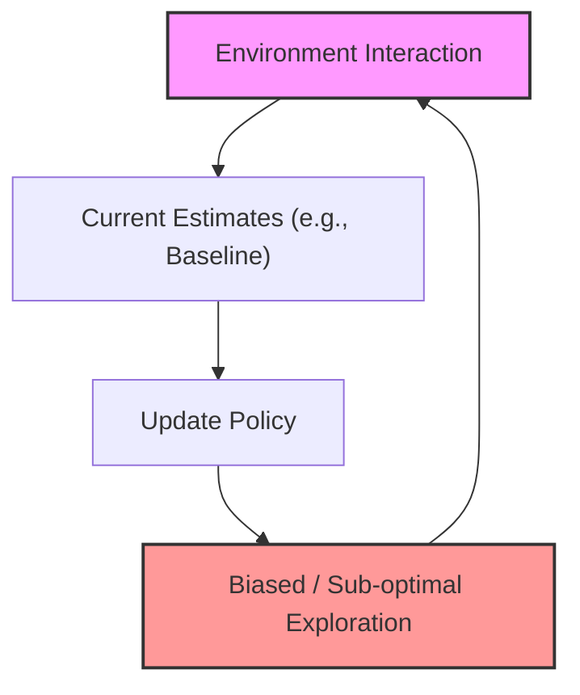
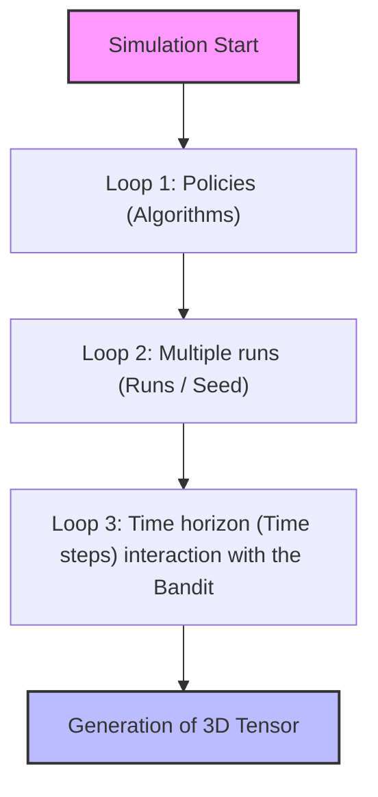

# Reinforcement Learning Laboratory: Fundamentals of the Multi-Armed Bandit Problem

## Didactic Overview

This lecture introduces the first practical Reinforcement Learning (RL) laboratory, focusing on the analysis and implementation of the **Multi-Armed Bandits (MAB)** problem. The main objective is to bridge the gap between theoretical formalization and practical application, highlighting the peculiarities that distinguish the RL paradigm from traditional Machine Learning (ML).

Key concepts covered include:
* **MAB Problem Formulation**: a simplified decision-making environment devoid of state transitions ($S = \emptyset$), where each arm (action) is associated with a stationary stochastic reward distribution with an unknown expected value $q_*(a) = \mathbb{E}[R_t \mid A_t = a]$.
* **Exploration-Exploitation Trade-off**: the need to balance the selection of the estimated best action (exploitation) with the gathering of new information about sub-optimal actions (exploration), while minimizing regret or the sampling time cost (e.g., critical scenarios such as clinical trials or Large Language Model - LLM alignment via RL).
* **Fundamental Components of the Bandit Agent**:
  1. **Decision Policy ($\pi$)**: the action-selection rule at time step $t$ (e.g., the $\varepsilon$-greedy strategy, characterized by a fixed $\varepsilon$ parameter to force uniform exploration).
  2. **Update Rule**: the mathematical mechanism used to update the action value estimate ($Q_t(a)$ via sample average or exponential recency-weighted average with step-size $\alpha$) or numerical action preferences (gradient approaches).

---

### Introduction to Multi-Armed Bandits and Policy Review

This chapter introduces the fundamental concepts of **Multi-Armed Bandits (MAB)**, acting as a conceptual bridge between classical supervised learning and Reinforcement Learning (RL). 

#### The K-Armed Bandit Problem

The $k$-armed bandit problem models a decision-making situation where:
- We have a finite set of possible actions, where each action corresponds to an "arm". The total number of arms is $k$.
- At each time step $t$ (which in this context represents a try or *trial*), the agent chooses an action and receives a stochastic numerical reward.
- Each arm is associated with an unknown stochastic probability distribution. Although the reward may vary at each pull even on the same arm, the **expected value** associated with each arm is constant over time (stationarity assumption).

The agent's objective is to maximize the sum of rewards obtained over a given time horizon, which is equivalent to identifying the action with the highest expected value in the fewest possible steps. This aspect is crucial in delicate real-world contexts, such as **clinical trials**, where it is impossible to make indefinite trials without causing harm.

A fundamental aspect that differentiates MABs from supervised Machine Learning is that **there is no state**: the decision made at time $t$ does not influence the future state of the environment, making the problem apparently simple yet sufficiently complex to highlight the main challenge of RL.

#### The Two Pillars of Multi-Armed Bandits

To solve a MAB problem, the learning architecture relies on two key components:

1. **The Policy:** Defines the decision rule with which the agent chooses which action to take at each time step $t$. Since we do not know the true expected values, the policy must manage the famous **exploration-exploitation trade-off**:
   - *Exploitation:* Choosing the action that we currently estimate to be the best in order to maximize immediate reward.
   - *Exploration:* Choosing sub-optimal actions to gather information and improve the estimates of their expected values.

2. **The Update Rule:** Defines how to update action value estimates (often called $Q$-values, i.e., estimates of expected values) or preferences based on observed rewards.

---

### Action Selection Policies

#### The $\epsilon$-greedy Policy

The $\epsilon$-greedy policy is one of the most intuitive strategies to balance exploration and exploitation:
- With probability $1 - \epsilon$ the agent acts *greedily*, choosing the action with the highest $Q$-value estimate:
  $$A_t = \underset{a}{\operatorname{argmax}} \, Q_t(a)$$
- With probability $\epsilon$ the agent chooses a completely random action, drawn uniformly from all $k$ available actions.

The parameter $\epsilon$ (epsilon) determines the fixed probability of exploration. 

---

### Update Rules: Sample Average vs Fixed Step-Size ($\alpha$)

To estimate the $Q$-values of actions, two main update approaches based on received rewards are used.

#### 1. Sample Average
If we denote by $N_t(a)$ the number of times action $a$ has been chosen up to time $t$, and by $R_i$ the reward obtained at the $i$-th trial for that action, the expected value estimate via sample average is:
$$Q_t(a) = \frac{\sum_{i=1}^{N_t(a)} R_i}{N_t(a)}$$

This formulation provides an **unbiased** estimate of the expected value. However, it presents a notable structural limitation in non-stationary contexts: since the denominator $N_t(a)$ continuously grows, the weight of individual past samples decreases more and more. After millions of steps, the update factor becomes infinitesimal, making the agent extremely slow in adapting to any changes in the reward distribution over time.

#### 2. Fixed Step-Size Rule ($\alpha$)
To overcome the non-stationarity problem, the term $1/N_t(a)$ is replaced with a constant learning parameter $\alpha \in (0, 1]$, known as *step-size* or *learning rate*:
$$Q_{t+1}(A_t) = Q_t(A_t) + \alpha \left[ R_t - Q_t(A_t) \right]$$

* **Why use a fixed $\alpha$?** It allows the agent to give more weight to recent rewards compared to historical ones, enabling it to track environmental changes (*non-stationary environments*).
* *Critical note:* While ideal for non-stationary environments, using a constant and non-decreasing $\alpha$ prevents the estimate from rigorously converging to the true expected value in pure stationary cases, since new fluctuations will continue to permanently influence the estimate.

---

### Upper Confidence Bound (UCB)

A limitation of the $\epsilon$-greedy policy is that exploration occurs completely at random: the agent chooses with equal probability a highly promising exploratory action and a disastrous one.

To overcome this limitation, the **UCB (Upper Confidence Bound)** policy is used. 
While the $Q$-value update rule conceptually remains the same, the way the policy manages the exploration-exploitation trade-off changes radically, favoring actions with greater **uncertainty** in the estimate.

---

### The Gradient-Based Approach in Reinforcement Learning

While the methods seen previously relied on directly estimating action quality values ($Q$-values), a different family of approaches directly models action preferences, known as the **gradient-based approach**.

#### From Value Estimation to Preferences and Policy

Instead of estimating the expected value of each action, we introduce a quantity called **preference**, denoted by $H_t(a)$, which evolves over time. The agent's choice policy does not select the action based directly on these absolute values, but uses a probability distribution derived from the preferences via a **Softmax** type function (often also called the Boltzmann distribution):

$$\pi_t(a) = \frac{e^{H_t(a)}}{\sum_{b} e^{H_t(b)}}$$

This mechanism guarantees that, for each action $a$, the probability $\pi_t(a)$ is between $0$ and $1$, and that the sum of the probabilities over all possible actions is equal to $1$:

$$\sum_{a} \pi_t(a) = 1$$

#### The Update Rule and the Link to Machine Learning

The preference update rule exploits an idea similar to gradient descent typical of Machine Learning (ML). At first glance, the update formulas may look different depending on whether we consider the actually chosen action or the other actions, but a simple algebraic step shows their symmetry:

$$H_{t+1}(a) = H_t(a) + \alpha (R_t - \bar{R}_t) (\mathbb{I}(a = A_t) - \pi_t(a))$$

Where:
- $\alpha$ is the learning rate.
- $R_t$ is the reward observed at time $t$.
- $\bar{R}_t$ is the **baseline** (usually the average of rewards observed up to time $t$).
- $\mathbb{I}(a = A_t)$ is an indicator function that equals $1$ if action $a$ is the one actually chosen ($A_t$), and $0$ otherwise.

#### Critical Analysis and Comparison with Machine Learning

To understand why this update resembles the gradient, we can set up a fictitious cost function (or loss function). 

In classical Machine Learning, we have:
1. An input.
2. A model that maps the input to a prediction ($\hat{y}$).
3. A truth **label**.
4. A loss function based on the difference between prediction and label.

If we try to map this scheme onto our Reinforcement Learning (RL) algorithm by setting $\hat{y} = \pi_t(a)$ and computing the gradient with respect to $\hat{y}$ of a quadratic loss, we obtain precisely the terms that make up the update rule. However, a profound conceptual anomaly immediately emerges:

* **The Label Problem in RL:** In Machine Learning, the label is a known and independent piece of data from the model. In this Reinforcement Learning approach, however, **the label depends on the action the agent chooses during exploration**. If the agent chooses action $A_t$, the associated label is set to $1$; for all other unchosen actions, the label is considered $0$. This makes the analogy with supervised learning rather forced and conceptually different.

#### The Role of the Baseline and Weight $W$

The term $(R_t - \bar{R}_t)$ acts as a weighting factor (which we can call $W$). Its sign determines the direction of the preference update:

* If $R_t > \bar{R}_t$, the reward is higher than the historical average. Consequently, the chosen action yielded better results than "usual", so the probability (and preference) of repeating it in the future must **increase**, while the probability of the other actions tends to decrease.
* If $R_t < \bar{R}_t$, the reward is lower than the average. The update behaves repulsively towards the action just taken, reducing its preference and implicitly favoring the others.

The **baseline** $\bar{R}_t$ therefore plays a crucial role: it serves to center the reward, reducing the variance of the update and stabilizing learning without altering the expected gradient.

---

### Limitations of the Update and the Risk of Non-Generalization

Analyzing the update rule based on reward observation, we notice that if we observe a positive reward for an action (i.e., an advantage $w > 0$), the natural tendency is to increase the probability (the *likelihood*) of choosing that specific action and decrease that of all others. 

However, this approach presents a critical limitation: **it may not generalize correctly**. 

Imagine finding ourselves in a situation where:
1. We choose an action (e.g., Action 1) and obtain a reward higher than the baseline ($\bar{r}$), resulting in a $w > 0$.
2. Consequently, we increase the probability of Action 1 and lower that of Actions 2 and 3.
3. **The problem:** The optimal action was actually the second one (Action 2), but since we did not explore it sufficiently or the update penalized it, we risk moving away from the ideal solution.

We are assigning a positive label to the action chosen at time $t$, but this does not guarantee that it was the absolute best choice.

---

### The Fundamental Trade-off in Reinforcement Learning

This leads us to confront one of the biggest and most important differences between traditional Machine Learning and Reinforcement Learning (RL): **in RL, the way we interact with the environment directly influences our estimates.**

If we start with bad or biased estimates, we will make incorrect updates. 
For example, suppose the baseline $\bar{r}$ is heavily biased towards Action 1 and Action 3, because we have *never* tried Action 2 in our experience. We are comparing the reward of Action 1 with an expected value based solely on potentially terrible actions. 
If Action 3 is terrible, the baseline $\bar{r}$ will be very low. Consequently, any decent reward obtained with Action 1 will generate a very high advantage $w > 0$, pushing the probability of Action 1 close to 100%. 

If we apply a greedy algorithm, we might **never visit Action 2** and never realize it was optimal. This vicious circle stems from poor initial exploration.

#### A Practical Analogy: The Labyrinth and Video Games
Imagine playing a *Snake*-style video game or moving through a maze with a stochastic policy. 
- At first you explore randomly. At some point you find an apple that gives you 1 point.
- Later, elsewhere, there is an apple that gives 10 points, but requires more complex exploration.
- Since you know the first apple (the 1-point one) is easy to reach, your algorithm starts to get "lazy" in exploration: it keeps aiming for the safe and immediate reward, without being curious enough to push to the other side of the maze.

This is the eternal conflict between **exploration** and **exploitation**. An algorithm focused solely on exploitation will fail if initial exploration has trapped it in a local maximum.

> **Key Concept:** In Reinforcement Learning, poor exploration compromises future data collection, preventing the agent from converging towards the optimal policy because the best actions may never be visited.

Later in the course we will study the **REINFORCE** algorithm, based on the *Policy Gradient Theorem*, which can also be applied to the *Bandit* case and will provide a formal derivation of these update rules.

---

### The Need for the Baseline

A fundamental question that arises naturally is: **do we really need the baseline $\bar{r}$? Is it strictly necessary for the algorithm to work in principle?**

The short answer is: **No, it is not strictly necessary.**

* **Why is it used?** The baseline serves to create a point of comparison (centering the reward) and generates both positive and negative numbers ($w$ can be greater or less than zero), which helps push action probabilities up or down in a more balanced way.
* **What happens without a baseline?** Assuming an extremely long (or infinite) time horizon, if the agent has the opportunity to visit *all* possible actions an infinite number of times (as in an exhaustive search or complete theoretical exploration), the algorithm would still achieve a good result even without a baseline. Each action would be visited and estimates updated accordingly. However, foregoing mechanisms like the baseline in practice can drastically slow down convergence or require massive memory and time resources.

---

### From Bandits to Large Language Models (LLMs)

Before moving on to the Python code structure, the lecturer makes a fundamental connecting reflection: the Multi-Armed Bandits (MAB) problem connects directly to modern alignment and optimization techniques for **Large Language Models (LLMs)** such as ChatGPT.

Imagine facing a prompt (a sentence) where the LLM must choose the next token to generate (or complete a sentence). 
* **Absence of Dynamics (Contextualization):** If we consider an isolated exchange (a single question and short answer), there is no temporal evolution of states like in a typical full Reinforcement Learning (RL) problem. This specific variant is called a **Contextual Bandit**.
* **The Role of the Reward:** The LLM produces a probability (via a *softmax* function) for each word in the vocabulary (dictionary). It then chooses a token and user feedback (e.g., a "thumbs up" or a rating score) acts as a **reward** for that specific choice.
* **The Update:** Using this score, the parameters of the massive model can be updated to increase the preference (emission probability) towards tokens that received positive ratings from the user.

This example demonstrates that, although basic stochastic bandits were studied during the course, the research field ranges from *adversarial bandits* to *contextual bandits*, even merging Reinforcement Learning with *Game Theory* to optimize language models.

---

### Python Code Structure and Object-Oriented Programming (OOP)

To manage bandit experiments without writing monolithic code, **Object-Oriented Programming (OOP)** is adopted. Despite the possible aid of automated generation tools, the structure has been designed to be modular and clean.

The key elements of the OOP structure for policies are the following:

* **Policy Object:** An object representing the exploration/exploitation strategy (e.g., UCB, $\epsilon$-greedy, Gradient Bandit). Inside, it contains an object dedicated to updating.
* **Policy Update Object:** Specifies the operational behavior of the policy both in action selection and in updating estimated values.
* **The Three Fundamental Functions of the Policy Object:**
  1. `act`: Implements the action selection logic (e.g., calculating $Q$-values or preferences).
  2. `step`: Receives the selected action and the reward observed from the environment, updating the quantities involved in the policy ($Q$-values, preferences, counts).
  3. `reset`: A utility function (sometimes marginal but useful for restoring the initial state of the algorithm).

---

### Simulation and the Use of Three-Dimensional Tensors

When evaluating the performance of Reinforcement Learning algorithms via graphs (e.g., the percentage of optimal actions over time), a critical methodological problem arises related to randomness.

#### The Seed Problem and Empirical Averages
The computer generates pseudo-random numbers via a **seed**. If an experiment is run with a single lucky seed, the algorithm might appear exceptionally performant purely by chance. 
To avoid this evaluation error, rigorous research runs **multiple experiments (runs)** varying the seed, and then calculates an **empirical average** of expected performances.

#### The Three Nested For Loops in the Simulation Code
The simulation function relies on three nested loops that produce a three-dimensional data structure (**3D tensor**):

1. **First Loop (Policies):** Iterates over the different algorithms to compare (e.g., $\epsilon$-greedy, UCB, Gradient).
2. **Second Loop (Runs):** For each algorithm, repeats the experiment a certain number of times (each with a different seed) to collect statistically significant data.
3. **Third Loop (Time / Time steps):** For each run, the agent interacts with the environment (the stochastic bandit) for a certain number of time steps $t$:
   * The agent chooses an action via the `act` method.
   * The environment returns a stochastic reward.
   * The agent updates the policy via the `step` method.
   * Key metrics are saved, including:
     * The sequence of rewards obtained.
     * The **best action count**: by comparing the action chosen by the algorithm with the one known a priori to be optimal, $1$ is stored in case of a match and $0$ otherwise.

The result of these loops is the creation of two large **three-dimensional tensors**: one for rewards and one for optimal action counts.

#### Aggregation and Time Averages
Once the 3D tensor is obtained (having dimensions for *policies*, *runs*, and *time*):
* Fixing a specific policy, the tensor reduces to a two-dimensional matrix where rows represent different *runs* and columns represent time steps $t$.
* To estimate the expected reward at a given instant $t$, the **average along columns** is calculated (i.e., the empirical average across all *runs* at that specific time step).
* Repeating the operation for each time step yields a one-dimensional (1D) vector of the same length as the simulation time horizon, ready to be plotted in performance graphs.

---

### Results Analysis and Policy Comparison

In this section, we move on to the practical analysis and visual comparison of results obtained via the various exploration/exploitation policies implemented in the code. The objective is to observe how algorithms such as **$\epsilon$-greedy**, **Optimistic Initialization**, and **UCB (Upper Confidence Bound)** behave when interacting with the Environment.

---

### 1. The $\epsilon$-greedy Policy

Analyzing the performance graphs of the $\epsilon$-greedy approach, two fundamental metrics emerge:
* The trend of the **Expected Reward** over time.
* The **optimal action selection percentage** ($% \text{ Optimal Action}$).

If we set $\epsilon = 0$ (no exploration, exploitation only based on initial estimates), the reward initially grows but at some point **gets completely stuck**. This happens because the agent stops at the first action that seemed good, without exploring others that might be superior. 

Looking instead at the percentage of optimal action selection:
* It will never reach $100\%$ ($1.0$) if $\epsilon > 0$, because due to the random exploration component, the agent will occasionally choose a sub-optimal action, despite having a good estimate of $Q$-values.
* This behavior suggests a common strategy in literature: **$\epsilon$-decay** (progressive reduction of $\epsilon$ over time), analogous to learning rate decay in Machine Learning.

---

### 2. Optimistic Initialization

An alternative method to encourage exploration without using $\epsilon$ is optimistic initialization. In the provided code, we can set an initial bias by assigning a very high initial estimate to the $Q$-values of all actions compared to the real expected returns of the environment (e.g., setting $Q(a) = 5$ when real rewards from a Gaussian are lower).

* **How it works:** Even by setting $\epsilon = 0$ (no random exploration), the high initial value pushes the agent to explore. When the agent chooses an action and receives a reward lower than the expected optimistic value, that action's $Q$-estimate decreases. 
* **The exploration mechanism:** At the next step, due to the downward update, that action will no longer be the maximum ($\operatorname{argmax}$), forcing the agent to try another action. This generates forced "data-driven" exploration without the need for random noise.
* *Note:* It is crucial to know the scale of the environment's values; if the true expected values were much higher than the chosen "optimistic" value, the approach would lose effectiveness.

---

### 3. Upper Confidence Bound (UCB) and the Gradient Approach

* **UCB:** As seen previously, the UCB algorithm selects the action maximizing not only the $Q$-estimate, but taking into account a confidence interval (measure of uncertainty):
  $$\operatorname{argmax}_a \left[ Q(a) + c \sqrt{\frac{\ln t}{N(a)}} \ \습 \right]$$
  Results show that UCB offers excellent performance in balancing exploration and exploitation dynamically.

* **Gradient Bandit Approach and Baseline:** 
  Analyzing the effect of the **baseline** ($\bar{R}$), the lecturer emphasizes that it plays a crucial role in reducing estimator variance. 
  
  $$\text{Key Concept}: The **learning rate ($\alpha$)** hyperparameter has a drastic impact on performance. If $\alpha$ is too large, the gradient step will be excessive, destabilizing learning exactly as happens in classical Machine Learning problems.*

---

### Conclusions, Hyperparameter Optimization, and the Notion of Regret

In this final part, we summarize the code seen so far, touching on some advanced techniques for parameter tuning and introducing a fundamental concept in bandit theory: **regret**.

#### Hyperparameter Selection and Brute Force Search Limits

In the analyzed code, managing multiple nested for loops (`for loops with multiple parameters`) allows us to vary the different algorithm parameters — such as the exploration parameter $\epsilon$ (epsilon), the number of steps, and the step size for gradient-based approaches — to plot comparative graphs and find the best configuration.

This **brute force** approach is usually the most direct method to find the best hyperparameters, but it presents major scalability limits: when the parameter space becomes very large, this method is simply no longer feasible. 

Decidedly more efficient alternatives exist:
* **Bayesian optimization:** A guided approach that allows choosing the best parameters by intelligently exploring the search space. It is particularly useful when a limited number of trials and a very extensive parameter space are available.
* **Thompson sampling:** Another algorithm present at the end of the code, based on the Bayesian view (posterior probability concepts similar to those seen in Machine Learning). It would require dedicated theoretical treatment due to its mathematical derivation, but it is worth mentioning as a starting point for personal study.

#### Non-Stationary Bandits Exercise

For those wishing to practice, the material includes an optional exercise on **non-stationary bandits**. 
The objective is to modify the environment so that the expected value of each action varies over time, observing the behavior of the algorithms:
* Using $\epsilon$-greedy with a decay rate of the type $\frac{1}{n}$.
* Using a fixed learning rate factor $\alpha$.

#### The Concept of Regret in Multi-Armed Bandits

So far we have talked about cost or loss functions (such as mean squared error) inserted somewhat "manually" for gradient methods, without a true rigorous theoretical justification. However, in bandit literature there is a formal and universal objective metric: **regret**.

Regret measures how much the algorithm loses, in terms of expected value, by choosing a sub-optimal action compared to the theoretical optimum. 

Mathematically, the expected regret over a time horizon of $T$ steps (total number of episodes or trials) is defined as:

$$\text{Regret} = \mathbb{E} \left[ \sum_{t=1}^{T} \left( \mu^* - \hat{\mu}_t \right) \right]$$

Where:
* $T$ is the time horizon, i.e., the total number of steps or trials.
* $\mu^*$ is the expected value of the optimal action (arm). For example, if we have $10$ Gaussian distributions, $\mu^*$ is the highest expected value among all.
* $\hat{\mu}_t$ is the expected value of the arm actually chosen by our algorithm at time $t$.

##### Practical and Theoretical Considerations on Regret
* **In practice:** We cannot directly calculate this value in a real scenario, because it would require an *oracle* that knows the true expected values of the actions a priori (if we knew them, we would already know which arm to pull).
* **In theory:** The purpose of this formulation is not to be used by the algorithm during learning (the agent indeed ignores $\mu^*$), but serves researchers to **analyze the theoretical performance** of approaches in scientific literature. 

It is a concept analogous to the **test set** in Machine Learning: we know the correct answers only ex-post to evaluate how well the model worked, despite having had to learn during the training phase without any preliminary information about the correct answers.

---

Data structures and algorithm implementation patterns complete this laboratory overview, establishing the foundations for subsequent advanced RL architectures.

> [!NOTE]
> ### Exam Notes and Lecturer Warnings
> - **Non-stationary bandits exercise (code):** The implementation of the environment for non-stationary bandits (making the expected value vary over time to compare $\epsilon$-greedy with step $1/n$ versus a fixed $\alpha$) is optional, and the lecturer expressly confirmed that **it will not be asked in the exam**.
> - **Regret (objective function for bandits):** The explanation of the *regret* concept was provided solely for the purpose of personal study; the lecturer specified that **it is not part of the exam syllabus**.