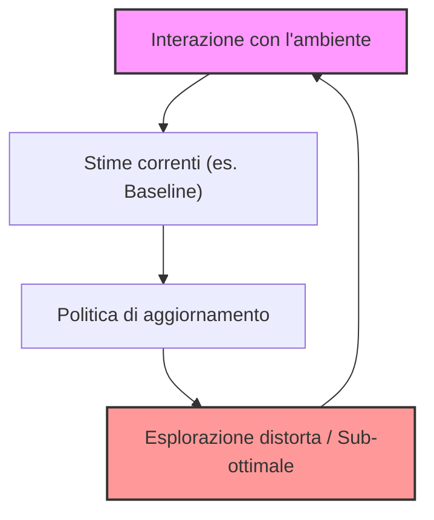
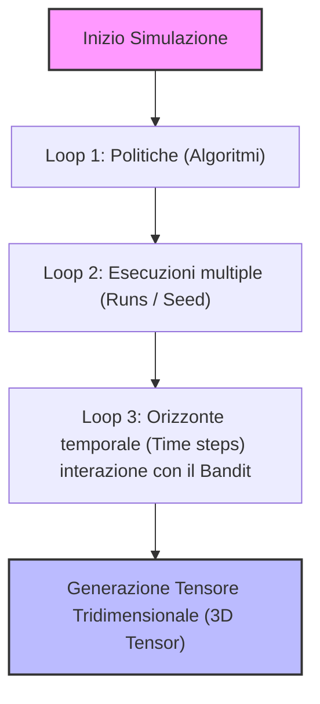

# Laboratorio di Reinforcement Learning: Fondamenti del Problema Multi-Armed Bandit

## Overview Didattica

La lezione introduce il primo laboratorio pratico di Reinforcement Learning (RL), incentrato sull'analisi e l'implementazione del problema dei **Banditi Multi-Braccio (Multi-Armed Bandits - MAB)**. L'obiettivo principale è colmare il divario tra la formalizzazione teorica e l'applicazione pratica, evidenziando le peculiarità che distinguono il paradigma di RL rispetto al Machine Learning (ML) tradizionale.

I concetti chiave trattati includono:
* **Formulazione del Problema MAB**: un ambiente decisionale semplificato privo di transizioni di stato ($S = \emptyset$), in cui ciascun braccio (azione) è associato a una distribuzione di ricompensa stocastica stazionaria con valore atteso incognito $q_*(a) = \mathbb{E}[R_t \mid A_t = a]$.
* **Dilemma Esplorazione-Sfruttamento (Exploration-Exploitation Trade-off)**: la necessità di bilanciare la selezione dell'azione stimata migliore (sfruttamento) con la raccolta di nuove informazioni sulle azioni sub-ottimali (esplorazione), minimizzando il rimpianto (*regret*) o il costo temporale di campionamento (es. scenari critici come i trial clinici o l'allineamento dei Large Language Model - LLM tramite RL).
* **Componenti Fondamentali dell'Agente Bandit**:
  1. **Politica decisionale ($\pi$)**: la regola di scelta dell'azione al passo temporale $t$ (ad es. la strategia $\varepsilon$-greedy, caratterizzata da un parametro $\varepsilon$ fisso per forzare l'esplorazione uniforme).
  2. **Regola di aggiornamento**: il meccanismo matematico utilizzato per aggiornare la stima del valore delle azioni ($Q_t(a)$ tramite media campionaria o media ponderata esponenziale con passo $\alpha$) o delle preferenze numeriche dell'azione (approcci a gradiente).

---

### Introduzione ai Multi-Armed Bandits e Richiamo delle Politiche

Questo capitolo introduce i concetti fondamentali dei **Multi-Armed Bandits (MAB)**, fungendo da ponte concettuale tra l'apprendimento supervisionato classico e il Reinforcement Learning (RL). 

#### Il Problema dei K-Armed Bandits

Il problema dei $k$-armed bandits (slot machine a $k$ bracci) modella una situazione decisionale in cui:
- Abbiamo un insieme finito di azioni possibili, dove ciascuna azione corrisponde a un "braccio" ($arm$). Il numero totale di bracci è $k$.
- Ad ogni passo temporale $t$ (che in questo contesto rappresenta un tentativo o *trial*), l'agente sceglie un'azione e riceve una ricompensa numerica stocastica (reward).
- Ciascun braccio è associato a una distribuzione di probabilità stocastica ignota. Sebbene la ricompensa possa variare a ogni estrazione anche sullo stesso braccio, l'**expected value** (valore atteso) associato a ciascun braccio è costante nel tempo (ipotesi di stazionarietà).

L'obiettivo dell'agente è massimizzare la somma delle ricompense ottenute in un orizzonte temporale dato, il che equivale a individuare l'azione con il valore atteso più elevato nel minor numero di passaggi possibile. Questo aspetto è cruciale in contesti reali delicati, come i **clinical trials** (sperimentazioni cliniche), dove non è possibile effettuare tentativi indefiniti senza causare danni.

Un aspetto fondamentale che differenzia i MAB dal Machine Learning supervisionato è che **non esiste uno stato ($state$)**: la decisione presa al tempo $t$ non influenza lo stato futuro dell'ambiente, rendendo il problema apparentemente semplice ma sufficientemente complesso da evidenziare la sfida principale del RL.

#### I Due Pilastri dei Multi-Armed Bandits

Per risolvere un problema di MAB, l'architettura di apprendimento si fonda su due componenti chiave:

1. **La Politica (*Policy*):** Definisci la regola decisionale con cui l'agente sceglie quale azione compiere a ogni passo temporale $t$. Poiché non conosciamo i valori attesi reali, la politica deve gestire il celebre **trade-off esplorazione-sfruttamento (exploration-exploitation trade-off)**:
   - *Exploitation (Sfruttamento):* Scegliere l'azione che attualmente stimiamo essere la migliore per massimizzare la ricompensa immediata.
   - *Exploration (Esplorazione):* Scegliere azioni sub-ottimali per raccogliere informazioni e migliorare le stime dei loro valori attesi.

2. **La Regola di Aggiornamento (*Update Rule*):** Definisce come aggiornare le stime dei valori delle azioni (spesso chiamati valori $Q$, ovvero le stime dei valori attesi $Q$-values) o delle preferenze in base alle ricompense osservate.

---

### Politiche di Selezione delle Azioni

#### L'Approccio $\epsilon$-greedy ($\epsilon$-greedy Policy)

La politica $\epsilon$-greedy è una delle strategie più intuitive per bilanciare esplorazione e sfruttamento:
- Con probabilità $1 - \epsilon$ l'agente agisce in modo *greedy*, scegliendo l'azione con la stima del valore $Q$ più alta:
  $$A_t = \underset{a}{\operatorname{argmax}} \, Q_t(a)$$
- Con probabilità $\epsilon$ l'agente sceglie un'azione completamente a caso, pescata uniformemente da tutte le $k$ azioni disponibili.

Il parametro $\epsilon$ (epsilon) determina la probabilità fissa di esplorazione. 

---

### Regole di Aggiornamento: Sample Average vs Passo Fisso ($\alpha$)

Per stimare i valori $Q$ delle azioni, si utilizzano principalmente due approcci di aggiornamento basati sulle ricompense ricevute.

#### 1. Sample Average (Media Campionaria)
Se indichiamo con $N_t(a)$ il numero di volte in cui l'azione $a$ è stata scelta fino al tempo $t$, e con $R_i$ la ricompensa ottenuta all'iesimo tentativo per quell'azione, la stima del valore atteso tramite media campionaria è:
$$Q_t(a) = \frac{\sum_{i=1}^{N_t(a)} R_i}{N_t(a)}$$

Questa formulazione fornisce una stima **non-biased** (non distorta) del valore atteso. Tuttavia, presenta un limite strutturale notevole nei contesti non stazionari: poiché il denominatore $N_t(a)$ cresce continuamente, il peso dei singoli campioni passati diminuisce sempre di più. Dopo milioni di passi, il fattore di aggiornamento diventa infinitesimale, rendendo l'agente estremamente lento nell'adattarsi a eventuali cambiamenti nel tempo della distribuzione delle ricompense.

#### 2. Regola con Passo Fisso ($\alpha$)
Per ovviare al problema della non-stazionarietà, si sostituisce il termine $1/N_t(a)$ con un parametro di apprendimento costante $\alpha \in (0, 1]$, noto come *step-size* o *learning rate*:
$$Q_{t+1}(A_t) = Q_t(A_t) + \alpha \left[ R_t - Q_t(A_t) \right]$$

* **Perché si usa $\alpha$ fisso?** Permette all'agente di dare più peso alle ricompense recenti rispetto a quelle storiche, consentendo di inseguire i cambiamenti dell'ambiente (*non-stationary environments*).
* *Nota critica:* Pur essendo ideale per ambienti non stazionari, l'uso di un $\alpha$ costante e non decrescente impedisce alla stima di convergere rigorosamente al vero valore atteso in casi stazionari puri, poiché le nuove fluttuazioni continueranno a influenzare permanentemente la stima.

---

### Upper Confidence Bound (UCB)

Un limite della politica $\epsilon$-greedy è che l'esplorazione avviene in modo completamente casuale: l'agente sceglie con la stessa probabilità un'azione esplorativa altamente promettente e un'azione disastrosa.

Per superare questo limite si utilizza la politica **UCB (Upper Confidence Bound)**. 
Mentre la regola di aggiornamento dei $Q$-values rimane concettualmente la stessa, cambia radicalmente il modo in cui la politica gestisce il trade-off esplorazione-sfruttamento, privilegiando le azioni con una maggiore **incertezza** nella stima.

---

### L'Approccio Basato sui Gradienti in Reinforcement Learning

Mentre i metodi visti in precedenza si basavano sulla stima diretta dei valori di qualità delle azioni (i valori $Q$), esiste una famiglia differente di approcci che modella direttamente le preferenze per le azioni, nota come **approccio basato sui gradienti** (gradient-based approach).

#### Dalla stima dei valori alle preferenze e alla politica

Invece di stimare il valore atteso di ciascuna azione, introduciamo una quantità detta **preferenza** (preference), indicata con $H_t(a)$, che si evolve nel tempo. La politica di scelta dell'agente non seleziona l'azione basandosi direttamente su questi valori assoluti, ma utilizza una distribuzione di probabilità derivata dalle preferenze tramite una funzione di tipo **Softmax** (spesso chiamata anche distribuzione di Boltzmann):

$$\pi_t(a) = \frac{e^{H_t(a)}}{\sum_{b} e^{H_t(b)}}$$

Questo meccanismo garantisce che, per ogni azione $a$, la probabilità $\pi_t(a)$ sia compresa tra $0$ e $1$, e che la somma delle probabilità su tutte le azioni possibili sia pari a $1$:

$$\sum_{a} \pi_t(a) = 1$$

#### La regola di aggiornamento e il legame con il Machine Learning

La regola di aggiornamento delle preferenze sfrutta un'idea simile alla discesa del gradiente (gradient descent) tipica del Machine Learning (ML). A prima vista, le formule di aggiornamento possono sembrare diverse a seconda che si consideri l'azione effettivamente scelta o le altre azioni, ma un semplice passaggio algebrico mostra la loro simmetria:

$$H_{t+1}(a) = H_t(a) + \alpha (R_t - \bar{R}_t) (\mathbb{I}(a = A_t) - \pi_t(a))$$

Dove:
- $\alpha$ è il tasso di apprendimento (learning rate).
- $R_t$ è il ricompensa osservata al tempo $t$.
- $\bar{R}_t$ è la **baseline** (di solito la media dei reward osservati fino al tempo $t$).
- $\mathbb{I}(a = A_t)$ è una funzione indicatrice che vale $1$ se l'azione $a$ è quella effettivamente scelta ($A_t$), e $0$ altrimenti.

#### Analisi critica e confronto con il Machine Learning

Per capire perché questo aggiornamento ricordi il gradiente, possiamo impostare una funzione di costo (o di perdita, loss function) fittizia. 

Nel Machine Learning classico, disponiamo di:
1. Un input.
2. Un modello che mappa l'input in una predizione ($\hat{y}$).
3. Una **label** (etichetta) di verità.
4. Una funzione di perdita basata sulla differenza tra predizione e label.

Se proviamo a mappare questo schema sul nostro algoritmo di Reinforcement Learning (RL), ponendo $\hat{y} = \pi_t(a)$ e calcolando il gradiente rispetto a $\hat{y}$ di una perdita quadratica, otteniamo proprio i termini che compongono la regola di aggiornamento. Tuttavia, emerge subito una profonda anomalia concettuale:

* **Il problema della Label in RL:** Nel Machine Learning la label è un dato noto e indipendente dal modello. In questo approccio di Reinforcement Learning, invece, **la label dipende dall'azione che l'agente sceglie durante l'esplorazione**. Se l'agente sceglie l'azione $A_t$, la label associata viene posta a $1$; per tutte le altre azioni non scelte, la label è considerata $0$. Questo rende l'analogia con il supervised learning piuttosto forzata e concettualmente diversa.

#### Il ruolo della Baseline e del peso $W$

Il termine $(R_t - \bar{R}_t)$ agisce come un fattore di peso (che possiamo chiamare $W$). Il suo segno determina la direzione dell'aggiornamento delle preferenze:

* Se $R_t > \bar{R}_t$, il reward è superiore alla media storica. Di conseguenza, l'azione scelta ha dato risultati migliori del "solito", quindi la probabilità (e la preferenza) di ripeterla in futuro deve **aumentare**, mentre la probabilità delle altre azioni tende a diminuire.
* Se $R_t < \bar{R}_t$, il reward è inferiore alla media. L'aggiornamento si comporta in modo repulsivo nei confronti dell'azione appena compiuta, riducendone la preferenza e favorendo implicitamente le altre.

La **baseline** $\bar{R}_t$ gioca quindi un ruolo cruciale: serve a centrare il reward, riducendo la varianza dell'aggiornamento e stabilizzando l'apprendimento senza alterare il gradiente atteso.

---

### I Limiti dell'Aggiornamento e il Rischio di Non-Generalizzazione

Analizzando la regola di aggiornamento basata sull'osservazione della ricompensa, notiamo che se osserviamo una ricompensa positiva per un'azione (ovvero un vantaggio $w > 0$), la tendenza naturale è aumentare la probabilità (la *likelihood*) di scegliere quell'azione specifica e diminuire quella di tutte le altre. 

Tuttavia, questo approccio presenta un limite critico: **potrebbe non generalizzare correttamente**. 

Immaginiamo di trovarci in una situazione in cui:
1. Scegliamo un'azione (es. Azione 1) e otteniamo una ricompensa superiore alla baseline ($\bar{r}$), risultando in un $w > 0$.
2. Di conseguenza, aumentiamo la probabilità dell'Azione 1 e abbassiamo quella delle Azioni 2 e 3.
3. **Il problema:** L'azione ottimale in realtà era la seconda (Azione 2), ma poiché non l'abbiamo esplorata a sufficienza o l'aggiornamento l'ha penalizzata, rischiamo di allontanarci dalla soluzione ideale.

Stiamo assegnando un'etichetta positiva all'azione scelta al tempo $t$, ma questo non garantisce che fosse la scelta migliore in assoluto.

---

### Il Trade-off Fondamentale nel Reinforcement Learning

Questo ci porta a confrontarci con una delle differenze più grandi e importanti tra il Machine Learning tradizionale e il Reinforcement Learning (RL): **nel RL, il modo in cui interagiamo con l'ambiente influenza direttamente le nostre stime.**

Se partiamo con stime cattive o distorte, faremo aggiornamenti errati. 
Ad esempio, supponiamo che la baseline $\bar{r}$ sia fortemente distorta verso l'Azione 1 e l'Azione 3, perché non abbiamo *mai* provato l'Azione 2 nella nostra esperienza. Stiamo confrontando la ricompensa dell'Azione 1 con un valore atteso basato unicamente su azioni potenzialmente pessime. 
Se l'Azione 3 è pessima, la baseline $\bar{r}$ sarà molto bassa. Di conseguenza, qualunque ricompensa decente ottenuta con l'Azione 1 genererà un vantaggio $w > 0$ molto alto, spingendo la probabilità dell'Azione 1 vicina al 100%. 

Se applichiamo un algoritmo avido (*greedy*), potremmo **non visitare mai l'Azione 2** e non renderci mai conto che era quella ottimale. Questo circolo vizioso nasce da una cattiva esplorazione iniziale.

#### Un'analogia pratica: Il labirinto e i videogiochi
Immagina di giocare a un videogioco in stile *Snake* o di muoverti in un labirinto con una politica stocastica. 
- All'inizio esplori a caso. A un certo punto trovi un'apple che ti dà 1 punto.
- Successivamente, da un'altra parte, c'è un'apple che dà 10 punti, ma richiede un'esplorazione più complessa.
- Poiché sai che la prima apple (quella da 1 punto) è facile da raggiungere, il tuo algoritmo inizia a "pigrizia" nell'esplorazione: continua a puntare alla ricompensa sicura e immediata, senza essere abbastanza curioso da spingersi dall'altra parte del labirinto.

Questo è l'eterno conflitto tra **esplorazione (exploration)** ed **sfruttamento (exploitation)**. Un algoritmo focalizzato unicamente sullo sfruttamento fallirà se l'esplorazione iniziale lo ha intrappolato in un massimo locale.

> **Concetto Chiave:** Nel Reinforcement Learning, una cattiva esplorazione compromette la raccolta dei dati futuri, impedendo all'agente di convergere verso la politica ottimale perché le azioni migliori potrebbero non essere mai visitate.

Più avanti nel corso studieremo l'algoritmo **REINFORCE**, basato sul *Teorema del Gradiente di Politica (Policy Gradient Theorem)*, che può essere applicato anche al caso dei *Bandit* e fornirà una derivazione formale di queste regole di aggiornamento.

---

### La Necessità della Baseline

Una domanda fondamentale che sorge spontanea è: **abbiamo davvero bisogno della baseline $\bar{r}$? È strettamente necessaria affinché l'algoritmo funzioni in linea di principio?**

La risposta breve è: **No, non è strettamente necessaria.**

* **Perché viene usata?** La baseline serve a creare un termine di confronto (centrare la ricompensa) e genera numeri sia positivi che negativi ($w$ può essere maggiore o minore di zero), il che aiuta a spingere in su o in giù la probabilità delle azioni in modo più bilanciato.
* **Cosa succede senza baseline?** Assumendo un orizzonte temporale lunghissimo (o tendente all'infinito), se l'agente ha la possibilità di visitare *tutte* le azioni possibili un numero infinito di volte (come in una ricerca esaustiva o esplorazione teorica completa), l'algoritmo otterrebbe comunque un buon risultato anche senza baseline. Ogni azione verrebbe visitata e le stime aggiornate di conseguenza. Tuttavia, fare a meno di accorgimenti come la baseline nella pratica può rallentare drasticamente la convergenza o richiedere risorse di memoria e tempo enormi.

---

### Dai Banditi ai Large Language Models (LLM)

Prima di passare alla struttura del codice in Python, il docente fa una riflessione di collegamento fondamentale: il problema dei Multi-Armed Bandits (MAB) si connette direttamente alle tecniche moderne di allineamento e ottimizzazione dei **Large Language Models (LLM)** come ChatGPT.

Immaginiamo di trovarci di fronte a un prompt (una frase) in cui l'LLM deve scegliere il token successivo da generare (o completare una frase). 
* **Assenza di Dinamiche (Contestualizzazione):** Se consideriamo uno scambio isolato (una domanda e una risposta secca), non c'è un'evoluzione temporale degli stati come in un tipico problema di Reinforcement Learning (RL) completo. Questa specifica variante prende il nome di **Contextual Bandit (Bandito Contestuale)**.
* **Il Ruolo della Ricompensa (Reward):** L'LLM produce una probabilità (tramite una funzione *softmax*) per ciascuna parola del vocabolario (dizionario). Sceglie quindi un token e il feedback dell'utente (ad esempio un "pollice in alto" o un punteggio di gradimento) funge da **ricompensa** per quella specifica scelta.
* **L'Aggiornamento:** Usando questo punteggio, si possono aggiornare i parametri del modello gigantesco in modo da aumentare la preferenza (la probabilità di emissione) verso i token che hanno ricevuto valutazioni positive dall'utente.

Questo esempio dimostra che, sebbene nel corso si siano studiati i banditi stocastici di base, il campo della ricerca spazia dai banditi avversariali (*adversarial bandits*) ai banditi contestuali, arrivando persino a fondere il Reinforcement Learning con la Teoria dei Giochi (*Game Theory*) per ottimizzare i modelli linguistici.

---

### Struttura del Codice in Python e Programmazione ad Oggetti (OOP)

Per gestire gli esperimenti sui banditi senza scrivere codice monolitico, viene adottata la **Programmazione Orientata agli Oggetti (Object-Oriented Programming, OOP)**. Nonostante l'ausilio possibile degli strumenti di generazione automatica, la struttura è stata progettata per risultare modulare e pulita.

Gli elementi chiave della struttura OOP per le policy sono i seguenti:

* **Policy Object:** Un oggetto che rappresenta la strategia di esplorazione/sfruttamento (es. UCB, $\epsilon$-greedy, Gradient Bandit). Al suo interno contiene un oggetto dedicato all'aggiornamento.
* **Policy Update Object:** Specifica il comportamento operativo della policy sia nella selezione dell'azione che nell'aggiornamento dei valori stimati.
* **Le tre funzioni fondamentali dell'oggetto Policy:**
  1. `act`: Implementa la logica di scelta dell'azione (es. calcolando i valori $Q$ o le preferenze).
  2. `step`: Riceve l'azione selezionata e la ricompensa osservata dall'ambiente, aggiornando le quantità coinvolte nella policy (valori $Q$, preferenze, conteggi).
  3. `reset`: Una funzione di utilità (talvolta marginale ma utile per ripristinare lo stato iniziale dell'algoritmo).

---

### La Simulazione e l'Uso dei Tensor Tridimensionali

Quando si valutano le performance degli algoritmi di Reinforcement Learning tramite grafici (es. la percentuale di azioni ottimali nel tempo), sorge un problema metodologico critico legato alla casualità.

#### Il Problema del Seed e delle Medie Empiriche
Il computer genera numeri pseudocasuali tramite un **seed** (seme). Se si esegue un esperimento con un unico seed fortunato, l'algoritmo potrebbe sembrare eccezionalmente performante solo per puro caso. 
Per evitare questo errore di valutazione, nella ricerca rigorosa si eseguono **esperimenti multipli (runs)** variando il seed, per poi calcolare un'**media empirica (empirical average)** delle performance attese.

#### I Tre Cicli Annidati (For Loops) nel Codice di Simulazione
La funzione di simulazione si basa su tre cicli annidati che producono una struttura dati tridimensionale (**tensore 3D**):

1. **Primo Ciclo (Politiche):** Itera sui diversi algoritmi da confrontare (es. $\epsilon$-greedy, UCB, Gradient).
2. **Secondo Ciclo (Runs):** Per ogni algoritmo, ripete l'esperimento per un certo numero di volte (ciascuna con un seed diverso) per raccogliere dati statisticamente significativi.
3. **Terzo Ciclo (Tempo / Time steps):** Per ogni run, l'agente interagisce con l'ambiente (il bandito stocastico) per un certo numero di passi temporali $t$:
   * L'agente sceglie un'azione tramite il metodo `act`.
   * L'ambiente restituisce una ricompensa stocastica.
   * L'agente aggiorna la policy tramite il metodo `step`.
   * Vengono salvate le metriche chiave, tra cui:
     * La sequenza delle ricompense ottenute.
     * Il **conteggio delle azioni ottimali** (*best action count*): confrontando l'azione scelta dall'algoritmo con quella nota a priori come ottimale, si memorizza $1$ in caso di corrispondenza e $0$ altrimenti.

Il risultato di questi cicli è la creazione di due grandi **tensori tridimensionali**: uno per le ricompense e uno per il conteggio delle azioni ottimali.

#### Aggregazione e Medie Temporali
Una volta ottenuto il tensore 3D (avente come dimensioni le *politiche*, le *runs* e il *tempo*):
* Fissata una specifica policy, il tensore si riduce a una matrice bidimensionale in cui le righe rappresentano le diverse *runs* e le colonne rappresentano i passi temporali $t$.
* Per stimare la ricompensa attesa a un dato istante $t$, si calcola la **media lungo le colonne** (ovvero la media empirica tra tutte le *runs* a quel determinato passo temporale).
* Ripetendo l'operazione per ogni passo temporale, si ottiene un vettore unidimensionale (1D) della stessa lunghezza dell'orizzonte temporale della simulazione, pronto per essere tracciato nei grafici di performance.

---

### Analisi dei Risultati e Confronto delle Politiche

In questa sezione passiamo all'analisi pratica e al confronto visivo dei risultati ottenuti tramite le diverse politiche di esplorazione/sfruttamento implementate nel codice. L'obiettivo è osservare come si comportano algoritmi come **$\epsilon$-greedy**, **Inizializzazione Ottimistica (Optimistic Initialization)** e **UCB (Upper Confidence Bound)** quando interagiscono con l'ambiente (Environment).

---

### 1. Politica $\epsilon$-greedy

Analizzando i grafici delle performance dell'approccio $\epsilon$-greedy, emergono due metriche fondamentali:
* L'andamento della **ricompensa attesa (Expected Reward)** nel tempo.
* La **percentuale di scelta dell'azione ottimale** ($% \text{ Optimal Action}$).

Se impostiamo $\epsilon = 0$ (nessuna esplorazione, solo sfruttamento basato sulle stime iniziali), la ricompensa cresce inizialmente ma a un certo punto **si blocca completamente**. Questo accade perché l'agente si ferma sulla prima azione che sembrava buona, senza esplorare le altre che potrebbero essere superiori. 

Osservando invece la percentuale di scelta dell'azione ottimale:
* Non si raggiungerà mai il $100\%$ ($1.0$) se $\epsilon > 0$, poiché a causa della componente di esplorazione casuale, l'agente sceglierà ogni tanto un'azione sub-ottimale, pur avendo una buona stima dei valori $Q$.
* Questo comportamento suggerisce una strategia comune in letteratura: il **decay di $\epsilon$** (riduzione progressiva di $\epsilon$ nel tempo), analogo al decay del learning rate nel Machine Learning.

---

### 2. Inizializzazione Ottimistica (Optimistic Initialization)

Un metodo alternativo per incoraggiare l'esplorazione senza usare $\epsilon$ è l'inizializzazione ottimistica. Nel codice fornito, possiamo impostare un bias iniziale assegnando ai valori $Q$ di tutte le azioni una stima iniziale molto alta rispetto ai reali ritorni attesi dell'ambiente (ad esempio, impostando $Q(a) = 5$ quando le ricompense reali da una gaussiana sono inferiori).

* **Come funziona:** Anche impostando $\epsilon = 0$ (nessuna esplorazione casuale), l'elevato valore iniziale spinge l'agente a esplorare. Quando l'agente sceglie un'azione e riceve una ricompensa inferiore al valore ottimistico atteso, la stima $Q$ di quell'azione diminuisce. 
* **Il meccanismo di esplorazione:** Al passo successivo, a causa dell'aggiornamento al ribasso, quell'azione non sarà più il massimo ($\operatorname{argmax}$), costringendo l'agente a provare un'altra azione. Questo genera esplorazione forzata "guidata dai dati" senza bisogno di rumore casuale.
* *Nota:* È fondamentale conoscere la scala dei valori dell'ambiente; se i veri valori attesi fossero molto più alti del valore scelto come "ottimistico", l'approccio perderebbe di efficacia.

---

### 3. Upper Confidence Bound (UCB) e l'Approccio a Gradiente

* **UCB:** Come visto in precedenza, l'algoritmo UCB seleziona l'azione massimizzando non solo la stima di $Q$, ma tenendo conto di un intervallo di confidenza (misura dell'incertezza):
  $$\operatorname{argmax}_a \left[ Q(a) + c \sqrt{\frac{\ln t}{N(a)}} \ \right]$$
  I risultati dimostrano che UCB offre prestazioni eccellenti nel bilanciare esplorazione e sfruttamento in modo dinamico.

* **Approccio a Gradiente (Gradient Bandit) e Baseline:** 
  Analizzando l'effetto della *baseline* ($\bar{R}$), il docente sottolinea che essa gioca un ruolo cruciale nella riduzione della varianza dello stimaatore. 
  
  $$\operatorname{Concetto Chiave}$: L'iperparametro **learning rate ($\alpha$)** ha un impatto drastico sulle prestazioni. Se $\alpha$ è troppo grande, il passo del gradiente sarà eccessivo, destabilizzando l'apprendimento esattamente come accade nei problemi classici di Machine Learning.*

---

### Conclusioni, Ottimizzazione degli Iperparametri e Nozione di Regret

In questa ultima parte tiriamo le somme sul codice visto finora, accennando ad alcune tecniche avanzate per la sintonizzazione dei parametri e introducendo un concetto fondamentale nella teoria dei bandit: il **regret**.

#### Scelta degli Iperparametri e Limiti della Ricerca a Forza Bruta

Nel codice analizzato, la gestione di cicli for nidificati multipli (`for loops with multiple parameters`) ci permette di variare i diversi parametri degli algoritmi — come il parametro di esplorazione $\epsilon$ (epsilon), il numero di passi e la dimensione del passo (step size) per gli approcci basati sul gradiente — per tracciare grafici comparativi e trovare la configurazione migliore.

Questo approccio di **forza bruta (brute force)** è solitamente il metodo più diretto per trovare i migliori iperparametri, ma presenta grossi limiti di scalabilità: quando lo spazio dei parametri diventa molto grande, questo metodo semplicemente non è più fattibile. 

Esistono alternative decisamente più efficienti:
* **Ottimizzazione Bayesiana (Bayesian optimization):** Un approccio guidato che permette di scegliere i parametri migliori esplorando in modo intelligente lo spazio di ricerca. È particolarmente utile quando si ha a disposizione un numero limitato di prove (trials) e uno spazio di parametri molto esteso.
* **Campionamento di Thompson (Thompson sampling):** Un altro algoritmo presente alla fine del codice, basato sulla visione Bayesiana (concetti di probabilità a posteriori simili a quelli visti in Machine Learning). Richiederebbe una trattazione teorica dedicata per via della sua derivazione matematica, ma vale la pena citarlo come spunto di approfondimento personale.

#### Esercizio sui Bandits Non-Stazionari

Per chi volesse fare pratica, nel materiale è presente un esercizio opzionale sui **bandit non-stazionari (non-stationary bandits)**. 
L'obiettivo è modificare l'ambiente in modo che il valore atteso di ciascuna azione vari nel tempo, osservando il comportamento degli algoritmi:
* Usando $\epsilon$-greedy con un tasso di decadimento del tipo $\frac{1}{n}$.
* Usando un fattore di learning rate fisso $\alpha$ (alpha).

#### Il Concetto di Regret nei Multi-Armed Bandits

Fino ad ora abbiamo parlato di funzioni di costo o di loss (come l'errore quadratico medio, *mean square error*) inserite un po' "a mano" per i metodi a gradiente, senza una vera giustificazione teorica rigorosa. Tuttavia, nella letteratura sui bandit esiste una metrica d'obiettivo formale e universale: il **regret** (rimpianto).

Il regret misura quanto l'algoritmo perde, in termini di valore atteso, scegliendo un'azione sub-ottimale rispetto all'ottimo teorico. 

Matematicamente, il regret atteso su un orizzonte temporale di $T$ passi (numero totale di episodi o trial) è definito come:

$$\text{Regret} = \mathbb{E} \left[ \sum_{t=1}^{T} \left( \mu^* - \hat{\mu}_t \right) \right]$$

Dove:
* $T$ è l'orizzonte temporale (horizon), ovvero il numero totale di passi o tentativi.
* $\mu^*$ è il valore atteso dell'azione (braccio) ottimale. Ad esempio, se abbiamo $10$ distribuzioni Gaussiane, $\mu^*$ è il valore atteso più alto tra tutti.
* $\hat{\mu}_t$ è il valore atteso dell'arm (braccio) effettivamente scelto dal nostro algoritmo al tempo $t$.

##### Considerazioni pratiche e teoriche sul Regret
* **In pratica:** Non possiamo calcolare direttamente questo valore in uno scenario reale, perché richiederebbe un *oracolo* che conosce a priori i veri valori attesi delle azioni (se li conoscessimo, sapremmo già quale braccio tirare).
* **In teoria:** Lo scopo di questa formulazione non è essere utilizzata dall'algoritmo durante l'apprendimento (l'agente infatti ignora $\mu^*$), ma serve ai ricercatori per **analizzare le prestazioni teoriche** degli approcci nella letteratura scientifica. 

È un concetto analogo al **test set** nel Machine Learning: conosciamo le risposte corrette solo ex-post per valutare quanto il modello ha lavorato bene, pur avendo dovuto imparare in fase di training senza alcuna informazione preliminare sulle risposte corrette.

---

> [!NOTE]
> ### Note per l'Esame e Avvisi del Docente
> - **Esercizio sui banditi non stazionari (codice):** L'implementazione dell'ambiente per banditi non stazionari (far variare il valore atteso nel tempo per confrontare $\epsilon$-greedy con passo $1/n$ rispetto a un $\alpha$ fisso) non è obbligatoria e il docente ha confermato espressamente che **non verrà chiesta all'esame**.
> - **Regret (funzione obiettivo per i banditi):** La spiegazione del concetto di *regret* è stata fornita a solo scopo di approfondimento personale; il docente ha specificato che **non fa parte del programma d'esame**.